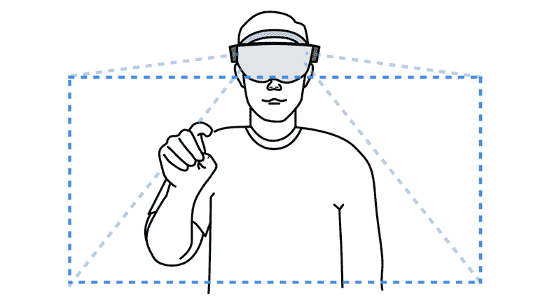
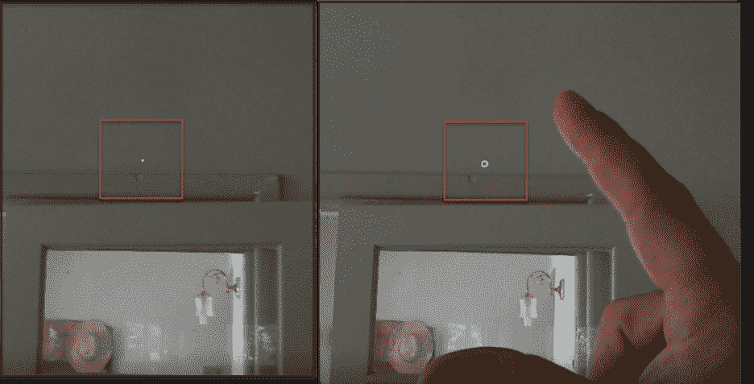
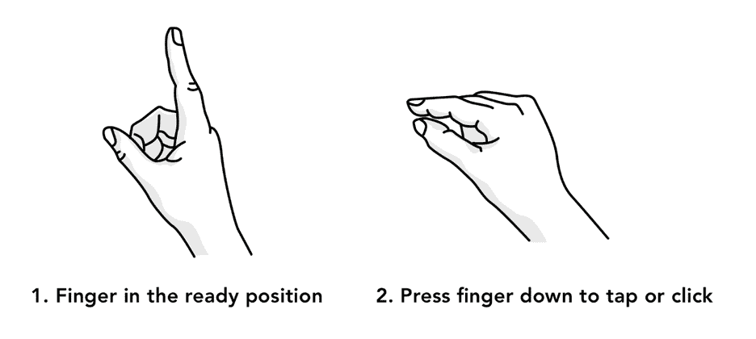
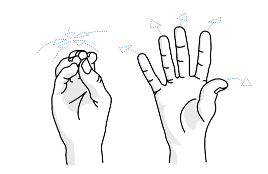
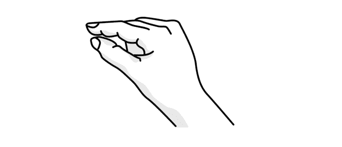
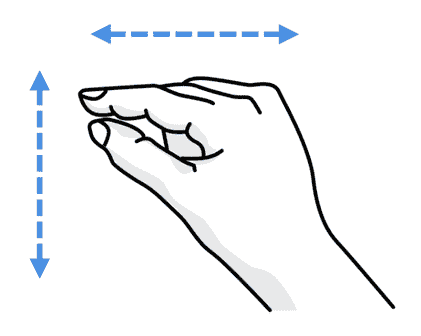
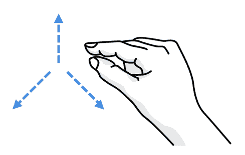

# 第五章手势

如果你见过有人使用全息镜头，你可能已经注意到用户是如何在空中移动手臂和手的。这些手势是全息镜头的第二种输入，也是用于全息镜头混合现实体验的凝视-手势-声音(GGV)输入模型中最受认可的部分。正如您将看到的，从编程的角度来看，手势的实现并不困难，但是您必须非常注重体验的设计，以及在哪些点上您允许某些手势。

当用户执行手势时，他们是在手势框架内执行的。这个框架定义了全息镜头获取用户手势的边界。如下图所示，用户的两侧大约有几只脚。



图 24:手势框架

如果用户在框架边界之外执行手势，手势将停止工作。如果像导航这样的手势全部或部分发生在手势框架之外，一旦看不到手势，全息镜头就会丢失输入。这可能会造成混乱，应该管理体验中的正确响应。

为了帮助用户了解他们何时在框架内或框架外执行手势，全息透镜光标将改变形状(图 25)。如果看不到手势，那只是一个点。如果看到就绪状态(参见下一节)，则它是圆形或环形。



图 25:手外内手势框

手势框架完全由框架管理，不需要编码来利用它。然而，需要考虑与手势的交互，例如如果手势输入丢失，体验会发生什么。打破手势框架边界的后果应该最小化。一般来说，这意味着一个手势的结果应该在边界处停止，但不能反转。带用户踏上旅程，教育他们如何处理各种异常。

全息镜头体验最基本的手势是敲击。这个常用的手势由 HoloLens 可以识别的三个基本手势中的两个组成:就绪和轻击。



图 26:准备好并点击位置

敲击包括将手指从准备位置快速移动到按压位置，然后再返回。大多数情况下，轻击事件之前，用户会盯着全息图进行选择。tap 由框架捕获，您可以用代码处理该事件。

使用的关键对象是`GestureRecognizer`，处理所有的平台手势事件。要监听和处理`Tap`事件，请使用以下代码。

代码清单 2:处理简单的敲击手势。

```cs

  recognizer.Tapped += (args) =>
  {
      // Do
  something when tap event occurs.

  };
  recognizer.SetRecognizableGestures(GestureSettings.Tap
  | GestureSettings.Hold);
  recognizer.StartCapturingGestures();

```

当然，代码清单 2 中的代码在一个脚本中，它被附加到用户点击的对象上。一个重要的性能优势是使用`SetRecognizableGestures`通知`GestureRecognizer`为哪些手势引发事件。

|  | 注意:Unity 中的`Args`使用委托来实现，而`EventArgs`使用事件。 |

|  | 提示:避免使用。NET 导入`System`命名空间，因为它与`UnityEngine`命名空间有几处冲突。 |

除了就绪和按下之外，全息透镜框架可以识别的第三个手势是绽放。这个手势是“主页按钮”，相当于在标准键盘上按下窗口键，它包括伸出手掌，指尖并拢，然后张开手(图 27)。



图 27:绽放姿态

bloom 手势不能通过代码覆盖或操作。当用户执行手势时，会出现两种情况之一:开始菜单打开或关闭，或者用户退出当前运行的体验。这些都是故障安全的，没有任何方法可以阻止用户使用 bloom。

虽然全息镜头目前只支持两种基本手势，但您可以使用就绪和按下状态以及 3D 空间来执行更高级的手势。这些也受到框架的支持，并带有自己的一组事件，您可以在代码中处理这些事件。

这些高级手势可以在任何时候使用，全息镜头的设置可以教育用户。它们是框架的一部分，因此应该在您的经验中适当使用。

第一个手势是按住，这是用户从就绪位置按下，然后按住手指。这对于交替敲击动作、激活全息图的重定位、暂停全息图等等非常有用。

与其他内置手势一样，您不必识别手势何时发生，只需倾听特定事件即可。要处理保持手势，请倾听以下三个事件:

*   `HoldStarted`:当系统识别出用户已经开始保持手势时，该按钮会触发。
*   `HoldCompleted`:当系统识别出用户已经完成了保持手势时，该按钮将会触发。这通常是当用户在不移动手的情况下从按压状态改变到准备状态时。
*   `HoldCanceled`:当系统识别到用户取消了保持事件时，该选项将触发。通常，当用户的手移出全息镜头的手势框时，就会发生这种情况。



图 28:保持手势

代码清单 3 显示了一个如何处理`Hold`事件的例子。

代码清单 3:保持启动事件处理

```cs

var recognizer = new
  GestureRecognizer();
  recognizer.HoldStarted += (args) =>
  {
      // Do
  something when hold started event occurs.

  };
  recognizer.StartCapturingGestures();

```

一旦他们做了一个保持手势，用户的一个自然动作就是尝试移动他们瞄准的全息图。水平或垂直移动手将触发操作手势事件。当您希望全息图对用户的手部动作做出 1:1 的反应时，可以使用操纵手势来移动、调整大小或旋转全息图。



图 29:操纵事件

要使用操作，请在代码中监听和处理这些事件:

*   `ManipulationStarted`:当系统识别到用户已经开始了一个操作手势时，这个按钮就会触发。
*   `ManipulationUpdated`:当用户在执行操作事件时移动他们的手时，手势目的地的新坐标被生成并传递到`ManipulationUpdatedEventArgs`对象中。
*   `ManipulationCompleted`:当系统识别出用户已经完成了一个操作手势时，这个按钮就会触发。这通常是当用户在水平和/或垂直移动手之后从按压状态变为准备状态时。
*   `ManipulationCanceled`:当系统识别出用户已经取消了一个操作事件时，这个按钮就会触发。通常，当用户的手移出全息镜头的手势框时，就会发生这种情况。

代码清单 4:操作启动的事件处理

```cs

  var recognizer = new
  GestureRecognizer();
  recognizer.ManipulationStarted += (args) =>
  {
      // Do
  something when the ManipulationStarted event occurs.

  };
  recognizer.StartCapturingGestures();

```

操纵手势通常用于使用保持手势滚动页面，然后上下移动手，或者用于在 2D 平面中移动全息图。

第三个(也是最复杂的)手势是导航。它像一个标准化的三维立方体中的虚拟操纵杆一样工作。用户可以沿着 X、Y 或 Z 轴从-1 到 1 移动他们的手，0 是起点。

导航手势通常用于将全息图从一个位置移动到另一个位置，调整对象大小，以及执行更复杂的任务，如基于手移动量的速度动作。这是一个非常自然的手势，因为你正在 3D 空间中移动你的手，实际体验也是 3D 的。



图 30:导航事件

要在体验中使用导航，您可以处理四种不同的事件:

*   `NavigationStarted`:当系统识别到用户已经开始了导航手势时，这个按钮就会触发。
*   `NavigationUpdated`:当用户在执行导航事件时移动他们的手时，手势目的地的新坐标被生成并传递给`NavigationUpdatedEventArgs`对象。
*   `NavigationCompleted`:当系统识别出用户已经完成了导航手势时，该按钮会触发。这通常是当用户在有界 3D 立方体中移动手之后从按压状态改变到准备状态时。
*   `NavigationCanceled`:当系统识别到用户已经取消了导航事件时，该按钮将会触发。通常，当用户的手移出全息镜头的手势框时，就会发生这种情况。

代码清单 5:处理导航更新事件

```cs

  var
  recognizer = new GestureRecognizer();
  recognizer.NavigationUpdated += (args) =>
  {
      // Set
  a position for something to the updated position when the
      // NavigationUpdated event occurs.
      NavigationPosition = args.normalizedOffset;
  };
  recognizer.StartCapturingGestures();

```

|  | 注意:用户经常会不小心从操作变成导航。您可以通过管理要监听的事件来控制和帮助用户编写代码。 |