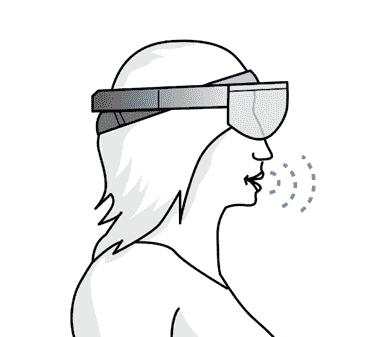
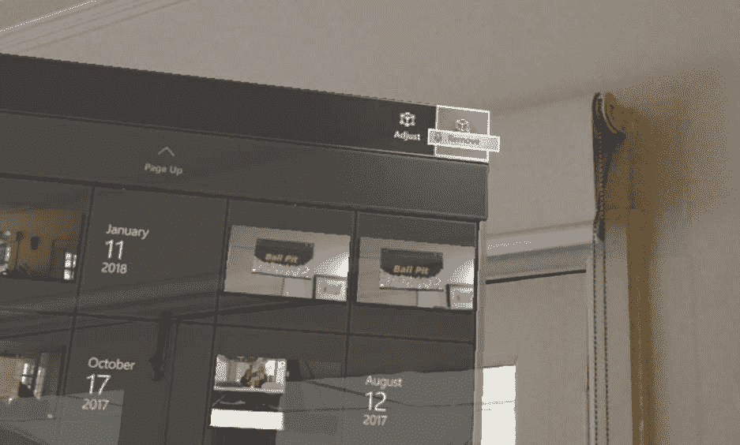

# 六、语音

全息镜头是市场上最好的语音识别设备之一。因为你总是把麦克风放在设备的同一个位置，所以设备可以非常准确地破译你的咕哝和断句。语音是 HoloLens 的 GGV 范式中的第三种输入法，它与前两种一样重要。

预计您可以使用大多数(如果不是全部的话)动作和与语音命令的交互。如果有移动全息图的手势，也应该有语音命令。

语音命令旨在简化交互模型，使体验更加愉悦，并增强用户的沉浸感和参与度。如果不是这样，要么你的交互模式可以改进，要么你的语音设计有所欠缺。

本章将解释如何最大限度地利用 GGV 输入模型的语音部分，以及一些陷阱在哪里。



图 31:语音命令和HoloLens平台

首先是平台提供的语音命令。全息镜头设备有许多免费的命令，随着时间的推移，用户会逐渐熟悉这些命令。作为开发人员或体验所有者，您可以使用它们来增强项目。

用户可以随时说“选择”，而不用点击手势这将触发`Tapped`事件，与用户执行的轻击手势相同。您的应用程序不会知道区别，在代码中，您将像处理任何其他`Tapped`事件一样处理该事件。

用户将听到一种声音，并看到带有“选择”字样的工具提示作为确认出现。Select 由低功耗关键字检测算法支持，因此它始终可以在任何时候说出，对电池寿命的影响最小，即使用户将手放在身边。

类似于选择命令，用户可以说“放置”来触发轻击事件以放置全息图。当选择是执行敲击事件的更广泛的命令时，放置是专门为放置或放下全息图而设计的。

当用户凝视全息图时，他们可以说“面向我”，全息图将转向用户。这需要全息图有一个前方被识别以允许转弯发生。这在 2D 应用程序上非常有效，这些应用程序相对于用户的位置总是处于一个有趣的角度。

如果全息图可以调整大小，请使用“更大”或“更小”命令来调整大小。这通常也可以通过手势或语音命令和手势的组合来实现。

Cortana 是微软的数字助理，可以跨运行 Windows 10 的设备工作。HoloLens没有什么不同。Cortana 总是在听“嘿 Cortana”这个词，它会触发蓝色女士。

|  | 注:Cortana 是以《光环》电子游戏系列中虚构的智力角色命名的。 |

一旦你引起了她的注意，你可以用很多内置的命令来让 Cortana 执行你的命令:

*   *我能说什么？*
*   *回家*或*去开始*(而不是[开花](https://developer.microsoft.com/en-us/windows/mixed-reality/Gestures.html#bloom)去[开始菜单](https://developer.microsoft.com/en-us/windows/mixed-reality/Navigating_the_Windows_Mixed_Reality_home.html#start_menu)
*   *启动< app >*
*   *移动< app >到这里*
*   *拍照*
*   *开始录制*
*   *停止录制*
*   *增加亮度*
*   *降低亮度*
*   *增加音量*
*   *降低音量*
*   *静音*和*取消静音*
*   *关闭设备*
*   *重启设备*
*   *睡觉*
*   *现在几点了？*
*   *我还剩多少电池？*
*   *呼叫<联系>* (需要 HoloSkype)

HoloLens 不提供桌面上 Windows 10 的全套 Cortana 功能和命令，目前唯一支持的语言是英语。

当全息镜头体验中的按钮上有标签时，用户可以使用“看到它，说出来”的方法来触发按钮按压。例如，在查看 2D 应用程序时，用户可以说出“remove”命令，然后他们会在应用程序栏中看到该命令以关闭该应用程序。



图 32:说“移除”来触发移除按钮

强烈建议您遵循这一规则，因为用户可以很容易地理解要说什么来控制系统。为了加强这一点，当你盯着一个按钮时，你会看到一个“麦克风”工具提示，如果按钮是语音启用的，它会在一秒钟后出现，显示命令说话“按下”它。

所有内置命令都很棒，但 HoloLens 平台的真正强大之处在于创建自己的语音命令。虽然为您的全息镜头体验创建基本的语音命令相对来说很简单，但是在构建系统时需要注意一些细微差别。

首先，让我们看看实现基本语音命令的代码。最常用的特征是`KeywordRecognizer`对象。它监听任何语音输入，并将任何口语短语与已知的关键词列表进行匹配。这些关键词在体验开始时注册。

代码清单 6:关键字识别器实现

```cs

  KeywordRecognizer recognizer = null;
  Dictionary<string,
  System.Action> keywords = new
  Dictionary<string, System.Action>();

      keywords.Add("Open e-Book", () =>
      {
          //
  Call the OpenBook method on every descendant object.
          this.BroadcastMessage("OpenBook");
      });

      //
  Tell the KeywordRecognizer about our keywords.
      recognizer = new
  KeywordRecognizer(keywords.Keys.ToArray());

      //
  Register a callback for the KeywordRecognizer.
      recognizer.OnPhraseRecognized +=
  KeywordRecognizer_OnPhraseRecognized;
      recognizer.Start();
  }

```

在代码清单 6 中，我们创建了一个`Dictionary`来保存与关键字相关联的`Action`。关键字是框架要识别的短语。我们创建一个识别短语的事件处理程序，然后启动`KeywordRecognizer`。(别忘了启动！)

下一步是处理从`Action`发送的`OpenBook`事件。还有其他方法来创建语音命令和动作，但它们都围绕着`KeywordRecognizer`进行。

|  | 提示:使用混合现实工具包功能来实现语音命令，以获得更强的健壮性和抽象性。 |

虽然语音命令在技术上很容易实现，但创建有效且设计良好的语音命令要困难得多。对于用户如何感知、记忆和使用语音命令来获得给定的体验，有很多理论和心理学。

表 2:语音命令的注意事项

| **做** | **不要** |
| --- | --- |
| 简明扼要，不要在命令中使用不必要的词语。简洁更容易记住。 | 使用单音节命令。这些更容易被系统遗漏，并可能因方言和口音而被误解。 |
| 使用容易学习和记忆的常用词。 | 使用系统命令。例如，“选择”命令已经分配给系统范围的功能。 |
| 保持一致。在不同的地方对相同的动作使用相同的命令。 | 使用听起来相似的命令。它们更难正确记忆，系统也更难准确无误。 |

创建既易于记忆又符合体验环境的自然命令非常重要。例如，使用命令“打开舱口”不像“打开门”那么容易记住

|  | 提示:HoloLens 平台提供的语音识别 API 和工具都是硬件加速的。这比中央处理器处理语音输入要少得多，除非必要，否则您应该避免构建自己的语音识别功能。 |

当在一个主要是可视化的平台上使用语音命令时，很大一部分挑战是知道什么时候使用语音命令，甚至知道它们是什么！教育用户如何以及何时在您的体验中使用语音命令至关重要。教育用户的一些方法包括:

*   当命令可用时，创建可视线索，例如旁边写有命令的麦克风图标。
*   使用向导过程指导用户学习任何语音命令。
*   在体验或体验水平之前有一个简短的教程，展示任何需要的命令或手势。

对用户的教育是让你的体验成功的关键。如果用户不“了解”如何使用可用的工具，他们会很快放弃并继续前进。

创造有效的体验和有效的语音命令的一部分是要有双向的交流。如果你一直对用户大喊大叫，他们会生气离开。相反，确保他们知道体验何时在倾听他们的命令，当你处理完命令时给出音频或视频提示，并让他们保持参与。

另一种利用 GGV 输入范例中语音识别部分的方法是`DictationRecognizer`。如果您的应用程序中有需要大量用户输入的部分，这将提供出色的用户体验。HoloLens 屏幕键盘使用起来很麻烦，主要是因为你必须盯着每个字母，然后点击。

使用`DictationRecognizer`与`KeywordRecignizer`非常相似。事实上，它们是如此的联系在一起，以至于你在任何时候都只能在你的应用程序中注册其中一个。

代码清单 7:创建一个听写识别器并设置它

```cs

  DictationRecognizer recognizer = new DictationRecognizer();

  // This event
  continually returns what has been heard so far.
  recognizer.DictationHypothesis += DictationRecognizer_DictationHypothesis;

  // This event fires at
  any pauses in dictation. It returns the full recognized string.
  recognizer.DictationResult += DictationRecognizer_DictationResult;

  // This event fires when
  the recognizer stops.
  recognizer.DictationComplete += DictationRecognizer_DictationComplete;

  // Stop any
  KeywordRecognizers.
  PhraseRecognitionSystem.Shutdown();

  Recognizer.Start()

```

通过使用代码清单 7 中的事件，您可以为用户管理优雅的听写体验。因为 HoloLens 上的麦克风相对于用户的头部总是处于相同的位置，所以语音识别的效果非常好。结合硬件加速麦克风和处理，它使 HoloLens 成为一个非常强大的语音识别设备。语音听写特别适合像网址这样的东西，用户可以拼出整个地址。

|  | 注意:您需要无线网络连接才能使用听写功能。 |

与`DictationRecognizer`密切相关的是`GrammarRecognizer`。它使用语音识别语法规范[<sup>【5】</sup>](HoloLens_Succinctly_0014.htm#_ftn5)(SRGS)文件来定义语法检查规则。SRGS 文件指定了要由语音识别器监听的单词和单词模式。

语音识别功能强大得令人难以置信，使用 SRGS 文件将创建体验的结构和指南。语音识别语法是定义一组约束的语言规则的容器，语音识别器可以使用这些约束来执行识别。

代码清单 8:创建一个语法认知器并设置它

```cs

  GrammarRecognizer recognizer = new GrammarRecognizer(<path to SRGS file>);

  grammarRecognizer.OnPhraseRecognized += GrammarRecognizer_OnPhraseRecognized;
  grammarRecognizer.Start();

  private void
  GrammarRecognizer_OnPhraseRecognized(PhraseRecognizedEventArgs args)
  {
      // Use
  this to build up the recognized message from each rule.
      StringBuilder messageHeard = new
  StringBuilder();

      //
  This array contains the results of the SRGS rules the recognizer heard.    
      SemanticMeaning[] meanings = args.semanticMeanings;

      foreach (SemanticMeaning meaning in meanings)
      {
               messageHeard.Append(meaning);
          }
  }

```

在代码清单 8 中，当`GrammarRecognizer`识别出符合 SRGS 规则的短语时，`GrammarRecognizer_OnPhraseRecognized`事件处理程序被触发。然后我们建立了一个听到的内容的基本列表。在一个真实的项目中，你当然会对单个语义含义做出反应，并让你的经验做出相应的反应。

|  | 提示:使用 SGRS 文件使体验更容易移植，因为这是定义语音识别短语的标准。 |