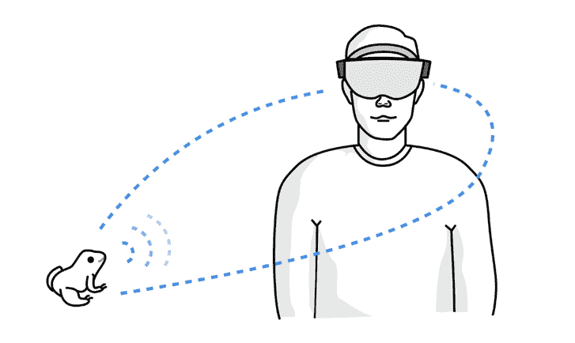
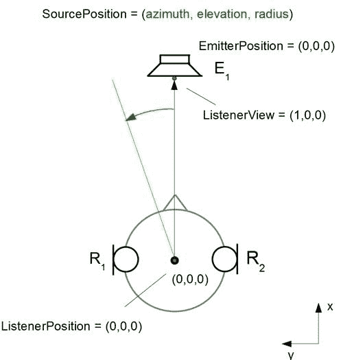
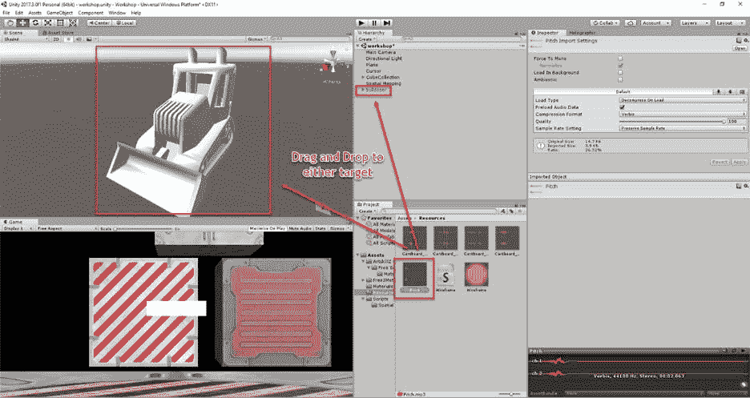
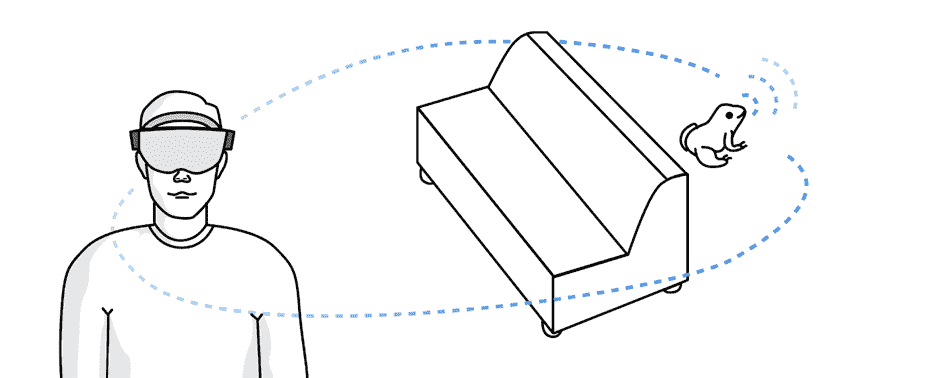

# 第七章声音

当用户浏览全息镜头体验时，他们无法跟踪周围发生的一切。这部分是因为人脑只能同时处理这么多输入，部分是因为设备的视野有限。声音可以为帮助用户导航和信任它的体验提供基础和参考。

在全息镜头体验中，声音通过提供距离和方向来模拟环境。全息镜头上的高精度实时扬声器提供的音频就像是真实的体验一样。虽然视觉效果受限于用户的视角和设备上镜头的物理框架，但音频可以来自各个方向。

我们的人耳在处理来自各个方向和距离的声音方面已经非常出色。这种空间声音是我们自然宇宙的一部分，为了创造一种既自然又令人信服的全息透镜体验，音频以类似的方式工作是至关重要的。这是通过空间声音来完成的，这意味着声音从特定的位置发出，当用户在空间中移动时，声音会停留在相同的位置。这是全息镜头体验不可或缺的一部分，虽然不是 GGV 范式的一部分，但与凝视、手势和声音一样重要。



图 33:空间声音

为了模拟和复制人耳的功能，全息透镜实现了一个头部相关的传递函数(HRTF)。这种算法模拟了耳朵从空间任何一点接收声音的频谱响应。每个声音的位置，通常附加在全息图上，使用全息透镜的四个扬声器来计算和模拟。



图 34: [头部相关传递函数](https://commons.wikimedia.org/w/index.php?curid=36746864)(用户:Pitbub，CC BY 3.0)

声音撞击每只耳朵的时间是不同的，这就是我们人类如何感知声音的方向和距离。HRTF 非常好地模拟了这个时间，全息透镜硬件实现了它。人类只有两只耳朵，但我们可以在三维空间定位声音:在范围内(距离)；在上面、下面、前面和后面的方向；两边都是。全息透镜支持所有的双耳功能。

虽然 HRTF 非常复杂，并且因人而异，但全息透镜的实现非常精确。最棒的是，作为一名开发人员，你完全不用担心这个问题——为你的全息图实现音效既简单又快速。

在全息镜头应用程序中使用空间声音比你想象的要简单。为全息图实现声音设计的最简单方法是使用 Unity 将声音文件拖放到 3D 对象上，然后在检查器面板中对其进行配置。



图 35:Unity 3D 中的空间声音实现

这就是你需要做的一切，为全息图创造一个基本的空间声音。该框架将负责计算 HRTF，并持续确保使用全息透镜从全息图中投射声音。

当然，将音频静态链接到全息图并不能涵盖所有场景。通常，您希望在代码中触发声音，并通过交互和动作来管理它。这是通过脚本完成的，就像平台的其他部分一样，并通过操纵`AudioSource`对象来使用您在检查器面板中使用的相同属性。

代码清单 9:在代码中创建音频源并触发它

```cs

AudioSource audioSource = gameObject.AddComponent<AudioSource>();
  audioSource.playOnAwake = false;
  audioSource.spatialize = true;
  audioSource.spatialBlend = 1.0f;
  audioSource.dopplerLevel = 0.0f;
  audioSource.maxDistance = 15.0f;
audioSource.rolloffMode = AudioRolloffMode.Logarithmic;

audioSource.clip = Resources.Load<AudioClip>("<some clip>");
// Occurs when this object starts colliding with another object.
void OnCollisionEnter(Collision collision)
  {

  //
  Play an impact sound if there is an impact.

  if (collision.relativeVelocity.magnitude >= 0.2f)

  {

  audioSource.Play();

  }
  }

```

|  |
| 注:Unity 3D 使用类型`float`代替`double`。 |

在代码清单 9 中，创建了一个新的`AudioSource`对象，配置了它的一些属性，然后在一个内置事件`OnCollisionEnter`中播放音频。

HoloLens 体验中空间声音的实际实现并不复杂，也不难编程。与前面提到的大多数基本 HoloLens 开发部分一样，您只需要了解 C#和一些基本工具。

困难的部分是为你的特殊体验设计声景，并理解各种决定将如何影响它。在为你的体验设计声音时，有大量的变量需要考虑，但是只要有一点仔细的计划和注意，它就能在普通和出色的体验之间产生巨大的差异。

表 3 中的列表显示了为了获得完整的声音体验，您必须解决的一些常见问题。

表 3:声音设计提示

| **区域** | **动作** |
| --- | --- |
| 常化 | 为声音文件创建标准的标准化基线音量。这将使它们在将来的更新中保持可维护性。 |
| 活动 | 请注意，用户会在他们占据的空间内移动。你的声音必须符合那种体验。 |
| 准确(性) | 用户可以自由移动，这意味着他们将接近全息图。声音需要从全息图上的准确位置发出。例如，恐龙的吼声不应该来自它的脚。 |
| 自然的 | 全息透镜体验的整个想法是让用户相信全息图是真实世界的一部分。创造自然的声音对实现这一点有很大的帮助。鹰应该听起来像鹰，敲木头也应该听起来像鹰。 |
| 预期 | 每个用户都会对他们听到的声音有所期待。基于熟悉度，用户会对某些类型的声音有“编码”反应。如果他们听到鸟叫，他们会抬头看。如果他们听到自己的名字，他们会看着眼睛的高度寻找声音的来源。 |
| 隐藏的声音 | 如果声音不熟悉，或者它们是可以被识别为来自可见来源的声音，不要隐藏声音的发射器。如果用户找不到发出声音的东西，这可能是一种非常负面的体验。像风一样的熟悉的声音是例外，这些声音预计不会被看到。 |

|  | 提示:在为全息镜头体验设计声音时，请考虑真实世界场景的声音效果。 |

能够在 Unity 中的 3D 资产上拖放声音片段，或者在代码中附加一个新的`AudioSource`的陷阱之一是，你可以非常快地以大量的声音结束——所有的声音同时播放！突然有这么多声音，用户一个都听不到。它变得不自然，令人无法抗拒，令人沮丧。

微软建议你在全息镜头上达到 70%的混合音量。这将允许真实世界的声音仍然可以听到，你将创建一个适当的混合现实声景。

全息透镜(通常也是虚拟现实)使用的一种常见技术是调低用户看不到或看不到的全息图的音量。使用凝视应用编程接口，当全息图进出用户视野时，您可以上下调节音量。这将使注意力更容易集中在他们面前的视觉效果上。这项技术也可以用来在你想吸引用户注意力的看不见的全息图上调高音量。

全息镜头上成功和令人信服的体验的一部分是它给增强现实和虚拟现实应用带来的真实感。如前所述，你希望用户投入并沉浸其中，以至于不自觉地区分真实和数字。

说到声音，你应该用它来增强你的应用的真实感。如果你有一个木制椅子全息图，那么也许有一些“木制”的声音效果来放置或移动椅子。让您的用户购买体验。

为了进一步鼓励互动，将凝视和声音结合起来。如果在给定的上下文中或在特定的时间有用户应该意识到的重要对象，您可以使用声音剪辑来引导和引导用户的注视。它可以是一种随着用户靠近而音量增大的声音，也可以是更多的信标信号，或者任何适合用户体验的声音。

手势也是如此。因为手势是非触觉动作，所以用声音来表示手势的结果是非常有力的。如果用户正确地轻敲了一个物体，通过听觉提示让他们知道。如果用户试图在不正确的时刻点击某个对象，也要让他们知道这一点。

如前所述，没有空间映射就没有全息透镜体验。它是将数字与现实生活结合在一起的粘合剂，也是所有纯全息镜头体验的基础。声音也没什么不同。您希望相关的声音效果成为体验的一部分，无论用户是与空间映射创建的 3D 模型的一部分进行交互，还是与数字资产进行交互。

当涉及到声音和空间映射时，主要的设计决策是如何处理遮挡。当全息图在 3D 映射的物理物体后面时，声音设计应该自然地处理这一点。



图 36:空间声音的遮挡

从程序上讲，声音遮挡是通过识别全息图和用户之间是否有物体来实现的，如果有，则对全息图应用适当的效果。最常见的效果是降低音量和音高。想象一下，听到关着的门后面有声音——比用户打开门时更低沉，音量也更低。