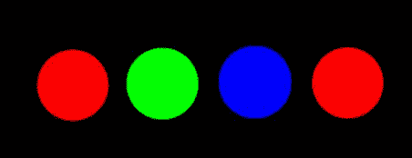
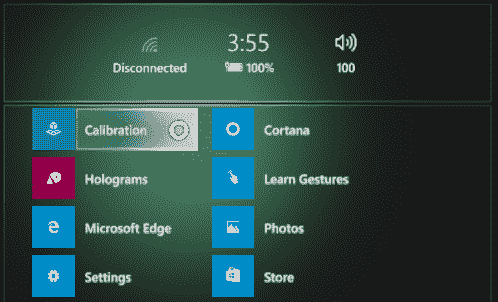
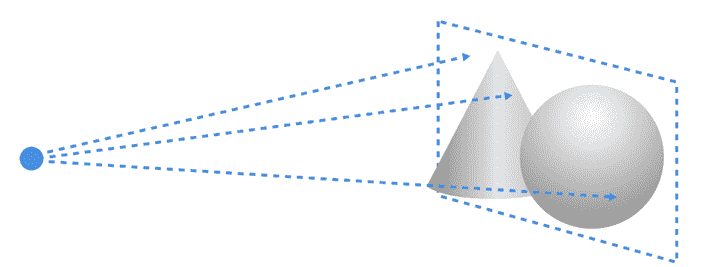

# 八、全息图质量

到目前为止，您已经了解了如何实现和设计您的HoloLens体验。重点是创造现实的和“增强世界”的体验，为用户提供价值。尽可能优化你的代码和体验，比如提供凝视引导、听觉线索和直观难忘的语音命令，你的全息图也必须有很高的质量。

正如你将会学到的，当谈到全息图时，质量意味着一些事情。

在混合现实中创造高质量全息体验的绝对支柱是帧率。你的应用程序应该以 60hz 运行，这意味着帧每秒更新 60 次。相比之下，你在电影院看的标准电影每秒有 24 帧(fps)。换句话说，您必须大约每 16 毫秒从应用程序向操作系统提供一个新映像。

让全息图与现实世界互动的部分错觉是，它们是从用户的位置和视角呈现的。HoloLens的速度不足以实时呈现全息图，它使用预测算法来估计用户的头部在任何时候可能在哪里。此外，全息镜头硬件将调整用户头部预测位置和实际位置之间的任何差异。

通过确保每秒 60 帧的恒定体验，作为开发人员，您正在尽最大努力让硬件实现最佳性能。通过最大限度地减少延迟，您还可以提高全息图的稳定性，减少预测误差。延迟和帧速率的问题在通常以 90 fps 运行的虚拟现实设备上甚至更高。

|  | 提示:提供低于 60 fps 的帧率会很快失去用户。 |

从应用程序中提供较低的帧速率也会使硬件和用户对体验的接受度变得紧张。想象一下你的应用程序以 30 fps 的速度运行。HoloLens仍然以 60 fps 的速度渲染显示，因此每个图像渲染两次。第二幅图像在呈现到显示器之前需要更多的错误位置计算。

总的来说，提供 60 fps 的稳定帧速率将有助于减轻抖动(参见下一节)。

|  | 提示:请记住，提供始终较低的帧速率比不一致的帧速率更好。 |

以下是一些可以帮助您调试帧速率问题的工具:

*   Visual Studio 的图形调试器
*   gpuvview
*   [Unity 3D 中的探查器窗口](https://unity3d.com/learn/tutorials/temas/performance-optimization/diagnosing-performance-problems-using-profiler-window)

全息图质量的缺乏有许多原因。能够识别全息镜头体验中可能发生的各种问题非常重要。有些症状你可以通过更好的应用程序开发来解决，有些症状用户需要在他们的设备上解决。

全息图必须始终保持在同一个位置。即使当用户进行小的头部运动或他们的位置改变时，全息图的视图也必须相对于周围环境完全稳定，如空间映射所映射的那样。如果全息图移动位置，会有精度问题，这会导致体验失败或给用户带来不适。

当两个位置看起来相似时，通常会导致精度问题。这是创建 HoloLens 体验的陷阱之一，尤其是如果用户在没有家具或家具很少的方形房间里。空间映射变得如此相似，以至于位置混淆，精度受到影响。

HoloLens设备本身在用户看到的显示器上依次显示红色、绿色和蓝色。每种颜色都叠加在其他颜色上，形成一个完整的色谱。这种情况以每种颜色 60hz 的频率发生，尽管速度很快，但如果用户快速移动头部，或者全息图在体验中移动得非常快，也会出现一些颜色分离。白色尤其会受到颜色分离的影响，因为它们包含了所有的颜色层。

如果你想移动一个全息图，保持每秒 5 度以下的移动，如果它需要用户凝视或头部移动。另一种非常简单的对抗分色的方法是让物体变成红色、绿色或蓝色。当资产在场景中移动时，您也可以切换到模糊版本。这将使用户更容易接受全息图中的颜色缺陷。

图 37:当用户从左向右移动视线时，白色圆圈的颜色感知

当用户体验到全息图偏离其原始位置时，这被称为漂移。因为全息图是使用空间锚相对于现实世界锚定的，所以它不是一个完美的位置。现实世界可能会改变，或者最初对位置、位置和距离的估计可能会偏离。需要空间锚来确保全息图停留在你放置它们的地方，如果全息图离空间锚太远，它们会偏离锚。

|  | 注意:你如何管理漂移通常是基于你的经验。你不想要太多的空间锚，因为这会影响准确性，但你也不想全息图离它们太远。 |

如果对房间的跟踪开始下降，或者HoloLens创建的 3D 模型存在不一致，全息图可能会以相对较高的频率开始抖动。这被称为抖动。

要解决抖动问题，最有可能的是用户需要调整设备上的传感器[【6】](HoloLens_Succinctly_0014.htm#_ftn6)。作为开发人员，您对空间映射及其性能没有太多的控制。

低帧速率的症状之一是图像抖动。当帧速率上下跳动时，设备很难向用户呈现一致的图像。这可能会导致图像重影，或位置突然跳跃。正如本章“帧速率”一节中提到的，最重要的是你要提供 60 fps，如果不可能，至少要保持稳定的 fps。

全息图可能会突然从一个位置跳到另一个位置。这种效应与抖动密切相关。然而，抖动与较差的帧速率性能有关，跳动通常发生在设备更新对周围环境的了解时。对环境的新的和更新的理解可以导致全息图投射到哪里的重新映射，这使得它们跳跃。

如果全息图与用户头部的运动同步，它会给用户造成一种奇怪的分离感。这被称为游泳。当全息图不在稳定平面上时，会发生这种情况(见下一节)。开发者和用户必须通过在设备上运行校准应用来解决这个问题。

图 38:HoloLens上的校准应用

虽然一般来说你不必解决或关心全息图的稳定性，但开发人员有一个单一的责任。每个全息图都是通过硬件稳定的，但它需要一个单一的参考点来最大限度地发挥这一功能。稳定平面是在设备和应用程序或编程器之间选择的单个“切片”或窗口。稳定平面中的全息图通常是 app 的焦点，比其他全息图获得更精确的稳定。

图 39:三维场景中的稳定平面

应用程序可以通过使用`SetFocusPoint()`设置体验的最佳当前焦点来帮助硬件识别稳定平面。这纯粹是应用开发者的主观决定，他们希望应用用户观察和关注什么。

因为稳定平面上的所有全息图都是完美稳定的，所以你应该在上面放置尽可能多的全息图。这可能需要一些尝试和错误，但为了避免游泳全息图和防止你的用户从他们的午餐访问，这是值得做的。

需要考虑的几件事:

*   如果你要调整稳定平面，不要只做一次。用户不停地移动，全息图来来去去。
*   避免焦点在短时间内发生多次变化，尤其是在相距较远的点之间。
*   切勿将稳定平面设置在用户上方或非常靠近用户。这是令人困惑的，可能会给用户带来不适。