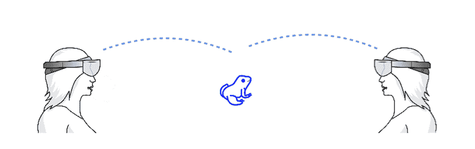
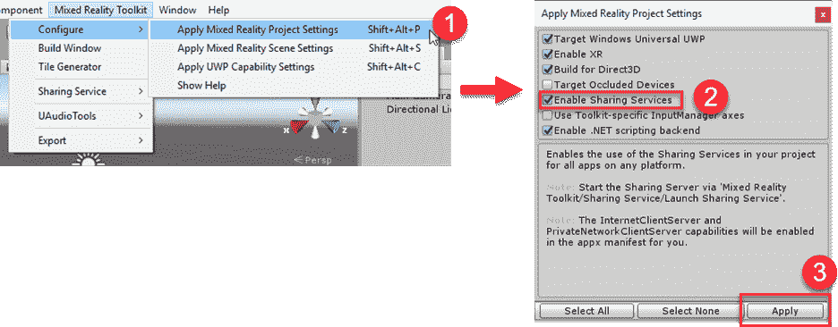
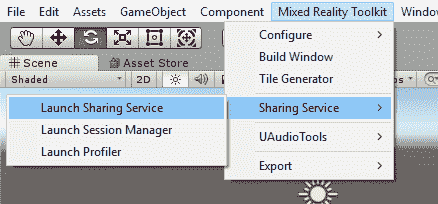
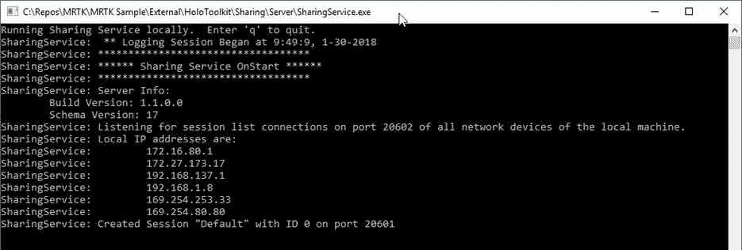

# 第十章共享全息图

全息透镜最令人兴奋的特性之一是协作方面。首先创造和操纵全息图是令人兴奋和突破性的。以令人信服的方式在数字和物理对象之间进行交互是令人鼓舞的，它开辟了许多可能性。但是，当您向多个用户介绍相同的 HoloLens 体验时，影响会呈指数级增加。让两个或两个以上的用户观看完全相同的体验既强大又有说服力。



图 48:设备间共享同一全息图

这本电子书触及了许多需要为全息镜头体验做出的设计决策。同样的想法和关注适用于创建共享的经验，以及一个全新的维度来考虑。

### 分享风格

内容可以通过几种方式共享。你可以向旁观者展示一种体验，在那里你可以控制内容。例如，这对于教授学生关于人体的知识非常有用。老师会仔细检查材料，所有学生都会实时看到。老师可以实时分享笔记，学生可以互动和复制。

当然，您可以在用户之间就相同的体验进行协作。在前面的场景中，学生可以被邀请与全息图互动，并操纵全息图的一部分来参与学习。

最后，您可以让一个用户指导一个或多个用户体验。例如，老师可以通过引导学生体验来帮助他们完成作业。

了解用户在共享体验中的位置非常重要。您可以拥有共享同一物理空间的同处一地的用户、远程用户和各自位于自己物理空间的用户，或者两者的组合。了解用户在分享体验时所处的位置，可以帮助您设计沟通模型，并考虑用户如何相互表示、体验的哪些部分被分享、是否需要考虑某些可能不存在的物理特征等等。

理想情况下，用户在同一个位置，因为这是迄今为止全息镜头上最好的共享体验。然而，情况并非总是如此，您可能能够通过远距离协作来解决业务案例。

通常，您会期望用户在共享体验中同时协作。两个或更多用户将共享一种体验，并同时参与其中。这意味着状态是实时管理的，协作通常有一个明确的结论。

然而，有时用户会在共享体验上异步工作。这造成了一些需要解决的障碍，因为需要管理状态来确保协作成功，房间可能会在会话之间发生变化，因此映射需要更新等等。

交互模型与单一用户体验相同，尽管您现在需要管理可能同时与同一对象交互的多个用户。这需要一个实时更新到公共数据仓库的公共参考点。这通常使用在整个集中式服务器实例中通信的空间锚来完成。

从开发的角度来看，您需要管理每个用户所做的更改，然后更新中心坐标集合。

幸运的是，您不必创建自己的服务来共享空间锚点坐标。使用混合现实工具包，您可以在创建和配置共享服务时获得帮助。进入**混合现实工具包**菜单，选择**配置** > **应用混合现实项目设置**(图 49)启用。



图 49:使用混合现实工具包启用共享服务

这将在您的项目中安装必要的组件，当您想要开始共享体验时，您可以再次使用混合现实工具包菜单来启动共享服务(图 50)。每次分享体验，你只需要为一台电脑做一次。



图 50:使用混合现实工具包启动共享服务

这将在您启动共享服务的电脑上启动共享服务，这是其他全息镜头设备将连接到的实例。



图 51:本地网络上运行的共享服务

在分享体验中，必须保持将数字资产放入现实世界的混合现实错觉。作为开发人员，您必须传达对全息图放置的任何更改，以便所有其他连接的设备可以相应地更新它们的体验。与此同时，您还必须从其他用户那里收到更新的位置，并且这一切都必须实时发生。

代码清单 11:接收更新的全息图位置

```cs

  // Use the CustomMessages singleton to transmit messages between
  devices.       
  CustomMessages.Instance.MessageHandlers[CustomMessages.TestMessageID.StageTransform]
  = this.OnStageTransfrom;

  void
  OnStageTransfrom(NetworkInMessage msg)
  {
      // Update the
  position of the hologram.
      transform.localPosition =
  CustomMessages.Instance.ReadVector3(msg);
      transform.localRotation =
  CustomMessages.Instance.ReadQuaternion(msg);
  }

```

当用户使用布隆手势退出应用程序时，或者即使他们关闭全息镜头，空间锚点也会持续存在。如果应用程序被卸载，空间锚不会持续存在，并且您也不能在不同的应用程序之间共享它们。