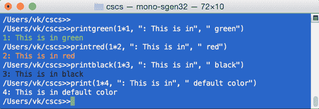
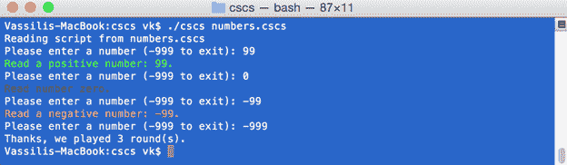

正如您在上一章中所看到的，实现从 **`ParserFunction`** 类派生的类是我们正在创建的编程语言的主要构建块。

在本章中，我们将看到如何实现一些流行的语言构造，所有这些都使用相同的技术:创建一个新的类，从 **`ParserFunction`** 类派生，向解析器注册它，等等。我们使用这种方法创建的函数越多，语言的功能和灵活性就越强。

## 控制台

代码清单 24 显示了一个用 C#实现的非常有用的函数的例子，它可以从 CSCS 代码中调用。

代码清单 24:打印函数类的实现

```
  class PrintFunction : ParserFunction
  {
    internal PrintFunction(bool newLine = true)
    {
        m_newLine = newLine;
    }

    internal PrintFunction(ConsoleColor fgcolor)
    {
      m_fgcolor = fgcolor;
      m_changeColor = true;
    }

    protected override Variable Evaluate(ParsingScript script)
    {
      bool isList;
      List<Variable> args = Utils.GetArgs(script,
          Constants.START_ARG, Constants.END_ARG, out isList);

      string output = string.Empty;
      for (int i = 0; i < args.Count; i++) {
        output += args[i].AsString();
      }

      output += (m_newLine ? Environment.NewLine : string.Empty);
      if (m_changeColor) {
        Utils.PrintColor(output, m_fgcolor);
      } else {
        Console.Write(output);
      }

      return Variable.EmptyInstance;
    }

    private bool m_newLine     = true;
    private bool m_changeColor = false;
    private ConsoleColor m_fgcolor;
  }

  public static void PrintColor(string output, ConsoleColor fgcolor)
  {
    ConsoleColor currentForeground = Console.ForegroundColor;
    Console.ForegroundColor = fgcolor;

    Console.Write(output);

    Console.ForegroundColor = currentForeground;
  }

```

为了提取参数(打印什么)，调用 **`Utils.GetArgs`** 辅助函数(参见代码清单 25)。如有必要，通过递归调用整个**拆分合并**算法，返回一个已经计算出值的变量列表。例如，如果参数列表是`“25, “fu” + “bar”, sin(5*2 – 10)”`， **`Utils.GetArgs`** 函数将返回以下列表:`{25, “fubar”, 0}` (因为`sin(0) = 0`)。

代码清单 Utils 的实现。GetArgs 方法

```
  public static List<Variable> GetArgs(ParsingScript script,
                               char start, char end, out bool isList) {
    List<Variable> args = new List<Variable>();
    isList = script.StillValid() && script.Current == Constants.START_GROUP;

    if (!script.StillValid() || script.Current == Constants.END_STATEMENT) {
      return args;
    }

    ParsingScript tempScript = new ParsingScript(script.String,

   script.Pointer);
    Utils.GetBodyBetween(tempScript, start, end);
    // After the statement above,
  tempScript.Parent will point to the last
    //
  character belonging to the body between start and end characters. 

    while (script.Pointer < tempScript.Pointer)  {
      Variable item = Utils.GetItem(script);
      args.Add(item);
    }

    if (script.Pointer <= tempScript.Pointer) {
      // Eat closing parenthesis, if
  there is one, but only if it closes
      // the
  current argument list, not one after it. 
      script.MoveForwardIf(Constants.END_ARG);
    }

    script.MoveForwardIf(Constants.SPACE);
    return args;
  } 

```

要打印 CSCS 变量，我们必须将其表示为字符串。如果变量是字符串或数字，那么很容易做到这一点。但是如果是数组呢？然后，我们将数组的每个元素转换成一个字符串，可能使用递归(参见代码清单 26)。如果参数 **`isList`** 设置为`true`，结果中会增加左右花括号。

代码清单 26:变量的实现。字符串方法

```
  public string AsString(bool isList   = true,
                         bool sameLine = true) {
    if (Type == VarType.NUMBER) {
        return Value.ToString();
    }

    if (Type == VarType.STRING) {
      return String;
    }

    if (Type == VarType.NONE || m_tuple == null) {
      return string.Empty;
    }

    StringBuilder sb = new StringBuilder();

    if (isList) {
      sb.Append(Constants.START_GROUP.ToString() +
               (sameLine ? "" : Environment.NewLine));
    }

    for (int i = 0; i < m_tuple.Count; i++) {
      Variable arg = m_tuple[i];
      sb.Append(arg.AsString(isList, sameLine));
      if (i != m_tuple.Count - 1) {
        sb.Append(sameLine ? " " : Environment.NewLine);
      }
    }

    if (isList) {
      sb.Append(Constants.END_GROUP.ToString() +
               (sameLine ? " " : Environment.NewLine));
    }

    return sb.ToString();
  }

```

这就是我们如何注册打印功能，以指定颜色或默认颜色打印:

`ParserFunction`。RegisterFunction( `Constants`)。PRINT，

`new``PrintFunction`())；
T2。RegisterFunction( `Constants`)。打印 _ 黑色，

`new` `PrintFunction` ( `ConsoleColor`)。黑色))；
`ParserFunction`。注册功能(`Constants`)。打印 _ 绿色，

`new` `PrintFunction` ( `ConsoleColor`)。绿色))；
`ParserFunction`。注册功能(`Constants`)。打印 _ 红色，

`new` `PrintFunction` ( `ConsoleColor`)。红色))；

常数定义如下:

`public``const``string`PRINT =`"print"`；
`public``const``string`PRINT _ BLACK =`"printblack"`；
`public``const``string`PRINT _ GREEN =`"printgreen"`；
`public``const``string`PRINT _ RED =`"printred"`；

类似地，你可以添加任何你想要的颜色。图 5 包含一个 CSCS 玩不同颜色的示例会话。



 5:不同颜色打印

## 控制台读取

现在让我们来看一个写控制台函数的姐妹——从控制台读取。下面代码清单 27 中的细节。

代码清单 ReadConsole 类的实现

```
  class ReadConsole : ParserFunction
  {
    internal ReadConsole(bool isNumber = false)
    {
      m_isNumber = isNumber;
    }

    protected override Variable Evaluate(ParsingScript script)
    {
      script.Forward(); // Skip opening parenthesis.
      string line = Console.ReadLine();

      if (!m_isNumber) {
        return new Variable(line);
      }

      double number = Double.NaN;

      if (!Double.TryParse(line, out number)) {
        throw new ArgumentException("Couldn't parse number [" + line + "]");
      }
      return new Variable(number);
    }

    private bool m_isNumber;
  }

```

有两种情况:当我们读一个数字时，和当我们读一个字符串时。相应地，我们向解析器注册了两个函数:

`public``const``string`READ =`"read"`；

`public` `const` `string`读码=`"readnum"`；

`ParserFunction`。RegisterFunction( `Constants`)。【READ，`ReadConsole`()；

`ParserFunction`。寄存器功能(“T1”)。READNUMBER，`new``ReadConsole`(`true`)；

类似地，我们可以添加函数来读取不同的数据结构，例如，读取整个数字或字符串数组。

接下来，我们将看到一个使用不同构造的 CSCS 脚本的例子，到目前为止，我们已经实现了这些构造。

代码清单 28 显示了 CSCS 代码的一个例子，它使用了我们在上一章中讨论的`while`、`break`和`if`控制流结构，并以不同的颜色打印。

代码清单 28:根据用户输入打印不同颜色的 CSCS 代码

```
  round = 0;

  while(1) {
    write("Please enter a number (-999 to exit): ");
      number = readnum();

    if (number == -999) {
      break;
    } elif (number < 0) {
      printred("Read a negative number: ", number, ".");
    } elif (number > 0) {
      printgreen("Read a positive number: ", number, ".");
    } else {
      printblack("Read number zero.");
    }
    round++;
  }

  print("Thanks, we played ", round, " round(s).");

```

为了测试我们的脚本，我们将代码清单 28 的内容保存到 **numbers.cscs** 文件中，然后运行它，如图 6 所示。



6:numbers . cscs 脚本的示例运行

在本节中，我们将看到一些从 **`ParserFunctions`** 类派生的实现字符串相关功能的类的例子。我们将看到大部分功能已经在 C#中实现，所以我们的类只是现有 C#函数和方法的包装器。

代码清单 ToUpperFunction 类的实现

```
  class ToUpperFunction : ParserFunction
  {
    protected override Variable Evaluate(ParsingScript script)
    {
      // 1\. Get the name of the variable.
      string varName = Utils.GetToken(script, Constants.END_ARG_ARRAY);
      Utils.CheckNotEmpty(script, varName, m_name); 

      // 2\. Get the current value of the variable.
      ParserFunction func = ParserFunction.GetFunction(varName);
      Variable currentValue = func.GetValue(script);

      // 3\. Take either the string part if it is defined,
      // or the numerical part converted to a string otherwise.
      string arg = currentValue.AsString();

      Variable newValue = new Variable(arg.ToUpper());
      return newValue;
    }
  } 

```

代码清单 29 提供了将字符串的所有字符转换为大写的实现。 **`Utils.GetToken`** 是从解析脚本中提取下一个字符串标记的便捷方法(它不调用**拆分合并**算法)。这是一个相对简单的函数，您可以在附带的源代码中查看它的实现。

代码清单 30 实现了 **`IndexOfFunction`** 类来搜索字符串中的子字符串。在那里使用的 C# **`String.IndexOf`** 函数有更多可选参数(例如，从哪个字符开始搜索或使用哪种类型的比较)。这些选项可以轻松添加到 **`IndexOfFunction`** 。

代码清单 30:索引函数类的实现

```
  class IndexOfFunction : ParserFunction
  {
    protected override Variable Evaluate(ParsingScript script)
    {
      // 1\. Get the name of the variable.
      string varName = Utils.GetToken(script, Constants.NEXT_ARG_ARRAY);
      Utils.CheckNotEmpty(script, varName, m_name); 

      // 2\. Get the current value of the variable.
      ParserFunction func = ParserFunction.GetFunction(varName);
      Variable currentValue = func.GetValue(script);

      // 3\. Get the value to be looked for.
      Variable searchValue = Utils.GetItem(script);

      // 4\. Apply the corresponding C# function.

      string basePart = currentValue.AsString();
      string search = searchValue.AsString();

      int result = basePart.IndexOf(search);
      return new Variable(result);
    }
  }

```

代码清单 31 显示了 substring 函数的实现。请注意，它有两个参数:用户可以选择提供子字符串的长度。

代码清单 31:子函数类的实现

```
  class SubstrFunction : ParserFunction
  {
    protected override Variable Evaluate(ParsingScript script)
    {
      // 1\. Get the name of the variable.
      string varName = Utils.GetToken(script, Constants.NEXT_ARG_ARRAY);
      Utils.CheckNotEmpty(script, varName, m_name); 

      // 2\. Get the current value of the variable.
      ParserFunction func = ParserFunction.GetFunction(varName);
      Variable currentValue = func.GetValue(script);

      // 3\. Take either the string part if it is defined,
      // or the numerical part converted to a string otherwise.
      string arg = currentValue.AsString();
      // 4\. Get the initial index of the substring.
      Variable init = Utils.GetItem(script);
      Utils.CheckNonNegativeInt(init);

      // 5\. Get the length of the substring if available.
      string substring;
      bool lengthAvailable = Utils.SeparatorExists(script);

      if (lengthAvailable) {
        Variable length = Utils.GetItem(script);
        Utils.CheckPosInt(length);

        if (init.Value + length.Value > arg.Length) {
          throw new ArgumentException("The total  length is larger han [" +

              arg + "]");
        }
        substring = arg.Substring((int)init.Value, (int)length.Value);
      } else {
        substring = arg.Substring((int)init.Value);
      }

      Variable newValue = new Variable(substring);

      return newValue;
    }
  }

```

然后我们用解析器注册**`ToUpperFunction`****`IndexOfFunction`**和 **`SubstrFunction`** 如下:

`public``const``string`【toupper =`"toupper"`；

`public``const``string`INDEX _ OF =`"indexof"`；

`public`t1`string`基片=`"substr"`；

`ParserFunction`。寄存器功能(“T1”)。TOUPPER，`new``ToUpperFunction`)；

`ParserFunction`。RegisterFunction( `Constants`)。【INDEX _ OF，`IndexOfFunction`()；

`ParserFunction`。寄存器功能(`Constants`。substr，`new``SubstrFunction`)；

代码清单 31 调用了一些在我们的 CSCS 实现中广泛使用的辅助函数，主要是为了节省打字时间。代码清单 32 显示了其中的一些函数。

代码清单 32:检查正确输入的函数

```
  public static void CheckNonNegativeInt(Variable variable)
  {
    CheckInteger(variable);
    if (variable.Value < 0) {
      throw new ArgumentException(
          "Expected a non-negative integer instead of [" +
           variable.Value + "]");
    }
  }

  public static void CheckInteger(Variable variable)
  {
    CheckNumber(variable);
    if (variable.Value % 1 != 0.0) {
      throw new ArgumentException("Expected an integer instead of [" +
                                   variable.Value + "]");
    }
  }

  public static void CheckNumber(Variable variable)
  {
    if (variable.Type != Variable.VarType.NUMBER) {
        throw new ArgumentException ("Expected a number instead of [" +
                                      variable.AsString() + "]");
    }
  }

  public static void CheckNotEmpty(ParsingScript script, string varName,

   string name) {
    if (!script.StillValid() || string.IsNullOrWhiteSpace(varName)) {
      throw new ArgumentException("Incomplete arguments for [" + name + "]");
    }
  }

```

代码清单 33 显示了在 CSCS 使用一些字符串函数的例子。

代码清单 33:处理字符串的 CSCS 代码示例

```
  str = "Perl - The only language that looks the same before and after
  " +
        "RSA encryption. -- Keith Bostic";
  index = indexof(str, "language");
  res   = "cscs
  " + substr(str, index, 8);
  print(toupper(res)); // prints "CSCS
  LANGUAGE"

```

在 CSCS 实现一个数学函数甚至比实现一个字符串函数更容易。参见代码清单 34，它展示了如何实现一个函数来将一个数字舍入到最接近的整数。

唯一缺少的部分是为这个函数定义一个名称，并将其注册到解析器中:

`public``const``string`ROUND =`"round"`；

`ParserFunction`。RegisterFunction( `Constants`)。【ROUND，`RoundFunction`()；

代码清单 RoundFunction 类的实现

```
  class RoundFunction : ParserFunction
  {
    protected override Variable Evaluate(ParsingScript script)
    {
      Variable arg = script.ExecuteTo(Constants.END_ARG);
      arg.Value = Math.Round(arg.Value);
      return arg;
    }
  }

```

CSCS 的所有变量在 C#代码中都有一个对应的 **`Variable`** 对象。能够提取这个变量的一些属性会很方便，比如它的类型。代码清单 35 实现了这个功能。 **`TypeFunction`** 类的 **`Evaluate`** 方法有几个处理数组的方法调用。我们将在第 6 章的“在 CSCS 使用阵列”一节中更仔细地研究阵列。

唯一缺少的部分是为这个函数定义一个名称，并将其注册到解析器中:

`public``const``string`TYPE =`"type"`；

`ParserFunction`。RegisterFunction( `Constants`)。类型，`new``TypeFunction`())；

代码清单 35:类型函数类的实现

```
  class TypeFunction : ParserFunction
  {
    protected override Variable Evaluate (ParsingScript script)
    {
      // 1\. Get the name of the variable.
      string varName = Utils.GetToken(script, Constants.END_ARG_ARRAY);
      Utils.CheckNotEmpty(script, varName, m_name); 

      List<Variable> arrayIndices = Utils.GetArrayIndices(ref varName);

      // 2\. Get the current value of the variable.
      ParserFunction func = ParserFunction.GetFunction(varName);
      Utils.CheckNotNull(varName, func);
      Variable currentValue = func.GetValue(script);
      Variable element = currentValue;

      // 2b. Special case for an array.
      if (arrayIndices.Count > 0) {// array element
        element = Utils.ExtractArrayElement(currentValue, arrayIndices);
        script.MoveForwardIf(Constants.END_ARRAY);
      }

      // 3\. Convert type to string.
      string type = Constants.TypeToString(element.Type);
      script.MoveForwardIf (Constants.END_ARG, Constants.SPACE);

      Variable newValue = new Variable(type);
      return newValue;
    }
  }

```

正如你所看到的，基本上，你可以在 CSCS 实现任何可以用 C#实现的东西。

还要注意，我们正在创建的 CSCS 语言可以很容易地转换成[函数式编程语言](https://en.wikipedia.org/wiki/Functional_programming)。在函数式语言中，一个函数的输出值只取决于参数，因此改变的是没有在两个函数调用之间具有不同值的全局变量。

在这一节中，我们将看到一些线程函数。特别是，您会看到创建新线程的语法非常简单。

在代码清单 36 中，我们定义了三个与线程相关的函数: **`ThreadFunction`** (创建并启动一个新线程；返回新创建线程的 id)、 **`ThreadIDFunction`** (获取并返回当前线程的线程 id)和 **`SleepFunction`** (让线程执行休眠若干毫秒)。

代码清单 36:线程相关类的实现

```
  class ThreadFunction : ParserFunction
  {
    protected override Variable Evaluate(ParsingScript script)
    {
      string body = Utils.GetBodyBetween(script, Constants.START_GROUP,

   Constants.END_GROUP);
      Thread newThread = new Thread(ThreadFunction.ThreadProc);
      newThread.Start(body);
      return new Variable(newThread.ManagedThreadId);
    }

    static void ThreadProc(Object stateInfo)
    {
      string body = (string)stateInfo;
      ParsingScript threadScript = new ParsingScript(body);
      threadScript.ExecuteAll();
    }
  }

  class ThreadIDFunction : ParserFunction
  {
    protected override Variable Evaluate(ParsingScript script)
    {
      int threadID = Thread.CurrentThread.ManagedThreadId;
      return new Variable(threadID);
    }
  }

  class SleepFunction : ParserFunction
  {
    protected override Variable Evaluate(ParsingScript script)
    {
      Variable sleepms = Utils.GetItem(script);
      Utils.CheckPosInt(sleepms);
      Thread.Sleep((int)sleepms.Value);
      return Variable.EmptyInstance;
    }
  }

```

正如您所看到的，所有这些类都是它们的 C#对应类的薄包装器。线程函数的参数可以是任何 CSCS 脚本，包括一个 CSCS 函数(我们将在第 5 章中看到 CSCS 函数)。这是我们向解析器注册线程函数的方式:

`public``const``string`THREAD =`"thread"`；

`public``const``string`THREAD _ ID =`"threadid"`；

`public``const``string`SLEEP =`"sleep"`；

`ParserFunction`。RegisterFunction( `Constants`)。`new``ThreadFunction`())；

`ParserFunction`。RegisterFunction( `Constants`)。THREAD_ID，`new``ThreadIDFunction`()；

`ParserFunction`。RegisterFunction( `Constants`)。【SLEEP，`SleepFunction`()；

代码清单 37 包含使用上述三个函数的示例代码。它有一个`for`循环，我们将在第 6 章的“实现 for 循环**”**一节中看到。

代码清单 37:在 CSCS 玩线程

```
  for (i = 0; i
  < 5; i++) {
    id = thread(
           print("-->> Starting in thread", threadid());
           sleep(1000);
           print("<<-- Finishing in thread", threadid());
         );
    print("Started thread", id, " in main");
  }

  sleep(2000);
  print("Main completed in thread", threadid());

  // Sample
  run of the script above:
  Started thread3 in main
  -->> Starting in
  thread3
  Started thread4 in main
  -->> Starting in
  thread4
  Started thread5 in main
  -->> Starting in
  thread5
  Started thread6 in main
  -->> Starting in
  thread6
  Started thread7 in main
  -->> Starting in
  thread7
  <<-- Finishing in
  thread3
  <<-- Finishing in
  thread5
  <<-- Finishing in
  thread6
  <<-- Finishing in
  thread4
  <<-- Finishing in
  thread7
  Main completed in
  thread1

```

一旦您知道如何启动一个新线程，您可能希望能够在线程之间共享资源和发送信号(例如，当一个线程完成一个任务的处理时)。

前者可以用锁在 C#中实现，后者可以用事件等待句柄实现。

在我们的脚本语言中使用自定义锁定和同步机制的优势在于，您可以拥有比 C#中更简单的语法，您很快就会看到这一点。

代码清单 38 定义了实现线程锁定功能的 **`LockFunction,`** 和实现线程间信令的 **`SignalWaitFunction`** (这个功能在其他语言中也称为“条件变量”)。

从这里，您可以获得更多的幻想和实现，例如，当您允许多个线程对资源进行读访问，而只允许一个线程进行写访问时，您可以实现一个读-写锁。

 38:锁定函数和信号等待函数类的实现

```
  class LockFunction : ParserFunction
  {
    static Object lockObject = new Object();

    protected override Variable Evaluate(ParsingScript script)
    {
      string body = Utils.GetBodyBetween(script, Constants.START_ARG,

   Constants.END_ARG);
      ParsingScript threadScript = new ParsingScript(body);

      lock(lockObject) {
        threadScript.ExecuteAll();
      }
      return Variable.EmptyInstance;
    }
  }

  class SignalWaitFunction : ParserFunction
  {
    static AutoResetEvent waitEvent = new AutoResetEvent(false);
    bool m_isSignal;

    public SignalWaitFunction(bool isSignal)
    {
      m_isSignal = isSignal;
    }
    protected override Variable Evaluate(ParsingScript script)
    {
      bool result = m_isSignal ? waitEvent.Set() :
                                 waitEvent.WaitOne();
      return new Variable(result);
    }
  }

```

这就是我们向解析器注册这些函数的方式:

`public``const``string`LOCK =`"lock"`；

`public``const``string`SIGNAL =`"signal"`；

`public``const``string`WAIT =`"wait"`；

`ParserFunction`。RegisterFunction( `Constants`)。`new`锁定，`LockFunction`())；

`ParserFunction`。RegisterFunction( `Constants`)。信号，

`new``SignalWaitFunction`(`true`)；

`ParserFunction`。RegisterFunction( `Constants`)。等等，

`new``SignalWaitFunction`(`false`)；

代码清单 39 包含使用**信号等待功能**功能的示例代码。它使用了自定义的 CSCS 功能 **`threadWork`** 。我们将在第 5 章中看到 CSCS 的定制函数。

代码清单 39:CSCS 的线程同步示例

```
  function threadWork()
  {
    print("  Starting thread work in thread", threadid());
    sleep(2000);
    print("  Finishing thread work in thread", threadid());
    signal();
  }

  print("Main, starting new thread from ", threadid());
  thread(threadWork());
  print("Main, waiting for thread in ", threadid());
  wait();
  print("Main, wait returned in ", threadid()); 

  // Sample
  run of the script above:
  Reading script from
  scripts/temp.cscs
  Main, starting new
  thread from 1
  Main, waiting for
  thread in 1
    Starting thread work
  in thread3
    Finishing thread work
  in thread3
  Main, wait returned in
  1

```

在本章中，我们实现了几个有用的功能:用不同的颜色向控制台写入、从控制台读取、实现数学函数、处理字符串、线程以及其他一些功能。目标是展示任何可以用 C#实现的东西，也可以在 CSCS 实现。