# 第 1 章设置离子

## 这本书是给谁看的？

这本书面向的是之前没有使用过 ion 的开发人员——甚至没有使用过 ion 1 的经验。但是，如果您以前确实有框架、Angular 或 TypeScript 的一些经验，这确实会有所帮助，尽管这些不是必备的。

这本书不是离子 1 的迁移手册，如果你从零开始使用离子-角度(离子框架的版本 2 或更高版本)，这是完全可以的。

## 为什么要进行完整的框架重写？

离子团队完全重写了离子框架，原因有几个。可能最重要的一点是，ion-Angular 是用 Angular 的最新版本构建的，这与 Angular 1(也称为 AngularJS)有很大的不同。

基本上，在最新的 Angular 版本的基础上进行构建使 ion-Angular 能够从各种改进中受益，包括性能的提高以及更标准化的编写和构建应用程序的方式，尤其是在使用 TypeScript 时，例如能够使用依赖注入、组件和模块。

例如，版本 1 的离子框架使用用户界面路由器进行导航。尽管 UI 路由器相当强大，但在 ion-Angular 中，为了实现从一个屏幕到另一个屏幕的更自然的移动方式，这已经更进一步了。

ional-Angular 的另一个令人敬畏的特性是，该框架能够检测您的应用程序是运行在安卓还是 iOS 设备上，从而自动呈现相应的平台主题。

此外，爱奥尼亚团队继续改进内部构建系统的工作方式，使用类似[的工具来构建、服务和在文件更改时执行实时重新加载。](https://gulpjs.com/)

另外，通过使用 TypeScript 进行编译，使用 [SASS](http://sass-lang.com/) 进行 CSS 扩展和优化，使用 NPM 进行包管理，爱奥尼亚团队使这个最新版本成为了一个真正现代化和令人愉快的移动应用开发平台。他们已经考虑在不影响效率和整体开发人员体验的情况下，尽可能地进行优化。

其中一些优化与更好的缓存、屏幕间更快的导航以及使用内部虚拟列表来滚动非常长的列表有关，以便获得类似本机的性能。

所有这些改进使 ional-Angular 成为框架的一个精彩的新版本——这是许多开发人员喜欢的版本。

离子-角度是一个不断进化的框架——以惊人的速度。因此，很有可能在本书撰写到您阅读本书期间，新搭建的应用程序的一些代码或项目结构可能与这里描述的略有不同或完全不同。然而，你应该能够很容易地找到你的路，因为它已经被写了，并且被审查为尽可能最新的。

## 富人

为了充分利用这本书，有几项技术您应该熟悉:TypeScript 和 Angular 的最新版本。这本书里的所有代码都会用到它们。安装 ion 的时候会安装 TypeScript，真的很方便。

但是不要担心——没有任何关于它们的先前知识并不是一件引人注目的事情。如果你是一个对其他网络技术有经验的软件开发人员，你也应该能够相当快地学会这一点，并且不需要太多的努力。

幸运的是，*简洁地*系列已经为您介绍过了，史蒂夫·芬顿写的一本名为[简洁地打字稿](https://www.syncfusion.com/resources/techportal/details/ebooks/typescript)的书可以让您立即了解这项技术。

此外，《Angular 1》被弗雷德里克·迪茨精彩创作的《简明扼要》广泛涵盖，而《Angular 2》被约瑟夫·布斯简洁扼要地解释为《T2》。熟悉 Angular 的依赖注入和数据绑定的工作原理是有益的。

如果你觉得你需要更新你的打字稿和角度知识——或者从头开始——这些都是我极力鼓励你去看一看的极好的资源。

## 安装离子角度

为了真正开始，我们接下来需要做的是安装 ion-Angular。在 ion 中完成的所有开发都是基于一个名为 Ionic CLI 的 [Node.js](https://nodejs.org/) 命令行工具，所以首先，我们需要下载 Node.js 并为我们的操作系统获取合适的安装程序。无论你是在视窗电脑还是苹果电脑上，Node.js 都能正常工作。

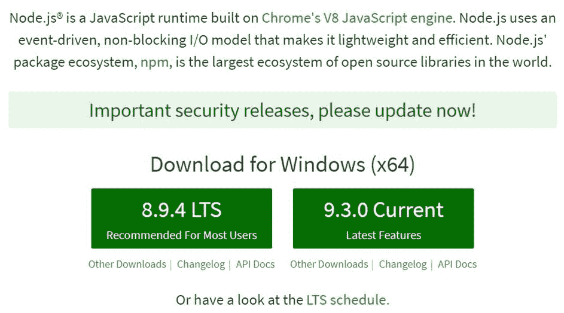

图 1-a:节点主页

在 Node.js 主页上，下载适合您的操作系统的安装程序——就我而言，我已经下载了推荐给大多数用户的 LTS(长期支持)版本。

Node.js 网站检测到我在一台 Windows 64 位机器上，并向我提供了下载适用于 Windows 64 位的运行时的选项。

安装 Node.js 基本上包括下载安装包并点击提示以便快速安装——就这么简单。

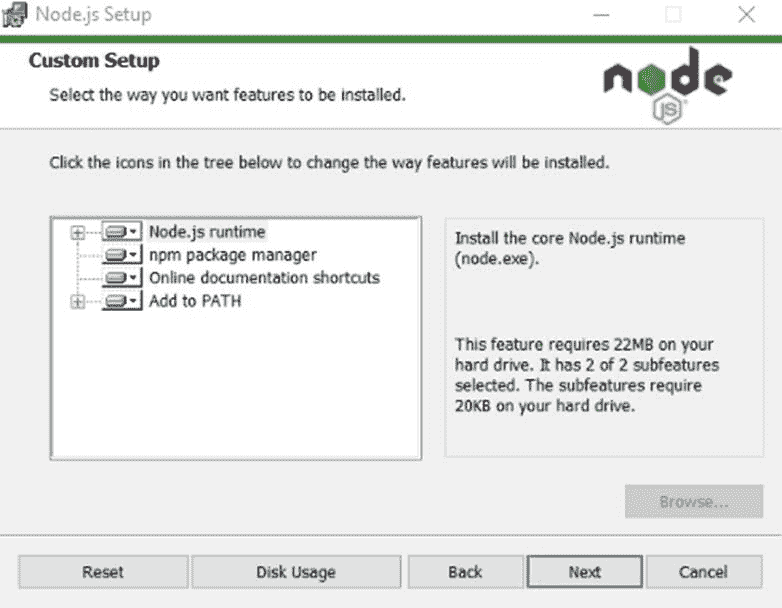

图 1-b:节点安装程序

随着 Node.js 的安装，我们可以集中精力让 ion-Angular 启动并运行。为此，以*管理员*用户的身份打开命令提示符——在我的例子中，我在 Windows 命令提示符上使用了这个可爱的[模拟器](http://cmder.net/)。键入以下命令。

代码清单 1-a:离子和科尔多瓦安装命令

```
  npm
  install -g ionic cordova

```

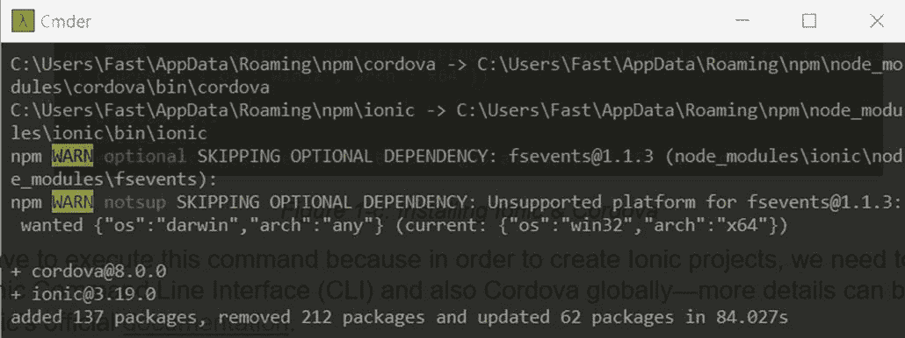

图 1-c:安装 ion 和 Cordova

我们必须执行这个 NPM(节点包管理器)命令，因为为了创建离子项目，我们需要安装离子命令行界面(CLI)，以及全局科尔多瓦。你可以在爱奥尼亚官方[文档](https://ionicframework.com/docs/intro/installation/)中找到更多细节。

一旦命令成功执行，我们就可以开始使用 Ionical 创建应用程序了。

## 创建新的离子项目

为了开始使用离子键，我们需要创建一个新的离子键项目——这可以通过使用离子键命令行界面来完成。

让我们键入以下命令来启动一个新项目，我们将在本书中构建这个项目。请确保从存储项目源代码的文件夹中运行此命令。

代码清单 1-b:创建一个新的离子应用

```
  ionic
  start IonicAppSuccinctly sidemenu --ts

```

这个命令将创建一个名为**的子文件夹，简单来说就是**，它将包含应用程序的所有代码。

`--ts`选项表示我们将使用 TypeScript 作为我们的首选语言，而不是默认的 JavaScript。`sidemenu`选项表示该应用将在侧面有一个可切换的菜单布局。

在命令实际开始执行之前，您可能会被提示回答您是否希望这个带有 Cordova 的应用程序以本机 iOS 和 Android 为目标。

请随意回答**是**或**否**—就我而言，我选择了**否**。一旦这样做了，安装项目依赖项可能需要几分钟的时间。

安装项目依赖项后，可能还会要求您安装免费的 Ionic Pro SDK 并连接您的应用程序。请随意回答**是**或**否**—就我而言，我选择了**是**。

安装了 Ionic Pro 后，如果您选择了**是**，系统可能会要求您确认希望 CLI 创建的应用程序的名称。就我而言，我选择了**简洁地说**。

除了`sidemenu`还有其他可用的项目模板——更多信息可以在官方的 Ionic】文档中找到。

当这个命令第一次执行时，它会简洁地创建文件夹 ionicapp，然后下载模板信息，最后进入文件夹并执行`npm install`以便安装项目所需的所有依赖项，这些依赖项在 package.json 文件中指定。

如果由于某种原因`npm install`命令执行失败，只需进入**简单地**子文件夹并手动执行`npm install`以重试。

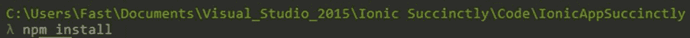

图 1-d:手动运行“npm 安装”命令

如果您简单地查看一下子文件夹，您应该会看到以下文件(或类似文件)。

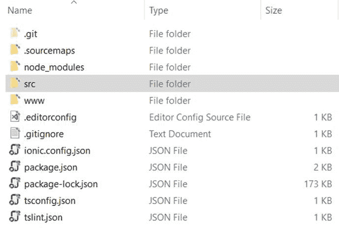

图 1-e:简洁的项目文件

在这个阶段，爱奥尼亚已经为我们创建了一个项目结构，我们将把它作为构建我们的应用程序的基础。

让我们通过在 [Visual Studio Code](https://code.visualstudio.com/) (VS Code)中打开项目来快速查看搭建的文件夹和文件结构。如果你没有安装，现在可能是安装的好时机。不一定要用 VS Code，可以用自己选择的任何编辑器，比如 [Atom](https://atom.io/) 或者[崇高](https://www.sublimetext.com/)。

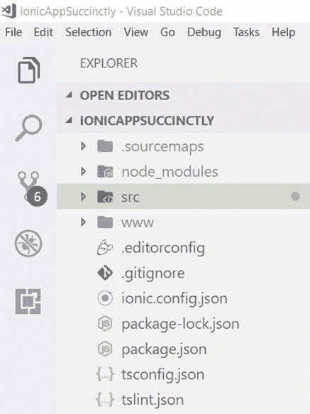

图 1-f:VS 代码中简洁的项目结构

我们稍后将更详细地探讨这个项目结构，所以现在我们不要太担心它。

## 测试脚手架应用

现在我们已经创建了最终将成为我们的应用程序的 ion 项目，让我们看看如何使用浏览器测试它，并看看它的外观。这是最简单也是最常见的快速检查东西的方法。

我们可以通过从**\简单地**项目子文件夹中键入以下命令来实现这一点，您需要将 **cd** 放入**\简单地**中。

代码清单 1-c:“离子服务”命令

```
  ionic
  serve

```

这个命令将基本上编译 TypeScript 和 SCSS (Sassy CSS)代码——这是 Ionic CLI 为我们构建的代码——然后在本地启动一个 web 服务器。让我们继续做下去，看看会发生什么。

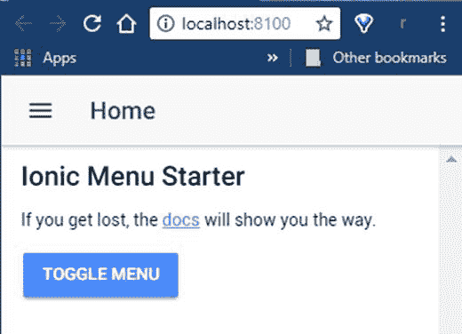

图 1-g:铬合金中的离子应用

我们可以看到，在我的机器上，ion 已经在 **http://localhost:8100** 上启动了一个 web 服务器(端口号可能和你的不同)。

如果你的浏览器窗口被完全最大化，你可能已经注意到这个应用看起来有点奇怪，因为它不是真正为桌面浏览器设计的。

在这种情况下，您可能想做的是按下 **F12** 键(如果您使用的是 Chrome 或 Edge 作为浏览器)——这将打开**开发工具**。然后，切换设备工具栏并选择移动显示器，如下图所示。

您也可以选择将“开发人员工具”面板停靠在屏幕的左侧或右侧(根据您的偏好)，这样您就可以获得更多在移动设备上实际查看它的感觉。

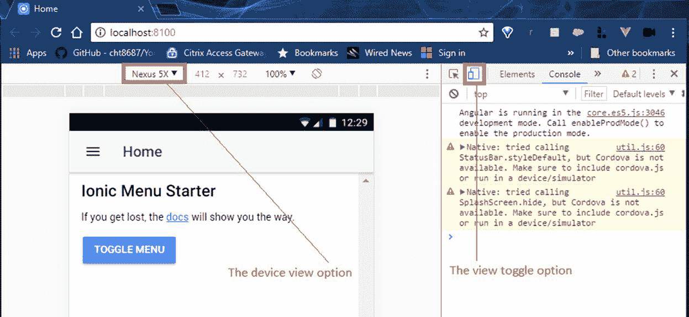

图 1-h:使用 Chrome 开发工具调整视图

如果您正在使用其他浏览器，类似的选项可能存在，因此请查看它们各自的文档或帮助。

如您所见，该应用程序在 Nexus 5X 虚拟设备布局上呈现良好。您也可以在任何其他模拟设备上测试它。

## 实时或热重新加载

一个在开发过程中非常有用的非常酷的特性是我们通常所说的 Live 或 Hot Reload，它能够在浏览器中自动重新加载刚刚编辑和保存的页面。

为了演示这一点，我将打开 VS Code 并转到 **src\pages\home** 文件夹，然后打开**home.html**文件并将默认文本从**离子菜单启动器**简洁地更改为**离子应用程序**。

一旦你做到了这一点，继续检查应用程序在浏览器中的外观。ion 应该已经自动重新加载了页面，现在它应该反映了您刚刚在保存文件后所做的更改。让我们看看。

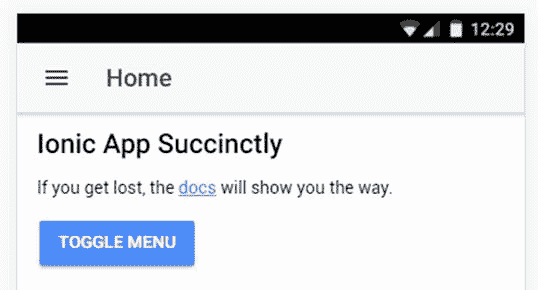

图 1-i:实时重装后的应用

这是一个很棒的特性，它让我们能够快速测试应用的外观和感觉，并快速迭代用户界面的变化。如果要关闭 app 和 web 服务器，可以从命令行按 **Ctrl** + **C** 。

另外，在本书的大部分内容中，我们将使用`ionic serve`命令来测试我们的应用程序，因为它既快又容易使用。

尽管如此，让我们快速探索如何使用离子视图测试应用程序。

## 离子视图和离子 Pro

[ion View](https://ionicframework.com/products/view)是一款工具，可以让我们在实际设备上快速测试和运行 ion 应用，而无需部署应用。当您希望在组织内或与测试人员共享您的离子应用程序而不需要任何配置时，这是理想的选择。

离子视图和离子专业版是快速发展的工具，因此当您阅读本文时，一些屏幕可能会略有不同。在任何情况下，你都应该能够根据下面的说明轻松找到路。

离子视图基本上是一个本地应用程序，可以从应用商店或谷歌游戏安装，并在您的设备上运行您的离子应用程序的代码。

为了使用离子视图，我们必须在设备上安装离子视图应用程序本身，并将我们的离子应用程序部署到离子专业版，您可以将其视为离子的云。

从您的移动设备，转到离子视图[网站](https://ionicframework.com/products/view)，为您的 iOS 或安卓设备安装相应的版本。我将使用 iPhone 5 进行测试。

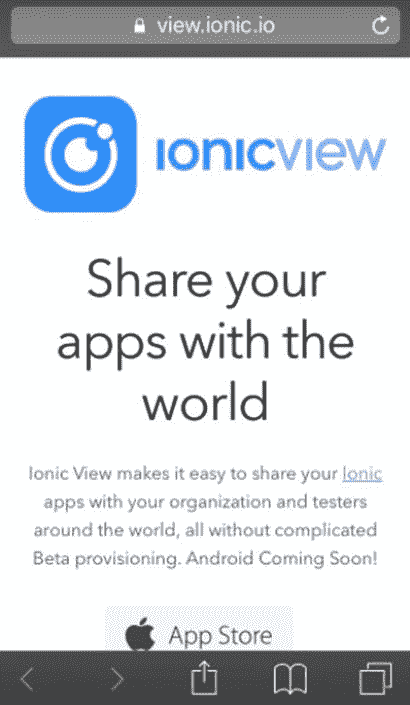

图 1-j:从我的 iPhone 上看到的离子视图站点

我将在我的设备上安装 [iOS 版本](https://itunes.apple.com/us/app/ionic-view-test-share-ionic-apps/id1271789931)，它的外观和感觉与旧(遗留)版本略有不同，因此您将看到的屏幕截图将反映该 UI。安卓版本可以在[这里](https://play.google.com/store/apps/details?id=com.ionicframework.view)找到。

[旧的](https://itunes.apple.com/us/app/ionic-view/id849930087?ls=1&mt=8) iOS 版本和旧的安卓[版本](https://play.google.com/store/apps/details?id=com.ionic.viewapp)被设计为与旧版本的离子云一起工作，与使用过时的`ionic upload`命令的旧版本的离子命令行界面兼容。这是旧的离子云产品的一部分，被离子专业版取代。

我强烈建议您不要使用任何旧版本，并使用与 Ionic Pro 兼容的最新版本的 Ionic View 执行这些步骤。

一旦你的设备上安装了离子视图应用程序，接下来要做的就是在[离子专业版](https://dashboard.ionicjs.com/signup)上创建一个账户，这样我们就可以将我们的应用程序上传到它上面。

创建帐户并首次登录后，您将看到类似于图 1-k 中的屏幕。选择要使用的计划类型—我将使用 **Kickstarter Edition** 来实现我们将在本书中构建的应用程序的目的。

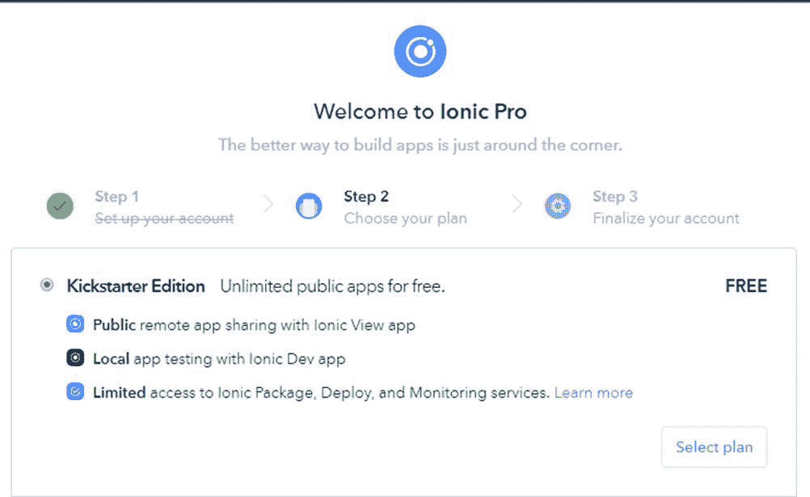

图 1-k:在爱奥尼亚 Pro 上设置帐户

选择帐户类型后，系统会提示您创建新的应用程序。单击**创建应用程序**以完成该过程——完成后，您将看到以下内容。

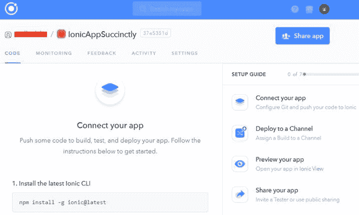

图 1-1:离子专业版上的应用

有了我们在 Ionic Pro 中创建的应用程序，我们只需要链接到它，并按照上图中列出的说明上传代码——在我的例子中，这些说明如下。

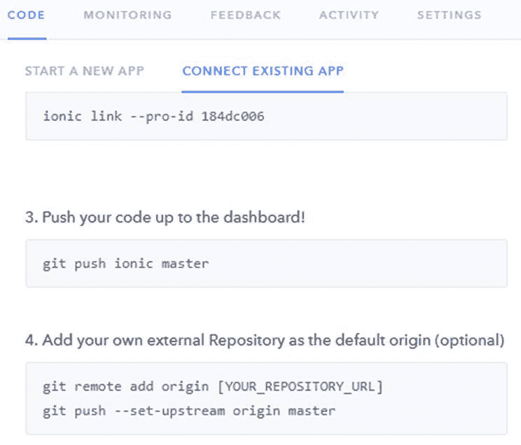

图 1-m:将现有应用程序连接到 Ionic Pro 的说明

执行这些命令时，从 package.json 文件所在的同一个根文件夹运行命令行。

当我们执行`ionic link --pro-id` …，我们的本地应用会链接到我们刚刚在 Ionic Pro 上创建的应用存储库。此命令要求我们输入我们的 Ionic Pro 凭据，这些凭据与注册时使用的凭据相同。

代码清单 1-d:“离子链接”命令

```
  ionic
  link --pro-id 184dc006

```

执行此命令时，可能会要求您配置 SSH 设置。为了使过程简单明了，我强烈建议您在出现提示时选择选项**自动为 ion Pro**设置新的 SSH 密钥对。

需要一个 SSH 密钥，以便将您的应用程序代码安全地推送到爱奥尼亚专业版。你可以在爱奥尼亚官方[文档](https://dashboard.ionicjs.com/settings/ssh-keys)中找到更多关于这个主题的信息。

以下输出是我在机器上执行此命令时得到的结果，您可能会得到类似的输出。

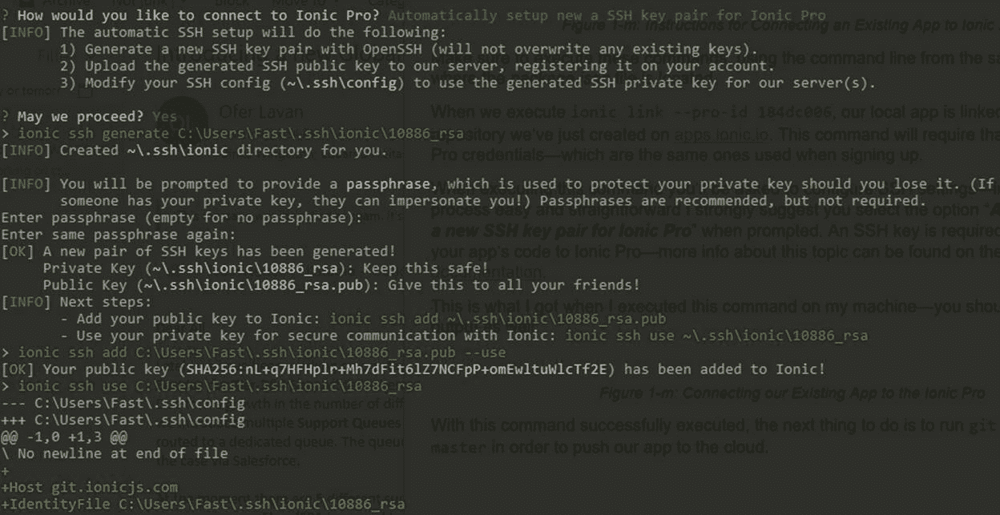

图 1-n:将我们现有的应用程序连接到 Ionic Pro

## 部署到爱奥尼亚 Pro

`ionic link --pro-id`命令已成功执行。

根据图 1-m 所示的指令，接下来我们要做的就是执行`git push ionic master`命令。

在实际执行`git push`之前，有一个小而重要的步骤被遗漏了——假设大多数有 git 经验的开发人员会自动注意到这一点(没有任何 git 经验的人可能根本没有注意到这一点)。

缺少的一步是，我们实际上需要在推送代码之前先提交代码。为了做到这一点，我们需要对我们的代码做一个小的改变。就我而言，我将通过更改在`<title>`标签上找到的文本，对在**文件夹下找到的**index.html**文件进行一个小的修改。**

完成后，保存更改。让我们提交代码——我们可以通过运行以下命令来做到这一点:`git add .`后跟`git commit -m "init"`。

代码清单 1-e:“git add”命令

```
  git
  add .

```

代码清单 1-f:“git 提交”命令

```
  git
  commit -m "init"

```

这将把所做的任何更改提交给主 git 存储库——现在我们准备好`git push`我们的代码了。

所以，执行`git push ionic master`以便将我们应用的代码上传到云中。

代码清单 1-g:“git push”命令

```
  git
  push ionic master

```

完成后，您应该会看到类似如下的输出。

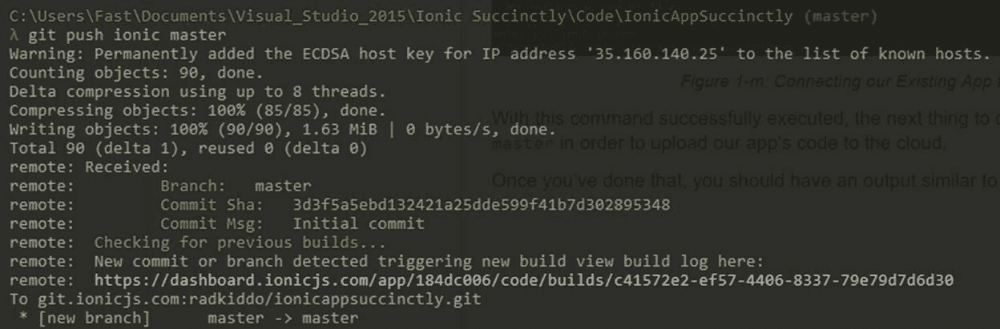

图 1-o:将我们现有的应用程序代码推送给爱奥尼亚专业版

太棒了—我们的应用程序现在正在部署到云中，并托管在 Ionic Pro 上。

如果我们浏览到命令提示符输出中提到的 URL(如图 1-o 所示)，我们实际上可以跟踪正在发生的构建过程——下面是我的例子。

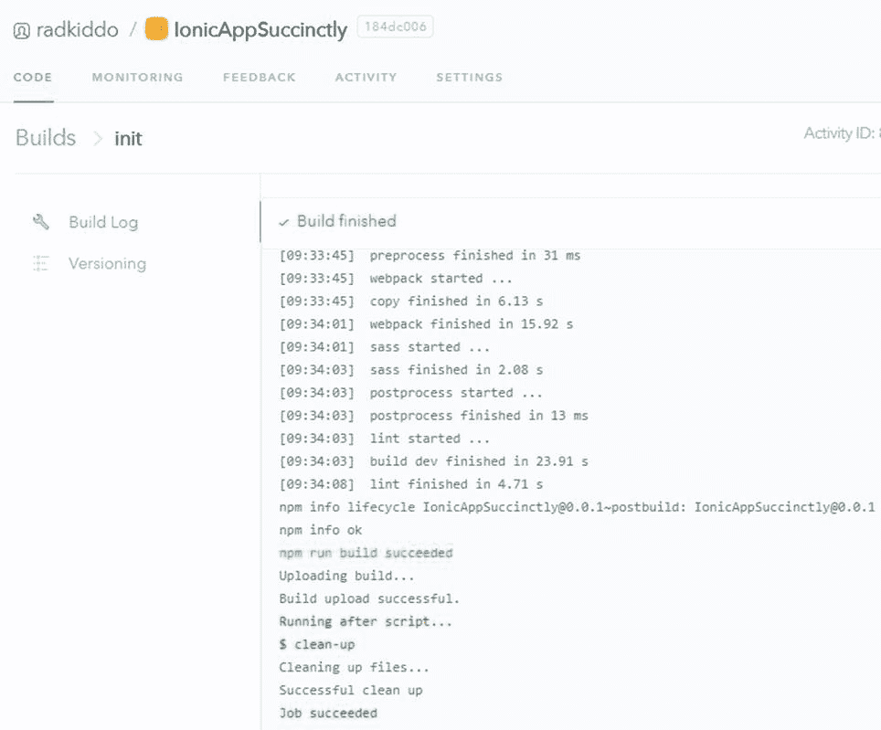

图 1-p:应用程序代码构建过程

我们几乎已经准备好用离子视图检查我们的应用程序，但是在我们这样做之前，我们需要获得应用程序的可共享标识。你可以通过点击爱奥尼亚 Pro 仪表盘上的**共享 App** ，然后点击**公共视图 APP** 标签找到，如下图所示。

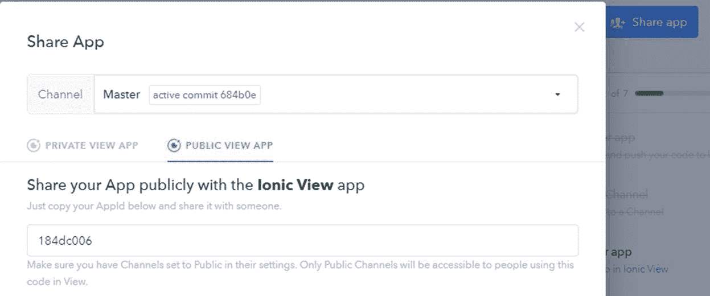

图 1-q:共享应用程序选项

最后，我们还需要将**主**通道公开。我们可以通过进入**频道**并点击**主菜单**在爱奥尼亚专业版仪表盘上进行操作。

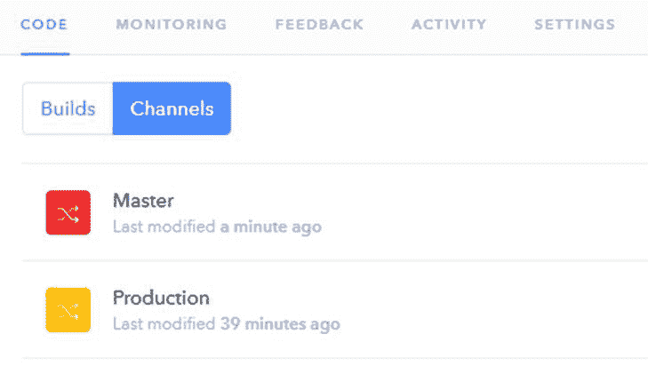

图 1-r:离子专业版中的部署渠道

点击**主**后，会弹出一个窗口。转到**设置**选项卡，然后点击**张扬**。

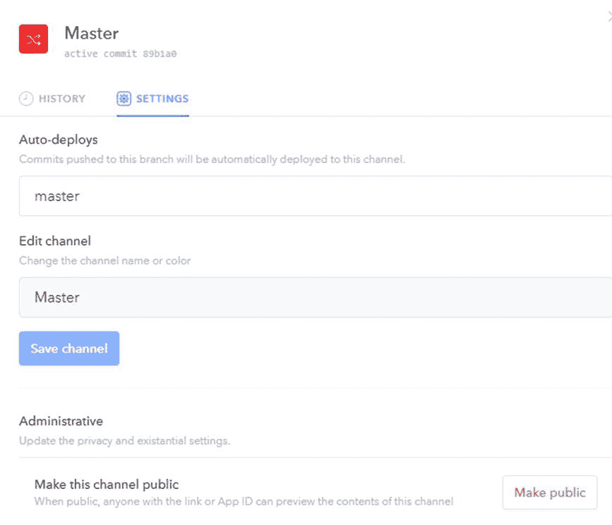

图 1-s:爱奥尼亚专业版中的主频道设置

在您的设备上，打开您之前安装的离子视图应用程序，并转到设置选项卡输入您的离子专业版凭据。

图 1-t 显示了这在我的设备上是什么样子的——在你的设备上可能看起来很相似。

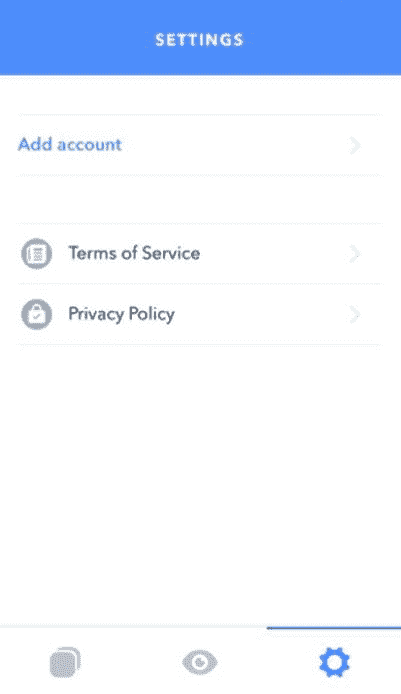

图 1-t:我的设备上的离子视图应用程序的设置选项卡

点击**添加账户**并输入您的爱奥尼亚 Pro 电子邮件地址和密码。完成后，离子视图现在链接到您的离子专业版帐户。接下来，点击中间的图标(看起来像一只眼睛)并输入应用程序识别码。

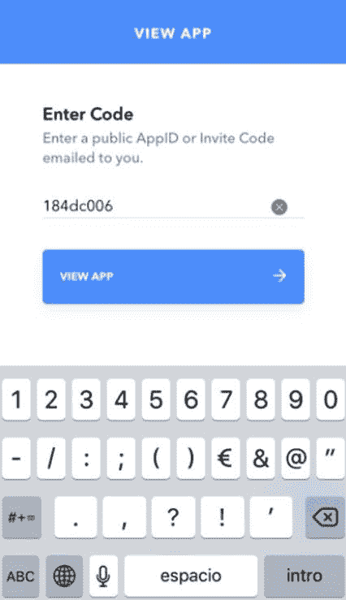

图 1-u:在我的设备的离子视图上输入应用程序标识

完成后，点击**查看应用程序**，查看应用程序在离子视图上的运行情况。一旦您点击了**查看应用程序**按钮，您应该会在列表中看到名称**简洁地说就是**—点击它以便在您的设备上加载应用程序。以下是它在我的 iPhone 上的外观。

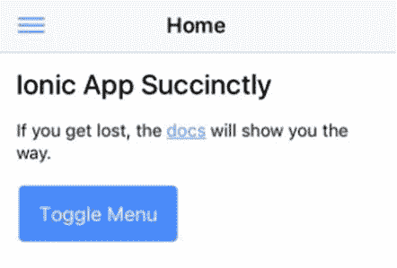

图 1-v:运行在离子视图上的应用程序

我们已经很快看到了如何使用 Ionic Pro 和 Ionic View 分别部署和测试我们的 ion 应用程序。

如果我们在离子视图中有其他应用程序要查看，我们只需返回应用程序列表，并在离子视图应用程序运行时摇动我们的设备，退出我们正在查看的当前应用程序——非常方便！

我们刚刚触及了使用 Ionic Pro 的可能性，并完成了将我们的代码部署到云中所需的步骤，以便可以使用 Ionic View 应用程序进行测试。

Ionic Pro 的主要特点是，无需经过传统的 App Store 发布流程，即可轻松实时推送远程应用更新。

## 总结

在这一章中，我们直接进入了离子生态系统，构建了我们将在本书中构建的应用程序的基本结构。

我们还安装了必要的工具，并完成了测试我们的应用程序所需的步骤，既在浏览器中，也使用了离子视图应用程序——这也向我们介绍了离子的云，离子专业版。

在下一章中，我们将详细探讨搭建的项目结构，以便更好地理解它，并能够在以后扩展应用程序的功能。

我们将跳过如何在模拟器上测试应用程序，因为这需要设置各种 SDK，这是一个复杂的过程。然而，我鼓励你查阅爱奥尼亚官方关于这个主题的文件。

在接下来的章节中，我们将看到离子-角度组件是如何工作的，这样我们就可以从头开始构建我们的脚手架应用程序。