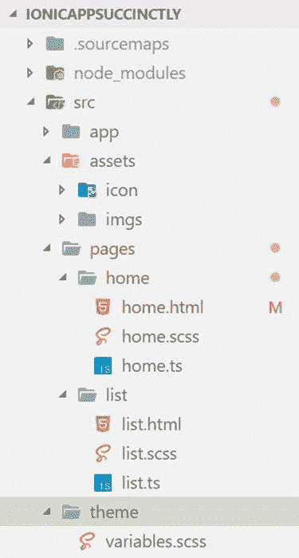

# 第二章项目结构

## 快速介绍

在前一章中，我们能够使用预定义的模板创建我们的离子应用程序，我们将使用该模板作为我们将在本书中研究的解决方案的基础。

为了让事情变得有趣，我想到了创建一个应用程序，允许我们浏览和搜索整个*简洁地*系列库，以及将书籍组织成学习路径。这就是我们将要构建的应用程序，让我们开始吧！

## src 文件夹

现在，我们已经了解了如何在 Ionic Pro 上部署和测试我们的应用程序，接下来让我们专注于应用程序结构和由 Ionic CLI 为我们创建的代码。所以打开 VS 代码来探索文件夹结构。

\src 文件夹是我们开发任何 ion-Angular 应用程序时花费大部分时间的地方。这里是任何初始化代码的去处。

在\src 文件夹中可以找到应用程序的所有源文件，包括图像、样式、HTML 标记和代码文件(如 TypeScript 或 JavaScript)。默认情况下，\src 文件夹的组织如下。



图 2-a:应用程序的文件夹结构

让我们快速浏览一下这个结构，以了解事情是如何组织的。\src 文件夹被分成不同的子文件夹，每个子文件夹都有一个定义的目的。

## 应用文件夹

\src\app 文件夹包含应用程序的主要模块和组件。离子应用程序被组织成使用一个或多个组件的模块。

在\src\app 文件夹中，main.ts 是我们的 ion 应用程序的入口点——它负责导入 app 的主模块，对应于 app.module.ts。我们可以在下面的代码列表中看到这一点。

代码清单 2-a

```js
  import {
  platformBrowserDynamic }
  from '@angular/platform-browser-dynamic';
  import {
  AppModule }
  from './app.module';
  platformBrowserDynamic().bootstrapModule(AppModule);

```

在 app.module.ts 中，有对 app 的主要组件 app.component.ts 的引用，以及对我们的应用程序具有的两个预定义页面的引用——主页**和列表**页面。我们可以这样看。****

代码清单 2-b:应用模块中的组件引用

```js
  import {
  MyApp }
  from './app.component';
  import {
  HomePage }
  from '../pages/home/home';
  import {
  ListPage }
  from '../pages/list/list';

```

有趣的部分来了——应用程序的主要组件 app.component.ts 实际上与另外两个文件相关联:app.html 和 app.scss，它们分别对应于应用程序的主视图和样式。app.scss 文件用于设置应用于一般应用程序的样式规则；你可以在这里找到更多信息[。](http://ionicframework.com/docs/theming/)

如果我们打开 **app.component.ts** ，我们可以看到它引用 app.html 作为它的视图模板——如下所示。

代码清单 2-c:引用 app.html

```js
  @Component({

  templateUrl: 'app.html'
  })

```

因此，您可以将/\ src/\应用程序视为包含应用程序主要组件的存储库，模块加载它，它引用应用程序的其余部分。

## 资源文件夹

这个文件夹基本上包含静态资产，例如应用程序将使用的图标和图像。默认情况下，它包含一个包含应用程序 favicon 的\icon 文件夹和一个包含应用程序徽标的\imgs 文件夹。在这里，我们可以添加我们的应用程序将使用的任何资产。

## 页面文件夹

顾名思义，这个文件夹包含我们的应用程序实际使用的导航页面。

每个导航页面都有一个单独的子文件夹。默认情况下，由 Ionic CLI 创建的模板有两个页面:一个名为**主页**，另一个名为**列表**—分别位于主页和列表文件夹下。

在每个子文件夹下，每个导航页面实际上都由几个文件组成:一个 HTML(。html)、样式表(。scss)，一个 TypeScript 组件(。ts)代码文件，以及最近的 TypeScript (.module.ts)代码文件。

让我们看看 home . ts—您应该能够看到类似于下面的代码。

代码清单 2-d: home.ts

```js
  import {
  Component }
  from '@angular/core';
  import {
  IonicPage, NavController, NavParams }
  from 'ionic-angular';

  @IonicPage()
  @Component({

  selector: 'page-home',

  templateUrl: 'home.html'
  })
  export class HomePage {

  constructor(public navCtrl: NavController, public navParams: NavParams)    

  { }

  ionViewDidLoad() {

  console.log('ionViewDidLoad HomePage');

  }
  }

```

请注意，因为 ion-Angular 是一个发展非常迅速的框架，所以 ion 团队总是将最新的 Angular 框架更改合并到 ion-Angular 中，因此在对 Ionic CLI 的小更新之间(当您构建一个新项目时)，现成的代码可能看起来与前面的代码列表中列出的略有不同。

因此，home.ts 的框架代码可能看起来类似于下面的代码。在我的例子中，命令行界面为 home.ts 构建了如下代码。

代码清单 2-e:home . ts 的另一个可能版本

```js
  import {
  Component }
  from '@angular/core';
  import {
  NavController }
  from 'ionic-angular';

  @Component({

  selector: 'page-home',

  templateUrl: 'home.html'
  })
  export class HomePage {

  constructor(public navCtrl: NavController) {

  }
  }

```

离子应用遵循[模型-视图-控制器](https://en.wikipedia.org/wiki/Model%E2%80%93view%E2%80%93controller) (MVC)设计模式。如我们所见，在 home.ts 中可以找到对 home.html 的引用。HTML 文件代表主页的视图，而 TypeScript 文件(home.ts)是控制器，其中包含 Angular 组件。

角度分量由`HomePage`类表示，该类有一个构造函数，接收一个离子`NavController`对象作为参数。你可以在这里找到更多关于`NavController`班[的信息。](http://ionicframework.com/docs/api/navigation/NavController/)

样式表(。scss)文件是特定于视图的，在构建应用程序时，它由 Ionic 向下编译为 css。

## 主题文件夹

我们列表中的下一个是\ src \主题文件夹，它定义了应用程序使用的离子主题。我们不需要接触这个文件夹或者 variables.scss 文件，除非我们想使用不同的主题——你可以在这里找到更多关于这个主题的信息。

## src 文件夹中的文件

我们需要讨论的\src 文件夹的最后一部分是关于驻留在其根目录中的文件，它们是:index.html、manifest.json 和 service-worker.js。

如您所料，index.html 文件定义了包含整个 Ionic app 的单页应用程序( [SPA](https://en.wikipedia.org/wiki/Single-page_application) )的运行时入口点。本质上，爱奥尼亚所做的是创建一个 SPA，然后在部署到 iOS 或安卓系统时将其转化为本地移动应用程序。

之所以会有 manifest.json 文件，是因为有了 Ionic，我们构建的应用程序在默认情况下很容易升级到 [Progressive Web Apps](https://developers.google.com/web/progressive-web-apps/) (PWAs)。

这意味着，即使该应用程序没有编译成特定平台的移动应用程序，它仍然可以作为 PWA 安装在移动设备的主屏幕上。

这要求我们使用一个[网络清单](https://developers.google.com/web/fundamentals/engage-and-retain/web-app-manifest/?hl=en)文件。我们的清单文件是这样的。

代码清单 2-f

```js
  {

  "name": "Ionic",

  "short_name": "Ionic",
    "start_url": "index.html",

  "display": "standalone",

  "icons": [{

  "src": "assets/imgs/logo.png",

  "sizes": "512x512",

  "type": "image/png"

  }],

  "background_color": "#4e8ef7",

  "theme_color": "#4e8ef7"
  }

```

这个清单文件与应用程序的主要运行时入口点 index.html 文件绑定在一起，如下所示。

代码清单 2-g:引用清单文件的 index.html

```js
  <link rel="manifest" href="manifest.json">

```

service-worker.js 文件与任何其他 JavaScript 文件一样，只是它在后台运行，并通过事件触发——这就是所谓的 service-worker。

服务工作者非常强大，老实说，在某种程度上非常令人困惑。它们提供应用程序的离线功能、推送通知、后台内容更新、缓存和其他后台功能。在高层次上，它们在幕后运行，独立于应用程序，响应各种事件，如网络请求、推送通知和连接更改。

由 Ionic CLI 创建的 service-worker.js 文件为如何组织这些类型的任务提供了一个基本的结构——您可以在这里找到关于这个主题[的更多信息。](https://developers.google.com/web/fundamentals/getting-started/primers/service-workers#what_is_a_service_worker)

如果你想更好地理解爱奥尼亚开箱即用启用 PWAs 的理念，我推荐你阅读这篇优秀的[博文](https://blog.ionic.io/what-is-a-progressive-web-app/)，它解释了这一切。

## 节点模块文件夹

该文件夹包含应用程序使用的 Node.js 包，这些包是在我们运行`npm install`命令时安装的。这些包是在 app 根文件夹中的 package.json 文件中指定的。

## www 文件夹

这个文件夹是一旦应用程序被编译和构建后，爱奥尼亚将部署它的地方。

## 文件夹\(根)

该应用程序的根文件夹包含一些非常重要的文件，没有这些文件，应用程序将无法完成很多工作。

package.json 文件包含应用程序使用的 Node.js 模块的名称，而像 tsconfig.json 和 tslint.json 这样的文件分别包含常规的 TypeScript 配置和林挺设置。林挺是检查 TypeScript 或 JavaScript 代码的可读性、可维护性和功能性错误的过程。

根文件夹中的其他文件，例如。gitignore，。editorconfig 和 ion . config . JSON 分别提供了 Git、editing 和 ion 特有的基本配置设置。

最后，对于节点包管理器(NPM)修改\node_modules 文件夹或 package.json 文件的任何操作，都会自动生成 package-lock.json 文件。

package-lock.json 文件的目的是描述生成的确切文件夹树，以便后续安装能够生成相同的树，而不管中间的依赖关系更新。你可以在这里找到更多信息[。](https://docs.npmjs.com/files/package-lock.json)

## 总结

随着项目结构的覆盖，我们现在准备开始探索爱奥尼亚的导航系统，以及随后的组件——这两者对于开始对我们的应用程序进行必要的修改都是必不可少的。

听起来很刺激！所以让我们不要再等了，开始探索爱奥尼亚的导航系统，以启动我们的应用程序。