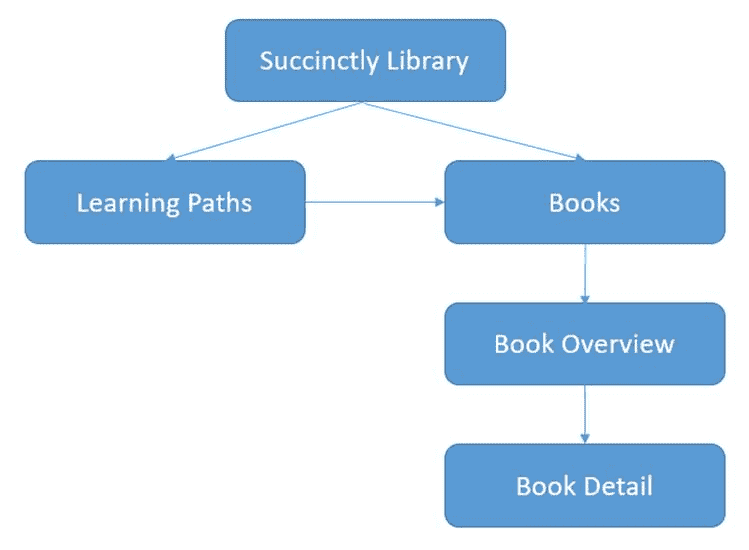
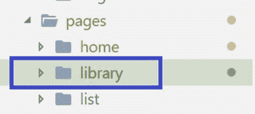
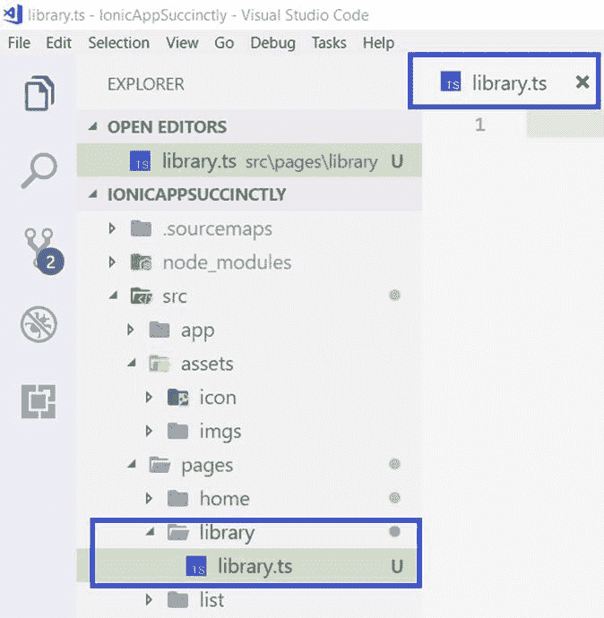
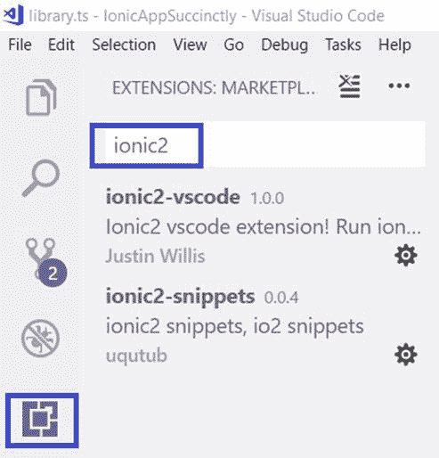
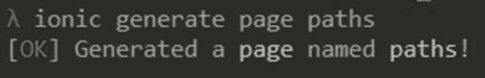
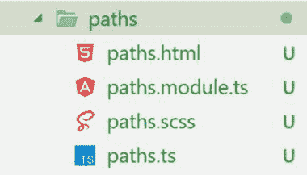
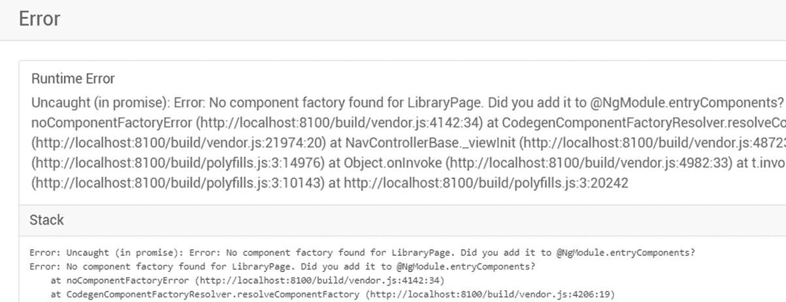
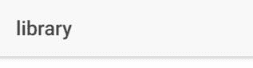
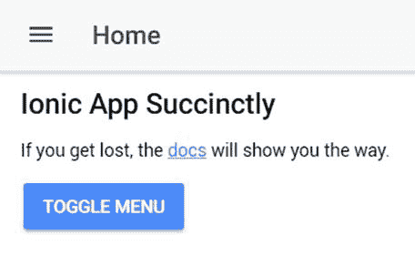
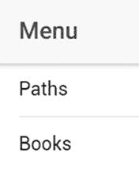

# 三、启动应用

## 快速介绍

我们已经设法覆盖了一些领域——我们已经启动并运行了 ion，还探索了 Ionic CLI 为我们创建的项目结构。

然而，为了能够扩展我们的应用程序并为其提供我们想要实现的功能，我们需要了解爱奥尼亚的导航系统是如何工作的。这将是本章的重点。说到这里，让我们直接进入，开始探索爱奥尼亚引人入胜、设计精良的导航系统。

## 概述

Ionic-角度导航与Ionic 1 完全不同，因为它已经从头开始重写。

在爱奥尼亚角，导航系统的基础被称为导航堆栈——这是我们首先需要了解的。了解导航栈如何工作将有助于我们修改我们的应用程序，并将我们的应用程序最终将使用的必要视图放置到位。

像任何导航系统一样，我们也将探索如何在视图之间传递参数。

## 导航栈

顾名思义，爱奥尼亚的导航系统基于堆栈的概念，这意味着视图是一个安装在另一个之上的。

这个堆栈提供了一个用于导航的应用编程接口，Ionic-角度应用程序使用；然而，Ionic 所做的不仅仅是为我们提供一个堆栈来挂载我们应用的视图。在幕后，爱奥尼亚通过在 DOM 中缓存页面来帮助我们提高应用的性能。

当用户在我们的应用程序上触发一个打开视图的动作时，一个新页面会在向前导航时被推到堆栈上，然后在向后导航时弹出堆栈。本质上，这是导航栈如何工作的典型机制。

如今，许多应用程序将只使用一个导航堆栈，称为根堆栈。然而，Ionic键支持多个导航栈——一个选项卡式布局包含它自己的导航栈，它完全独立于根栈。

图 3-a 说明了一个典型的导航栈在肉眼看来是怎样的，如果我们真的能看到视图是如何内部组织的。


图 3-a:典型的导航堆栈

请注意页面是如何一页叠一页的。最近的页面(紫色)位于顶部，而用户打开的第一个页面(蓝色)位于堆栈的底部。

## 【AngularJS 与 ion 的主要区别

在 Ionic 1(带有 AngularJS)中，导航系统基于 UI Router 组件，该组件围绕着导航中 URL 的使用展开。尽管Ionic 1 的导航系统并不完全需要网址，因为也可以使用命名路线，但Ionic角完全背离了这一点。导航是基于堆栈工作的，所以 URL 不再重要，至少对于基本导航来说是如此。

ion-Angular 仍然支持 URL，但支持深度链接，这是一种允许用户直接跳转到应用程序内部更深处的视图的功能，例如可以从网络浏览器启动的视图。

## 应用导航概述

为了更好地理解我们将要构建的应用程序的导航系统，最好用一个简单的图表来勾勒出来。

在图 3-b 中，应用程序的主页面将由*简洁地*系列中的书籍列表组成。从那里，将有两条可能的导航路线——要么是特定书籍的概述(及其细节)，要么是与该书相关的学习路径，其中将包括相关书籍的列表。

从相关书籍列表中，还可以直接导航到特定书籍的概述及其详细信息。



图 3-b:我们应用的页面

在我们开始实现这个导航系统之前，我们首先需要为这些屏幕生成几个页面。

让我们从**库**页面开始，因为这将作为我们应用程序的主页。

## 创建应用程序的主页

从这里开始，我们将开始编写代码。我通常更喜欢在编写代码时使用较浅的主题(而不是较深的主题)——这只是我个人的偏好，所以我将把我的 Visual Studio Code 主题更改为较浅的主题，您会在接下来的屏幕截图中注意到这一点。

要创建应用程序的主页，请在 Visual Studio Code 中导航至 **\src\pages** 文件夹，并在其下创建一个名为**库**的新文件夹。

这将是我们应用程序的主页面，与图 3-b 中的**简洁库**页面相对应



图 3-c:“库”文件夹

创建了这个文件夹后，让我们在新目录中创建一个 TypeScript 文件，它将作为我们的组件。我们将这个文件称为库。



图 3-d:库文件

创建这个文件后，让我们继续添加以下样板代码。这将是该组件的基础。

代码清单 3-a:库的样板代码

```js
  import {
  Component }
  from '@angular/core';
  import {
  IonicPage, NavController, NavParams }
  from 'ionic-angular';

  @IonicPage()
  @Component({

  templateUrl: 'library.html',
  })
  export class LibraryPage {

  constructor(public navCtrl: NavController, public navParams: NavParams) 
  { }

  ionViewDidLoad() {

  console.log('ionViewDidLoad LibraryPage');

  }
  }

```

这段代码只是创建了一个引用 HTML 文件的 TypeScript Angular 组件，该文件将包含此页面的布局。我们将增加额外的功能。

创建这个组件还需要我们为它创建相应的 HTML 文件，我们称之为**library.html**。我们可以在同一个 **\library** 文件夹中创建这个文件。

一旦您创建了这个文件，请向其中添加以下样板代码。

代码清单 3-b:library.html 的样板代码

```js
  <ion-header>

  <ion-nav-bar>

  <ion-title>Succinctly Library</ion-title>

  </ion-nav-bar>
  </ion-header>

  <ion-content padding>
  </ion-content>

```

查看这段代码，我们可以看到我们有一个带有`ion-nav-bar`组件的`ion-header`，其中放置了页面的标题。

建议Ionic角页有对应的`NgModule`。这意味着我们还应该手动创建一个 library.module.ts 文件；但是，使用代码清单 2-e 中描述的语法，就不需要为每个页面都有一个. module.ts 文件。

有一种方法可以自动生成一个. module.ts 文件(以及与新页面对应的所有文件)。这可以通过运行`ionic generate page »page name»` 命令来实现。

现在，让我们用以下样板代码在 **\library** 文件夹中手动创建一个 **library.module.ts** 文件。

代码清单 3-c:库模块的样板代码

```js
  import {
  NgModule }
  from '@angular/core';
  import {
  IonicPageModule }
  from 'ionic-angular';
  import {
  LibraryPage }
  from './library';

  @NgModule({

  declarations: [

  LibraryPage,

  ],

  imports: [

  IonicPageModule.forChild(LibraryPage),

  ],
  })
  export class LibraryPageModule {}

```

我们现在已经为我们的主页创建了基本的代码模板。在创建其他页面之前，让我们快速了解一下如何让我们的 ion-Angular 开发生活变得更轻松。

## Visual Studio 代码Ionic插件

Visual Studio Code 是一个很好的开发环境，因此，它有一个庞大的第三方插件生态系统，这让开发人员的生活变得更加轻松。

为了让我的Ionic-角度开发更容易，我通过**扩展**选项安装了一些插件，输入**Ionic**或**Ionic 2** ，如下图所示。



图 3-e:Visual Studio 代码的Ionic扩展

一旦插件安装完毕，你会在你安装的每个插件旁边看到一个小按钮，请求**重新加载** Visual Studio 代码。

要使用插件，单击任何**重新加载**按钮——这将关闭当前运行的 Visual Studio 代码实例，并打开一个新实例。

我们现在已经安装了一些我们可以使用的很酷的Ionic插件。

## 使用命令行界面创建页面

我有点老派，这意味着我喜欢从头开始写代码。然而，如今，许多工具——包括Ionic命令行界面——都能够通过简单地运行一个命令来生成样板代码。让我来告诉你如何用Ionic角度来做这件事。

我将打开命令提示符，导航到我有我们正在构建的应用程序代码的文件夹。为了生成新页面，我只需要输入以下命令。

代码清单 3-d:Ionic生成页面命令

```js
  ionic
  generate page paths

```

关键字`paths`是将由 Ionic CLI 生成的目录的实际名称。一旦命令成功执行，我们将看到类似这样的输出。



图 3-f:Ionic命令行界面命令成功执行

这有多酷？如果我们现在检查 Visual Studio 代码中的文件夹结构，我们可以看到添加了以下文件。



图 3-g:“路径”页面文件

**路径**文件对应于图 3-b 中的**学习路径**页面。有了这个，让我们用Ionic键命令行界面为我们的应用程序创建剩余的页面。

让我们创建 **Books** 页面——我们可以通过执行以下命令来实现。

代码清单 3-e:生成图书页面

```js
  ionic
  generate page books

```

下一个是**书籍概览**页面。我们可以通过运行以下命令来生成它。

代码清单 3-f:生成图书概览页面

```js
  ionic
  generate page bookoverview

```

我们需要为我们的应用生成的最后一个页面是**图书详情**页面。让我们用下面的命令创建它。

代码清单 3-g:生成图书详细信息页面

```js
  ionic
  generate page bookdetail

```

如果愿意，也可以通过运行以下命令自动生成**库**页面文件。但在此之前，请移除**图书馆。*** 您之前创建的文件。

代码清单 3-h:生成库页面

```js
  ionic
  generate page library

```

我们的应用程序将使用的所有页面现在都已生成。我们可以通过在 Visual Studio 代码中进入它们各自的文件夹来检查它们的文件。

## 连接新页面

现在我们已经有了我们的应用程序需要的所有页面，我们需要删除对开箱即用的两个页面的引用，以及在创建应用程序时为我们生成的命令行界面:**主页**和**列表**。

为此，请打开 **\src\app** 文件夹下的 **app.component.ts** 文件，删除对**主页**和**列表**页面的引用，并添加对我们已经创建的一些页面的引用，如:**库**、**路径**、**书籍**。

我们还需要将`rootPage`变量指向`LibraryPage`而不是`HomePage`。此外，`this.pages`(用于侧菜单)也进行了更新。

更新后的 app.component.ts 文件现在应该如下所示。

代码清单 3-i:更新后的应用程序组件文件

```js
  import {
  Component, ViewChild }
  from '@angular/core';
  import {
  Nav, Platform }
  from 'ionic-angular';
  import {
  StatusBar }
  from '@ionic-native/status-bar';
  import {
  SplashScreen }
  from '@ionic-native/splash-screen';

  import {
  LibraryPage }
  from '../pages/library/library';
  import {
  PathsPage }
  from '../pages/paths/paths';
  import {
  BooksPage }
  from '../pages/books/books';

  @Component({

  templateUrl: 'app.html'
  })
  export class MyApp {

  @ViewChild(Nav) nav: Nav;

  rootPage: any =
  LibraryPage;

  pages: Array<{title: string, component: any}>;

  constructor(public platform: Platform, public statusBar: StatusBar, 

  public splashScreen: SplashScreen) {

  this.initializeApp();

  this.pages = [

  { title: 'Paths', component: PathsPage },

  { title: 'Books', component: BooksPage }

  ];

  }

  initializeApp() {

  this.platform.ready().then(() => {

  this.statusBar.styleDefault();

  this.splashScreen.hide();

  });

  }

  openPage(page) {

  this.nav.setRoot(page.component);

  }
  }

```

现在，运行`ionic serve`命令，打开浏览器，看看它的外观。就我而言，我看到了以下情况。



图 3-h:运行时错误

哎呀！等等，这里发生了什么？

我们得到这个错误是因为我们还需要编辑 app.module.ts 文件，删除对**主页**和**列表**页面的旧引用，并添加对**库**页面的引用。

下面是更新后的 app.module.ts 文件的外观。

代码清单 3-j:更新的应用程序模块文件

```js
  import {
  BrowserModule }
  from '@angular/platform-browser';
  import {
  ErrorHandler, NgModule }
  from '@angular/core';
  import {
  IonicApp, IonicErrorHandler, IonicModule }
  from 'ionic-angular';

  import {
  MyApp }
  from './app.component';
  import {
  LibraryPage }
  from '../pages/library/library';

  import {
  StatusBar }
  from '@ionic-native/status-bar';
  import {
  SplashScreen }
  from '@ionic-native/splash-screen';

  @NgModule({

  declarations: [

  MyApp,

  LibraryPage

  ],

  imports: [

  BrowserModule,

  IonicModule.forRoot(MyApp),

  ],

  bootstrap: [IonicApp],

  entryComponents: [

  MyApp,

  LibraryPage

  ],

  providers: [

  StatusBar,

  SplashScreen,

  {provide: ErrorHandler, useClass: IonicErrorHandler}

  ]
  })
  export class AppModule {}

```

我所做的是用**库**页面名称更新`NgModules` `declarations`和`entryComponents`数组。

因为我们正在运行`ionic serve`命令，所以它正在实时执行，当发生任何变化时重新加载。现在让我们来看看浏览器。



图 3-i:应用程序的更新用户界面(1)

基于我们最近所做的更改，**库**页面现在被设置为我们应用的主页。

然而，正如你所理解的，还没有太多的用户界面。要加快一点速度，只需打开**home.html**文件，拷贝其内容，用你拷贝的内容替换**library.html**的内容。

看看你的浏览器——现在用户界面应该如下所示。



图 3-i:应用程序的更新用户界面(2)

考虑到我们之前在 app.component.ts 上用我们用 CLI 创建的主页面的名称更新了`this.pages`，特别是**路径**和**书籍**，侧菜单现在应该如下所示。



图 3-j:更新的侧面菜单

现在，我们已经将所有新页面连接到我们使用 CLI 创建的原始脚手架项目。

## 总结

在这一章中，我们已经快速了解了 ion-Angular 中的导航堆栈是如何工作的，并通过添加构建应用程序所需的页面开始了我们的项目。

我们还通过添加对 app.component.ts 和 app.module.ts 文件的必要引用，将这些页面连接到最初搭建的项目。

我们现在已经准备好实际构建我们的应用程序——这是我们在下一章要做的。让我们把手弄脏吧。