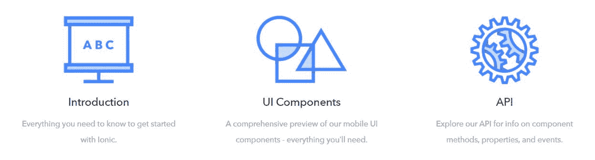
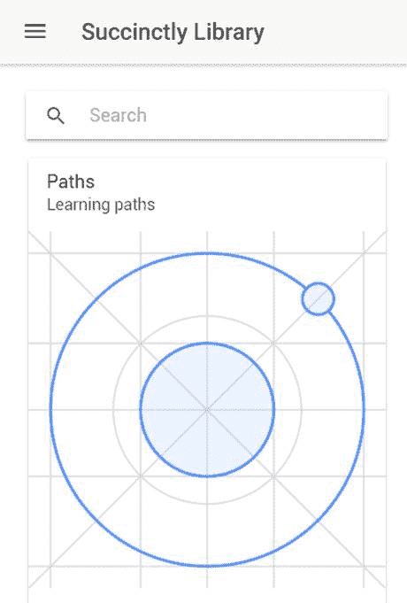
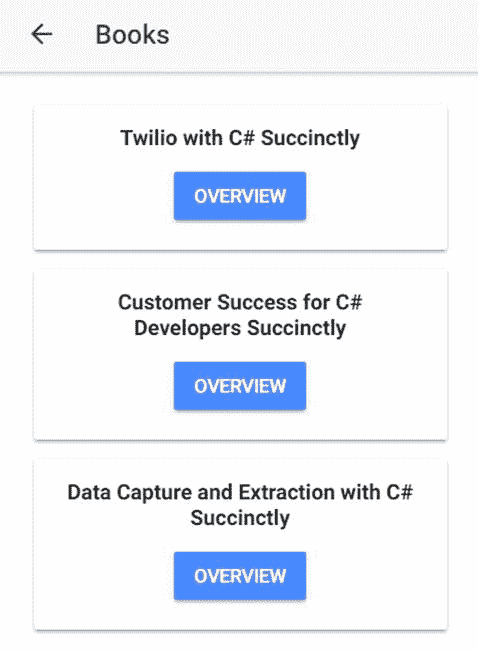

# 第五章更多资源

## 快速介绍

离子框架还有很多东西，我可能至少还需要两三本书来涵盖它，谁知道呢——我可能会在未来写一篇关于这个主题的后续文章。但就目前而言，我认为我们已经设法实现了覆盖如何开始和构建一些东西的目标，而不会增加不必要的复杂性。

无论如何，我想快速浏览一些额外的离子框架资源和细节，这些资源和细节可能会在您独自探索这个迷人的生态系统时派上用场。

## 探索文档

不用说，从各个角度来看，离子[文档](https://ionicframework.com/docs/)都是决定性的资源。它被组织成不同的部分，使得任何人都可以非常容易地找到相关信息。



图 5-a:离子文档网站截图

以下是文档涵盖的主要部分:

*   简介:框架入门。
*   用户界面组件:所有可用组件的参考指南。
*   API 参考:所有方法、属性和事件的最新细节。
*   离子原生:如何集成原生功能和使用插件。
*   主题:如何改变你的应用的外观和感觉。
*   爱奥尼亚图标:关于所有爱奥尼亚定制设计的图标资源的广泛信息。
*   命令行界面:关于如何使用命令行界面的完整信息。

除了这些主题之外，文档网站还提供了广泛的常见问题解答，并主办了一个论坛，用户可以在论坛上询问离子技术团队的各种问题，并获得对其查询的反馈。

总的来说，文档是一种无价的资源。

## 原生插件

运行在浏览器上的离子应用程序将无法访问设备上的硬件。关于离子的一个伟大的事情是，它有插件来绕过这些限制。

这些插件通常被称为本机插件，因为它们允许您访问设备上的硬件。


图 5b:一个“插件”图标

随着时间的推移，这些插件已经扩展到不仅仅提供对硬件的访问，还提供了许多你可以从移动应用中期待的不同功能。

其中许多插件只能在设备上直接测试，在浏览器上测试时可能会失败。原因是这些插件中的许多可能正在寻找只存在于设备本身的硬件功能。

最著名或最常用的插件之一是提供设备摄像头访问的插件。虽然我们不会在应用程序中添加更多的代码来使用摄像头，但是了解您可能会使用哪些命令以备不时之需是非常有用的。

代码清单 5-a:安装相机插件的命令

```
  ionic
  cordova plugin add cordova-plugin-camera
  npm
  install --save @ionic-native/camera

```

这些命令的执行让我们安装了必要的科尔多瓦插件，让我们可以访问设备的摄像头，允许我们捕捉静态图像和视频。

安装后，您可以使用以下代码来导入插件并注入`Camera`对象——这是在一个 TypeScript 文件中完成的。

代码清单 5-b:导入相机插件

```
  import {
  Camera, CameraOptions }
  from '@ionic-native/camera';

  export class SomeClass {

  constructor(private camera: Camera)    

  { }
  }

```

下面的例子说明了我们如何为`getPicture`方法提供相机选项。

代码清单 5-c:向 getPicture 方法提供相机选项

```
  const options = CameraOptions = {

  destinationType: this.camera.DestinationType.DATA_URL,

  mediaType: this.camera.MediaType.PICTURE
  };

  this.camera.getPicture(options).then((imageData) => {

  let base64Image = 'data:image/jpeg;base64,' + imageData

  }, (err) => {
  });

```

相机选项允许我们控制图像或视频。

还有许多其他插件——一个常见的是推送插件。在爱奥尼亚使用插件是通过爱奥尼亚本地库完成的。

Ionic Native 是 Cordova/PhoneGap 插件的一个 TypeScript 包装器，它可以轻松地将您需要的任何原生功能添加到您的 ion 移动应用程序中。

我强烈建议你通过查看官方的离子原生[文档](https://ionicframework.com/docs/native/)来研究使用原生插件的所有可能性。

## 搜索栏

我们可以潜在地添加到我们的应用程序中的东西是搜索栏，这已经成为当今大多数应用程序中的预期组件。

如果我们查看应用程序的主屏幕，很难快速找到图书馆中列出的任何一本书。

为了找到一本书，我们必须浏览**路径**或**书籍**页面——这很好，但是如果我们必须浏览 100 本或更多的书，这将会有点乏味。

为了更容易搜索特定的书籍，让我们将搜索栏添加到应用程序的**图书馆**页面——这将允许我们直接导航到该书的**书籍概述**页面。

下面是一个离子搜索栏在标记代码中的外观。

代码清单 5-d:一个离子搜索栏

```
  <ion-searchbar placeholder="Search titles, press enter" 

  [(ngModel)]="queryText"
  (search)="updateBooks()">
  </ion-searchbar>

```

我们可以看到，搜索栏有一些属性:`placeholder`、`ngModel`查询文本和`search`，这是按回车键时将执行的方法。

在我们实际添加任何功能之前，让我们看看它在屏幕上的外观。我们可以通过如下方式将该代码添加到**library.html**文件中，然后运行`ionic serve`命令。

代码清单 5-e:更新的 library.html 文件

```
  <ion-header>

  <ion-navbar>

  <button ion-button menuToggle>

  <ion-icon name="menu"></ion-icon>

  </button>

  <ion-title>Succinctly Library</ion-title>

  </ion-navbar>
  </ion-header>
  <ion-content padding>

  <ion-searchbar placeholder="Search titles, press enter " 

  [(ngModel)]="queryText" (search)="updateBooks()">

  </ion-searchbar>

  <ion-list *ngFor="let card of cardData"
  no-padding>

  <ion-card>

  <ion-item>

  <h2>{{card.header}}</h2>

  <p>{{card.short}}</p>

  </ion-item>

  

  <ion-card-content>

  <ion-card-title>

  {{card.title}}

  </ion-card-title>

  <p>{{card.description}}</p>

  </ion-card-content>

  <ion-row center>

  <ion-col text-center>

  <button ion-button [navPush]=card.pushPage>

  {{card.buttontxt}}

  </button>

  </ion-col>

      </ion-row>

  </ion-card>

  </ion-list>
  </ion-content>

```

下面的截图显示了**库**页面现在的样子。



图 5-c:带有搜索栏的库页面

我们现在有一个好看的搜索栏，但它还没有做任何事情。接下来，我们将向其中添加实际的搜索功能。

## 添加搜索功能

随着 library.html 文件的更新，我们接下来要做的就是为我们的搜索功能添加逻辑。

这意味着我们必须先更新 **library.ts** 文件，然后还要更新 **books.ts** 、*T6。我们先定义一下`updateBooks`方法背后的逻辑，如下。*

代码清单 5-f:更新书籍方法

```
  existsIn(str) 
  {

  let res = false;

  for (var i =
  0; i < this.booksData.length; i++) {

    if (this.booksData[i].title.toLowerCase().
          indexOf(str.toLowerCase()) >= 0)
  {

  res =
  true;

  break;

  }

  }

  return res;
  }

  itemExists(haystack, needle) 
  {

  for (var i =
  0; i < haystack.length; i++) {

    if (haystack[i].title.toLowerCase().

     indexOf(needle.toLowerCase()) >= 0) {

  if (!this.existsIn(haystack[i].title)) {

  this.booksData.push(haystack[i]);

  }

  }

  }
  }

  updateBooks() 
  {

  this.booksData = [];

  if (this.queryText !== undefined) {

    let qry = this.queryText.toLowerCase();

  this.itemExists(BooksData, qry);

  if (this.booksData.length > 0)
  {

    this.navCtrl.push(BooksPage, this.booksData);

  }

  }
  }

```

`updateBooks`方法基本上是检查`this.queryText`是否作为其中一个书名存在。这是通过`itemExists`方法完成的，该方法基本上遍历`BooksData`数组的所有元素，并验证这些标题中的哪一个包含`this.queryText`。

如果`itemExists`方法能够找到匹配，那么它会验证`BooksData`的匹配元素在`this.booksData`内还不存在——这样就不会在`this.booksData`中添加重复的元素。

当按下回车键时，`this.booksData`数组将作为`navParams`传递到**书籍**页面。

如您所见，所有这些逻辑都非常简单明了。既然已经解释了这一点，让我们来看看更新后的 library.ts 文件。

代码清单 5-g:更新后的库文件

```
  import {
  Component }
  from '@angular/core';
  import {
  IonicPage, NavController, NavParams }
  from 'ionic-angular';
  import {
  PathsPage }
  from '../../pages/paths/paths';
  import {
  BooksPage, BooksData }
  from '../../pages/books/books';

  @IonicPage()
  @Component({

  selector: 'page-library',

  templateUrl: 'library.html',
  })
  export class LibraryPage {
    queryText: string;

  booksData =
  [];

  cardData =
  [

  { img:
  '../../assets/imgs/logo.png',

  header: 'Paths', 

  short: 'Learning
  paths', 

  title: '', 

  description: 'Paths
  are books organized by related topics', 

  buttontxt: 'Explore
  Paths',

  pushPage: 'PathsPage'

  },

  { img:
  '../../assets/imgs/azure.jpg',

  header: 'Books', 

  short: 'Books
  to read', 

  title: '', 

  description: 'Over
  130 books on technologies that matter', 

  buttontxt: 'Browse
  Books',

  pushPage: 'BooksPage'

  }

  ];

  existsIn(str) {

  let res = false;

  for (var i =
  0; i < this.booksData.length; i++) {

  if (this.booksData[i].title.toLowerCase().

  indexOf(str.toLowerCase()) >= 0) {

  res =
  true;

        break;

  }

  }

  return res;

  }

  itemExists(haystack, needle) {

  for (var i =
  0; i < haystack.length; i++) {

  if (haystack[i].title.toLowerCase().

  indexOf(needle.toLowerCase()) >= 0) {

  if (!this.existsIn(haystack[i].title)) {

  this.booksData.push(haystack[i]);

  }

  }

  }

  }

  updateBooks() {

  this.booksData = [];

  if (this.queryText !== undefined) {

  let qry = this.queryText.toLowerCase();

  this.itemExists(BooksData, qry);

  if (this.booksData.length > 0)
  {

  this.navCtrl.push(BooksPage, this.booksData);

  }

  }

  }

  constructor(public navCtrl: NavController, public navParams: NavParams)    

  { }

  ionViewDidLoad() {

  console.log('ionViewDidLoad LibraryPage');

  }
  }

```

我们可以看到，除了`updateBooks`方法相关的修改，library.ts 文件中唯一的其他变化是我们从 **Books** 页面导入了原始的`BooksData`数组，声明了`queryText`，并初始化了`this.booksData`。

为了让它真正工作，我们需要让 **Books** 页面知道它可能通过搜索栏从**图书馆**页面接收数据。

所以在 **books.ts 文件**的`constructor`上，我们需要添加一些代码来验证`navParams.data`是否真的不是空的。

默认情况下， **Books** 页面会显示库中的所有书籍，因此当使用 **BROWSE BOOKS** 按钮从 **Library** 页面调用时，会显示`BooksData`数组的所有元素。这意味着，在这种情况下，`navParams.data`为空。

但是，当从**库**页面的搜索栏调用**图书**页面时，只有`BooksData`数组的一个子集作为`navParams`传递到**图书**页面，这意味着`navParams.data`不是空的。

因此，需要修改`constructor`来处理这个新场景，如下所示。

代码清单 5-h:书籍的更新构造器

```
  constructor(public navCtrl: NavController, public navParams: NavParams) 
  { 

  this.booksData = !this.isEmpty(navParams.data) ? 

  navParams.data : BooksData;
  }

```

为了检查`navParams.data`是否为空，我们需要调用另一个名为`isEmpty`的方法，其编码如下。

代码清单 5-I:isEmpty 方法

```
  isEmpty(obj) 
  {

  for (var key in obj) {

    if (obj.hasOwnProperty(key))

    return false;

  }

  return true;
  }

```

该方法简单地遍历对象的每个键值对，并检查一个`key`是否有相应的值— `hasOwnProperty`。

有了这个额外的逻辑，更新后的 books.ts 文件现在看起来如下。

代码清单 5-j:更新后的图书文件

```
  import {
  Component }
  from '@angular/core';
  import {
  IonicPage, NavController, NavParams }
  from 'ionic-angular';

  export let BooksData =
  [
  { title: 'Force.com Succinctly', page: 'BookoverviewPage', 
  overview: { author: 'Ed Freitas', numpages: 100,

  published: 'December 08, 2017',
  details: { page: 'BookdetailPage',
  pic: 'https://cdn.syncfusion.com/conteimg/downloads/ebook/ebook-cover/forcedotcomsuccinctly.jpg?v=09012018021233',
  url: 'https://www.syncfusion.com/ebooks/forcedotcomsuccinctly' } }
  },

  { title: 'Azure Cosmos DB and DocumentDB
  Succinctly', page: 'BookoverviewPage',
  overview: { author: 'Ed Freitas', numpages: 103,

  published: 'May 23, 2017', 
  details: { page: 'BookdetailPage',
  pic: 'https://cdn.syncfusion.com/conteimg/downloads/ebook/ebook-cover/Azure_Cosmos_DB_and_DocumentDB_Succinctly.jpg?v=09012018021233',
  url: 'https://www.syncfusion.com/ebooks/azure_cosmos_db_and_documentdb_succinctly' } }
  },

  { title: 'Microsoft Bot Framework Succinctly', page: 'BookoverviewPage',
  overview: { author: 'Ed Freitas', numpages: 109,

  published: 'May 02, 2017',
  details: { page: 'BookdetailPage',
  pic: 'https://cdn.syncfusion.com/conteimg/downloads/ebook/ebook-cover/Microsoft_Bot_Framework_Succinctly.jpg?v=09012018021233', 
  url: 'https://www.syncfusion.com/ebooks/azure_cosmos_db_and_documentdb_succinctly' } }
  },

  { title: 'Twilio with C# Succinctly', page: 'BookoverviewPage',
  overview: { author: 'Ed Freitas', numpages: 107,

  published: 'April 03, 2017',
  details: { page: 'BookdetailPage',
  pic: 'https://cdn.syncfusion.com/conteimg/downloads/ebook/ebook-cover/Twilio_with_C_sharp_Succinctly.jpg?v=09012018021233', 
  url: 'https://www.syncfusion.com/ebooks/twilio_with_c_sharp_succinctly' } }
  },

  { title: 'Customer Success for C# Developers
  Succinctly', page: 'BookoverviewPage',
  overview: { author: 'Ed Freitas', numpages: 97,

  published: 'October 03, 2016',
  details: { page: 'BookdetailPage',
  pic: 'https://cdn.syncfusion.com/conteimg/downloads/ebook/ebook-cover/Customer_Success_Succicntly.jpg?v=09012018021233', 
  url: 'https://www.syncfusion.com/ebooks/customer_success_for_c_sharp_developers'} } },

  { title: 'Data Capture and Extraction with
  C# Succinctly', page: 'BookoverviewPage',
  overview: { author: 'Ed Freitas', numpages: 85,

  published: 'September 19, 2016',
  details: { page: 'BookdetailPage',
  pic: 'https://cdn.syncfusion.com/conteimg/downloads/ebook/ebook-cover/Data_Capture_And_Extraction_Succinctly.jpg?v=09012018021233',
  url: 'https://www.syncfusion.com/ebooks/data_capture_and_extraction_with_c_sharp_succinctly' } }
  }
  ];

  @IonicPage()
  @Component({

  selector: 'page-books',

  templateUrl: 'books.html',
  })
  export class BooksPage {

  booksData =
  BooksData;

  isEmpty(obj) {

  for (var key in obj) {

  if (obj.hasOwnProperty(key))

  return false;

  }

  return true;

  }

  constructor(public navCtrl: NavController, public navParams: NavParams) 

  { 

  this.booksData = !this.isEmpty(navParams.data) ? 

  navParams.data : BooksData;

  }

  ionViewDidLoad() {

  console.log('ionViewDidLoad BooksPage');

  }
  }

```

我们已经完成了准备搜索栏所需的所有更改。现在让我们运行`ionic serve`命令，并检查我们的搜索栏的功能。

为了测试正确，我会输入 **C#** 并按**进入**。我预计会得到三个结果——让我们看看情况是否如此。



图 5-d:搜索栏结果

太好了——果然有效。通过简单地添加一点额外的功能并重用我们已经拥有的代码，我们能够为我们的应用程序添加一个非常酷和有用的特性。

## 完整、更新的源代码

我们应用程序的完整、更新的源代码，包括搜索栏的最新更改，可以在[这里](https://onedrive.live.com/?cid=01efa00412ef5700&id=1EFA00412EF5700%21279244&authkey=!AMb_5820aKKz-a0)下载。

## 其他要探讨的话题

尽管我们已经覆盖了相当多的领域，但关于令人惊叹的离子生态系统，仍有许多东西需要探索和学习。

以下是我建议你在自己的时间里查看和调查的项目列表。虽然这个列表远非结论性的，但它包含了一些很好的方面，在我看来，值得深入研究:

*   离子原生的地理定位。
*   用离子原生检测振动和运动。
*   使用离子原生扫描条形码。
*   带有离子原生的通知。
*   将 SQLite 集成到您的应用程序中。
*   原生平台上的部署和测试:iOS 和安卓。

## 总结

ion 是一个成熟、可靠、易于学习和最先进的移动和进步网络应用开发框架。用这个框架用几行代码就能完成的事情非常了不起。

这本书的目标是向你展示一个简单但有趣的例子，关于如何用离子键构建一个有用的应用程序，而不需要任何关于离子键 1 或 Angular 的知识。我认为我们实现了这个目标，并在这一过程中获得了一些乐趣。

这本书绝不是一部离子“圣经”，因为框架的长度、深度和扩展需要比我们目前所能涵盖的更多的页面——但是我们确实设法通过一些简单的步骤介绍和展示了您可以用这个框架做什么。

我真的希望你和我一样喜欢阅读这本书，我希望这能成为你继续探索这项迷人技术的灵感来源。

谢谢你，祝你下次一切顺利。