# 第二章入门

在本节中，我们将研究如何安装 Eclipse 集成开发环境(IDE)。Eclipse 是一个用于编程、维护、调试和编译 Java 应用程序的工具。集成开发环境是使应用程序开发更容易的工具的集合。像许多语言一样，Java 只需要一个控制台和一个文本编辑器(比如记事本)就可以编程。然而，使用记事本作为集成开发环境是费力的，并且会导致错误。像 Eclipse 这样功能齐全的集成开发环境可以大大减少用一种语言解决问题所需的时间。Eclipse 提供了语法突出显示、错误修复建议、应用程序的单击测试和调试，以及数以千计的其他选项来帮助简化编程。

## 下载安装 Eclipse

要获得最新版本的 Eclipse，前往[https://eclipse.org/downloads/](https://eclipse.org/downloads/)。

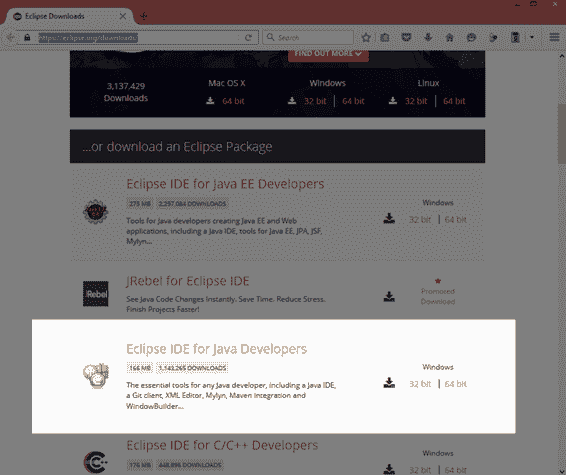

图 3: Eclipse 下载页面

有几个版本的 Eclipse 可供下载(也有几种可以使用 Eclipse 开发的语言)。我在这本电子书中使用了面向 Java 开发人员的 Eclipse IDE，版本是 Mars.1 Release (4.5.1)。旧版和新版的 Eclipse 也可以。在撰写本文时，Eclipse 主下载页面的顶部还提供了 Eclipse 安装程序，这是一个安装向导，旨在简化 Eclipse 的安装。如果您无法使用这里描述的手动方法安装 Eclipse，您可以尝试使用安装向导进行安装。

在图 4 中高亮区域的右侧，有两个选项:32 位和 64 位。我建议您使用 64 位版本的 Eclipse，除非您确定您的机器只有 32 位。

当您单击标有“64 位”的橙色按钮(或标有“32 位”的按钮)时，您将被带到选择镜像的站点。这是下载 Eclipse 的来源。选择最靠近您所在区域的镜子(这很可能是左侧显示的默认镜子)。参见图 4。

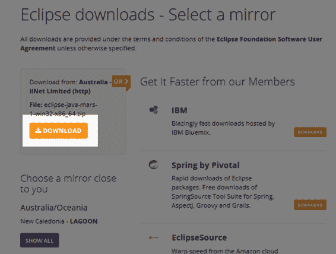

图 4:选择镜像

选择不同的镜像可能会改变您完成下载所需的时间，一般来说，镜像离您的地理位置越近，您下载 Eclipse 的速度就越快。

选择镜像后，您将进入一个页面，如果您愿意，您可以向 Eclipse 基金会捐款。下载应该开始了。系统会询问您希望将文件下载到哪里。根据您的网络浏览器，保存文件的确切机制有所不同，但请确保您知道下载的方向，因为我们需要在文件下载完成时提取文件。下载完成后，您将有一个类似于“*eclipse-Java-mars-1-win32-x86 _ 64 . zip，*”的文件，这是 Eclipse 程序的压缩 Zip 存档。

下载完成后，找到这个文件并提取它。您希望放置 Eclipse 的确切位置完全由您决定，但是对于 32 位版本，最好将其放在应用程序文件夹中，例如“C:\Program Files”或“C:\Program Files (x86)”创建您想要放置 Eclipse 的文件夹，将 Zip 文件复制到该文件夹中，并通过右键单击文件并选择**提取到**选项来提取它(如图 5 和 6 所示)。

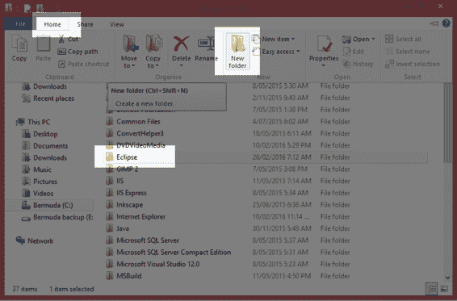

图 5:创建 Eclipse 文件夹

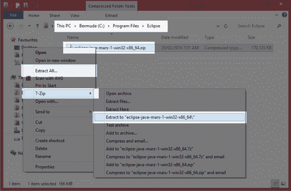

图 6:提取 Eclipse 压缩文件

|  | 注意:在 Windows 8 和更高版本上，我们可以通过右键单击文件并从上下文菜单中选择“全部提取”来提取 Zip 文件。或者，您可以安装专用的归档提取和压缩软件。我推荐程序 7-Zip，这是一个强大而灵活的免费软件压缩工具。 |

在我们使用“Extract All”或一些专用的提取工具提取 Eclipse Zip 文件的内容后，我们将在 Eclipse 文件夹中有一个名为“eclipse-java-***”的子文件夹，其中***是 Eclipse 的版本。导航到这个文件夹和下面的“eclipse”子文件夹，您将看到主要的 Eclipse 文件，如图 7 所示。为了启动 Eclipse IDE，双击名为**Eclipse.exe**的文件。

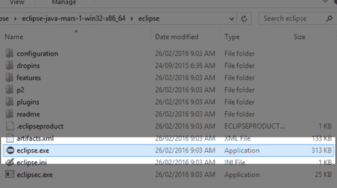

图 7:提取的 Eclipse 文件

|  | 提示:如果您右键单击文件 Eclipse.exe，您可以选择“创建快捷方式”选项单击此选项将在与 EXE 相同的文件夹中创建 Eclipse.exe 文件的快捷方式。然后，您可以将此快捷方式剪切并粘贴到桌面，以便于访问。 |

|  | 注意:您还需要安装 Java 运行时环境(如果您选择从上面的网站下载 Eclipse 安装程序包，则会自动安装该环境)。如果没有安装 Java Runtime Environment，可以从[http://www . Oracle . com/tech network/Java/javase/downloads/index . html](http://www.oracle.com/technetwork/java/javase/downloads/index.html)下载安装。 |

## 项目和工作空间

Java 项目是类、文件和其他资源的集合，它们共同形成一个连贯的应用程序。工作区是开发人员机器上文件夹中的 Java 项目的集合。在本节中，我们将研究在 Eclipse 中创建一个新的 Java 项目，添加一个主类和一个应用程序入口点。在这一点上，我们的程序不会做任何可见的事情。

### 工作区

Eclipse 将项目组织到名为工作区的文件夹中。您可以为每个项目创建一个新的工作区，也可以为多个相关项目使用一个工作区，例如库和使用它们的前端。当您第一次运行 Eclipse 时，您将被要求在开发时指定您希望在其中存储应用程序的工作空间。您可以稍后创建更多的工作区，但是现在让我们使用默认的工作区——位于用户的文件夹( *C:\Users\Chris* 在我的例子中)和一个名为“workspace”的子文件夹中(见图 8)。

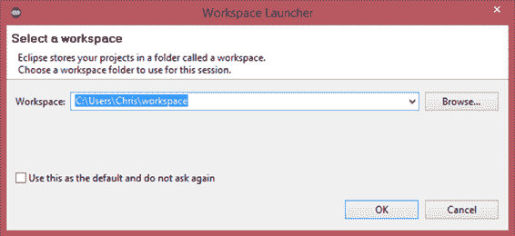

图 8:选择工作空间

选择“使用此作为默认值，不要再询问”选项将导致您创建的所有后续项目都在同一个工作区中创建。这是一个好主意，只不过最终你可能会有数百个项目，而定位你需要处理的项目可能会变得乏味。

### 项目

为了编写一个 Java 应用程序，我们需要创建一个 Java 项目。项目只是组成应用程序的相关文件、文件夹和资源的集合。要开始一个新项目，在文件菜单中点击**新建**，然后点击 **Java 项目**，如图 9 所示。

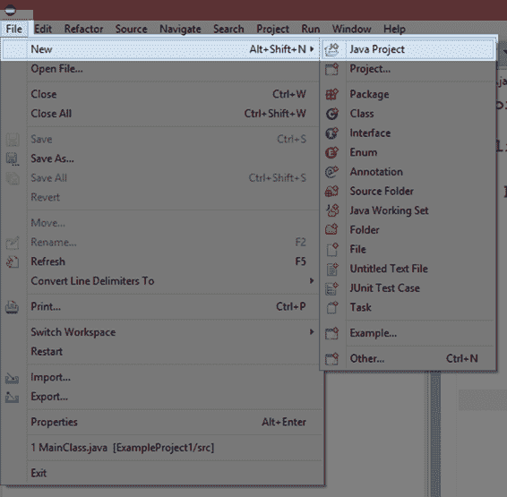

图 9:创建新项目

当您创建一个新项目时，Eclipse 将显示新项目向导(图 10)。

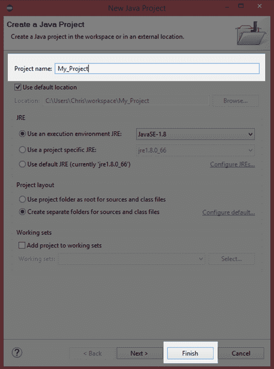

图 10:新建 Java 项目向导

在“新建 Java 项目向导”对话框中，为您的项目指定一个名称，然后单击**完成**(每个项目的名称在工作区中必须是唯一的——我在图 10 中称该项目为 My_Project)。如果选择“下一步”而不是单击“完成”，则可以更改项目的几个更高级的功能，例如输出文件夹，以及是否希望引用其他现有项目。

## 包浏览器

在新建 Java 项目向导中选择完成后，Eclipse 将为您创建一个基本项目，包括一个用于存储您的 Java 源文件的 src 文件夹和一个默认引用的系统库集合。JRE 系统库有很多有用的功能，让我们不必自己编程。我们稍后将检查这些。

包资源管理器(图 11)包含当前工作区中所有项目的树形视图。目前，它只包含一个名为 My_Project 的项目。通过单击左侧的小三角形，可以展开和折叠树视图的节点。

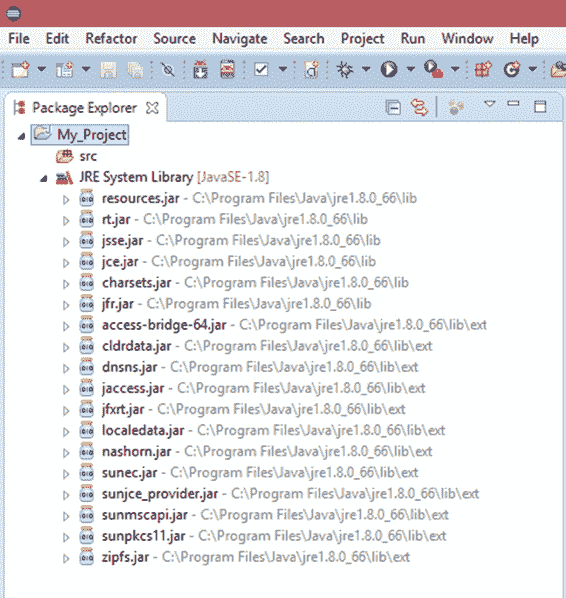

图 11:包浏览器

## Java 源代码

源代码是一个术语，意思是特定计算机编程语言的文本。Java 源代码被输入到我们作为类添加到项目中的纯文本文件中。Java 编译器(一个名为*javac.exe*的程序，与 Eclipse 一起安装了 Java SDK)读取项目中的源代码文件，并将它们转换成机器代码。机器代码可以被 JVM 理解并作为应用程序执行。

在我们做任何其他事情之前，我们想在我们的项目中添加一个新的 Java 类。当我们研究面向对象编程时，我们将探索术语“类”的含义。现在，我们的班级将为我们的申请提供一个起点。在包浏览器中，右键单击 **src** 文件夹，从打开的上下文菜单中选择**新建**和**类**，如图 12 所示。src 文件夹是存储源代码文件的主文件夹。

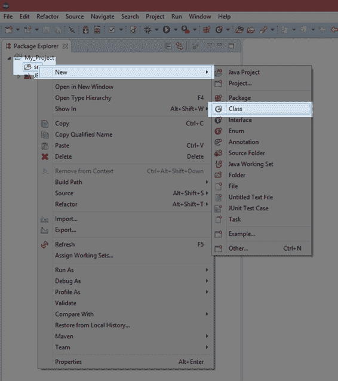

图 12:添加一个新类

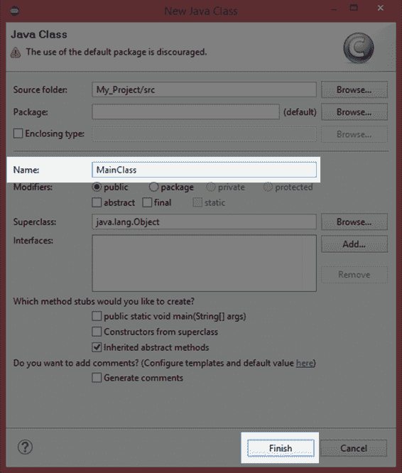

图 13:新建 Java 类向导

在“新建 Java 类”窗口中，键入新类的名称，如 MainClass，然后单击**完成**以继续。Eclipse 将为您创建一个新的源代码文件，并将填充一个 Java 类的基本框架。

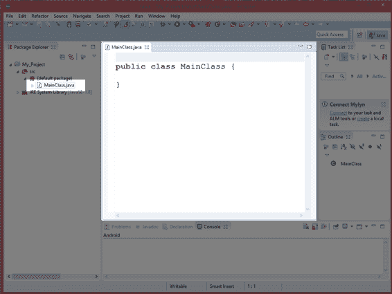

图 14:代码窗口

在图 14 中，代码窗口显示了我们第一个程序的开始。我们在这个窗口中输入我们的 Java 源代码。目前，它有我们请求的类的声明，但没有其他内容。如果在源代码窗口中看不到 MainClass.java 代码，请尝试在包资源管理器中找到该文件—展开 src 节点，双击名为**MainClass.java**的文件。

在未来的章节中，我们将在我们的项目中添加许多类。添加类的方法总是一样的——右键单击包浏览器中的 **src** 文件夹，选择**新建**和 **Java 类**，给类一个唯一的名称。

## 无所事事计划

目前，我们有一个项目，但它没有切入点。JVM 没有地方开始执行我们的代码。Java 应用程序的默认入口点称为主方法。它由一个名为 main 的公共静态方法组成，该方法将字符串数组作为参数。稍后我们将详细了解这意味着什么。现在，为了包含一个主方法，我们需要键入该方法的声明，并在 MainClass 中为主体添加大括号(参见代码清单 2.0)。

代码清单 2.0:无为程序

```
  public class MainClass {
  public static  void main(String[] args) {
        }
  }

```

代码清单 2.0 展示了最简单的 Java 应用程序。这是一个什么都不做的应用程序，只是在运行时退出。当 JVM 被要求加载一个应用程序时(通过调试我们的应用程序或运行它)，它会寻找一个入口点。默认入口点是一个名为 main 的方法，其确切定义如代码清单 2.0 所示:**`public`****`static void`**main(String[]`args`)。

|  | 注意:Java 是区分大小写的。如果您选择在本电子书的示例清单中键入代码，而不是复制和粘贴代码，则必须非常小心地精确匹配大小写。这意味着编译器将术语 Public、PuBlIc、public 和 PUBLIC 视为完全不同的术语。 |

如果没有与代码清单 2.0 中的主方法定义完全匹配的方法，JVM 将不知道从哪里开始执行代码，程序也不会运行。

|  | 注意:主方法必须有确切的声明，除了 args 参数的标识符名称。这个参数只是一个字符串数组，当从命令行调用时，可能会传递给我们的应用程序。当我们从命令行调用一个程序时，我们可以选择提供一个参数列表(因此这个参数被命名为 args)。出于我们的目的，我们将忽略该参数，并假设它将始终为空，并且我们将始终将其称为 args。！ |

### 项目产出

Eclipse 将所有与我们项目相关的文件存储在我们启动时指定的文件夹中。图 15 显示了窗口资源管理器中的文件夹。您会注意到在包资源管理器中有一个可见的 src 文件夹。当我们将源文件添加到包中时，它们将依次被添加到这个文件夹中。

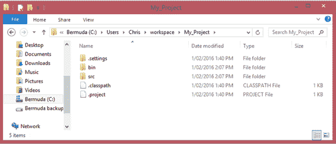

图 15:项目输出

图 15 显示了其他几个文件夹。那个。settings 文件夹用于将项目的所有配置设置存储在一个首选项文件中，该文件默认为*org . eclipse . JDT . core . prefs*。bin 文件夹用于存储二进制应用程序输出，这是 Java 编译器从我们的源代码中生成的可执行机器代码和其他必需的资源文件。

### 调试和运行应用程序

让我们测试我们的应用程序。调试一个应用程序就是以这样一种方式运行它，即向我们提供额外的信息来帮助我们跟踪和消除错误。通常，当我们开发一个 Java 应用程序时，我们会定期测试程序，以确保一切都在顺利运行。随着我们的项目变得越来越大，我们必须非常详细地检查所有的交互组件，以确保我们没有做错任何事情。

Eclipse 允许我们调试应用程序，但也允许我们运行应用程序。运行应用程序就像调试一样，只是我们获得的关于应用程序内部发生的事情的信息更少。当我们使用 Run 时，编译器(javac.exe)可能会优化我们的代码并删除所有调试信息。建议在开发应用程序时，使用调试。当您对您的应用程序已经完成并正常工作感到满意时，您可以使用运行来构建您的应用程序的第一个版本。

为了在 Eclipse 中调试您的代码，单击**调试**(它有一个甲虫图标，如图 16 所示)。“播放”按钮(位于调试的右侧)用于运行应用程序而不进行调试。


图 16:调试和运行按钮

|  | 提示:Eclipse 中有许多可配置的快捷键。调试的快捷键是 F11。运行的快捷键是 Ctrl+F11。 |

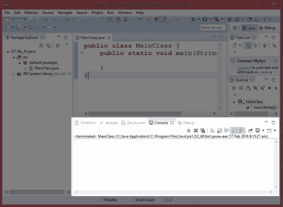

图 17:输出控制台

当我们运行或调试应用程序时，应用程序的输出将出现在 Eclipse 屏幕下部的窗口中。请注意，图 17 中有一个选项卡页面集合，包括一个名为 Console 的选项卡。我们当前的程序什么也不做，所以在我们调试或运行代码清单 2.0 中的应用程序后，这个控制台选项卡是空白的，但是在未来的章节中，我们将向这个控制台打印文本并从键盘读取数据。

现在我们已经检查了如何启动一个新的应用程序，如何添加一个类，以及如何将 main 方法作为一个入口点添加到我们的程序中，我们可以开始编程 Java 来为我们执行任务。