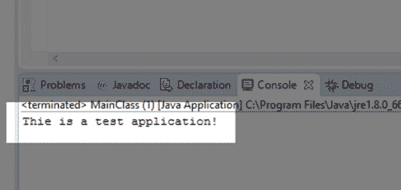

# 第三章写作输出

代码清单 3.0 显示了基本的“你好，世界！”应用程序。程序打印一些文本到控制台，然后退出。左侧的数字仅供参考，不应输入到您的代码中。将此代码键入或粘贴到我们之前创建的 MainClass.java 文件中的代码上。

代码清单 3.0:打印输出

```
  1:
  public  class MainClass { // Definition of
  MainClass
  2:
  public static  void main(String[] args) { // main method entry
  point
  3:    
  System.out.println("This is a test application!");
  4:    
  } // Close
  brace for main method.
  5: } // Close brace for MainClass.

```

当我们用调试或运行(使用 F11 或 Ctrl+F11 键，或单击调试或运行按钮)执行这段代码时，程序将打印“这是一个测试应用程序！”系统输出。

**1 号线:**公开课 MainClass。这一行声明了一个名为 MainClass 的类。该类用 public 修饰符标记，这意味着它对应用程序中的所有其他实体和包都是可见的。在公共修饰符之后，我们使用关键字 class，然后为我们的新类提供一个唯一的名称——main class，在这个例子中。后面跟一个花括号{，表示类主体的开始。第 5 行包含匹配的右花括号{ }，它标志着这个类的主体的结束。

**第 2 行:**在第 2 行，我们声明了一个名为 main 的静态成员方法。该方法被标记为公共的，这样这个方法之外的类就可以调用它。该方法被标记为静态的，这意味着它属于该类，而不是该类的任何特定实例。方法不向调用方返回任何数据，因此返回类型为 void。在括号中，(字符串[]参数)是参数列表。这意味着当调用此方法时，将向其传递一个字符串数组。字符串数组是命令行参数——当我们从命令行运行程序时，我们可以选择提供额外的参数。我们将不使用命令行，在示例程序中，这个数组将始终为空。在参数列表之后，我们看到一个开放的大括号{，它标志着这个方法的主体的开始。主方法的匹配右大括号在第 4 行。

**第 3 行:**这一行调用属于 System.out 类的 println 方法。System.out 是一个类，println 是属于该类的公共静态方法。方法接受一个字符串参数，并将该字符串打印到控制台输出。该字符串用括号括起来，表示它是方法调用的参数。参数是字符串，因为它用双引号括起来。该行以分号“；”结束指示语句已完成。Java 中的所有语句都以分号结尾。

**第 4 行:**这是主方法的匹配右大括号。左大括号出现在第 2 行。这个大括号表示我们已经完成了对方法的描述。

**第 5 行:**这是 MainClass 类的匹配右大括号。左大括号出现在第 1 行。这个大括号表示 MainClass 的描述已经完成。

如果前面的一些描述过于简短，不要担心。随着本书的深入，我们将进一步研究每个关键词和其他机制。最初，Java 有一个相当陡峭的学习曲线。为了开始编程 Java，即使是最基本的程序也包含了大量的语法(语法是编程语言的语法——规则、拼写和标点)。

类的名称可以是任何有效的标识符。有效的标识符名称包含字母和数字，但不能以数字开头。标识符必须是一个单词(不允许有空格、制表符或任何标点符号)，但是您可以使用下划线字符，例如，Main_Class 是合法的标识符，但是“Main Class”不是，因为它包含空格。

当您运行或调试代码清单 3.0 中的应用程序时，您会注意到消息被打印到 Eclipse 下部的控制台面板上，如图 18 所示。



图 18:代码清单 3.0 输出

## Java 基础

在这一节中，我们将简要地看一下 Java 编程的几个方面，随着您越来越习惯这种语言，这些方面将成为第二天性。

### 空格

空白是代码中空间的使用。这包括新的行、空格和制表符。一般来说，Java 编译器会忽略空白，程序员可以随意布局代码。这条规则也有例外——例如，在字符串中，编译器保留空格，因为两个字符串之间有很大的区别:这是一个变量，这是可变量。

代码清单 3.1:空白

```
  c.setRadius(100);
  c .    setRadius
  (     100 
  )
  ;

```

代码清单 3.1 显示了对同一个方法的两次调用:c . setradius(100)；(这是一个代码片段，没有主方法——这段代码不会作为应用程序执行)。编译器会将这两个调用读取为相同的，即使第二个调用有很多空白并且很难读取。

虽然空白一般被编译器忽略，但我们不能分解标记。用来表示语言元素的符号称为标记，如果我们在标记的字符之间放置空白，编译器将无法理解我们的意思。例如，代码清单 3.1 中的术语 setRadius 就是一个令牌。如果我们在两个单词之间放置一个空格来创建集合 Radius，它不再形成一个令牌，而是两个。同样，我们不能在数字文字中间放置空白。例如，150 是单个代币，表示*一百五十*，而 1 50 是两个代币，表示*一*和*五十*。

空白的使用与编程风格密切相关。没有正确或最好的方法来设置代码，也没有最好的方法来使用空白。对于这本电子书中的代码，我采用了许多 Java 程序员使用的通用约定，这些约定创建了易于阅读和调试的代码。如果你是编程新手，尝试匹配我在这里使用的支撑和跳转。这种风格的支撑和跳转非常常见，如果你熟悉编码和阅读，你理解其他程序员的代码就不会有什么困难。

|  | 提示:学习阅读和编程的任何风格。如何最好地使用空白是许多编程社区中激烈争论的话题。但是，作为程序员，我们需要阅读和理解别人的代码，我们经常需要在团队中进行编程，其中空白的使用对于所有程序员来说必须是相同的。一个能读懂任何人的代码并能毫不犹豫地转换成任何风格的程序员比一个争论制表符和空格的程序员更有价值。 |

### 标识符

标识符是程序员选择用来表示代码中某个实体或机制的名称。我们为变量、方法、类和对象选择标识符名称。在代码清单 3.1 中，术语 MainClass、main 和 args 都是标识符。System、out 和 println 也是标识符——它们是由编写 Java 库的人命名的。

当我们选择一个标识符时，我们必须确保它对于当前范围是唯一的(或者对于当前代码块是唯一的——我们将在后面详细讨论范围和代码块)。我们不能在单个代码块中命名两个变量 myVariable，因为编译器无法知道我们试图引用哪个变量(但是，我们将看到有一个作用域运算符使我们能够稍微改变这个规则！).

我们不允许用关键字来命名我们的标识符(有关关键字的描述，请参见下一节)。例如，我们不能命名我们的方法或变量 if 或 while。同样，这归结于这样一个事实，即编译器需要区分关键字和标识符，如果标识符与关键字具有相同的名称，它就不能做到这一点。

标识符名称不能包含任何空格(包括空格、制表符和新行)。标识符名称必须是一个完整的单词。标识符名称可以包含字母、数字、美元符号($)和下划线(_)，但不能以数字开头。编译器将任何以数字开头的标记视为数字文字，它不允许我们将标识符命名为 67Hello，因为这意味着数字 67 带有无意义的后缀 Hello。

标识符名称区分大小写，这意味着标识符“患者数据”、“患者数据”和“患者数据”都被编译器视为不同的。不建议命名仅在大小写上不同的多个标识符，因为这可能会导致代码混乱和难以阅读，尽管编译器在区分标识符时不会有任何问题。

标识符的例子有:someVariable，I，timer_for_rendering_graphics，iterator15，MY_CONSTANT，$euclideanDistance。

在 Java 中，开发人员经常使用一种叫做 Camel Case 的技术来命名我们的标识符。在 Camel 案例中，每个单词的第一个字母都是大写的——除了第一个字母。例如，一个用于计算分数的函数可能被称为 computeScore，一个用于合计年龄的变量可能被称为 sumTotalAges。

这个经验法则的一个例外是命名类。在给类命名时，Java 程序员通常会对所有单词的第一个字母使用大写字母，包括第一个。用于保存自动机生成网格的类可以称为自动生成网格。这使得变量和类在代码中很容易区分。在代码清单 3.1 中，标识符 MainClass、System 和 String 都是类，这意味着它们以大写字母开头。而标识符 args、out 和 println 是变量和方法名，所以它们以小写字母开头。

除了 Camel Case 之外，用所有大写字母命名最终变量(类似于其他语言中的常量)也很常见。最后一个变量只是一个不可更改的命名值，例如数学变量 PI 或 e。由于程序员使用大写字母表示所有字母，因此在命名常数时，通常使用下划线表示空格来分割单词。每小时秒数的最后一个变量可能被称为每小时秒数，或者六月天数的最后一个变量可能被称为六月天数或六月天数。

命名标识符时的最后一个经验法则——标识符应该命名为逻辑的、描述性的名称，以确保代码尽可能保持可读性。例如，通常将一个变量命名为 marginOfError 比 mOE 或 m 更好；，最好命名一个函数 computeMedianOfHouses，而不是 doThing 或卷心菜 witheppedcream(假设该函数计算房屋的中位数)。如果我们不以逻辑的、易于理解的名称来命名标识符，其他程序员可能难以理解和维护我们的代码。更糟糕的是，我们也不会理解自己的代码。令人惊讶的是，在我们自己的代码变成乱码之前，我们只花了很少的时间，除非我们小心翼翼并智能地命名我们的标识符。

|  | 注意:用逻辑和描述性名称命名标识符有一些例外。例如，在 For 循环中调用迭代器(计数器变量)是很常见的，比如 I、j、x、y 或 z 等单个字母的名称。这并不能说明变量的含义，但是其他程序员仍然可以理解它们的用途。此外，一些算法在它们的描述中有特定的变量名，并且在编程算法的实现时经常使用变量的通用名称，例如使用名称 t 和 h 的 A*寻路算法。 |

### 关键词

与英语等人类语言相比，计算机编程语言非常简单。Java 有一小部分语法符号(如{和}大括号)和一小部分称为关键字的非词汇术语。Java 有一系列如何使用这些元素的规则(即它有一个语法)。在 Eclipse 中，我们可以识别代码中的关键字，因为它们以深紫色突出显示，并且是粗体的，例如代码清单 3.1 中的 **`class`** 和 **`public`** 。

关键字构成了 Java 工作方式的主要支柱。关键字是为 Java 中的特定用途保留的，不能用作标识符名称。有关可用关键字的参考，请参见附录。以下是我们目前遇到的关键词列表:

**public**:public 关键字是访问修饰符。这意味着外部对象(不属于正在定义的类的对象)可以访问方法或成员变量。

**类**:class 关键字用来表示后面的代码块是一个类的描述。

**static**:static 关键字将成员方法和变量标记为属于整个类，而不是该类的特定对象或实例。这意味着我们可以在不从类中创建对象的情况下访问静态成员。

**void** :当方法不返回任何数据时，void 关键字用作返回类型的占位符。所有方法都必须具有返回类型或 void 返回类型。此规则的唯一例外是没有返回类型且与类同名的构造函数。

### 点运算符

在代码清单 3.1 中，第 3 行内容如下:系统。 ***`out`*** 。println(“这是一个测试应用！”);。该行包含几个句号(或句号)。这就是点运算符(有时也称为范围运算符)。它是将类连接到方法和成员变量的运算符。系统是一个类，外部是属于系统类的实体。当我们提供由点运算符连接的术语 System.out 时，我们是在说“属于 System 类的 out 实体”，或者，简而言之，“System.out”

println 方法属于 out 实体。当我们通过指定方法的名称系统来调用该方法时。 ***`out`*** 。println，后跟一个参数列表(“这是一个测试应用！”)，我们真的是在说:执行名为 println 的方法中指定的代码，它属于实体 out，属于类 System。请注意，点从左到右表示所有权——系统拥有所有权，而所有者拥有打印权。

我们将在后面更详细地讨论面向对象编程，但是面向对象编程的主要目标是定义对象的层次结构，每个层次结构都由更多的对象拥有并可能拥有更多的对象，并且每个层次结构都能够使用成员变量的集合来执行方法。不同的类可以包含同名的变量和方法。例如，我们可能有多个称为成本的变量，一个属于名为 House 的类，另一个属于 Vehicle 类。我们可以用房子成本和车辆成本来区分这些变量

### 评论

代码清单 3.2 显示了几个注释，Eclipse 用绿色突出显示注释。注释是对程序员的一种注释。程序执行时，计算机将忽略所有注释。有许多用于注释的应用程序，每个程序员对自己的代码都有独特的注释风格。虽然评论不会改变程序的运行方式，但是培养良好的评论技巧是极其重要的。注释允许程序员准确地描述代码应该做什么。这意味着任何其他程序员都应该能够一目了然地阅读注释并理解复杂代码的含义。

在 Java 中，有两种类型的注释——单行注释和多行(或块)注释(参见代码清单 3.2)。

代码清单 3.2:注释

```
  // This is a single-line
  comment!
  System.out.println("Press a key to
  continue..."); // Single-line comment!
  /*
  This is a multiline comment.
  It extends from the opening symbol of a slash and
  star to the closing
  symbol, a star followed by a slash! 
  */

```

代码清单 3.2 显示了两种不同类型的注释。首先是单行注释。这些以两个斜线，///开始。//右侧的所有文本都被计算机忽略。如果一行代码以//开头，则忽略整行代码，但您也可以将//放在某些语句之后，例如 println。

多行注释以/*开头，一直延伸到*/。程序员可以在/*和*/中放置任何文本，包括新行。这有时被称为块注释，因为它使程序员能够编写文本块或注释掉代码块。

在接下来的代码示例中，我们将看到许多注释，以帮助读者识别不同代码行应该做什么。

## 挑战

**挑战 3.0:** 更改标识符参数，使其称为参数。程序编译运行吗？

**挑战 3.1:** 将标识符 main 改为 mainMethod。程序编译运行吗？

**挑战 3.2:** 将屏幕上打印的信息改为字符串“你好，世界！”。

**挑战 3.3:** 将 MainClass 类的名称改为 MyClass。程序编译运行吗？

## 挑战解决方案

### 挑战 3.0

当 args 标识符变成参数时，程序编译并运行，因为这个标识符只是主方法的一个参数。它的名字由程序员决定。

代码清单 3.3:挑战 3.0

```
  public class MainClass {
  public static  void main(String[] arguments) {
  System.out.println("This is a test
  application!");
  }
  }

```

### 挑战 3.1

如果我们将 main 方法的名称更改为 main method，程序不会编译和运行，因为 JVM 需要一个程序入口点，它会搜索一个名为 main 的方法。当它找不到这样的方法时，它将不会运行应用程序。

代码清单 3.4:挑战 3.1

```
  public class MainClass {
  public static void mainMethod(String[]
  args) {
  System.out.println("This
  is a test application!");
  }
  }

```

### 挑战 3.2

代码清单 3.5:挑战 3.2

```
  public class MainClass {
  public static void main(String[] args) {
  System.out.println("Hello, World!");
  }
  }

```

### 挑战 3.3

如果 MainClass 的名称更改为 MyClass，而文件的名称(在其中编写代码)没有更改，程序将不会编译和运行。在 Java 中，类应该放在同名的源代码文件中。

代码清单 3.6:挑战 3.3

```
  public class MyClass {
  public static void main(String[] args) {
  System.out.println("This
  is a test application!");
  }
  }

```