# 第四章阅读输入

## 阅读系统

代码清单 4.0 中的程序说明了如何读取用户的输入。具体来说，我们询问用户的姓名，并阅读他们在键盘上键入的一些文本。

代码清单 4.0:读取输入

```
  1:
  import java.util.Scanner;
  2:
  public  class MainClass {
  3:
     public static void main(String[] args) {
  4:
            Scanner scanner = new Scanner(System.in);
  5:
            System.out.println("What is your name?");
  6:
            String str = scanner.nextLine();
  7:
            System.out.println("Nice to meet you, " + str + "!");
  8:
     }
  9: }

```

**第 1 行**从 java.util 包导入 Scanner 类。扫描仪扫描数据流，等待并读取数据。Java 中包含了成千上万个预先编写的工具，如果我们想使用它们，可以用类似的方式导入。代码清单 4.0 使用扫描仪扫描 System.in，这是一个字节流，表示用户向控制台键入的数据。

**第 2 行**是 MainClass 的开题声明。

**第 3 行**是主法的开篇申报。

**第 4 行**是我们声明 java.util.Scanner 对象的地方。我们指定我们的扫描仪扫描系统。Scanner 类有一个将流作为参数的构造函数(构造函数只是一种用于创建类实例的特殊方法)。当我们使用新的运算符调用构造函数时，会创建一个 scanner 对象(因为它是一个对象，而不是一个类，所以被称为带有小写 s 的 scanner)。当我们在面向对象编程一章中介绍新的运算符时，我们将更详细地了解这一行的具体功能。目前，这一行意味着创建一个名为 scanner 的 Scanner 对象，并让它扫描输入流 System.in

**第 5 行**向控制台打印提示，询问用户名。

**第 6 行**是我们从键盘上读取文本的地方。我们通过调用扫描器对象的 nextLine 方法来实现这一点。该方法没有参数，因此我们提供了空括号(和)。这一行将读取文本，直到换行符被读取(即，直到用户点击键盘上的回车或回车)。Scanner.nextLine 将返回用户键入的字符串文本，我们使用赋值运算符 String str =将该文本赋值给 String 变量 String。

**第 7 行**打印出字符串“很高兴见到你，克里斯！”其中 Chris 被替换为用户在提示符下键入的任何名称。请注意字符串“很高兴见到你”是如何通过结束双引号并使用字符串连接运算符+将变量字符串添加到中间的。这是一个我们如何将两个或多个字符串连接在一起的例子。

**第 8 行**是主方法代码块的匹配右大括号。此时，对象扫描器和字符串变量 str 超出了范围(这意味着它们不再存在)。程序从主方法的开始处开始，在主方法的右大括号处结束。所以这一行实际上是我们应用程序的结尾。我们也可以在 main 方法的主体中使用 return 关键字，以便从该方法返回，尽管请注意这也会终止应用程序。当我们考虑定义方法时，我们将更多地考虑 return 关键字。

**第 9 行**是 MainClass 类的匹配右大括号。

为了运行程序，我们可以使用调试或运行按钮。我们将看到程序在打印消息“你叫什么名字？”。要输入字符串，请在提示符下单击控制台选项卡。你应该看到一个闪烁的光标。键入您的姓名(或任何其他字符串)并按回车键。在您按 enter 键之后，scanner 对象有一行文本要读取，并且，在我们为 str 变量设置值的地方，它会将该值返回给调用者。(图 19 显示了代码清单 4.0 中与程序交互的示例，其中绿色文本是我在提示符下键入的内容)。

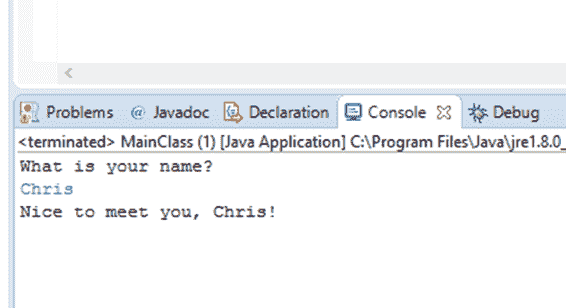

图 19:代码清单 4.0 输出

在这本电子书中， *Java 简洁地第 1 部分，*我们将集中讨论 Java 语言的核心机制，我们将被限制在这个控制台进行输入和输出。我们可以用 Java 创建功能齐全的图形用户界面，在 *Java 简洁地第 2 部分*中，我们将了解如何做到这一点。

### 警告和错误

当我们调试或运行代码清单 4.0 中的程序时，我们会看到 Eclipse 给了我们一个警告。警告是我们代码的一个潜在问题，但它不会阻止代码执行。Eclipse 可以在我们的代码中检测到两种类型的问题:警告(这不会阻止代码运行，但可能应该修复)和错误(这是阻止代码运行的问题)。

一般来说，如果我们的程序中有任何警告，我们应该修复它们，因为如果它们不被检查，可能会导致不必要的行为。在下一个程序中，我们将看到两行额外的代码，旨在关闭扫描仪并修复 Eclipse 突出显示的警告。

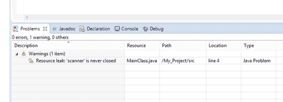

图 20:警告

图 20 显示了我们的代码生成的警告。只有当我们尝试调试或运行程序时，此警告才可见。该警告告诉我们，问题是“扫描仪”从未关闭。它告诉我们问题出在 MainClass.java 文件中，它出现在第 4 行。如果我们在“问题”面板中双击这个警告，Eclipse 会将我们带到 MainClass.java 文件的第 4 行，这样我们就可以修复问题，或者对导致问题的原因有所了解。图 21 显示了一个错误示例。

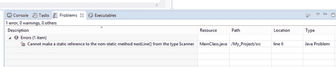

图 21:错误

为了引起这个错误(图 21)，我特意将代码清单 4.0 的第 6 行改为 String`str`= scanner . nextline()；。注意扫描仪中的大写字母 S。这个小改动是个错误，意味着程序不会编译运行。查看“问题”面板，我们会得到一条神秘的错误消息，解释下一行不是静态的，我们试图像使用它一样使用它。错误消息通常很难理解，但是扎实的 Java 基础知识将帮助您理解它们。本质上，这个错误是说，如果我们希望调用方法 nextLine()，我们需要使用对象扫描器，而不是 scanner 类。否则，程序将无法编译和运行。

### 日食透视

透视图是 Eclipse 中窗口和面板的布局。默认情况下，Eclipse 被设置为 Java 视角(图 22)。但是当我们调试代码时，或者当我们的程序由于错误而无法编译时，Eclipse 将切换到调试视角(图 23)。调试视角提供了额外的信息面板，可能有助于我们跟踪和修复错误(稍后我们将在调试视角中查看变量和单步执行代码)。

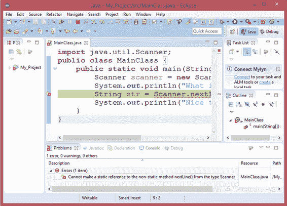

图 22: Java 视角

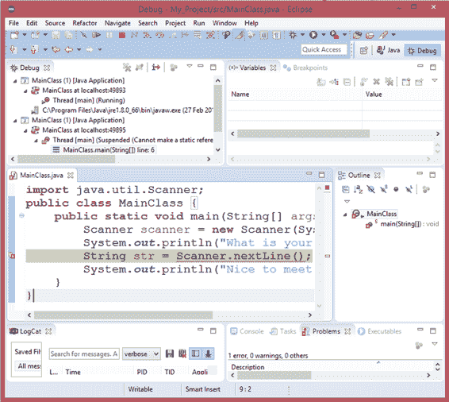

图 23:调试透视图

为了在两个透视图之间切换，我们使用 Eclipse 右上角的两个透视图按钮(标记为 Java 和 Debug，如图 24 所示)。

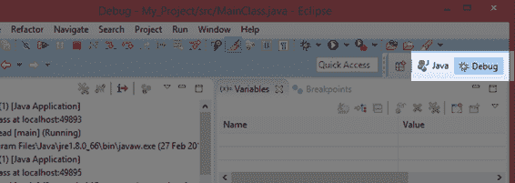

图 24: Java 和调试透视图按钮

当我们调试或运行我们的程序时，Eclipse 暂停它，它将带我们进入调试视角，但是我们的程序不会关闭。为了停止程序(完全关闭它，使它不再运行)，我们需要按下停止按钮，它在 Java 和 Debug 透视图的主控制面板中(见图 25)。如果我们不停止我们的应用程序，它们将继续占用系统资源。

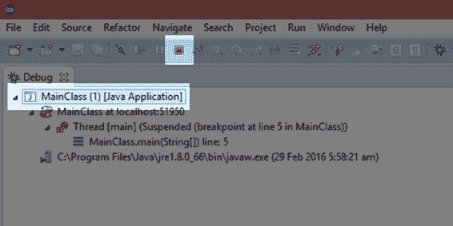

图 25:停止正在运行的应用程序

图 25 显示了当 Eclipse 暂停我们的应用程序时突出显示的停止按钮。当您处于 Debug 透视图中时，屏幕左上角的 Debug 面板显示了我们应用程序的所有运行实例(在图 25 中，只有一个实例)。如果有多个实例正在运行，您可以通过在面板中选择每个实例并单击“停止”按钮来单独关闭每个实例。

## 读取多个值

我们的下一个示例代码说明了 Java 代码通常是如何按顺序执行的，从上到下，一行接一行。程序 3 要求用户输入姓名和密码。在用户在控制台输入一行文本之前，程序不会超过第一次出现的 scanner.nextLine()。

代码清单 4.1:读取多个字符串

```
  import java.util.Scanner;
  public  class MainClass {
        public  static  void main(String[] args) {
               // Declare all
  variables.
               String
  userName;
               String
  userPassword;
               Scanner
  scanner = new Scanner(System.in);

               // Request the user's
  name.
               System.out.print("What is your
  name? ");
               userName = scanner.nextLine();

               // Request the user's
  password.
               System.out.print("Ok, and what is
  your password? ");
               userPassword = scanner.nextLine();

               // Print out the info
  we read in a message.
               System.out.println("Whoa! That was
  too easy! You're crazy, " +
                            userName + ", you just told a
  complete stranger " + 
                            "that your
  password is " + userPassword + "!");

               // Close the scanner to
  avoid memory leaks.
               if(scanner != null)
                     scanner.close();
        }
  }

```

代码清单 4.1 展示了一些常见的约定。首先，我已经在方法的开头声明了所有变量(我们将在下一章中查看变量声明)。在方法的最后，我调用了一个名为“close”的方法，以确保我的 scanner 对象不会导致任何内存泄漏(这两行代码修复了我们在本章第一个程序中得到的警告)。我还使用了 if 语句(我们将很快看到方法调用和 if 语句)。该程序说明，我们可以从扫描仪中读取任意多的字符串，并在每个字符串之间打印出提示。

我用系统打印代替了打印。print 方法打印字符串的方式与 println 相同，只是它没有在字符串的末尾放置新行。图 26 显示了一个与代码清单 4.1 中的程序交互的例子。请注意用户输入(绿色文本)与提示在同一行。如果我们使用 println，绿色文本会在自己的行上。

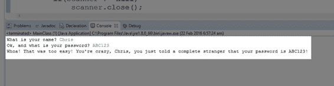

图 26:代码清单 4.1 的输出示例

## 代码块和大括号

以下程序旨在研究代码块。Java 是从一种叫做 C 的非常古老的语言继承而来的许多语言之一。这些语言统称为花括号语言，因为它们使用花括号{和}来指定代码的块或区域(这些语言有时也称为类似 C 的语言)。每个左大括号{ }都有一个匹配的右大括号{ }，每对括号之间包含一行或多行代码，称为代码块。在 Java 源代码中，您几乎可以在任何地方无缘无故地打开和关闭一个代码块，但是代码块通常是一种为了某种特定目的将几行代码连接成一个单元的机制。具体的目的通常是定义循环、方法和类的主体。

代码清单 4.2 显示了一个突出显示代码块的程序。这个程序比我们目前看到的程序复杂得多。当我们在未来的章节中研究方法时，这个程序如何工作的细节将变得显而易见。目前，该程序旨在说明匹配的{和}大括号和嵌套代码块。

代码清单 4.2:代码块

```
  public class MainClass {

        // Method to return
  lowest prime factor of the integer x.
        private static int GetLowestFactor(int x) {
               int sqrt = (int)Math.sqrt(x);
               if(x % 2 == 0) {
                     return 2;
               }
               for(int q = 3; q <= sqrt; q+=2) {
                     if(x % q == 0) {
                            return q;
                     }
               }
               return x;
        }

        // Determines if x is
  prime by seeing if it is equal to
        // its own lowest
  factor.
        private  static Boolean  IsPrime(int x) {
               return GetLowestFactor(x) == x;
        }

        // This program lists
  the prime numbers in the range 1 to 1000.
        public  static  void main(String[] args) {
               // Declare local
  variables.
               int i = 2, count = 0, countPerLine = 10;
               // Show a description
  of the program.
               System.out.println("Prime numbers
  from 1 to 1000 are: ");
               // Loop that finds the
  primes.
               while(i <= 1000) {
                     // If i is prime...
                     if(IsPrime(i)) {
                            // Add it to the list...
                            System.out.print(i + ", ");
                            // Increment the count.
                            count++;
                            // If there's
  countPerLine items on this line,
                            // print a new line.
                            if(count % countPerLine == 0) {
                                  System.out.println();
                            }
                     }
                     // Increment i to the next
  number.
                     i++;
               }
        }
  } 

```

如果您将代码清单 4.2 中的代码复制并粘贴到 Eclipse 中，您应该会得到一个 1 到 1000 之间的质数列表。在代码清单 4.2 中，每对匹配的大括号都用不同的颜色突出显示。请注意，代码块嵌套在其他代码块中。也就是说，较小的代码块在外部代码块的大括号内开始和结束。黄色大括号包围着 MainClass 的主体，MainClass 包含几个方法的代码块，每个方法都包含自己的代码块。

还要注意，可以为许多不同的机制创建代码块——类、循环、If 语句和方法都有相关的代码块，如代码清单 4.2 所示。

我们现在将绕一小段路进入编程的一个完全不同但非常有用的方面——调试代码。

## 绕行:调试代码

调试和维护代码的能力是程序员最重要的属性之一。记住这一点，当您第一次在 Eclipse 中测试您的程序时，选择调试图标，而不是运行图标。

### 打印出数值

我们经常需要在程序运行时知道变量的值。辨别变量值的最基本形式是将这个值输出到屏幕上。我们可以使用 System.out.println 来实现这一点，比如 system . out . println(“I 的值是”+I)；。这是一种非常原始的调试方法，但在许多情况下，这是我们所需要的。通常，最好在变量上放置一个断点和一个观察点，如下节所述。

### 设置断点

断点是代码中的一个位置，我们希望程序在这个位置暂停并给予我们控制权，以便我们可以准确地检查代码中正在发生的事情。当一个程序在断点处暂停时，我们可以检查变量值并遍历代码——一次一行。要设置断点，请在 Eclipse 中的代码视图的空白处单击鼠标右键。这将弹出一个带有切换断点选项的上下文菜单，如图 27 所示。

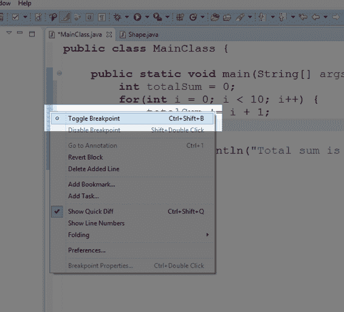

图 27:切换断点

当断点处于活动状态时(即当程序到达断点时是否会暂停)，您将在代码窗口的空白处看到一个小的断点符号，如图 28 所示。

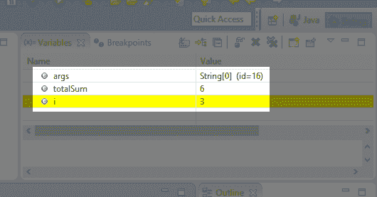

图 28:活动断点

当断点指示器为蓝色时，如图 28 所示，表示断点处于活动状态。您可以通过右键单击断点符号并从上下文菜单中选择禁用断点来禁用断点。禁用断点时，圆圈为白色，程序到达断点时不会暂停。

### Eclipse 中的调试视角

当程序到达一个活动断点时，它会暂停并让我们控制。第一次在 Eclipse 中中断时，您可能会得到一个消息框，如图 29 所示。Eclipse 旨在提供几个特定于调试的额外工具，并且它提供了将视图更改为调试视角的功能。单击标记为“记住我的决定”的框，选择“是”进入调试视角。

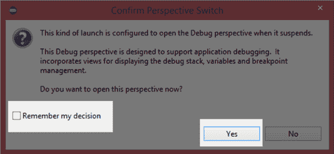

图 29:确认透视开关

调试视角如图 30 所示。

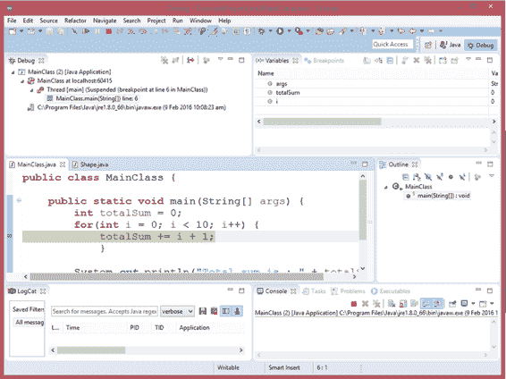

图 30:调试透视图

请注意图 30 中以绿色突出显示的线条。这是程序准备执行的行。在 Eclipse 屏幕的顶部，您将看到一个绿色的“播放”按钮、一个“暂停”按钮和一个“停止”按钮。要停止程序执行，请单击停止。要恢复正常执行(即再次开始执行，直到程序找到下一个断点)，请单击“播放”。而且，如果您的程序已经在执行并且没有遇到断点，您可以使用暂停按钮暂停它而不添加断点(参见图 31)。根据具体情况，这些按钮中的一些或全部可能会变灰(例如，如果程序已经在断点处暂停，则“暂停”按钮不可用)。

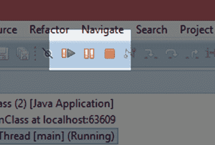

图 31:播放、暂停和停止按钮

|  | 提示:您可以通过单击图 29 中播放按钮左侧的按钮来跳过所有断点。当您已经设置了许多断点以便检查程序的确切流程，但是您想要测试整体功能而不是永久禁用断点时，这是很方便的。 |

您可以通过单击 Eclipse 右上角的按钮在 Java 和调试透视图之间切换，如图 32 所示。

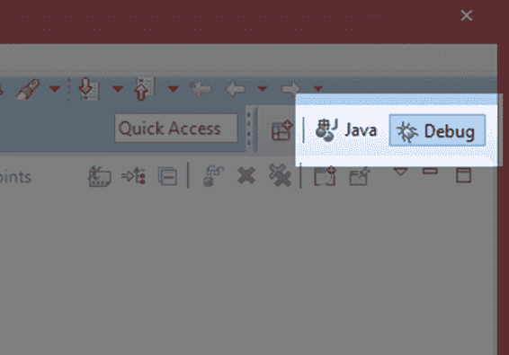

图 32:改变 Eclipse 的视角

### 逐步进入代码

单步执行代码有两种方式:

*   跨过
*   进入

当程序暂停时，当它一次执行一行时，我们可以非常仔细地观察所有变量到底发生了什么。我们通过使用“单步执行”和“单步执行”按钮来实现这一点(参见图 33)。当程序暂停时，您会在 Eclipse 的顶部找到这些按钮。

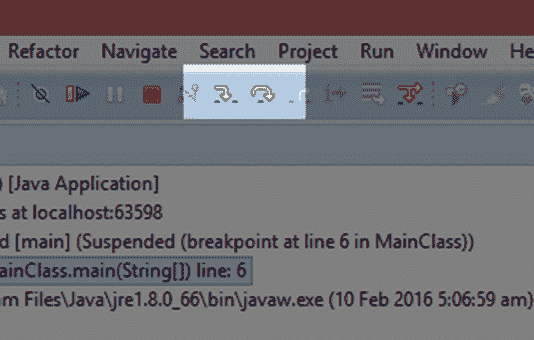

图 33:单步执行和单步执行按钮

单步执行意味着程序将执行当前代码行，然后再次暂停。它不会跳转到方法调用。相反，它将作为单个步骤执行该方法。单步执行意味着程序将执行下一行，但是如果该行是方法调用，它将跳转到方法的主体并暂停。跨进的快捷键是 F5，跨进的快捷键是 F6。

### 观察变量

当我们逐步进入代码时，我们可以通过查看变量选项卡来查看变量包含的确切值，如图 34 所示。


图 34:变量选项卡

当应用程序暂停时，“变量”选项卡显示当前范围内的所有变量。黄色突出显示的变量在最后一步或进入过程中发生了变化。

这是对 Eclipse 的一些调试工具的非常简短的介绍。它们可以极大地帮助我们追踪代码中的问题，但也可以用来教我们 Java 是如何工作的。稍后，当我们查看控制结构时，我强烈建议您在程序中设置断点，并遍历代码，观察程序分支和执行循环的方式。没有什么比一次看一行更能说明 Java 是如何工作的了。

## 挑战

**挑战 4.0:** 更改代码清单 4.0 中的程序，询问用户的年龄而不是姓名。

**挑战 4.1:** 更改代码清单 4.1 中的程序。让它要求第三个字符串称为网站，这是用户的网站使用的用户名和密码。读取用户名和密码后，要求用户输入网站。

**挑战 4.2:** 代码清单 4.2 打印从 1 到 1000 的素数，每行 10 个。在不知道这个程序如何工作的细节的情况下，你能改变程序打印出素数吗，从 1 到 50，一行打印两个素数而不是 10？

## 挑战答案

### 挑战 4.0

代码清单 4.3:挑战 4.0

```
  import java.util.Scanner;
  public  class MainClass {
        public  static  void main(String[] args) {
               Scanner
  scanner = new Scanner(System.in);
               System.out.println("What is your
  age?");
               String
  age = scanner.nextLine();
               System.out.println("You are " + age + " years old!");
        }
  }

```

### 挑战 4.1

代码清单 4.4:挑战 4.1

```
  import java.util.Scanner;
  public  class MainClass {
        public  static  void main(String[] args) {
               // Declare all
  variables.
               String
  userName;
               String
  userPassword;
               String website;
               Scanner
  scanner = new Scanner(System.in);

               // Request the user's
  name.
               System.out.print("What is your
  name? ");
               userName = scanner.nextLine();

               // Request the user's
  password.
               System.out.print("Ok, and what is
  your password? ");
               userPassword = scanner.nextLine();
               System.out.print("And
  what website is this the password for? ");
               website = scanner.nextLine();

               // Print out a message:
               System.out.println("Ok, gotta go. I
  have to quickly check " +
                            website + ".");

               // Close the scanner to
  avoid memory leaks.
               if(scanner != null)
                     scanner.close();
        }
  }

```

### 挑战 4.2

我在这里只包含了清单中的相关部分，我用黄色突出了我们需要做的更改。

代码清单 4.5:挑战 4.2

```
  int i = 2, count = 0, countPerLine = 2;

  //
  Show a description of the program.
  System.out.println("Prime numbers
  from 1 to 50 are as follows: ");
  //
  Loop that finds the primes
  while(i <= 50) {
        // If i is prime...
          if(IsPrime(i)) {
```