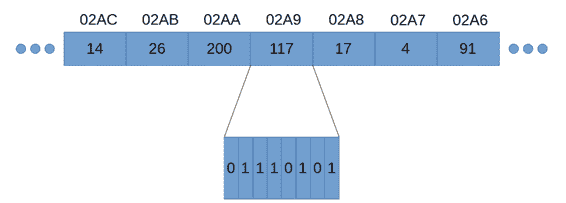
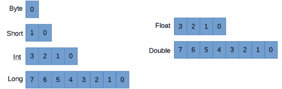
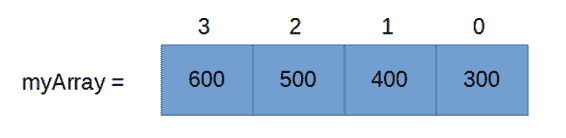
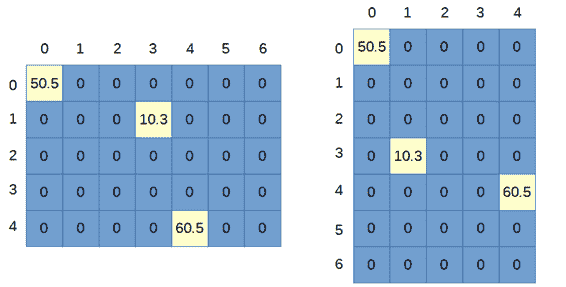
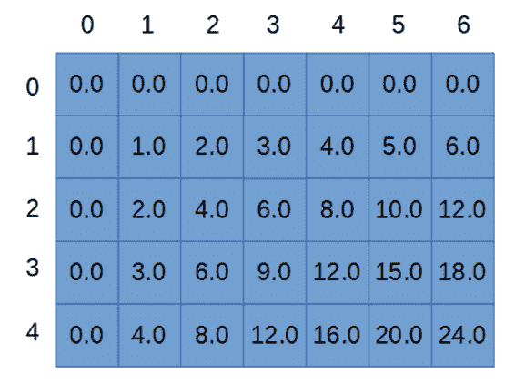

# 第 5 章数据类型和变量

## 记忆

在 Java 中，和所有的计算机编程语言一样，我们可以在各种内存空间中读写数据。内存空间只是一个我们可以保存和检索信息的区域。我们可以读写的最有用的内存空间之一叫做系统内存。随机存取存储器代表随机存取存储器。它是一种用于临时存储的易失性存储器(易失性意味着在系统重新启动时被清除)。

RAM 只不过是一长串 0 和 1。0 和 1 被组织成每个 8 位的字节(一位是二进制数字的缩写，是单个 0 或 1)。内存中几个字节的图示见图 35。



图 35:内存

图 35 显示了内存中的七个字节。RAM 中的每个字节都有一个写在方框上方的地址(现代计算机上的真实地址有 16 个十六进制数字，而不是我在图中使用的 4 个)。当我们从右向左移动内存时，地址只是连续的数字。地址是用十六进制写的(所以我们用 02A8 代替了 680——十六进制现在不重要)。

|  | 注意:在 Java 中，我们不能访问内存中的地址。这是 Java 和相关语言 C 和 C++最大的区别之一。用地址直接访问内存是危险的——很容易不小心寻址到错误的字节，导致我们的程序出现错误。所以，Java 不允许直接访问内存。 |

除了地址，内存中的每个字节也有一个值(如图 35 中的 14、100 或 117)。如您所见，内存是字节的集合，每个字节都有一个地址，这样我们就可以引用字节，还有一个值，这样我们就可以读写一些信息。

在图 35 中，地址 02A9 处的字节被放大，我们可以看到在二进制计数系统中写出的组成数字 117 的各个位。在二进制中，位是从左到右读取的，就像我们读取正常的十进制数一样。因此，左边的位是最高有效位(如 684 中的 6)，右边的位是最低有效位(如 684 中的 4)。

当我们通过地址引用内存时，给计算机编程是困难的(Java 不允许我们通过地址直接访问字节)。地址只是很长的十六进制数字，对人类来说似乎没有意义。

作为程序员，我们需要操纵和控制内存中的数百、数千甚至数百万字节，而用地址来做到这一点是极其困难的。因此，我们不是通过地址来引用内存，而是在内存中命名某些点，并使用名称来代替地址。RAM 中的这些命名点称为变量。变量实际上是我们已经命名的一个点，我们可以在内存中读写。变量通常包含多个字节——例如，Java 中的一个 int 变量由四个连续的字节构建而成，可以用来存储比单个字节所能存储的更大的数字。

Java 中的每个变量都有一个数据类型，它指示我们将在内存中的特定位置执行什么类型的操作，或者这些位代表什么类型的信息。例如，我们可能希望使用一个变量进行浮点计算，如 3.4+7.8，或者我们可能希望对整数(如 3+7)执行一些操作。

## 原始数据类型

Java 中数据类型最基本的基本构建块被称为基本数据类型(有时只是基本数据类型)。它们用于构建更复杂的数据类型，如类和枚举。当我们在 Java 中声明变量时，我们必须声明它们的数据类型。Java 是一种类型安全的语言，这意味着一旦给变量赋予了数据类型，我们以后就不能更改类型。

表 1:基本数据类型

| 名字 | 类型 | 大小(字节) | 大小(位) | 最低限度 | 最高的 |
| --- | --- | --- | --- | --- | --- |
| 字节 | 整数 | one | eight | -128 | One hundred and twenty-seven |
| 短的 | 整数 | Two | Sixteen | -32768 | Twenty-three thousand seven hundred and sixty-seven |
| （同 Internationalorganizations）国际组织 | 整数 | four | Thirty-two | -2147483648 | Two billion one hundred and forty-seven million four hundred and eighty-three thousand six hundred and forty-seven |
| 长的 | 整数 | eight | Sixty-four | -2 <sup class="calibre66">63</sup> | 2 <sup class="calibre66">63</sup> -1 |
| 漂浮物 | 浮动 | four | Thirty-two | -3.4x10 <sup class="calibre66">38</sup> | 3.4x10 <sup class="calibre66">38</sup> |
| 两倍 | 浮动 | eight | Sixty-four | -2.2x10 <sup class="calibre66">308</sup> | 2.2x10 <sup class="calibre66">308</sup> |
| 布尔 | 布尔代数学体系的 | 1* | 8* | 错误的 | 真实的 |
| 茶 | 性格；角色；字母 | Two | Sixteen | 统一码 | 统一码 |

**布尔变量的大小取决于执行代码的虚拟机。通常，使用最保守的一个字节大小。*

表 1 显示了 Java 中所有八种基本数据类型。第一列显示了我们在 Java 中声明变量时使用的关键字(我们将很快看到声明变量)。

“类型”列显示每个基元的基本数据类型。只有两种数据类型:整数和浮点。整数数据类型是整数，它们可以是负数和正数，但不能有任何小数部分:例如 6、2378 或-1772。浮点数据类型用于表示带有某些小数部分的值，如 28.7 或-1772.1671。

布尔和字符类型实际上是整数，但是在 Java 中有各种各样的函数可以用不同于常规整数的方式来处理这些特定的原语。例如，当我们打印一个布尔变量的值时，我们将在屏幕上得到 true 或 false，而不是 1 或 0(即使基础数据实际上是一个整数，其中 0 表示 false，其他任何东西表示 true)。而且，当我们打印 char 变量的值时，Java 将打印出对应于 char 变量整数值的 Unicode 符号。

第三列显示了每种基本数据类型的字节大小。图 36 显示了每个图元的大小。每个方框代表一个字节的内存。这些数字显示了最常见的字节顺序——Java 是小端字节，是多字节数据类型中最低的字节，位于右侧。浮点和双精度使用与整数非常不同的特定格式。Java 中浮点和双精度的格式遵循 IEEE 754 标准，这是一种用二进制表示分数近似值的科学符号。



图 36:原始数据类型大小

第四列显示每个原语在内存中占用多少位(二进制数字)。这将始终是 8 的倍数，因为内存是一系列字节，每个字节是 8 位。在这一点上，二进制的确切工作原理并不重要(当我们看按位运算符时，我们会更详细地看二进制)，但是用二进制表示任何可以用基数 10 表示的数字都很容易。例如，10 进制中的数字 219 与二进制中的 11011011 相同。

最后两列显示了图元的可用范围——每个图元的变量可以存储的最小值和最大值。

程序员应该熟悉所有八种原始数据类型，但实际上我们倾向于更多地使用某些类型。大多数程序员会将 int 用于所有数值型、整数型变量。当已知存储的值的范围在字节或短的小得多的范围内时，较小的整数数据类型(字节和短)用于节省内存空间。类似地，长数据类型通常不会被使用，除非程序员有特定的理由这样做——例如，如果程序员需要存储大于 21.5 亿的值。

|  | 注意:如果您需要的范围超过了 long 所能容纳的范围，那么有一个名为“BigInteger”的标准类可以提供任意大的整数。BigInteger 不是一个原语，而是一个由原语构建的类，允许使用非常大的值进行计算(例如，用于加密算法)。这种计算范围是有代价的，对于 JVM 来说，BigInteger 的计算要比 int 或 long 的计算慢得多。为了使用 BigInteger，我们需要导入 java.math.BigInteger 并声明一个 BigInteger 对象。 |

当程序员需要表示浮点值时，他们通常使用 double 作为默认数据类型。double 是 float 的两倍大(double 是 64 位，float 是 32 位)，这意味着如果你有很多变量(例如一个有一百万个元素的数组)，将元素存储为 float 将意味着该数组占用大约 4 兆内存，而不是 8 兆内存。浮动的缺点是它远没有那么精确。double 提供的额外精度可能非常重要，因为我们对浮点变量(double 和 float)执行的每个操作都有可能引入和放大舍入误差。

布尔类型只有两种可能的状态——真和假。当我们知道一个变量只有两种状态时，我们使用布尔变量，状态不一定是真和假。例如，一个布尔变量可以代表一个人的性别，一个灯的开关是开还是关，或者数字 0 和 1。布尔值通常用于创建条件表达式或逻辑表达式。我们经常使用逻辑表达式，但实际上没有定义变量，但是在幕后，正在为执行的每个逻辑表达式创建和评估一个布尔变量(我们将在控制结构一节中看到许多逻辑和条件表达式)。

字符数据类型用于存储字母、数字、标点和许多其他符号(字符表示使用 Unicode 编码方案的字符)。char 数据类型确实很短，但是 JVM 对这 16 位有不同的处理。例如，如果您将 short 设置为 65，并使用 println 打印结果，您将看到 65。但是如果使用 char 变量，将其设置为 65 并用 println 打印结果，程序将打印 a。这是因为 println 函数被设计为将 char 数据类型视为对 Unicode 字符的引用。Unicode 表中位置 65 处的符号是 A，因此当 println 看到数据类型是 char 时，它会将 A 打印到屏幕上，而不是 65。

char 变量数据类型串在一起形成字符串。字符串只是文本，它们不是原始类型，我们稍后将介绍它们。

|  | 注意:基本数据类型总是具有相同的大小，不管它们存储的值是多少。所有 int 变量消耗四个字节，不管它们存储的值是多少。例如，数字 3 理论上可以只用二进制的两位 11 来存储。但是，如果我们将 3 存储在一个整数中，它将被填充许多零来占据 int:0000000000000000000000000000000000000000000000000011 的剩余位。 |

## 变量

变量是一种命名的基本数据类型。每个变量都是字节的集合，作为表 1 中的基本数据类型之一，我们已经给了它一个名称。我们通过变量的名称(而不是它们在内存中的地址)来引用变量，并且可以使用变量名作为我们的引用来读取或更改它们在内存中的值。变量存储信息，如数字 3 或名字简·史密斯。

### 变量声明和定义

声明一个变量就是声明它存在。我们给变量一个数据类型和一个名称——也就是一个标识符。定义变量就是为它指定一个值。变量在使用前必须声明和定义。

当我们第一次定义一个变量的值时，初始化就来了。已声明但未定义的变量称为未初始化的，并且该变量在初始化之前不能在计算中使用。在 Java 中，我们可以使用赋值运算符“=”在单行代码中声明和初始化变量(有关赋值运算符的更多信息，请参见运算符一节)。

代码清单 5.0 展示了变量的各种声明和定义。

代码清单 5.0:声明和定义变量

```java
  publicclass MainClass {
        public  static  void main(String[] args) {
               int i = 100; // Declare and
  initialize an int.
               int b = 10, c = 5;// Declare and
  initialize two variables.
               boolean mb = false;// Declare and define a Boolean.

               char myLetter; // Declare a character.
               myLetter = 'h'; // Define/set the
  character to be 'h'.
               byte hp, bp, sp; // Declare 3 byte
  variables.
               hp = bp = sp = 0; // Set all 3 bytes to 0.
               short ss = 189; // Declare and define a short
  integer.
               long p = ss; // Declare and define a
  long with the value of ss.
               double myDouble = 100.0;// Declare and define a
  double.
               float f = 0.1f; // Declare and define a
  float.
        }
  }

```

声明变量时，首先是数据类型，然后是变量的名称，最后是变量的初始设置。变量可以在声明的同一行定义(如代码清单 5.0 中的 int 变量 a、b 和 c)，也可以在单独的一行定义(如代码清单 5.0 中的 char 变量 myLetter)。您可以通过用逗号分隔每个变量来声明和定义多个相同类型的变量(如代码清单 5.0 中的变量 b 和 c 所示)。

代码清单 5.0 中的数字，如 189 和 0.1f，以及字符“h”和布尔值 false，被称为文字。我们稍后将检查文本。

您也可以使用数学和逻辑语句来初始化变量。例如:int someInteger = 100*9+1。这会将变量 someInteger 设置为 901。

|  | 提示:命名你的变量，这样它们的目的就很明显了。仔细选择变量的名称可以大大增加代码的可读性。一般来说，程序员应该简洁地命名变量。考虑将“s”作为一个变量来存储员工的工资，与更恰当的名称“employeeSalary”进行比较将变量称为“employeeSalary”比字母“s”更具描述性 |

|  | 注意:如前所述，在用 Java(和其他语言)编程时，许多程序员使用一种称为 Camel Case 的技术来命名标识符。成员方法或变量名称的第一个单词是小写的，所有后续单词都以大写字母开头。例如，“我的变量”和“车辆每小时”但是类名以大写字母开头——“我的类”和“用户信息” |

## 迂回:字符串

在我们开始描述文字之前，让我们绕一小段路来检查一个不是原语的数据类型。字符串不是一个原语，但它非常常用，可以与其他数据类型一起引入。字符串是一个接一个的数组(参见数组一节)或字符变量序列。字符串可用于表示文本、数字或 Unicode 符号序列(字符串实际上是字符变量的字符串)。我们用双引号将文本括起来，表示它是一个字符串。

`String` `str` `=` `"This is a string variable!"` `;`

我们可以通过使用+运算符将多个字符串连接在一起，在多行上定义一个字符串(代码清单 5.1)。

代码清单 5.1:多行字符串

```java
  String description = "Strings can " +
  "be defined on multiple " +
  "lines with the + operator!";

```

字符串和数字数据类型(如 int 和 float)之间有一个非常重要的区别。字符串不能与数字数据类型互换，即使两者具有相同的值。可以使用函数调用 Integer.parseInt 将字符串解析为整数，但是不能以正常方式将字符串赋给整数。代码清单 5.2 的第二行是非法的:

代码清单 5.2:字符串和数字数据类型不可互换

```java
  String str = "100";
  int j
  = 10 + str; 

```

字符串是一个字符数组，每个字符都有或多或少的任意数值(它是 Unicode 字符集)。如果我们给角色 7 加 10，我们得到的不是 17，而是 65！这是因为字符 7 不等于整数 7。字符 7 的 Unicode 值为 55。由于这个原因，如果不调用诸如 Integer.parseInt 之类的辅助函数，我们就无法将诸如 1278 之类的数字字符串转换为整数 1278

代码清单 5.3 显示了将一个字符串解析为一个整数，并将一个字符添加到一个整数中，这样这些操作将给出正常的预期结果。我们将在后面介绍调用函数、装箱/拆箱以及 Integer 类。只要说 Integer.parseInt(字符串)将返回 int 7，即字符串字符的数值就够了。

代码清单 5.3:解析字符串和字符

```java
  public  class MainClass {
        public  static  void main(String[] args) {
               // Set str to
  the string "7".
               String
  str = "7";

               // Set j to the integer
  10 + "7" parsed to int.
               int j = 10 + Integer.parseInt(str);

               // Set c to the
  character '7'.
               char c = '7';

               // Set i to 10 + 7,
  notice we subtract the
               // character '0' from
  '7' to get the int 7
               // from the character '7'
  instead of parsing.

               int i = 10 + c - '0'; 

               // Both j and i are set
  to 17.
               System.out.println("j: " + j);
               System.out.println("i: " + i);
        }
  }

```

代码清单 5.4 显示了一个向字符串中添加整数的例子。

代码清单 5.4:向字符串添加整数

```java
  int idNumber = 26771;
  String desc = "The ID number is
  " + idNumber + ".";

```

在代码清单 5.4 中，我们使用串联运算符+,将值 26771 放在字符串的中间。Java 将创建值“身份证号码是 26771”，并将其存储在字符串 desc 中。需要注意的是，整数 idNumber 已经自动转换为正常的十进制字符串。

### 铸造

在 Java 中进行强制转换意味着将变量或文字的值更改为另一个原始数据类型的值。为了从一种类型转换到另一种类型，我们在括号中使用我们想要转换到的原语。代码清单 5.5 展示了一些转换数字数据类型的例子。

代码清单 5.5:强制转换

```java
  int i
  = (int) 7.8;  // Cast the double 7.8 to an integer, store in i
  double
  d = (double) 89.7f;// Cast the float 89.7f to a double, store in d
  short
  q = (short) (i * d);// Cast the double i*d to a short and store in q

```

将浮点值转换为整数类型会导致截断，因此 7.8 存储在整数 I 中时会变成 7。

这个例子展示了一些有趣的东西。表达式(i*d)得到一个双精度值。当我们执行一个操作并混合整数和双精度数或浮点数时，整数将被临时更改为双精度数或浮点数。也就是说，在执行混合算术时，整数被隐式转换为临时的双精度值。

|  | 注意:每个基本数据类型也有一个类似名称的对象版本:整数、双精度、短等。都是用来包装基本数据类型的类。这些类包含有用的静态方法，可用于将字符串解析为整数或双精度数。将基本数据类型更改为其类版本(例如，将 int 更改为 Integer)称为装箱。将装箱的整数变回原始整数称为取消装箱。关于装箱和拆箱的更多信息，请访问[上的甲骨文。](https://docs.oracle.com/javase/tutorial/java/data/autoboxing.html) |

## 文字

文字是写在代码中的值，例如 27、字符 A 或浮点值 78.19f。我们已经看到了许多文字。我们通常将变量的值设置为文字，或者在计算中使用文字来产生一些结果，然后将其存储在变量中。

### 整数文字

整数文字只是整数。整数可以是正数，也可以是负数。负整数文字在最左边的数字左边有减号(例如-27)。对于正整数字面值，加号“+”是可选的，几乎从不使用(即使用 78 比+78 更正常，但两者都是合法的)。

代码清单 5.6:整数文本

```java
               int i = 100;
               int j = -239;
               short p = 99;
               byte q = -55;
               long l = 6787612356765l;

               int h = 0x5DD2; // Hexadecimal
               int w = 067; // Octal
               int bin = 0b10011001; // Binary literal, Java
  SE 7 and above

```

代码清单 5.6 显示了一个代码片段，其中使用整数文字声明和定义了几个整数变量。文字位于赋值运算符的右侧:=。简单的整数文字是一个未经修饰的整数，如代码清单 5.6 中的 100、-239、99 和-55。这种文字被 JVM 解释为正常的十进制数，并且在幕后被转换为二进制。

长文本末尾有一个“L”(注意这是一个小写的 L)，如行“**`long`**L = 6787612356765 L；”表演。您可以使用常规的 int 文字来设置长整数的值，但前提是该文字不超出 int 的范围。当变量为 long 类型时，Java 会自动将 int 文字转换为 long 文字存储在变量中。如果文字太大，标准 int 无法容纳，它必须有“l”后缀。

通常，程序员在指定整数时使用基数 10。没有额外前缀的文字被假定为以 10 为基数(如代码清单 5.6 中的 100、-239 和 99)，因为这是最常见的计数系统。代码清单 5.6 中展示的最后三个文本显示了如何使用十六进制(基数为 16)、八进制(基数为 8)和二进制(基数为 2)计数系统定义整数文本。有时使用十六进制或八进制更容易，因为这些计数系统与计算机使用的二进制系统比基数 10 更匹配。为了定义一个十六进制整数，可以用 0x 开始文字。为了定义八进制文字，我们使用前导零。这可能非常令人困惑，所以在更高级的代码中读取文字时要非常小心——数字 067 在十进制中不是 67，而是 55。

代码清单 5.6 中的最后一个例子是一个二进制文字。二进制文字仅在 Java SE 7(2011 年发布)及更高版本中提供。它们允许我们通过直接指定整数的位来表示整数。为了使用二进制文字，请以 0b 前缀作为文字的开头。文字 0b10011001 表示基数 10 中的 153。代码清单 5.6 中的二进制字符串只有 8 位，但它最多可以包含 32 位。我已经用这个文字设置了变量 bin 的值，剩下的 8 位左边的位将被 0 填充。`bin`变量的整数值将为 000000000000000000000000000010011001。

### 浮点文字

浮点数是小数点可以移动的数字，例如 15.6 变成 1.56。这与没有小数点的整数有着本质的区别。浮点文字有两种基本类型——浮点型和双精度型。当使用浮点文字时，我们将“f”放在文字的末尾。你会看到双精度是不加修饰的，但是它们应该总是有一个小数点(也就是说，我们写 6.0 不是为了显示 6 不是整数而是双精度的)。代码清单 5.7 展示了一些浮点文字用于初始化浮点和双变量的例子。

代码清单 5.7:浮点文字

```java
               float y = 99.0f;
               float q = -3.4512f;
               double h = 99.0;
               double g = -3.4512;
               double p = 2.4e3;
               double u = 2.4e-3;

```

代码清单 5.7 中的最后两个例子使用了科学符号。当我们使用 2.4e3 时，我们的意思是 2.4x10 <sup class="calibre66">3</sup> (或 2.4 乘 10 的 3 次方)。同样，2.4e-3 表示 2.4x10 <sup class="calibre66">-3</sup> 或 0.0024。

您必须知道浮点和双精度类型很少存储我们实际指定的值。虽然可能有点奇怪，但值 1/3 或 3/5 没有 IEEE 754 浮点。格式只是不包括这些简单分数的表示。当我们将一个浮点或双精度设置为 1/3 时，我们实际上是将它设置为接近 1/3。更多细节请参见浮点运算部分，请始终记住浮点和双精度类型只是我们指定值的近似值。

### 布尔和字符文字

代码清单 5.8:布尔和字符文字

```java
      boolean b1 = true;
        boolean b2 = false;
        char m = 'h';
        char g = 65; // 65 is 'A' in Unicode!
        char c = 0b1000001; // 65 in binary, this
  is also the character 'A'.

```

代码清单 5.8 显示了一些布尔和字符文字的例子。只有两个布尔文字——真和假。字符文字几乎总是用单引号括起来，例如“h”，但是可以使用整数文字来设置字符(在[http://www.unicode-table.com/en/](http://www.unicode-table.com/en/)的 Unicode 字符图表中查找 Unicode 字符及其相应整数值的表格，注意该表格是以十六进制布局的)。

|  | 注意:和整数一样，用十六进制、八进制或二进制表示字符的值是完全有效的。但是这种情况非常罕见，通常，如果我们需要使用数字来指定变量的值，我们应该使用短字符而不是字符。 |

### 字符串文字

字符串文字由双引号括起来，而不是用于字符文字的单引号。您可以通过使用“+”运算符将长字符串拆分成单独的行来继续长字符串文字(这称为字符串文字的串联，我们将在下一章中看到)。代码清单 5.9 显示了字符串文字的例子。

代码清单 5.9:字符串文字

```java
  String
  m = "This is a string
  literal";
  String
  j = "If your string
  literal is too long, you can " +
        "use the +
  operator and continue on the next line!";

```

## 迂回:阵列

数组是所有项都属于相同数据类型的项的集合。例如，10 个整数的集合或 1000 个双精度的集合。也可以创建数组来存储用户类型的集合，例如类和枚举。(我们在本书中不涉及 enum，但它是一种特殊类型的类，旨在存储一系列常数。)数组的元素从 0 开始编号。我们可以使用数组的名称以及方括号中的索引，[和]，以便指定我们希望读取或写入哪个元素。



图 37:整数数组

图 37 显示了一个由四个整数组成的数组，称为 myArray。数组中的每个元素都由一个有两个数字的方框表示。框内的数字是元素的值，框外的数字是数组中元素的索引。请注意，第一个框(右边的框)的索引是 0，而不是 1。最后一个方框(左边)的索引是 3，而不是 4。这一点非常重要，可能需要一些时间来适应——Java 从 0 开始计数，而不是从 1 开始计数。因此，如果我们创建一个有 10 个整数的数组，元素的编号将从 0 到 9。数组中仍有 10 个项目—0、1、2、3、4、5、6、7、8 和 9，但它们没有按计数顺序编号。

代码清单 5.10:声明和定义数组

```java
  public  class MainClass {
        public  static  void main(String[] args) {
               int[] myArray = new  int[4];
               myArray[0] = 300;
               myArray[1] = 400;
               myArray[2] = 500;
               myArray[3] = 600;
               System.out.println("Element 0 is:
  " + myArray[0]);
               System.out.println("Element 3 is:
  " + myArray[10-7]);
        }
  }

```

代码清单 5.10 展示了我们如何设置图 37 所示的数组的例子。阵的宣言是**`int`**【】`myArray`=**`new`int**【4】；。请注意数据类型旁边的[]。数据类型声明旁边的这些括号意味着我们不希望声明一个整数，而是一个数组。然后，在数组名 myArray 之后，我们使用赋值运算符和 new 关键字来指定数组应该包含多少元素。正如我们将看到的，新关键字也用于构造对象。代码清单 5.10 还显示了我们如何设置数组的各个元素。我们使用数组的名称 myArray，后跟方括号[和]中元素的索引。

当我们想要读取数组元素的值时，我们再次使用方括号，如代码清单 5.10 中的 System.out.println 调用所示。请注意，在第二个 println 中，我们在方括号中使用了一个表达式，[10-7]，而不是一个简单的整数。我们可以在方括号中使用任何我们喜欢的表达式来索引数组元素，但是表达式必须是整数——我们不能引用位置 2.5 处的元素，因为数组中的所有元素都有整数索引(稍后我们将详细讨论算术表达式)。这意味着我们也可以用变量来索引数组元素，比如 myArray[i]，其中 I 可能是一个整数变量。

我们必须非常小心，以确保我们从不在数组边界之外进行索引。代码清单 5.10 中的数组有四个元素，编号为 0、1、2 和 3。我们无法索引数组元素 myArray[-15]或 myArray[4]或 myArray[2367]，因为这些元素不存在。与 C 语言等语言相比，在数组边界之外进行索引在 Java 中相对安全，但它会导致引发异常，这可能会导致应用程序崩溃。

代码清单 5.11:数组初始化语法

```java
  public  class MainClass {
        public  static  void main(String[] args) {
               int[] myArray = {
                            300,
                            400,
                            500,
                            600
               };
               System.out.println("Element 0 is:
  " + myArray[0]);
               System.out.println("Element 3 is:
  " + myArray[10-123]);
        }
  }

```

代码清单 5.11 显示了与代码清单 5.10 相同的数组，但是这里我们使用不同的语法来设置数组的值。这称为数组初始化。我们在数组的名称后面加上赋值运算符，然后在大括号{和}之间加上逗号分隔的元素列表。当我们使用这个语法初始化一个数组时，我们不需要指定数组的大小，因为编译器可以从我们在花括号中使用的元素数量中推断出数组的大小。

### 多维数组

多维数组是使用多个索引访问的项的集合。例如，由 10x50 个整数组成的网格或填充了 7x9x10 个布尔值的三维框。我们研究的基本数组使用一个索引来访问任何项目，但是网格和变量块可以被收集到多维数组中。数组中的维数指定了我们需要多少个索引来精确引用任何一个元素。例如，三维数组需要三个索引，每个维度一个，而二维数组需要两个索引，12 维数组需要 12 个索引，等等。

|  | 注意:随着数组维数的增加，存储数组所需的内存量也会急剧增加。例如，维度为 5x7 的二维字节数组需要存储 5*7 个字节。但是，尺寸为 5x7x8 的三维阵列需要 5*7*8 字节来存储。因此，我们很少看到维度数为三或四的多维数组。 |

|  | 提示:不要试图想象高维数组的样子(四维、五维等)。).多维数组可能让人难以想象。我们生活在一个三维世界，所以很容易想象一个二维网格或一个充满数组元素的三维盒子。然而，很难想象四维或五维元素数组是什么样子的。不过，数组的外观并不重要。我们只关心元素的读写。读/写二维数组中的元素并不比读/写 12 维数组中的元素更难。对于二维，我们将使用两个指数，对于 12 维，我们将使用 12 个指数。 |

代码清单 5.12:声明和定义二维数组

```java
  public  class MainClass {
        public  static  void main(String[] args) {
               float[][] array2d = new  float[7][5];
              array2d[0][0] = 50.5f;
               array2d[4][4] = 60.5f;
               array2d[3][1] = 10.3f;
               System.out.println("Element (3, 1):
  " + array2d[3][1]);
               System.out.println("Element (4, 0):
  " + array2d[4][0]);
        }
  }

```

代码清单 5.12 展示了如何声明二维浮点类型数组。我们使用数据类型 float[][]来表示我们希望声明一个每个元素有两个索引的数组。数组的名称 array2d 后跟赋值运算符和新关键字。然后我们在数组的每个维度上提供元素的数量，7 和 5。这意味着我们正在创建一个 7x5 浮点值网格。图 38 显示了两种方法来说明这个数组。



图 38:二维阵列

图 38 显示了代码清单 5.12 中定义的同一个数组的两个描述。对于二维数组，我们本质上是表示行和列，但是方向取决于程序员。正确操作二维数组的技巧是每次都以相同的方向来设想数组。重要的不是网格的方向，而是它有 7x5 元素的事实。我们可以看到这个网格有七列五行(图 38 左边的插图)，或者我们可以看到这个网格有七行五列(如图 38 右边的插图所示)。哪种方法并不重要(实际上二维数组的方向比这两种多！)我们用来说明一个 2-D 数组，重要的事实是数组的第一个索引中有 7 个索引，第二个中有 5 个。

|  | 注意:在 Java 中，当我们声明一个数组时，对于整数数据类型，元素的值被初始化为 0，对于浮点类型，元素的值被初始化为 0.0 或 0.0f，对于布尔值，元素的值被初始化为 false。 |

接下来让我们看看循环。我在这里的目的是演示如何正确遍历(遍历)二维数组的每个元素，而不是解释循环本身的语法。

代码清单 5.13:使用嵌套 For 循环遍历二维数组

```java
  public  class MainClass {
        public  static void main(String[] args) {

               float[][] array2d = new  float[7][5];

               for(int y = 0; y < 5; y++) {
                     for(int x = 0; x < 7; x++) {
                            array2d[x][y] = x * y;
                     }
               }
        }
  }

```

代码清单 5.13 展示了如何遍历整个二维数组。它使用嵌套循环，外部循环计数从 0 到 5(即 0，1，2，3，4)。每次该计数器(代码中的 y)递增时，另一个计数器 x 从 0 运行到 7(即 0、1、2、3、4、5 和 6)。因此，这两个嵌套 for 循环的内部主体将运行 7x5 次，每次 x 和 y 迭代器都能够访问 7x5 数组的不同元素。在循环的主体中，我们将数组的元素设置为其索引的乘积。图 39 显示了执行这些循环后数组中模式的结果。



图 39:形成循环后的二维阵列

对于新程序员来说，二维数组通常是 Java 最令人生畏的方面之一。然而，我希望说明这些数据结构一点都不难——只是每次都要按正确的顺序排列索引。本章的最后一个示例展示了如何声明和遍历一个 4-D 数组，将整个数组中的每个元素设置为 1729，并带有一些嵌套的 for 循环(同样，我们将在控制结构部分更详细地介绍 for 循环，阅读该章并返回到本示例将是一个非常好的主意)。

代码清单 5.14:创建和遍历四维数组

```java
  public  class MainClass {
        public  static  void main(String[] args) {
               // Declare 4-D array.
               int[][][][] arr4D = new  int[3][4][5][6];

               // Set all the elements
  to 1729.
               for(int a = 0; a < 3; a++) {
                     for(int b = 0; b < 4; b++) {
                            for(int c = 0; c < 5; c++) {
                                  for(int d = 0; d < 6; d++) {
                                        arr4D[a][b][c][d] = 1729; 
                                  }
                            }
                     }
               }
        }
  }

```

无法想象四维形状是什么样子。我们不能在一张纸上画出代码清单 5.14 中的数组。然而，操纵和遍历形状就像 3.14159 一样简单。重要的是，这个数组有四个维度，大小分别为 3、4、5 和 6。当我们想要遍历整个数组时，我们可以嵌套四个循环，每个循环计数到 3、4、5 和 6。我们可以用 arr4D[1][3][2][5] = 87539319 这样的语句来设置单个元素；。但我们必须小心，我们的指数没有一个超出它所引用的特定维度的界限。

此外，我们嵌套 for 循环的顺序并不重要。在代码清单 5.14 中，a 计数器恰好在外循环上，但是我们可能将这个 for 循环放在最里面。唯一重要的是，计数器正在计数 0、1 和 2，我们正在使用它来访问具有索引为 0、1 和 2 的元素的维度。