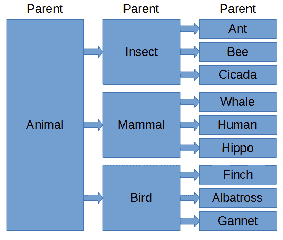

# 第八章面向对象编程

## 类和对象

Java 是一种面向对象的语言。它包含允许我们对自己的数据类型(称为类)的层次结构进行编程的机制。类是一个蓝图——它是一种对象类型的描述，对象拥有哪些变量，对象能够执行哪些方法(函数)。我们可以从这些类蓝图中创建对象——这些对象被称为类的实例。对象是称为成员变量的变量和称为成员方法的方法的集合。例如，可以创建一个半径为变量的圆类。这些方法可能会计算出像 computePerimiter 和 computerArea 这样的东西。

理解 Java 中的类和对象的基础有三个关键概念:

*   成员变量:描述一个对象或类**有什么**。
*   成员方法:描述对象或类**做什么**。
*   继承:描述一个对象**是什么**；它从父类继承的内容。

### 类别关键字

为了开始描述一个新的类，首先将它添加到您的项目中，就像我们将 MainClass 添加到我们的第一个项目中一样(单击文件>新建>类)。您必须在新建 Java 类对话框中为您的类指定一个唯一的名称。我们将首先构建一个简单的 circle 类，我已经在代码清单 8.0 中将我的类命名为 Circle。请注意，类的名称应该与文件名匹配，这意味着这个特定类的文件是 Circle.java(当我们使用类向导将类添加到项目中时，这将是自动的)。

代码清单 8.0:空圆类

```
  public class Circle {
  }

```

### 局部变量与成员变量

我们已经定义了许多变量，但是在每种情况下，我们都是在一个方法中定义的(特别是在主方法中)。这些变量的作用域(或可见性)只持续方法的一个代码块。在方法内部定义的变量，其作用域只持续方法的持续时间，称为局部变量。与局部变量不同，成员变量的作用域持续到对象的生存期。

#### 成员变量

从类构建的每个对象都有成员变量。为了创建一个成员变量，我们在类的主体内部，但在任何方法之外定义变量。除了具有数据类型和名称，成员变量还可以具有访问修饰符。访问修饰符描述了成员变量对外部世界的可见性，即它们定义了对象是否可以访问这个成员变量，或者它是否是私有的。

代码清单 8.1:循环类成员变量

```
  public class Circle {
        public  float radius;
        private String name;
        protected float lineWidth;
        private static  int circleCount;
  }

```

在代码清单 8.1 中，为我们的 Circle 类定义了四个成员变量。请注意，数据类型公共、私有、受保护和静态旁边都有术语。这些是访问修饰符。它们被放置在数据类型的左侧。

**`public`** :所有类都可以访问标记为公共的成员变量和方法。

**`protected`** :属于同一个包的类和对象被允许访问受保护的成员变量。

**`private`** :标记为私有的成员变量只能由类本身的成员访问——也就是说，从类构建的对象。

**`static`** :标记为静态的成员属于该类，而不是从该类创建的对象。如果我们将一个成员变量标记为静态，那么该类中的所有对象都将共享该变量的一个副本。标记为静态的成员也可以用类而不是对象来引用，正如我们将看到的。

|  | 注意:关键字 final 是另一个访问修饰符。标记为 final 的成员和局部变量的值只能指定一次。final 关键字对于定义常数很有用，如数学常数 PI 和 e。Final 变量通常用所有大写字母命名，如 PI 和 DAYS_IN_JUNE。有关 final 关键字的更多信息，请访问[https://docs . Oracle . com/javase/tutorial/Java/javaOO/class vars . html](https://docs.oracle.com/javase/tutorial/java/javaOO/classvars.html)。 |

### 实例化对象

我们已经定义了一个名为 Circle 的类，现在我们可以开始从它构建对象了。移回项目中的 MainClass.java 文件。代码清单 8.2 展示了如何使用新的操作符从我们的 Circle 类创建一个对象。

代码清单 8.2:从类创建对象

```
  public  class MainClass {
        public static void main(String[] args) {
               Circle
  c = new Circle();
               c.radius = 100.0f;
               System.out.println("Circle radius is
  " + c.radius);
        }
  }

```

代码清单 8.2 中最重要的一行是 Circle c = new Circle()；。这一行从我们的类蓝图中创建一个新的 Circle 对象，并将其分配给对象 c。我们从类名 Circle 开始，然后是我们想要的对象名称 c。接下来，我们使用赋值运算符,=，然后是 new 关键字。new 关键字后面是看起来像函数调用的内容，但这实际上是一个非常特殊的函数。Circle()是一个构造函数。它是一个用于从类中初始化对象的函数。我们没有在 Circle 类中提供任何构造函数，所以 Java 为我们提供了默认的构造函数 Circle()(我们稍后将自己定义一些构造函数)。

对象 c 是 Circle 类的一个实例。它拥有 Circle 类中指定的每个成员变量的副本。我们可以改变 c 的公共成员变量，为了改变对象的半径成员变量，我们使用“c.radius = 100.0f”。对象名称后的句点表示 radius 令牌属于 c 实例。我们可以设置 radius 成员变量，如代码清单 8.2 所示，但是我们不能设置名称或 circleCount 成员变量。如果我们试着用“c .`name`=“Sirkl”；”或者“`c`”。*循环计数*= 100；”，您会注意到 Eclipse 强调并声明这些成员不可见，因为它们被标记为私有，并且 main 方法不是 Circle 类的一部分，因此它看不到这些成员变量。

|  | 注意:主方法与 Circle 类在同一个包中，因此您会发现使用“c.lineWidth = 23”更改 lineWidth 成员变量是完全合法的。这与 C 和 C++中的受保护修饰符非常不同，后者意味着对子类可见。 |

我们可以从一个类中创建许多对象。如果我们创建第二个圆并将其称为 b，c 圆和 b 圆都将有自己的成员变量(参见代码清单 8.3)。

代码清单 8.3:创建多个实例

```
  public class MainClass {
        public  static  void main(String[] args) {
               Circle
  c = new Circle();
               Circle
  b = new Circle();
               c.radius = 100.0f;
               b.radius = 900.0f;
               System.out.println("Radius of c:
  " + c.radius); // Prints 100
               System.out.println("Radius of b:
  " + b.radius); // Prints 900
        }
  }

```

代码清单 8.4 显示，我们可以非常快速地从我们的类创建整个对象实例数组。请注意，当我们声明类型为 Circle 的数组时，数组的所有元素都被初始化为 null。为了实例化对象，我们必须为每个实例调用构造函数。

代码清单 8.4:创建对象数组

```
  public class MainClass {
        public static void main(String[] args) {
               // Declare array of 100
  Circles objects.
               Circle[]
  circleArray = new Circle[100];

               // Use a loop to call
  new and set radiuses.
               for(int i = 0; i < 100; i++) {
                     circleArray[i] = new Circle();
                     circleArray[i].radius = (float)i;
               }
               // Print out a radius
  as an example.
               System.out.println
               ("circleArray[20]
  Radius: "
  + circleArray[20].radius);
        }
  }

```

### 成员方法

成员方法是类的函数。函数是我们可以调用的可重用代码块。在代码清单 8.5 中，我已经将所有成员变量更改为私有变量。将所有成员变量标记为私有，并将 getters 和 setters 提供为成员方法(这使我们能够在知道没有外部类直接访问它们的情况下改变成员变量的内部工作方式)是常见的做法。Circle 类也已经扩展到包括许多成员方法。代码清单 8.5 中包含的成员方法有设置半径、获取半径、打印、零计数和设置线宽。

代码清单 8.5:成员方法

```
  public  class Circle {
        private  float radius;
        private String name;
        private  float lineWidth;
        private  static  int circleCount;

        // Constructors:

        // Default Constructor
        public Circle() {
               this.radius = 0.0f;
               this.name = "No name";
               this.lineWidth = 0.0f;
               circleCount++;
        }
        // Two argument
  constructor
        public Circle(String name, float radius) {
               this.radius = radius;
               this.name = name;
               this.lineWidth = 0.0f;
               circleCount++;
        }

        // Methods
        public  void setRadius(float radius) {
               this.radius = radius;
        }
        public  float getRadius() {
               return radius;
        }
        public  void print(){
               System.out.println("Circle: " + name + " Rad: " + radius);
        }
        protected  void setLineWidth(float newWidth) {
               this.lineWidth = newWidth;
        }
        public  static  void zeroCount() {
               circleCount = 0;
        }
        public  static  int getCount() {
               return circleCount;
        }
  }

```

成员方法以访问修饰符开始，如公共、私有和静态。这些访问修饰符的行为方式与我们标记成员变量时完全相同。公共指定意味着所有外部对象都可以调用方法，而私有指定意味着只有类的成员可以调用方法，等等。在访问修饰符之后，我们为我们的方法提供一个标识符名称，然后是该方法需要的参数。

代码清单 8.5 中的前两个方法是构造函数。构造函数没有返回类型，它们与类同名。当我们从类中创建一个对象时，我们使用 new 关键字并调用一个构造函数。代码清单 8.5 中指定的第一个构造函数没有参数。这称为默认构造函数。第二个构造函数接受两个参数，一个名称和一个半径，并根据这些参数的值设置对象的成员变量。

|  | 注意:注意关键字 this 在类的方法中的使用。关键字的意思是“当前对象”我们可以使用关键字 this 来区分传递给方法的参数和同名的成员变量。代码清单 8.5 中的第二个构造函数展示了一个例子——我们传递一个名为 name 的参数，并使用它来设置 this.name 的值，它是名为 name 的成员变量。 |

|  | 注意:当成员方法或构造函数接受多个参数时，我们用逗号分隔参数列表中的参数。这可以在代码清单 8.5 的第二个构造函数中看到，它接受两个参数——一个名为 name 的字符串和一个名为 radius 的浮点数。 |

方法 setRadius、getRadius 和 setLineWidth 被称为 getters 和 setters。它们是成员方法，允许外部对象更改相应私有变量的值。getter 用于读取变量值。Getters 不接受参数，并且返回变量碰巧是的任何类型。Getters 通常只由一行返回变量值的代码组成。setter 用于设置私有成员变量的值。设置器通常采用一个名称和类型相同的参数作为它们用来设置的变量。设置器通常由一行组成，用于将新值赋给成员变量。

#### 调用成员方法

在我们为一个类提供成员方法之后，我们可以创建一个对象并使用实例调用方法。代码清单 8.6 展示了如何创建一个 Circle 对象并调用指定的成员方法。

代码清单 8.6:调用成员方法

```
  public class MainClass {
        public  static void main(String[] args) {
               // Create a circle with
  the default constructor.
               Circle
  c = new Circle();

               // Create a circle with
  the (String, radius) constructor.
               Circle
  b = new Circle("Dennis", 55.0f);

               // See how many circles
  we've counted with getCount. 
               System.out.println("Number of circles
  created: " +
   Circle.getCount());
               b.print();         // Call the print
  method of b.

               c.setRadius(27.0f);// Call setRadius to
  set c.radius to 27.0f.
               c.setLineWidth(100.6f);   // set c.lineWidth to
  100.6f.
               System.out.println("Radius of C:
  " + c.getRadius());

               Circle.zeroCount(); // Calling a static
  method.
               System.out.println(
  "Number
  of circles created: " + Circle.getCount());

        }
  }

```

为了调用成员方法，我们提供对象的名称，后跟点运算符，再跟方法的名称(例如，c.setRadius(100.0f))。在方法调用的括号中，我们提供了参数。

|  | 注意:在 Java 类中，我们可以有多个名称完全相同的方法，只要每个方法使用不同数量的参数或具有不同数据类型的参数作为输入。这叫做方法重载，代码清单 8.6 展示了一个构造函数重载的例子。请注意，有两种方法叫做 Circle，它们采用不同的参数。当我们调用其中一个构造函数时，Java 会知道我们传递的参数是指哪一个。我们也可以重载非结构方法——例如，我们有多个 setRadius 方法:一个接受双精度，一个接受整数，等等。 |

## 遗传

继承为我们节省了时间。我们希望键入尽可能少的代码，并且不希望多次重写相同的代码。继承允许我们用父/子关系来编程类。目标是用广泛适用的术语描述父类的属性。从父类中，我们可以创建更具体的子类。

下面这个类叫做动物。它将被用作父类，它描述了适用于所有动物的方面。动物拥有自主运动，它们摄取某种形式的能量，所以我在代码清单 8.7 中包含了两个布尔变量，并在默认构造函数中将它们设置为 true。您可以像之前添加 MainClass 和 Circle 类一样，将新类添加到现有项目中，也可以开始一个新项目。

代码清单 8.7:动物父类

```
  public class Animal {
        public boolean voluntaryMotion;
        public boolean requiresFood;

        public Animal(){
               voluntaryMotion = true;
               requiresFood = true;
        }
  }

```

昆虫是一种动物。所有昆虫都有六条腿、天线和外骨骼。有些昆虫有翅膀，所以我们将为翅膀包含一个布尔值，并在构造函数中默认将其设置为 true。但是因为所有的昆虫都是动物，我们可以从动物父类继承，而不是添加 voluntaryMotion 和 requiresFood 的成员变量。代码清单 8.8 展示了使用 extends 关键字从 Animal 父类继承的语法。

代码清单 8.8:昆虫子类

```
  public class Insect extends Animal {

        public  boolean antennas; 
        public String skeleton;
        public  int numberOfLegs;
        public  boolean wings;

        public Insect(){
               super();
               antennas = true;
               skeleton = "Exosketon";
               numberOfLegs = 6;
               wings = true;
        }

        public  void Print() {
               System.out.println("Antennas: " + antennas + 
                            " Skeleton: " + skeleton + 
                            " Number of Legs:
  " + numberOfLegs +
                            " Wings: " + wings + 
                            " Voluntary
  Motion: "
  + voluntaryMotion + 
                            " Requires Food:
  " + requiresFood);
        }
  }

```

代码清单 8.8 中最重要的语法用黄色突出显示。昆虫类是派生类或子类，动物类是超级类或父类。代码清单 8.8 的第一行显示了关键字 extends 的用法。这个关键字意味着昆虫类扩展或继承了动物类中指定的原始特征。

还要注意代码清单 8.8 中对方法 super()的调用。这是对动物类构造函数的调用。从子类中，我们可以使用术语 super 来表示父类，通过提供一个空的参数列表，我们可以调用 Animal 类的默认构造函数。在代码清单 8.8 中，我们看到默认构造函数将布尔变量 voluntaryMotion 和 requiresFood 设置为 true。

|  | 注意:在子类中没有必要调用父类的构造函数，但是如果调用了父类的构造函数，则必须在子类构造函数的第一行调用它。 |

代码清单 8.9:昆虫类

```
  public class MainClass {
        public static void main(String[] args) {
               // Create an instance
  of Insect called i.
               Insect
  i = new Insect();
               // Change the insect
  class's members:
               i.antennas = false;
               i.numberOfLegs = 100;
               // Call the Insect's
  Print method:
               i.Print();
               // Change the parent
  class's requiresFood member:
               i.requiresFood = false;
        }
  }

```

代码清单 8.9 展示了一个创建一个昆虫对象并调用它的一些成员的例子。

然后我们可以继续定义一个蚂蚁类。蚂蚁是昆虫，因此它们有六条腿、外骨骼和天线，但它们没有翅膀(至少不是典型的)。因此，我们可以创建一个名为 Ant 的新子类，它继承了昆虫的父类，但 wings 布尔值设置为 false，如代码清单 8.10 所示。

代码清单 8.10:蚂蚁子类

```
  public class Ant extends Insect {
        public Ant() {
               super();
               wings = false;
        }
  }

```

在代码清单 8.10 中，请注意，在将 wings 设置为 false 之前，我们使用 super()调用父构造函数。父构造函数必须作为子构造函数的第一条语句被调用。然而，父构造函数将 wings boolean 设置为 true，我们希望我们的蚂蚁没有翅膀。

我们可以很容易地添加更多的类，比如哺乳动物和大象。每次我们添加一个新的派生类，我们只需要指定它与父类或超类有什么不同(图 42 是一个示例层次结构)。



图 42:动物类层次结构

面向对象编程还有很多东西——比如抽象类、接口和多态性。这些都是高级主题，我们将在下一本书 *Java 简明第 2 部分*中介绍。