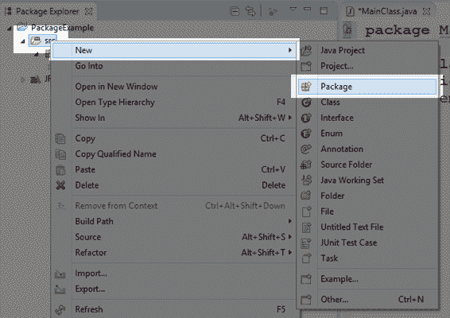
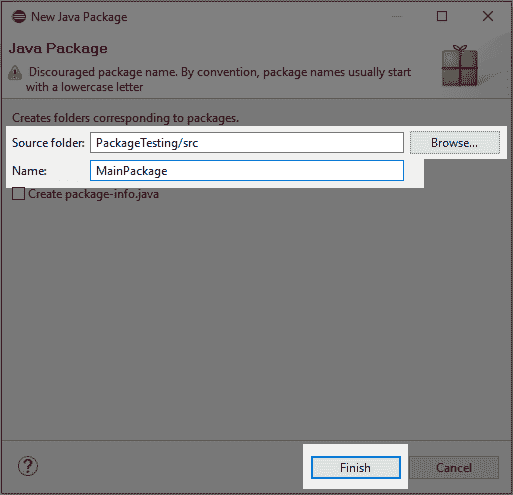
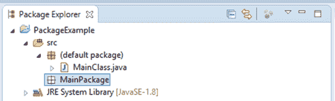
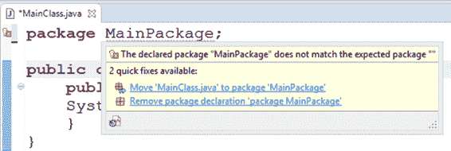
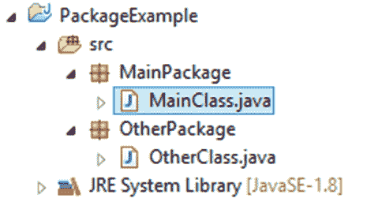
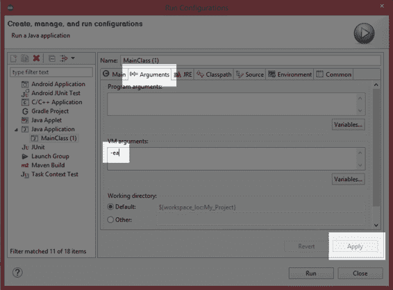

# 第 1 章包装和断言

## 包裹

包提供了一种将类组织成组的方法。它们允许我们拥有多个同名但属于不同包的类，并且允许我们重用代码。包就像电脑上的文件夹。一个文件夹可以包含多个文件，就像包包含多个类一样。并且可以有两个名称完全相同的文件，只要它们在不同的文件夹中。同样，在不同的包中可以有两个标识符完全相同的不同项目。当我们使用 import 关键字时，我们可以指定要从中导入的包和类。

### 手动添加包

为了将类放入一个新的包中，必须使用 package 关键字，后跟包名，如代码清单 1.0 所示。

代码清单 1.0:包关键字

```
  package MainPackage;

  public class
  MainClass {
        public static void
  main(String[] args) {
        System.out.println("This
  class belongs to the MainPackage package!");
        }
  }

```

您会注意到这段代码的第一行在 Eclipse 中用红色下划线标出。这是因为目前没有叫`MainPackage`的套餐。我们可以通过两种方式添加主包。第一种方法是右键单击包浏览器中的 **src** 文件夹，然后从上下文菜单中选择**新建**和**包**。这将弹出一个对话框，您可以在其中键入新包的名称。

 

图 1:添加新包

在“新建包”框(图 1 中的右窗口)中，您可以为包指定一个新文件夹。我把文件夹留为 src。当您命名新包并单击完成时，Eclipse 将添加新包，但您会注意到`MainClass`仍然没有包含在我们的新包中，它仍然是默认包的一部分。您可以使用包浏览器将 MainClass.java 文件拖到`MainPackage`中，如图 2 所示。当您将`MainClass`移动到`MainPackage`包时，可能会提示您先保存文件。当移动操作完成时，如果默认包中没有类，您会注意到默认包已从项目中移除。



图 2:将 MainClass.java 拖到主包中

### 使用 Eclipse 建议添加包

添加包的第二种方法是使用 Eclipse 的内置建议功能。每当我们的代码中出现错误或警告时，Eclipse 都会在可疑的代码部分加下划线。我们可以将鼠标光标悬停在代码上，Eclipse 将弹出一个框，其中充满了如何解决这个问题的建议。

|  | 注意:在这本电子书中，我使用了 Eclipse 作为 IDE，但是许多其他 IDE 允许您创建 Java 应用程序。您可能会喜欢探索其他 ide，例如 NetBeans、IntelliJ 和 Android Studio(这是 Eclipse 的一个版本，主要用于帮助 Android 应用程序开发)。 |



图 3: Eclipse 添加包的建议

图 3 显示了两个 Eclipse 建议，用于在没有`MainPackage`时修复问题行“`package MainPackage`”。第一个建议是把 MainClass.java 搬到包`MainPackage`。这正是我们想要做的，所以我们点击这个建议，Eclipse 将在包浏览器中创建包，然后为我们把 MainClass.java 移到那里。

在我们解决这个问题之前，我们还要注意，在代码窗口的空白处，我们的`MainPackage`加下划线的地方有一个灯泡图标。您可以单击此图标来接收与鼠标光标悬停相同的建议。

一定要非常仔细地阅读 Eclipse 的建议——尤其是在处理潜在的大规模变更时，比如在包中添加和移除类。如果您是编程新手，良好的做法是在恢复到 Eclipse 的建议之前手动修复问题。编程大型项目需要一定的流畅性，只有通过实践才能获得。

### 创建多个包

让我们在不同的包中添加另一个类，看看如何使用`import`关键字将第二个类导入到我们的`M` `ainC` `lass`中。增加一个名为`OtherClass`的新班级。使用 Eclipse 的建议或者通过将其添加到包浏览器中，将`OtherClass`放入名为`OtherPackage`的包中，就像我们刚才使用`MainClass`所做的那样。



图 4:两个包

图 4 显示了两个类，每个类都在一个单独的包中。代码清单 1.1 中列出了 OtherClass.java 文件的代码。

代码清单 1.1:其他类

```
  package OtherPackage;

  public class
  OtherClass {
        public void
  SayHello() {
              System.out.println("No,
  say it yourself!");
        }
  }

```

代码清单 1.2: MainClass.java

```
  package MainPackage;

  // Import OtherPackage.*;
  import OtherPackage.OtherClass;

  public class
  MainClass {
        public static void
  main(String[] args) {
              OtherClass o = new
  OtherClass();
              o.SayHello();
        }
  }

```

代码清单 1.2 展示了如何将名为`OtherPackage`的包导入到我们的 MainClass.java 文件中，从类中创建一个对象，并调用一个`SayHello`方法。进口包装的线是“`import OtherPackage.OtherClass;`”。我们还可以使用通配符(`*`)来导入所有定义为带有注释行“`import OtherPackage.*;`”的`Othe` `rPackage`包的类。

我们可以将一个程序的所有代码编写到一个包中，或者根本不指定包(这意味着我们项目中的所有类都属于默认包)。但是随着项目变得越来越大，我们通常会收集算法和有用的代码，我们可以把它们捆绑在一个包中，并在项目之间重用。

## 断言

Assert 是一种有用的调试机制。对`assert`Java 中的一个条件是保证它是`true`。当我们做出断言时，我们是说如果某个语句是`false`，终止应用程序并让我们知道(`assert`是用于调试的，它不是为最终用户或生产代码设计的)。我们使用`assert`在我们的程序中包含测试。如果我们在整个应用程序开发过程中仔细设计测试，`assert`可以让我们知道出了问题，并且可以提高我们维护和调试项目的能力。下面，我创建了一个名为`AssertTesting`的新项目，并添加了一个`MainClass`。新类的代码在代码清单 1.3 中列出。

代码清单 1.3:使用断言

```
  import java.util.Scanner;

  public class
  MainClass {
        public static void
  main(String[] args) {
              int numerator;    //
  Numerator for our fraction.
              int denominator;//
  Denominator for our fraction.
              Scanner scanner = new
  Scanner(System.in);

              // Read a numerator.
              System.out.println("Please
  enter a numerator: ");
              numerator = Integer.parseInt(scanner.nextLine());

              // Read a denominator.
              System.out.println("Please
  enter a denominator: ");
              denominator =
  Integer.parseInt(scanner.nextLine());

              // Ensure that the denominator is
  not 0!
              assert(denominator != 0);

              // If the assert passed, print out
  some info using our fraction:
              System.out.println(numerator + "
  / " + denominator + " = " +
                          (numerator / denominator) + "
  remainder " + 
                          (numerator % denominator));
        }
  }

```

代码清单 1.3 中的程序从用户那里读取两个整数，一个`numerator`，一个`denominator`。它用于将`numerator`除以`denominator`，并输出除法的结果和余数。但是，如果用户输入`0`作为`denominator`，程序无法执行除法，因为没有定义`0`的除法。程序使用“`assert(denominator != 0)`”保证`denominator`不为零。

请注意，`assert`关键字在括号中有一个关联的`boolean`表达式。如果`boolean`表达式为`true`，则`assert`通过，程序继续正常执行。如果表达式为`false`(即用户输入`0`作为`denominator`，则断言失败，程序将退出。至少，这是计划。默认情况下，Eclipse 被设置为忽略断言，当运行应用程序并输入`0`的`denominator`时，它将导致我们的程序崩溃。为了运行我们的应用程序，并让我们的断言在程序失败时暂停程序，我们需要将`-ea`作为命令行选项提供给 JVM ( `-ea`是启用断言的缩写)。为了给程序提供命令行参数，从文件菜单中选择**运行** ，然后选择**运行配置**。这将打开运行配置对话框，如图 5 所示。



图 5:为 JVM 指定命令行参数

要打开断言，选择**参数**选项卡，并在虚拟机参数框中键入`-ea`。完成后不要忘记点击**应用**。在`-ea`参数被传递给虚拟机后，我们可以再次调试我们的应用程序，Eclipse 将对我们的断言做出更合适的反应。为了关闭断言(让 JVM 忽略所有断言)，从参数列表中删除`-ea`参数，如图 5 所示。

当断言在调试模式下失败时，程序将暂停断言并突出显示它，以便程序员可以准确地检查出了什么问题。当断言在运行模式下失败时，控制台窗口将显示一条消息，向程序员指出有问题的断言，以及断言失败的文件。

JVM 和 JVC 有许多命令行选项。有关可用选项的更多信息，请访问:

[http://docs . Oracle . com/javase/7/docs/techno tes/tools/windows/Java . html](http://docs.oracle.com/javase/7/docs/technotes/tools/windows/java.html)

[http://docs . Oracle . com/javase/7/docs/techno tes/tools/Solaris/javac . html #选项](http://docs.oracle.com/javase/7/docs/technotes/tools/solaris/javac.html#options)