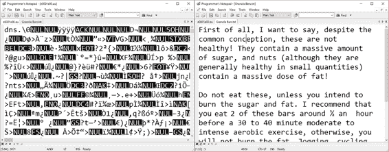
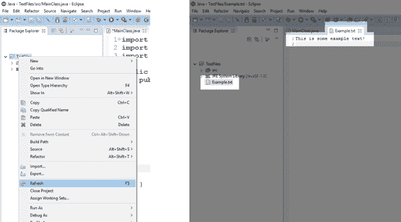
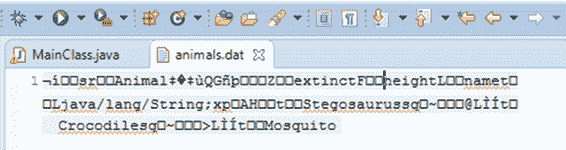

# 第二章文件读写

读取和写入文件很重要，因为即使计算机关闭，文件也会保留它们的信息。文件的读写速度比 ram 慢(RAM 是程序运行时变量和类通常存储的地方)，但文件更持久。硬盘代表一种称为非易失性的存储空间。然而，内存是不稳定的——当机器断电时，它就会被清除。此外，硬盘通常比内存大得多。事实上，许多现代硬盘的大小是万亿字节，而台式电脑的内存通常只有几千兆字节。

Java 中有两大类文件。区别是任意的，实际上，除了我们希望如何处理代码中文件的数据之外，这两个类别之间没有区别。图 6 左边显示了一个二进制文件，右边显示了一个文本文件。这两个文件已经在程序员记事本中打开，记事本是明文编辑器(可从[http://www.pnotepad.org/](http://www.pnotepad.org/)获得)。



图 6:二进制文件和文本文件

在图 6 中，左边的二进制文件是一个音频文件，看起来像是乱码。它包含许多奇怪的字符，很少或没有明显的人类可读。二进制文件以计算机易于读取的方式表示数据，它们用于在程序中保存变量和对象等信息。常见的二进制文件有 WAV、MP3 等音频文件。，像 PNG 或 JPG 这样的图像文件，以及包含我们的对象的序列化版本的文件(我们稍后将探讨序列化)。

图 6 的右边是一个文本文件。文本文件主要由人类可读的字符组成，如字母、数字和标点符号。右边的文件包含一个描述，人类很容易阅读，但计算机不容易理解。计算机可以读取文本文件，但这通常涉及到转换，例如，计算机可以从文本文件中读取数字`128`，但它必须执行从字符串`128`到整数`128`的转换，数字才能随时可用。

在 Java 中，当我们打开一个文件进行读取或写入时，我们选择是以文本文件还是二进制文件的形式打开它。这两者之间的区别由我们可以用来读取和写入数据的方法来表示。在 Java 中，读写文本文件类似于读写控制台。读取和写入二进制文件是完全不同的。

## 写入文本文件

创建一个名为`TextFiles`的新项目，然后添加一个`MainClass`和一个`main`方法。代码清单 2.0 展示了创建一行文本并将其写入文本文件的一些简单代码。

代码清单 2.0:创建和写入文本文件

```java
  import java.io.File;
  import java.io.FileNotFoundException;
  import java.io.PrintWriter;

  public class
  MainClass {
        public static void
  main(String[] args) throws FileNotFoundException
  {

              // Create a file:
              File myFile = new File("Example.txt");

              // Create a writer using the file.
              PrintWriter writer = new
  PrintWriter(myFile);

              // Write a line of text to the
  file.
              writer.println("This
  is some example text!");

              // Close the writer.
              writer.close();
        }
  }

```

在代码清单 2.0 中，`main`方法的第一行“File my File `=` **new** `File(`【example . txt】`);`”创建了一个名为`myFile`的新`File`对象。`File`构造函数接受一个参数，即文件的路径和名称:`Example.txt`。在我们的例子中，没有路径，所以程序将在当前文件夹中创建文件(这将是运行我们的应用程序的文件夹)。另外，请注意在代码清单 2.0 的顶部，我们导入了`java.io.File`。

代码清单 2.0 中的`File`对象只是一个文件名引用。为了写入文件，我们必须使用`PrintWriter`将其作为文本打开。下一行“`PrintWriter` writer `=` **new** `PrintWriter(`my file`);`”，打开`File`对象引用的文件进行文字书写。导入`java.io.PrintWriter`以便使用`PrintWriter`类。

如果由于某种原因，文件无法打开，`PrintWriter`构造函数将抛出一个`FileNotFoundException`。为此，我已经导入了`java.io.FileNotFoundException`并在我的`main`方法中添加了一个`throws`申报。

下一行使用编写器的`println`方法向我们的文本文件中写入一行文本。`println`方法以一个字符串作为参数，将字符写入文件，并在末尾追加一个新的行字符。

最后，作者在最后一行使用`writer.close()`结束。我们必须确保关闭用应用程序打开的每个文件，因为同时用多个程序读写文件是非常难以协调的，而且操作系统通常不允许多个程序访问单个文件。关闭文件，以便其他程序(或程序的其他实例)能够访问该文件。

在运行应用程序时，它会看起来好像什么都没发生。但是如果您在包资源管理器中右键单击您的项目并选择**刷新**，如图 7 所示，您会注意到 Eclipse 现在在我们的包中包含了文件“Example.txt”。双击包资源管理器中的文件，您应该会看到我们打印到文件中的文本。



图 7:刷新以显示示例文件

当错误发生时，我们通常不希望关闭我们的应用程序，并且我们的`main`方法通常不使用`throws`声明，而是用 try/catch 块包围任何处理打开和保存文件的代码。代码清单 2.1 显示了与上面相同的程序，只是它使用了一个 try/catch 来更优雅地响应一个`FileNotFoundException`。

代码清单 2.1:用 Try/Catch 包围文件 IO

```java
  import java.io.File;
  import java.io.FileNotFoundException;
  import java.io.PrintWriter;

  public class
  MainClass {
        public static void
  main(String[] args) {

              // Create a file.
              File myFile = new File("Example.txt");

              // Surround all file manipulation
  with try/catch.
              try {
                    // Create a
  writer using the file.
                    PrintWriter writer = new
  PrintWriter(myFile);

                    // Write a line
  of text to the file.
                    writer.println("This
  is some example text!");

                    // Close the
  writer.
                    writer.close();

              }
              catch
  (FileNotFoundException e) {
                    // File could not
  be opened, show an error message.
                    System.out.println("The
  file could not be opened.");        
              }
        }
  }

```

您可能已经注意到，每次运行代码清单 2.1 中的代码时，文件中的数据都会被覆盖。我们还可以通过使用`FileWriter`类向文件追加新数据，并在追加参数设置为`true`的情况下打开文件(有关向文件追加文本的示例，请参见代码清单 2.2)。这对于日志记录非常有用，因为我们不想在每次写入文件时覆盖以前记录的数据。

代码清单 2.2:向文件追加文本

```java
  import java.io.FileWriter;
  import java.io.IOException;
  import java.io.PrintWriter;

  public class
  MainClass {
        public static void
  main(String[] args) {
              try {
              // Create a file writer with the
  "append" parameter as "true":
                    FileWriter file = new
  FileWriter("Example.txt", true);

                    // Create a
  writer object from the file:
                    PrintWriter writer = new PrintWriter(file);

                    // Write some new
  text:
                    writer.println("This
  text will be added to the end!");

                    // Close the
  writer:
                    writer.close();               
              }
              catch
  (IOException e) {
                    e.printStackTrace();
              }
        }
  }

```

我们可以将数据和变量写入文本文件，但是我们必须知道，当我们读取数据时，它必须被解析。代码清单 2.3 展示了一个将数据写入文本文件的示例，在序列化部分，我们将看到一个更快的数据写入方法。

代码清单 2.3:将数据/变量写入文本文件

```java
  import java.io.File;
  import java.io.FileNotFoundException;
  import java.io.PrintWriter;

  public class
  MainClass {
        public static void
  main(String[] args) {
              File file = new File("test.txt"); 
              try {
                    PrintWriter out = new PrintWriter(file);
                    // Writing text
  out.println("Be good. If
  you can't be good, be lucky!\n\t~ Alan Davis");

                    //
  Characters/floats/Boolean/doubles are all written in
                    // human readable
  form:
                    out.println(
  129 ); // Integers
                    out.println(
  2.7183f ); // Floats
                    out.println(
  true ); // Boolean
                    out.println(
  1.618034 ); // Double
                    // Close writers
  after using them so they can be opened by
                    // other
  programs:
                    out.close();
              }
              catch
  (FileNotFoundException e) {
                    System.out.println("File
  not found: " + e.getMessage());
              }
        }
  }

```

请注意，在运行应用程序时，当您在包资源管理器中刷新项目并打开文件“test.txt”时，该文件将包含以下内容:

乖一点。不能做好人，就要幸运！

~艾伦·戴维斯

One hundred and twenty-nine

2.7183

真实的

1.618034

这些数字是人类可读的，即浮点`2.7183f`看起来与代码中的基本相同。这与计算机实际上以二进制存储`float`的方式非常不同。还要注意引用 Alan Davis 的话中“`\n\t`”的用法——这会导致在文件中插入一个新行和一个制表符。这些符号被称为转义序列。

|  | 提示:如果您希望找到文件在计算机上的位置，请导航到项目的文件夹。您可以通过在包资源管理器中右键单击项目并选择“属性”来导航。这将显示“项目属性”对话框。项目的文件夹列为其位置。或者，您可以在包资源管理器中右键单击该文件，然后选择显示在和系统资源管理器中。这将打开文件在窗口资源管理器中的位置。 |

### 转义序列

在我们继续之前，让我们绕一小段路进入转义序列。当我们将文本打印到屏幕上时，有时我们需要使用特殊的符号来添加新的行、制表符或字符，否则这些字符会结束字符串(即打印双引号字符:`"`)。转义序列可以用在 Java 中向屏幕或文件写入字符串的任何地方。这包括`System.io`和`PrintWriter.println`方法。表 1 显示了 Java 中可用的转义序列。

|  | 注意:转义序列不是字符串固有的。“t”并没有让 JVM 自己打印一个制表符。转义序列是一些处理字符串的方法(如 println)中的编程行为。 |

表 1:转义序列

| 换码顺序 | 意义 |
| --- | --- |
| \t | 标签 |
| \b | 退格 |
| \n | 换行 |
| \r | 回车 |
| \f | 换页 |
| \ `'` | 单引号 |
| \ `"` | 双引号 |
| \\ | 反斜杠 |

代码清单 2.4:转义序列示例

```java
  // \n causes a new line:
  System.out.println("First
  line\nSecondline!");

  // \t inserts a tab, i.e. a small block of whitespace.
  System.out.println("This
  will be separated from\tThis with a tab!");

  // Use \" to write " and \' to write '
  System.out.println("Then
  Jenny said, \"It\'s above the fridge\".");

  // To print a slash
  System.out.println("\\
  wears a top hat!");

  // Some systems require \r\n in order to use a new
  line.
  // Other systems will read this as two new lines,
  i.e. one
  // carriage return and one new line, both of which
  look the same.
  System.out.println("New\r\nLine!");

```

代码清单 2.4 展示了在代码中使用转义序列的一些例子。请注意，在最后，我们使用一对“`\r\n`”来表示一个新行。Eclipse 控制台将此视为一个新行，而不将“`\n`”视为一个新行。这提出了一个重要的观点，即读取转义序列是程序相关的。如果我们将“`\n`”写入文本文件，大多数文本编辑器会将其作为新行阅读。一些文本编辑器允许我们指定“`\r\n`”或“`\r`”或“`\n`”是否应该代表新行。

## 读取文本文件

我们可以用扫描仪读取文本文件。这类似于从控制台读取，只是我们没有创建扫描仪并传递`System.in`参数，而是传递我们的文件。代码清单 2.5 展示了一个从代码清单 2.3 中读取文本的例子。

代码清单 2.5:从文本文件中读取

```java
  import java.io.File;
  import java.io.FileNotFoundException;
  import java.util.Scanner;

  public class
  MainClass {
        public static void
  main(String[] args) {
              File file = new File("test.txt");

              try {
                    // Create a
  scanner from our file:
                    Scanner in = new
  Scanner(file);

                    // Read the first
  two lines into a string:
                    String s = in.nextLine()
  + in.nextLine();

                    // Reading
  variables:
                    int i = in.nextInt();
                    float f = in.nextFloat();
                    boolean b = in.nextBoolean();
                    double d = in.nextDouble();

                    // Close the
  scanner:
                    in.close();

                    // Print out the
  results:
                    System.out.println(
                                "String:
  " + s + "\n" +
                                "int: " + i + "\n" +
                                "float:
  " + f + "\n" +
                                "boolean:
  " + b + "\n" +
                                "double:
  " + d );
                    }
              catch
  (FileNotFoundException e) {
                    e.printStackTrace();
              }
        }
  }

```

请注意，我们读取数据的顺序必须与我们写入数据的顺序相匹配。当从文件中读取数字字符时，它必须与数据类型匹配，否则将引发异常(例如，我们不能读取“1”或“1”，并期望 Java 会自动将该文本解析为整数 1)。此外，重要的是要知道，数值数据到数值变量的读取和转换非常慢。我们通常不会以这种方式编写变量，而是倾向于使用文本文件来读写字符串。

## 序列化

我们经常希望将对象保存到磁盘上，以便在机器关闭并再次打开后，可以在以后恢复它们。将对象转换为保存到磁盘的格式的行为称为序列化。我们可以使用前面的文本读/写方法，并指定每个成员变量保存到一个文本文件中，但是这种技术很慢，需要我们指定要保存在类中的每个成员变量，并确保以与我们编写它们完全相同的顺序读取成员。

我们可以将对象序列化并读取/写入二进制文件，而不是使用文本文件。为了允许我们的对象是可序列化的，我们必须实现`Serializable`接口。界面需要导入`java.io.Serializable`。代码清单 2.6 显示了一个实现`Serializable`的基本类。

## 序列化对象

有许多方法可以将对象保存到磁盘。当我们序列化一个对象时，我们通常使用`ObjectOutputStream`，这是一个类，它接受一个对象，并执行从对象的内存表示到磁盘表示的转换(即序列化对象)。同样，当我们将磁盘上的对象反序列化或读回程序时，我们通常使用`ObjectInputStream`来执行从磁盘对象表示到内存表示的转换。

代码清单 2.6:实现可序列化接口

```java
  import java.io.Serializable;

  public class Animal implements
  Serializable {
        // Member variables
        float height;
        String name;
        boolean extinct;

        // Constructor
        public Animal(String name, float height, boolean extinct) {
              this.name = name;
              this.height = height;
              this.extinct = extinct;
        }

        // Output method
        public void print()
  {
              System.out.println("Name:
  " + name + "\n" +
                    "Height:
  " + height + "\n" +
                    "Extinct:
  " + extinct + "\n");
        }
  }

```

在代码清单 2.6 中，我们唯一必须添加到类中的是实现`Serializable`(我们将在下一章中更详细地查看接口和实现)。Java 为我们处理剩下的事情。现在我们有了一个可序列化的类，我们需要创建一些对象，然后将它们保存到磁盘上。代码清单 2.7 展示了如何使用序列化将`Animal`对象写入磁盘。

代码清单 2.7:序列化对象

```java
  import java.io.File;
  import java.io.FileNotFoundException;
  import java.io.FileOutputStream;
  import java.io.IOException;
  import java.io.ObjectOutputStream;
  import java.io.Serializable;

  public class MainClass
  implements Serializable {
        public static void
  main(String[] args) throws
  FileNotFoundException, IOException {

              // Create some animals from our Serializable
  class:
              Animal stego = new Animal("Stegosaurus", 12.5f,
  true); 
              Animal croc = new Animal("Crocodile", 3.2f, false); 
              Animal mozzie = new Animal("Mosquito", 0.2f, false);

              // Output to the console:
              stego.print();
              croc.print();
              mozzie.print();

              // Specify the name of our file:
              File file = new File("animals.dat");

              // Create a FileOutputStream for
  writing to the file.
              FileOutputStream fileOutput = new
  FileOutputStream(file);

              // Create object output stream to
  write serialized objects
              // to the file stream:
              ObjectOutputStream objectOutput = new
  ObjectOutputStream(fileOutput);

              // Write our objects to the
  stream:
              objectOutput.writeObject(stego);
              objectOutput.writeObject(croc);
              objectOutput.writeObject(mozzie);

              // Close the streams:
              objectOutput.close();
              fileOutput.close();
        }
  }

```

代码清单 2.7 显示了从类创建可序列化对象，然后打开文件流和对象流的步骤。

如果我们运行代码清单 2.7 中的程序，然后检查文件的内容(通过在包资源管理器中刷新项目，然后双击文件打开其内容)，我们将看到它不再包含人类可读的数据，而是包含二进制数据(参见图 8)。



图 8:序列化对象

图 8 显示了我们的三个对象被序列化后文件`animals.dat`的内容。文件内容不可读，虽然有几个零散的字，但大部分文件都是由无意义的字符组成的(对人类来说就是无意义的)。当我们需要恢复动物的准确价值时，这个文件目前包含的数据对于计算机来说非常快速和容易读取。

## 读取序列化对象

既然我们已经了解了如何序列化对象，那么让我们看看如何将对象从磁盘读回内存。代码清单 2.8 展示了一个从文件中读取序列化对象的例子。

代码清单 2.8:读取序列化对象

```java
  import java.io.File;
  import
  java.io.FileInputStream;
  import java.io.FileNotFoundException;
  import java.io.FileOutputStream;
  import java.io.IOException;
  import java.io.ObjectInputStream;
  import java.io.ObjectOutputStream;
  import java.io.Serializable;

  public class MainClass
  implements Serializable {
        public static void
  main(String[] args) throws
  FileNotFoundException, IOException {

              // Create some animals from our
  Serializable class:
              Animal stego = new Animal("Stegosaurus", 12.5f,
  true); 
              Animal croc = new Animal("Crocodile", 3.2f, false); 
              Animal mozzie = new Animal("Mosquito", 0.2f, false);

              // Output to the console:
              stego.print();
              croc.print();
              mozzie.print();

              // Specify the name of our file:
              File file = new File("animals.dat");

              // Create a FileOutputStream for
  writing to the file.
              FileOutputStream fileOutput = new
  FileOutputStream(3file);

              // Create object output stream to
  write the serialized objects
              // to the file stream:
              ObjectOutputStream objectOutput = new
  ObjectOutputStream(fileOutput);

              // Write our objects to the
  stream:
              objectOutput.writeObject(stego);
              objectOutput.writeObject(croc);
              objectOutput.writeObject(mozzie);

              // Close the streams:
              objectOutput.close();
              fileOutput.close();

              /////////////////////////////////////////
              //
  Reading the objects back into RAM:
              /////////////////////////////////////////

              //
  Declare an array to hold the animals we read:
              Animal[] animals = new Animal[3];

              //
  Create a file and an object input stream:
              FileInputStream fileInput = new FileInputStream(file);
              ObjectInputStream objectInput = new ObjectInputStream(fileInput);

              //
  Read the objects from the file:
              try {
                    animals[0] = (Animal) objectInput.readObject();
                    animals[1] = (Animal) objectInput.readObject();
                    animals[2] = (Animal) objectInput.readObject();

                    // Close the streams:
                    objectInput.close();
                    fileInput.close();
              }
              catch (ClassNotFoundException e) {
                    e.printStackTrace();
              }
              //
  Print the objects:
              System.out.println("Objects read from file: ");
              for(int i = 0; i < 3; i++) {
                    animals[i].print();
              }
        }
  }

```

代码清单 2.8 包含要首先序列化的代码，与之前完全相同。但是用黄色突出显示的代码显示了如何反序列化对象，然后将它们从磁盘读回名为`animals`的数组。

### 读取未知数量的对象

如果您不知道一个文件中序列化了多少个对象，您可以使用一个没有终止条件的 while 循环来读取对象，直到抛出`EOFException`。`EOFException`代表文件结束异常。代码清单 2.9 展示了一个将三个`animals`读入一个`ArrayList`并捕获文件结束异常的例子。我省略了序列化这三个对象的代码，但它与代码清单 2.7 完全相同。

在代码清单 2.9 中，我们需要抓住或抛出`ClassNotFoundException`。如果文件不包含可序列化为我们的特定类的数据，将引发此异常。我们要么抓住它，要么扔了它。在代码清单 2.9 中，我通过指定`main`方法抛出来处理`ClassNotFoundException`。

代码清单 2.9:读取未知数量的序列化对象

```java
  import java.io.EOFException;
  import java.io.File;
  import java.io.FileInputStream;
  import java.io.FileNotFoundException;
  import java.io.FileOutputStream;
  import java.io.IOException;
  import java.io.ObjectInputStream;
  import java.io.ObjectOutputStream;
  import java.io.Serializable;
  import java.util.ArrayList;

  public class MainClass
  implements Serializable {
        public static void
  main(String[] args) throws
  FileNotFoundException, IOException, ClassNotFoundException {
              // ...
              // The code above this line is the
  serializing code. 

              // Deserializing an unknown number
  of objects:

              // Declare an array to hold the
  animals we read:
              ArrayList<Animal> animals = new
  ArrayList<Animal>();

              // Create a file and an object
  input stream:
              FileInputStream fileInput = new FileInputStream(file);

              ObjectInputStream objectInput = new
  ObjectInputStream(fileInput);
              try {
                    // Read all the
  animals specified in the file,
                    // storing them
  in an array list:
                    for(;;) {
                          animals.add((Animal)
  objectInput.readObject());
                    }
              }
              catch
  (EOFException e) {
                    // We do not have
  to do anything here; this is the normal
                    // termination of
  the loop above when all objects have
                    // been read.
              }

              // Close the streams:
              objectInput.close();
              fileInput.close();
              for(Animal a: animals) {
                    a.print();
              }
        }
  }

```