# 七、GUI窗口构建器

在本节中，我们将使用 Eclipse 的 WindowBuilder，使用所见即所得(所见即所得)的拖放系统来构建一个更复杂的 GUI。这大大增加了 GUI 开发的控制和速度。我们将构建一个简单的计算器应用程序。我将只包括基本的算术运算，但我们会看到，添加新的功能到我们的计算器是快速和容易的。

|  | 注意:我在这本电子书中专门使用了 Eclipse，但是也有其他的 ide 可用，有些有自己的 GUI 构建工具——例如 IntelliJ 有 IDEA。也可以使用为多个 ide 设计的GUI构建器，如 JFormDesigner。 |

## 添加窗口

接下来，让我们像以前一样创建一个新的 Java 项目。我称我的为`Calculator`。创建新项目后，右键单击包浏览器中的 **src** 文件夹，然后单击**新建**和**其他**，添加一个主窗口，如图 18 所示。

Eclipse 集成开发环境没有附带已经安装的窗口构建器包，这意味着您必须单独安装它们。关于如何做到这一点的详细说明不在本电子书的范围内，但可以通过互联网搜索找到。简而言之，您可以从 Eclipse 工具栏中选择**帮助|安装新软件**菜单项，然后使用逐步向导安装四个左右的包(有些包，如文档，是可选的)，这些包用于使用 WindowBuilder/Swing 创建GUI应用程序。

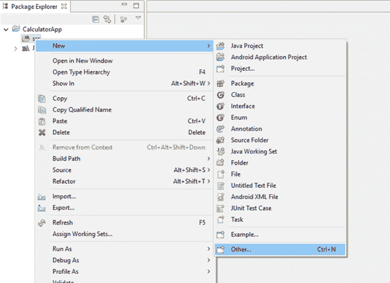

图 18:添加窗口步骤 1

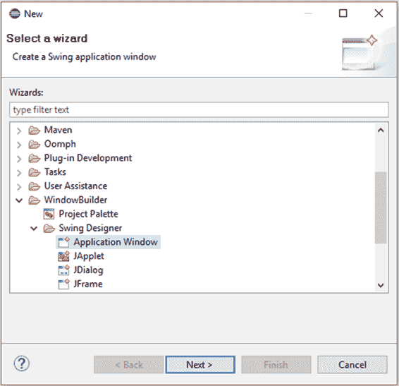

图 19:添加窗口步骤 2

选择添加新组件后，找到**窗口构建器>摇摆设计器**文件夹和**应用程序窗口**子文件夹。点击子文件夹，点击**下一步**，如图 19 所示。这将打开“新建 Swing 应用程序”窗口。您也可以从“文件”菜单中以这种方式创建一个新项目，而不是像我们之前所做的那样创建一个 Java 应用程序。

|  | 注意:存在多个窗口构建工具。如果你对 IBM 的 SWT 感兴趣，你也可以使用 SWT 框架创建窗口。这允许您向项目中添加多个窗口，并在应用程序运行时打开和关闭它们。 |

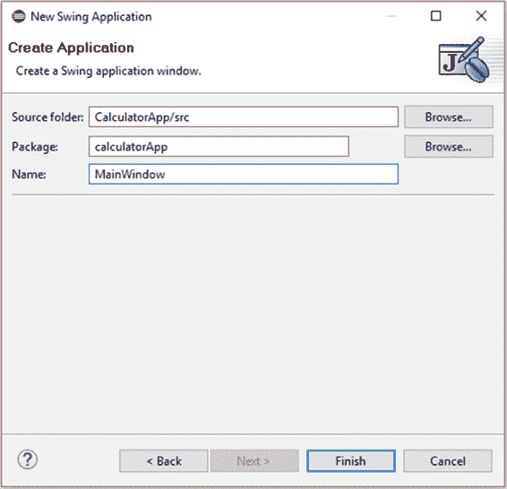

图 20:新的 Swing 应用程序窗口

在新的 Swing 应用程序窗口中，键入您的`main`类和包的名称。我用`calculatorApp`作为我的包名，用`MainWindow`作为我的`main`类名(见图 20)。给出包和项目名称后，点击**完成**。

Eclipse 将使用 WindowBuilder 工具创建一个新的空白窗口。当我们使用 Swing builder 添加一个窗口时，它会自动为我们编写一个`main`方法，该方法使用类似于上一章中使用的代码来创建和显示窗口。代码清单 7.0 是由 Swing Window Builder 生成的。我们可以按照自己喜欢的方式编辑代码，但是要小心——这是自动生成的代码，为了让 WindowBuilder 继续操作和添加新代码，必须将这些代码保持在某种程度上接近构建器喜欢的格式。一般来说，我们不会改变程序生成的代码，而是添加代码并围绕代码进行编程。

代码清单 7.0: Swing 窗口构建器生成的代码

```java
  package calculatorApp;

  import java.awt.EventQueue;

  import javax.swing.JFrame;

  public class
  MainWindow {

        private JFrame frame;

        /**
         * Launch the application.
         */
        public static void
  main(String[] args) {
              EventQueue.invokeLater(new
  Runnable() {
                    public void run() {
                          try {
                                MainWindow window = new
  MainWindow();
                                window.frame.setVisible(true);
                          } catch
  (Exception e) {
                                e.printStackTrace();
                          }
                    }
              });
        }

        /**
         * Create the application.
         */
        public MainWindow() {
              initialize();
        }

        /**
         * Initialize the contents of the frame.
         */
        private void
  initialize() {
              frame = new
  JFrame();
              frame.setBounds(100,
  100, 450, 300);
              frame.setDefaultCloseOperation(JFrame.EXIT_ON_CLOSE);
        }

  }

```

### 在设计视图中设计GUI

代码清单 7.0 中的代码只不过提供了一个`main`方法，并创建和显示了一个空白窗口。在 Eclipse 中，在主代码窗口的下方有源代码和设计选项卡。这是我们新应用程序的两个视图，而源代码视图是正常的代码窗口。选择**设计视图**选项卡，Eclipse 将使用 Swing WindowBuilder 打开窗口进行编辑(见图 21)。

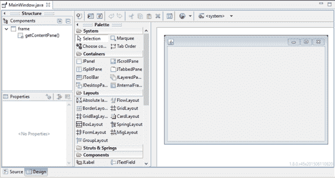

图 21:切换到设计视图

GUI设计是一个非常大的话题，也是一个自己的职业。没有严格的规则可循，但一般来说，我们应该尽量遵循常见的惯例。我们的用户熟悉日常生活中的成千上万种布局——袖珍计算器、食品标签、办公应用等。用户已经理解了这些布局，如果我们想让新用户不费吹灰之力理解我们的应用程序，我们应该遵循这些既定布局的原则。新应用程序的黄金标准是新用户能够在没有任何说明或手册的情况下使用它。这通常是不可能的，但这是一个非常好的目标标准，也是我们在设计软件时应该记住的。

尝试使用纸笔或绘图程序和手写笔绘制布局。即使是像计算器这样简单的项目，在如何布局控件方面也提供了许多选择。为GUI勾画出几种可能的布局，给它们贴上标签，问问自己为什么布局中的某些模式有效，而其他模式无效。在图 22 中，我从卡西欧 fx 系列袖珍计算器的布局中获得了灵感，这款计算器非常受欢迎，设计也很好——许多人都熟悉它的布局。我们不需要匹配精确的布局，我已经为“特殊功能”按钮提供了空间，这将允许我们的计算器的功能随着我们想到的新功能而增长。我还决定将算术函数包含在一个单独的列中，以节省空间，我还增加了 Equals 按钮的大小，因为我相信这个按钮特别重要，将比任何其他按钮使用得更频繁。

|  | 注意:我们不会对表达式解析进行编程。我们的计算器将计算一次运算的结果，它不包括圆括号的使用。如果您有兴趣编写一个能够解析和计算表达式结果的计算器，如“4+2/(9*3)”，请查阅调车场算法和反向波兰符号。调车场算法将表达式转换为反向波兰符号，并且计算反向波兰符号表达式的结果非常容易。关于调车场算法，请访问维基百科的[https://en.wikipedia.org/wiki/Shunting-yard_algorithm](https://en.wikipedia.org/wiki/Shunting-yard_algorithm)。有关反向抛光的更多信息，请访问[https://en.wikipedia.org/wiki/Reverse_Polish_notation.](https://en.wikipedia.org/wiki/Reverse_Polish_notation) |

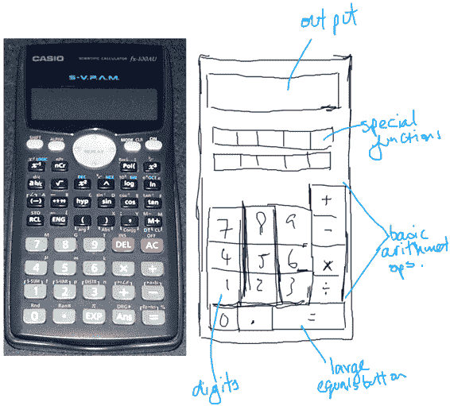

图 22:设计计算器

### 将设计转换为摇摆

下一步是查看您的GUI，并决定它在 Java 中的工作方式。请注意，我们的表单有不同的长宽比——我们希望我们的计算器比它宽高。在GUI设计器中沿边缘选择表单，您将看到黑色小方块控制点。抓住右下角的控制点并拖动表单，使其大致与您的设计相匹配(参见图 23)。

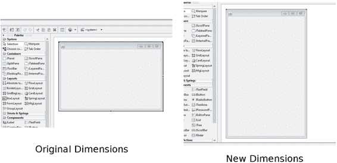

图 23:调整表单大小

我们将嵌套几个布局，并一起使用它们来提供一些灵活性。我们的计算器的主要结构将是边框布局。在面板的布局部分点击`BorderLayout`，然后在表单的某个地方点击(见图 24)。

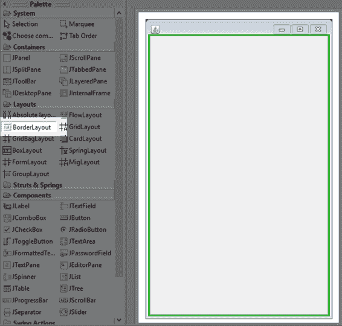

图 24:选择边框布局

接下来，在组件面板的“组件”部分单击`JTextField`控件，然后单击表单的北部区域。这将把`JTextField`添加到表单的顶部。这将是我们计算器的主要输出显示。布局管理器将自动调整`JTextField`的大小以占据窗口的宽度(图 25)。

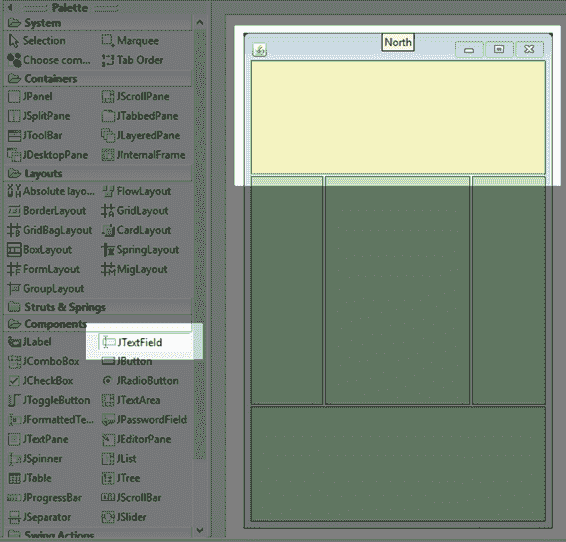 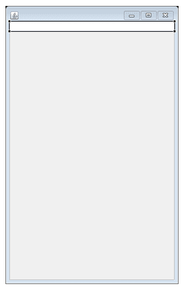

图 25:添加文本字段

当在设计器中选择控件(或窗体本身)时，“属性”窗口显示该控件的可用设置。可以通过属性框设置控件的许多方面(参见图 26)。确保选择了`txtOutput`控件，并将属性框中的变量设置更改为`txtOutput`(这是控件的名称)。使用逻辑控件名称很重要，尤其是因为项目经常涉及许多控件。

|  | 注意:我用于文本字段控件的“txt”前缀是控件类型的提示。为控件名称添加类型前缀有助于加快开发和维护速度。如果我们在代码中键入“txt”，Eclipse 的内容辅助将列出所有的文本字段——只要我们用“txt”前缀命名它们。这意味着我们不需要记住控件的确切名称，我们只需要知道它们的类型。内容辅助将帮助我们在代码中选择我们需要的控件。同样，我们可以用“btn”前缀命名按钮，用“chk”前缀命名复选框，等等。这些前缀完全是可选的，代表了一种编程风格选择。 |

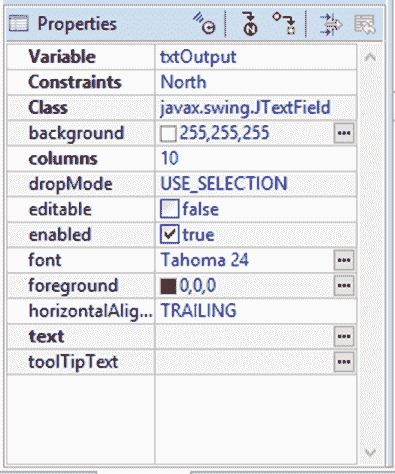

图 26:属性框

在`txtOutput`控件的属性中，取消选中可编辑框。我们不允许用户在计算器中输入表达式。选择 24 的字体大小，并将`horizontalAlignment`更改为“`TRAILING`”—这将使数字出现在文本字段的右侧(这是大多数计算器的工作方式)。`txtOutput`控件的最终属性如图 26 所示。

接下来，我们将添加一个`JPanel`，它将保存我们计算器的按钮。选择`JPanel`容器并将其添加到中心(如图 27 左侧所示)。选择一个`GridBagLayout`，点击新的`Jpanel`(如图 27 右侧)。这将在`BorderLayout`的中心部分创建一个`GridBagLayout`。`BorderLayout`的组件本身可以包含其他布局。这种技术叫做嵌套——我们将`GridBagLayout`嵌套在`BorderLayout`中。这使我们能够以复杂而灵活的方式将布局组合在一起。

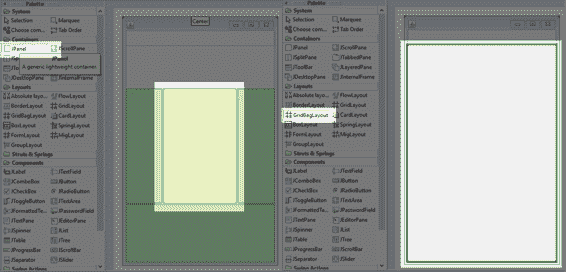

图 27:添加一个 JPanel 和 GridBagLayout

现在我们有了`GridBagLayout`，点击`JButton`控件，将鼠标悬停在布局上。您将看到一个显示`GridBagLayoutlayout`的行和列的指南，如图 27 所示。放置您的按钮以匹配图 28(如果控件的确切位置与您的计算器不同，这并不重要)。

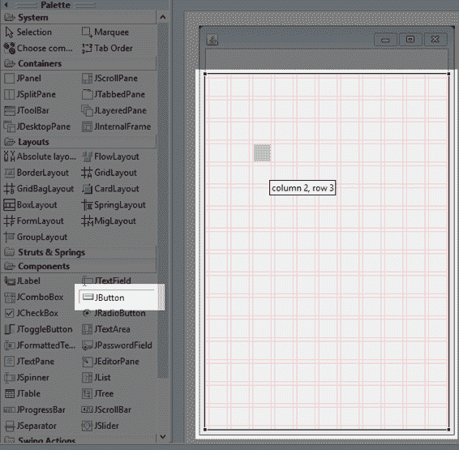

图 28: GridBagLayout 指南

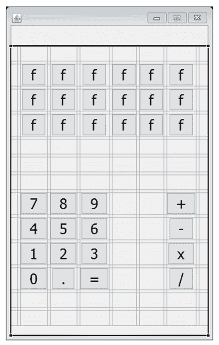

图 29:添加按钮

图 29 显示了所有按钮的位置。您可以在按钮放置时更改其文本，也可以在属性窗口中进行更改。我在图 29 中添加了 12 个标记为“f”的按钮，它们将是特殊的功能按钮，例如平方根和三角学(f 只是一个占位符)。将这些按钮的所有字体大小更改为 24。在设计器中单击控件时，按住 shift 键(控制键也有效)可以选择多个控件。一次选择所有按钮，然后将所有按钮的字体大小更改为 24，而不是一次更改一种字体。点击**等于**按钮，抓住右侧的控制点。在`GridBagLayout`中向右移动控制点两个框。这将导致按钮消耗三个水平框的空间，如图 30 所示。

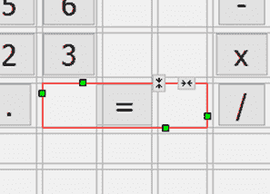

图 30:调整控件大小

“等于”按钮占据了`GridBagLayout`中相当于三个盒子的空间，但是目前空间还没有被填满。当选择一个控件时，Eclipse 顶部的工具栏中有几个布局选项。确保选择了“等于”按钮，然后单击**填充**。这将导致 Eclipse 调整控件的大小，以消耗`GridBagLayout`中三个框的所有空间(见图 31)。

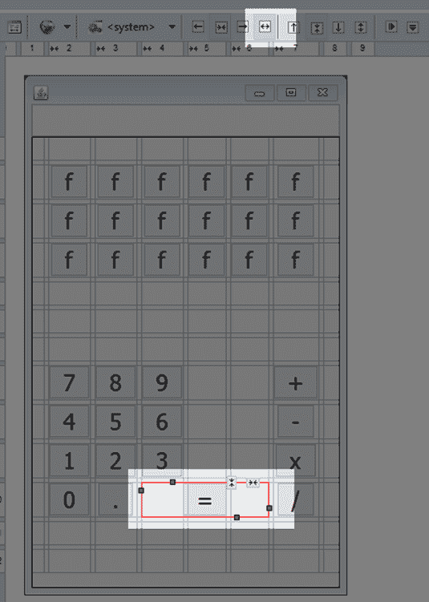 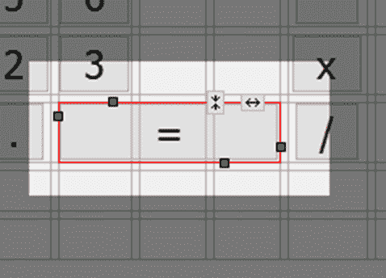

图 31:填充控件区域

#### 快速改变多个控件

我们的表单有很多按钮。为了快速选择它们，我们可以使用 Eclipse 中的组件框。在组件框中单击第一个按钮的名称，按住 shift 键，然后按住键盘上的向下箭头，直到所有按钮都被选中，如图 32 所示。

选择所有控件后，点击**填充**，就像我们使用“等于”按钮一样。这将导致我们所有的控件被调整到完全相同的大小。请注意，在我们单击“填充”之前，我们的一些控件的大小略有不同，但是默认按钮会调整大小以包围其文本(并非所有布局都是如此)，并且按钮中的文本宽度不完全相同。

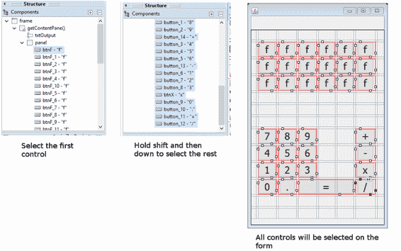

图 32:在组件窗口中选择多个控件

#### 间距控制

当我们运行程序时，我们会看到控件之间有非常小的间隙，尽管它们在设计器中看起来很像(见图 33)。我们希望在`txtOutput`控制和我们的特殊功能之间留出一小块空白，我们还希望在特殊功能按钮和数字及操作按钮之间留出一小块空白。

为了在`GridBagLayout`中包含间隙和边距，我们可以设置行和列的大小。单击系统选项板中的**选择**工具，然后单击表单上不包含任何按钮的某个地方(即选择`GridBagLayout`)。您将看到网格的列标题和行标题沿着设计器的顶部和左侧编号(参见图 34)。

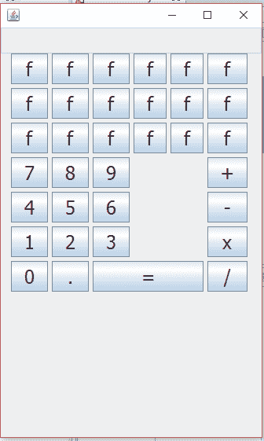

图 33:我们的无间距计算器

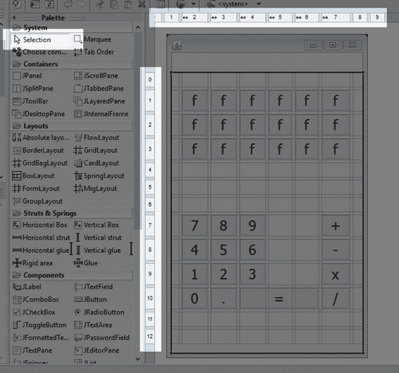

图 34: GridBagLayout 行和列标题

如果您选择了`GridBagLayout`，您可以右键单击适当的行或列，并执行一些非常有用的功能。我们可以轻松地添加新的行或列，删除现有的行或列，并更改任何现有行或列的属性。我们希望更改几行的最小大小，以便控件的间距更大。右键单击第 0 行的按钮，并从上下文菜单中选择属性(如图 35 所示)。

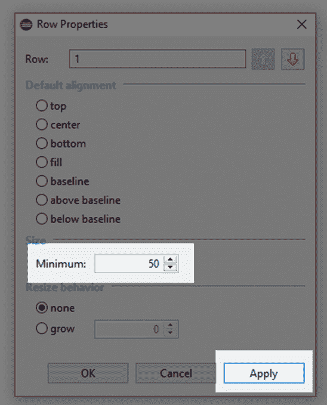 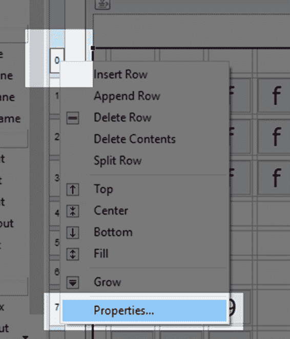

图 35:行属性

在“行属性”框中，将最小尺寸更改为 50，然后单击**应用**，如图 35 所示。这确保了`txtOutput`控件和我们的特殊功能按钮之间有 50 像素的间隙。接下来，以完全相同的方式更改第 5 行的最小间隙。这将在我们的特殊功能按钮和数字和操作按钮之间增加至少 50 像素的间隙。请注意，我们的计算器的间距在图 36 中看起来稍微好一些。

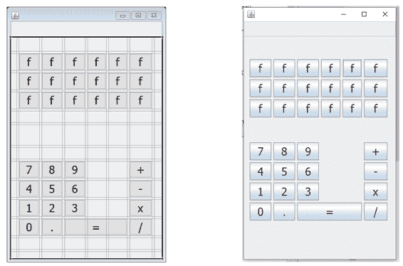

图 36:间隔控件

既然我们对控件的总体布局感到满意，我们就可以继续为计算器添加功能了。

## 添加功能

许多算术运算符采用两个操作数，如 1+4。我们将维护一个`state`变量，该变量将记录我们正在读取的数字(即算术运算符的左或右操作数)。我们还将保留一个变量，该变量指示用户最初选择了哪个操作，我们将指示计算器读取第一个数字的数字(运算符的左操作数)。我们将构建两种类型的操作——需要两个操作数的操作，如加法和减法，以及需要单个操作数的操作，如自然对数和平方根。

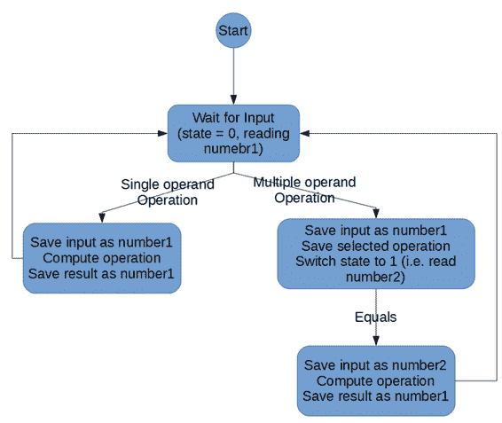

图 37:状态图

图 37 显示了一个基本状态图，描述了我们的计算器的操作流程。最初，`state`变量将被设置为 0，这对应于读取第一个操作数(在下面的代码中称为`number1`)。用户可以使用数字按钮输入一个数字，然后有两个选项——单击单操作数操作(如平方根)或单击多操作数操作(如加法)。

当用户点击单个操作数操作时，我们可以将用户点击的当前数字存储为`number1`，并使用该值计算操作结果。然后我们可以将结果存储回`number1`，输出到屏幕上，重新开始这个过程。

当用户单击双操作数操作时，操作会变得稍微复杂一些。我们将当前数字存储在`number1`变量中，记录用户点击了哪个操作(这是下面代码中的`operator`变量)，并将`state`设置为 1，这意味着程序正在读取第二个值`number2`。用户将输入一些新的数字，然后单击“等于”。当他们点击“等于”时，我们将当前数字存储在`number2`中，在`number1`和`number2`之间执行所选操作，将结果写入`txtOutput`，然后重新开始。

打开代码视图，将代码滚动到指定所有控件成员变量的位置(这些应该是类中定义的第一个成员变量)。添加四个新的`state`变量，如代码清单 7.1 所示。我没有在代码清单 7.1 中包含整个清单，但是我包含了几行来给出上下文——添加的代码用黄色突出显示。突出显示的代码周围的代码可能会有所不同，这取决于您向计算器添加控件的顺序，但这没关系。`state`变量可以添加到任何指定成员变量的地方。我还添加了一个名为`memory`的小双数组，我们将使用它来允许用户稍后存储结果。

代码清单 7.1:状态成员变量

```java
        private JButton btnF_15;
        private JButton btnF_16;
        private JButton btnF_17;

        // State variables
        private int state = 0;        // 0 to first
  number, 1 for second.
        private int operator = 0;     // 0 means unknown.
        private double number1 = 0.0; // Variable for parsing
  1st operand.
        private double number2 = 0.0; // Variable for parsing
  2nd operand.
        private double[] memory = new double[5]; // For memory functions

        /**
         * Launch the application.
         */
        public static void main(String[]
  args) {
              EventQueue.invokeLater(new
  Runnable() {
                    public void run() {
                          try {
                                MainWindow window = new
  MainWindow();
                                window.frame.setVisible(true);
                          } catch
  (Exception e) {
                                e.printStackTrace();
                          }
                    }
              });
        }

```

接下来，返回设计视图，双击 7 位数按钮。当我们双击一个按钮时，Eclipse 将自动编写一个事件处理程序来处理控件最常见的事件。在这种情况下，它将为按钮何时被单击编写一个处理程序，并将我们带到代码中的位置，在那里我们可以指定当用户单击该按钮时会发生什么。事件处理代码看起来应该很熟悉——Eclipse 使用了一个匿名类来实现`ActionListener`。同样，代码中的按钮实际上可能在代码中没有被称为“`button`”。我先加了 7 位数按钮(可以叫“`button_7`”或者你代码里的其他任何数字)，所以不要改按钮名！

代码清单 7.2:点击 7 位数字

```java
               button = new JButton("7");
               button.addActionListener(new ActionListener() {
                     public void
  actionPerformed(ActionEvent arg0) {
                           txtOutput.setText(txtOutput.getText()
  + "7");
                     }
               });

```

当用户点击一个数字按钮时，我们将该数字添加到`txtOutput`框中，如代码清单 7.2 所示。其他九个数字是相同的——除了它们加到`txtOutput`字符串中的数字。为了节省空间，我将不包括所有 10 位数字的列表，但是您可以用与数字 7 相同的方式实现所有 10 位数字。另外，小数点按钮“.”，与数字按钮相同，这意味着这也可以用相同的方式实现。如果我们正在制作一个更完整的计算器，我们将需要一个检查来确保我们输入了一个有效的数字，并且我们将需要确保最多使用一个小数点来避免 7.6.4 这样的数字。

双操作数运算符按钮需要更新当前选择的`operator`变量并重置`txtOutput`，以便用户可以输入另一个数字。在设计视图中，双击加法运算符，并添加代码清单 7.3 中以黄色突出显示的代码。

代码清单 7.3:加法代码

```java
               button_14 = new JButton("+");
               button_14.addActionListener(new ActionListener() {
                     public void
  actionPerformed(ActionEvent e) {
                           operator = 0;
                            number1 =
  Double.parseDouble(txtOutput.getText());
                           txtOutput.setText("");
                     }
               });

```

除了运算符变量应该设置为不同的值之外，其他三个算术运算符可以以相同的方式相加。我会用 0 做加法，1 做减法，2 做乘法，3 做除法。我不包括减法、乘法或除法的代码，但是你可以用与加法完全相同的方式去添加这些操作，除了你必须为`operator`变量分配整数`1`、`2`和`3`。还可以指定运算符的枚举。这将使代码更加清晰。

当用户点击“等于”按钮时，我们需要读取`number2`的数字，检查当前的`operator`，并使用我们已经读取的两个数字执行操作。然后我们将结果数字作为当前字符串存储在`txtOutput`中。代码清单 7.4 显示了“等于”按钮的代码。

代码清单 7.4:等于按钮

```java
               button_11 = new JButton("=");
               button_11.addActionListener(new ActionListener() {
                     public void
  actionPerformed(ActionEvent e) {
                            //
  Read number 2:
                            number2 =
  Double.parseDouble(txtOutput.getText());

                            //
  Result variable
                            double  result = 0.0;

                            //
  Compute the result based on the operator:
                            switch (operator) {
                            case 0:  result = number1 + number2; break;
                            case 1:  result = number1 - number2; break;
                            case 2:  result = number1 * number2; break;
                            case 3:  result = number1 / number2; break;

                            default:  result = 0.0;
  break;
                            }

                            //
  Save the result to the output.
                           txtOutput.setText("" +  result);
                     }
               });

```

|  | 提示:请注意在代码清单 7.4 中对 txtOutput.setText 的最后一次调用中使用了" "。这将导致 double 转换为字符串。如果我们试图设置 Text 或 println 并传递一个 double，比如 println(2.5)，我们的代码将无法编译。但是，加法运算符是在字符串和 double 之间定义的，它会自动将 double 转换为字符串，因此我们使用 println("+2.5 ")来打印 double，而不是 println(2.5)。 |

### 特殊功能

#### 工具提示和清除按钮

我们在计算器上包含了许多特殊的功能按钮，但我将只指定几个，并让读者设计其他按钮的功能。首先，我们需要清除输出的能力。我已经用文字“C”把右下角的特殊功能按钮做成了一个清晰的按钮，字母 C 是模棱两可的，所以我也会为这个按钮使用一个工具提示。工具提示是当用户将光标悬停在控件上时显示的消息。将按钮的文本改为 C 并添加工具提示，如图 38 所示。双击清除按钮，让 Eclipse 编写引发事件的代码。代码清单 7.5 显示了代码。

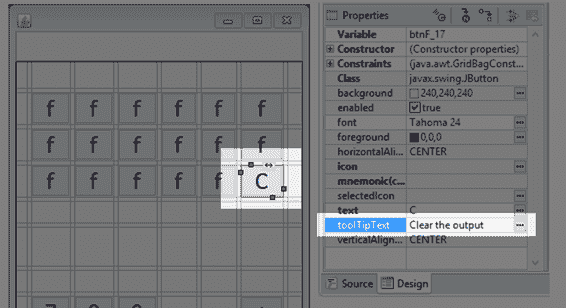

图 38:清除按钮设计

代码清单 7.5:清除按钮

```java
              btnF_17 = new
  JButton("C");
              btnF_17.addActionListener(new
  ActionListener() {
                    public void
  actionPerformed(ActionEvent arg0) {
                    txtOutput.setText("");
                    operator = -1;
                    }
              });

```

#### 三角法

三角函数对计算器非常有用。我将添加正弦、余弦和正切函数按钮作为左上角的三个按钮。在设计器中，我添加了工具提示并改变了按钮的字体大小，以便 SIN、COS 和 TAN 这些词适合我们的小按钮(见图 39)。我还单击了设计器上方的“垂直填充”按钮，以便调整按钮的大小来填充垂直区域。

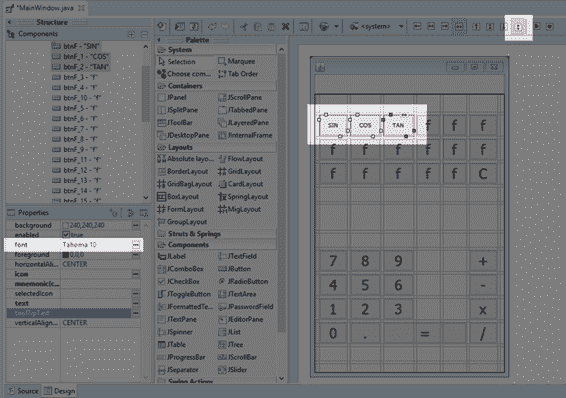

图 39:原罪、Cos 和谭设计师

代码清单 7.6:正弦函数

```java
               btnF = new JButton("SIN");
               btnF.setToolTipText("Compute the Sine
  of an angle");
               btnF.addActionListener(new ActionListener() {
                     public void
  actionPerformed(ActionEvent e) {
                     number1 =
  Double.parseDouble(txtOutput.getText());
                     number1 =
  Math.sin(number1);
                     txtOutput.setText("" + number1);
                     }
              });

```

代码清单 7.6 显示了计算角度正弦的代码。高亮显示的代码显示了实际的计算。其他触发函数类似，除了余弦我们称之为`Math.cos`和正切我们称之为`Math.tan`。请注意，计算这些三角函数只需要一个数字，这意味着我们阅读`txtOutput`的文本并计算函数，而无需等待用户输入第二个数字。

#### 将一个数升到幂

我们可以像添加原始算术运算符一样，轻松地在计算器中添加新的双操作数函数。这里有一个例子，展示了如何添加一个带有两个参数的幂函数，并将第一个参数提升为第二个参数的幂。我在设计器中使用文本“`^`”作为我的电源按钮(参见代码清单 7.7)，并在用户单击 Equals 时调用函数`Math.pow`(参见代码清单 7.8)。我已经叫了`operator`动力操作`4`。每次增加一个新的操作符，行“`operator = xxx`”必须是唯一的，所以下一个双操作数的操作符将被称为`operator 5`，然后是`6`等等。

代码清单 7.7:电源按钮

```java
              btnF = new
  JButton("SIN");
              btnF_3 = new
  JButton("^");
              btnF_3.addActionListener(new
  ActionListener() {
                    public void
  actionPerformed(ActionEvent arg0) {
                          operator = 4;      // 4 is power
                          number1 = Double.parseDouble(txtOutput.getText());
                          txtOutput.setText("");
                    }
              });

```

代码清单 7.8:带有电源操作符的“等于”按钮

```java
              button_11 = new
  JButton("=");
              button_11.addActionListener(new ActionListener()
  {
                    public void
  actionPerformed(ActionEvent e) {
                          // Read number 2:
                          number2 =
  Double.parseDouble(txtOutput.getText());
                          // Result
  variable
                          double result = 0.0;

                          // Compute the
  result based on the operator:
                          switch (operator) {
                          case 0: result = number1 + number2; break;
                          case 1: result = number1 - number2; break;
                          case 2: result = number1 * number2; break;
                          case 3: result = number1 / number2; break;

                          default: result = 0.0; break;
                          }

                    //
  Special Functions
                    if(operator == 4)result = Math.pow(number1, number2); 

                          // Save the
  result to the output
                          txtOutput.setText("" + result);
                    }
              });

```

### 记忆按钮

记忆按钮对计算器非常有用。我将添加五个名为 M1、M2、M3、M4 和 M5 的记忆按钮。它们将用于存储和调用我们之前定义的`memory`数组中的数字。

首先，当我们点击一个内存按钮时，我们需要知道用户是想存储一个值还是想调用一个值。默认情况下，我们会假设他们正在召回一个号码。我们将添加一个带有文本 STR 的 store 按钮，这样用户就可以点击 store 后跟一个 memory 按钮，并且，我们将存储当前的`txtOutput`，而不是调用该值。添加一个文字为`STR`的商店按钮和五个文字为`M1`、`M2`、`M3`、`M4`和`M5`的按钮(见图 40)。

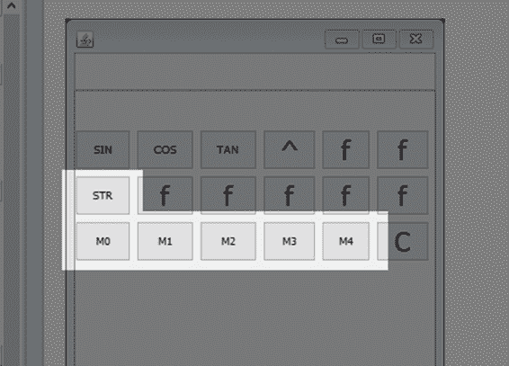

图 40:内存按钮

当用户点击`STR`功能时，我们将当前的`operator`设置为一些新的操作员代码。我们最后一个`operator`是电源，我们保存为`operator` 4，所以我在代码清单 7.9 中使用了`operator` 5 作为商店操作。我们每个记忆按钮的代码几乎相同，除了每个按钮从我们的`memory[]`数组访问不同的元素。我已经在代码清单 7.10 中包含了`M0`的代码。

代码清单 7.9:存储按钮代码

```java
              btnF_5 = new
  JButton("STR");
              btnF_5.addActionListener(new
  ActionListener() {
                    public void
  actionPerformed(ActionEvent e) {
                          operator = 5;
                          number1 = Double.parseDouble(txtOutput.getText());
                    }
              });

```

代码清单 7.10: M0 按钮代码

```java
              btnF_12 = new
  JButton("M0");
              btnF_12.addActionListener(new
  ActionListener() {
                    public void
  actionPerformed(ActionEvent e) {
                          if(operator == 5)
                                memory[0] = number1;
                          else
                                txtOutput.setText("" + memory[0]);
                    }
              });

```

在这一点上，我将停止并允许您扩展您认为合适的功能。在本章中，我们已经了解了如何在 Eclipse 中使用窗口设计器工具实现一个简单的界面。我们简陋的计算器相当简单，但是这些GUI设计工具的功能和灵活性几乎是无限的。您可以为反正弦、对数和许多其他有用的操作添加按钮。我们主要研究了按钮和文本，但还有许多其他有趣的控件可用，如果您不熟悉GUI设计或 windows builder 工具，我鼓励您更深入地探索工具选项板，以便找到最适合您的应用程序的控件。

|  | 注意:已经开发了许多技术来编写和维护大型项目。其中一个特别感兴趣的是 MVVM，它代表模型-视图-视图-模型。使用 MVVM 作为设计原则，我们有意将程序的所有功能从生成GUI的代码中分离出来。这有助于保持功能和GUI之间的明确区别，并且有助于大规模项目的可伸缩性和可维护性。我们的计算器足够小，MVVM 的设计原则不会有什么影响，但这个话题值得一读。如果你有兴趣开发更大规模的 GUI 项目，请访问[本页](https://en.wikipedia.org/wiki/Model%E2%80%93view%E2%80%93viewmodel)。 |

在这本电子书的剩余部分，我们将把注意力转向一种完全不同类型的编程——二维图形和游戏编程。