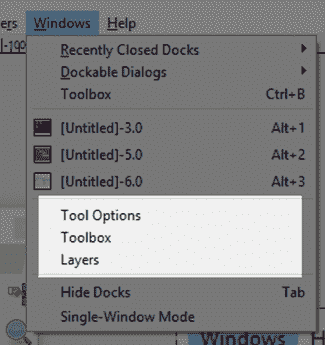

# 第八章二维游戏编程

Java 常用于二维游戏编程。在本节中，我们将了解使用 Java 创建二维游戏的基础知识。游戏编程是一个极其广泛和复杂的话题，所以我们在这里只讨论它的一些关键概念。练习是关键——你应该带着这最后一章一起跑，创建一个平台或一个无尽的跑步者，探索三维游戏开发和物理引擎。

在本章中，我将使用更大的代码清单，但我将只提供相对较少的解释。任何程序员都可以开发的最好的技能之一是阅读其他程序员的代码，看看他们哪里错了(或者可以改进)。我鼓励所有对编程不熟悉的人在互联网上搜索有用的技术。当你发现一个有用的技术或代码片段时，确保原作者允许你在你自己的项目中使用它，并且总是记录你从哪里得到代码——这样，如果你曾经在生产编程中使用代码，你就可以信任原作者。请随意将本电子书中的任何代码用于您喜欢的任何目的！

## 主班

有很多方法可以为二维游戏编程打下基础。我们希望我们的代码是可维护的、易于理解的，并且能够快速实现新的特性。编程的难点在于不学习语法——有经验的程序员可以相对容易地学习一门新语言的语法。困难在于采用这样一种结构，即当项目规模增加时，我们的项目保持稳定。我们将创建一个基本的`MainClass`，它只不过是运行另一个类的一个实例——游戏的引擎，它将被称为`Engine2D`。该引擎将以简单的渲染/更新循环运行，我们将使用 Java 的计时工具和事件处理程序来创建实时的假象并响应键盘。

接下来，您应该创建一个新项目。我已经调用了我的项目`Graphics2D`。添加一个`MainClass`，就像我们之前做的一样。`MainClass`除了运行一个引擎类的实例外，什么也做不了。`MainClass`的代码在代码清单 8.0 中给出(请注意，这段代码此时不会运行，因为我们还没有构建`Engine2D`类！).

代码清单 8.0: MainClass

```java
  import java.awt.EventQueue;
  import javax.swing.JFrame;

  public class MainClass
  extends JFrame {
        public static void
  main(String[] args) {
              EventQueue.invokeLater(new
  Runnable() {
                    @Override
                    public void run() {
                          MainClass m = new MainClass(640, 480);
                    }
              });
        }

        private MainClass(int windowWidth, int windowHeight) {
              setSize(windowWidth, windowHeight); // Set
  window size
              setLocationRelativeTo(null); //
  Default location
              setDefaultCloseOperation(JFrame.EXIT_ON_CLOSE); //
  Exit on close
              setVisible(true);
              // Create and add the engine
  JPanel.
              final
  Engine2D engine = new
  Engine2D(windowWidth, windowHeight, 30);
              add(engine);
        }
  }

```

我们的`MainClass`扩展了`JFrame`并将作为应用程序窗口。`MainClass`包含一个`main`方法，该方法创建一个名为`m`的新的`MainClass`实例，并使用一个新的线程使用`EventQueue.invokeLater`方法执行该实例。这意味着我们的游戏将有自己的线程和事件队列。`MainClass`的构造函数接受`windowWidth`和`windowHeight`参数，它们将是我们窗口的大小。设置窗口后，`MainClass`构造器创建一个本质上是自定义的`JPanel`对象的`Engine2D`实例，并使用`add`方法将面板添加到框架的控件中。

### 二维游戏引擎骨架

接下来，我们将实现一个名为`Engine2D`的新类。这个班级代表了我们游戏的主要骨干。它将在我们的应用程序中处理更新和渲染。为了渲染二维图形，我们需要一个控件来渲染，所以`Engine2D`类扩展了`JPanel`。代码清单 8.1 显示了新的`Engine2D`类的空白骨架。

代码清单 8.1: Engine2D 骨架

```java
  import java.awt.Color;
  import java.awt.Graphics;
  import java.awt.Graphics2D;
  import java.awt.event.ActionEvent;
  import java.awt.event.ActionListener;
  import javax.swing.JPanel;
  import javax.swing.Timer;

  public class
  Engine2D extends JPanel implements
  ActionListener {
        // Width and height of the window.
        private int width, height;

        // Constructor
        public Engine2D(int windowWidth, int windowHeight, int fps) {
              width = windowWidth;
              height = windowHeight;
              Timer timer = new
  Timer(1000/fps, this);
              timer.start();
        }

        // This event is called when the timer
  fires at the specified fps.
        public void
  actionPerformed(ActionEvent e) {
              update(0.0, 0.0);
              repaint();
        }

        // 
        public void
  paintComponent(Graphics g) {
              super.paintComponent(g);
              render((Graphics2D) g);
        }

        private void update(double timeTotal, double timeDelta) {
        }

        private void
  render(Graphics2D g) {
              // Clear the screen to blue.
              g.setBackground(Color.DARK_GRAY);
              g.clearRect(0, 0, width, height);
        }
  }

```

实现游戏引擎最简单和最常见的方法之一是使用更新/渲染实时游戏循环。我们用一个`timer`反复调用两个方法——`update`和`render`。我们为游戏的每一帧调用一次方法。方法调用可以在`actionPerformed`方法的代码清单 8.1 中看到。首先，我们称之为`update`方法，在这个方法中，我们将计算游戏世界中所有物体的位置和逻辑。接下来，我们调用`render`方法，在该方法中，我们渲染我们的对象的图形版本，以便用户在玩的时候有东西可以看(见图 41)。


图 41:实时游戏循环

为了使用实时游戏循环，我们希望我们的`update`和`render`方法在某个特定的时间间隔内被重复调用。该时间间隔称为每秒帧数(FPS)。更高的帧速率(60 或 100 FPS)看起来会更平滑，但会消耗更多的功率。如果帧速率太高，当处理器落后并跳过帧时，动画可能会变得不稳定。较低的帧速率(12 或 16 FPS)看起来不太平滑，但功耗较低。处理器很有可能在不跳过帧的情况下呈现较低的帧速率。我们的`Engine2D`构造器的参数之一是帧速率。对于这个值，我使用了 30 FPS，它应该看起来相对平滑，并且应该在不消耗便携式设备太多电力的情况下运行(从而为我们游戏的玩家节省一些电池)。

我们采用了`timer`每帧调用一次`actionPerformed`方法，并且实现了`ActionListener`类。如果我们在`update`方法中执行太多的计算，或者如果我们试图在`render`方法中渲染太多的精灵，我们可能不会达到期望的帧速率。每次`timer`滴答，都会调用`actionPerformed`方法，调用`update`，然后是`paintComponent`(调用`super.paintcomponent`刷新窗口)和`render`。

|  | 注意:仅帧速率并不能使动画看起来流畅。即使在非常高的帧速率下，动画对象对人眼来说也不会显得平滑。创建平滑动画的真正关键是使用一种称为运动模糊的技术。这个话题不在本电子书的讨论范围之内，但是你应该访问[http://www.testufo.com/](http://www.testufo.com/#test=eyetracking)页面，了解一些关于运动模糊如何工作以及正确实现时动画效果的精彩示例。 |

目前，更新方法有两个参数`timeTotal`和`timeDelta`，这两个参数不起作用。而`render`方法只是将屏幕转到`DARK_GRAY`。添加`Engine2D`类后，您应该能够测试您的应用程序。如果您没有看到深灰色屏幕，如图 42 所示，则说明出现了问题。


图 42:清除屏幕

### Sprite 工作表类

当我们制作动画时，我们经常快速连续地绘制彼此略有不同的对象图像。例如，玩家行走的动画可能由八帧组成，每一帧与最后一帧略有不同。我们可以将动画的每个图像存储在一个单独的图像文件中，但是将动画的所有图像存储在一个文件中通常更方便。这种图像文件被称为精灵表或精灵地图集。

图像格式有很多种——BMP、PNG、JPG、TIFF 等。每种格式都是为特定目的而设计的。PNG 是精灵的首选格式，因为它是压缩的，通常比位图小，并且允许 alpha 透明度。而且，与 JPG(也是压缩的)不同，用于 PNG 图像的压缩是无损的，这意味着我们会保留在帧中绘制的每个像素的精确值。

代码清单 8.2:精灵表类

```java
  import java.awt.Graphics2D;
  import java.awt.image.BufferedImage;
  import java.io.File;
  import java.io.IOException;
  import javax.imageio.ImageIO;

  public class
  SpriteSheet {

        private BufferedImage bmp; // The
  loaded image.
        private int spritesAcross = -1;//
  Number of sprites across the image.
        private int totalSprites; //
  Total sprites in the image.
        private int spriteWidth, spriteHeight;//
  width/height of each sprite.

        // Constructor
        public SpriteSheet(String
  filename,int spriteWidth,int spriteHeight) {
              // Load the bitmap.
              try {
                    bmp =
  ImageIO.read(new File(filename));
              }
              catch(IOException
  e) {
                    // File not found.
                    spritesAcross = -1;
                    return;
              }
              // Save the sprite width and
  height.
              this.spriteWidth = spriteWidth;
              this.spriteHeight = spriteHeight;
              // spritesAcross is used to
  compute the
              // source rectangles when
  rendering.
              spritesAcross = bmp.getWidth()
  / this.spriteWidth;
              // totalSprites is used to ensure
  we're not
              // trying to render sprites
  that do not exist.
              totalSprites = spritesAcross * (bmp.getHeight()
  / spriteHeight);
        }

        // This method can be used to test if the
  sprites loaded.
        public Boolean isValid()
  {
              return spritesAcross != -1;
        }

        public void
  render(Graphics2D g, int spriteIndex, int x, int y) {
              // Make sure the sprite is
  actually on our spriteSheet.
              if(spriteIndex >= totalSprites) return;
              // Compute the source x and y.
              int srcX = (spriteIndex % spritesAcross) * spriteWidth;
              int srcY = (spriteIndex / spritesAcross) * spriteHeight;
              // Draw the image.
              g.drawImage(bmp,
                          x, //
  Destination x1
                          y, //
  Destination y1
                          x + spriteWidth, //
  Destination x2
                          y + spriteHeight, //
  Destination y2 
                          srcX, //
  Source x1
                          srcY, //
  Source y1
                          srcX + spriteWidth, //
  Source x2
                          srcY + spriteHeight,//
  Source y2
                          null); //
  Observer
        }
  }

```

代码清单 8.2 展示了一个简单的 sprite 工作表类。成员变量是一个缓冲映像(这只是一种将从磁盘加载的映像存储在内存中以便快速访问的方法)和几个简单的记录— `spriteWidth` / `spriteHeight`、`totalSprites`和`spritesAcross`。该类在构造函数中取一个文件名，并为子画面取一个宽度和高度。该文件可以是任何标准的二维图像格式，但我们将使用 PNG。

### GNU 图像处理程序(Gimp)

我使用 Gimp(一个非常强大的绘图和照片处理程序，可从 [`https://www.gimp.org/`](https://www.gimp.org/) 免费获得)为我们的精灵表的测试应用程序创建了图像。图 43 中的精灵展示了一艘宇宙飞船、一只长相丑陋的太空动物、一颗子弹、一堵绿色的墙、一些星星和一次小爆炸。

|  | 注意:我在本文中使用 Gimp 来创建我的精灵，因为它很流行，跨平台，并且功能强大。读者可能想要探索的许多其他应用程序也是可用的。Piskel 是一个在线精灵创建工具，可从[http://www.piskelapp.com/](http://www.piskelapp.com/)获得。雪碧是一款优秀的小桌面雪碧编辑器，可从[http://www.aseprite.org/](http://www.aseprite.org/)获得。Spriter by BrashMonkey 是一个优秀的 sprite 编辑器，免费和付费版本都可以从[https://brashmonkey.com/](https://brashmonkey.com/)获得。 |


图 43:精灵

|  | 提示:当我们在 Gimp(或其他图像编辑器)中绘制图像时，我们不想失去任何精度——我们想指定每个像素的确切颜色。因此，我建议您在处理图像时，将其保存为 Gimp 的专用格式(包括图层、像素颜色、遮罩、路径等的额外信息)。).当我们在游戏中使用图像时，我们将其导出为 PNG 图像(PNG 没有多个层、路径等)。—它只包含像素颜色数据)。这样，如果您需要进一步编辑图像，Gimp 中可用的分层和选择信息将被保留，并且您将在最终导出的图像中拥有 PNG 的所有灵活性。 |

右键单击图 43，单击**复制**，然后将图像作为新图像粘贴到 Gimp 中(根据您使用的 PDF 阅读器，此操作的细节可能略有不同)。打开 Gimp(或您选择的其他图像编辑器)，在**下选择**新图像**粘贴为**，如图 44 所示。


图 44:粘贴为新图像

复制和粘贴的图像看起来应该类似于图 43 中的图片，除了图像在精灵周围会有黑色，在那里它们应该是透明的(见图 45)。


图 45:黑色背景的精灵

为了将背景变回透明，我们需要在 Gimp 中打开几个窗口。从菜单中选择**窗口**项，打开**工具箱**、**工具选项**和**图层**窗口，如图 46 所示。



图 46: Gimp 窗口

接下来，我们将在图像中添加一个 Alpha 通道。右键单击图层框中的图层，从上下文菜单中选择**添加 Alpha 通道**(图 47)。阿尔法通道用于透明——我们希望动画帧之外的像素是透明的，这样每个精灵周围就不会有白盒或黑盒。


图 47:添加阿尔法通道

接下来，选择整个黑色区域，以便从粘贴的图像中移除黑盒。有几种方法可以做到这一点，我将使用按颜色选择工具，如图 48 所示。


图 48:按颜色选择

当您按颜色选择时，“工具选项”窗口会更新，以包含用于控制如何执行选择的控件。在工具选项框中关闭抗锯齿和羽化边缘，如图 48 所示。抗锯齿和羽化边缘通过向选择添加稍微透明的边缘来帮助选择看起来更平滑，我们不希望这样。确保阈值为 0，这样我们就可以选择所有的黑色区域，而不会意外地选择非黑色但较暗的区域。设置好“按颜色选择”工具后，单击精灵黑色区域的某处。“按颜色选择”工具将选择所有匹配的黑色像素。按下键盘上的删除键，删除黑色像素——这样做会用透明像素(alpha 值为 0 的像素)替换它们，如图 49 所示。


图 49:删除黑色像素

接下来，通过选择**文件** > **【导出为…** 并键入名称“spaceracer.png”，将您的图像导出到桌面(或其他容易访问的地方)。

### 包括一个 Java 中的图像

我们希望在我们的 Java 应用程序中包含这个导出的 PNG 子画面。回到 Eclipse，在包浏览器中右键单击您的项目，选择**新建** > **文件夹**，如图 50 所示。


图 50:添加新文件夹

确保选择了正确的父文件夹(在我这里是`Graphics2D`)，命名文件夹`graphics`，点击**完成**，如图 51 所示。


图 51:新文件夹

Eclipse 将在您的项目中创建一个新文件夹。将我们之前导出的`spacerace.png`文件复制到这个文件夹中，这样我们就可以在应用程序运行时打开它。为了将文件复制到项目的文件夹中，我们需要在系统资源管理器中打开该文件夹(这只是普通的 Windows 文件资源管理器)。我们可以使用系统资源管理器找到该文件夹，但是 Eclipse 提供了一种快速打开项目文件夹的方法。如图 52 所示，右键单击包资源管理器中的文件夹，选择**显示在** > **系统资源管理器**。


图 52:在系统资源管理器中显示

在你的桌面上找到`spaceracer.png`文件(或者添加透明度后你导出它的地方)。将该文件复制粘贴到系统资源管理器中项目的`graphics`文件夹中，如图 53 所示。关闭窗口系统资源管理器中的窗口并返回到 Eclipse。


图 53:系统资源管理器中的图形文件夹

我们的 PNG 图像现在包含在`graphics`文件夹中，但是目前 Eclipse 还不知道。右键单击包浏览器中的`graphics`文件夹，选择**刷新**，如图 54 所示。这将导致 Eclipse 在我们的应用程序的文件夹中包含它找到的任何文件。每次更新精灵或在应用程序的文件夹中添加文件时，都应该在 Eclipse 中刷新文件夹。


图 54:刷新图形文件夹

### 加载和渲染子画面

代码清单 8.3 显示了在我们的`Engine2D`构造函数中加载我们的精灵作为`SpriteSheet`实例的代码。如果你复制粘贴这个代码的话要小心——我只包含了`Engine2D`的重要代码行，所以这不是整个`Engine2D`类。

代码清单 8.3:加载 spacerager.png

```java
        // Width and height of the window.
        private int width, height;

        private SpriteSheet sprites;

        // Constructor
        public Engine2D(int windowWidth, int windowHeight, int fps) {
        width = windowWidth;
        height = windowHeight;

        // Load the sprites:
        sprites = new SpriteSheet("graphics/spaceracer.png", 16, 16);

        // Start the render/update loop.
        Timer timer = new
  Timer(1000/fps, this);
        timer.start();
        }

```

请注意，子画面宽度和高度的参数是 16，这是因为 spaceracer.png 图像被绘制成使每个单独的帧适合 16×16 像素的框。当我们渲染我们的精灵表时，我们可以选择只渲染它的一部分(稍后我们会看到)。如果您的子画面表上有不同大小的子画面，您需要知道每个子画面的开始和结束位置(根据 x 和 y 坐标)，以便正确呈现子画面表的各个部分。因为所有的精灵都是相同的大小，我们可以执行一个简单的计算来正确地渲染图像的期望部分。这是一种非常快速的方法，当所有的精灵大小完全相同，并且在 PNG 文件的网格上有适当的间距时，就可以包含精灵表。当我们加载了我们的`SpriteSheet`对象后，我们可以在我们的`Engine2D`渲染方法中渲染一个测试精灵，以确保一切顺利运行，如代码清单 8.4 所示。

代码清单 8.4:呈现测试精灵

```java
        // Temporary test,
  delete this line after making
        // sure the program
  animates:
        static int x = 0;

        private void
  render(Graphics2D g) {
              // Clear the screen to blue
              g.setBackground(Color.DARK_GRAY);
              g.clearRect(0, 0, width, height);

              // Temporary
  test:
              sprites.render(g, x % 2, x, 0);
              x++;
        }

```

在代码清单 8.4 中，我包含了一个`x`成员变量，并在更新方法中每帧递增一次。在渲染方法中，我已经在位置`x`渲染了精灵编号“`x%2`”。这将导致我们的精灵表的前两帧被绘制，以便它们从左到右在屏幕上缓慢移动，如图 55 所示。


图 55:小型宇宙飞船(裁剪)

#### 缩放精灵

我们的宇宙飞船很小。作为一种风格选择，我们可能希望我们的精灵看起来更大，更像素化，类似于 20 世纪 90 年代的游戏。精灵会很容易被玩家看到，我们的游戏会有复古的美感。我们可以通过在`SpriteSheet.render`方法中乘以目的地的坐标来缩放我们的精灵。当您在实现代码清单 8.5 中的更改后运行测试应用程序时，您应该会看到一个更大的宇宙飞船。

代码清单 8.5:缩放精灵

```java
        public void
  render(Graphics2D g, int spriteIndex, int x, int y) {
              // Make sure the sprite is
  actually on our spriteSheet.
              if(spriteIndex >= totalSprites) return;
              // Compute the source x and y.
              int srcX = (spriteIndex % spritesAcross) * spriteWidth;
              int srcY = (spriteIndex / spritesAcross) * spriteHeight;
              // Draw the image
              g.drawImage(bmp,
              x*2, //
  Destination x1
              y*2, //
  Destination y1
              (x + spriteWidth)*2, // Destination x2
              (y + spriteHeight)*2, // Destination y2 
              srcX, //
  Source x1
              srcY, //
  Source y1
              srcX + spriteWidth, //
  Source x2
              srcY + spriteHeight,//
  Source y2
              null); //
  Observer
              }

```

### 定时和跳帧

许多计算设备可能会运行我们的游戏和应用程序。每个设备都由不同的硬件组成，每个硬件都有特定的性能——有些设备比其他设备更快。为了使我们的游戏以平稳、一致的速度运行，我们需要移动我们的精灵，使它们看起来以相同的速度移动，而不管硬件如何。我们可以通过使用一种叫做跳帧的技术来做到这一点。

速度快的计算机可能能够在短时间内渲染四帧，速度较慢的计算机可能只能在相同的时间内渲染两帧。然而，不管帧数多少，我们的物体必须移动相同的距离。更快的计算机可能会更流畅地渲染帧，但游戏必须以相同的速度运行。实现这种效果的一种方法是根据自上次调用更新以来经过的时间来缩放对象的移动。我们将包含一个名为`HPTimer`(高精度计时器的缩写)的新类，它准确地记录了经过的时间，这样我们就可以在调用更新方法时使用它。创建`HPTimer`类，并在代码清单 8.6 中添加代码。

代码清单 8.6: HPTimer 类

```java
  public class HPTimer
  {
        // Member variables
        long startTime, lastTime, currentTime;

        // Set the start, last and current times
  to now:
        public void reset()
  {
              startTime = System.currentTimeMillis();

              // You can also use nano
  time:
              //startTime = System.nanoTime();

              lastTime = startTime;
              currentTime = startTime;
        }

        // Reset the timer.
        public void start()
  {
              reset();
        }

        // Record the current time.
        public void
  update() {
              lastTime = currentTime;
              currentTime =
  System.currentTimeMillis();

              // If using nano time:
              //currentTime = System.nanoTime();
        }

        // Return the time since the last call to
  update.
        public double
  timeDelta() {
              double d = (double) currentTime - (double) lastTime;
              d /= 1000.0;      

              // If using nano time:
              // d /= 1000000000.0;
              return d;
        }

        // Return the time since the last call to
  reset.
        public double
  timeTotal() {
              double d = (double) currentTime - (double) startTime;
              d /= 1000.0;

              // If using nano time:
              //d /= 1000000000.0;
              return d;
        }
  }

```

代码清单 8.6 显示了定时器类的代码。随着我们应用程序的发展，如果您发现计时器不够精确，您可能想尝试取消“纳米时间”行的注释，以便使用`System.nanoTime`而不是读取毫秒。每次调用 update 方法时，该类只读取以毫秒为单位的时间，并提供`timeTotal`和`timeDelta`方法，这些方法返回自计时器启动以来经过的总时间，以及自上次调用 update 以来经过的时间。向`Engine2D`类添加一个`HPTimer`实例。在代码清单 8.7 中，我调用了我的实例`hpTimer`。

代码清单 8.7:创建一个 HPTimer

```java
        private SpriteSheet sprites;

        private HPTimer hpTimer;

        // Constructor
        public Engine2D(int windowWidth, int windowHeight, int fps) {
              width = windowWidth;
              height = windowHeight;
              // Load the sprites.
              sprites = new
  SpriteSheet("graphics/spaceracer.png", 16, 16);

              // Start the
  HPTimer.
              hpTimer = new HPTimer();
              hpTimer.start();

              // Start the
  render/update loop.
              Timer timer = new Timer(1000/fps, this);
              timer.start();
        }

```

在`actionPerformed`方法中，我们希望通过调用`hpTimer.update()`将`timeTotal`和`timeDelta`参数传递给我们的`update`函数，以确保`hpTimer`读取了最新的时间，然后我们将总时间和增量时间传递给`Engine2D.update`方法函数，如代码清单 8.8 所示。

代码清单 8.8:更新计时器和传递时间

```java
        // This event is called when the timer
  fires at the specified fps.
        public void
  actionPerformed(ActionEvent e) {
              // Read the most
  up-to-date time:
              hpTimer.update();

              // Pass
  HPTimer's times to our update method:
              update(hpTimer.timeTotal(), hpTimer.timeDelta());

              repaint();
        }

```

我们现在可以再次渲染我们的飞船，但是这次我们将按`timeDelta`来缩放飞船的运动。代码清单 8.9 显示了修改后的测试代码。这一次当我们运行应用程序时，飞船将以每秒一个像素的速度移动。我们应该注意到硬件的能力在这里并不重要。如果一台非常慢的计算机运行这个应用程序，飞船到达屏幕右边缘所需的时间将与一台非常强大的计算机完全相同——即使慢速计算机只能渲染三帧，飞船的速度也将完全相同。一般来说，在创建动画时，我们总是希望按`timeDelta`进行缩放(这是自上次调用更新以来经过的时间)。

代码清单 8.9:非常慢的飞船

```java
        // Temporary test, delete this line after
  making
        // sure the program animates:
        static double x = 0;

        private void
  render(Graphics2D g) {
              // Clear the screen to blue.
              g.setBackground(Color.DARK_GRAY);
              g.clearRect(0, 0, width, height);

              // Temporary test:
              sprites.render(g, (int)x % 2, (int)x, 0);
              x+=hpTimer.timeDelta();
        }

```

## 动画类

我们游戏中的许多对象将通过重复的动画来渲染。这些动画将由我们的精灵表中的连续帧组成，比如前两帧，它代表了船。动画有特定的帧时间和开始时间。代码清单 68 显示了`Animation`类的代码。

代码清单 8.10:动画类

```java
  public class Animation
  {
        private double speed, startTime;
        private int firstFrame, frameCount;
        private int currentFrame;
        private boolean isComplete = false;
        private boolean looping;

        // Constructor for looping/multiframe
  animation.
        public Animation(double speed, double startTime, int firstFrame,
                    int frameCount, boolean looping) {
              this.speed = speed;
              this.startTime = startTime;
              this.firstFrame = firstFrame;
              this.frameCount = frameCount;

              // Reset
              currentFrame = firstFrame;
              isComplete = false;
              this.looping = looping;
        }

        // Constructor for single-frame animation.
        public Animation(int frame) {
              speed = 1.0;
              startTime = 0.0;
              firstFrame = frame;
              frameCount = 1;
              // Reset
              currentFrame = firstFrame;
              isComplete = false;
              this.looping = true;
        }

        // Compute the current frame and the
        // isComplete boolean.
        public void update(double timeTotal) {
              double elapsedTime = timeTotal - startTime;
              currentFrame = (int)(elapsedTime / speed);

              if(currentFrame < 0)
  currentFrame = 0;

              // If the frame is past the end of
  the animation,
              // set it to the last frame.
              if(currentFrame >= frameCount) {
                    // If the
  animation does not loop, set it to the final
                    // frame
  indefinitely.
                    if(!looping)
                          currentFrame = firstFrame + frameCount - 1;
                    // If the
  animation is looping,
                    // set it back to
  the first frame.
                    else {
                          currentFrame = firstFrame;
                          startTime = timeTotal;
                    }

                    isComplete = true;
              }

              // Otherwise, the current frame is
  the first frame +
              // however many frames we've
  played so far:
              else
                    currentFrame += firstFrame;
        }

        // Returns the current frame.
        public int
  getCurrentFrame() {
              return currentFrame;
        }

        // Determines if the animation has played
  all frames.
        public boolean
  getIsComplete() {
              return isComplete;
        }
  }

```

## 游戏对象

我们的游戏将由许多对象组成——玩家、滚动的星星和外星坏蛋。这些对象具有共同的特征，例如 x 和 y 位置、更新/渲染能力以及动画。我们将创建一个名为`GameObject`的父类，我们将从它继承来创建我们游戏中的特定对象类型。代码清单 8.11 显示了`GameObject`类。

代码清单 8.11:游戏对象类

```java
  import java.awt.Graphics2D;
  public abstract class
  GameObject {
        // Position
        public double x, y;

        // Is the object visible?
        private boolean visible = true;

        // The object's animation
        private Animation animation = null;

        // Update and Render
        public void update(double timeTotal, double timeDelta) {
              if(animation != null)
                    animation.update(timeTotal);
        }

        // Render the animation with the current
  frame if it exists and
        // is visible.
        public void
  render(Graphics2D graphics, SpriteSheet sprites) {
              if(visible
  && animation != null) 
              sprites.render(graphics, animation.getCurrentFrame(),
                          (int)x, (int)y);
        }

        // Getters and setters
        public double getX()
  {
        return x;
        }

        public double getY()
  {
        return y;
        }

        public boolean
  getVisible() {
              return visible;
        }

        public void
  setVisible(boolean visible) {
              this.visible = visible;
        }

        public Animation
  getAnimation() {
              return animation;
        }

        public void
  setAnimation(Animation animation) {
              this.animation = animation;
        }

        // Location tests:
        // Test if the object is outside the
  screen to the left.
        public boolean isOffScreenLeft()
  {
        return x <
  -16;
        }
        // Test if the object is outside the
  screen to the right.
        public boolean
  isOffScreenRight() {
        return x >=
  320;
        }
        // Test if the object is outside the
  screen at the top.
        public boolean
  isOffScreenTop() {
        return y <
  -16;
        }
        // Test is the object is outside the
  screen at the bottom.
        public boolean
  isOffScreenBottom() {
        return y >=
  240;
        }

        // Compute the distance between the
  objects.
        public double
  getDistance(GameObject o) {
              // Faster, but less accurate detection:
              // return Math.abs(o.x - x) +
  Math.abs(o.y - y); 

              // More accurate, but slow
  version:
              return Math.sqrt((o.x - x) * (o.x - x) + 
                    (o.y - y) * (o.y - y)); 
        }

  }

```

注意`GameObject`类是抽象的。我们不会直接创建`GameObject`的实例，但是我们希望封装游戏中每个对象相同的所有元素，这样我们就不需要为每个对象类型重新编程。除了减少我们对每个子类的编码，我们将能够在一个单一的`ArrayList`中存储我们游戏的所有对象，并且非常简单地调用所有对象的`update` / `render`方法。这是多态性在起作用的一个例子。

### 明星

在这一部分，我们将创建一个滚动的星星背景。星星将继承`GameObject`类，并在其更新方法中调用`super.update`。给你的应用程序添加一个名为`Star`的新类。代码清单 8.12 中列出了这个类的代码。需要记住的最重要的一点是，我们的`GameObject`父类更新对象的当前动画，这意味着我们应该确保在所有子类的`update`方法中调用`super.update`，否则在子类中处理动画更新。

代码清单 8.12:滚动星形类

```java
  import java.awt.Graphics2D;

  public class Star extends
  GameObject {
        double speed;

        public Star() {
              // Begin the stars in a random
  location:
              x = Math.random()
  * 320.0;
              y = Math.random()
  * 240.0;

              // Set the stars to a random
  speed:
              speed = Math.random()
  * 30.0 + 30;
        }

        public void update(double timeTotal, double timeDelta) {
              // Call the parent update.
              super.update(timeTotal, timeDelta);

              // Move the star left.
              x -= speed * timeDelta; 

              // Reset the star on the right
  when it goes off screen.
              if(isOffScreenLeft())
  {
                    x =
  320.0; // Just outside the right-hand edge
                    y = Math.random()
  * 240.0 - 16; // Random Y location
              }
        }
  }

```

接下来，在`Engine2D`类中添加一个`ArrayList`来保存我们的`GameObject`对象，并在构造函数中创建 100 颗星(参见代码清单 3.13)。您还需要在`Engine2D`课程开始时为`ArrayList`集合—“`import java.util.ArrayList;`”添加一个导入。

代码清单 8.13:创建游戏对象

```java
        // The GameObjects
  array list:
        ArrayList<GameObject>
  gameObjects
  = new
  ArrayList<GameObject>();

        // Constructor
        public Engine2D(int windowWidth, int windowHeight, int fps) {
              width = windowWidth;
              height = windowHeight;

              // Load the sprites.
              sprites = new
  SpriteSheet("graphics/spaceracer.png", 32, 32);

              // Create 100
  stars.
              for(int i = 0; i < 100; i++) {
                    Star s = new Star();
                    s.setAnimation(new Animation(Math.random() * 2 + 0.2, Math.random(),
  5, 3, true));

                    gameObjects.add(s);
                    }

```

现在我们有了游戏中所有对象的数组列表，我们想在`Engine2D`类的`update`和`render`方法中调用数组列表元素的更新和渲染。还要注意，我已经删除了我们渲染测试飞船时的测试代码(我们稍后将再次添加飞船，但它将由键盘控制)。

代码清单 8.14:更新和渲染游戏对象

```java
        private void update(double timeTotal, double timeDelta) {
               //
  Update the game objects:
               for(GameObject
  o: gameObjects)
                      o.update( timeTotal,  timeDelta);
        }

        private void render(Graphics2D g) {
               // Clear the screen to
  blue.
               g.setBackground(Color.DARK_GRAY);
               g.clearRect(0, 0, width, height);

               //
  Render the game objects:
               for(GameObject
  o: gameObjects)
                      o.render( g, sprites);
        }

```

您应该能够运行该应用程序并看到动画明星的滚动背景。这里使用的技术是称为视差滚动的技术的简单版本。我们创建一系列背景图像(星星)，将它们一个接一个地渲染，并且滚动那些离相机较近的图像比滚动那些离相机较远的图像更快。图 56 显示了到目前为止我们游戏的截图。


图 56:星星

### 墙壁

星星应该在背景中。我们的游戏将由一系列玩家必须避免的滚动墙和玩家必须避免或射击的坏蛋组成。墙壁类似于星星，除了我们将沿着屏幕的右边缘动态生成它们，并在它们到达屏幕左侧时从`gameObjects`数组列表中删除。代码清单 8.15 显示了新的`Wall`类。请注意，这个类还包括一个名为`collisionWithShip`的方法，我们稍后将使用它来确定船只是否与墙壁相撞。

代码清单 8.15:墙类

```java
  import java.awt.Graphics2D;

  public class Wall extends
  GameObject {
        public Wall(double x, double y) {
              this.x = x;
              this.y = y;

              this.setAnimation(new
  Animation(4));
        }

        // Move the wall to the left.
        public void update(double timeTotal, double timeDelta) {
              super.update(timeTotal, timeDelta);

              x -= 80 * timeDelta;
        }
  }

```

为了使用这个类，我们将在我们的`Engine2D`类中实现几个新的变量(参见代码清单 8.16)。一个有趣的注意——如果你把一个参数传递给`Random()`构造器(即`Random(1238)`，每次生成的墙都是完全相同的模式。您还必须在`Engine2D`课程的顶部导入“`java.util.Random`”。

代码清单 8.16:engine 2d 中的墙变量

```java
        // The GameObjects array list:
        ArrayList<GameObject> gameObjects = new
  ArrayList<GameObject>();

        // Wall variables
        double nextWallGenerationTime = 1.0;
        Random wallRNG = new Random();      // Any argument will
        // cause walls to be
  generated with the same pattern
        // every time!

        // Constructor
        public Engine2D(int windowWidth, int windowHeight, int fps) {

```

接下来，我们在`Engine2D`的更新方法中生成墙壁并移除它们，因为它们离开了屏幕的左边缘(参见代码清单 8.17)。请注意，为了从`ArrayList`中删除墙，对每个循环使用不再安全(我们永远不应该在对每个循环使用进行迭代时通过添加或移除项目来修改集合)，并且我已经用`for`循环重写了`Engine2D`更新。图 57 显示了带有星星和墙壁的游戏截图。

代码清单 8.17:生成和删除墙

```java
        private void update(double timeTotal, double timeDelta) {
              // Generate new walls:
              if(timeTotal >= nextWallGenerationTime) {
  // Add 0.5 seconds to the wall generation time.
                    nextWallGenerationTime += 0.5; 
                    for(int i = 0; i <
  14; i++) {
                          if(wallRNG.nextInt(3)
  == 0) {
                                gameObjects.add(new
  Wall(640, i * 32));
                          }
                    }
              }

              for(int i = 0; i < gameObjects.size();
  i++) {
                    GameObject o = gameObjects.get(i);
                    o.update(timeTotal, timeDelta);

                    // If the object
  is a wall:
                    if(o instanceof Wall) {
                          if(o.isOffScreenLeft())
  {
                          // Delete as they
  go off the screen to the left.
                                gameObjects.remove(i);
                                i--;
                                continue;
                          }
                    }
              }
        }

```


图 57:星星和墙壁

### 坏东西

接下来，我们将添加一些坏人。坏人本质上和墙是一样的，除了我们会让玩家射击他们，他们会以巧妙的正弦波模式移动，这将使他们更难躲避和射击。新 Baddie 类的代码如代码清单 8.18 所示。

代码清单 8.18:坏人类

```java
  import java.awt.Graphics2D;
  import java.util.Random;

  public class Baddie extends
  GameObject {
        private double startY;

        private double frequency;
        private double amplitude;

        // Constructor
        public Baddie(double x, double y) {
              this.x = x;
              this.y = y;

              startY = y;

              // Create random frequency and
  amplitude.
              Random r = new
  Random();
              frequency = r.nextDouble()
  * 2.0 + 2.0;
              amplitude = r.nextDouble()
  * 45 + 45;

              // Set the animation:
              this.setAnimation(new
  Animation(2));
        }

        // Move the baddie to the left.
        public void update(double timeTotal, double timeDelta) {
              super.update(timeTotal, timeDelta);

              x -= 60 * timeDelta;

              y = startY +
  (Math.sin(timeTotal * frequency) * amplitude);
        }
  }

```

在我们的游戏中加入坏人类似于加入墙。在代码清单 8.19 中，我在墙变量下面的`Engine2D`类中添加了几个变量，这些变量将用于生成坏人。同样，如果您希望每次都以完全相同的模式生成坏人，您可以向随机构造函数传递一个参数(例如，`Random(678763)`)。代码清单 8.20 展示了生成和更新坏人的新方法`Engine2D` `update`。

代码清单 8.19: Engine2D 死变量

```java
        // Wall variables
        double nextWallGenerationTime = 1.0;
        Random wallRNG = new
  Random();      // Any argument will
        // cause walls to be generated with the
  same pattern
        // every time!

        // Baddie variables
        double nextBaddieGenerationTime = 2.0;
        Random baddieRNG = new Random();

        // Constructor
        public Engine2D(int windowWidth, int windowHeight, int fps) {

```

代码清单 8.20:生成和更新坏人

```java
        private void update(double timeTotal, double timeDelta) {
              // Generate new walls:
              if(timeTotal >= nextWallGenerationTime) {
  // Add 0.5 seconds to the wall generation time.
        nextWallGenerationTime += 0.5;

                    for(int i = 0; i <
  14; i++) {
                          if(wallRNG.nextInt(3)
  == 0) {
                                gameObjects.add(new
  Wall(320, i * 32));
                          }
                    }
              }

              // Generate new
  Baddies.
              if(timeTotal >= nextBaddieGenerationTime) {
        // Death wave:
        //nextBaddieGenerationTime
  += baddieRNG.nextDouble() * 0.2 + 0.1;
        // Normal wave:
        nextBaddieGenerationTime += baddieRNG.nextDouble() * 4.0 + 0.5;

        gameObjects.add(new Baddie(320,baddieRNG.nextInt(280)-40));
              }

              for(int i = 0; i < gameObjects.size();
  i++) {
                    GameObject o = gameObjects.get(i);
                    o.update(timeTotal, timeDelta);

                    // If the object
  is a wall, or a baddie:
                    if(o instanceof Wall || o instanceof Baddie) {
                          if(o.isOffScreenLeft())
  {
                          // Delete if they
  go off the screen to the left.
                                gameObjects.remove(i);
                                i--;
                                continue;
                          }
                    }
              }
        }

```

为了好玩，我加入了一个死亡波模式，我们可以每 30 秒左右切换一次，切换 5 秒钟。这将大大增加我们游戏的挑战性，并且会在玩家玩的时候增加一定程度的进步。该模式在代码清单 8.20 中被注释掉了，但是它包含了非常快速的坏人生成。我会把这种模式的游戏内切换留给你来实施。

当你开始游戏时，过了一会儿你应该会看到屏幕右侧出现了坏蛋——他们使用正弦波模式上下摆动，从左侧退出。在`Baddie`构造函数中使用`frequency`和`amplitude`值来探索正弦波的属性。将`frequency`设置为高于 2.0 的值将导致坏人非常迅速地上下摆动，将`amplitude`设置为更高的值将增加他们模式的垂直范围。注意不要将这些值设置得太高——如果不允许对象每帧移动超过 16 个像素，我们的碰撞检测将是最准确的。

图 8.17 显示了我们游戏的截图，有星星、墙和坏人。这其实是死亡浪潮的截图。如果没有死亡波选项，坏人的数量会以一定的速度产生，这意味着屏幕上一次只会出现一两个。


图 58:星星、墙和坏人

### 阅读键盘

在我们添加英雄的飞船之前，我们需要实现一种控制它的方法。现在让我们看看如何响应由用户按住键盘上的键引起的事件。为了允许我们的应用程序响应来自键盘的输入，添加一个名为`Keyboard`的新类，实现`KeyListener`接口。

代码清单 8.21 中的`Keyboard`类是一个单例的例子。这意味着我们将设计一个键盘，并且永远不会从类中创建多个实例。单例类可以用 Java 以多种方式设计。我已经将构造函数标记为`private`，这防止了类的实例被创建(相反，我们将调用`Keyboard.Init`来初始化单例——使用这种方法有时被称为工厂模式)。还要注意——这个类的方法和`keyStates`数组都是静态的。它们属于类，而不是类的实例。这实际上意味着`Keyboard`类作为一个单一的静态对象而存在。我们不能创建实例，也不能与实例交互，而是与类本身交互。

代码清单 8.21:键盘类

```java
  import java.awt.event.KeyEvent;
  import java.awt.event.KeyListener;

  public class
  Keyboard implements KeyListener {
        // 256 key states: true means the key is
  down
        //                            false means
  the key is up.
        private boolean[] keyStates = null; 

        // The only instance of this class is the
  following
        // private, static instance:
        private static
  Keyboard staticInstance = null;

        // Private Constructor:
        private Keyboard() {
              keyStates = new boolean[256];
        }

        // Public init method that creates the
        // static key states if they do not exist.
        public static void init()
  {
              staticInstance = new
  Keyboard();

              reset();
        }

        public static
  Keyboard getInstance() {
              return staticInstance;
        }

        // Set all key states to false.
        public static void reset()
  {
              for(int i = 0; i <
  256; i++)
                    staticInstance.keyStates[i] = false;
        }

        // Test if a key is down.
        public static boolean
  isKeyDown(int keyCode) {
              return staticInstance.keyStates[keyCode &
  255];
        }

        // Set a key to down; true.
        public void
  keyPressed(KeyEvent e) {
              staticInstance.keyStates[e.getKeyCode()
  & 255] = true;
        }

        // Set a key to up; false.
        public void
  keyReleased(KeyEvent e) {
              staticInstance.keyStates[e.getKeyCode()
  & 255] = false;
        }

        // Extra, unused method from KeyListener
  interface.
        public void
  keyTyped(KeyEvent e) { }
  }

```

类由一组 T2 变量组成。我们将对 256 个可能的键中的每一个使用这个数组的一个元素。`true`的值表示特定的按键被按下，而`false`的值表示没有被按下。实际上，现代键盘上可能有超过 256 个按键(考虑到英语以外的语言)。在游戏编程中，我们通常只对跟踪键感兴趣，如字母 A 到 Z、数字 0 到 9、箭头键、空格键等。因此，我们最多只存储 256 个不同键的数组，并且我们将只读取用户点击的任何键的最低字节(而不是读取整个 unicode short`int`——这将需要一个 2^16 不同键状态的数组)。在`init`方法中创建数组后，我们调用`reset`将所有按键状态清除到`false`，并确保键盘的初始状态没有按键被按住。

`isKeyDown`方法返回指定`keyCode`的当前状态。所以，如果键是向下的，这个方法返回`true`，如果键是向上的，这个方法返回`false`。在`keyPressed`事件中，我们读取了用户刚刚按下的键的`keyCode`，我们用按位&将代码的范围从 0 限制到 255，并且我们将相应的`keyState`设置为 true，这意味着该键现在被按下。`KeyReleased`类似于`keyPressed`，只是我们将钥匙的状态清除到`false`，这意味着钥匙不再被按下。

当用户按键时，`keyPressed`事件将发生。当用户释放一个键时，将发生`keyReleased`事件。并且，当用户键入一个键时，将发生`keyTyped`事件。请注意，如果用户按住键，则`keyTyped`会重复响应，但我们的游戏中不需要此事件。但是，我们必须提供它，因为它是`KeyListener`界面所要求的。

接下来，我们需要给我们的`MainClass`添加一个`keyListener`。代码清单 8.22 中列出了更新后的`MainClass`构造函数。一个`keylistener`是任何实现`KeyListener`接口的类。

代码清单 8.22:初始化 main 类中的键盘

```java
        private MainClass(int windowWidth, int windowHeight) {
              setSize(windowWidth, windowHeight); // Set
  window size.
              setLocationRelativeTo(null); //
  Default location.
              setDefaultCloseOperation(JFrame.EXIT_ON_CLOSE); //
  Exit on close.
              setVisible(true);

              // Init the
  static singleton keyboard: 
              Keyboard.init();

              // Add a keylistener.
              addKeyListener(Keyboard.getInstance());

              // Create and add the engine
  JPanel:
              final
  Engine2D engine = new
  Engine2D(windowWidth, windowHeight, 30);
              add(engine);
        }

```

### 键盘控制播放器

现在我们有了`Keyboard`类，可以增加玩家`GameObject`，将是一个会使用键盘的玩家。代码清单 8.23 显示了基本的`Player`类。

代码清单 8.23:玩家类

```java
  public class Player extends
  GameObject {
        double shipSpeed =
  320.0;

        public Player(double x, double y) {
              // Set the x/y.
              this.x = x; this.y = y;

              // Set the animation.
              this.setAnimation(new
  Animation(0.1, 0.0, 0, 2, true));
        }

        public void update(double timeTotal, double timeDelta) {
              // Call parent's update:
              super.update(timeTotal, timeDelta);

              //Up/down
              if(Keyboard.isKeyDown(40))
  y += shipSpeed * timeDelta;
              if(Keyboard.isKeyDown(38))
  y -= shipSpeed * timeDelta;

              // Left/right
              if(Keyboard.isKeyDown(37))
  x -= shipSpeed * timeDelta;
              if(Keyboard.isKeyDown(39))
  x += shipSpeed * timeDelta;

              // Make sure the player is on the
  screen.
              if(x < 0)
  x = 0;
              if(y < 0)
  y = 0;
              if(x >
  320 - 32.0) x = 320 - 32.0;
              if(y >
  240 - 32.0) y = 240 - 32.0;
        }
  }

```

请注意，在代码清单 8.23 中，当我们读取密钥时，我们使用数字，如 40、38 等。这些是虚拟键码，键盘上的每个键都有不同的代码。有关每个键的完整代码列表，请参见以下内容:[http://docs . Oracle . com/javase/6/docs/API/constant-values . html # Java . awt . event . KeyEvent . VK _ 0](http://docs.oracle.com/javase/6/docs/api/constant-values.html#java.awt.event.KeyEvent.VK_0)。我们只读取键下和键上事件，所以用户将能够同时按住两个键，飞船将沿对角线移动。

在`Engine2D`构造器中添加星星后，可以将该船添加到`gameObjects`阵中。我也在`Engine2D`类中添加了一个单独的玩家副本作为成员变量。我们这样做是因为我们需要测试`player`和`walls` / `baddies`之间的碰撞，所以我们需要知道哪个物体在阵列中。碰巧的是`player`在数组中永远是对象号 100，所以我们也可以简单地使用`gameObjects`列表中的项目号 100。还要注意，这不是`Player`类的不同实例，而是对同一实例的不同引用。代码清单 8.24 显示了将要添加到`Engine2D`类的新玩家变量，以及添加新玩家对象到`gameObjects`数组的变化。

代码清单 8.24:向 Engine2D 添加图层

```java
        Random baddieRNG = new
  Random();

        // Player variables:
        Player player;
        boolean playerExploded = false;

        // Constructor
        public Engine2D(int windowWidth, int windowHeight, int fps) {
              width = windowWidth;
              height = windowHeight;

              // Load the sprites.
              sprites = new
  SpriteSheet("graphics/spaceracer.png", 16, 16);

              // Create 100 stars.
              for(int i = 0; i <
  100; i++) {
                    Star s = new Star();
                    s.setAnimation(new
  Animation(Math.random() * 2 + 0.2, Math.random(), 5, 3, true)); 
                    gameObjects.add(s);
                    }

              // Create the
  player:
              player = new Player(16.0, 100.0);
              gameObjects.add(player);

              // Start the HPTimer.

```

此时，您应该能够运行应用程序并控制船只。你将能够穿越墙壁和坏人，因为我们还没有实施碰撞检测，但你的船应该停在屏幕的边缘。我还声明了一个名为`playerExploded`的`boolean`，我们稍后会用到。

### 冲突检出

我们的墙现在什么也做不了。我们想在宇宙飞船撞到墙壁或坏人时爆炸，我们可以通过测试`player`物体和`walls` / `baddies`中心之间的距离来做到这一点。如果玩家对象离障碍物中心的距离比 14 像素更近，我们会认为距离太近而不舒服，我们会引爆飞船，然后通过摧毁所有`walls`和`baddies`将玩家重置回起点。这些变化都在`Engine2D` `update`方法中，并在代码清单 8.25 中突出显示。我已经包含了整个`Engine2D` `update`方法。

代码清单 8.25:爆炸船的更新方法

```java
        private void update(double timeTotal, double timeDelta) {
              // Generate new walls.
              if(timeTotal >= nextWallGenerationTime) {
                    nextWallGenerationTime += 0.5;// Add
  0.5 second to the wall generation time.

                    for(int i = 0; i <
  14; i++) {
                          if(wallRNG.nextInt(3)
  == 0) {
                                gameObjects.add(new
  Wall(320, i * 32));
                          }
                    }
              }

              // Generate new Baddies.
              if(timeTotal >= nextBaddieGenerationTime) {
        // Death wave:
        //nextBaddieGenerationTime +=
  baddieRNG.nextDouble() * 0.2 + 0.1;
                    // Normal wave:
                    nextBaddieGenerationTime += baddieRNG.nextDouble()
  * 4.0 + 0.5;

                    gameObjects.add(new
  Baddie(320, baddieRNG.nextInt(280)-40));
              }

              for(int i = 0; i < gameObjects.size();
  i++) {
                    GameObject o = gameObjects.get(i);
                    o.update(timeTotal, timeDelta);

                    // If the object
  is a wall or a baddie:
                    if(o instanceof Wall ||
  o instanceof Baddie) {

                          //
  Test if the wall/baddie has hit the player.
                          if(o.getDistance(player) < 14 && !playerExploded) {
                                player.setAnimation(new Animation(0.5, hpTimer.timeTotal(), 8, 4, false));
                                playerExploded = true;
                          }

                          if(o.isOffScreenLeft())
  {
                                // Delete if they
  go off the screen to the left.
                                gameObjects.remove(i);
                                i--;
                                continue;
                          }
                    }
              }

              // When the
  explosion animation for the payer is finished, destroy all walls and baddies
              // and reset the
  player.
              if(playerExploded && player.getAnimation().getIsComplete()) {
                    player.x = 16;
                    player.y = 100;
                    playerExploded = false;
                    player.setAnimation(new Animation(0.1, 0.0, 0, 2, true));
                    for(int i = 0; i < gameObjects.size(); i++) {
                          if(gameObjects.get(i) instanceof Wall ||gameObjects.get(i) instanceof Baddie) { 
                                gameObjects.remove(i); 
                                i--;
                          }
                    }
              }
        }

```

### 玩家项目符号

目前，我们的游戏似乎并不特别公平(或有趣)，所以我们会允许玩家开枪。这些会摧毁坏人，但不会摧毁城墙。代码清单 8.26 显示了新的`Bullet`类。

代码清单 8.26:项目符号类

```java
  import java.awt.Graphics2D;

  public class Bullet extends
  GameObject {

        // Constructor
        public Bullet(double x, double y) {
              this.x = x;
              this.y = y;

              // Set the animation.
              this.setAnimation(new
  Animation(3));
        }

        // Move the bullet to the right.
        public void update(double timeTotal, double timeDelta) {
              super.update(timeTotal, timeDelta);

              x += 800 * timeDelta;
        }
  }

```

当玩家按住空格键时，我们想要创建子弹并向右发射。我们不希望玩家拥有太多的火力，所以我们会通过在`Engine2D`类中加入几个变量来限制子弹产生的速度。代码清单 8.27 显示了将要添加到类中的新变量。

代码清单 8.27:项目符号变量

```java
        boolean playerExploded = false;

        // Bullet variables
        double lastBulletTime = 0.0;
        double bulletCreationSpeed = 0.25; // 4 bullets per second

        // Constructor
        public Engine2D(int windowWidth, int windowHeight, int fps) {

```

代码清单 8.28 显示了用于每 0.25 秒创建一次项目符号的代码，按下空格键。该代码应放在`Engine2D` 更新中。

代码清单 8.28:创建项目符号

```java
              // Create
  bullets
              if(Keyboard.isKeyDown(32) &&
                          hpTimer.timeTotal() - lastBulletTime >
                          bulletCreationSpeed && !playerExploded) {
                    gameObjects.add(new Bullet(player.x, player.y));
                    lastBulletTime = hpTimer.timeTotal();
              }

  // When the explosion animation for the player is
  finished, destroy all walls and baddies.

```

最后，我们应该测试作为`bullet`实例的所有对象和作为`baddie`实例的所有对象之间的冲突。如果任何`bullets`与任何`baddies`发生碰撞，我们将简单地从`gameObjects`列表中删除`baddie`。爆炸`baddies`会更有意义，但我会把这种爆炸的实施留给你。代码清单 8.29 中的例程非常慢，它突出了碰撞检测的难度——如果有 1000 个对象，就有很多可能的碰撞。出于这个原因，我在`GameObject`类中加入了一个快速而肮脏的碰撞检测例程，如果有太多碰撞无法检测，你可能会考虑让你的游戏开始滞后。或者，我们可以将我们的对象组织成搜索树，并大大减少我们需要检查的碰撞次数。

代码清单 8.29:检查坏芯片冲突

```java
              for(int i = 0; i < gameObjects.size();
  i++) {
                    GameObject o = gameObjects.get(i);
                    o.update(timeTotal, timeDelta);

                    // If this object
  is a bullet:
                    if(o instanceof Bullet)
  {
                          // Delete the
  bullet if it goes off the screen
                          // to the right.
                          if(o.isOffScreenRight())
  {
                                gameObjects.remove(i);
                                i--;
                                continue;
                          }

                          // Check all baddies
  for collisions.
                          for(int j = 100; j < gameObjects.size();
  j++) {
                                GameObject g = gameObjects.get(j);
                                // If this is a baddie:
                                if(g instanceof Baddie)
  {
                                      // If
  the baddie has hit the bullet:
                                      if(o.getDistance(g) <
  14) {
                                            //
  Remove the baddie.
                                            gameObjects.remove(j);
                                            j--;
                                            i--;
                                      }
                                }
                          }
                    }

                    // If the object
  is a wall, or a baddie:

```

你应该能运行游戏和射杀坏人。在这一点上，可能会增加一个评分系统，给玩家一种进步的感觉。评分应该使用一个不断增加的难度曲线和许多坏蛋的致命一击。所有这些事情都可以轻松快速地实现，我将再次把那些冒险留给你来实现。

我们的游戏看起来相当糟糕(我不会玩超过几分钟，然后变得无聊，回到编程)。然而，本章中的技术实际上与我们可能用来轻松创建安卓游戏的技术相同(安卓平台几乎只运行 Java 程序)。如果你对开发安卓应用感兴趣，下载并探索安卓工作室——你会发现这个 IDE 在很多方面与 Eclipse 非常相似(事实上，很长一段时间以来，Eclipse 都是安卓开发者的首选 IDE)。您还会发现安卓工作室中的图形用户界面工具与 Eclipse 提供的非常相似。