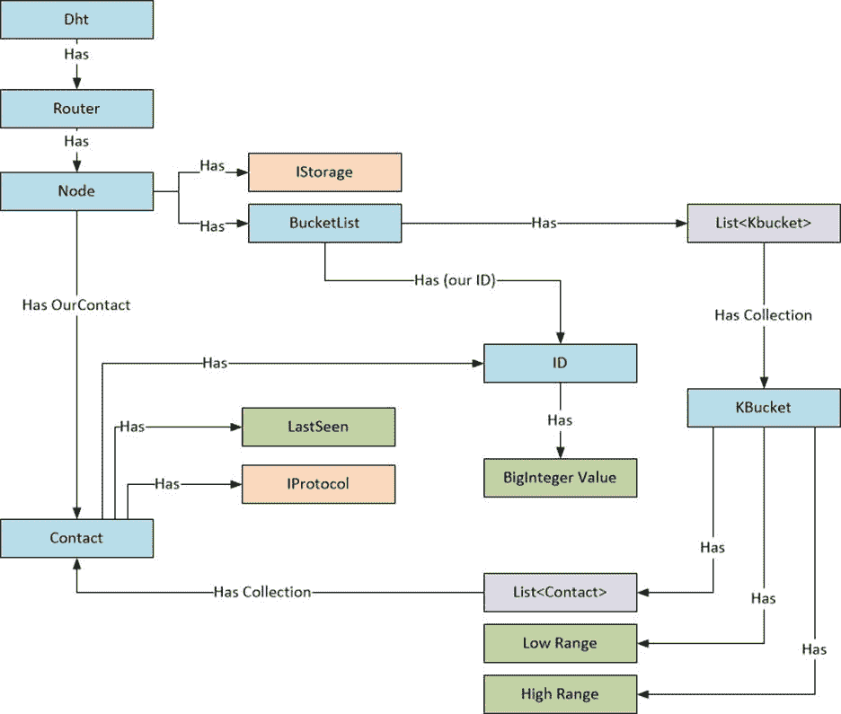

# 第三章入门

首先，让我们介绍一下节点的一些基本实现需求。

## 大整数类

我们可以编写自己的字节数组操作和比较运算符，这是 zencoders 所做的，或者我们可以在 System 中使用`BigInteger`类。Numerics 命名空间，用于处理从 0 < = id < = 2 <sup>160</sup> - 1 的 id 范围。这比实现所有的按位逻辑和单元测试要方便得多！作为一个端节点，我对 Python 在没有任何特殊类的情况下处理这些值的能力印象深刻:

代码清单 2: Python 大数字

```cs
  >>> 2 ** 160
  1461501637330902918203684832716283019655932542976L

```

## 节点规范

*“参与计算机在 160 位密钥空间中各有一个节点 ID”，*够简单了。但是，要注意节点中的桶是如何初始化的。在较短的规范中，暗示一个节点有 160 个 k 桶，160 位 SHA1 散列中的每一位一个。较长的规范讨论了桶分裂和“*”最初，节点 u 的路由树只有一个节点——一个 k 桶覆盖整个 ID 空间。*“通过查看 k 桶的实现初始化，可以立即确定代码是针对哪个规范编写的。

## 实施框架

实现的初始框架由以下类组成:

*   `Dht`:对等体与其他对等体交互的入口点。
*   `Router`:管理对等体(节点)查找，以获取最近的对等体并查找键值对。
*   `Node`:提供`Ping`、`Store`、`FindNode`和`FindValue`实现。
*   `BucketList`:管理每个桶中的联系人(对等体)以及将联系人(对等体)添加到特定桶的算法。
*   `ID`:为`BigInteger`实现一个包装器，并为异或逻辑实现各种辅助方法和运算符重载
*   `Contact`:维护联系人(对等体)使用的协议、其 ID 和`LastSeen DateTime`，用于确定是否应对对等体进行驱逐测试。
*   `KBucket`:保留与特定存储桶相关联的联系人(对等体)集合，实现存储桶拆分算法，并提供获取存储桶相关信息的其他有用方法。

它们相互作用，如模型图所示:

*   蓝色:班级
*   橙色:接口
*   紫色:系列
*   绿色:值类型字段



图 1:类模型

## ID 类:初始实现

代码清单 3:标识类

```cs
  public class ID
   {
    public BigInteger Value { get { return id; } set { id = value; } }

    protected BigInteger id;

    public ID(byte[]
  data)
     {
       IDInit(data);
     }

    public ID(BigInteger bi)
     {
       id = bi;
     }

    protected
  void IDInit(byte[] data)
     {
      Validate.IsTrue<IDLengthException>(data.Length == Constants.ID_LENGTH_BYTES, "ID
         must be " + Constants.ID_LENGTH_BYTES + " bytes in length.");
       id = new BigInteger(data.Append0());
   }

```

|  | 注意:Validate 类定义了一些辅助方法，用于断言条件并抛出指定为泛型参数的异常。 |

这里有两点需要注意。首先，我们在字节数组中添加一个`0`来强制`BigInteger`中的无符号值。如果我们不这样做，任何设置了`byte[0]`的 MSB 的字节数组都将被视为负数，这是我们在比较桶的范围时不想要的。这是通过一个简单的扩展方法来处理的，如代码清单 4 所示。

代码清单 Append0 扩展方法

```cs
  public static byte[] Append0(this byte[] b)
   {
    return
  b.Concat(new byte[]
  { 0 }).ToArray();
   }

```

其次，字节数组是小端顺序，这意味着最低有效字节首先被存储。与卡德姆利亚规范谈论标识“前缀”的方式和我们倾向于在数组中表示位的方式相比，这可能会令人困惑。例如，这个标识以位为单位，按大端顺序写出:

`11001000 00001100`

6 位前缀将是`110010`。作为一个`BigInteger`，数组是按照小端顺序排列的，所以字节的顺序是先存储最低有效字节(LSB):

`00001100 11001000`

为了方便起见，我们实现了几个助手属性。扩展方法`Bits`用于创建流畅的方法链接编码风格。

代码清单 5:按照大端顺序获取位

```cs
  public string AsBigEndianString
   {
    get 
    { 
      return String.Join("", Bytes.Bits().Reverse().Select(b
  => b ? "1" : "0")); 
    }
   }

  public bool[]
  AsBigEndianBool 
  { 
    get 
    { 
      return Bytes.Bits().Reverse().ToArray(); 
    } 
  }

```

还要注意本地方法，这是 C# 7 的一个特性。

代码清单 6:位扩展方法

```cs
  public static IEnumerable<bool>
  Bits(this byte[]
  bytes)
   {
    IEnumerable<bool> GetBits(byte b)
     {
      byte
  shifter = 0x01;

      for (int i = 0; i < 8; i++)
       {
        yield
  return (b & shifter) != 0;
         shifter <<= 1;
       }
     }

    return
  bytes.SelectMany(GetBits);
   }

```

## ID 类:单元测试

我们可以实现一些简单的单元测试来验证实现:

代码清单 7:标识单元测试

```cs
   [TestClass]
  public class IDTests
   {
     [TestMethod]
    public void LittleEndianTest()
     {
      byte[]
  test = new byte[20];
      test[0]
  = 1;
      Assert.IsTrue(new ID(test) == new BigInteger(1), "Expected value to be 1.");
     }

     [TestMethod]
    public void PositiveValueTest()
     {  
      byte[]
  test = new byte[20];
      test[19]
  = 0x80;
      Assert.IsTrue(new ID(test) == BigInteger.Pow(new
  BigInteger(2), 159), "Expected
       value to be 1.");
     }

     [TestMethod, ExpectedException(typeof(IDLengthException))]
    public void BadIDTest()
     {
      byte[]
  test = new byte[21];
      new ID(test);
     }

    [TestMethod]
    public void BigEndianTest()
     {
      byte[]
  test = new byte[20];
      test[19]
  = 0x80;
      Assert.IsTrue(new ID(test).AsBigEndianBool[0] == true, "Expected
  big endian bit
         15 to be set.");
      Assert.IsTrue(new ID(test).AsBigEndianBool[8] == false, "Expected
  big endian bit
         7 to NOT be set.");
     }
   }

```

## 路由器类

目前，`Router`类只是管理主机的节点(主机是我们的对等体)。

代码清单 8:路由器的存根

```cs
  public class Router
   {
    protected Node node;

    public
  Router(Node node)
     {
      this.node
  = node;
     }

```

## 联系类

`Contact`类管理联系人的`ID`、`LastSeen`和网络连接。因为我想对网络协议的处理方式进行抽象，这样就可以很容易地测试虚拟(内存中)网络中的节点，或者使用不同协议(UDP、TCP/IP、WebSockets 等)的节点。)，网络协议抽象在一个接口中。

代码清单 9:基本联系类

```cs
  Public class Contact  : Icomparable
   {
    public IProtocol Protocol { get; set; }
    public DateTime LastSeen { get; set; }
    public ID ID { get; set; }

    /// <summary>
    ///
  Initialize a contact with its protocol and ID.
    /// </summary>
    public
  Contact(IProtocol protocol, ID contactID)
     {
       Protocol = protocol;
       ID = contactID;
       Touch();
     }

    /// <summary>
    ///
  Update the fact that we've just seen this contact.
    /// </summary>
    public void Touch()
     {
       LastSeen = DateTime.Now;
     }

```

## KBucket 类

每个 k-bucket 维护一个最多为 *k* 个联系人的列表。

代码清单 KBucket 类

```cs
  public class KBucket 
   {
    public DateTime TimeStamp { get; set; }
    public List<Contact>
  Contacts { get { return contacts; } }
    public BigInteger Low { get { return low; } set { low = value; } }
    public BigInteger High { get { return high; } set { high = value; } }

    public bool IsBucketFull { get { return contacts.Count == Constants.K; } }

    protected
  List<Contact> contacts;
    protected
  BigInteger low;
    protected
  BigInteger high;

    public KBucket()
     {
       contacts = new List<Contact>();
       low = 0;
       high = BigInteger.Pow(new
  BigInteger(2), 160);
     }

  /// <summary>
  ///
  Initializes a k-bucket with a specific ID range.
  /// </summary>
    public
  KBucket(BigInteger low, BigInteger high)
     {
       contacts = new List<Contact>();
       this.low = low;
       this.high = high;
     }

    public void Touch()
     {
       TimeStamp = DateTime.Now;
     }

    public void AddContact(Contact
  contact)
     {
      Validate.IsTrue<TooManyContactsException>(contacts.Count < Constants.K, "Bucket
         is full");
       contacts.Add(contact);
     }
  }

```

## KBucket 类:一个单元测试

`KBucket`类单元测试的一个简单的开始就是验证当添加了太多的联系人时是否抛出了异常。

代码清单 11:基本的 KBucket 单元测试

```cs
   [TestClass]
  public class KBucketTests
   {
     [TestMethod, ExpectedException(typeof(TooManyContactsException))]
    public void TooManyContactsTest()
     {
      KBucket kbucket = new KBucket();

      //
  Add max # of contacts.
      Constants.K.ForEach(n => kbucket.AddContact(new Contact(null,
  new ID(n))));

      //
  Add one more.
      kbucket.AddContact(new Contact(null,
  new ID(21)));
     }
   }

```

注意扩展方法`ForEach`。

代码清单 12: ForEach 扩展方法

```cs
  public static void ForEach(this int n, Action<int> action)
   {
    for (int i = 0; i < n; i++)
     {
       action(i);
     }
   }

```

同样，这用于更流畅的方法链接语法。

## 桶列表类

`BucketList`类是桶和操作桶的操作的高级单例容器。目前，大部分都是用最少的行为来完成的。

代码清单 13:桶列表类

```cs
  public class BucketList : IBucketList
   {
    public List<KBucket>
  Buckets { get { return buckets; } }

    public ID OurID { get { return ourID; } }

    protected List<KBucket> buckets;

    public
  BucketList(ID id)
     {
       ourID = id;
       buckets = new List<KBucket>();

     // First kbucket has max range.
       buckets.Add(new KBucket());
     }

    public void
  AddContact(Contact contact)
     {
     // To be
  implemented…
     }
  }

```

## 节点类

`Node`类是另一个高级单例容器，用于处理通过网络发送的 Kademlia 命令。这是目前最棘手的问题。

代码清单 14:节点类

```cs
  public class Node : INode
   {
    public Contact OurContact { get { return ourContact; } }
    public IBucketList BucketList { get { return bucketList; } }
    public IStorage Storage { get { return storage; } set { storage = value; } }

    protected Contact ourContact;
    protected
  IBucketList bucketList;
    protected
  IStorage storage;

    public Node(Contact contact, IStorage storage, IStorage cacheStorage = null)
     {
       ourContact = contact;
       bucketList = new BucketList(contact.ID);
      this.storage
  = storage;
     }

    public Contact Ping(Contact sender)
    {
       // To be
  implemented…

      return ourContact;
    }

    public void Store(Contact
  sender, ID key, string val)
    {
      // To be
  implemented…
    }

    public (List<Contact> contacts, string val) FindNode(Contact
  sender, ID key)
    {
      // To be
  implemented…
    }

    public (List<Contact> contacts, string val) FindValue(Contact
  sender, ID key)
    {
      // To be
  implemented…
    }
  }

```

这里值得注意的是接口`IStorage`，它抽象了键值对的存储机制。最终，`IStorage`将实现代码清单 15 中的以下方法。

代码清单 15:历史界面

```cs
  public interface IStorage
   {
    bool
  Contains(ID key);
    bool
  TryGetValue(ID key, out
  string val);
    string
  Get(ID key);
    string
  Get(BigInteger key);
    DateTime
  GetTimeStamp(BigInteger key);
    void Set(ID key, string
  value, int expirationTimeSec = 0);
    int
  GetExpirationTimeSec(BigInteger key);
    void
  Remove(BigInteger key);
    List<BigInteger> Keys { get; }
    void
  Touch(BigInteger key);
   }

```

## Dht 类

`Dht`类是“服务器”——实例化我们的对等体的入口点。目前，`Dht`级只是`Router`的一个容器:

代码清单 16:Dht 类的存根

```cs
  public class Dht : IDht
  { 
    public BaseRouter Router { get { return router; } }
    protected BaseRouter router;
  }

```