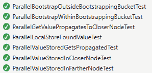

# 十二、异步实现的注意事项

## 螺纹安全

节点的这些入口点必须是可重入的:

*   砰
*   商店
*   查找节点
*   查找值

第一个问题是添加联系人和发生的铲斗操作。搜索集合时，不应对其进行修改或其他操作。我们已经在前面的代码中看到了使用`lock`语句来确保集合不会被异步修改。

还有潜在的更优化的方法，例如只锁定正在操作的特定`KBucket`，并且只锁定正在修改的`BucketList`；然而，我会把这些留到另一个时间。

还假设存储实施可以重新进入。在虚拟存储中，这由`ConcurrentDictionary`实例处理，例如:

`protected ConcurrentDictionary<BigInteger, StoreValue> store;`

## 并行查询

根据规范:“*发起方然后向它选择的 a [sic]节点发送并行、异步的 find _ node RPCs，a 是一个系统范围的并发参数，例如 3。*”

在查找算法中，Kademlia 使用并行异步查询来减少失败节点的超时延迟。在每一批三个最接近的节点中等待至少一些节点响应，使系统有机会获得与第一组接近节点更接近的节点，希望获得 k 个更接近的联系人，而不必探索更远的联系人。

不太清楚为什么一开始没有并行查询所有 k 个更接近的联系人。也许这个想法是你想尝试从已经很亲密的人那里获得更亲密的接触。当然，所有的联系人都可以被查询，从最先响应的联系人中，我们可以选择 k 个更接近的联系人。另一方面，同时查询所有联系人可能会导致不必要的网络流量，因为许多 FindNode RPC 调用将被忽略。

### 基本路由器抽象类

对于单元测试，保持非并行实现是有用的，但是理想情况下，对`Router`的并行和非并行调用应该以相同的方式进行。抽象的`BaseRouter`类允许这样做。

代码清单 88:基础路由器类

```cs
  public abstract class BaseRouter
   {
    public abstract 
      (bool found, List<Contact>
  contacts, Contact foundBy, string val) Lookup(
        ID key,
         Func<ID, Contact, (List<Contact> contacts, Contact foundBy, string val)>
          rpcCall,
         bool giveMeAll = false);
  }

```

## 平行外层

`ParallelRouter`除了每个线程在执行 RPC 调用时需要知道的一些其他信息之外，还将联系人排队进行查询。

代码清单 89: ContactQueueItem

```cs
  public class ContactQueueItem
   {
    public ID Key { get; set; }
    public Contact Contact { get; set; }
    public Func<ID, Contact, (List<Contact> contacts, Contact foundBy, string val)>
      RpcCall { get; set;
  }
    public List<Contact>
  CloserContacts { get; set;
  }
    public List<Contact>
  FartherContacts { get; set;
  }
    public FindResult FindResult { get; set; }
   }

```

`ParallelRouter`还初始化一个内部线程池。

代码清单 90: InitializeThreadPool

```cs
  protected void InitializeThreadPool()
   {
     threads = new List<Thread>();
    Constants.MAX_THREADS.ForEach(() =>
     {
      Thread
  thread = new Thread(new ThreadStart(RpcCaller));
       thread.IsBackground = true;
       thread.Start();
     });
   }

```

工作被排队，一个信号量被释放给一个线程来获取工作。

代码清单 91:排队工作

```cs
  protected void QueueWork(
    ID
  key,
    Contact
  contact,
    Func<ID, Contact, (List<Contact> contacts, Contact foundBy, string val)> rpcCall,
    List<Contact> closerContacts,
    List<Contact> fartherContacts,
    FindResult findResult
   )
   {
    contactQueue.Enqueue(new ContactQueueItem()
    {
      Key
  = key,
      Contact
  = contact,
      RpcCall
  = rpcCall,
      CloserContacts
  = closerContacts,
      FartherContacts
  = fartherContacts,
      FindResult
  = findResult
    });

     Semaphore.Release();
   }

```

每个线程在`RpcCaller`方法中将一个工作项出列。

代码清单 92: RpcCaller

```cs
  protected void RpcCaller()
   {
    while (true)
     {
       semaphore.WaitOne();
       ContactQueueItem item;

       if (contactQueue.TryDequeue(out item))
       {
         string val;
         Contact foundBy;

         if (GetCloserNodes(
           item.Key,
           item.Contact,
           item.RpcCall,
           item.CloserContacts,
           item.FartherContacts,
           out val,
           out foundBy))
         {
           if (!stopWork)
           {
             //
  Possible multiple "found"
             lock (locker)
             {
               item.FindResult.Found = true;
               item.FindResult.FoundBy = foundBy;
               item.FindResult.FoundValue = val;
               item.FindResult.FoundContacts = new List<Contact>(item.CloserContacts);
             }
           }
         }
       }
     }
   }

```

前一个代码的突出之处在于，当找到一个值时，它会拍摄当前更接近的联系人的快照，并将关于更接近的联系人的所有信息存储在属于`ParallelLookup`类的字段中。

`ParallelRouter`一定时间后必须终止搜索，处理无响应的联系人。每当收到响应并且新的联系人被添加到可以查询的联系人列表中时，定时器被重置。当找到一个值(对于`FindValue`)或者找到 k 个更接近的联系人，或者时间段到期时，`Lookup`呼叫退出。

代码清单 93: SetQueryTime

```cs
  /// <summary>
  /// Sets
  the time of the query to now.
  /// </summary>
  protected void SetQueryTime()
   {
     now = DateTime.Now;
   }

  /// <summary>
  /// Returns
  true if the query time has expired.
  /// </summary>
  protected bool QueryTimeExpired()
   {
    return (DateTime.Now - now).TotalMilliseconds > Constants.QUERY_TIME;
   }

```

`Lookup`内部循环是完成工作的地方，就像非并行版本一样，但是请注意工作是如何排队的，以及我们是如何等待响应的——特别是检查我们在`haveWork`任务中是否已经等待了足够长的时间。

代码清单 94: haveWork

```cs
   ...
   ret.AddRangeDistinctBy(closerContacts, (a, b) => a.ID ==
  b.ID);

  // Spec: The lookup terminates when the initiator has queried
  and gotten responses from the k closest nodes it has seen.
  while
  (ret.Count < Constants.K && haveWork)
   {
    Thread.Sleep(Constants.RESPONSE_WAIT_TIME);

    if
  (ParallelFound(findResult, ref
  foundReturn))
     {
       StopRemainingWork();

      return
  foundReturn;
     }

    List<Contact> closerUncontactedNodes =
      closerContacts.Except(contactedNodes).ToList();
    List<Contact> fartherUncontactedNodes =
      fartherContacts.Except(contactedNodes).ToList();
    bool haveCloser =
  closerUncontactedNodes.Count > 0;
    bool haveFarther =
  fartherUncontactedNodes.Count > 0;

    haveWork
  = haveCloser || haveFarther || !QueryTimeExpired();

    //
  Spec:  Of the k nodes the initiator has heard of closest to the target...
    if (haveCloser)
    {
      // We're
  about to contact these nodes.
      var alphaNodes =
  closerUncontactedNodes.Take(Constants.ALPHA);
      contactedNodes.AddRangeDistinctBy(alphaNodes,
  (a, b) => a.ID == b.ID);
      alphaNodes.ForEach(n
  => QueueWork(
        key, n, rpcCall, closerContacts,
  fartherContacts, findResult));
      SetQueryTime();
    }
    else if
  (haveFarther)
    {
      // We're
  about to contact these nodes.
      var alphaNodes =
  fartherUncontactedNodes.Take(Constants.ALPHA);
      contactedNodes.AddRangeDistinctBy(alphaNodes,
  (a, b) => a.ID == b.ID);
      alphaNodes.ForEach(
        n => QueueWork(key, n, rpcCall,
  closerContacts, fartherContacts, findResult));
      SetQueryTime();
    }
   }

```

我们现在可以对非并行版本进行`Dht`测试，并创建这些测试的并行版本，改为通过`ParallelRouter`:

`Dht dht = new Dht(ID.RandomID, vp, () => new VirtualStorage(), new ParallelRouter());`

结果是并行路由器单元测试也通过了。



图 9

当有线程仍在等待响应时，会出现一个潜在的问题，该响应可能会在`Lookup`方法退出后的某个时间点出现。我们以几种方式处理这个问题:

1.  用`DequeueRemainingWork();`删除所有待定的排队工作
2.  执行`FindValue` RPC 调用时复制更接近的联系人集合:`foundContacts = item.CloserContacts.ToList();`
3.  设置一个“停止工作”标志，忽略当前查找的任何进一步的`FindValue` RPC 成功返回值。
4.  使用本地(每次查找调用)`findResult`实例。
5.  使用公共的锁定器对象来防止更近/更远的联系人被更新，并更新`findResult`实例中的值。
6.  每次查找使用本地更近/更远/联系列表，这样任何剩余的线程将只更新与其当前工作项相关联的集合，这就是为什么`ContactQueueItem`包括更近/更远的集合以及`findResult`实例，在其中存储任何找到的值。

这可确保即使有线程仍在执行上一次查找，它们也不会影响当前查找的结果。

虽然使用单个`locker`对象来阻止集合更新和更新查找值的效率稍低，但它避免了使用嵌套锁；否则，线程如果找到一个值，在技术上必须锁定`closerContacts`集合和`findResult`实例。应该避免嵌套锁。还要注意的是`Lookup`方法本身并不打算重入。