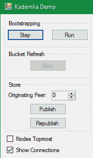
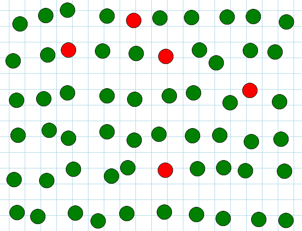
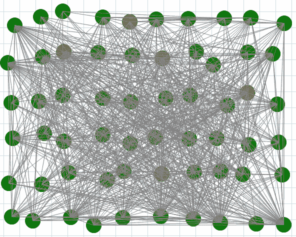
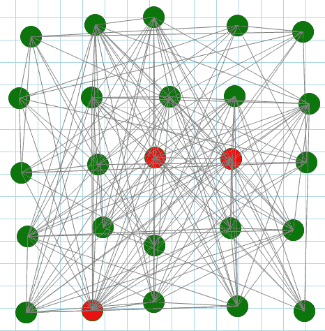
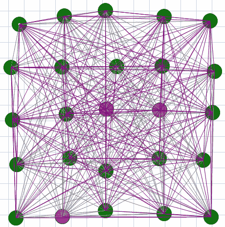
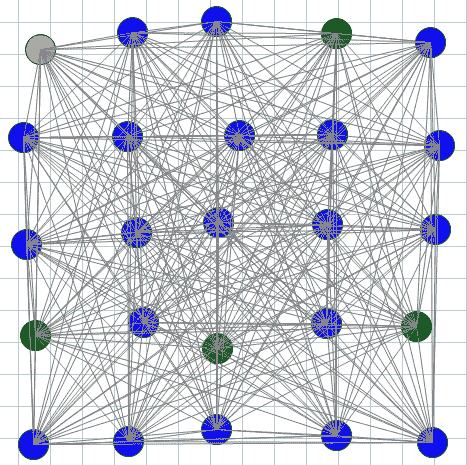
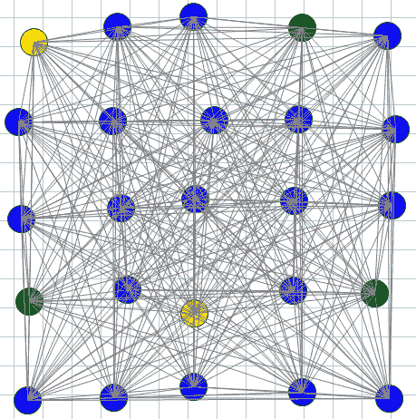
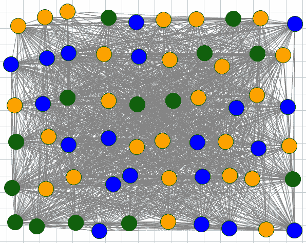

# 第 15 章整合:演示



图 10

像往常一样，没有什么比视觉演示更能看到正在发生的事情了。这个演示使用我的开源图表工具 FlowArp[<sup>【17】</sup>](The_Kademlia_Protocol_Succinctly_0020.htm#_ftn17)作为绘图画布。如图 11 所示，我们从 60 个对等体(绿色)开始，其中 5 个是已知的对等体(红色)。

代码清单 111:初始化分布式哈希表和已知对等体

```
  protected void InitializeDhts()
   {
     dhts = new List<Dht>();
     dhtPos = new List<Rectangle>();
     peerColor = new Dictionary<BigInteger, Color>();

     NUM_DHT.ForEach((n) =>
     {
       IProtocol protocol = new TcpSubnetProtocol("http://127.0.0.1", 2720, n);
       Dht dht = new Dht(ID.RandomID, protocol, 
          () => new VirtualStorage(), new Router());
       peerColor[dht.ID.Value] = Color.Green;
       server.RegisterProtocol(n, dht.Node);
       dhts.Add(dht);
       dhtPos.Add(new Rectangle(XOFFSET + rnd.Next(-JITTER, JITTER)
  + (n % ITEMS_PER_ROW) * XSPACING, YOFFSET + rnd.Next(-JITTER, JITTER) + (n /
  ITEMS_PER_ROW) * YSPACING, SIZE, SIZE));
     });
   }

  protected void InitializeKnownPeers()
   {
     knownPeers = new List<Dht>();
    List<Dht> workingList = new
  List<Dht>(dhts);

    NUM_KNOWN_PEERS.ForEach(()
  =>
    {
      Dht
  knownPeer = workingList[rnd.Next(workingList.Count)];
      peerColor[knownPeer.ID.Value]
  = Color.Red;
      knownPeers.Add(knownPeer);
      workingList.Remove(knownPeer);
    });
   }

```



图 11

## 自举

我们现在可以引导到一个随机的对等点。

代码清单 112:引导对等体

```
  protected void BootstrapWithAPeer(int
  peerBootstrappingIdx)
   {
    Dht
  dht = dhts[peerBootstrappingIdx];
    var
  peerList = knownPeers.ExceptBy(dht, c => c.ID).ToList();
    Dht
  bootstrapWith = peerList[rnd.Next(peerList.Count)];
     dht.Bootstrap(bootstrapWith.Contact);
   }

```

如图 12 所示，在每个对等体与一个已知的对等体(随机选择的)启动后，对等网络就建立了。



图 12

连接的方向未显示-箭头会在此图中丢失！

## 桶刷新

为了说明桶刷新，让我们从一组较小的对等体(25)开始。



图 13

一个桶刷新调用`FindNode`每个桶中的所有联系人。这将根据联系人返回的 k 个最近联系人更新每个对等方的联系人。



图 14

新发现的隐形眼镜是紫色的。在这样一个小网络中，几乎每个对等体都会了解其他对等体——桶刷新的另一次迭代只会导致发现更多的联系人。

## 储值

当一个非计算值被存储到一个对等点时，它会被重新发布给关闭的对等点。我们可以看到这一点，用黄色表示发起者，用蓝色表示存储值的直接对等方，用橙色表示重新发布值的对等方。

代码清单 113:发布

```
  /// <summary>
  /// Color
  the originator with yellow
  /// the
  immediate peer we're storing the value to in blue
  /// and the
  peers to which the value is republished in orange:
  /// </summary>
  private void btnPublish_Click(object
  sender, EventArgs e)
   {
     firstContacts = new List<Dht>();
     storeKey = ID.RandomID;
     originatorDht = dhts[(int)nudPeerNumber.Value];
     originatorDht.Store(storeKey, "Test");
     System.Threading.Thread.Sleep(500);
     dhts.Where(d => d.RepublishStorage.Contains(storeKey)).
      ForEach(d => firstContacts.Add(d));
     UpdatePeerColors();
     DrawDhts();
   }

```

在一个小网络中，因为商店发布给 k 个对等点，所以大多数对等点都参与其中。



图 15

## 商店重新发布

当我们强制立即存储重新发布时，我们看到一个节点，这是一个更紧密的联系，获得重新发布的键值。



图 16

在更大的网络中，这变得更加明显(节点已经被移动到渲染中的最顶端)。



图 17

请记住，键值只在 k 个更接近的联系人上重新发布，因此不是每个对等方都能获得重新发布的键值。