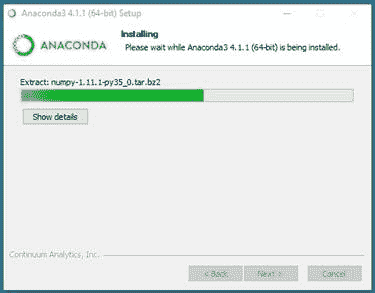

# 第 1 章开始

Keras 是一个用 Python 语言编写的开源神经网络库。Keras 需要一个后端引擎，可以使用 TensorFlow、CNTK(微软认知工具包)、antano 或 MXNet。Keras 的动机是，尽管可以直接使用 TensorFlow(或 CNTK、antano、MXNet)创建深度神经系统，但由于 TensorFlow 在相对较低的抽象级别上工作，因此直接对 TensorFlow 进行编码相当具有挑战性。Keras 在 TensorFlow 上增加了一个相对容易使用的抽象层。

Keras 在希腊语中的意思是“号角”，于 2015 年 3 月首次发布。本电子书基于 2018 年 3 月发布的 Keras 2 . 1 . 5 版。因为 Keras 在积极开发，等你看完这本电子书的时候，最新的版本肯定会不一样。然而，对 Keras 的任何更改都可能相对较小，并且主要由附加功能组成，而不是主要的架构更改。换句话说，这里展示的代码应该可以与任何 Keras 2.x 版本一起工作，几乎不需要任何更改。

Keras 运行在 Windows、Linux 和 Mac 系统上。这本电子书的重点是 Windows 上的 Keras，但因为 Keras 程序是在一个 shell 中运行的，所以 Linux 或 Mac 系统上的 Keras 几乎完全相同。

图 1-1 中的截图显示了一个在 Windows 上简化的 Keras 会话。请注意，该程序只是一个普通的 Python 脚本，小麦 _nn.py，它将 Keras 作为 Python 包进行引用，而 Keras 程序在一个普通的 shell 中运行。


图 1-1:示例 Keras 会话

这本电子书假设你有中级或更好的 C 族语言编程技能，但不假设你了解 Keras。闲聊已经够多了，我们开始吧。

## 安装 Keras 和 Anaconda

我认识的每一个程序员，包括我在内，都是通过启动并运行一个示例程序，然后通过改变来尝试这个示例，从而学会如何用一种新的语言或框架进行编程。所以如果你想学习 Keras，第一步就是安装。

Keras 安装可能与您之前安装的其他软件有点不同。你不直接安装 Keras。相反，您安装 Keras 作为 Python 的附加包。简而言之，您首先安装一个 Python 发行版(Anaconda)，它包含基础 Python 语言解释器以及 Keras 所需的几个附加包，特别是 NumPy 包。接下来，安装 TensorFlow 包，然后安装 Keras 包。

可以单独安装 Python、NumPy 和其他依赖项。但是相反，我强烈建议您安装 Python 的 Anaconda 发行版，它拥有成功安装和运行 Keras 所需的一切。在开始安装过程之前，您必须仔细确定 Keras、TensorFlow 和 Anaconda 的兼容版本。我见过的大多数安装失败都是由于版本不兼容造成的。

第一步是确定您想要使用哪个版本的 Keras。一般来说，您会希望安装最新的稳定版本的 Keras。然而，这本书是基于 Keras 1 . 7 . 0 版本而不是最新版本，以及 Anaconda3 4.1.1(包含 Python 3.5.2)和 TensorFlow 2.1.5。我相信这本电子书中的代码可以与较新版本的 Keras 一起工作，只需要很少的修改。

在安装 Anaconda/Python 之前，您应该检查您的机器，以确定您是否已经安装了现有的 Python。最简单的情况是，您的机器没有安装现有的 Python，您可以继续。但是，如果您已经安装了一个或多个 Python 版本，您应该卸载它们(如果可行的话)，或者注意它们的安装位置(如果卸载它们不可行的话)。安装了多个 Python 实例后，您可能会在某个时候遇到一些 Python 版本控制问题。

要安装 Anacoinda3 4.1.1，您可以在互联网上搜索“存档 Anaconda 安装”，也可以直接到[这个位置](https://repo.continuum.io/archive/)。见图 1-2。

在该页面上，您将看到许多不同的 Anaconda 发行版。这里要小心；即使我已经为 Keras/TensorFlow 安装和卸载了 Anaconda 几十次，但我还是几次选择了不正确的 Anaconda 版本。

Anaconda 发行版包含 500 多个相互兼容的 Python 包。有些包，比如 NumPy 和 SciPy，绝对是必不可少的。有些包是特定于某个研究领域的，比如用于分子生物学的 BioPython，有些包不是必需的，但非常有用，比如用于创建图形和图表的 MatPlotLib。您可以在这里查看 Anaconda [包含的包的完整列表。](https://docs.anaconda.com/anaconda/packages/pkg-docs)


图 1-2:找到正确的 Anaconda 存档安装链接

因为我用的是 64 位 Windows 机，想要 Python 3 有 Anaconda 4 . 1 . 1 版本，我会点击链接**Anaconda 3-4 . 1 . 1-Windows-x86 _ 64 . exe**。这将启动一个自解压安装程序。您可以选择**运行**选项。

综上所述，至此，您已经确定了要使用 Keras (1.7.0)和 TensorFlow (2.1.5)的哪些版本，然后确定了要使用 Anaconda 的哪个版本(在本例中，Anaconda3 4.1.1 适用于 64 位 Windows 机器)，现在正在开始 Anaconda 的安装过程。


图 1-3:蟒蛇安装欢迎

点击**运行**几秒后，会出现 Anaconda 安装欢迎窗口，如图 1-3 所示。点击**下一步**。

您将看到 Anaconda 许可协议窗口，如图 1-4 所示。点击**我同意**。


图 1-4:阿纳康达许可协议

您将看到“选择安装类型”窗口，如图 1-5 所示。我强烈建议你保留默认的**只有我(推荐)**选项。如果您的机器上有多个用户帐户，这将减少 Python 版本冲突的可能性。点击**下一步**。


图 1-5:蟒蛇安装类型

接下来，您将看到“选择安装位置”信息。如果可能的话，您应该接受默认位置(**C:\ Users \<user>\ AppData \ Local \ continuity \ anaconda 3**)因为有些 Python 包可能会采用这个位置。点击**下一步**。


图 1-6:默认的蟒蛇安装位置

接下来，您将看到“高级安装选项”窗口。您应该接受这两个默认选项。第一个将 Anaconda 添加到您的系统路径变量中。第二个选项使 Anaconda 成为您的默认 Python 版本。如果您有一个现有的 Python 安装，这通常会覆盖现有的实例，您可能想要安装一个 Python 版本选择器程序。点击**安装**。


图 1-7:安装路径和默认 Python 信息

安装 Anaconda 大约需要 10 到 15 分钟。没有可供您考虑的选项，因此您不需要参与安装。但是，您可能希望观察进度条，看看安装了哪些包，比如 NumPy，如图 1-8 所示。



图 1-8:蟒蛇安装进度

当安装成功完成时，您将看到“安装完成”窗口。点击**下一步**，如图 1-9 所示。


图 1-9:成功的 Anaconda 安装窗口

您将看到最后一个窗口，可以选择从维护 Anaconda 发行版的 Continuum 公司查看营销信息。在图 1-10 中，我取消了那个选项，点击**完成**。总而言之，Anaconda 安装是一个自解压可执行文件，具有类似向导的过程。您可以接受所有默认选项。


图 1-10:最后的蟒蛇安装窗口

Anaconda 安装完成后，您可能希望查看一下安装文件和目录结构，如图 1-11 所示。请注意，有名为 Lib、Lib 和 libs 的目录。就在图 1-11 所示的文件下面是 python.exe 主执行引擎。


图 1-11:蟒蛇的安装位置

在安装 TensorFlow 和 Keras 附加包之前，您应该验证您的 Anaconda Python 发行版是否正常工作。打开命令外壳，输入`python --version`(带两个连字符)。Python 应该会响应，如图 1-12 所示。


图 1-12:验证蟒蛇的安装

您可以通过发出命令`python.`来测试 Python 解释器。这将启动解释器，您将看到> > >提示。输入`print('hello')`语句。您可以通过键入`exit()`命令退出解释器。

## 安装 TensorFlow 和 Keras

下一步是安装 TensorFlow，有几种方法可以做到。我建议使用 PyPi (Python 包索引)存储库。


图 1-13:下载张量流。文件

在网上搜索“安装 TensorFlow 1.7.0”或者直接进入[本页面](https://pypi.org/project/tensorflow/1.7.0/)点击**下载文件**链接。你会看到一个页面。不同类型系统的文件。就我而言，因为我使用的是 Python 3.5 和 Windows 机器，所以我点击了链接**tensorflow-1 . 7 . 0-cp35-cp35m-win _ amd64 . whl**(该 **cp35** 表示 Python 3.5)。见图 1-13。

系统会询问您是否要打开或保存。文件。点击**另存为**选项。您可以将车轮文件保存在任何方便的位置。我在**存了钱。现在，打开一个命令外壳，导航到保存 TensorFlow 的目录。whl 文件，并输入以下命令:**

`C:\KerasSuccinctly\Wheels> pip install tensorflow-1.7.0-cp35-cp35m-win_amd64.whl`

`pip`实用程序使用安装 Python 包。文件。安装不到一分钟，然后你会看到这条消息:“成功安装 tensorflow-1.7.0”。

安装 Keras 的过程非常相似。在网上搜索“安装 Keras 2.1.5”，或者直接进入[这个网页](https://pypi.org/project/Keras/2.1.5/)，点击**下载文件**的链接。见图 1-14。


图 1-14:下载 Keras。文件

在下一页，点击**Keras-2 . 1 . 5-py2 . py3-none-any . whl**链接，系统会提示打开或保存。点击**另存为**并保存。将 whl 文件放在一个方便的位置，例如，**C:\ kerasucisuncitly \ Wheels**。启动命令外壳，导航到保存 Keras 的目录。whl 文件，并输入以下命令:

`C:\KerasSuccinctly\Wheels> pip install Keras-2.1.5-py2.py3-none-any.whl`

安装非常快，您将看到“成功安装 Keras-2.1.5”的消息。您现在可以编写 Keras 程序了。

## 编辑和运行 Keras 程序

因为 Keras 程序只是一个专门的 Python 程序，所以您可以使用任何 Python 编辑环境。如果您对 Python 比较陌生，选择 Python 编辑器或 IDE(集成开发环境)可能是一项令人困惑的任务，因为有几十种编辑器和 Python IDEs 可供选择。

我经常使用普通的旧记事本，或者有时使用稍微强大一点的记事本++。这两者都没有给你内置的调试功能，所以调试意味着你必须插入`print()`语句来检查变量和对象的值。而且没有集成的`run`命令，所以你从一个外壳运行程序。

代码清单 1-1:检查 Keras 和 TensorFlow 版本

```py
  #
  test_keras.py
  import sys
  import keras as K
  import tensorflow as tf

  py_ver
  = sys.version
  k_ver
  = K.__version__
  tf_ver
  = tf.__version__

  print("Using Python version " + str(py_ver))
  print("Using Keras version " + str(k_ver))
  print("Using TensorFlow version
  " + str(tf_ver))

```

启动记事本文本编辑器(或您熟悉的任何其他编辑器)，复制粘贴代码清单 1-1 中的代码。将文件保存为任何方便的目录下的 **test_keras.py** 。打开一个命令外壳，导航到保存你的 Python 文件的目录，输入`python test_keras.py`执行，如图 1-15 所示。


图 1-15:使用记事本和命令外壳

我的许多同事使用 Visual Studio Code (VS Code)，这是一个免费的、开源的、跨平台的、多语言的 IDE。安装 VS 代码又快又容易，添加 Python 支持只需点击几下鼠标。见本[网页](https://code.visualstudio.com/download)。


图 1-16:使用 Visual Studio 代码

图 1-16 显示了一个使用 VS 代码的例子。使用 VS 代码有很多优点，包括智能感知自动完成、漂亮的格式化和集成调试。然而，与记事本不同的是，VS Code 确实有一条非平凡的学习曲线需要你去处理。参见[本教程](https://code.visualstudio.com/docs/python/python-tutorial)获取帮助。

编辑和运行 Keras 程序的另一个选择是重量级的 Visual Studio (VS) IDE。VS 的默认配置不支持编辑 Python 程序，但是可以安装 Visual Studio 外接程序的 Python Tools。安装插件后，您将获得完整的 Python 语言支持，如图 1-17 和 1-18 所示。


图 1-17:使用 Visual Studio 集成开发环境创建一个 Python 项目

使用 Visual Studio 的一个优点是，您可以获得对各种附加功能的支持，例如到 SQL Server 数据库和 Azure 数据源的数据连接器。Visual Studio 的主要缺点是学习曲线陡峭。


图 1-18:从 Visual Studio 集成开发环境运行 Python 程序

如果您熟悉任何 Python 编辑器或开发环境，我的建议是继续使用该系统。如果你对编程比较陌生，我的建议是从简单的记事本开始，因为它本质上没有学习曲线。如果你是一个有经验的开发人员，但是对 Python 不熟悉，我的建议是尝试 VS Code。


图 1-19:使用记事本++编辑器

## 正在卸载 Keras

Anaconda、Keras 和 TensorFlow 都有快速、简单和可靠的卸载程序。要卸载 Keras，启动命令外壳并发出命令`pip uninstall keras`。Keras 包将从您的 Python 系统中移除，如图 1-20 所示。要卸载 TensorFlow，请发出`pip uninstall tensorflow`。


图 1-20:卸载 Keras

要在 Windows 上卸载 Python，请使用**控制面板**的**程序和功能**部分:


图 1-21:卸载蟒蛇

如果你成为 Keras 的常规用户，最终你会想要升级你的版本。虽然 pip 实用程序支持升级命令，但我建议您删除当前版本，然后安装新版本。