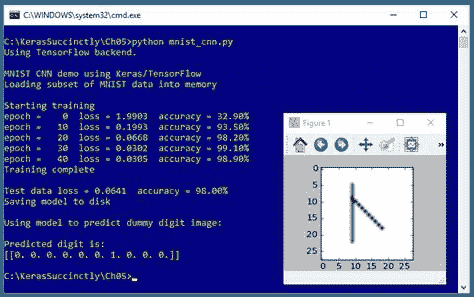
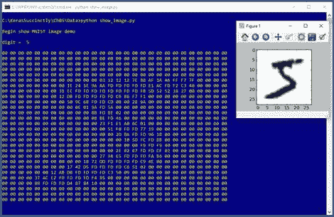
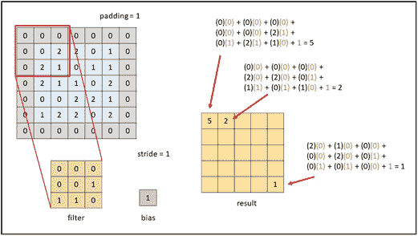

# 第五章图像分类

图像分类的目标是进行预测，其中要预测的变量是与图像相关联的标签。例如，您可能想要预测照片中是否包含“苹果”、“香蕉”或“橙色”执行图像分类最常见的方法是使用所谓的卷积神经网络(CNN)。



图 5-1:使用 Keras 对 MNIST 数据集进行图像分类

图 5-1 中的截图展示了图像分类的演示。演示程序首先将 1000 个训练图像和 100 个测试图像加载到内存中。每幅图像都是从“0”到“9”的手写数字，宽 28 像素，高 28 像素，总计 784 像素。该数据是 MNIST(经修改的国家标准和技术研究所)基准数据集的子集。

在幕后，演示程序创建了一个 784-32-64-100-10 卷积神经网络。该网络有 784 个输入节点和 10 个输出节点，每个节点对应一个可能的数字或标签。体系结构的 32-64-100 部分的含义将很快解释。演示程序使用 50 个时代来训练神经网络模型。在训练期间，显示训练数据的损失和准确性值，以确保训练正在进行。

训练完成后，训练后的模型对测试数据的预测准确率达到 98.00%(100 幅图像中 98 幅正确，2 幅不正确)。演示结束时，对一个虚拟的、假设的、以前看不到的图像进行了预测，该图像模糊地类似于一个手写的数字。预测的数字是‘6’，因为输出概率向量的最大值(1.0)在索引[6]处。

## 理解数据

MNIST 数据集本质上是用于深度学习的“你好世界”数据集。整个数据集由 60，000 个训练图像和 10，000 个测试图像组成。为了简单起见，演示程序使用了 MNIST 子集(1000 个训练图像和 100 个测试图像)。

28x28 像素中的每一个都是介于 0(白色)和 255(黑色)之间的灰度整数值。图 5-2 显示了第一个训练图像，以十六进制格式显示为 784 个像素值，也是一个图像。



图 5-2:典型的 MNIST 图像

原始数据以不同寻常的格式存储，在编写演示程序之前，必须对原始数据进行预处理。原始训练数据集和原始测试数据集都存储在两个文件中。第一个文件只包含像素值，每行 784 个值(60，000 行用于训练文件，10，000 行用于测试文件)。第二个文件只包含标签“0”到“9”，每行一个。

此外，所有四个文件都以专有的二进制格式和大端字节格式存储，而不是英特尔和类似处理器使用的更常见的小端字节格式。四个源文件被压缩在。gz 格式。

首先，解压缩四个原始源文件。对于训练数据，高级伪码的预处理是:

打开(二进制)像素文件读取
打开(二进制)标签文件读取
打开(文本)结果文件写入

读取并丢弃像素和标签文件中的标题字节

循环 1000 次
从标签文件
读取标签将标签写入结果文件
写入“##”分隔符
循环 784 次
读取一个像素字节
将像素写入结果文件
结束循环
向结果文件
写入一个换行符结束循环
关闭所有文件

结果是一个 1000 行的训练文件，如下所示:

`2 ** 0 0 152 27 .. 0
5 ** 0 0 38 122 .. 0`

第一个值是类标签“0”到“9”。接下来是一个双星号分隔符，只是为了可读性。接下来是 784 像素值。100 图像测试文件具有相同的结构。预处理不编码类标签，也不归一化像素值。正如您将很快看到的，编码和规范化是以编程方式完成的。

使用机器学习时，准备好数据通常很耗时、烦人且困难。数据预处理需要您总时间和精力的 90%(或更多)并不罕见。

请注意，Keras 库附带了一个预处理的 MNIST 数据集，可以这样访问:

`from keras.datasets import mnist
(train_x, train_y), (test_x, test_y) = mnist.load_data()`

然而，这有点欺骗，因为在非演示场景中，您不会有像这样的好方法来访问您的数据。

## MNIST 计划

代码清单 5-1 显示了生成图 5-1 所示输出的完整程序。程序首先对程序文件名(`_cnn`不是标准约定，只是代表卷积神经网络)和使用的 Python、TensorFlow、Keras 版本进行注释，然后导入 NumPy、Keras、TensorFlow、OS 包。还导入了 PyPlot 模块，以便显示虚拟输入图像:

`# mnist_cnn.py
# Python 3.5.2, TensorFlow 2.1.5, Keras 1.7.0
import numpy as np
import keras as K
import tensorflow as tf
import os
os.environ['TF_CPP_MIN_LOG_LEVEL']='2'
import matplotlib.pyplot as plt` 

在非演示场景中，您可能希望在注释中包含许多附加细节。因为 Keras 和 TensorFlow 正在快速发展，所以最好记录下正在使用的版本。使用 Keras 和开源软件时，版本不兼容可能是一个严重的问题。

代码清单 5-1: MNIST 图像分类程序

```py
  #
  mnist_cnn.py
  #
  Python 3.5.2, TensorFlow 2.1.5, Keras 1.7.0

  #
  ==================================================================================

  import numpy as np
  import keras as K
  import tensorflow as tf
  import os
  os.environ['TF_CPP_MIN_LOG_LEVEL']='2'
  import matplotlib.pyplot as plt

  class MyLogger(K.callbacks.Callback):
    def __init__(self, n):

  self.n = n 

    def on_epoch_end(self, epoch, logs={}):

  if epoch % self.n == 0:

  t_loss = logs.get('loss')

  t_accu = logs.get('acc')

  print("epoch =
  %4d  loss = %0.4f  accuracy = %0.2f%%" % \
  (epoch, t_loss, t_accu*100))

  def encode_y(y_mat, y_dim):
    # convert to one-hot

  n = len(y_mat)  # rows

  result = np.zeros(shape=(n, y_dim),
  dtype=np.float32)
    for i in range(n):  #
  each row

  val = int(y_mat[i])    #
  like 5

  result[i][val] = 1
    return result

  #
  ==================================================================================

  def main():
    # 0\. get started

  print("\nMNIST
  CNN demo using Keras/TensorFlow ")

  np.random.seed(1)

  tf.set_random_seed(2)

    # 1\. load data

  print("Loading
  subset of MNIST data into memory \n")

  train_file = ".\\Data\\mnist_train_keras_1000.txt"

  test_file = ".\\Data\\mnist_test_keras_100.txt"

  train_x = np.loadtxt(train_file, usecols=range(2,786),

  delimiter="
  ",  skiprows=0,
  dtype=np.float32)

  train_y = np.loadtxt(train_file, usecols=[0],

  delimiter="
  ", skiprows=0,
  dtype=np.float32)

  train_x = train_x.reshape(train_x.shape[0], 28, 28, 1)

  train_x /= 255

  train_y = encode_y(train_y, 10)  # one-hot

  test_x = np.loadtxt(test_file, usecols=range(2,786),

  delimiter="
  ",  skiprows=0,
  dtype=np.float32)

  test_y = np.loadtxt(test_file, usecols=[0],

  delimiter="
  ", skiprows=0,
  dtype=np.float32)

  test_x = test_x.reshape(test_x.shape[0], 28, 28, 1)

  test_x /= 255 

  test_y = encode_y(test_y, 10)  # one-hot 

    # 2\. define model

  init = K.initializers.glorot_uniform()

  simple_adadelta = K.optimizers.Adadelta()

  model = K.models.Sequential()

  model.add(K.layers.Conv2D(filters=32, kernel_size=(3, 3), strides=(1,1),

  padding='same', kernel_initializer=init,
  activation='relu',

  input_shape=(28,28,1)))

  model.add(K.layers.Conv2D(filters=64, kernel_size=(3, 3), strides=(1,1),

  padding='same', kernel_initializer=init,
  activation='relu'))

  model.add(K.layers.MaxPooling2D(pool_size=(2, 2)))

  model.add(K.layers.Dropout(0.25))

  model.add(K.layers.Flatten())

  model.add(K.layers.Dense(units=100, kernel_initializer=init, activation='relu'))

  model.add(K.layers.Dropout(0.5))

  model.add(K.layers.Dense(units=10, kernel_initializer=init, activation='softmax'))

  model.compile(loss='categorical_crossentropy', optimizer='adadelta',

  metrics=['acc'])

    # 3\. train model

  bat_size = 128

  max_epochs = 50

  my_logger = MyLogger(int(max_epochs/5))

  print("Starting
  training ")

  model.fit(train_x, train_y, batch_size=bat_size, epochs=max_epochs,
  verbose=0,

  callbacks=[my_logger])

  print("Training
  complete")

    # 4\. evaluate model

  loss_acc = model.evaluate(test_x, test_y, verbose=0)

  print("\nTest
  data loss = %0.4f  accuracy = %0.2f%%" % \
  (loss_acc[0],
  loss_acc[1]*100) )

    # 5\. save model

  print("Saving
  model to disk \n")

  mp = ".\\Models\\mnist_model.h5"

  model.save(mp)

    # 6\. use model

  print("Using
  model to predict dummy digit image: ")

  unknown = np.zeros(shape=(28,28), dtype=np.float32)
    for row in range(5,23): unknown[row][9] = 180  # vertical line
    for rc in range(9,19): unknown[rc][rc] = 250   # diagonal line

  plt.imshow(unknown, cmap=plt.get_cmap('gray_r'))

  plt.show()

  unknown = unknown.reshape(1, 28,28,1)

  predicted = model.predict(unknown)

  print("\nPredicted
  digit is: ")

  print(predicted) 

  #
  ==================================================================================

  if __name__=="__main__":

  main()

```

程序导入整个 Keras 包并分配一个别名`K`。另一种方法是只导入您需要的模块，例如:

`from keras.models import Sequential
from keras.layers import Dense, Activation`

即使 Keras 使用 TensorFlow 作为其后端引擎，您也不需要显式导入 TensorFlow，除非是为了设置其随机种子。您可以只导入需要设置随机种子的模块，而不是导入整个 TensorFlow 包。导入操作系统包只是为了抑制恼人的 TensorFlow 启动警告消息。

程序结构包括一个单独的`main`函数，加上一个用于自定义日志记录的程序定义的助手类`MyLogger`，以及一个以编程方式对标签进行编码的程序定义的助手函数。日志类定义是:

`class MyLogger(K.callbacks.Callback):
def __init__(self, n):
self.n = n

def on_epoch_end(self, epoch, logs={}):
if epoch % self.n == 0:
t_loss = logs.get('loss')
t_accu = logs.get('acc')
print("epoch = %4d loss = %0.4f accuracy = %0.2f%%" % \
(epoch, t_loss, t_accu*100))`

`MyLogger`类仅用于显示自动计算的损失和准确性度量，因此`class`初始化器不需要接受对训练数据的引用。大多数程序定义的回调会像这样传递信息:

`def __init__(self, n, data_x, data_y):
self.n = n
self.data_x = data_x
self.data_y = data_y`

`on_epoch_end()`方法从内置的`logs`字典中提取当前损耗和精度指标并显示出来。演示程序这样做只是为了使日志显示消息可以减少到每 10 个纪元一次，而不是每个纪元一次。Keras 计算每个训练批次的损失和精度，并在每个时期结束时对所有批次的值进行平均。如果你想要更多的粒度信息，你可以使用`on_batch_end()`方法。

`main()`功能开始于:

`def main():
# 0\. get started
print("\nMNIST CNN demo using Keras/TensorFlow ")
np.random.seed(1)
tf.set_random_seed(2)

# 1\. load data
print("Loading subset of MNIST data into memory \n")
train_file = ".\\Data\\mnist_train_keras_1000.txt"
test_file = ".\\Data\\mnist_test_keras_100.txt"
. . .`

在大多数情况下，你希望你的结果是可复制的。Keras 库使用 NumPy 和 TensorFlow 全局随机数生成器，因此设置种子值是一个很好的做法。程序中使用的值`1`和`2`是任意的。但是，请注意，Keras 程序的结果通常不完全可再现，部分原因是并行任务的数值舍入顺序。

程序假设训练和测试数据文件位于名为`Data`的子目录中。演示程序没有任何关于数据文件结构的信息。我建议您在程序中包含注释，解释诸如有多少预测变量、使用的编码和规范化类型等等。这种信息在你写程序的时候很容易记住，但是几周后就很难记住了。

训练数据通过以下两种语句读入内存:

`train_x = np.loadtxt(train_file, usecols=range(2,786),
delimiter=" ", skiprows=0, dtype=np.float32)
train_y = np.loadtxt(train_file, usecols=[0],
delimiter=" ", skiprows=0, dtype=np.float32)`

一般来说，Keras 需要将特征数据和标签数据存储在单独的 NumPy 阵列样式矩阵中。将数据读入内存的方法有很多，但`loadtxt()`功能的通用性足以满足大多数问题场景。另一种方法是使用熊猫(Python 数据分析库)包中的`read_csv()`函数。

默认`dtype`参数值为`numpy.float`，是 Python `float`的别名，与`numpy.float64`完全相同。但是几乎所有 Keras 函数的默认数据类型都是`numpy.float32`，所以程序指定了这种类型。其思想是，对于大多数机器学习问题，使用 64 位值获得的精度优势不值得内存和性能损失。

训练数据存储在内存中后，会进行编码和规范化，如下所示:

`train_x = train_x.reshape(train_x.shape[0], 28, 28, 1)
train_x /= 255
train_y = encode_y(train_y, 10) # one-hot`

一个 Keras CNN 期望图像输入数据是一个有四个维度的 NumPy 数组:项目数、图像宽度、图像高度和通道数(灰度为`1`，RGB 图像为`3`)。

因为所有像素值都在 0 到 255 之间，所以除以 255 会导致所有像素值被归一化为 0.0 到 1.0，这实际上是最小-最大归一化。y 值是单向编码的，例如，第一个训练图像标签是一个“5”数字，因此它被编码为(0，0，0，0，0，1，0，0，0，0，0)。

测试数据的读取、整形、标准化和编码方式与训练数据相同。以编程方式对数据进行编码和规范化的两个主要优点是，您可以轻松地尝试不同的方法，并且当您使用训练好的模型进行预测时，您可以使用原始的、未规范化的或编码的输入值。编程编码和规范化的主要缺点是增加了程序的复杂性。

## 卷积神经网络模型的定义

演示程序准备用以下语句创建 CNN 模型:

`init = K.initializers.glorot_uniform()
simple_adadelta = K.optimizers.Adadelta()`

演示使用 Glorot 统一算法设置初始权重，因为这是默认设置，所以可以省略。深度神经网络通常对权重和偏差的初始值非常敏感，因此 Keras 有几种不同的初始化函数可供您使用。

训练优化器的对象是`Adadelta()`(“自适应增量”)，这是基本随机梯度下降的许多高级变体之一。合理的备选方案包括`RMSprop()`、`Adagrad()`、`Adam()`；然而，`SGD()`通常不适用于 CNN 图像分类。

美国有线电视新闻网是这样定义的:

`model = K.models.Sequential()
model.add(K.layers.Conv2D(filters=32, kernel_size=(3, 3), strides=(1,1),
padding='same', kernel_initializer=init, activation='relu',
input_shape=(28,28,1)))
model.add(K.layers.Conv2D(filters=64, kernel_size=(3, 3), strides=(1,1),
padding='same', kernel_initializer=init, activation='relu'))
model.add(K.layers.MaxPooling2D(pool_size=(2, 2)))
model.add(K.layers.Dropout(0.25))
model.add(K.layers.Flatten())
model.add(K.layers.Dense(units=100, kernel_initializer=init, activation='relu'))
model.add(K.layers.Dropout(0.5))
model.add(K.layers.Dense(units=10, kernel_initializer=init, activation='softmax'))
model.compile(loss='categorical_crossentropy', optimizer='adadelta',
metrics=['acc'])`

这里发生了很多事情。美国有线电视新闻网的关键是`Conv2D()`层。卷积的概念最好用图来解释，如图 5-3 所示。该图以蓝色显示了简化的 5x5 图像。图像的顶部和底部以及左侧和右侧填充了一行/一列 0 值，显示为灰色。

卷积使用过滤器(有时称为内核)。在图 5-3 中，有一个 3x3 的过滤器，显示为橙色。卷积滤波器值本质上与常规神经网络中的权重值相同。

您可以看到滤镜覆盖了填充图像，从左上角开始。以黄色显示的输出结果是一个 5x5 矩阵，其中的值按所示进行计算。应用滤镜后，滤镜向右移动一个像素，移动距离称为步幅。



图 5-3:卷积

卷积背后的思想非常深刻。简而言之，使用卷积大大减少了有线电视新闻网的权重数量，使大图像的训练变得可行。此外，卷积允许模型处理上下移动几个像素的图像。

Keras `Conv2D()`函数接受 15 个参数，但只需要两个:`filters`(过滤器数量)和`kernel_size`。strides 的默认值是(1，1)，所以在演示代码中可以省略它。填充参数可以是`'valid'`或`'same'`，其中`'valid'`为默认值。使用`'same'`意味着`Conv2D()`将尝试在图像周围尽可能紧密地填充。使用`'valid'`意味着填充将仅添加到图像的右侧和底部。

演示增加了第二个卷积层，有 64 个滤波器。额外的层和更大数量的过滤器增加了有线电视新闻网的预测能力，但代价是增加了权重(过滤器值)的数量，从而增加了训练时间。

在两个卷积层之后，演示程序增加了一个`MaxPooling2D()`层。美国有线电视新闻网共享是可选的，但通常被采用。2x2 汇集层扫描其输入矩阵，查看每个可能的 2x2 单元集。每个 2x2 网格中的四个值被单个值替换，这是当前四个值中最大的一个。汇集减少了参数的数量，因此加快了训练速度。汇集还可以平滑图像，这通常会在准确性方面带来更好的模型。

归根结底，美国有线电视新闻网是一个分类器，所以它需要一个非多维的最终层。`Flatten()`层将当前矩阵(从(28，28，1)开始)重塑为单一维度，以便可以应用一个或多个`Dense()`层，并且可以使用分类交叉熵。演示程序还增加了两个`Dropout()`层来控制过度拟合。

与 CNN 模特合作一开始可能会让人望而生畏，但通过几个例子，基本思路开始变得清晰。在高抽象层次上，演示模型接受 784 个像素值(都在 0.0 和 1.0 之间)，并输出 10 个值的单个向量，这些值的总和为 1.0，可以解释为 10 个可能数字中每一个的概率。连接管道确实很复杂，但这种管道只是基本神经网络输入输出的变体。

模型以`categorical_crossentropy`为损失函数编制。你可以用`mean_squared_error`代替。

## 培训和评估模型

在将训练数据读入存储器并定义了 CNN 模型后，该模型通过以下语句进行训练:

`# 3\. train model
bat_size = 128
max_epochs = 50
my_logger = MyLogger(int(max_epochs/5))
print("Starting training ")
model.fit(train_x, train_y, batch_size=bat_size, epochs=max_epochs,
verbose=0, callbacks=[my_logger])
print("Training complete")`

批量是一个超参数，一个好的值必须通过反复试验来确定。`max_epochs`参数也是一个超参数。较大的值通常会导致较低的损失和较高的训练数据准确性，从而有可能过度拟合测试数据。

训练被配置为每 50 / 5 = 10 个时期显示训练数据的丢失和准确性。在非演示场景中，您会希望更频繁地看到信息显示。

`fit()`函数返回一个保存完整日志信息的对象。这对于分析拒绝训练的模型有时很有用。演示程序没有捕获返回历史对象。

经过培训后，对模型进行评估:

`# 4\. evaluate model
loss_acc = model.evaluate(test_x, test_y, verbose=0)
print("\nTest data loss = %0.4f accuracy = %0.2f%%" % \
(loss_acc[0], loss_acc[1]*100) )`

`evaluate()`函数返回一个 Python 列表。索引[0]处的第一个值是在`compile()`函数中指定的所需损失函数的始终值，在本例中为`categorical_crossentropy`。列表中的其他值是来自`compile()`功能的任意可选`metrics`。在本例中，快捷字符串`'acc'`被传递给`compile()`，因此索引【1】处的值保持分类精度。

## 保存和使用模型

在大多数情况下，你会想要保存一个训练好的模型，尤其是如果训练花费了几个小时甚至更长的时间。演示程序将训练好的模型保存如下:

`# 5\. save model
print("Saving model to disk \n")
mp = ".\\Models\\mnist_model.h5"
model.save(mp)`

Keras 使用分层数据格式(HDF)版本 5 保存一个训练好的模型。它是二进制格式，所以保存的模型不能用文本编辑器检查。除了保存整个模型之外，您还可以只保存模型权重和偏差，如果您打算将这些值转移到另一个系统，这有时会很有用。您也可以保存没有权重的模型架构。

可以从不同的程序加载保存的 Keras 模型，如下所示:

`print("Loading saved MNIST model")
mp = ".\\Models\\mnist_model.h5"
model = K.models.load_model(mp)`

保存完全训练好的模型的另一种方法是在训练模型时保存模型的不同版本。您可以将保存代码添加到程序定义的`MyLogger`对象的`on_epoch_end()`方法中，例如:

`def on_epoch_end(self, epoch, logs={}):
if epoch % self.n == 0:
mdl_name = ".\\Models\\mnist_" + str(epoch) + "_model.h5"
self.model.save(mdl_name)`

演示程序最后做了一个预测:

`# 6\. use model
print("Using model to predict dummy digit image: ")
unknown = np.zeros(shape=(28,28), dtype=np.float32)
for row in range(5,23): unknown[row][9] = 180 # vertical line
for rc in range(9,19): unknown[rc][rc] = 250 # diagonal line
plt.imshow(unknown, cmap=plt.get_cmap('gray_r'))
plt.show()`

`unknown = unknown.reshape(1, 28,28,1)
predicted = model.predict(unknown)
print("\nPredicted digit is: ")
print(predicted)`

演示设置了一个伪数字图像。第一个`for`语句创建了一个 18 像素高的中高强度(180)的垂直笔划。第二个`for`语句创建一个与第一个笔画相连的对角线笔画，从左上角到右下角，强度很高(250)。

因为模型是使用非规范化数据训练的，所以必须传递非规范化的输入值，即 0 到 255 之间的值。

演示程序使用 PyPlot 库的`imshow()`功能(“图像显示”)显示伪数字的视觉表示。有点令人惊讶的是，`imshow()`在被调用时没有显示任何东西——你必须调用`show()`函数。

要进行预测，因为 CNN 模型是使用四维输入训练的，所以您必须传递一个四维的多维数组(1 28，28，1)。第一个 1 值表示一幅图像，第二个 1 值表示灰度(0 到 255 之间的单个值)。

输出预测是原始的，因为它只是 0.0 到 1.0 之间的一个值，因此，由您来解释其含义。您可以按照以下方式通过编程实现:

`labels = ["zero", "one", "two", "three", "four", "five", "six" "seven", "eight", "nine"]
idx = np.argmax(predicted[0])
result = labels[idx]
print("Predicted digit = " , result)`

## 摘要和资源

要执行 CNN 图像分类，可以在预处理步骤中对数据进行编码和规范化，也可以通过编程实现。`Conv2D()`层要求输入形状(宽度、高度、通道)，其中通道= 1 表示灰度图像。过滤器的数量、内核大小和步长都是超参数，它们的值必须通过实验来确定。

使用一个或多个`MaxPooling2D()`和`Dropout()`层是可选的，但很常见。您必须在最终的`Dense()`输出图层之前使用`Flatten()`图层，这样您就可以使用交叉熵损失函数。对于训练来说，Adagrad、Adadelta、RMSprop、Adam 都是合理的选择。批次大小和要使用的最大训练时期数是超参数。

你可以在这里找到演示程序[使用的训练和测试数据。](https://github.com/jdmccaffrey/keras-succinctly/tree/master/MNIST)

演示程序只使用了`Conv2D()`的几个参数。有关更多信息，请参见此处的文档。

演示程序使用`MaxPooling2D()`。请在此查看其他池化方法[的更多详细信息和信息。](https://keras.io/layers/pooling/)