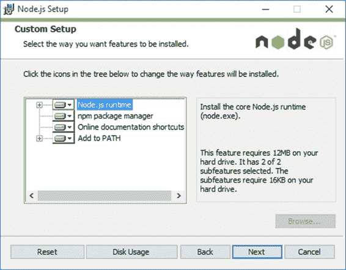

Keystone.js 是一个 Node.js web 框架，用于开发数据库驱动的网站、应用程序和 RESTful APIs。该框架建立在 Express.js 和 MongoDB 之上，遵循模型-视图-模板的设计模式。Express.js 是基于 Node.js 的应用程序事实上的 web 应用服务器框架。MongoDB 是一个非常受欢迎的 NoSQL 数据库。Keystone.js 是免费的开源软件。该框架做了大量繁重的工作，允许开发人员专注于干净快速的开发。

Keystone.js 与 Node.js 应用程序一样，强调组件的可重用性和模块化。该框架使得管理应用程序模板、视图和路由变得非常容易。JavaScript 始终用于配置、文件和数据模型开发。该框架有助于最常见的 web 任务，如身份验证、内容管理、会话管理、电子邮件发送和许多其他任务。

该框架提供了一个自动管理界面，可用于创建、读取、更新和删除应用程序中的数据。管理图形用户界面是通过检查模型和用户选项动态生成的。开发人员可以使用 20 多种内置字段类型，这些类型提供了从文本、日期、地理位置和 HTML 到上传到亚马逊 S3 或微软 Azure 的图像和文件的数据管理功能。

更多信息请访问[官方网站](http://keystonejs.com/)。

Node.js 是一个开源的跨平台运行时环境，最常用于开发基于 JavaScript 的服务器端 web 应用程序。由于 Node.js 在单线程上处理请求的异步模型，它正在成为构建高性能和可伸缩 web 应用程序的一个非常受欢迎的工具。Node.js 可以安装在各种各样的操作系统上，包括 Windows、Linux 和 Mac OS。这本书将主要关注在 Windows 环境中运行节点上的 Keystone.js。

要安装 Node.js:

1.  访问 Node.js 官网的[下载页面](https://nodejs.org/en/download/)。
2.  点击下载链接获取最新稳定版本。Windows 32 位或 64 位下的 MSI，具体取决于你的机器架构。
3.  下载完成后，双击安装程序文件，这将启动 Node.js 安装程序。继续执行安装向导的每个步骤。


图 1:节点安装程序

在安装期间的自定义安装屏幕上，确保向导安装了 NPM(节点包管理器)并配置了路径环境变量以及安装了 Node.js 运行时。默认情况下，所有安装都应启用此功能。



图 2:自定义设置屏幕

完成这些步骤后，节点和 NPM 都应该安装在您的系统上。

**测试 Node.js 是否安装正确**

在新的命令提示符窗口中运行以下命令。您可能需要打开命令提示符的新实例，以使 PATH 变量更改生效。我们应该在屏幕上看到版本输出。


图 3:节点和 NPM 版本检查

MongoDB 是一个开源的、面向文档的数据库，旨在既可扩展又易于使用。MongoDB 使用动态模式将数据存储在类似 JSON 的文档中，而不是像关系数据库(如 MySQL)那样将数据存储在表和行中。

|  | 提示: [MLab](http://mlab.com/) 为 MongoDB 提供了一个免费的托管沙箱，可以作为测试场地，而不是在本地安装 MongoDB。 |

要在本地安装 MongoDB:

1.  导航至 [MongoDB 下载页面](http://www.mongodb.org/downloads)。
2.  根据您的机器架构，单击下载链接获取最新的 zip 存档或 Windows 32 位或 64 位下的 MSI。
3.  下载完成后，将内容解压到 **C:\mongodb** 下的文件夹中，或者使用 MSI 安装到程序文件中。
4.  创建默认数据库路径( **C:\data\db** )。这是 MongoDB 使用的数据库文件将驻留的位置。
5.  要启动 MongoDB 数据库，请打开一个 CMD 提示窗口，并输入以下代码(您可能必须允许通过防火墙进行访问)。

代码清单 1:启动 MongoDB

```
  C:\Program
  Files\MongoDB\Server\3.2\bin>mongod.exe

```


图 4:启动 MongoDB 服务器

Yeoman 是一套自动化开发工作流的工具。它构建了一个新的应用程序，编写了构建配置，引入了构建任务和构建所需的 NPM 依赖关系。Keystone.js 提供了一个非常方便的 Yeoman 生成器来生成一个新项目。

要安装 Yeoman，请在命令提示符下发出以下命令。

代码清单 2:安装约曼

```
  c:\> npm install
  -g yo

```

接下来，要安装 Yeoman keystone 应用程序生成器，请使用以下命令。

代码清单 3:为 keystone 安装 Yeoman 生成器

```
  c:\> npm install
  -g generator-keystone

```

这将生成器作为一个全局包安装，并且可以用来生成新项目，而不需要重新安装 Keystone.js 生成器。

我们已经到了第一章的结尾。建立一个开发环境是一个非常重要的任务，我们就是这么做的。我们已经讨论了开始使用 Keystone.js 应用程序框架的必要要求。向前！