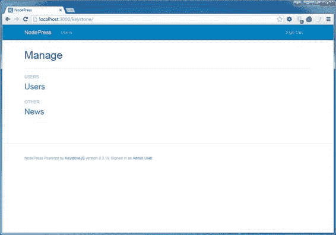
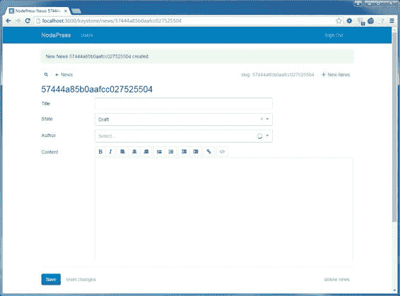
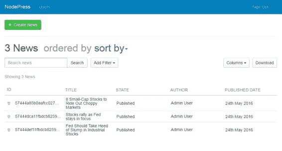
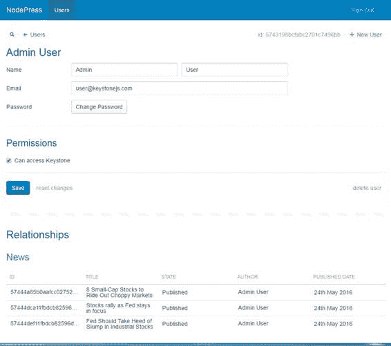

Keystone.js 附带的 Mongoose 对象文档映射器(ODM)为使用 MongoDB 数据库提供了一个漂亮、简单的 API 实现。每个数据库集合都有一个相应的“模型”，用于与该集合进行交互。模型允许您查询 Mongo 集合中的数据，以及向集合中插入新文档。

Mongoose 为文档数据库中的数据提供了一个抽象和通用的接口。ODM 使得在 JavaScript 对象和底层 Mongo 文档之间转换数据变得非常容易。

使用 Keystone.js，创建一个模型就像定义一个 JavaScript 文件并指定分配给该文件的许多属性一样简单。让我们从新闻条目的一个非常基本的模型开始。在项目的**模型**目录中创建新文件 **News.js** ，并输入以下代码。

代码清单 10:新闻. js 模型

```
  var keystone = require('keystone');
  var Types = keystone.Field.Types;

  /**
   *
  News Model
   *
  ==========
   */

  var News = new keystone.List('News',
  {

  autokey: { path: 'slug', from: 'title', unique: true }
  });

  News.add({

  title: { type: String, required: false },

  state: { type: Types.Select, options: 'draft, published, archived', default: 'draft', index: true },

  author: { type: Types.Relationship, ref: 'User', index: true },

  publishedDate: { type: Types.Date, index: true,
  dependsOn: { state: 'published' } },

  content: { type: Types.Html, wysiwyg: true,
  height: 400 }
  });

  News.defaultColumns
  = 'title, state|20%,
  author|20%, publishedDate|20%';
  News.register();

```

有很多事情正在发生，所以让我们从`require`语句开始，一路向下。我们首先导入标准的 Keystone 库，并获取对`Keystone`字段类型的引用。

接下来是`News`模型定义。我们的`News`模型是一个物体，是`keystone.List`的一个实例。通过依赖`keystone.List`，我们的`News`对象将继承各种帮助器，我们将使用它们来查询数据库。

在向`News`模型添加字段之前，我们将模型的名称定义为列表的第一个参数——在我们的例子中为`News`。第二个参数是一个对象，可用于将行为分配给`News`模型。`autokey`选项用于为模型生成 slugs，我们将使用它为我们的新闻条目提供一些不错的 URL。该网址由文章标题生成，可通过新闻文章的`slug`属性访问。如果唯一选项设置为`true`，Keystone.js 将验证是否存在与输入的文章标题相同的文章。这是防止重复新闻的简单方法。

每个帖子中可以有多个字段，用于输入相关数据。`News`模型的属性是我们希望存储在数据库中的名称和数据的简单映射。它们如下所示:

*   `Title` **:** 此字段可保存字符串，用于存储新闻帖子标题。必需的选项对于在保存字段之前验证字段是否有值非常有用。数据库索引也用于实现这一点。
*   `State` **:** 这是保存新闻帖子状态的字段。我们使用选择字段类型，因此该字段的值可以设置为给定的选项之一。默认选项设置为`draft`状态。
*   `Content` **:** 这是用于存储车票描述的字段。`Text area`字段类型将在管理界面中显示一个文本区域。
*   `Author` **:** 此字段将保存创建新闻帖子的用户的参考。该字段就像一个外键，它定义了关系数据库中的多对一关系。此字段在管理用户界面中显示为自动建议文本框，允许我们选择单个用户。将`many`选项设置为`false`表示只能选择一个用户。将`index`选项设置为`true`将告诉 Keystone.js，我们对为该字段创建的数据库索引感兴趣。`categories`字段的设置类似于`relationship`字段。
*   `PublishedDate` **:** 此日期时间字段指示用户创建新闻帖子的时间。由于我们使用的是`Date.now`的默认值，所以在创建新的帖子对象时，日期会自动保存。

`defaultColumns`选项允许您设置您想要在管理列表页面中显示的模型字段。默认情况下，仅显示对象标识。在代码清单 10 中，我们将`title`、`state`、`author`和`publishedDate`指定为在管理界面中显示的默认列，其中`state`、`author`和`publishedDate`被赋予列宽。在我们的`keystone.js`列表中注册的调用使用我们设置的任何属性和选项来完成模型。

重新启动应用程序并刷新管理页面。您应该看到管理新闻项目的选项，如图 11 所示。



图 11:在管理界面中管理新闻

点击**新闻**并用绿色**创建新闻**按钮添加新的新闻项目。您将获得一个自动生成的用户界面，其中包含在`News`模型中定义的所有字段。



图 12:在管理界面中管理新闻

时间戳

列表初始化选项中的`track`选项允许我们跟踪何时以及谁创建和最后更新了一个项目。

代码清单 11:在 News.js 模型上指定跟踪选项

```
  var keystone = require('keystone');
  var Types = keystone.Field.Types;

  /**
   *
  News Model
   *
  ==========
   */
  var News = new keystone.List('News',
  {

  autokey: { path: 'slug', from: 'title', unique: true },

  /* Automatic change
  tracking */

  track: true
  });

```

这些字段会自动添加:

*   `CreatedAt`:启用新闻帖子创建时间的跟踪。
*   `CreatedBy`:启用跟踪哪个用户创建了新闻。
*   `UpdatedAt`:启用跟踪新闻帖子上次更新的时间。
*   `UpdatedBy`:启用跟踪哪个用户最后更新了新闻帖子。

注册轨道功能的另一种方法是使用`News`列表中的`track`属性。

代码清单 12:在 News.js 模型上指定跟踪选项

```
  News.track = true;

```

集合名称

注意，我们没有告诉 Keystone.js 我们的`News`模型使用哪个 MongoDB 集合。除非明确指定另一个名称，否则模型的复数名称将用作集合名称。因此，在这种情况下，Keystone.js 将假设`News`模型将文档存储在`News`集合中。您可以通过在模型上定义架构属性来指定自定义集合。

代码清单 13:为 News.js 模型指定自定义集合

```
  var keystone = require('keystone');
  var Types = keystone.Field.Types;

  /**
   *
  News Model
   *
  ==========
   */

  var News = new keystone.List('News',
  {

  autokey: { path: 'slug', from: 'title', unique: true },

  track: true,

  /* custom collection
  name */

  schema: { collection: 'mynews' }
  });
  ….

```

主键

Keystone.js 将假设每个文档都有一个名为`_id`的主键列，它保存着 MongoDB 对象标识。此字段通常用于查询和查找相关文档。

应用程序中的每个模型都可以通过几种方式与另一个模型相关联。它们可能在一对多关系或多对多关系下联系在一起。

当一个模型文档可以与另一个单一模型的多个文档相关联时，使用一对多关系。例如，一个用户可以创作许多新闻帖子，一个新闻帖子只能属于一个用户。

要定义一对多关系，请使用以下代码。

代码清单 14:news . js 模型的一对多关系

```
  var keystone = require('keystone');
  var Types = keystone.Field.Types;

  /**
   *
  News Model
   *
  ==========
   */

  News.add({

  author: { type: Types.Relationship, ref: 'User', index: true, many: false }
  });

```

我们已经在`News`模型上定义了新闻帖子和用户之间的关系。该字段的类型为`Types.Relationship`，`ref` 选项被设置为`User`模型，这表示它所关联的模型。将`many`选项设置为`false`表示我们只能为该字段选择一个用户。

重新启动应用程序并添加一些新闻项目。`author`列应根据关系填充。



图 13:与新闻相关的作者

为了表示双方的关系，我们也可以在用户模型上定义关系。我们可以通过在用户模型上调用`relationship`方法来做到这一点。将下面的行添加到用户模型中。

代码清单 15:user . js 模型的一对多关系

```
  var keystone = require('keystone');
  var Types = keystone.Field.Types;

  /**
   *
  User Model
   *
  ==========
   */
  User.relationship({
  path: 'news', ref: 'News', refPath: 'author' });

```

*   `path` **:** 该选项定义模型上关系引用的路径。
*   `ref` **:** 该选项是引用模型(有关系字段的模型)的关键。
*   `refPath`:该选项指定引用模型中引用关系的字段。

单击管理员用户，您应该会在“关系”部分看到该用户创作的新闻文章列表。



图 14:与单个作者相关的新闻

多对多模型关系被定义为一对多关系，除了设置为`true`的`many`选项。Keystone.js 提供了一个直观的输入标签用户界面以及自动建议来添加多对多关系数据。

存储在 MongoDB 集合中的每个记录都被称为文档。MongoDB 支持 20 种数据类型在文档中存储信息，包括以下类型:

*   `String`
*   `Number`
*   `Date`
*   `Buffer`
*   `Boolean`
*   `Mixed`
*   `ObjectId`
*   `Array`

这些数据类型足以存储原始数据，但随着应用程序的增长，使用它们会变得非常困难。Keystone.js 通过用高级功能包装基本数据类型并将其称为字段类型来解决这个问题。有相当多的字段类型可用，它们使用起来非常简单。我们在前面定义`News`模型时已经使用了其中的一些。可用的字段类型有:

*   `Text`
*   `Boolean`
*   `Code`
*   `Color`
*   `Date`
*   `Datetime`
*   `Email`
*   `Html`
*   `Key`
*   `Location`
*   `Markdown`
*   `Money`
*   `Name`
*   `Number`
*   `Password`
*   `Select`
*   `Text`
*   `Textarea`
*   `Url`
*   `AzureFile`
*   `CloudinaryImage`
*   `CloudinaryImages`
*   `Embedly`
*   `LocalFile`
*   `S3 File`

某些字段类型包括有用的下划线方法，这些方法可用于以下划线开头的字段名称处的项目。例如:使用像代码清单 16 中那样的`News`模型的`publishedDate` `DateTime`字段的格式下划线方法。

代码清单 16:keystone . js 字段中的下划线方法

```
  console.log(news._.publishedDate.format('Do
  MMMM YYYY')); // 25th May 2016

```

虚拟属性

虚拟属性允许我们在从模型中检索数据或设置其值时格式化字段中的数据。虚拟属性被添加到基础 Mongoose 模式中。让我们添加一个虚拟属性，返回新闻发布的年份。

代码清单 17:在新闻模型上定义虚拟属性

```
  News.schema.virtual('publishedYear').get(function () {

  return this._.publishedDate.format('YYYY')
  });

```

虚拟属性的优势在于，它们不会持久保存到 MongoDB 中保存的文档中，但在作为查询结果检索的文档中是可用的。`virtual`属性可以类似于规则定义的属性来使用，如代码清单 18 所示。

代码清单 18:显示一个虚拟属性

```
  console.log(newsItem.publishedYear);

```

虚拟方法

虚拟方法类似于虚拟属性，并被添加到列表的模式中。如果需要，可以从模板中调用这些方法。一个很好的例子是一种可以将格式良好的 URI 返回给新闻项目的方法。

代码清单 19:在新闻模型上定义虚拟方法

```
  News.schema.methods.url = function () {
      return '/newsdetail/' + this.slug;
  };

```

前后挂钩

Keystone.js 清单利用了底层的 mongose`pre`和`post`中间件。这些方法是在模型上定义的，并且在某个操作之前或之后由框架自动调用。一个常见的例子是`pre`和`post` `save`钩子，它们用于在数据保存到 MongoDB 集合之前操纵模型中的数据。

例如，在我们的`News`模型中，当状态更改为“已发布”时，我们可能希望自动设置`publishedDate`值(但前提是尚未设置)。

我们可能还想添加一个检查帖子是否发布的方法，而不是直接检查`state`字段值。

在调用`News.register()`之前，我们将添加以下代码。

代码清单 20:保存前挂钩

```
  News.schema.methods.isPublished
  = function () {

  return this.state
  == 'published';
  }

  News.schema.pre('save', function (next) {

  if (this.isModified('state') && this.isPublished() && !this.publishedDate) {

  this.publishedDate = new Date();

  }

  next();
  });

```

要查询数据，我们可以使用 Keystone.js 模型上的任何 Mongoose 查询方法。让我们看看将在视图中使用的查询(在接下来的章节中)。

正在检索所有新闻项目

要获取所有新闻条目，我们可以使用`find`方法。

代码清单 21:查找方法

```
  var q = keystone.list('News').model.find();

  q.exec(function(err, results) {

  var newsitems = results;

  next(err);
  });

```

按 slug 检索新闻项目:

要获取与`slug`匹配的新闻条目，我们可以使用代码清单 22 所示的`findOne`方法。`slug`可以从`req.params`集合中读取。

代码清单 22:带有过滤器的 FindOne 方法

```
  var q = keystone.list('News').model.findOne({'slug':req.params.slug})

  q.exec(function(err, results) {

  var newsitems = results;

  next(err);
  });

```

选择特定字段

为了获得最佳性能，总是建议构造只检索必要数据的查询。

代码清单 23:选择方法

```
  var q = keystone.list('News').model

  .findOne({'slug':req.params.slug})

  .select('title status
  author');

  q.exec(function(err, result) {

  var newsitem = result;

  next(err);
  });

```

计数结果

要计算与给定查询相关联的文档数量，请使用`count`方法。

代码清单 24:计数方法

```
  var q = keystone.list('News').model.count();

  q.exec(function(err, count) {

  console.log('There
  are %d news items',
  count);

  next(err);
  });

```

排序结果

`sort`方法可以与`find`方法结合使用，对查询结果进行排序。以下示例将按标题顺序检索所有新闻。

代码清单 25:排序方法

```
  var q = keystone.list('News').model.find().sort('title');

  q.exec(function(err, results) {

  var news = results;

  next(err);
  });

```

默认情况下，结果按升序排序。这种默认行为可以通过在用于排序的字段前加上减号来逆转。

代码清单 26:反向排序方法

```
  var q = keystone.list('News').model.sort('-title');

  q.exec(function(err, results) {

  var news = results;

  next(err);
  });

```

过滤结果

`where`方法可以有条件的找到我们感兴趣的属性的文档。多个`where`子句也可以链接在一起。在下面的例子中，让我们尝试检索状态为`published`的新闻条目。

代码清单 27: Where 子句

```
  var q = keystone.list('News').model

  .where('state').equals('published');

  q.exec(function(err, results) {

  var news = results;

  next(err);
  });

```

限制返回的结果

要检索一小部分文档，例如最近添加的十个新闻条目，我们可以使用`limit`方法。

代码清单 28:限制条款

```
  var q = keystone.list('News').model

  .limit(10);

  q.exec(function(err, results) {

  var news = results;

  next(err);
  });

```

如果您想要检索从某个偏移量开始的文档子集，您可以将`limit`方法与`skip`方法结合使用。以下示例将从第六条记录开始检索最近的十条新闻。

代码清单 29:带 skip 的 Limit 子句

```
  var q = keystone.list('News').model.skip(6)

  .limit(10);

  q.exec(function(err, results) {

  var news = results;

  next(err);
  });

```

测试字段的存在性

我们可以使用`exists`方法来确定特定文档是否包含字段，而无需实际加载它。例如，要确定一个空的新闻项目列表(即`content`字段在新闻 MongoDB 文档中不存在)，请使用以下语句。

代码清单 30: Exists 子句

```
  var q = keystone.list('News').model

  .where('content')

  .exists(false);

  q.exec(function(err, results) {

  var news = results; //list of news with
  missing content

  next(err);
  });

```

以编程方式插入文档

要创建和保存新文档，请使用`save`方法。您将首先创建所需模型的新实例，更新其属性，然后执行`save`方法。

代码清单 31:插入一个新文档

```
  var keystone = require('keystone')
  News
  = keystone.list('News');

  var newItem = new News.model();

  newItem.title
  = 'Credit Suisse,
  Leader in Global Cleared Derivatives';
  newItem.status
  = 'Published';
  newItem.description
  = 'The FIS
  Derivatives Utility was designed to help global capital markets firms better
  adapt to market challenges by enabling market participants.';

  newItem.save(function (err) {

  if (err) {

  console.error("Error
  adding News to the database:");

  console.error(err);

  } else {

  console.log("Added
  news “ + newItem.title
  + " to the
  database.");

  }

  done(err);
  });

```

保存后，新的`News`项目将具有基于标题生成的唯一的`slug`，因为在模型上设置了自动键选项。

以编程方式更新现有文档

为了更新现有文档，我们可以利用 Keystone.js `UpdateHandler`功能。这个过程通常包括使用标识符检索所需的文档，在文档上设置已更改的字段，并请求 Keystone.js 处理更新。

代码清单 32:更新现有文档

```
  var q = keystone.list('News').model.findOne({'slug':req.params.slug})

  q.exec(function(err, item) {

  if (err) return res.apiError('database error', err);

  if (!item) return res.apiError('not found');

  var data = req.body;

  item.getUpdateHandler(req).process(data, function (err) {

  if (err) return console.error('create error', err);

  console.log("Successfully
  updated the news item");

  });
  });

```

让我们假设我们通过表单帖子接收到了新闻条目的`slug`以及更改。代码清单 32 首先检索与所提供的`slug`匹配的新闻条目。如果找到该项，任何匹配的字段及其值(来自表单发布)都将被设置为数据对象。匹配新闻项目上的`getUpdateHandler`方法可以通过调用`process`方法来处理文档的更新。数据对象作为此方法的输入提供。

以编程方式删除文档

要删除文档，首先定位文档，然后使用`remove`方法。

代码清单 33:删除文档

```
  var keystone = require('keystone')
  News
  = keystone.list('News');

  var q = keystone.list('News').model.findOne({ 'slug': req.params.slug })

  .remove(function (err) {

  if (err) return res.apiError('database error', err);

  console.log("Successfully
  deleted the news item");

  });

```

在本章中，我们学习了如何创建和使用模型来保存、检索和操作数据。这些是所有 web 应用程序中最基本的操作，Keystone.js 让实现变得轻而易举。