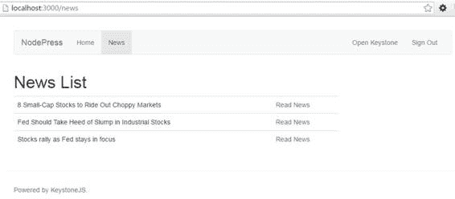
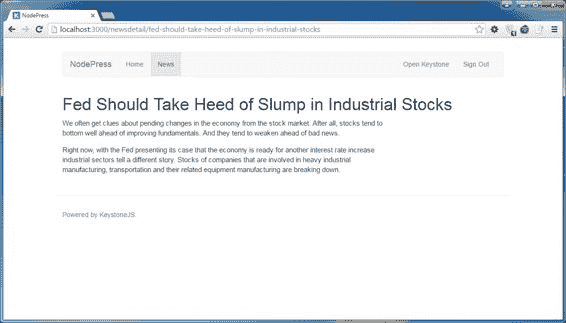
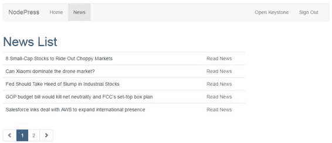

# 五、处理视图

到目前为止，我们已经看到了如何从数据库(模型)中检索数据，以及如何使用模板在浏览器上显示数据。缺少的部分是视图，它是模型和模板之间的链接。视图负责处理模板和数据库之间的数据传输。

视图是 JavaScript 模块，位于应用程序中**/路由/视图**的文件夹中。

路由可以被认为是描述向 web 应用程序发出请求的机制的 URL 模式。路由是 HTTP 请求方法(也称为 HTTP 动词)和用于在应用程序中定义 URL 的路径模式的组合。视图是由框架服务的路由的结果。

路由在位于 **/routes/index.js** 的文件中定义。

代码清单 53:简单的获取路径

```js
  app.get('/', function (req, res) {

  res.send('welcome to
  nodepress');
  });

```

代码清单 53 展示了一个简单的路线。路由定义内联函数应该作为在应用程序的根/路由处接收请求的结果来执行。HTTP 请求应该是`HTTP GET`。执行的函数接收请求和响应上下文对象作为输入。在本例中，字符串“`welcome to nodepress’`”作为响应的一部分输出到屏幕上。

Keystone.js 支持以下对应于 HTTP 方法的路由方法:

*   `get`
*   `post`
*   `put`
*   `head`
*   `delete`
*   `options`
*   `trace`
*   `copy`
*   `lock`
*   `mkcol`
*   `move`
*   `purge`
*   `propfind`
*   `proppatch`
*   `unlock`
*   `report`
*   `mkactivity`
*   `checkout`
*   `merge`
*   `m-search`
*   `notify`
*   `subscribe`
*   `unsubscribe`
*   `patch`
*   `search`
*   `connect`

最常用的 HTTP 动词是`GET`和`POST`。`POST`用于从 web 表单向服务器发送数据。以下示例说明了简单`POST`路由的语法。

代码清单 54:简单的开机自检路径

```js
  app.post('/addnews', function (req, res) {

  res.send('Received
  post to nodepress at addnews route');
  });

```

有一种特殊的路由方法，`app.all()`，它不是从任何 HTTP 方法派生的，而是可以用来响应任何 HTTP 动词上的传入请求。

代码清单 55:捕捉所有路线

```js
  app.all('/', function (req, res, next) {

  console.log('Will
  respond to all requests ...');

  next(); // pass control
  to the next handler
  });

```

列表视图用于显示包含最少信息的项目列表，并链接到详细视图以深入查看数据。让我们看看如何显示来自 MongoDB 数据库的新闻条目列表。

向应用程序添加以下路由。

代码清单 56:列表视图路由

```js
  app.get('/news', routes.views.newslist);

```

接下来，使用以下代码在**/路线/视图/新闻列表. js** 中定义`newslist`视图。

代码清单 57:列表视图

```js
  var keystone = require('keystone');
  var async = require('async');

  exports
  = module.exports = function (req, res) {

  var view = new keystone.View(req, res);

  var locals = res.locals;

  // Init locals

  locals.section = 'news';

  locals.data = {

  news: [] 

  };

  // Load all news

  view.on('init', function (next) {

  keystone.list('News').model.find().sort('title').exec(function (err, results)  {

  if (err || !results.length) {

  return next(err);

  }

  locals.data.news = results; 

  next(err);

  });

  });

  // Render the template

  view.render('newslist');

  };

```

视图是`keystone.View`对象的一个实例。该视图以排序的方式查询数据库中的所有新闻帖子。新闻项目存储在名为`data.news`的数组中。在视图的最后，我们调用`render`方法并传递模板的名称。该模板将与视图中的数据相结合，并发送回浏览器进行呈现。

代码清单 58:列表视图模板

```js
  

  
        <div
  class="container">
              <h1>News
  List</h1>
        </div>
  

  
        <div
  class="container">
              <div
  class="row">
                    <div
  class="col-sm-8 col-md-9">

        

              <div
  class="news">
              <table
  class="table">
              
              <tr>
              <td>{{news.title}}</td><td><a
  href='{{news.url()}}'>Read News</a></td>

  </tr>
              
              </table>
              </div>

        
                    </div>
              </div>
        </div>
  

```

模板使用 Swig `for`循环来渲染新闻帖子。呈现的输出将如图 15 所示。



图 15:新闻列表

让我们看看如何使用细节视图来显示新闻帖子的细节。首先为新闻细节创建一条路线。

向应用程序添加以下路由。

代码清单 59:列表视图路由

```js
  app.get('/newsdetail/:slug', routes.views.newsdetail);

```

`slug`在网址中被指定为参数。

接下来，使用以下代码在**/路线/视图/newsdetail.js** 中定义`newsdetail`视图。

代码清单 60:详细信息视图

```js
  var keystone = require('keystone');

  exports
  = module.exports = function (req, res) {

  var view = new keystone.View(req, res);

  var locals = res.locals;

  // Set locals

  locals.section = 'news';

  locals.filters = {

  slug: req.params.slug

  };

  locals.data = {

  news: ''

  };

  // Load the current
  news

  view.on('init', function (next) {

  var q = keystone.list('News').model.findOne({

  state: 'published',

  slug: locals.filters.slug

  }).populate('author');

  q.exec(function (err, result) {

  locals.data.news = result;

  next(err);

  });

  });

  // Render the template

  view.render('newsdetail');

  };

```

在**/模板/视图**文件夹下创建一个名为 **newsdetail.swig** 的模板，内容如下。

代码清单 61:细节模板

```js
  

  
        <div
  class="container">
              <h1>{{data.news.title}}</h1>
        </div>
  

  
        <div
  class="container">
              <div
  class="row">
                    <div
  class="col-sm-8 col-md-9">

                                

              <div
  class="news"> 
               {{data.news.content}} 
              </div>

                                
                    </div>
              </div>
        </div>
  

```

当`autoescape`属性设置为`false`时，HTML 将按原样显示，而不是作为 HTML 实体进行转义。输出将如图 16 所示。



图 16:新闻细节

Web 应用程序通常需要显示大量数据，使用分页是显示大块数据的一种方式，如果需要，还可以在链接后加载更多数据。

因为分页链接是应用程序中使用的一个特性，所以让我们创建应用程序模板目录中包含的分页。

在**/模板/视图**中创建新的模板文件，命名为 **page_links.swig** 。keystone . js paging 返回给我们一个对象，我们可以从中确定模板中我们在哪个页面上，总共有多少页。

代码清单 62:分页链接

```js
  
  <ul
  class="pagination">
  
        <li>
              <a
  href="?page={{ data.news.previous }}">
                    <span
  class="glyphicon glyphicon-chevron-left"></span>
              </a>
        </li>
  
        <li
  class="disabled">
              <a
  href="?page=1">
                    <span
  class="glyphicon glyphicon-chevron-left"></span>
              </a>
        </li>
  
        
              <li
  class="active">
                    <a
  href="?page={{
  data.news.totalPages }}1{{ p }}">{{ p }}</a>
              </li>
        
  
        <li>
              <a
  href="?page={{ data.news.next }}">
                    <span
  class="glyphicon glyphicon-chevron-right"></span>
              </a>
        </li>
  
        <li
  class="disabled">
              <a
  href="?page={{ data.news.totalPages }}">
                    <span
  class="glyphicon glyphicon-chevron-right"></span>
              </a>
        </li>
  
  </ul>
  

```

Keystone.js 提供了一个非常简单的 API，只需几行代码就能以分页的方式从 MongoDB 中获取数据。让我们更新`newslist.js`视图以获取分页对象中的新闻。

代码清单 63:分页视图

```js
  var keystone = require('keystone');

  exports
  = module.exports = function (req, res) {

  var view = new keystone.View(req, res);

  var locals = res.locals;

  // Set locals

  locals.section = 'news';

  locals.filters = {

  slug: req.params.slug

  };

  locals.data = {

  news: ''

  };

  // Load the current
  news

  view.on('init', function (next) {

  var q = keystone.list('News').model.findOne({

  state: 'published',

  slug: locals.filters.slug

  }).populate('author');

  q.exec(function (err, result) {

  locals.data.news = result;

  next(err);

  });

  });

  // Render the view

  view.render('newsdetail');

  };

```

接下来，更新`newslist.swig`显示分页链接。

代码清单 64:分页模板

```js
  

  
  <div
  class="container">
  <h1>News
  List</h1>
  </div>
  

  
  <div
  class="container">
  <div
  class="row">
  <div
  class="col-sm-8 col-md-9">

  

  <div
  class="news">
        <table
  class="table">
        
        <tr>
              <td>{{news.title}}</td><td><a
  href='{{news.url()}}'>Read News</a></td>
        </tr>
        
        </table>
  </div>
  
  
  </div>
  </div>
  </div>
  

```

重新启动应用程序，分页链接应该如下图所示。



图 17:分页链接

Keystone.js 分页对象返回了许多有用的元数据和结果:

*   `total` **:** 所有匹配结果(不只是这一页)。
*   `results` **:** 此页面结果数组。
*   `currentPage` **:** 当前页面的索引。
*   `totalPages` **:** 总页数。
*   `pages` **:** 要显示的页面数组。
*   `previous` **:** 上一页索引；如果在第一页，则为 false。
*   `next` **:** 下一页的索引，如果在最后一页则为假。
*   `first` **:** 第一个结果的指数包含在内。
*   `last` **:** 最后一个结果的指数包含在内。

**/公共**目录保存与网络应用程序相关的静态内容，如图像、CSS、字体和 JavaScript。框架中包含的`LESS`处理器将确保在运行时将与网络应用程序相关联的`LESS`文件编译为 CSS 文件。

由于 Keystone.js 使用 Express 中的`express.static`内置中间件功能来服务静态资产，所以我们引用资产时就像它们驻留在应用程序的根中一样，如代码清单 65 所示。

代码清单 65:CSS 链接

```js
  <link
  href="/styles/nodepress.css" rel="stylesheet">

```

样式文件夹必须位于**/公共**文件夹中。

在本章中，我们能够理解应用程序中数据模型、视图、模板和 URL 之间的联系，包括对象分页。