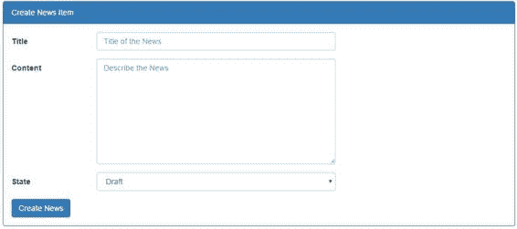
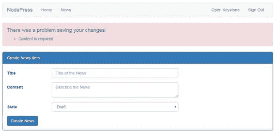

# 六、表单和验证

让我们看看如何使用表单直接修改`nodepress`的内容。我们将创建使用`News`模型的表单，学习如何接收和验证用户数据，最后更新数据库中的值。

让我们创建一个表单，经过身份验证的用户可以在其中创建一个新的`News`项目。我们将创建一个发布到服务器的表单。创建一个名为**的新模板，点击**保存我们的网页表单，将其放入**/模板/视图/** 文件夹中，然后重建项目。

代码清单 66:创建新闻表单

```js
  

  

  <div
  class="container">
        <div
  class="panel panel-primary">

  <!-- Default panel contents -->

  <div class="panel-heading">Create News Item</div>

  <div class="panel-body">

  <form class="form-horizontal custom-form"
  action="/createnews" method="post">

  <div class="form-group">

  <div class="col-sm-2 label-column">

  <label for="name-input-field"
  class="control-label">Title </label>

  </div>

  <div class="col-sm-6 input-column has-error">

  <input type="text" name="title"
  placeholder="Title of the News" class="form-control"
  value="{{form.title}}" />

  </div>

  </div>

  <div class="form-group">

  <div class="col-sm-2 label-column">

  <label for="email-input-field"
  class="control-label">Content </label>

  </div>

  <div class="col-sm-6 input-column" has-error>

  <textarea name="description" placeholder="Describe the
  News"
  class="form-control">{{form.content}}</textarea>

  </div>

  </div>

  <div class="form-group">

  <div class="col-sm-2 label-column">

  <label for="" class="control-label">State
  </label>

  </div>

  <div class="col-sm-6 input-column">

  <select class="form-control" name="state">

  <option value="draft"  selected>Draft</option>

  <option value="published" 
  selected>Published</option>

  <option value="archived" 
  selected>Archived</option>

  </select>

  </div>

              </div>

  <input type="submit" class="btn btn-primary
  submit-button" value="Create News"/>

  </form>

  </div>

  </div>
  </div>
  

```

该表单如下图所示。



图 18:创建新闻表单

形式很简单。我们为`News`模型上的每个模型字段提供了 HTML 表单字段。

向路由索引文件添加路由。

代码清单 67:创建新闻路线

```js
  app.all('/createnews',
  middleware.requireUser, routes.views.createnews);

```

如您所见，我们正在利用`requireUser`中间件来确保我们的用户在能够创建新闻项目之前首先登录到应用程序。

我们的视图将执行所有输入验证，并将在响应中填充`validationErrors`(如果有)。在**/路线/视图**文件夹下为我们的视图创建一个名为 **createnews.js** 的文件。

代码清单 68:创建新闻视图

```js
  var keystone = require('keystone'),

  News = keystone.list('News');

  exports
  = module.exports = function (req, res) {

  var view = new keystone.View(req, res),
              locals
  = res.locals;

  locals.form = req.body;

  locals.data = {

  users: []

  };

  view.on('init', function (next) {

  var q = keystone.list('User').model.find().select('_id username')

  q.exec(function (err, results) {

  locals.data.users = results;

  next(err);

  });

  });

  view.on('post', function (next) {

  var newNews = new News.model(),
              data
  = req.body;

  data.author = res.locals.user.id;

  newNews.getUpdateHandler(req).process(data, {

  flashErrors: true,

  }, function (err) {

  if (err) {

  locals.validationErrors = err.errors;

  } else {

  req.flash('success', 'Your news item has been created!');

  return res.redirect('/news/' + newNews.slug);

  }

      next();

  });

  });

  // Render the view

  view.render('createnews');

  };

```

`getUpdateHandler`方法将根据模型定义进行验证。通过在模板中应用引导`has-error` CSS 类，我们可以使用下面的代码片段来突出显示任何验证失败的字段。

代码清单 69:引导错误 CSS

```js
  has-error"

```

闪存错误用于显示发生的所有错误的汇总。下图显示了闪存错误的示例。



图 19:闪存错误

为了在服务器端接收表单数据，我们使用了 HTTP 帖子上的请求正文。模型实例上的`getUpdateHandler`方法可以接收后期数据，并在数据库中创建一个新条目。从表单发布中读取的输入数据中的对象键必须与模型中定义的字段相匹配，这一点很重要。

在本章中，我们学习了在 Keystone.js 应用程序中集成表单的简单性。Keystone.js 表单验证可以非常方便地在任何应用程序中实现复杂的表单。