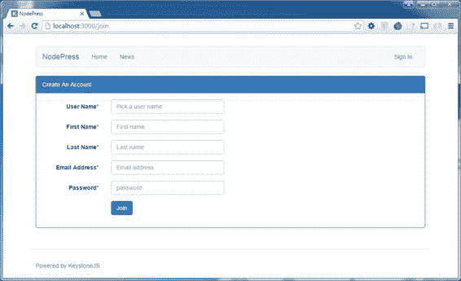
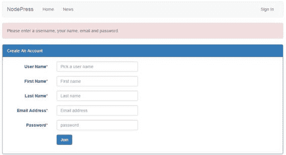
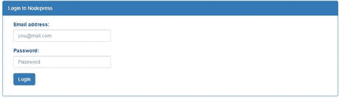

大多数动态 web 应用程序都允许某种用户身份验证和偏好保存功能。让我们看看如何允许用户创建一个帐户，并从我们的 Keystone.js 应用程序登录和退出。

会话用于通过 cookies 跟踪服务器端和客户端的用户活动。它们通常用于保存身份验证数据和用户首选项。会话可以存储在内存中，也可以持久化到存储中，如 MongoDB 或 Redis。Keystone.js 支持通过`connect-mongo`库在 MongoDB 中存储会话。我们还可以将会话保存到内存、Redis、Memcached 或我们可以实现的自定义会话存储中。

在使用会话功能之前，需要设置一些配置选项。这些选项应该在 **keystone.js** 文件中的`keystone.init()`功能中设置。配置选项包括:

*   `session` **:** 如果您希望您的应用程序支持会话管理，请将此选项设置为`true`。
*   `auth` **:** 该选项指示是为 keystone 的 Admin UI 启用内置身份验证，还是使用自定义功能对用户进行身份验证。
*   `user model` **:** 该选项向 Keystone.js 指示将使用哪个模型来维护用户信息。
*   `cookie secret` **:** 使用此选项指定用于 cookies 的加密密钥。
*   `session store` **:** 标识使用哪个会话存储选项(内存中、mongo 等)。).

要使用 MongoDB 作为会话存储，我们需要安装`connect-mongo`，如图所示。

代码清单 70:安装 connect-mongo

```
  npm
  install connect-mongo –save

```

启用基于会话的身份验证选项后，让我们定义将用于身份验证的路由。将以下路由添加到路由索引文件中。

代码清单 71:身份验证路由

```
  app.all('/join',
  routes.views.join);
  app.all('/signin',
  routes.views.signin);
  app.get('/signout',
  routes.views.signout);

```

创建帐户

允许用户创建帐户的第一步是显示注册表单。在**模板/视图**文件夹中创建一个名为 **join.swig** 的文件，内容如下。

代码清单 72:注册表单标记

```
  

  
  <div
  class="container">

  <div class="panel panel-primary">

  <div class="panel-heading">Create An Account</div>

  <div class="panel-body">

  <div class="col-md-6">

  <form action="/join" method="post"
  class="form-horizontal">

  <fieldset>

  <div class="form-group required">

  <label class="col-md-4 control-label">User
  Name*</label>

  <div class="col-md-8">

       <input class="form-control" id="username"
  placeholder="Pick a user name" name="username"
  type="text" value="{{form.username}}">

  </div>

  </div>
              <div
  class="form-group required">

  <label class="col-md-4 control-label">First Name*</label>

  <div class="col-md-8">

  <input class="form-control" id="firstname"
  placeholder="First name" name="firstname"
  type="text" value="{{form.firstname}}">

  </div>

  </div>
              <div
  class="form-group required">

       <label class="col-md-4 control-label">Last
  Name*</label>

  <div class="col-md-8">

  <input class="form-control" id="lastname"
  placeholder="Last name" name="lastname"
  type="text" value="{{form.lastname}}">

  </div>

  </div>
              <div
  class="form-group required">

  <label class="col-md-4 control-label">Email
  Address*</label>

  <div class="col-md-8">

  <input class="form-control" id="email"
  placeholder="Email address" name="email"
  type="email" value="{{form.email}}">

  </div>

  </div>
              <div
  class="form-group required">

  <label class="col-md-4 control-label">Password*</label>

  <div class="col-md-8">

  <input class="form-control" id="password"
  name="password" placeholder="password"
  type="password">

  </div>

  </div> 
              <div
  class="form-group">

  <label class="col-md-4 control-label"></label>

  <div class="col-md-8">

  <div style="clear:both"></div>

  <button class="btn btn-primary"
  type="submit">Join</button> 

  </div>

  </div>

  </fieldset>

  </form>

  </div>
   </div>
    </div>

  </div>                
   

```

呈现的标记如下图所示。



图 20:创建帐户表单

在**/路线/视图**目录下创建名为 **join.js** 的视图，代码如下。

代码清单 73:注册视图

```
  var keystone = require('keystone'),
        async
  = require('async');

  exports
  = module.exports = function (req, res) {

  if (req.user) {

  return res.redirect('/');

  }

  var view = new keystone.View(req, res),
              locals
  = res.locals;

  locals.section = 'createaccount';

  locals.form = req.body;

  view.on('post', function (next) {

  async.series([

                    function (cb) {

  if (!req.body.username ||
  !req.body.firstname || !req.body.lastname || !req.body.email ||
  !req.body.password) {

  req.flash('error', 'Please enter a username, your name, email and
  password.');

  return cb(true);

  }

  return cb();

                    },

  function (cb) {

  keystone.list('User').model.findOne({ username:
  req.body.username }, function (err, user) {

  if (err || user) {

  req.flash('error', 'User already exists with that Username.');

  return cb(true);

  }

  return cb();

  });

  },

                    function (cb) {

  keystone.list('User').model.findOne({ email:
  req.body.email }, function (err, user) {

  if (err || user) {

  req.flash('error', 'User already exists with that email address.');

  return cb(true);

  }

  return cb();

  });

                    },

                    function (cb) {

  var userData = {

  username: req.body.username,

  name: {

  first: req.body.firstname,

  last: req.body.lastname,

  },

  email: req.body.email,

  password: req.body.password

  };

  var User = keystone.list('User').model,
                                newUser
  = new User(userData);

  newUser.save(function (err) {

  return cb(err);

  });

                    }

  ], function (err) {

  if (err) return next();

  var onSuccess = function () {

  res.redirect('/');

      }

  var onFail = function (e) {

  req.flash('error', 'There was a problem signing you up, please try
  again.');

  return next();

  }

  keystone.session.signin({ email: req.body.email, password: req.body.password
  }, req, res, onSuccess, onFail);

  });

  });

  view.render(join');

  }

```

该视图使用了出色的`async`库，可以连续执行多个操作。第一个(匿名)函数检查表单输入是否已经填充。`next`方法检查表单上输入的用户名是否已经存在。如果它存在，我们会向用户返回一个错误。系列操作至此结束。`next`方法检查是否存在具有相同电子邮件地址的现有用户。

所有这些操作成功完成后，用户对象将被构造并保存到数据库中。成功后，将调用登录用户的代码，并将用户重定向到主页。

要测试由于表单验证失败而呈现错误消息的 flash 消息，请提交表单，不要填写任何值。错误应该如下图所示。



图 21:表单验证错误

由于我们使用`app.all`方法来定义路线，`GET`和`POST`都指向单个动作 URL。在`GET`期间，表单被渲染，在`POST`期间，表单被验证。

签到

现在，用户可以创建一个帐户，让我们看看显示一个登录表单，用户可以在其中验证自己。在名为**登录. swig** 的新文件中添加以下代码，并将其保存在**模板/视图**文件夹下。

代码清单 74:登录标记

```
  

  

  <div
  class="container">

  <div class="panel panel-primary">

  <!-- Default panel contents -->

  <div class="panel-heading">Login to Nodepress</div>

  <div class="panel-body">

  <div class="col-md-4">

  <form role="form" action="/signin"
  method="post">

  <div class="form-group">

  <label for="sender-email"
  class="control-label">Email address:</label>

  <div class="input-icon">  

  <input class="form-control email" id="signin-email"
  placeholder="you@mail.com" name="email"
  type="email" value="">

  </div>

  </div>

  <div class="form-group">

  <label for="user-pass"
  class="control-label">Password:</label>

   <div class="input-icon"> 

  <input type="password" class="form-control"
  placeholder="Password" name="password"
  id="password">

  </div>

  </div>

  <div class="form-group">

  <input type="submit" class="btn btn-primary "
  value="Login">    

  </div>

  </form>

  </div>

  </div>

  </div>
  </div>

  

```

我们的登录表单的标记非常简单。我们已经为用户的电子邮件地址和密码定义了输入字段。表单将`POST`转到`/signin`网址。如果在用户身份验证过程中出现错误，例如无效的电子邮件或密码，我们将使用 Keystone.js 提供的`FlashMessages.renderMessages`静态方法显示这些错误。我们在布局文件**/模板/布局/默认刷新**中包含了以下代码来呈现 flash 消息。

代码清单 75: Flash 消息

```
  {{
  FlashMessages.renderMessages(messages) }}

```

使用以下代码在**/路线/视图**目录下创建名为**sign . js**的视图。

代码清单 76:登录视图

```
  var keystone = require('keystone'),
        async
  = require('async');

  exports
  = module.exports = function (req, res) {

  if (req.user) {

  return res.redirect('/mytickets');

  }

  var view = new keystone.View(req, res),
              locals
  = res.locals;

  locals.section = 'signin';

  view.on('post', function (next) {

  if (!req.body.email ||
  !req.body.password) {

  req.flash('error', 'Please enter your email and password.');

  return next();

  }

  var onSuccess = function () {

  res.redirect('/);

  }

  var onFail = function () {

  req.flash('error', 'Input credentials were incorrect, please try again.');

  return next();

  }

  keystone.session.signin({ email: req.body.email, password: req.body.password
  }, req, res, onSuccess, onFail);

  });

  view.render('signin');

  }

```

在视图中，我们检查用户是否已经登录。如果他们已经登录，我们会将用户重定向到主页。如果用户没有登录并提交了登录表单，我们将处理登录请求。为了验证表单内容，我们检查用户是否提供了电子邮件地址和密码。如果其中任何一个为空，我们将设置一个闪存错误来指示丢失的数据，并返回回调。如果用户提供了有效的凭证，那么该函数将重新生成一个新的会话并完成登录过程。

呈现的登录表单如下图所示。



图 22:登录表单

签名登记离开

要注销用户，我们应该调用`keystone.session.signout`方法。`signout`操作将清除用户的 cookies，将请求用户对象设置为空，并重新生成一个新会话。完成后，用户将被重定向到主页。

在**/路线/视图**目录下创建一个名为 **signout.js** 的视图，代码如下。

代码清单 77:注销视图

```
  var keystone = require('keystone');

  exports
  = module.exports = function (req, res) {

  keystone.session.signout(req, res, function ()
  {

  res.redirect('/');

  });
  };

```

Keystone.js 内置了中间件，可以作为请求和响应周期的一部分。这对于根据用户是否已经进行了身份验证来检查是否需要阻止或允许请求特别有用。

为了将对路由的访问限制为只有经过身份验证的用户才能访问，我们可以依赖 Keystone.js 中间件。中间件公开了一种`requireUser`方法，防止人们在未登录时访问受保护的页面。我们可以将中间件应用于如下路由。

代码清单 78:通过中间件保护路由

```
  app.all('/profile*',
  middleware.requireUser);

```

前一段代码在请求到达跟随`/profile`的任何路由之前应用`requireUser`方法。

中间件代码位于**路由/中间件. js** 文件中。`requireUser`方法的实现如下图所示。

代码清单 79:需要用户中间件

```
  /**
        Prevents
  people from accessing protected pages when they're not signed in.
   */

  exports.requireUser
  = function (req, res, next) {

  if (!req.user) {

  req.flash('error', 'Please sign in to access this page.');

  res.redirect('/keystone/signin');

  } else {

  next();

  }

  };

```

在本章中，我们研究了如何使用 Keystone.js 轻松设置身份验证系统。密码恢复和重置等功能也可以轻松实现。读者也应该看看使用 cookies 和跨站点请求伪造(CSRF)保护的安全应用程序，Keystone.js 促进了这一点。