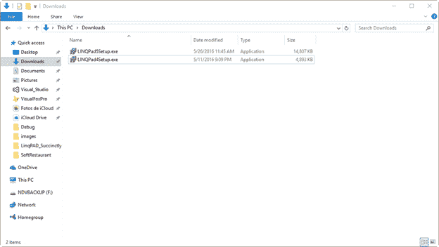
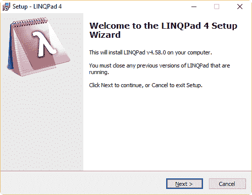
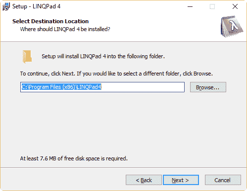
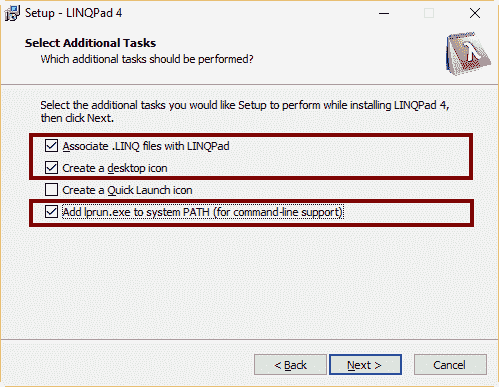
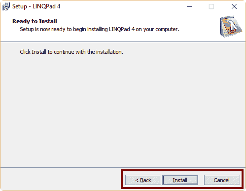
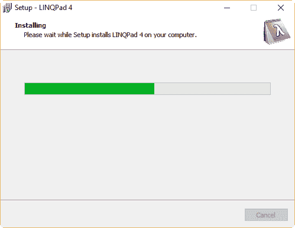
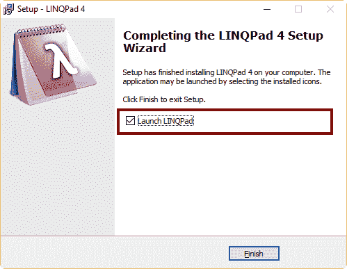

# 二、安装LINQPad

## 入门

LINQPad 可以安装在任何运行 Windows 的计算机上。以下要求适用于该产品。

硬件:

*   英特尔双核 1 千兆赫以上处理器
*   2 GB 内存(推荐 4 GB)
*   500 GB 硬盘
*   VGA 显示器(最低分辨率为 1024x768)
*   键盘和鼠标
*   互联网连接(用于下载产品)

软件:

*   Windows 7 SP1 或更高版本
*   。NET 框架 3.5/4.0/4.5/4.6
*   Visual Studio 2010 或更高版本(用于开发目的)

### LINQPad

LINQPad 可以从以下位置免费下载:

*   [linqpd 5](http://www.linqpad.net/GetFile.aspx?LINQPad5Setup.exe)
*   [linqpd 4](http://www.linqpad.net/GetFile.aspx?LINQPad4Setup.exe)

## LINQPad安装流程

正如前面在“什么是 LINQPad？”第 1 章的小节，LINQPad 4 和 LINQPad 5 都可以安装在同一台计算机上，它们可以并行工作。出于本节的目的，将详细介绍 LINQPad 4 的安装过程，但同样的过程也适用于 LINQPad 5。

要开始 LinkPad 安装，请从上一节列出的网址之一下载 LinkPad。然后，双击位于**下载**文件夹中的**LINQPad4Setup.exe**文件(或**LINQPad5Setup.exe**为 LINQPad5)。



图 2:下载文件夹中的 LINQPad 安装文件

出现的第一个对话框如下图所示。



图 3: LINQPad 安装的第一个对话框

点击**下一步**继续，出现选择目的地位置对话框。



图 4:选择目标位置对话框

建议您使用安装程序提供的默认位置。在这种情况下，点击**下一步**，出现选择附加任务对话框。



图 5:选择附加任务对话框

在此对话框中，您可以选择安装程序要执行的一组附加任务。这些任务包括将每个文件与。linq 扩展将由 LINQPad 打开，为程序创建桌面图标，在快速启动栏中创建和图标，并将 lprun.exe 命令添加到 PATH 系统变量中。

上图显示了为了本书的实际目的需要执行的任务。点击**下一步**继续，出现准备安装对话框。



图 6:准备安装对话框

此时，你有三个选择。

*   单击**返回**更改之前所做的任何选择。
*   点击**取消**中止安装过程。
*   点击**安装**开始安装过程。

如果点击**安装**，出现安装对话框，安装过程开始。



图 7:安装对话框

当安装程序完成 LINQPad 安装时，将出现“安装完成”对话框。



图 8:安装完成对话框

安装过程结束时，确保在对话框中选择**启动 LinkPad**复选框，点击**完成**启动 LinkPad。

## LINQPad部署架构

LINQPad 安装在部署应用程序时会创建一组文件夹和文件。这些文件夹和文件包含了使 LINQPad 正常工作的所有必要元素。这些元素包括查询、插件、代码片段、数据上下文驱动程序、连接、默认引用和用户首选项。这些元素中的一些将在本书后面解释。下表显示了安装过程中创建的文件夹和文件。

表 2: LINQPad 文件夹结构

| 文件夹 | 目的 |
| --- | --- |
| 文档\ LINQPad 查询 | 保存用户创建的所有查询。LINQPad 使用此文件夹在名为“我的查询”的树视图中显示这些查询。 |
| 文档\ LINQPad 插件 | 保存所有或部分查询引用的任何自定义程序集。 |
| 文档\ LINQPad 片段 | 保存自定义代码片段(不适用于免费版)。 |
| % localappdata % \ linqpad \ drivers | 保存可用于所有查询的自定义数据上下文驱动程序。 |
| % appdata % \ linqdad \ connectionsv 2 . XML | 存储出现在“连接”树视图中的所有连接。 |
| % appdata % \ linqdad \ default query . XML | 存储默认情况下将在查询中使用的所有程序集引用。 |
| % appdata % \ linqdad \ roaming user options . XML | 存储规定 LINQPad 行为的用户首选项。 |

|  | 注意:如果在 LINQPad.exe 所在的文件夹中创建了相同的结构，则该结构将优先于上表中显示的结构。 |

## 创建LINQPad的可移植部署

LINQPad 可以与 USB 记忆棒一起部署，以便将其用作便携式应用程序。为了在这个问题上取得成功，应该在记忆棒中创建一个名为 LINQPad 的文件夹(出于实用目的)。然后，应该在 LINQPad 文件夹中创建以下文件夹结构。

代码清单 1

```cs

  LINQPad/
           LINQPad.exe
           LINQPad.exe.config
           queries/                -- (for saving queries)
           plugins/                -- (plugins + 'My Extensions'
  queries here)
           snippets/               -- (for saving custom snippets)
           drivers/                -- (for saving custom drivers)
           ConnectionsV2.xml       -- (used to populate Schema tree
  view)
           DefaultQuery.xml        -- (default namespaces/references
  for new queries)
           RoamingUserOptions.xml  -- (user preferences)
           Lprun.exe               -- (for command line support)

```

现在，您可以通过将记忆棒插入 USB 端口，然后执行位于 LinkPad 文件夹中的**LINQPad.exe**文件来使用 LinkPad。

|  | 注:`"`可移植应用程序`"`的概念适用于一个程序，只要运行它的。没有以前的安装过程。 |

## 章节总结

本章介绍 LinkPad 安装过程，从下载 LinkPad 安装程序开始。安装程序下载完成后，用户双击**LINQPad4Setup.exe**(或**LINQPad5Setup.exe**文件开始安装。

所有安装过程都由一系列对话框指导，允许您在安装过程中选择不同的选项。这些选项包括程序的位置文件夹、文件关联、图标创建和命令行支持的环境变量设置。

安装 LINQPad 后，会创建一组文件夹和文件，以确保 LINQPad 正常工作。这些文件夹和文件包含 LINQPad 所需的所有必要元素，例如查询、插件、代码片段、数据上下文驱动程序、连接、默认引用和用户首选项。

LINQPad 也可以作为一个可移植的应用程序来部署。为了完成这个任务，应该在 u 盘中创建一个特殊的目录结构，包括其中的 linqpad.exe 文件。