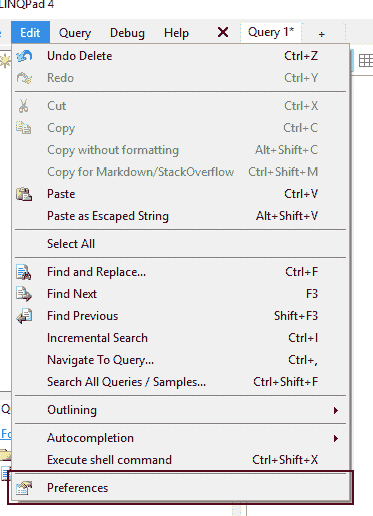

# 第三章从临朐开始

## 奔临朐

要启动 LinkPad，双击 Windows 桌面上的**LinkPad**图标。此操作将打开 LINQPad 用户界面。


图 9:视窗桌面上的临朐图标

## 临朐用户界面

LINQPad 用户界面对应于用户将在其中完成大部分工作的客户端应用程序。

### 用户界面图形元素

我们将在本书中使用的界面的以下图形元素如图 10 所示。

1.  **LinkPad 主菜单**:保存所有可用于程序的 LinkPad 命令。
2.  **连接的树形视图区**:显示用户使用连接管理器创建的所有连接。
3.  **查询和样本树视图区**:显示用户创建的所有查询和扩展。它还显示了 LINQPad 中所有可用的示例，这些示例显示在单独的选项卡中。
4.  **查询代码页签窗口区**:用户将在其中写入查询代码。
5.  **查询代码页签标题**:显示正在编辑的查询名称。
6.  **添加新标签按钮**:添加新标签进行查询编辑。
7.  **执行查询按钮**:执行当前选中的查询。
8.  **停止执行按钮**:停止查询执行。
9.  **结果查看类型按钮**:允许用户在富文本和数据网格之间切换，查看查询结果。
10.  **语言选择器组合框**:允许用户选择编写查询的编程语言。
11.  **连接选择器组合框**:允许用户选择之前创建的自定义连接。
12.  **关闭标签按钮**:关闭当前选中的标签。
13.  **高级功能激活链接**:在 LINQPad 的免费版中，这个链接允许用户打开产品的网页获取许可证，用于激活付费许可证的功能。
14.  **状态栏**:显示程序发送的几条消息，包括查询的时间表现。


图 10: LINQPad 用户界面

### 自定义编辑器窗口

您可以自定义编辑器窗口的字体和其他元素，例如窗口背景颜色或显示的代码行号。这可以通过使用位于**编辑**菜单中的**首选项**命令来完成。



图 11:编辑菜单中的首选项命令

出于本书的目的，我通过将字体设置为 Segoe UI 并使代码行号可见来定制我的编辑器窗口。


图 12:编辑器窗口首选项

在图 12 中可以注意到，字体大小定制是不可用的。这是因为 LINQPad 允许用户以两种不同的方式增加或减少字体大小:使用 Ctrl+加号(增加)或 Ctrl+减号(减少)组合键，或者在按住 Ctrl 键的同时使用鼠标滚轮。

## 永远存在的 Hello World

我们与 LINQPad 的第一次会议将通过创建和运行传统的 Hello World 代码来进行。为此，首先将**语言**下拉控件设置为 **C#语句**，然后在查询窗口中键入以下代码。

代码清单 2

```cs
  string greeting = "Hello World";
  greeting.Dump();

```

现在，要运行到上一个代码，点击**执行查询**(绿色箭头)按钮。下图显示了该代码的输出。


图 13:你好世界示例输出

### 拯救 Hello World 代码

使用 LINQPad，可以使用位于用户界面左下角的“我的查询”树视图轻松访问您编写的所有查询。

为了使 Hello World 代码在树视图中可用，您需要先保存它。这可以通过按下 **Ctrl** + **S** 来完成。在**将查询另存为**对话框中，键入用于保存查询的文件名。就本书而言，该名称将为 **helloworld** 。文件将以. linq 扩展名保存。

将查询保存到磁盘后，该查询的文件名将显示在树视图的“我的查询”节点下。现在你可以在需要的时候快速访问 **helloworld** 代码。


图 14:“将查询另存为”对话框


图 15:我的查询节点下的 helloworld 查询。

## 章节总结

本章解释了如何开始使用 LINQPad。要启动 LINQPad，请双击窗口桌面上的图标。这将启动 LINQPad 用户界面，这是将完成大部分工作的客户端应用程序。

出于本书的目的，我们在 LINQPad 用户界面中确定了 14 个图形元素。这些元素是:LINQPad 主菜单、连接的树视图区域、查询和样本树视图区域、查询代码选项卡窗口区域、查询代码选项卡标题、添加新选项卡按钮、执行查询按钮、停止执行按钮、结果视图类型按钮、语言选择器组合框、连接选择器组合框、关闭选项卡按钮、高级功能激活链接和状态栏。

您可以使用**编辑**菜单中的**首选项**命令来自定义编辑器窗口。然后，可以在**首选项**对话框的**编辑器**选项卡中更改窗口的设置。出于本书的目的，将使用 Segoe UI 字体，并显示代码行号。

字体大小自定义不可用，因为 LINQPad 允许用户使用 Ctrl+加号(增加)或 Ctrl+减号(减少)组合键或鼠标滚轮同时按下 Ctrl 键来增加或减少该大小。

一个“你好世界”的例子被用来开始 LINQPad 的工作。此代码产生的输出显示在结果窗口中。

“Hello World”示例的代码被保存到一个名为 helloword.linq 的文件中，以便将来使用。之后，文件名出现在位于用户界面左下角的“我的查询”节点下。