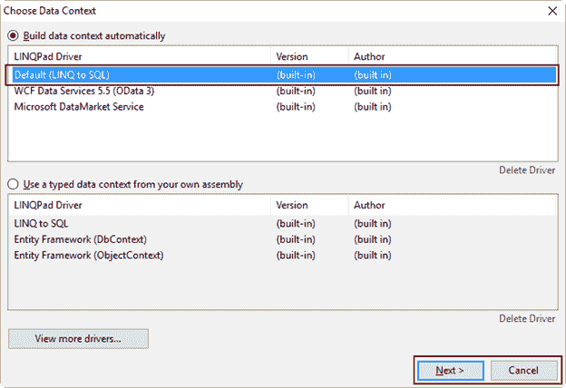

# 四、LINQPad基础

## 查询:LINQPad中的基本概念

LINQPad 使用术语*来查询编辑器中编写的每一段代码。所以从现在开始，在*LinkPad 简洁地*中，术语*查询*将用于指向其中显示的每个代码示例。*

如前一章“保存你好世界代码”一节所述，可以保存查询以备将来使用。保存查询时，LINQPad 将在名为“我的查询”的树视图节点下显示其文件名。该树形视图位于用户界面的左下角。

### 更改保存查询的位置

LinkPad 将查询存储在名为 LINQPad Queries 的文件夹中，默认情况下，该文件夹位于属于当前用户的“文档”文件夹中。通过单击位于**我的查询**树视图节点上方的**设置文件夹**超链接，可以更改此行为。此操作将打开“首选项”对话框，并选中“文件夹”选项卡。


图 16:设置文件夹超链接

本书中讨论的所有查询都将存储在一个名为 C:\ LinkPad _ 简洁\ Queries 的文件夹中。要选择此文件夹，首先在磁盘上创建它，然后在**首选项**对话框中单击位于**我的查询**框架下的**自定义位置**按钮。接下来，点击同一选项按钮右侧的**浏览**超链接，将出现浏览文件夹对话框。


图 17:浏览文件夹对话框

选择**C:\ LinkPad _ 简洁\查询**，然后点击**确定**。之后，文件夹名称将出现在位于“自定义位置”选项按钮下的组合框列表中。


图 18:C:\ LinkPad _ 简洁\查询文件夹后的首选项对话框

单击**确定**接受所有更改。

### 搜索特定查询

在只有几个查询的工作环境中，定位一个特定的查询可能是一项简单的任务。但是当这些查询的数量增加时，这可能是一项艰巨的工作。LINQPad 通过允许您使用术语搜索查询来解决这个问题。为此，单击位于**我的查询**树视图节点上的**转到**超链接。


图 19:转到超链接。

屏幕上将出现导航到查询对话框。此时，用户可以在**搜索词**组合框中键入一个词，LINQPad 将显示所有名称包含所键入词的查询。输入术语**帮助**将导致 LINQPad 在结果列表中显示 helloword.linq 查询。


图 20:导航到查询对话框

从列表中选择 **helloworld** 查询，然后点击**确定**在编辑器中打开该查询。

### LINQPad中可用的编程语言

在前一章的“LINQPad 用户界面”一节中，确定了 14 个图形元素。其中一个元素是语言选择器组合框。如本节所述，这个图形元素允许用户选择用于编写查询的编程语言。

LINQPad 有以下可用的编程语言:

*   C#表达式:用 C#编写的表达式，行尾没有分号。
*   C#语句:用 C#编写的几条语句。每个代码行必须以分号结束。
*   C#程序:一个 C# `Main ()`方法，后面可以跟另一个方法或者另一个类定义。每个代码行必须以分号结束。
*   VB 表达式:与 C#表达式相同，但用 VB.Net 编码。
*   VB 语句:与 C#语句相同，但在 VB.Net 编码。
*   VB 程序:和 C#程序一样，但是用 VB.Net 编码。
*   SQL:用 SQL 语言编码的一条或多条语句。
*   ESQL:实体 SQL 语言查询。
*   F#表达式:用 F#写的表达式。
*   F#程序:用 F#编写的程序块。

### 查询文件内部结构

保存查询时，LINQPad 会将。其文件名的 linq 文件扩展名。在内部，在查询中编写的代码之前会添加一个 XML 格式的头。以下示例显示了此结构。

代码清单 3

```cs

<Query Kind="Expression" />

  // Here it is, the simplest "hello, world" ever!  (Just
  hit F5)

  "Hello, world!"

```

如前一个示例中所述，与查询一起保存的 XML 头的根节点被精确地命名为`Query`。该节点的属性`Kind`告诉 LINQPad 在编译查询时应该使用哪种编程语言。这与从语言选择器组合框中选择的选项相匹配。

如果查询使用 SQL 连接(这将在下一节中解释)，查询文件的内部结构将类似于下面的示例。

代码清单 4

```cs
  <Query
  Kind="Expression">

  <Connection>

  <ID>4dbf890a-9be0-431c-a6d4-4bb20c1ba604</ID>

  <Persist>true</Persist>

  <Server>.\SQLEXPRESS</Server>

  <SqlSecurity>true</SqlSecurity>

  <UserName>sa</UserName>

  <Password>AQAAANCMnd8BFdERjHoAwE/Cl+sBAAAApIpboxkMi0KXQm107ZYAoQAAAAACAAAAAAAQZgAAAAEAACAAAADdjRylNWoymuJ4gbmgPQgfMFr1PooNmcD3wfZviEVW3QAAAAAOgAAAAAIAACAAAADE6tComfTnfJ/vn8LgxcYRUyRtOIOmztt8luz6FzRMohAAAAAa5ENguOQMGdGZdrnVXQi0QAAAALj09Vdcv09hYQIHq/niC9ydeO4NMEUvl8BpUNFKq4hYdG7sRBPTIOFe2a7M55OueQV5T916HCR6MaMom1sOSIA=</Password>

  <Database>uspostalcodes</Database>

  <ShowServer>true</ShowServer>

  </Connection>

  </Query>

  Places.Where(row
  => row.County_id == 1926)

```

现在 XML 头的`Query`节点包含一个名为`Connection`的节点。该节点存储连接到查询所使用的数据库服务器所需的所有参数。

对于这两个示例，添加到查询中的 XML 头告诉 LINQPad 查询使用哪种编程语言和 SQL 连接。

## 管理 SQL 连接

我们可以使用 LINQPad 用户界面管理与 SQL 服务器的连接。这可以通过点击**添加连接**超链接，在界面左侧的连接树视图区域完成。


图 21:连接的树视图区域中的添加连接超链接

### 创建一个 SQL 连接

点击**添加连接**超链接，将显示**选择数据上下文**对话框。在此对话框中，您可以选择将用于建立连接的 LINQPad 驱动程序。在这种情况下，将使用 **LINQ 到 SQL** 驱动程序(默认)。

要完成驾驶员选择，点击**下一步**。(点击**取消**将中止流程。)



图 22:选择数据上下文对话框

将显示 LinkPad 连接对话框(在 LINQPad 5 中标题为“LINQ 到 SQL 的连接”)，以便设置连接的参数。本书的示例将创建一个 Microsoft SQL Server 连接。从位于对话框顶部的**提供程序**框架中选择 **SQL Server** 选项。

假设在本地计算机上安装了一个 Microsoft SQL Server Express 实例，并且该实例在 SQL 的安装过程中被命名为 SQLEXPRESS。还假设该实例是为 SQL 身份验证安全模式配置的。

关于如何管理数据库，LINQPad 给出了三个选项:

*   使用 TreeView 显示服务器中存储的所有数据库。
*   将存储在本地硬盘上的数据库文件连接到服务器。
*   从服务器指定一个特定的数据库，或者创建一个新的数据库。

就本书而言，将选择第一个选项。

最后，用户应该为连接的数据上下文配置一组选项。

*   **将实体集合和表格属性**多元化。所有实体和表属性都以复数形式显示。
*   **大写物业名称**。属性的所有名称都以大写的第一个字母出现。
*   **包括存储过程和函数**。选中后，将显示树视图中出现的属于任何数据库的所有函数和存储过程。

本书中使用的连接要求所有默认选项保持不变。


图 23: LINQPad 连接对话框

通过点击对话框底部的**测试**按钮，可以在接受参数之前测试连接。测试通过后，点击**确定**创建连接并显示在用户界面中。


图 24:新的连接出现在连接的树视图区域。

默认情况下，当选择“SQL 身份验证”时，LINQPad 使用服务器名称后跟句点和已验证用户的名称来命名连接。在这种情况下，树视图中显示的名称是。因为我是以系统管理员的身份连接的。如果在“LINQPad 连接”对话框中选择了“窗口身份验证”，则指定给该连接的名称将只包含服务器名称。

|  | 注意:当在“LINQPad 连接”对话框中选择特定数据库时，连接的名称将包含所选数据库的名称。 |

### 连接上下文菜单

当用户右键单击连接名称时，将弹出连接上下文菜单。


图 25:连接上下文菜单

该菜单中可用的命令有:

*   **刷新**:查询服务器，重新加载所有实体及其属性。
*   **删除连接**:从树形视图中删除选定的连接。
*   **重命名连接**:允许您自定义连接的名称。
*   **标记为生产**:设置一个标志，表示所使用的连接在生产环境中。单击时，“生产”一词将出现在连接名称的右侧。然后，该命令将在上下文菜单中显示为“取消标记为生产”
*   **创建相似连接**:显示带有所选连接的所有参数的 LINQPad 连接对话框，以便创建一个精确的新连接或具有几乎相同参数值的连接。
*   **属性**:显示 LINQPad 连接对话框，以更改连接的参数。

## 浏览LINQPad样本

LINQPad 用户界面提供了一个名为“示例”的特殊选项卡。此选项卡位于“我的查询”树视图区域旁边。

要使用特定的样本，请单击所需样本的名称。LINQPad 会自动将该示例的代码带入编辑器。


图 26:示例选项卡

参考上图，如果点击**你好LINQPad！**示例，编辑器中将显示以下代码。

代码清单 5

```cs
  //
  Here it is, the simplest "hello, world" ever!  (Just hit F5)
  "Hello,
  world!"

```

前面的代码展示了一个比第 3 章“永远存在的你好世界”一节中讨论的更简单的“你好世界”示例。

正如代码所示，用户应该点击 **F5** 来执行代码。这相当于点击**执行查询**按钮。


图 27:“你好，LINQPad”的输出样品

### 一个 LINQ 到物体的样本

为了演示 LINQ 到对象的支持，将使用“简单查询表达式”示例。此示例的代码如下。

代码清单 6

```cs
  //
  Now for a simple LINQ-to-objects query expression (notice no semicolon):

  from
  word in "The quick brown fox jumps over the lazy dog".Split()
  orderby
  word.Length
  select
  word

  //
  Feel free to edit this... (No-one’s watching!) You'll be prompted to save any
  //
  changes to a separate file.
  // Tip: You can execute part of a query by highlighting it, and then pressing
  F5.

```

该代码本质上是一个单行的 list 对象查询表达式，它从一个字符串中返回一个单词列表。`String Split`方法创建该列表。然后，`orderby`子句根据每个单词的长度对列表进行排序。在这种情况下，列表从最小的单词开始排序，以最大的单词结束。最后，`select`语句依次迭代列表。

当表达式被执行时，它产生以下输出。


图 28:“简单查询表达式”示例的输出

上图中显示的语言选择器组合框显示了 **C#表达式**，这是一行语句使用的语言类型。在这种情况下，代码行的末尾不应使用分号。

### 一个多重报表样本

LINQPad 还可以一次执行多个语句。“多语句”示例将用于演示此功能。此示例的代码如下。

代码清单 7

```cs
  //
  Setting the query language to "C# Statement(s)" permits multiple
  statements:

  var
  words =
        from
  word in "The quick brown fox jumps over the lazy dog".Split()
        orderby
  word.ToUpper()
        select
  word;

  var
  duplicates =
        from
  word in words
        group
  word.ToUpper() by word.ToUpper() into g
        where
  g.Count() > 1
        select
  new { g.Key, Count = g.Count() };  

  //
  The Dump extension method writes out queries:

  words.Dump();
  duplicates.Dump();

  //
  Notice that we do need semicolons now!

```

该示例的第一个语句与上一节中讨论的示例几乎做了相同的工作。但是在这种情况下，列表是按字母顺序排序的，对其中的每个单词使用大写格式。之后，列表存储在单词集合中。

下一条语句旨在获得一个重复单词的列表，以及单词集合中有多少这样的单词。`from`语句迭代单词列表，并使用`group`子句收集那些完全相同的大写格式的单词。用于创建组的标准是每个组的大写格式。每个组都存储在`g`变量中，作为一个 IGrouping 接口，它是字符串类型`(word.ToUpper ())`的数据记录的集合。

增加了一个特殊的`Key`属性。此属性保存与集合中所有记录相关联的分组值(在本例中是每个单词的大写格式)。仅当集合的`Count`方法返回的值大于`1`时，`where`子句才使`g`可用于 select 子句。当这种情况发生时，一个新的`<string, int>`集合项被添加到`duplicates`集合中，使用分组值`(g.Key)`作为该项的关键字，并存储由`g.Count` 方法返回的值(实际上是重复数)。

`Dump`扩展方法(将在下一节中解释)为每个对象生成输出。

如前所述，在多语句查询中需要使用分号。此外， **C#语句**必须从**语言**组合框中选择。

查询的执行将显示以下输出。


图 29:多语句查询

## 垃圾场法

`Dump`扩展方法可能是 LINQPad 最强大的功能之一。这种方法的目的是显示几乎任何类型对象的值，生成通常显示在屏幕上的输出。

### 垃圾场是如何运作的

`Dump`延伸法不是捷径。NET 的`Console.WriteLine`方法。相反，它是一个递归方法，以 HTML 格式生成对象值的显示。它支持集合、数据表、图像和其他类型。它还可以将复杂对象的集合格式化为表格。

`Dump`方法知道如何构建转储的对象，以及在其中存储了哪些值，方法是使用。NET 反射机制。然后，它将这些对象转换成 HTML，并在网格中显示结果。这种机制使结果更易读，并为用户提供了调试复杂对象的好方法。

为了演示`Dump`，用户应该从**语言**组合框中选择 **C#语句**，然后在编辑器中键入以下代码。

代码清单 8

```cs
  new
  FileInfo(@"C:\Windows\explorer.exe ").Dump();

```

当执行前面的代码时，显示的输出如下。


图 30:转储方法的输出

图 30 显示了`Dump`方法的输出示例。请注意，网格的列标题有蓝色背景。此外，左侧会显示一个白色向下箭头。这意味着可以扩展输出结果，获得更多细节。


图 31:转储方法的输出扩展

`Dump`方法允许您传递一个字符串参数，以便在结果之前显示描述。以下示例演示了该功能。

代码清单 9

```cs
  new
  FileInfo(@"C:\Windows\explorer.exe ").Dump("Windows
  Explorer info");

```

当执行前面的代码时，将显示以下输出。


图 32:带有描述的转储方法的输出

### 转储方法的一些问题

`Dump`方法对小集合和大多数对象都很有效。用户可能会注意到大集合或某些特定对象类型的长运行时间。具有许多层次或大量属性的复杂对象可能很难读入结果面板。

## 章节总结

这一章专门介绍了 LINQPad 的基本概念。其中一个概念是术语“查询”LINQPad 对编辑器中编写的每一段代码都使用这个术语，它允许我们将这段代码保存在代码中。所有保存的查询都显示在名为“我的查询”的树视图节点下。

LinkPad 将查询存储在名为 LinkPad 查询的文件夹中，该文件夹位于用户的文档文件夹中。通过点击**设置文件夹**超链接，并在**首选项**对话框中浏览新文件夹，可以改变该行为。本书中讨论的所有查询都将保存在一个名为 C:\ LinkPad _ 简洁\ Queries 的文件夹中。

当用户处理一些查询时，定位一个特定的查询很简单。但是当这些查询的数量增加时，这可能是一项艰巨的工作。为了解决这个问题，LINQPad 允许您通过使用术语来搜索查询。这可以通过点击位于**我的查询**树视图节点上的**转到**超链接来完成。然后，用户可以在**导航至查询**对话框中键入术语，LINQPad 将显示与该术语匹配的所有查询。

LINQPad 可以编译十种编程语言变体的代码。这些变体是 C#表达式、C#语句、C#程序、VB 表达式、VB 语句、VB 语句、VB 程序、SQL、ESQL、F#表达式和 F#程序。

所有查询文件名都与。linq 文件扩展名。在内部，XML 格式的头被添加到文件的开头。这个头告诉 LINQPad 查询使用哪种编程语言和 SQL 连接。

LINQPad 允许您通过单击**添加连接**超链接，在连接的树视图区域管理与 SQL 服务器的连接。然后，将显示“选择数据上下文”对话框，允许用户选择将使用哪个 LINQPad 驱动程序。出于本书的目的，我们将使用 LINQ 到 SQL 驱动程序(这是默认的)。

选择 LINQPad 驱动程序后，将显示 LINQPad 连接对话框来设置连接的参数。假设在本地计算机上安装了一个配置了 SQL 身份验证安全模式的 SQLEXPRESS 实例，将创建一个 Microsoft SQL Server 连接。此外，默认数据上下文选项将用于连接。

当选择“SQL 身份验证”时，LINQPad 使用服务器名称后跟句点和已验证用户的名称来命名连接。为创建的连接显示的名称将是。\SQLEXPRESS.sa .当选择 Windows 身份验证时，连接的名称将只包含服务器名称。

当连接显示在用户界面中时，当用户右键单击连接的名称时，上下文菜单可用。该菜单包含一组用于管理该连接的命令。

本章还讨论了几个 LINQPad 查询示例。讨论从传统的“Hello World”示例开始，接着是一个 LINQ 到对象和多个语句的示例。

本章最后一节讲解`Dump`扩展方法，这是 LINQPad 最强大的功能之一。此方法呈现几乎任何类型的对象，并通过使用反射将其转换为 HTML，然后在网格中显示结果。

`Dump`方法对小集合和大多数对象都很有效，但是当处理大集合时，用户可能会注意到运行时间很长。