# 六、作为代码草稿本的LINQPad

LINQPad 的最佳用途之一是作为测试和原型工具。正如在第 4 章的“LinkPad 中可用的语言”一节中提到的，LinkPad 允许您以 C#、F#和 VB 语言运行代码。因此，无论您使用哪种语言进行开发，LINQPad 都是有用的。

这本书完全依赖于 C#编程语言，因此所有的代码测试或原型制作都将使用 C#编写。

## 如何在 LINQPad 中执行 C#代码

C#代码可以用三种不同的方式在 LINQPad 中编写:

*   作为表达式:执行没有分号的单行 C#表达式。
*   As 语句:执行几行 C#代码。每行必须以分号结束。
*   作为一个程序:LINQPad 自动向查询中添加一个`Main`方法，以便在该方法中执行语句或其他方法或类。要执行的方法或类可以在创建`Main`方法的右大括号后定义。

### 测试一个 C#表达式

有时候，当一个程序被编码时，需要测试一小部分代码，以确保它们能提供预期的结果。其中一段代码就是一个表达式。

以下示例假设您需要测试一个表达式，该表达式根据 XML Schema 格式将实际的`DateTime`值转换为字符串。

代码清单 32

```cs
  XmlConvert.ToString(DateTime.Now,XmlDateTimeSerializationMode.Unspecified)

```

使用`XmlConvert`类的静态`ToString`方法进行`DateTime`值转换。该值作为第一个参数传递给方法。传递给该方法的第二个参数是`XmlDateTimeSerializationMode.Unspecified`枚举值。该值告诉`ToString`方法，实际日期和时间的时区应被忽略。结果显示在下面的代码片段中。

代码清单 33

```cs
  2016-06-12T18:55:08.0376168

```

### 执行 C#语句

在前一节解释的示例中生成的输出中，注意转换后的`DateTime`值的`seconds`部分与`seconds`值的小数部分一起返回。如果期望的结果没有这些分数，那么应该执行一个附加的语句从字符串中删除它们。因此，应该编写一个 C#语句查询来解决这个问题。

代码清单 34

```cs
  var
  xmlschemaDatetime =
  XmlConvert.ToString(DateTime.Now,XmlDateTimeSerializationMode.Unspecified);
  xmlschemaDatetime
  = xmlschemaDatetime.Substring(0,xmlschemaDatetime.IndexOf("."));
  xmlschemaDatetime.Dump();

```

前面的代码示例对应于一个 C#语句查询。与 C#表达式查询不同，编写 C#语句查询需要声明变量，以便分配来自方法或计算的结果。必须包含`Dump`方法来显示查询的最终结果。

上例中显示的查询使用字符串类的`Substring`和`IndexOf`方法，以便从转换后的`DateTime`值的`seconds`部分移除分数。

预期结果必须不包含小数，所以`Substring`方法只需要取小数点前的那些字符。`IndexOf`方法用于计算小数点的位置。因为字符串是从零开始索引的，所以如果小数点出现在第 19 位，它实际上是字符串的第 20 个字符(20–1 = 19)。因此，如果是这样的话，`Substring`方法必须取 19 个字符，而这正是`IndexOf`方法返回的数字。

结果显示为以下代码片段。

代码清单 35

```cs
  2016-06-12T18:55:08

```

### 运行 C#程序

在 LINQPad 查询中执行 C#代码的第三种方式类似于我们运行 C#程序的方式。当从语言选择器组合框中选择这种查询时，LINQPad 会自动创建一个`Main`方法，该方法将作为查询的入口点。

C#程序查询可能适用于测试或原型开发可能是更大项目一部分的代码。一旦这些代码片段通过了所有测试，它们就可以成为 Visual Studio 解决方案的一部分。这种做法可以节省您的时间，因为您不需要为测试目的构建另一个项目。即便如此，在 Visual Studio 中创建解决方案之前，要交付的部分解决方案可能已经存在。

以下代码是上一节中解释的 C#语句查询的 C#程序查询版本。

代码清单 36

```cs
  void
  Main()
  {

  var convertedDateTime = toXmlSchemaDateTime(DateTime.Now);

  convertedDateTime.Dump();
  }

  //
  Define other methods and classes here
  public
  string toXmlSchemaDateTime(DateTime currentDateTime)
  {

  var xmlschemaDatetime =
  XmlConvert.ToString(DateTime.Now,XmlDateTimeSerializationMode.Unspecified);

  xmlschemaDatetime =
  xmlschemaDatetime.Substring(0,xmlschemaDatetime.IndexOf("."));

        return
  (xmlschemaDatetime);
  }

```

如前例所述，转换过程现在委托给一个名为`toXmlSchemaDateTime`的程序定义方法。方法定义是在`Main`方法定义下编写的，正如 LINQPad 通过添加到代码中的注释所建议的那样。这种方法允许你将任何`DateTime`值转换成它的`XmlSchema`等价物，而不仅仅是当前系统的`DateTime`。

现在，`Main`方法创建一个变量，并用当前系统的`DateTime`值调用`toXmlSchemaDateTime`方法。`Dump`方法显示结果。

#### 测试工作台使用示例

如前一节所述，在成为解决方案的一部分之前测试部分代码的能力使 LINQPad 变得健壮和强大。在本节中，我们假设在开发人员将代码放入 Visual Studio 解决方案之前，需要测试一个用于管理`DateTime`值的类。为此目的的查询应该类似于下面的示例。

代码清单 37

```cs
  void Main()
  {
       var dateTimeManager = new DateTimeManager();
         dateTimeManager.toXmlSchemaDateTime(DateTime.Now).Dump("toXmlSchemaDateTime
  method");

  dateTimeManager.backNDays(DateTime.Now,3).Dump("backNDays method");
         dateTimeManager.forwardNDays(DateTime.Now,15).Dump("forwardNDays
  method");
  }

  // Define other methods and classes here
  public class DateTimeManager
  {
        public string toXmlSchemaDateTime(DateTime
  currentDateTime)
         {
      var xmlschemaDatetime =
  XmlConvert.ToString(DateTime.Now,XmlDateTimeSerializationMode.Unspecified);
             xmlschemaDatetime =
  xmlschemaDatetime.Substring(0,xmlschemaDatetime.IndexOf("."));

              return (xmlschemaDatetime);
         }

           public DateTime backNDays(DateTime
  currentDateTime, int daysToGoBack)
           {
                  return
  (currentDateTime.Subtract(TimeSpan.FromDays(daysToGoBack)));
           }

           public DateTime forwardNDays(DateTime
  currentDateTime, int daysToGoBack)
           {
                  return (currentDateTime.Add(TimeSpan.FromDays(daysToGoBack)));
           }
  }

```

前面的代码显示了一个名为`DateTimeManager`的类。该类有三种方法:

*   `toXmlSchemaDateTime`:将`DateTime`值转换为符合 XmlSchema 定义的格式的字符串。
*   `backNDays`:返回一个`DateTime`值，该值是在`DateTime`值传递给方法之前给定的天数。
*   `forwardNDays`:返回一个`DateTime`值，该值是传递给方法的`DateTime`值之后的给定天数。

前面的代码显示了如何同时测试该类的所有方法。这是通过创建类的实例并调用每个方法以及`Dump`来完成的。向每个`Dump`调用传递一个字符串，以便识别每个测试方法的结果。

查询的输出显示在下面的示例中。

代码清单 38

```cs
  toXmlSchemaDateTime
  method
  2016-08-03T19:05:05

  backNDays
  method
  7/31/2016
  7:05:05 PM 

  forwardNDays
  method
  8/18/2016
  7:05:05 PM

```

如果结果如预期的那样，可以将类代码添加到解决方案中。

## 测量查询性能

当 LINQPad 用于测试目的时，另一个重要的问题是测量代码性能。衡量性能的一种常见方法是添加时间管理语句，并执行减法运算。

LINQPad 为用户提供了一个非常简单的解决这个问题的方法:每次查询执行完成时，获取结果所花费的时间都会显示在状态栏中。

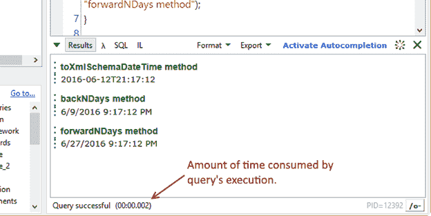

图 44:查询执行所消耗的时间

如图 44 所示，性能测量的精度以毫秒为单位。

## 引用自定义和默认装配

LINQPad 还允许在查询中使用自定义程序集。通过从**查询**菜单中选择**查询属性**命令，可以在查询中引用这些组件。

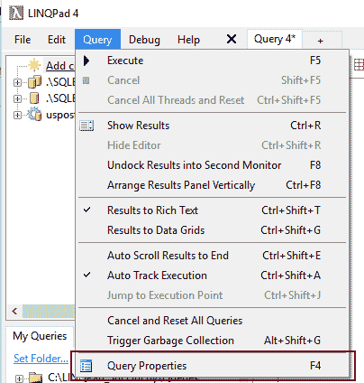

图 45:查询属性命令

参考组件的另一种方法是按下 **F4** 键，如上图所示。无论使用哪种方法，都会显示“查询属性”对话框，以便您可以添加所需的引用。

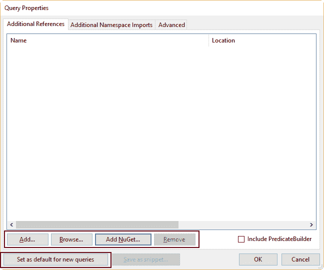

图 46:查询属性对话框

该对话框提供了一组按钮，用于向查询添加程序集引用。这些按钮的用途将在以下章节中解释。

### 从系统中提取一个程序集

“添加自定义装配参照”对话框用于从系统中可用的装配中选择一个装配。要调出该对话框，单击位于**查询属性**对话框中的**添加**按钮。“添加自定义装配参照”对话框显示系统中找到的所有装配。您可以通过单击所需组件的名称并按下 **Ctrl** 或 **Shift** 键来选择一个或多个组件，就像在窗口文件资源管理器中一样。

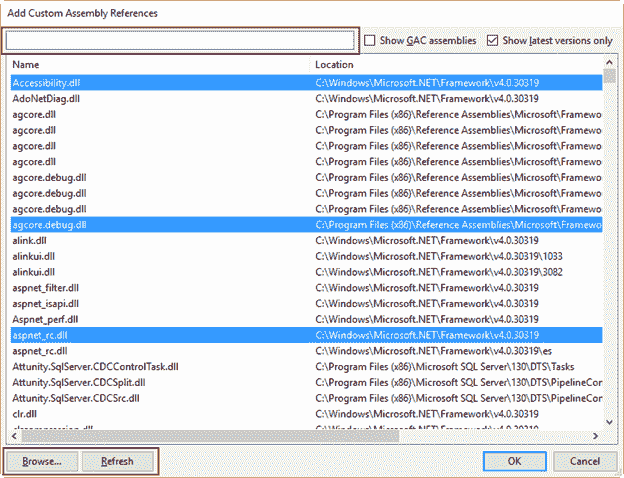

图 47:添加自定义程序集引用对话框

如图 47 所示，该对话框还提供了一个搜索栏，允许您根据程序集的全名或部分名称来筛选它们。

搜索栏右侧有两个复选框。第一个告诉 LINQPad 安装在全局程序集缓存(GAC)中的程序集是否将包含在列表中(选中)或不包含在列表中(未选中)。另一个将程序集列表限制为最新版本(选中)，或者告诉 LINQPad 包含每个程序集的所有已安装版本(未选中)。

|  | 注意:全局程序集缓存(GAC)是将存储指定由多个应用程序共享的所有程序集的计算机的位置。广汽集团通常位于 C:\ Windows \微软。. NET \程序集。 |

位于对话框底部的“浏览”按钮允许您在计算机的文件系统中搜索程序集。

“刷新”按钮也位于对话框的底部，可让您刷新程序集列表以包括最近安装的程序集。

### 直接从计算机的文件系统中选择一个程序集

您可以从计算机的文件系统中选择一个程序集，而不显示“添加自定义程序集引用”对话框。您可以通过点击**查询属性**对话框中的**浏览**按钮来实现。现在，用户可以找到想要的组件，点击**打开**进行拾取。为了本书的目的，在**C:\ LinkPad _ 简洁地**文件夹中创建了一个名为 **customassembly** 的类库项目。

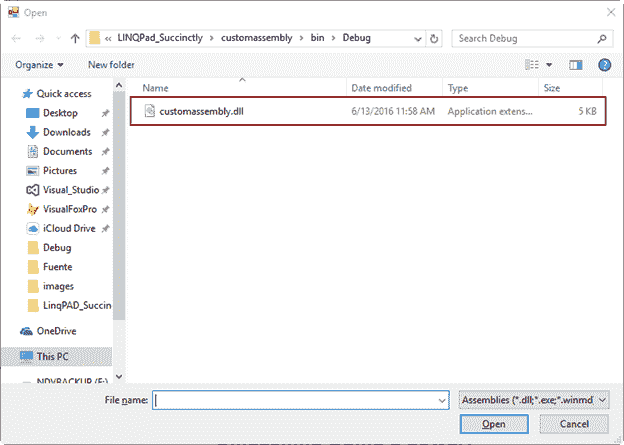

图 48:获取定制装配库

打开程序集后，其名称会出现在“查询属性”对话框中。您可以通过单击**确定**来接受选择，或者您可以告诉 LINQPad 当前查询和在此查询之后创建的所有查询都应该使用该程序集。为此，单击**设置为新查询的默认值**。

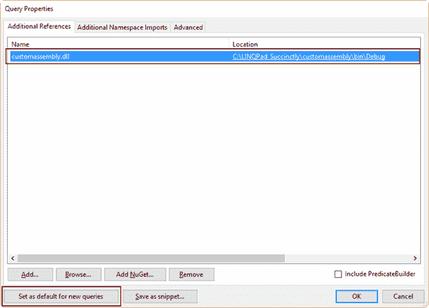

图 49:选择程序集后的查询属性对话框

## 将名称空间导入查询

当开发人员编写 C#程序并需要使用位于另一个命名空间中的类或方法时，该程序通常从以下语句开始。

代码清单 39

```cs
  using
  System.Drawing;
  using
  System.Net;
  using
  System.Windows.Forms;

```

由`using`语句执行的操作被称为*导入名称空间*，并允许开发人员使用每个语句所声明的名称空间中公开的所有类。当然，包含这些命名空间的程序集必须在项目中被引用，以使每个`using`语句正常工作。

在前面所有添加了程序集引用的示例中，当需要包含在该程序集中的类或方法时，必须以完全限定的形式编写。也就是说，包含类或方法的命名空间的名称写在方法本身的名称之前，后跟一个句点。

代码清单 40

```cs
  var image = Util.Image(new
  System.Net.WebClient().DownloadData("https://www.linux.com/sites/all/themes/custom/lcom/logo.png"));
  //The WebClient method is used in the form of System.Net.WebClient(), where
  System.Net is the namespace which contains the method
  image.Dump();

```

在前面的示例中，`WebClient`方法使用其完全限定名进行编码。在这种情况下，包含该方法的命名空间是`System.Net`。调用方法时不能省略命名空间声明。如果发生这种情况，LINQPad 将在查询执行时触发一条错误消息，因为它不知道`WebClient`方法的确切位置。即使添加了对包含命名空间的程序集的引用，也会出现这种情况。这个问题可以通过将命名空间导入查询来解决。但是，`using`语句不能用于 LINQPad 查询。相反，应该使用“查询属性”对话框和“附加命名空间导入”选项卡。

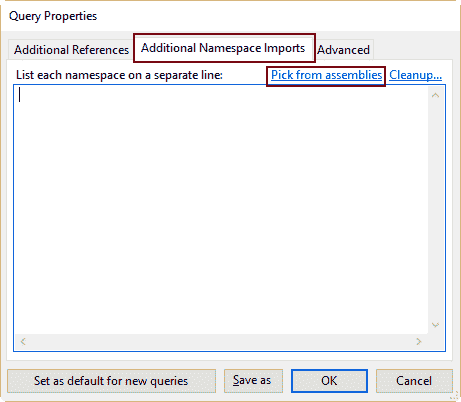

图 50:附加名称空间导入选项卡

图 50 显示了查询属性对话框中的附加名称空间导入选项卡。有一个多行文本框，用于在单独的一行中写入要导入的每个命名空间的名称。名为**从组件中选择**的超链接也可用。单击此超链接时，右侧会出现一个列表，其中包含查询中所有引用的程序集。

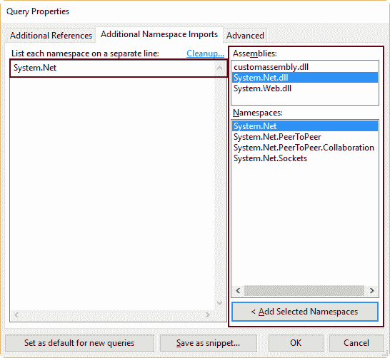

图 51:点击**从组件中选择**后的查询属性对话框

如图 51 所示，出现在程序集列表下的名称空间列表显示了所选程序集内所有可用的名称空间。这是一个多选列表，因此可以同时选择几个名称空间。这种多重选择可以通过使用 Ctrl +单击或 Shift +单击组合来完成，就像在窗口文件资源管理器中一样。

点击**确定**将所选名称空间导入查询。如果您希望此选项可用于所有新查询，请在导入命名空间之前，单击**设置为新查询的默认值**。

现在，查询的代码应该如下例所示。

代码清单 41

```cs
  var image = Util.Image(new
  WebClient().DownloadData("https://www.linux.com/sites/all/themes/custom/lcom/logo.png"));
  image.Dump();

```

如前一个示例中所述，名称空间声明被省略了。执行查询时不会出现错误消息，因为`WebClient`方法的命名空间先前已导入到查询中。

## 释放迪普的力量

如第 4 章所述，`Dump`扩展方法能够渲染几乎任何类型的对象，以生成将显示在屏幕上的输出。本节将探索一些使用`Dump`方法的强大方法。

### 测试 Windows 窗体控件的外观

有时，当开发人员构建自定义控件程序集时，有必要在发布项目之前查看这些控件的外观。开发人员可能会出于测试的目的编写另一个项目，这需要花费时间和精力。

使用 LinkPad，可以大大减少时间和精力，因为 LinkPad 允许我们使用`Dump`方法编写一系列语句，以便对控件进行原型化。在这种情况下，`Dump`方法将渲染控件并将其显示在结果面板中。开发人员可以一遍又一遍地运行这些语句，直到出现期望的结果。然后，可以将代码添加到项目中。

以下示例原型化了一个`CustomButton`类，并在结果面板中显示该自定义按钮。

代码清单 42

```cs
  void Main()
  {
        var custombutton = new CustomButton();
        custombutton.Dump();
  }

  // Define other methods and classes here
  public class CustomButton :
  System.Windows.Forms.Button
  {
      public CustomButton()
        {
           Text = "Custom Button Class";
           Font = new System.Drawing.Font("Segoe
  UI",12);
        }
  }

```

这是一个 C#程序查询，在其`Main`方法下定义了一个`CustomButton`类。这个自定义类的一个实例是在`Main`方法中创建的，存储该实例的变量使用`Dump`方法来显示按钮。

|  | 注意:前面的例子需要系统。窗体和系统。如本章`"`参考自定义和默认组件`"`一节所述，绘制要参考的组件。 |

上一个查询产生的输出如图 52 所示。

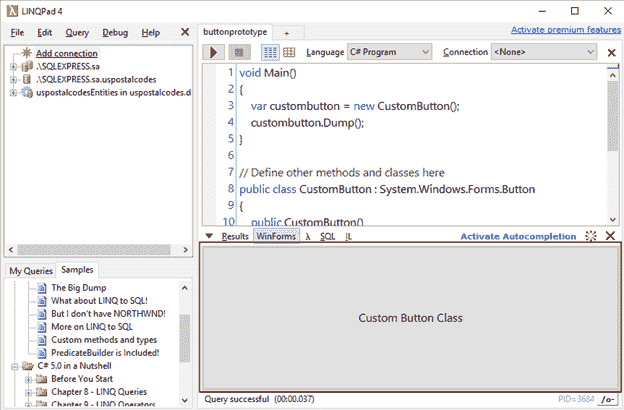

图 52:结果面板中显示的自定义按钮

如图 52 所示，`Dump`方法渲染按钮，显示在结果面板中。

### 自定义按钮类用了不同的方法

下面的代码对`CustomButton`类进行了一些修改。

代码清单 43

```cs
  void Main()
  {
        var custombutton = new CustomButton();
        custombutton.Dump();
  }

  // Define other methods and classes here
  public class CustomButton :
  System.Windows.Forms.Button
  {
      public CustomButton()
        {
             FlatStyle =
  System.Windows.Forms.FlatStyle.Flat;
               BackColor =
  System.Drawing.Color.FromArgb(244,152,31);
               ForeColor = System.Drawing.Color.Black;
           Font = new System.Drawing.Font("Segoe
  UI",12);
           Text = "Custom Button Class Flat
  Version";
        }
  }

```

在这种情况下，类将创建一个带有橙色背景和黑色文本的平面按钮。

### 从网络位置下载图片

`Dump`方法可以渲染几乎任何种类的对象；图像也不例外。下面的代码演示如何呈现从 web 位置下载的图像。

代码清单 44

```cs
  var image = Util.Image(new System.Net.WebClient().DownloadData("https://www.linux.com/sites/all/themes/custom/lcom/logo.png"));
  image.Dump();

```

该代码显示的输出如图 53 所示。

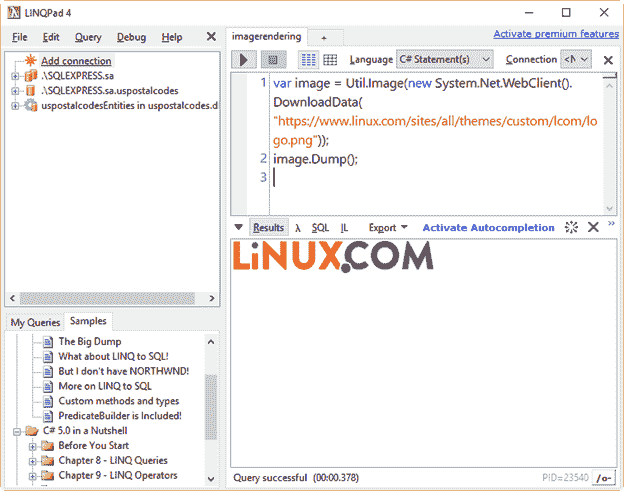

图 53:由 Dump 方法渲染的图像

|  | 注意:前面的示例需要引用 System.Net 程序集，如本章的`"`引用自定义和默认程序集`"`一节所述。 |

## 乌蒂尔班

LINQPad 公开了一个名为`Util`的类。这个类有许多有用的方法和属性可以用来与查询交互。本节将演示`Util`类中可用的一些方法和属性。

### 明确结果法

`ClearResults`方法清除结果面板。

代码清单 45

```cs
  var image = Util.Image(new
  WebClient().DownloadData("https://www.linux.com/sites/all/themes/custom/lcom/logo.png"));
  image.Dump();
  Thread.Sleep(2000); 
  //Stops query execution for two seconds
  Util.ClearResults();

```

此代码示例呈现从 web 位置下载的图像。然后，查询执行停止两秒钟。之后，`ClearResults`方法从结果面板中清除图像。

### Cmd 法

`Cmd`方法执行系统命令并显示结果。以下示例显示了 C:\ LinkPad _ 简洁\查询文件夹的内容。

代码清单 46

```cs
  Util.Cmd("dir
  C:\\LINQPad_Succinctly\\Queries");

```

显示的输出应该如下所示。

代码清单 47

```cs
  Volume
  in drive C has no label.
   Volume
  Serial Number is AA4F-79E0

   Directory
  of C:\LINQPad_Succinctly\Queries

  06/26/2016 
  08:45 AM    <DIR>          .
  06/26/2016 
  08:45 AM    <DIR>          ..
  05/31/2016 
  12:28 PM               416 A simple query expression.linq
  06/16/2016 
  10:19 AM               654 buttonprototype.linq
  06/16/2016 
  11:25 AM               826 buttonprototypechanged.linq
  06/24/2016 
  10:39 PM             1,025 catchingwpfelementevent.linq
  06/21/2016 
  12:18 PM             1,046 cmdlineoptions.txt
  06/17/2016 
  10:17 AM               239 CmdMethod.linq
  06/22/2016 
  01:50 PM            43,681 cmdsymbolsample.html
  06/22/2016 
  01:49 PM               950 cmdsymbolsample.linq
  06/11/2016 
  02:36 PM               646 countiesortedentityframework.linq
  06/10/2016 
  06:33 PM               989 CountiesPredicateKeywords.linq
  06/10/2016 
  09:40 AM               909 CountiesPredicateSample.linq
  06/10/2016 
  11:37 AM               979 CountiesPredicateSample_2.linq
  06/22/2016 
  12:15 PM               473 custombutton.txt

  13 File(s)        135,723 bytes

  2 Dir(s)  65,482,702,848 bytes free

```

### getmyquery 方法

`GetMyQueries`方法返回默认查询文件夹中显示在“我的查询”树视图节点下的所有查询。该方法返回一个`IEnumerable<Query>`对象。枚举中的每个元素都是对`Query`对象的引用，该对象具有以下属性。

*   `OpenLink`:包含查询名称的超链接。单击此超链接时，查询将在单独的选项卡中打开。
*   `Location`:包含查询文件的相对路径，从默认的查询文件夹开始。默认查询文件夹被视为根文件夹(\)。
*   `Name`:纯文本查询的名称。
*   `Text`:查询的代码。
*   `Language`:编程语言的种类，根据本章“如何在 LINQPad 中执行 C#代码”一节的解释。
*   `FileReferences`:一个`IEnumerable<string>`对象，包含添加到查询中的所有引用的完整文件名，如本章“引用自定义和默认程序集”一节所述。
*   `GacReferences`:一个`IEnumerable<string>`对象，包含添加到查询中的全局程序集缓存(GAC)中所有引用的完整文件名，如本章“引用自定义和默认程序集”一节所述。
*   `NamespaceImports`:一个`IEnumerable<string>`对象，包含导入到查询中的所有名称空间的名称，如本章“将名称空间导入到查询中”一节所述。
*   `LastModified`:上次更新查询的日期和时间。

下面的代码显示了所有可用的查询。

代码清单 48

```cs
  Util.GetMyQueries().Dump("My
  Queries listing");

```

### WriteCsv 方法

`WriteCsv`方法将对象的内容存储到 CSV 文件中。以下示例根据对`Counties`表的`Where`查询创建一个 CSV 文件。

代码清单 49

```cs
  var
  csvFile = Util.CurrentQueryPath.Replace(".linq",".csv");
  Util.WriteCsv(Counties.Where(row
  => row.State_id == 29),csvFile);

```

前面代码的第一行使用`Util`类的`CurrentQueryPath`属性(返回当前运行的查询的文件名，包括其绝对路径)和`Replace`方法，以便构建保存 CSV 内容的文件名。该文件名存储在`csvFile`变量中。`WriteCsv`方法接收查询应用`Where`方法的`Counties`表的结果，然后将该结果写入到`csvFile`变量中指定的文件中。现在，如果您查看查询的默认文件夹，您会发现一个名为的 CSV 文件(除了。csv 扩展)。

|  | 注意:由于在前面的示例中没有 Dump 调用，因此“结果”面板不显示任何内容。此外，为了检索带有 CurrentQueryPath 属性的查询的文件名，必须在执行之前保存它。 |

### 跑法

`Run`方法从另一个查询中执行 LINQPad 查询。NET 程序或窗口服务。如果是. NET 程序或 Windows 服务，应该在其中引用 LINQPad.exe 文件。

`Run`方法执行查询就像命令行工具 lprun.exe(将在下一章中解释)执行查询一样。

以下示例使用`Run`方法执行位于默认查询文件夹中的`getmyqueries.linq`查询。

代码清单 50

```cs
  const
  string queriesPath = @"C:\LINQPad_Succinctly\Queries\";
  var
  dummyFormat = new LINQPad.QueryResultFormat();
  Util.Run(queriesPath+"getmyqueries.linq",dummyFormat).Dump();

```

|  | 注意:与从 LINQPad 接口执行查询时显示的格式化输出不同，Run 方法生成的输出是纯文本格式的。 |

### ProgressBar 类

`ProgressBar`类允许您跟踪查询的执行进度，在结果面板中显示进度条。

代码清单 51

```cs
  var
  counties = new List<Counties>();
  var
  totalRows = Counties.Count();
  var
  rowIndex = 0;

  var
  pb = new Util.ProgressBar("Querying Counties table");
  pb.Dump();

  foreach
  (var row in Counties)
  {

  pb.Percent =  (rowIndex * 100) / totalRows;

  counties.Add(row);

  rowIndex++;

  Thread.Sleep(2);  //A small delay to watch the progress 
  }
  pb.Percent
  = 100;
  counties.Dump();

```

该代码使用`foreach`循环将`Counties`表中的行存储到名为`counties`的`List<Counties>`变量中。`ProgressBar`类用于显示循环内的操作进度。如代码中所示，当类被实例化时，可以向进度条分配一条消息。

请注意，`ProgressBar`类实例的`Dump`方法在进入循环之前被调用。这使得进度条在迭代表格之前可见。

`Thread.Sleep`方法在列表中添加每一行后增加两毫秒的延迟，以使用户观察操作的进度。

`ProgressBar`类完成的工作如下图所示。

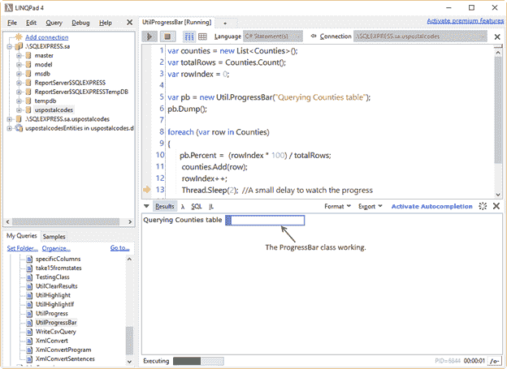

图 54:显示进度的进度条

### 进步属性

`Progress`属性允许您更新 LINQPad 状态栏中集成的进度条。在这种情况下，进度条不会显示在“结果”面板中，用户无法为其分配消息。

代码清单 52

```cs
  var
  counties = new List<Counties>();
  var
  totalRows = Counties.Where(row => row.State_id == 29).Count();
  var
  rowIndex = 0;

  foreach
  (var row in Counties.Where(row => row.State_id == 29))
  {

  Util.Progress =  (rowIndex * 100) / totalRows;

  counties.Add(row);

  rowIndex++;

  Thread.Sleep(30);  //A small delay to watch the progress 
  }
  Util.Progress
  = 100;
  counties.Dump();

```

除了使用`Progress`属性之外，前面的代码类似于用于解释`ProgressBar`类的代码。下图显示了`Progress`房产的运作方式。

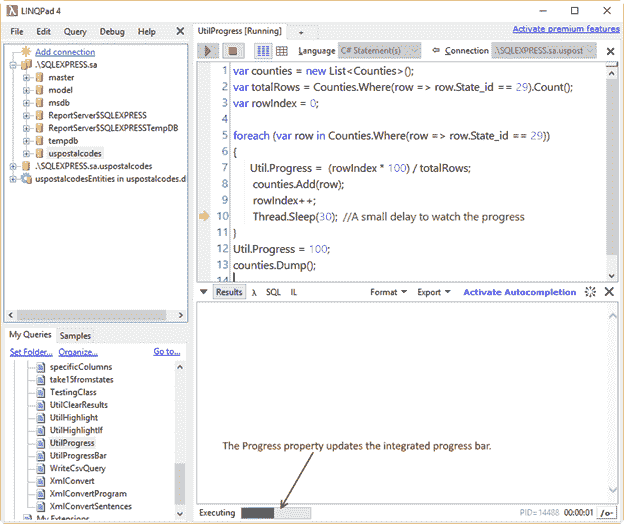

图 55:更新集成进度条

## 章节总结

LINQPad 具有作为测试和原型工具的能力，并且可以运行 C#、F#、和 VB 语言的代码。

C#代码可以在 LINQPad 中作为单行表达式、几个 C#语句以及带有`Main`方法的 C#程序来执行。

LINQPad 通过在状态栏中显示查询执行所消耗的时间，使用户能够衡量查询的性能。

每次 LINQPad 执行查询时，结果都会显示在一个名为“结果”面板的窗口中。该窗口通过六个图形元素提供了一些有用的功能:选项菜单下拉按钮、结果查看模式选项、格式菜单、导出菜单、解锁结果按钮和关闭按钮。

LINQPad 还允许在查询中使用自定义程序集。通过从**查询**菜单中选择**查询属性**命令，或按下 **F4** 键，可以在查询中引用这些组件。用户可以从安装在系统中的程序集中挑选一个程序集，在本地文件系统中浏览一个自定义程序集文件，或者为两者添加引用。LINQPad 高级版的用户也可以参考 NuGet 包。在免费版中，只能引用 LINQPad 示例中使用的那些包。

当查询中引用自定义或系统程序集时，使用应该通过显式限定名声明属于这些程序集的类或方法。也就是说，要使用位于`System.Windows.Forms`命名空间中的`Button`控件，用户应该编写`System.Windows.Forms.Button`，以便为该类创建一个实例。为了简化代码的编写方式，LINQPad 允许您使用“查询属性”对话框中的“附加命名空间导入”选项卡将命名空间导入查询。

`Dump`方法用于显示查询产生的输出。该方法还具有巨大的功能，可以帮助用户呈现 Windows 窗体控件，并从网站位置下载和呈现图像。在 LINQPad5 中，`Dump`方法有附加的参数来有条件地在屏幕上显示输出。

最后一点，LINQPad 公开了一个名为`Util`的静态类。此类有许多有用的方法和属性，可用于与查询交互，以便运行系统命令、获取列表中所有可用的查询、突出显示查询结果、将结果导出到 CSV 文件或显示进度条。