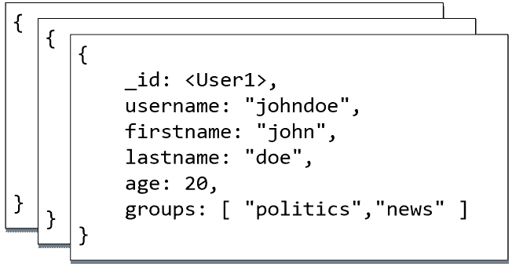
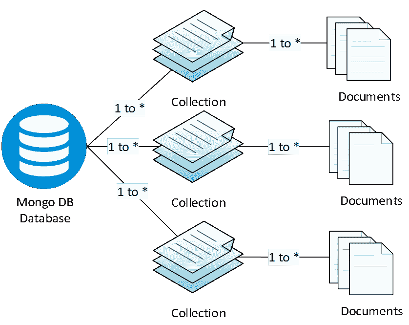
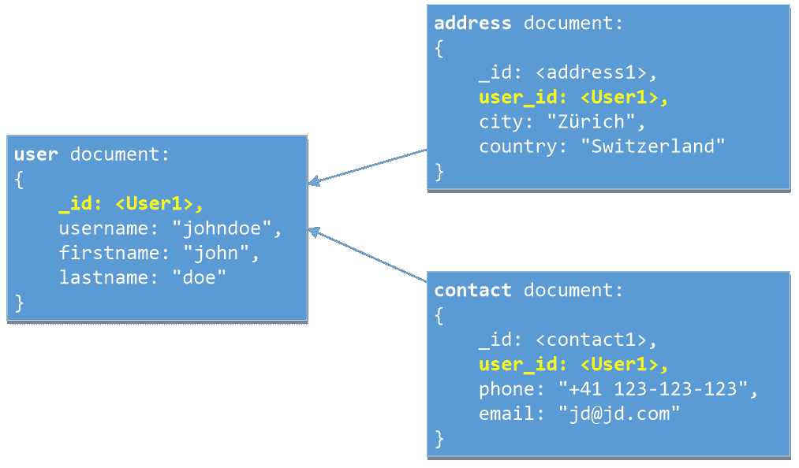
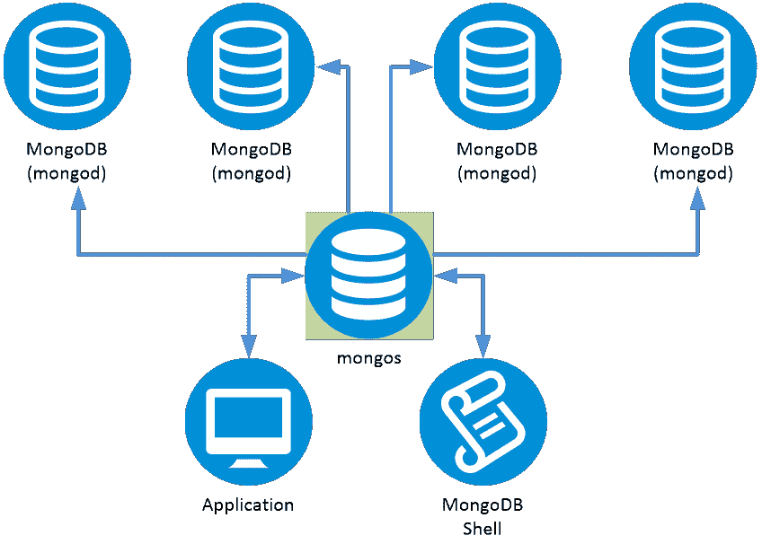

# 一、MongoDB概述

MongoDB 是一个开源的*文档数据库*，提供高性能、高可用性和自动伸缩。MongoDB 是根据通用公共许可证(GPL)免费提供的，作为公司商业产品的一部分，它也是根据商业许可证提供的。在本书中，我们将讨论免费版本提供的功能。

MongoDB 是所谓的 NoSQL 数据库的许多实现之一，它目前是这一市场领域最大的参与者之一。

## NoSQL 和文件数据库

如果你是 NoSQL 世界的新手，我们需要介绍几个概念。

一般来说，有三类数据库:

*   关系数据库管理系统(关系数据库管理系统)
*   OLAP ( [在线分析处理](https://en.wikipedia.org/wiki/Online_analytical_processing))
*   [NoSQL](https://en.wikipedia.org/wiki/NoSQL)

作为开发人员，我们通常更熟悉关系数据库，如微软的 SQL Server、Oracle、MySQL 和 Postgres，以及这些数据库以表格格式组织数据的方式。从历史上看，关系数据库的使用最为广泛，尤其是在企业领域，这也是事实。

NoSQL(最初指“非 SQL”、“非关系”或“不仅仅是 SQL”)是另一种类型的数据库，它提供了一种存储和检索数据的机制，并且它通常以不同于关系数据库的方式处理数据。

NoSQL 数据库的存在是为了解决特定领域的特定问题，而不是解决任何问题的“灵丹妙药”，因为它们各有利弊。NoSQL 数据库试图解决的一些主要问题是可伸缩性和数据量的问题。

关于 [CAP 定理](https://en.wikipedia.org/wiki/CAP_theorem)，NoSQL 数据库经常为了可用性和分区容差而牺牲一致性。在 NoSQL 世界，“最终一致性”通常用于实现速度和可伸缩性。

### 可扩展性

NoSQL 数据库的优势之一是支持*水平* [可伸缩性](https://en.wikipedia.org/wiki/Scalability)*T5(或*横向扩展)*，这在关系数据库管理系统中是可用的，但更加有限和昂贵。水平可伸缩性意味着我们可以通过增加更多的服务器(节点)来扩展系统的容量。然后，性能几乎与系统中的节点数量成线性比例。*

这种横向可伸缩性的想法不同于*纵向可伸缩性*，通常为了处理更多的数据，我们通过增加更多的内存、HDD 空间、CPU 等来升级服务器本身。

横向扩展通常是更便宜和更灵活的选择，因为它使用常规的商品硬件，而纵向扩展通常要贵得多，因为随着硬件变得越来越复杂，其成本往往会呈指数级增长，最终其扩展会有更多的限制。

图 1:水平可伸缩性。

### 实现

NoSQL 数据库包括各种各样的实现(通常不包括表格格式)，这些实现是为了应对数据量的增加而开发的。这里列出了各种口味:

*   **文档数据库**将每个键与称为文档的复杂数据结构(MongoDB、Couchbase Server、CouchDB、RavenDB 等)配对。
*   **键值存储**是最简单的 NoSQL 数据库。数据库中的每一项都以属性名(或“键”)的形式存储，以及它的值(DynamoDB、Windows Azure 表存储、Riak、Redis、LevelDB、Dynomite)。
*   **宽列**存储如 Cassandra 和 HBase 针对大型数据集上的查询进行了优化，将数据的列存储在一起，而不是行。
*   **图形**商店用于存储关于网络的信息，例如社交联系。图形存储包括 Neo4J 和 HyperGraphDB。

### NoSQL:少了什么？

与关系数据库管理系统相比，NoSQL 数据库通常不支持或很少支持以下内容:

*   **有限或不支持 JOINS (INNER、OUTER 等)**。):对数据的访问是在文档级别完成的，因此对象之间链接的处理必须在应用程序级别完成。
*   **没有复杂的事务支持** : NoSQL 数据库通常支持最终的一致性事务，并且通常不支持批量更新，而是处理单个项目。
*   **不支持约束** : [约束](https://en.wikipedia.org/wiki/Relational_database#Constraints)不是在数据库级别实现的，而是在应用程序级别实现的。

## 数据库结构

正如我们前面提到的，MongoDB 是一个文档数据库，在数据表示方面非常简单。最简单的数据库由两项组成:`document`，包含数据，`collection`，是文档的容器。

### 文件

A `document`是由`field`和`value`对组成的数据结构。`Document`基本上是一个 [JSON](http://www.json.org) 对象，MongoDB 以二进制(BSON)格式存储在磁盘上。

图 2 显示了一个代表用户的`document`的例子。它与任何 JSON 表示都没有什么不同，所以您应该熟悉格式。正如我们稍后将看到的，使用了一些约定，例如`_id`字段，它是本文档的主键，从这个意义上说，`<User1>`只是主键的一个值。

图 2:一个非常简单的文档的例子。

BSON 是 JSON 的二进制编码序列化表示。但是，BSON 支持的数据类型比 JSON 多(比如`Date`类型)，可以和谷歌的 [ProtoBuf](https://developers.google.com/protocol-buffers) 相比。(你可以在这里找到更多关于 BSON 格式[的信息。)](http://bsonspec.org/)

|  | 提示:在关系数据库管理系统世界中，我们可以把一个文档看作是一个表的“记录”。 |

文档大小有一个硬限制，最大为 16 兆字节。即使是最新版本的数据库，这个限制也没有改变。这很有意义，因为最大大小限制确保单个文档不能使用过多的内存或带宽。为了存储大于最大大小的文档，MongoDB 提供了`GridFS` API，这将在第 10 章中讨论。

### 收藏

MongoDB 将文档存储在集合中。集合可以看作类似于关系数据库管理系统中的一个表。除非另有说明，否则集合中的每个文档都有一个由数据库自动分配的`_id`。需要注意的一点是，集合不像一个表，其中的一组列(属性)必须是预定义的；集合是无模式的；因此，集合可以包含任何种类的内容。然而，在一个集合中拥有完全不同的数据集是不太实际的(因为这在技术上是可能的)，除非在一些非常特殊的用例中(数据收集、日志等)。通常情况下，对象在应用程序级别被序列化，然后存储在数据库中。因此，即使模式没有强制实施，对集合中数据的某种控制也将存在。

## 文档中的思考

关系数据库和 MongoDB 之间最大和最基本的区别之一是数据建模和表示数据结构的方式。

图 3: MongoDB 数据结构组织。

在 MongoDB 中，数据关系可以由嵌入的文档或引用来表示。引用相当于 RDMBS 中外键的使用；但是，MongoDB 中对联接的支持是存在的，但是非常有限。

从技术上讲，有一种方法可以通过使用聚合框架中的`lookup`功能，或者通过`LINQ`查询(下面使用聚合框架来构造查询)来连接这两个集合。

### 参考文件

引用文档可以被看作是标准化 RDMBS 中数据的一种标准方式，其中表通过外键链接。从这个意义上来说，MongoDB 并没有什么不同。

简而言之，通过将数据规范化为单个集合，我们能够通过使用主键(作为外键)以非常有效的方式链接数据。

让我们考虑图 4 所示的例子，其中我们有一个链接到地址和联系人的用户文档。我们可以看到`user_id`(用户文档的主键)是如何将文档链接在一起的。

通过使用这种将集合链接在一起的方式，我们被迫发出多个查询来检索信息，因为没有像在 RDMBS 中那样将信息连接在一起的等效方式。(但是，在 MongoDB 的 3.2 版本中引入了`$lookup`命令，该命令充当`LEFT JOIN`。)

图 4:引用文档。

### 嵌入文档

通过嵌入文档，我们能够将所有内容连接成一个文档。

同样的例子可以简单地表示出来，如图 5 所示。MongoDB 提供了一种直接更新地址或联系信息的方法，但这也意味着向文档发布更新。

图 5:嵌入文档。

### 文件设计策略

正如我们所看到的，链接文档的方式主要有两种。然而，需要一个或另一个必须仔细权衡，因为它显然会有一些副作用。以下是一些建议:

*   **尽可能多的嵌入:**文档数据库应该会消除相当多的联接，因此，我们的选择是在单个文档中放置尽可能多的联接。这样，优点是保存和检索文档是原子的，并且非常快。没有必要标准化数据。因此，尽量嵌入，*尤其是其他文档*没有使用的数据。
*   **归一化:**将可以从多个地方引用的数据归一化到自己的集合中。这意味着创建可重用的集合(例如，`country`或`user)`)。这是只在一个地方处理重复值的更有效的方法。
*   **文档大小:**MongoDB 中的最大文档大小为 16 MB。施加限制主要是为了确保单个文档不能使用过多的内存或带宽。这是一个相当大的文本数据量(想想单个网页通常显示多少数据)。在大多数情况下，这个极限不是问题；然而，最好记住这一点，避免过早的优化。
*   **复杂的数据结构和查询** : MongoDB 可以存储任意的、深嵌套的数据结构，但是不能高效的搜索。如果您的数据形成了树、林或图，您实际上需要将每个节点及其边缘存储在单独的文档中。
*   **一致性** : MongoDB 在效率和一致性之间进行权衡。规则是，对单个文档的更改是原子性的，而对多个文档的更新不应被认为是原子性的。设计模式时，考虑如何保持数据的一致性。一般来说，你在文档中保存的越多越好，如这个列表的第一点所述。

## 可插拔存储引擎

由于现代应用程序需要支持各种具有不同价格和性能特征的工作负载—从低延迟、内存读写应用程序到实时分析—MongoDB 开始提供对可插拔存储引擎的支持，以实现拥有相同编程 API 模型但实现方式不同的目标。

在撰写本文时，MongoDB 支持以下引擎:

*   **MongoDB 内置引擎** : MMAPv1 引擎，是之前 MongoDB 版本中使用的引擎的改进版本。
*   **MongoDB 内置默认引擎**:全新的 WiredTiger 存储引擎，与相关的 MMAP 引擎相比，它在降低存储成本(更好的压缩)、更高的硬件利用率、更高的吞吐量和更可预测的性能方面提供了显著的优势。一些[基准](https://www.mongodb.com/blog/post/performance-testing-mongodb-30-part-1-throughput-improvements-measured-ycsb?jmp=blog)显示这台发动机的性能提高了 7-10 倍。
*   **MongoDB 引擎(仅限企业版)**:专为超高吞吐量服务的[内存存储引擎](https://docs.mongodb.com/manual/core/inmemory)。
*   脸书正在支持基于脸书 RocksDB 嵌入式数据库项目的 MongoDB 存储引擎“MongoRocks”。

考虑到这些选择，开发人员可以根据他们的应用需求选择合适的引擎。

## 切丁

我们已经看到，NoSQL 数据库的优势之一是能够横向扩展，MongoDB 中使用的技术是*分片*。

图 6:分片。

`Sharding`是一种数据库分区类型，它将大型数据库分成更小、更快、更容易管理的部分(数据碎片)。

换句话说，MongoDB 不需要在一台服务器上运行一个巨大的数据库，而是提供了将负载分开并将数据分割(划分)成可以独立运行的更小块的能力。当从数据库中写入和读取数据时，MongoDB 引擎将确保数据被相应地收集或分发到有问题的节点。

## 结论

在本章中，我们已经了解了 MongoDB 是什么，以及它如何与关系数据库相关联。我们查看了数据库结构，以及数据是如何在数据库中组织的。重点放在文档与普通表格形式有很大不同这一事实上。

最后，我们看到了如何安装数据库以及哪些工具是数据库的一部分。我们现在准备开始使用数据库及其功能。