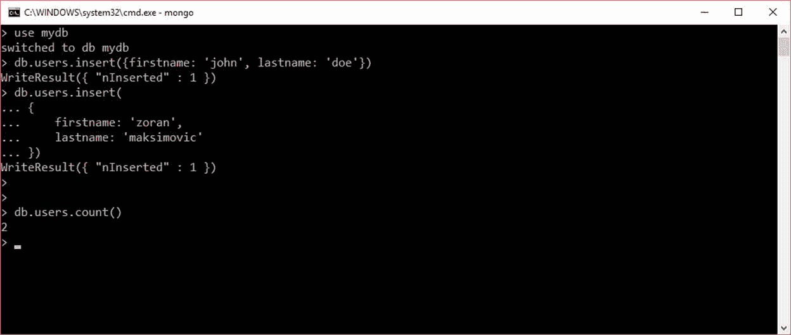
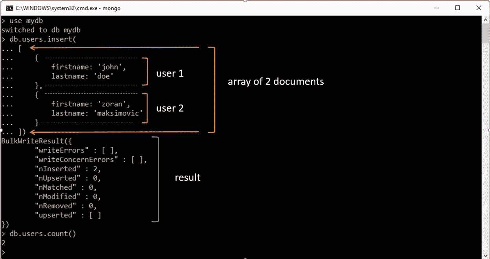
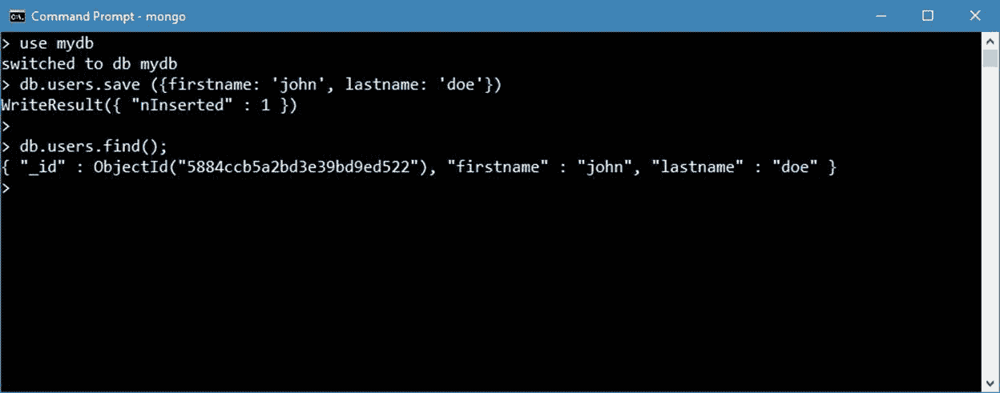
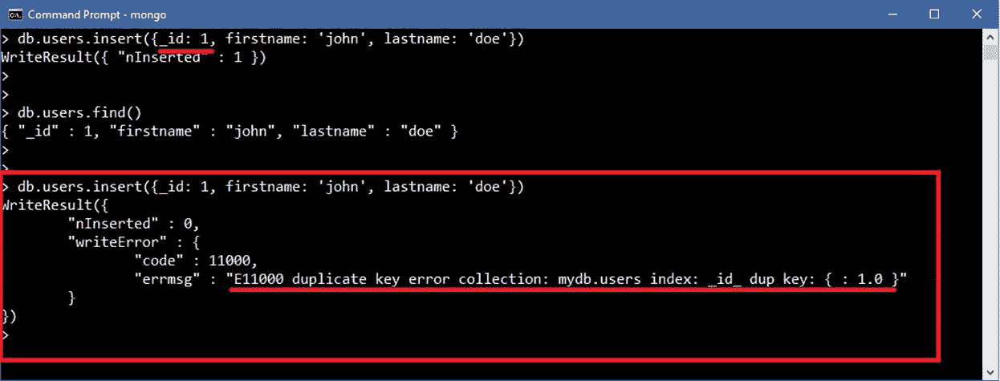
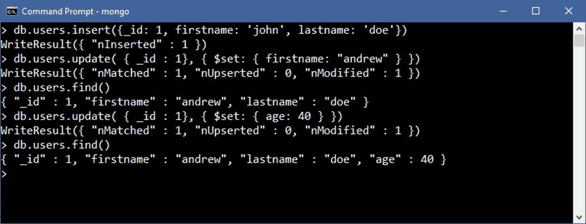
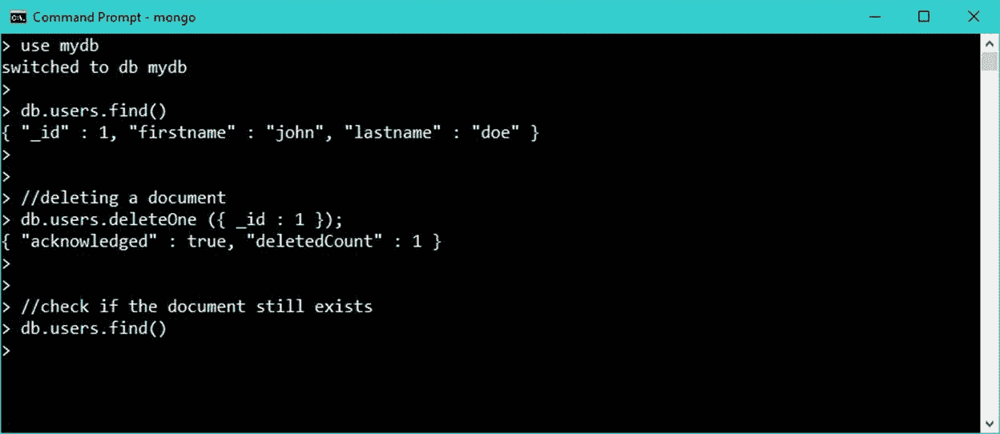

# 第四章操纵文件

现在我们已经找到了可用的集合，让我们来看看以下用于操作文档的命令:

*   `Insert`
*   `Update`
*   `Remove`

### 简单的数据检索

在我们真正开始这些操作之前，让我们看看如何用最简单的术语查询数据库，因为这个方法将在后面的章节中作为一个例子。

MongoDB 外壳提供了查询数据的能力；这主要是通过使用`db.<collection>.find()`方法来实现的。

`db.collection.find()`将检索给定集合(实际上是前 20 个)中的所有文档。有关更多信息，请参见如何在 MongoDB 中查找和投影数据的完整章节。

### 插入文档

有几种方法可以将数据插入 MongoDB 集合。

表 3:文档创建方法

| `db.<collection>.insert()` | 将文档或文档集合插入集合。向调用者返回一个`BulkWriteResult`对象。 |
| `db.<collection>.insertOne()` | 在 v3.2 中新增。在集合中插入单个文档。 |
| `db.<collection>.insertMany()` | 3.2 版新增。将多个文档插入到集合中。如果确认插入，则返回包含对象标识和信息的文档。 |
| `db.<collection>.save()` | 根据其`document`参数，更新现有文档或插入新文档。返回一个`WriteResult`对象。 |

以下示例的目标是在`users`集合中添加一个新用户。

正如我们所看到的，插入一个简单的文档来表示`user`是相当容易的。



图 20:插入用户。

指定 JSON 字符串时使用单行还是多行并没有什么区别。重要的一点是用右括号结束函数。文档一插入，MongoDB shell 就会以`WriteResult ({ “nInserted”: 1 })`的形式通知我们受影响的行数。

为了证明我们已经插入了两个用户，我们可以调用`db.users.count()`，它将返回当前存在于`users`集合中的文档计数。

也可以一次插入多个文档，方法是使用一个 JSON 文档数组，并将其作为参数传递给`insert`函数。在 JSON 中，括号[ ]用于指定对象的数组。



图 21:向集合中插入多个文档。

也可以使用`db.users.save()`将新文档插入到集合中。实际上，`save()`命令可以用于插入或更新文档。

如果不存在具有指定`_id`值的文档，`save()`方法使用文档中的指定字段执行插入；否则，将执行更新，用文档中的字段替换现有记录中的所有字段。

让我们看一个如何使用`save()`命令将数据插入集合的例子。这非常简单，看起来与前面的例子非常相似。



图 22:使用 save()将数据插入集合。

#### 文档主键

当我们从`users`集合中检索项目时，您可能已经注意到有一个名为`_id`、的字段，我们在插入文档时没有明确提到它。

与任何数据库一样，MongoDB 提供了一种处理文档主键的方法。存储在集合中的文档需要一个唯一的 [`_id`](https://docs.mongodb.com/manual/reference/glossary/#term-id) 字段，作为[主键](https://docs.mongodb.com/manual/reference/glossary/#term-primary-key)。我们可以明确设置`_id`的值；或者，数据库将默认分配一个。MongoDB 使用 [`ObjectId`](https://docs.mongodb.com/manual/reference/bson-types/#objectid) 类型作为默认值来存储`_id`字段的值；但是，`_id`字段可以包含任何 [BSON 数据类型](https://docs.mongodb.com/manual/reference/bson-types/)的值，而不是数组。

`ObjectId`是 BSON 类型，其值由 12 个字节组成，其中前四个字节是反映`ObjectId`创建的时间戳，具体为:

*   一个 4 字节的值，表示自 [Unix 纪元](https://en.wikipedia.org/wiki/Unix_time)以来的秒数
*   3 字节的机器标识符
*   一个 2 字节的进程标识
*   从随机值开始的 3 字节计数器

所以，这是一个非常好的独特价值的候选。让我们看一个关于如何强制我们自己的主键的小例子:

代码清单 20:通过强制主键插入用户数据

```
  db.users.insert({_id: 1, firstname: 'john', lastname: 'doe'}) 

```

分配`_id`和处理任何其他属性一样简单。如图 23 所示，将避免重复的主键。



图 23:不允许重复主键。

### 更新文档

MongoDB 允许您通过以下方式更改现有文档:

*   更新现有字段的值。
*   通过添加或删除属性(字段)来更改文档。
*   完全替换文档。

为了操作文档，MongoDB 主要提供了三种不同风格的`update()`方法，在收集级别执行。

表 4: MongoDB 文档更新方法

| `db.<collection>.update()` | 修改集合中的文档。该方法可以修改一个或多个现有文档的特定字段，或者完全替换现有文档。 |
| `db.<collection>.updateOne()` | 从 v3.2 开始新增。更新集合中的一个文档。 |
| `db.<collection>.updateMany()` | 从 3.2 版开始新增。更新集合中的多个文档。 |

#### 更新现有属性的值

以下似乎是要执行的最明显的操作，所以让我们尝试在`users`集合中更改一个用户的`firstname`。为了做到这一点，让我们通过运行以下命令，用更简单的`_id`创建一个新用户:

代码清单 21:创建一个具有固定主键的用户

```
  db.users.insert({_id: 1, firstname:
  'john', lastname: 'doe'}) 

```

一旦用户在集合中，我们可以通过运行`find()`方法快速查询集合，检查用户是否已经正确插入。`find()`方法将返回集合中项目的完整列表。

代码清单 22:搜索用户数据(基本用法)

```
  db.users.find() 

```

你应该能用主键`_id` = `1`看到用户。

为了改变用户的`firstname`，我们可以使用以下命令:

代码清单 23:更新用户的名字

```
  db.users.update( 
      { _id : 1},                        //filter 
      { $set: { firstname:
  "andrew" } }  //update action
  ) 

```

第一个参数(红色)表示*过滤器*，它将应用于具有更新的项目，有点像更新关系数据库管理系统中的记录时的`WHERE`子句。

第二个参数(蓝色)定义了要执行的操作。在我们的例子中，我们使用运算符`$set`来设置`firstname`的值。

如果我们传递的字段不在文档中，它将被自动创建。如果我们想添加用户的年龄，那么它变得很简单:

代码清单 24:更新用户年龄

```
  db.users.update( { _id : 1}, { $set: {
  age: 40 } }) 

```

在命令行上，您应该会看到类似于以下内容的内容:



图 24:应用更新方法。

为了给出`update()`方法支持哪些参数的概念，让我们看一下一般的方法签名:

代码清单 25:集合更新方法签名

```
  db.collection.update(
     <query>,
     <update>,
     {
       upsert: <boolean>,
       multi: <boolean>,
       writeConcern: <document>
     }
  )

```

表 5:更新方法的选项

| `query` | 定义更新的选择标准。这相当于关系数据库管理系统中的`WHERE`子句。 |
| `update` | 指定要对符合查询条件的文档执行的操作。这是我们可以更新字段或创建新字段的地方。 |
| `update-options` | 在第三个参数中，可以指定的选项很少:`upsert`:如果设置为`true`，当查询条件没有找到单据时，新建单据。默认设置为**假**。`multi`:如果设置为`true`，则更新多个文档；否则，只有一个。`writeConcern`:定义数据库将如何处理写入部分。例如，我们可以为查询定义超时，或者确认数据已经传播到一个或多个节点(在多节点设置的情况下)。 |

#### 更新运算符

有相当多的更新操作符可以用来操作值。我们已经看到了`$set`运算符的用法，它通过显式设置值来对文档执行更改，但是还有其他用法:

表 6:更新运算符

| `$set` | 设置文档中字段的值。 |
| `$unset` | 从文档中移除指定的字段。 |
| `$min` | 如果该值小于现有字段值，则更新该字段。 |
| `$setOnInsert` | 如果更新导致插入文档，则设置字段的值。对修改现有文档的更新操作没有影响。 |
| `$max` | 如果该值大于现有字段值，则更新该字段。 |
| `$rename` | 重命名字段。 |
| `$mul` | 将字段值乘以指定的值。 |
| `$inc` | 将该值增加(递增)特定的量。 |
| `$currentDate` | 将字段值设置为当前日期。 |

如果我们处理的是一个项目数组(项目集合)，那么还有几个操作符，包括:

表 7:更新数组运算符

| `$pull` | 移除与指定查询匹配的所有列表元素。 |
| `$push` | 将项添加到数组中。 |
| `$addToSet` | 仅当项尚不存在时，才将该项添加到数组中。 |

有关可用操作员的完整列表，请访问官方 [MongoDB 文档](https://docs.mongodb.com/v3.4/reference/operator/update)或使用以下命令直接在 MongoDB 外壳中检查可用选项:

代码清单 26:集合帮助的使用

```
  db.users.help()

```

另外，检查这些更新方法的方法签名。

### 删除文档

与更新非常相似，MongoDB 提供了各种删除文档的方法。这些方法遵循几乎相同的原则。

表 8:数据删除方法

| `db.<collection>.drop()` | 通过删除集合本身完全清空集合。虽然这并不完全是删除文档，但可以将其视为清理数据的一种方式。 |
| `db.<collection>.remove()` | 删除符合指定筛选器的单个文档或多个文档。 |
| `db.<collection>.deleteOne()` | 即使多个文档可能匹配指定的筛选器，也最多删除一个匹配指定筛选器的文档。它将删除第一个文档。 |
| `db.<collection>.deleteMany()` | 删除符合指定过滤器的所有文档。 |

让我们使用`deleteOne`方法演示单个文档的删除。`deleteOne`方法的签名如下。如前所述，它接受过滤器和`writeConcern`。`WriteConcern`不是强制的，如果没有指定，将取默认值。

代码清单 27:删除一个方法签名

```
  db.collection.deleteOne( <filter>,  writeConcern:
  <document> )

```

假设我们已经在`users`表中有一个条目，我们尝试删除它。这可能如下所示:



图 25:删除文档。

这里有趣的是过滤器部分，我们在这里指定要删除的文档。在我们的例子中，这直接是主键，`_id = 1`。