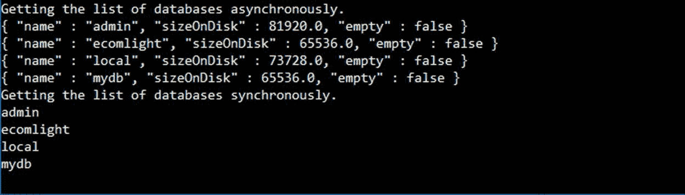
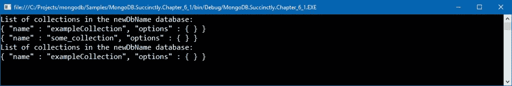

# 第六章 C#基础 MongoDB

多年来，随着 MongoDB 越来越成为主流数据库，大量技术被接受和扩展，因此有可能进行交互。与来自 Java、Microsoft.NET、Node.js 和许多其他平台的 MongoDB 进行交互是非常正常的。

在本章中，我们将讨论如何使用 Microsoft.NET 和 C#来操作 MongoDB 中的数据。这个想法是展示一些基本的操作(并带来一些构建模块)，然后在稍后深入到一个更复杂的解决方案。

为了能够使用来自 Microsoft.NET 的 MongoDB，我们需要一个特定的驱动程序。在本书中，我们将使用 MongoDB 提供的官方驱动程序。

驱动可以从 [MongoDB 网站](https://docs.mongodb.org/ecosystem/drivers/csharp)下载。但是，安装驱动程序的首选方法是使用 NuGet 包，该包可通过以下命令获得:

代码清单 52:在 NuGet 上安装 MongoDB 驱动程序

```js
  Install-Package
  MongoDB.Driver

```

NuGet 上还有其他几个官方(传统)MongoDB 驱动程序可用；但是，前面提到的包是最新支持的，它应该用于任何新项目。在写这本书的时候，驱动的最新版本是 **2.4** ，至少需要使用 Microsoft.NET v 4.5；但是，它也支持。NET 核心。

表 15: C#驱动程序版本

| **C#/。NET 驱动程序版本** | **蒙戈布 2.4** | **蒙戈布 2.6** | **蒙戈布 3.0** | **蒙戈布 3.2** | **蒙戈布 3.4** |
| --- | --- | --- | --- | --- | --- |
| **2.4 版** |  |  |  | -好的 | -好的 |
| **2.3 版** | -好的 | -好的 | -好的 | -好的 | -好的 |
| **2.2 版** | -好的 | -好的 | -好的 | -好的 |  |

从驱动 2.0 版本开始，就有了对`async` API 的支持。这个特性允许我们更有效地使用资源。与以前的版本相比，这个版本带来了一个新的、更简化的应用编程接口。例如，现在有`Option`类允许以这种方式配置不同的重载，而不是重载方法。

驱动程序实现了三个最重要的顶级接口:

表 16: MongoDB 驱动程序的主要接口

| `IMongoClient` | 定义将与 MongoDB 服务器交互的根对象。负责连接、监控和对服务器执行操作。 |
| `IMongoDatabase` | 表示 MongoDB 服务器实例中的`database`。 |
| `IMongoCollection` | 表示 MongoDB 数据库中的一个`collection`。 |

在接下来的章节中，我们将看看如何使用实现上述接口的类。

## 连接到数据库

在本章中，您将学习如何连接到 MongoDB 数据库并执行基本操作，如引用、创建和删除(删除)数据库。

连接到数据库非常简单，它包括使用`MongoClient`的一个实例。

|  | 注意:正如我们在前面几章中看到的，除非另外配置，否则默认情况下 MongoDB 在端口 27017 上运行。 |

首先要做的是直接在 Visual Studio 中运行`Install-Package MongoDB.Driver`，使用包管理器控制台，安装 MongoDB C#驱动。

最简单的方法，不使用任何额外的设置，就是创建一个`MongoClient`类的实例，并将`connectionString`作为参数传递。请注意，配置字符串的格式为“`mongodb://servername:port`”。

代码清单 53:在没有身份验证的情况下连接到 MongoDB

```js
  using System;
  using MongoDB.Driver;

  public static void ConnectWithoutAuthentication()
  {
      string connectionString = "mongodb://localhost:27017";

      MongoClient client = new MongoClient(connectionString);

      Console.WriteLine("Connected"); 
  }

```

连接字符串可以包含相当多的参数，例如在我们使用 MongoDB 集群的情况下的主机列表，或者指定连接选项。完整签名如下:

代码清单 54: MongoDB 连接字符串

```js
  mongodb://[username:password@]host1[:port1][,hostN[:portN]]]
  [/[database][?options]]

```

创建`MongoClient`的实例会自动创建到 MongoDB 的连接。`MongoClient`在后台使用一个连接池。

MongoDB 建议每个应用程序只创建一个`MongoClient`实例，这样可以更好地重用连接。如果使用控制反转(IoC)框架，则`MongoClient`实例可以安全地配置为单例生存期。

### 认证

MongoDB 本身支持多种认证机制，如 [`SCRAM-SHA-1`](https://docs.mongodb.com/manual/reference/operator/aggregation/) 、MONGODB-CR、X.509 证书、LDAP Proxy、Kerberos。默认情况下，使用`SCRAM-SHA-1`。发送用户名和密码就像创建一个`MongoCredential`实例并提供`database`、`username`和`password`一样简单，并将其包装在要传递给`MongoClient`的`MongoClientSettings`实例中。这是可以使用的第二个重载。描述可能比看到行动更复杂，如下所示:

代码清单 55:通过身份验证连接到 MongoDB

```js
  using MongoDB.Driver;

  public static void ConnectWithAuthentication()
  {
      string dbName = "ecommlight";
      string userName = "some_user";
      string password = "pwd";

      var credentials = MongoCredential.CreateCredential(dbName, userName, password);

      MongoClientSettings clientSettings = new MongoClientSettings()
      {
          Credentials = new[] { credentials },
          Server = new MongoServerAddress("localhost", 27017)
      };

      MongoClient client = new MongoClient(clientSettings);

      Console.WriteLine("Connected as {0}", userName);
  }

```

正如很快提到的，MongoDB 有一个丰富的身份验证机制模型，这远远超出了本书的范围。有关各种身份验证方法的更多详细信息，请参见本文档[。](http://mongodb.github.io/mongo-csharp-driver/2.3/reference/driver/authentication)

## 数据库操作

通过 MongoDB 驱动程序，可以创建、列出或删除数据库，这将在本节中演示。

### 引用数据库

创建对数据库的引用是几乎所有数据操作示例都需要的基本操作。MongoDB 中定义的层次结构是:

**服务器>数据库>采集>文档>数据**

为了得到数据，应该有一个对数据库的引用，然后一路向下。

为了保持示例简单并简化代码，我们将创建一个简单的方法，该方法将返回`MongoClient`的一个实例，然后使用该实例来代替每次手动创建连接。

代码清单 56:实例化蒙古客户端的通用方法

```js
  public static MongoClient GetMongoClient(string hostName)
  {
      string connectionString = string.Format("mongodb://{0}:27017", hostName);
      return new MongoClient(connectionString);
  }

```

我们使用`GetDatabase()`方法直接从`MongoClient`实例获取对数据库的引用，如下所示:

代码清单 57:获取数据库引用的通用方法

```js
  public static IMongoDatabase GetDatabaseReference(string
  hostName, string dbName)
  {
      MongoClient client = GetMongoClient(hostName);
      IMongoDatabase database = client.GetDatabase(dbName);
      return database;
  }

```

`GetDatabase()`返回一个实现`IMongoDatabase`接口的对象，本例中为`MongoDatabaseImpl`，是具体的实现。

### 数据库创建

MongoDB 驱动程序没有创建数据库的显式方法，但这可以通过引用数据库来实现，正如我们在`GetDatabaseReference`方法中看到的那样。

如果数据库名称不存在，MongoDB 驱动程序将在我们第一次向它添加文档时自动创建它，或者简单地创建一个新的集合。

代码清单 58:用 C#创建一个新的数据库

```js
  public static IMongoDatabase CreateDatabase(string databaseName, string collectionName)
  {
      MongoClient client = GetMongoClient(hostName);
      IMongoDatabase database = client.GetDatabase(databaseName);
      database.CreateCollection(collectionName);
      return database;
  }

```

我们可以称之为:

代码清单 59:调用 CreateDatabase 方法

```js
  public static void Main(string[] args)
  {
      CreateDatabase("newDatabaseName", "newCollectionName");
  }

```

### 获取数据库列表

获取数据库列表很简单。与获取对单个数据库的引用的方式相同，我们可以在`MongoClient`实例上调用`ListDatabases()`或`ListDatabasesAsync()`，并获取`BsonDocument`的实例，该实例将包含服务器上可用数据库的基本信息。这两种方法都会返回一个实现`IAsyncCursor`的对象实例；然而，`Async`版本将返回`Task<IAsyncCursor>`。让我们看一个例子:

代码清单 60:显示可用数据库的列表

```js
  using System;
  using MongoDB.Driver;
  using System.Threading.Tasks;

  public static async Task GetListOfDatabasesAsync()
  {
      MongoClient client = GetMongoClient("localhost");

      Console.WriteLine("Getting the list of databases asynchronously…");
      using (var cursor = await client.ListDatabasesAsync())
      {
          await cursor.ForEachAsync(d => Console.WriteLine(d.ToString()));
      }
  }

  public static void GetListOfDatabasesSync()
  {
      MongoClient client = GetMongoClient("localhost");

      Console.WriteLine("Getting the list of databases synchronously…");
      var databases = client.ListDatabases().ToList();
      databases.ForEach(d => Console.WriteLine(d.GetElement("name").Value));
  }

```

这种情况下的输出如下:



图 40:通过 C#返回数据库列表。

我想强调的是，在第一种情况下(我们使用`async`方法)，一个`BsonDocument`被返回并打印到控制台。由于是 JSON 格式，所以很容易识别。

在第二种情况下，通过使用`Console.WriteLine(d.GetElement("name").Value))`，我们只返回它的`name`部分。

### 删除数据库

要从 MongoDB 服务器中删除数据库，我们从`MongoClient`对象中调用`Drop` `Database()`或`DropDatabaseAsync()`方法。

代码清单 61:删除数据库(同步和异步版本)

```js
  public static void DropDatabase(string databaseName)
  {
      MongoClient client = GetMongoClient("localhost");
      client.DropDatabase(databaseName);
  }

  public static async void DropDatabaseAsync(string databaseName)
  {
      MongoClient client = GetMongoClient("localhost");
      await client.DropDatabaseAsync(databaseName);
  }

```

## 处理收藏

正如我们在前面几章中看到的，我们可以通过使用 MongoDB 外壳来列出和操作集合。这也可以通过使用 C#驱动程序来实现。在下面的示例中，我们将展示如何列出、创建和删除集合。

`IMongoDatabase`上主要有三种方法可用:

*   `CreateCollection`和`CreateCollectionAsync`:如果不可用，创建一个新的集合。
*   `ListCollections`和`ListCollectionsAsync`:列出数据库中已经可用的集合。
*   `DropCollection`和`DropCollectionAsync`:从给定的数据库中删除(删除)一个集合。

我们可以将`CreateListAndDropCollections`方法中的所有操作总结如下:

代码清单 62:显示可用集合的列表

```js
  public static void CreateListAndDropCollections(string databaseName)
  {
      var database = GetDatabaseReference(hostName, databaseName);
      var collectionName = "some_collection";

      //create a new collection.
      database.CreateCollection(collectionName);

      //showing the list of collections before deleting.
      ListCollections(hostName, databaseName);

      //delete a collection.
      database.DropCollection(collectionName);

      //showing the list of collections after deleting.
      ListCollections(hostName, databaseName);
  }

  public static void ListCollections(string hostName, string databaseName)
  {
      var database = GetDatabaseReference(hostName, databaseName);

      var collectionsList = database.ListCollections();

      Console.WriteLine("List of collections in the {0} database:", 

  database.DatabaseNamespace);
      foreach (var collection in collectionsList.ToList())
      {
          Console.WriteLine(collection.ToString());
      }
  }

```

并通过从调用前面的代码:

代码清单 63:调用方法来显示集合

```js
  public static void Main(string[] args)
  {
      var newDatabaseName = "newDbName";

  CreateListAndDropCollections(newDatabaseName);
  }

```

这种情况下的输出如下:



图 41:可用集合的列表。

请记住，如果集合已经存在，创建集合将导致错误。