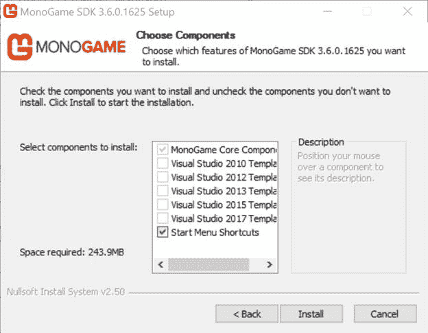

# 二、安装和配置

这本书将使用 Visual Studio 版本的软件。如果没有 Visual Studio，可以在这里免费下载社区版[。请确保在安装一夫一妻制之前安装 Visual Studio。](https://www.visualstudio.com/vs/community/)

你可以在[一夫一妻制网站](http://www.monogame.net/downloads)上找到一夫一妻制的下载页面。所有的公开版本都应该列在页面的顶部，最新的在顶部。在撰写本文时，最新版本是 3.6。

单击某个版本的链接后，您将看到一个列出各种可用版本的页面。您通常会找到 Windows、Mac OS 和 Linux 的版本，以及源代码和预编译的程序集。

启动一夫一妻制设置后，您将进入一个屏幕，允许您选择要为其安装软件的 Visual Studio 版本。

图 1 -一夫一妻制设置

安装会检测您安装了哪个版本的 Visual Studio，并禁用您没有的选项。您可以选择一个或多个已安装的 Visual Studio 版本，无论您选择哪个版本，一夫一妻制都将可用。由于 Visual Studio 2017 是编写本文时的最新版本，所以我们将使用它。