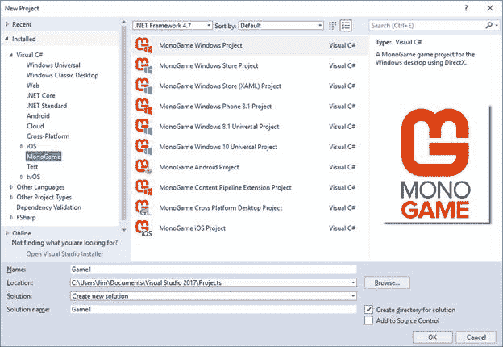
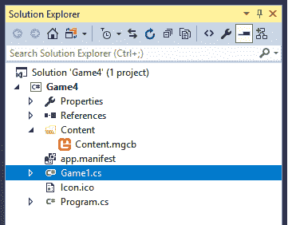
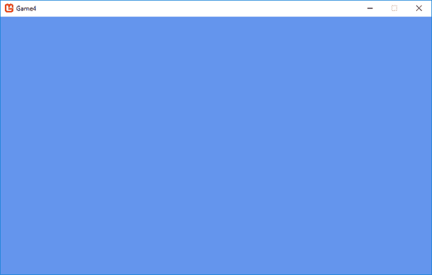
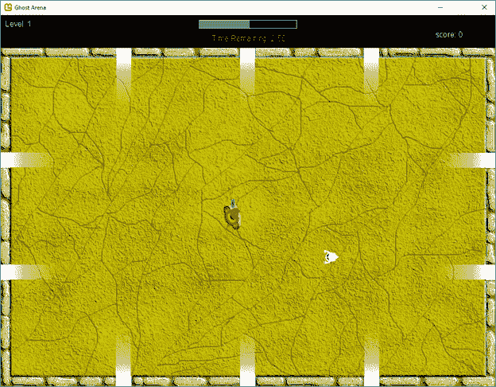
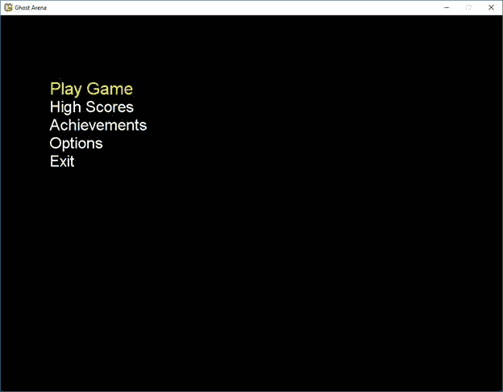
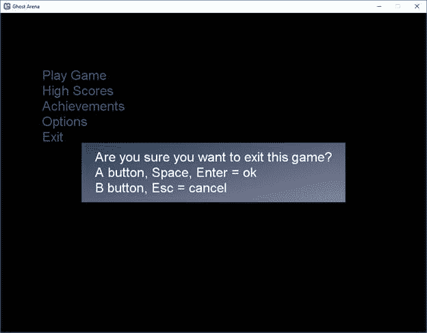
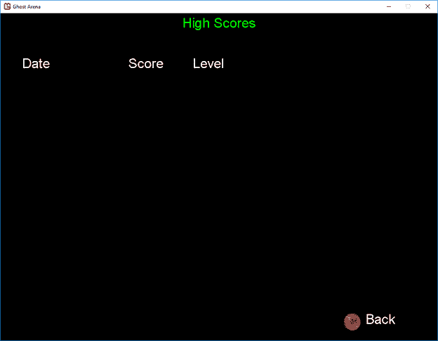
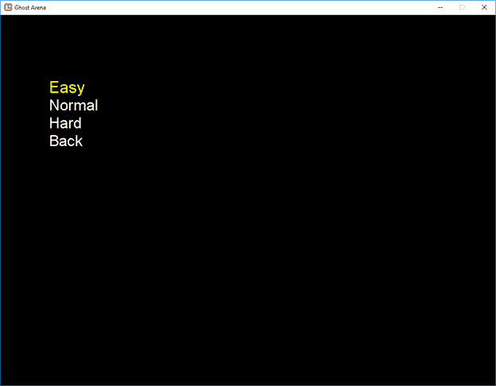

现在我们已经安装了一夫一妻制，我们可以开始实际的游戏了。打开 Visual Studio，选择**新建** > **项目**菜单项。您将看到如下所示的对话框:



图 2- Visual Studio 新建项目对话框

我在**安装**列表中选择了**一夫一妻**节点。请注意，选项不仅适用于电脑，也适用于移动设备。如果你想同时瞄准多个平台，你可以选择一夫一妻制跨平台桌面项目选项，但是我们只能在 Windows 中工作。特别是，我们想创建一个**一夫一妻制视窗项目**游戏。选择这个项目类型，给你的项目起一个名字(如果你想匹配可供下载或在书里的代码，请使用**幽灵竞技场**，如果你愿意，请选择一个位置，点击**确定**。解决方案浏览器将显示一夫一妻制提供的游戏的基本框架:



图 3-默认的一夫一妻制窗口项目

程序. cs 文件是程序的入口点:

```
  public static class Program
  {
      [STAThread]
      static void Main()
      {
          using (var game = new Game1())
              game.Run();
      }
  }

```

代码清单 1–程序类

**`Main`** 方法创建 **`Game1`** 类的实例，并调用其 **`Run`** 方法。这将启动一个内部游戏循环，允许您在每一帧中更新和绘制对象。它通过在 **`Game`** 类中提供方法来做到这一点。这个循环会一直运行到你关闭游戏窗口或者调用 **`Game`** 类的 **`Exit`** 方法。

**`Game`** 类是一夫一妻制项目的骨干代码。它提供了许多执行所有游戏所需功能的方法，例如加载和卸载内容(音频、图形等)。)，绘制和更新游戏对象。所有这些方法都被声明为`protected virtual`，预计使用一夫一妻制的项目将包含一个从它派生的类，并覆盖这些方法，实现特定游戏所需的功能。标准项目通过提供一个`Game1`类来做到这一点:

```
  public class Game1 : Game
  {
      GraphicsDeviceManager graphics;
      SpriteBatch spriteBatch;
      public Game1()
      {
          graphics = new GraphicsDeviceManager(this);

  Content.RootDirectory = "Content";
      }

      protected override void Initialize()
      {
          base.Initialize();
      }

      protected override void LoadContent()
      {
          spriteBatch = new SpriteBatch(GraphicsDevice);
      }

      protected override void UnloadContent()
      {
      }

      protected override void Update(GameTime gameTime)
      {
          if (GamePad.GetState(PlayerIndex.One).Buttons.Back == ButtonState.Pressed || Keyboard.GetState().IsKeyDown(Keys.Escape))
              Exit();

          base.Update(gameTime);
      }

      protected override void Draw(GameTime gameTime)
      {

  GraphicsDevice.Clear(Color.CornflowerBlue);

          base.Draw(gameTime);
      }
  }

```

代码清单 2–基本游戏类

图形成员设置和控制图形系统。您可以使用它在全屏和窗口模式之间切换，并调整窗口大小。我们将在下一章深入探讨。

`spriteBatch`成员是您用来通过`Draw`和`DrawString`方法在屏幕上实际绘制精灵和文本的对象。

这些方法都是注释的，应该是相当不言自明的。我们将在接下来的几章中详细解释大多数方法。目前，只需编译并运行该项目。您应该会看到标准的填充窗口:



图 4-默认游戏窗口

按下游戏手柄上的退出键或后退按钮将关闭窗口，如`Update`方法所示。在接下来的几章中，我们将用一个更健壮的输入处理系统来代替它，但是现在，它足以让你干净利落地退出游戏。

在我们继续之前，让我们探索一下使用图形对象时可用的选项。

你想让玩家做的第一件事是在窗口或全屏运行你的游戏。这通常需要大量的代码，但是对于一夫一妻制，这是一个简单的方法调用:

```
  protected override void Update(GameTime gameTime)
  {
      if (GamePad.GetState(PlayerIndex.One).Buttons.Back == ButtonState.Pressed || Keyboard.GetState().IsKeyDown(Keys.Escape))
          Exit();

      if (Keyboard.GetState().IsKeyDown(Keys.Enter) && previousState != null && previousState.IsKeyUp(Keys.Enter))
      {

  graphics.ToggleFullScreen();
      }

      previousState = Keyboard.GetState();

      base.Update(gameTime);
  }

```

代码清单 3–切换全屏模式

虽然`ToggleFullScreen`方法实际上是工作的，但是它周围需要一些代码来避免抛出错误。稍后我们将进入`GamePad`、`Keyboard`和相关课程，但代码的基本要点是，每次按下回车键，我们都会在全屏和窗口模式之间切换。

你想给玩家的另一个主要选项是改变游戏窗口分辨率的能力。为了正确地做到这一点，您需要知道用户的机器支持哪些分辨率。您可以通过以下代码获得这些信息:

```
  foreach (DisplayMode dm in GraphicsAdapter.DefaultAdapter.SupportedDisplayModes)
  {
      Console.WriteLine("\n width, height(" + dm.Width.ToString() + "," + dm.Height.ToString() + "), aspect ratio - " + dm.AspectRatio.ToString());
  }

```

代码清单 4–支持的解决方案

我们将在后面的章节中实现这一点。

根据您的游戏，您可能希望允许用户配置其他选项。我们将在第 5 章介绍输入选项(例如为某些动作配置按键)，在第 6 章介绍音频选项。

我们的游戏将使用微软为开发 XNA 游戏提供的一个样例，即“游戏状态管理”样例，可以在[这里](https://github.com/SimonDarksideJ/XNAGameStudio/wiki/Game-State-Management-(Mango,-C%23VB))找到。

该示例为构建任何游戏提供了一个良好的框架，包括菜单和游戏屏幕，以及键盘或游戏手柄的输入处理。如果您不想继续阅读本书来构建游戏，您可以下载示例并查看代码，或者下载我们将在本书中开发的游戏的完整游戏代码。

我们将要构建的游戏是一个简单的自上而下的射手。玩家在 10 个不同的入口出现鬼魂的竞技场中控制一个角色。如果一个鬼魂接触了这个角色，它会消耗掉他的一些健康，然后消失。玩家通过杀死鬼魂来获得分数，游戏的目标是尽可能长时间的生存并获得尽可能高的分数。完成的游戏将看起来像下面的截图。



图 5 -完成的游戏截图

游戏将记录玩家的分数，允许显示最高分数。游戏也会有可以赚取和展示的成就。将实施难度系统，使游戏对熟练玩家更具挑战性。

有了基础游戏，我们将需要添加许多类和文件夹，以达到我们可以开始显示图形的地步。首先，我们将添加几个文件夹:屏幕管理器和屏幕。在**屏幕管理器**文件夹中，添加两个类:`GameScreen.cs`和`ScreenManager.cs`。用以下代码替换`ScreenManager`类中的代码:

```
  using System;
  using System.Collections.Generic;
  using Microsoft.Xna.Framework;
  using Microsoft.Xna.Framework.Graphics;

  namespace Ghost_Arena
  {
      public class ScreenManager : DrawableGameComponent
      {
          List<GameScreen>
  _screens = new List<GameScreen>();
          List<GameScreen>
  _screensToUpdate = new List<GameScreen>();
          bool _traceEnabled;

          new public Game Game
          {
              get { return base.Game;
  }
          }

          public bool TraceEnabled
          {
              get { return _traceEnabled; }
              set { _traceEnabled = value; }
          }

          public ScreenManager(Game
  game, GraphicsDeviceManager graphicsDeviceManager)
              : base(game)
          {
          }

          protected override void LoadContent()
          {
              foreach (GameScreen screen in _screens)
              {

  screen.LoadContent();
              }
          }

          protected override void UnloadContent()
          {
              foreach (GameScreen screen in _screens)
              {

  screen.UnloadContent();
              }
          }

          public override void
  Update(GameTime gameTime)
          {

  _screensToUpdate.Clear();

              foreach (GameScreen screen in _screens)

  _screensToUpdate.Add(screen);

              bool otherScreenHasFocus = !Game.IsActive;
              bool coveredByOtherScreen = false;

              while (_screensToUpdate.Count > 0)
              {
                  GameScreen screen =
  _screensToUpdate[_screensToUpdate.Count - 1];

  _screensToUpdate.RemoveAt(_screensToUpdate.Count - 1);

  screen.Update(gameTime, otherScreenHasFocus, coveredByOtherScreen);

                  if (screen.ScreenState == ScreenState.TransitionOn ||

  screen.ScreenState == ScreenState.Active)
                  {
                      if (!otherScreenHasFocus)
                      {
                          screen.HandleInput(_input,
  gameTime);

  otherScreenHasFocus = true;
                      }

                      if (!screen.IsPopup)

  coveredByOtherScreen = true;
                  }
              }

              if (_traceEnabled)

  TraceScreens();
          }

          void TraceScreens()
          {
              List<string>
  screenNames = new List<string>();

              foreach (GameScreen screen in _screens)

  screenNames.Add(screen.GetType().Name);
          }

          public override void
  Draw(GameTime gameTime)
          {
              foreach (GameScreen screen in _screens)
              {
                  if (screen.ScreenState == ScreenState.Hidden)
                      continue;

  screen.Draw(gameTime);
              }
          }

          public void AddScreen(GameScreen screen)
          {

  screen.ScreenManager = this;

  screen.Initialize();

  _screens.Add(screen);
          }

          public void RemoveScreen(GameScreen screen)
          {

  _screens.Remove(screen);

  _screensToUpdate.Remove(screen);
          }

          public GameScreen[] GetScreens()
          {
              return _screens.ToArray();
          }
      }
  }

```

代码清单 5–屏幕管理器类

因为我们的游戏中会有大约 10 个不同的屏幕，所以一个好的、干净的方式来管理它们并能够在它们之间转换是非常重要的。每个屏幕，无论是菜单、暂停还是游戏屏幕，都将是一个独立的类。`ScreenManager`保存每个正在使用的屏幕的实例数组，并告诉每个实例更新和绘制自己，而不是必须找出哪个是活动的，并让它绘制和更新。它通过继承`DrawableGameComponent`来实现这一点，T1 是一个框架类，提供了一种加载内容和绘制的方法。这个类又继承了`GameComponent`，它提供了一种每帧更新自己的方法。每帧也调用`Draw`方法。当类的一个实例被创建或销毁时，`LoadContent`和`UnloadContent`只被调用一次。

我们将在进行的过程中填写其中的一些方法，但这是目前所需要的。

我们需要创建一个`this`类的实例。那将在`Game`课上完成。添加成员和代码来初始化它:

```
  ScreenManager screenManager;

  protected override void Initialize()
  {

  screenManager = new ScreenManager(this, graphics);

  screenManager.Initialize();

      // Activate the
  first screens.

  screenManager.AddScreen(new MainMenuScreen());

  Components.Add(screenManager);

      base.Initialize();
  }

```

代码清单 6–屏幕管理器创建

我们将很快看到游戏开始时显示的第一个屏幕`MainMenuScreen`。

添加了`ScreenManager`实例的`Components`成员是`GameComponent`(或`DrawableGameComponent`对象的集合，因为它继承自`GameComponent`)对象。`GameComponent`类实现了四个不同的接口，为对象提供了一些基本功能:`IGameComponent`、`IUpdateable`、`IComparable`和`IDisposable`。

`IGameComponent`提供了一种`Initialize`方法，`IUpdateable`:

| **属性** |
| `Enabled` |
| `UpdateOrder` |
| **方法** |
| `Update` |
| **事件** |
| `EnabledChanged` |
| `UpdateOrderChanged` |

表 1–可更新成员

`IComparable`给了我们一个`CompareTo`方法，允许我们比较两个实例，告诉我们这两个实例在`GameComponents`列表中的相对位置，`IDisposable`提供了一个`Dispose`方法。

继续，用以下内容替换`GameScreen`类中的代码:

```
  using System;
  using Microsoft.Xna.Framework;

  namespace Ghost_Arena
  {
      public enum ScreenState
      {
          TransitionOn,
          Active,
          TransitionOff,
          Hidden,
      }

      public abstract class GameScreen
      {
          public bool IsPopup
          {
              get { return _isPopup; }
              protected set
  { _isPopup = value; }
          }

          protected bool
  _isPopup = false;

          public TimeSpan TransitionOnTime
          {
              get { return _transitionOnTime; }
              protected set
  { _transitionOnTime = value; }
          }

          protected TimeSpan _transitionOnTime = TimeSpan.Zero;

          public TimeSpan TransitionOffTime
          {
              get { return _transitionOffTime; }
              protected set
  { _transitionOffTime = value; }
          }

          protected TimeSpan _transitionOffTime = TimeSpan.Zero;

          public float TransitionPosition
          {
              get { return _transitionPosition; }
              protected set
  { _transitionPosition = value; }
          }

          protected float _transitionPosition = 1;

          public byte TransitionAlpha
          {
              get { return (byte)(255
  - _transitionPosition * 255); }
          }

          public ScreenState ScreenState
          {
              get { return _screenState; }
              protected set
  { _screenState = value; }
          }

          protected ScreenState _screenState = ScreenState.TransitionOn;

          public bool IsExiting
          {
              get { return _isExiting; }
              protected set
  { _isExiting = value; }
          }

          protected bool
  _isExiting = false;

          public bool IsActive
          {
              get
              {
                  return !_otherScreenHasFocus &&

  (_screenState == ScreenState.TransitionOn ||

  _screenState == ScreenState.Active);
              }
          }

          protected bool
  _otherScreenHasFocus;

          public ScreenManager ScreenManager
          {
              get { return _screenManager; }
              internal set
  { _screenManager = value; }
          }

          protected ScreenManager _screenManager;
          public virtual void
  LoadContent() { }
          public virtual void
  UnloadContent() { }
          public virtual void
  Initialize() { }
          public virtual void
  Update(GameTime gameTime, bool otherScreenHasFocus,

  bool coveredByOtherScreen)
          {

  _otherScreenHasFocus = otherScreenHasFocus;

              if (_isExiting)
              {

  _screenState = ScreenState.TransitionOff;

                  if (!UpdateTransition(gameTime, _transitionOffTime, 1))
                  {

  ScreenManager.RemoveScreen(this);

  _isExiting = false;
                  }
              }
              else if (coveredByOtherScreen)
              {
                  if (UpdateTransition(gameTime, _transitionOffTime, 1))
                  {

  _screenState = ScreenState.TransitionOff;
                  }
                  else
                  {

  _screenState = ScreenState.Hidden;
                  }
              }
              else
              {
                  if (UpdateTransition(gameTime, _transitionOnTime, -1))
                  {
                      _screenState
  = ScreenState.TransitionOn;
                  }
                  else
                  {

  _screenState = ScreenState.Active;
                  }
              }
          }

          bool UpdateTransition(GameTime
  gameTime, TimeSpan time, int direction)
          {
              float transitionDelta;

              if (time == TimeSpan.Zero)

  transitionDelta = 1;
              else

  transitionDelta = (float)(gameTime.ElapsedGameTime.TotalMilliseconds
  /

  time.TotalMilliseconds);

  _transitionPosition += transitionDelta * direction;

              if ((_transitionPosition <= 0) || (_transitionPosition
  >= 1))
              {

  _transitionPosition = MathHelper.Clamp(_transitionPosition, 0, 1);
                  return false;
              }

              return true;
          }

          public abstract void
  Draw(GameTime gameTime);
          public virtual void
  ExitScreen()
          {
              if (_transitionOffTime <= TimeSpan.Zero)
              {

  ScreenManager.RemoveScreen(this);
              }
              else
              {

  _isExiting = true;
              }
          }
      }
  }

```

代码清单 7–游戏屏幕类

`GameScreen`类是我们游戏中所有屏幕的基类。四个`ScreenState`枚举显示了屏幕可能处于的不同状态，我们将不得不处理这些状态。这个类的大部分是由处理过渡的功能组成的，因为菜单会滑入和滑出以及淡出。暂停屏幕将显示在游戏屏幕的顶部，因此将只在屏幕的一部分上绘制，其余部分在它的后面部分可见。

`TransitionOnTime`和`TransitionOffTime`成员控制执行转换所需的时间。请注意，对于基类，两者都设置为`TimeSpan.Zero`，这意味着转换是瞬时的。

`TransitionPosition`和`TransitionAlpha`成员控制过渡发生时的外观。这更多是针对菜单屏幕，因为它们可以在显示器上滑动和滑动。其他大多数成员应该都很明显。

因为这个类是一个基类，其他类将继承它，所以除了在每个子类中相同的功能之外，它没有太多的功能。从它继承的类将被期望提供加载内容和绘制(以及稍后处理输入)的功能。这就是为什么这些方法是抽象的或虚拟的。

我们要添加的第一个将从它继承的类将是另一个基类，`MenuScreen`。在**屏幕**文件夹中添加一个同名的新类，并用以下代码替换:

```
  using System;
  using System.Collections.Generic;
  using Microsoft.Xna.Framework;
  using Microsoft.Xna.Framework.Input;
  using Microsoft.Xna.Framework.Graphics;

  namespace Ghost_Arena
  {
      abstract class MenuScreen : GameScreen
      {
          protected List<string> _menuEntries = new List<string>();
          int _selectedEntry = 0;

          protected IList<string> MenuEntries
          {
              get { return _menuEntries; }
          }

          public MenuScreen()
          {

  TransitionOnTime = TimeSpan.FromSeconds(0.5);

  TransitionOffTime = TimeSpan.FromSeconds(0.5);
          }

          public override void
  Initialize()
          {
              base.Initialize();
          }

          protected abstract void OnSelectEntry(int entryIndex);

          protected virtual void OnNewArrowDown(Keys arrow, int
  entryIndex)
          {
          }

          protected virtual void OnArrowDown(Keys arrow, int
  entryIndex, GameTime gameTime)
          {
          }

          protected virtual void OnArrowUp(Keys arrow, int
  entryIndex)
          {
          }

          protected abstract void OnCancel();

          public override void
  Draw(GameTime gameTime)
          {
              Vector2 position = new Vector2(100, 150);

              float transitionOffset = (float)Math.Pow(TransitionPosition, 2);

              if (ScreenState == ScreenState.TransitionOn)

  position.X -= transitionOffset * 256;
              else

  position.X += transitionOffset * 512;

          }
      }
  }

```

代码清单 8–菜单绿色类

我们的菜单屏幕将非常简单，只是在屏幕上呈现的字符串，当前选择的项目通过以不同的颜色呈现以及增长和收缩来突出显示。我们将在下一章中添加实际绘制它的代码。按下游戏手柄上的**回车**键或 **A** 按钮将“点击”菜单项。



图 6 -主菜单屏幕

`MainMenuScreen`类非常简单，因为大部分工作都是在基类中完成的。将此类添加到**屏幕**文件夹:

```
  using System;

  namespace Ghost_Arena
  {
      class MainMenuScreen : MenuScreen
      {
          public MainMenuScreen()
          {

  _menuEntries.Add("Play
  Game");

  _menuEntries.Add("High
  Scores");

  _menuEntries.Add("Achievements");

  _menuEntries.Add("Options");

  _menuEntries.Add("Exit");
          }

          public override void
  Initialize()
          {
              base.Initialize();
          }

          protected override void OnSelectEntry(int entryIndex)
          {
              switch (entryIndex)
              {
                  case 0:

  _screenManager.AddScreen(new DifficultyScreen());
                      break;
                  case 1:

  _screenManager.AddScreen(new HighScoreScreen());
                      break;
                  case 2:

  _screenManager.AddScreen(new AchievementsScreen());
                      break;
                  case 3:

  _screenManager.AddScreen(new OptionsMenuScreen());
                      break;
                  case 4:

  OnCancel();
                      break;
              }
          }

          protected override void OnCancel()
          {
              const string message = "Are you sure you want to
  exit this game?";

              MessageBoxScreen messageBox = new MessageBoxScreen(message);

  messageBox.Accepted += ExitMessageBoxAccepted;

  _screenManager.AddScreen(messageBox);
          }

          void ExitMessageBoxAccepted(object sender, EventArgs e)
          {

  _screenManager.Game.Exit();
          }
      }
  }

```

代码清单 9–菜单屏幕类

我们添加要在构造器中显示的菜单项列表，覆盖`OnSelectEntry`方法将适用的屏幕添加到`ScreenManager`中，并确保玩家在选择退出菜单项时确实想要退出。

我们看到在这个类中，我们将首先使用`MessageBoxScreen`类。它覆盖在现有的屏幕上，看起来像一个对话框。



图 7 -消息框屏幕

将此类添加到**屏幕**文件夹:

```
  using System;
  using Microsoft.Xna.Framework;
  using Microsoft.Xna.Framework.Graphics;

  namespace Ghost_Arena
  {
      class MessageBoxScreen : GameScreen
      {
          string _message;
          Texture2D _gradientTexture;
          public event EventHandler<EventArgs> Accepted;
          public event EventHandler<EventArgs> Cancelled;

          public MessageBoxScreen(string
  message)
          {
              const string usageText = "\nA button, Space, Enter =
  ok" +

  "\nB button, Esc
  = cancel";

              _message =
  message + usageText;

              _isPopup = true;

  _transitionOnTime = TimeSpan.FromSeconds(0.2);

  _transitionOffTime = TimeSpan.FromSeconds(0.2);
          }

          public override void
  LoadContent()
          {

  _gradientTexture = Game1.Instance.Content.Load<Texture2D>("gradient");
          }

          public override void
  Draw(GameTime gameTime)
          {
          }
      }
  }

```

代码清单 10–消息框屏幕类

在接下来的几章中，我们将添加一种输入处理和绘制对话框的方法。

`PauseMenuScreen`类本来可以是`MessageBoxScreen`类的一个实例，但是让它从`MenuScreen`继承可以让你在将来给它添加功能，比如保存游戏。它还使用`MessageBoxScreen`类作为确认选择，所以让它从该类继承可能看起来很奇怪。将以下类别添加到**屏幕**文件夹:

```
  using System;
  using Microsoft.Xna.Framework;

  namespace Ghost_Arena
  {
      class PauseMenuScreen : MenuScreen
      {
          public PauseMenuScreen()
          {

  _menuEntries.Add("Resume
  Game");

  _menuEntries.Add("Quit
  Game");

              IsPopup = true;
          }

          protected override void OnSelectEntry(int entryIndex)
          {
              switch (entryIndex)
              {
                  case 0:

  ExitScreen();
                      break;

                  case 1:
                      const string message = "Are you sure you want to
  quit this game?";

                      MessageBoxScreen messageBox = new MessageBoxScreen(message);

  messageBox.Accepted += QuitMessageBoxAccepted;

  _screenManager.AddScreen(messageBox);
                      break;
              }
          }

          protected override void OnCancel()
          {

  ExitScreen();
          }

          void QuitMessageBoxAccepted(object sender, EventArgs e)
          {
              LoadingScreen.Load(_screenManager,
  LoadMainMenuScreen, false);
          }

          void LoadMainMenuScreen(object sender, EventArgs e)
          {

  _screenManager.AddScreen(new MainMenuScreen());
          }

          public override void
  Draw(GameTime gameTime)
          {

              base.Draw(gameTime);
          }
      }
  }

```

代码清单 11–pausenumscreen 类

当我们实现我们的绘图功能时，我们将在下一章中为这个类添加一行。

这个类使用`LoadingScreen`类，以防你想添加功能，比如保存游戏，这可能需要几秒钟。如果用户选择结束游戏，似乎什么都没发生，她可能会认为游戏有问题。显示一个屏幕，让她知道正在发生的事情是一件好事。将此类添加到**屏幕**文件夹:

```
  using System;
  using Microsoft.Xna.Framework;
  using Microsoft.Xna.Framework.Graphics;

  namespace Ghost_Arena
  {
      /// <summary>
      /// The loading screen coordinates transitions between the
  menu system and the
      /// game itself. Normally one screen will transition off
  at the same time as
      /// the next screen is transitioning on, but for larger
  transitions that can
      /// take a longer time to load their data, we want the
  menu system to be entirely
      /// gone before we start loading the game. This is done as
  follows:
      /// 
      /// - Tell all the existing screens to transition off.
      /// - Activate a loading screen, which will transition on
  at the same time.
      /// - The loading screen watches the state of the previous
  screens.
      /// - When it sees they have finished transitioning off,
  it activates the real
      ///   next screen, which may take a long time to load its
  data. The loading
      ///   screen will be the only thing displayed while this
  load is taking place.
      /// </summary>
      class LoadingScreen : GameScreen
      {
          bool _loadingIsSlow;
          bool _otherScreensAreGone;
          EventHandler<EventArgs> loadNextScreen;

          public bool LoadingIsSlow
          {
              get { return _loadingIsSlow; }
              set { _loadingIsSlow = value; }
          }

          public bool OtherScreensAreGone
          {
              get { return _otherScreensAreGone; }
              set { _otherScreensAreGone = value; }
          }

          private LoadingScreen()
          {

  _transitionOnTime = TimeSpan.FromSeconds(0.5);
          }

          public static void
  Load(ScreenManager screenManager,

  EventHandler<EventArgs> loadNextScreen,

  bool loadingIsSlow)
          {
              foreach (GameScreen screen in screenManager.GetScreens())

  screen.ExitScreen();

              LoadingScreen loadingScreen = new LoadingScreen();

  loadingScreen.LoadingIsSlow = loadingIsSlow;

  loadingScreen.loadNextScreen = loadNextScreen;

  screenManager.AddScreen(loadingScreen);
          }

          public override void
  Update(GameTime gameTime, bool otherScreenHasFocus,

  bool coveredByOtherScreen)
          {
              base.Update(gameTime, otherScreenHasFocus,
  coveredByOtherScreen);

              // If all the previous screens have
  finished transitioning
              // off, it is time to actually
  perform the load.
              if (_otherScreensAreGone)
              {

  ScreenManager.RemoveScreen(this);

  loadNextScreen(this, EventArgs.Empty);
              }
          }

          public override void
  Draw(GameTime gameTime)
          {
              // If we are the only active screen,
  that means all the previous screens
              // must have finished transitioning
  off. We check for this in the Draw
              // method, rather than in Update,
  because it isn't enough just for the
              // screens to be gone: in order for
  the transition to look good we must
              // have actually drawn a frame
  without them before we perform the load.
              if ((ScreenState == ScreenState.Active) &&

  (ScreenManager.GetScreens().Length == 1))
              {

  _otherScreensAreGone = true;
              }

              // The gameplay screen takes a while
  to load, so we display a loading
              // message while that is going on,
  but the menus load very quickly, and
              // it would look silly if we flashed
  this up for just a fraction of a
              // second while returning from the
  game to the menus. This parameter
              // tells us how long the loading is
  going to take, so we know whether
              // to bother drawing the message.
              if (_loadingIsSlow)
              {
                  const string message = "Loading...";

              }
          }
      }
  }

```

代码清单 12–加载屏幕类

我在这个类中留下了注释，因为这是一段更复杂的代码。它存储一个事件，一旦游戏中正在执行的代码(导致暂停)完成，就会调用该事件。

您可以通过在`Draw`方法中更改消息变量来自定义文本。和其他类一样，我们将在下一章中为这个方法添加很多内容。

回到主菜单列表，我们还有另外三个屏幕。首先是`HighScoreScreen`。将该代码添加到`Screens`菜单:

```
  using System;
  using System.Collections.Generic;
  using System.Text;
  using Microsoft.Xna.Framework;
  using Microsoft.Xna.Framework.Graphics;

  namespace Ghost_Arena
  {
      class HighScoreScreen : GameScreen
      {
          private HighScoreList _list;

          public HighScoreScreen()
          {
              //load high score list
              _list = new HighScoreList();

  TransitionOnTime = TimeSpan.FromSeconds(1.5);
              TransitionOffTime
  = TimeSpan.FromSeconds(0.5);
          }

          public override void
  LoadContent()
          {

              base.LoadContent();
          }

          public override void
  Draw(GameTime gameTime)
          {
              Vector2 textPosition;

              int count = 0;

              //loop through list and draw each
  item
              if (_list.Scores != null)
              {
                  foreach (HighScore item in
  _list.Scores)
                  {
                      textPosition
  = new Vector2(50, 150 + 50 * count);

  count++;
                  }
              }
          }
      }
  }

```

代码清单 13–高核心屏幕类

高分屏幕将显示日期、分数和玩家达到的游戏最高等级:



图 8 -高分屏幕

屏幕使用了一个我们还没有的类，所以让我们添加一个存根，这样我们就不会出现编译错误。在名为`HighScoreList`的根文件夹中创建一个新类，并用以下代码更新:

```
  public class HighScore
  {
      public string Date;
      public int Level;
      public int Score;

      public HighScore()
      {

      }

      public HighScore(string
  date, int level, int score)
      {
          Date = date;
          Level = level;
          Score = score;
      }
  }

  public class HighScoreList
  {
      private List<HighScore> _scores;

      public List<HighScore> Scores
      {
          get {return _scores;}
      }
  }

```

代码清单 14–高核心列表类

玩家每活三分钟，等级就会增加。倒计时计时器显示在游戏播放屏幕的顶部，在角色健康栏的下方。这可以在本书前面展示的成品游戏截图中看到。每次等级增加，幽灵的速度都会增加一点。总有一天鬼魂的速度会高到玩家无法快速杀死它们来保持生命值达到 0。

`OptionsMenuScreen`允许玩家配置游戏是否以全屏模式运行以及执行各种动作的控件。这是另一个继承自`MenuScreen`的相当简单的类:

```
  using Microsoft.Xna.Framework;

  namespace Ghost_Arena
  {
      class OptionsMenuScreen : MenuScreen
      {
          public OptionsMenuScreen()
          {

  _menuEntries.Add("Toggle
  Full-Screen");

  _menuEntries.Add("Configure
  Controls");

  _menuEntries.Add("Back");
          }

          public override void
  Update(GameTime gameTime, bool otherScreenHasFocus,

  bool coveredByOtherScreen)
          {
              base.Update(gameTime, otherScreenHasFocus,
  coveredByOtherScreen);
          }

          protected override void OnSelectEntry(int entryIndex)
          {
              switch (entryIndex)
              {
                  case 0:

                      break;

                  case 1:

                      ScreenManager.AddScreen(new ControlsScreen());
                      break;

                  case 2:

  ExitScreen();
                      break;
              }
          }

          protected override void OnCancel()
          {
              ExitScreen();
          }
      }
  }

```

代码清单 15–选项屏幕类

当我们的图形系统启动并运行时，我们将在下一章中实现切换全屏模式的功能。正如我们所看到的，它基本上是一行代码。如果用户想要改变用于各种动作的控制(水平和垂直移动、开火、旋转)，将显示`ControlsScreen`的实例。我们将在稍后查看一夫一妻制处理输入的功能时了解这一点。

我们的游戏将有三个难度等级，因此在玩家选择“玩游戏”项目后，我们会显示另一个菜单让他们选择难度:



图 9–难度屏幕

这个类是`MenuScreen`类的一个非常简单的版本:

```
  using Microsoft.Xna.Framework;

  namespace Ghost_Arena
  {
      class DifficultyScreen : MenuScreen
      {
          public override void
  Initialize()
          {
              string[] names = ((Game1)ScreenManager.Game).Difficulty.GetDifficultyNames();

              foreach (string item in
  names)
              {

  _menuEntries.Add(item);
              }

  _menuEntries.Add("Back");

              base.Initialize();
          }

          public override void
  Update(GameTime gameTime, bool otherScreenHasFocus,

  bool coveredByOtherScreen)
          {
              base.Update(gameTime, otherScreenHasFocus,
  coveredByOtherScreen);
          }

          protected override void OnSelectEntry(int entryIndex)
          {
              switch (entryIndex)
              {
                  case 0:
                  case 1:
                  case 2:

                      foreach (GameScreen screen in ScreenManager.GetScreens())

  screen.ExitScreen();

  ScreenManager.AddScreen(new GameplayScreen(entryIndex));

                      break;

                  case 3:

  ExitScreen();
                      break;
              }
          }

          protected override void OnCancel()
          {

  ExitScreen();
          }
      }
  }

```

代码清单 16–困难屏幕类

您会注意到`Initialize`方法中有一行无法编译——我们还没有将`DifficultySystem`成员添加到`Game`类中。我们很快就会谈到它。在我们添加完剩余的屏幕类之后，我们还会添加一些其他的内容。目前，如果你是按照这本书的思路创建游戏并添加代码，你可以在`Initialize`方法中注释掉导致错误的行。在我们真正启动并运行“游戏”屏幕之前，您不需要这个屏幕，在我们获得一些图形来显示之前，这不会发生。我们接下来看看这个。