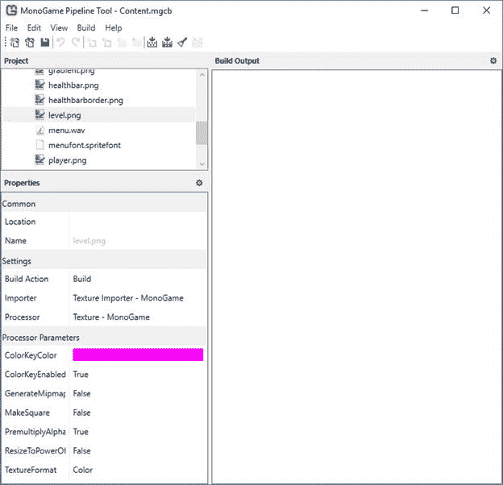
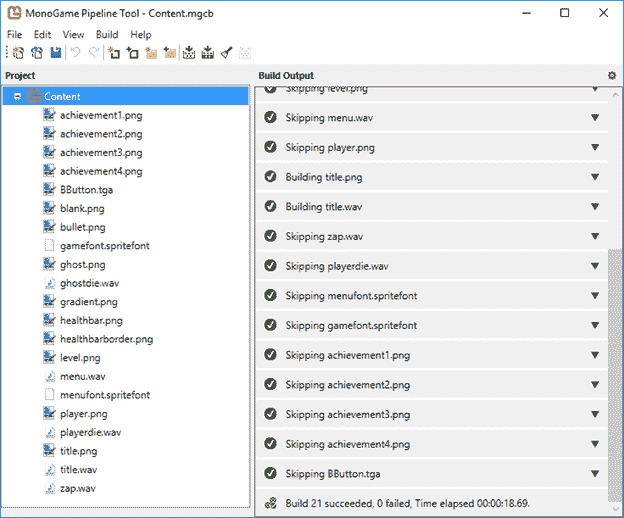
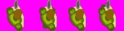
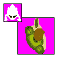
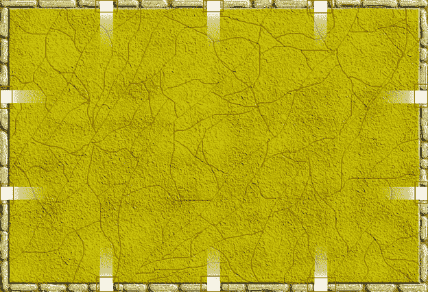
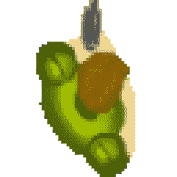

通常，游戏最重要的部分是用户看到了什么。我只知道有一款游戏没有图形，只有音频。考虑到这一点，能够把东西画到屏幕上是非常重要的。对于我们的游戏，这将仅限于 2D 对象，或精灵。

由于几乎所有的图形对象都作为文件存储在硬盘上，我们需要一种能够将它们加载到内存中的方法来绘制它们。这个过程的第一步是编译我们所有的资产，使得它们比大多数框架要经历的更容易处理。通常，不同类型的资产由于其格式或类型而必须以不同的方式加载。虽然大多数框架为您提供了一种轻松加载资产的方法，但它们通常不会提供一种处理一切的方法。XNA，也就是一夫一妻制，给了开发人员这样做的能力，通过将他们所有的资产编译成一种允许他们使用一个类加载的格式:T0。实现这一点的工具是内容管道。当你编译你的游戏时，XNA 在幕后处理了这个问题。一夫一妻制使用一个单独的应用程序，即一夫一妻制管道工具，它与主要的一夫一妻制位一起安装:



图 10-管道工具应用

如果您有很多资产，您可能希望将它们组织到类似类型的文件夹或其他分组中。使用**新建文件夹**工具栏按钮或**编辑** > **添加** > **新建文件夹**菜单项。

如果你正在将一款 XNA 游戏转换为一夫一妻制，你可以使用**文件** > **导入**菜单导入你的资产。单击此菜单项将打开一个对话框，允许您选择 XNA 内容项目文件。

如果您从零开始，请使用**新建项目**工具栏按钮或**编辑** > **添加** > **现有项目**菜单显示一个对话框，允许您选择要添加到内容项目的文件，或者只需从文件资源管理器窗口将它们拖到其中。您也可以使用**添加现有文件夹**或**编辑** > **添加** > **现有文件夹**菜单项来添加资产的整个文件夹。

添加资产后，单击**构建**工具栏按钮或菜单项。应用程序的构建输出部分将显示每个项目的状态。最后一项应该显示成功的构建消息。图 11 中的截图显示了这本书的可下载项目文件中的一些资产。您可以将它们添加到项目中，并且在构建资产时应该会看到类似的东西。



图 11 -成功构建消息

请注意，任何已经构建的资产都将被跳过，除非它们被更改。

如果您收到任何项目的错误消息，请确保它是工具支持的文件类型。并非所有图形或音频类型都受支持。虽然您可以在工具中使用自定义文件类型，但它需要自定义导入器和处理程序的大量工作，这超出了本书的范围。对于精灵来说。bmp，。tga 或。建议使用巴布亚新几内亚。对于音频，。用于音效和音乐的 wav 或. mp3 可以正常工作。

一旦你有了一个干净的构建，你就可以开始将资产加载到内存中的对象中，以便在你的游戏中使用。正如我已经提到的，您可以使用`ContentManager`类来实现这一点。

## content manager

`Game`类附带了一个`ContentManager`成员，您可以使用它将图形加载到内存中。对于大多数简单的游戏，你只需要处理一个属性，`RootDirectory`，和一个方法，`Load`。

正如我们在第 2 章中看到的，如果您使用内置模板创建项目，则在`Game`类实例的构造函数中会自动为您设置`RootDirectory`属性。这几乎总是项目的内容文件夹。我还没有发现一个案例，你会想把它放在别的地方。

`Load`方法使用类型参数来指定正在加载的内容类型。这可以是 2D 或三维图形、音频文件或精灵字体(用于绘制文本)。对于 2D 图形，文件通常被加载到一个`Texture2D`对象中。

除了`Game`类之外，您通常会在其他地方需要`ContentManager`，所以您需要要么将对象暴露给过量的代码，要么传递它。我发现通过一个`Game`类的静态实例来展示它对我来说更容易更干净。为此，只需将声明添加到`Game`类代码中，并在`Game`类实例代码的构造函数末尾添加一行:

```cs
  public static Game1 Instance;

  public Game1()
  {
      ...

      Instance = this;
  }

```

代码清单 17–游戏类实例

通过执行以下操作，您可以在任何地方使用`ContentManager`:

```cs
  Texture2D _level; 
  _level = Game1.Instance.Content.Load<Texture2D>("level");

```

代码清单 18–访问游戏类实例

最简单的说，一个`Texture2D`对象是用来在内存中保存一个精灵的。虽然该类有许多重载的构造函数和方法，但在简单的游戏中很少需要它们。您可能会使用其中的三个成员:`Bounds`、`Height`和`Width`。

`Bounds`成员是一个矩形，用于绘制和碰撞检测。`SpriteBatch`类的重载`Draw`方法之一采用一个目标和源矩形。你可以用它来轻松缩放精灵。如果你不改变一个精灵的位置，比如说 UI 元素，使用这个重载的方法可以让你的代码更容易写和读。

`Height`和`Width`成员将用于与`Bounds`成员相同的用途。你使用哪一个将在某种程度上取决于你如何设置你的代码，以及精灵是用来做什么的。如果您正在对精灵进行大量的移动，您可能不想每一帧都重新计算目标矩形，所以您可能会使用版本的`Draw`方法，该方法采用 X 和 Y 坐标以及精灵的`Height`和`Width`。

`GraphicsDeviceManager`类是一个你主要用来让玩家设置图形相关选项的类。你也可以用它来为你的游戏设置默认值。

我们用来创建游戏的模板将这个类的一个实例添加到`Game1`类中。然而，默认分辨率并不理想。我们将添加一些代码来更改默认值，这样会更好一些。在`Game1`类的构造函数中创建`GraphicsDeviceManager`后，将这两个成员添加到`Game1`类和两行代码中:

```cs
  public static int ScreenWidth = 1024;
  public static int ScreenHeight = 768;

  graphics.PreferredBackBufferWidth
  = Game1.ScreenWidth;
  graphics.PreferredBackBufferHeight
  = Game1.ScreenHeight;

```

代码清单 19–更改默认窗口分辨率

正如我们在上一章中简要看到的那样，`SpriteBatch`类用于处理向屏幕呈现图形和文本。`SpriteBatch`类不是让开发人员编写代码来优化以最有效的方式将许多不同的对象绘制到屏幕上，而是为您这样做。它通过`Draw`和`DrawText`方法做到这一点。每种方法都有多种重载方式，让您可以根据每个对象的信息灵活地将东西绘制到屏幕上:

| `Draw(Texture2D, Nullable<Vector2>, Nullable<Rectangle>, Nullable<Rectangle>, Nullable<Vector2>, float, Nullable<Vector2>, Nullable<Color>, SpriteEffects, float)` |
| `Draw(Texture2D, Vector2, Nullable<Rectangle>, Color, float, Vector2, Vector2, SpriteEffects, float)` |
| `Draw(Texture2D, Vector2, Nullable<Rectangle>, Color, float, Vector2, float, SpriteEffects, float)` |
| `Draw(Texture2D, Rectangle, Nullable<Rectangle>, Color, float, Vector2, SpriteEffects, float)` |
| `Draw(Texture2D, Vector2, Nullable<Rectangle>, Color)` |
| `Draw(Texture2D, Rectangle, Nullable<Rectangle>, Color)` |
| `Draw(Texture2D, Vector2, Color)` |
| `Draw(Texture2D, Rectangle, Color)` |
| `DrawString(SpriteFont, string, Vector2, Color, float, Vector2, Vector2, SpriteEffects, float)` |
| `DrawString(SpriteFont, StringBuilder, Vector2, Color, float, Vector2, Vector2, SpriteEffects, float)` |
| `DrawString(SpriteFont, StringBuilder, Vector2, Color, float, Vector2, float, SpriteEffects, float)` |
| `DrawString(SpriteFont, string, Vector2, Color)` |
| `DrawString(SpriteFont, string, Vector2, Color, float, Vector2, float, SpriteEffects, float)` |
| `DrawString(SpriteFont, StringBuilder, Vector2, Color)` |

表 2–sprite batch 绘制方法

各种`Draw`方法处理绘制精灵。最简单的版本需要一个`Texture2D`对象，`Vector2`表示屏幕左上角的像素来绘制精灵或矩形来表示屏幕区域，以及一种颜色。颜色通常是白色的。传递的任何其他颜色都将与精灵混合。

如果您使用矩形作为目标，精灵将根据需要拉伸或收缩以适合区域。这可能会导致不理想的结果，因此请确保在使用此版本时在多个显示器和分辨率上进行测试。

该方法的其他版本允许您旋转精灵，我们将会这样做，并使用`SpriteEffects`枚举水平或垂直翻转精灵:

```cs
  public enum
  SpriteEffects
  {
      None = 0,
      FlipHorizontally =
  1,
      FlipVertically = 2
  }

```

代码清单 20–spreeeffects 枚举

`DrawString`方法绘制文本。和`Draw`方法一样，为了灵活性，有两个简单版本和多个高级版本。简单的版本有一个`SpriteFont`，字符串，`Vector2`或矩形，和一个`Color`。`Color`以该颜色绘制文本，不像雪碧版本那样将雪碧与颜色混合。

`DrawString`方法使用`SpriteEffects`枚举作为参数，就像`Draw`方法一样，虽然我不确定你什么时候会在正常游戏中使用它。

现在我们知道如何在游戏中绘制图形和文本，是时候实现这个功能了。

首先，我们需要一些东西来画。我们将使用一个类来表示角色和它将要战斗的鬼魂，该类将包含允许两者移动和射击所需的所有信息，找出它们是否还活着，等等。在某种程度上，两者都有一个类将允许我们使用另一个类轻松管理它们，而不知道哪个是哪个。

```cs
  public class Entity
  {
      private static Vector2 vecMin, vecMax;

      private EntityType _type;
      private int _health;

      private Vector2 _location;

      private Direction _moveDirection;
      private Direction _shootDirection;

      private float _speed;

      private int _curFrame;
      private int _numFrames;
      private float _animationDelay;

      private float _frameUpdate;

      private int _textureWidth;

      public EntityType Type
      {
          get { return _type; }
      }

      public int Health
      {
          get { return _health; }
      }

      public Vector2 Location
      {
          get { return _location; }
      }

      public Direction MoveDirection
      {
          get { return _moveDirection; }
          set { _moveDirection = value; }
      }

      public Direction ShootDirection
      {
          get { return _shootDirection; }
          set { _shootDirection = value; }
      }

      public float Speed
      {
          get { return _speed; }
          set { _speed = value; }
      }

      public int CurFrame
      {
          get { return _curFrame; }
          set { _curFrame = value; }
      }

      public int NumFrames
      {
          get { return _numFrames; }
          set { _numFrames = value; }
      }

      public Entity(EntityType
  type, Vector2 location, Direction orientation, int numFrames, int
  textureWidth, Game game)
      {
          _shootDirection
  = orientation;
          _type = type;
          _location =
  location;
          _numFrames =
  numFrames;
          _curFrame = 0;
          _textureWidth =
  textureWidth;

          _frameUpdate =
  0.0f;

          //account for the walls of the level
  (20) and half the sprite size (32)
          vecMin = new Vector2(20+32, 88+32);
          vecMax = new Vector2(game.Window.ClientBounds.Width - 20
  - 32, game.Window.ClientBounds.Height - 20 - 32);

          switch (type)
          {
              case EntityType.Ghost:
                  _health
  = ((Game1)game).Difficulty.GhostHealth;
                  break;

              case EntityType.Player:
                  _health
  = 100;
                  break;
          }

          //ghosts start off moving
          if (_type == EntityType.Ghost)
              _speed = ((Game1)game).Difficulty.GhostSpeed;
      }

      public int CurFrameX
      {
          get { return _curFrame * (_textureWidth /
  _numFrames); }
      }

      public int FrameWidth
      {
          get {return _textureWidth / _numFrames;}
      }

      public void Update(GameTime gameTime, Vector2 playerLocation)
      {
          //if ghost, change move direction if
  necessary based on player location
          if (_type == EntityType.Ghost)
          {
              //figure out if our current direction
  is greater than 45 degrees to the player. If so, we need to turn

  _moveDirection = GetDirectionFromVectors(_location, playerLocation);

  _shootDirection = _moveDirection;
          }

          if (_speed > 0.0f)
          {
              switch (_moveDirection)
              {

                  case Direction.East:

  _location.X += _speed;

                      break;

                  case Direction.North:

  _location.Y -= _speed;

                      break;

                  case Direction.NorthEast:

  _location.Y -= _speed;

  _location.X += _speed;

                      break;

                  case Direction.NorthWest:

  _location.Y -= _speed;
                      _location.X
  -= _speed;

                      break;

                  case Direction.South:

  _location.Y += _speed;
                      break;

                  case Direction.SouthEast:

  _location.Y += _speed;

  _location.X += _speed;
                      break;

                  case Direction.SouthWest:

  _location.Y += _speed;

  _location.X -= _speed;
                      break;

                  case Direction.West:

  _location.X -= _speed;
                      break;
              }

              _location = Vector2.Clamp(_location, vecMin, vecMax);
          }

          if (_type == EntityType.Ghost)
          {
              _frameUpdate
  += gameTime.ElapsedGameTime.Milliseconds;

              if (_frameUpdate >= 500.0f)
              {
                  //increment frame

  _curFrame++;

                  if (_curFrame > _numFrames - 1)

  _curFrame = 0;

                  _frameUpdate
  -= 500.0f;
              }
          }
      }

      public void DrainLife(int amount)
      {
          _health -=
  amount;
      }
  }

```

代码清单 21–实体类

我们将在稍后用允许角色射击和其他必要游戏的功能来增强这个类，但是现在，这将允许我们在屏幕上绘制一些东西。

前两个成员用于`Update`方法，以确保角色永远不会被拉出竞技场。这些值在构造函数中设置。

`_type`成员允许我们在类的部分中找出我们是在处理角色还是幽灵:

```cs
  public enum
  EntityType
  {
      Player,
      Ghost
  }

```

代码清单 22–实体类型枚举

`_location`成员是角色在屏幕上的位置，虽然不是相对于竞技场。我们在`Update`中找到了答案。

两个`Direction`成员告诉我们角色在哪里移动和拍摄。因为角色可以旋转，所以当他拍摄时，他可以向一个不同于向前的方向移动。他也可以原地打转。角色和鬼魂会面对八个不同的方向:

```cs
  public enum
  Direction
  {
      North,
      NorthEast,
      East,
      SouthEast,
      South,
      SouthWest,
      West,
      NorthWest
  }

```

代码清单 23–方向枚举

`_speed`给了我们一些灵活性来控制角色在屏幕上移动的速度，以防增加对游戏的修改，例如修改角色移动速度的快速启动。

接下来的四个成员用于控制角色动画将被绘制在哪个帧中。我们的角色和幽灵将有四个不同的帧来模拟运动:



图 12 -字符框架


图 13 -重影帧

`_textureWidth`成员确保我们在绘制当前帧时使用正确的子画面部分。

下一段代码，从公共访问器到构造器，相当简单。`Update`方法在这一点上相当简单。如果实体是鬼，我们会根据角色的位置更新它的移动方向。我们也更新了拍摄方向成员，虽然现在还没有使用。我们需要将正在使用的方法添加到`Entity`类中:

```cs
  public static Direction GetDirectionFromVectors(Vector2 vecFrom, Vector2 vecTo)
  {
      float x = vecTo.X - vecFrom.X;
      float y = vecTo.Y - vecFrom.Y;

      float angle = (float)(Math.Atan2(y, x) * 57.2957795);
      Direction dir;

      if (angle < 0)
      {
          if (angle > -23)
              dir = Direction.East;
          else if (angle >= -67)
              dir = Direction.NorthEast;
          else if (angle >= -112)
              dir = Direction.North;
          else if (angle >= -157)
              dir = Direction.NorthWest;
          else
              dir = Direction.West;
      }
      else
      {
          if (angle < 23)
              dir = Direction.East;
          else if (angle <= 67)
              dir = Direction.SouthEast;
          else if (angle <= 112)
              dir = Direction.South;
          else if (angle <= 157)
              dir = Direction.SouthWest;
          else
              dir = Direction.West;
      }

      return dir;
  }

```

代码清单 24–获取方向向量方法

我们根据两个向量之间的差值计算出角度`float`值，并使用该浮点数确定要返回的`Direction`值。这里有很多硬编码的值，这通常并不理想，但由于这是一个相对较小的游戏，它不是一个交易破坏者。

如果实体在移动，我们通过调用`Clamp`方法更新其位置，确保其不会移出竞技场。

如果实体是一个幽灵，那么我们就能知道是否有足够的时间移到下一帧。我们还确保如果到达了最后一帧，我们将重置为第一帧。

现在我们有了一个允许我们创建可绘制实体的类，我们需要一些代码来实际绘制它们。正如我在本节开头提到的，我们将使用一个类来管理实体:

```cs
  public class EntityManager //: DrawableGameComponent
  {
      Texture2D _ghostTexture;
      Texture2D _playerTexture;

      Color[][] _ghostData;
      Color[][] _playerData;

      List<Entity>
  _entities;

      SpriteBatch _sb;

      int _score;

      private float _ghostSpawnTimer;
      private Vector2[] _ghostSpawnPoints;
      private Direction[] _ghostSpawnDirections;
      private Random _rnd;

      private Vector2 _ghostOrigin;
      private Vector2 _playerOrigin;

      public int Score
      {
          get { return _score; }
      }

      public EntityManager()
      {
          _entities= new List<Entity>();
          _score = 0;
          _ghostSpawnTimer
  = 0.0f;

  _ghostSpawnPoints = new Vector2[10];

  _ghostSpawnDirections = new Direction[10];
          _rnd = new Random();

          _ghostOrigin = new Vector2(16, 16);
          _playerOrigin = new Vector2(32, 32);

          _playerData = new Color[4][];
          _ghostData = new Color[4][];

      }

      public void Initialize()
      {

          IGraphicsDeviceService graphicsservice = (IGraphicsDeviceService)Game1.Instance.Services.GetService(typeof(IGraphicsDeviceService));
          _sb = new SpriteBatch(graphicsservice.GraphicsDevice);

          _ghostTexture = Game1.Instance.Content.Load<Texture2D>("ghost");
          _playerTexture =
  Game1.Instance.Content.Load<Texture2D>("player");

          for (int i = 0; i < 4; i++)
          {

  _playerData[i] = new Color[64 * 64];

  _playerTexture.GetData(0, new Rectangle(i, 0, 64, 64), _playerData[i], 0,
  64 * 64);

  _ghostData[i] = new Color[32 * 32];

  _ghostTexture.GetData(0, new Rectangle(i, 0, 32, 32), _ghostData[i], 0, 32 * 32);
          }

          //player starts in the middle of the
  screen
          Entity entity = new Entity(EntityType.Player, new Vector2((Game1.Instance.Window.ClientBounds.Width
  / 2) - ((_playerTexture.Width / 4) / 2), (Game1.Instance.Window.ClientBounds.Height / 2 - _playerTexture.Height
  / 2) + 60), Direction.North, 4, _playerTexture.Width, Game1.Instance);

  _entities.Add(entity);

  _ghostSpawnPoints[0] = new Vector2(240, Game1.LevelTop);

  _ghostSpawnPoints[1] = new Vector2(496, Game1.LevelTop);

  _ghostSpawnPoints[2] = new Vector2(752, Game1.LevelTop);

  _ghostSpawnPoints[3] = new Vector2(1023,284);

  _ghostSpawnPoints[4] = new Vector2(1023,516);
          _ghostSpawnPoints[5]
  = new Vector2(752,776);

  _ghostSpawnPoints[6] = new Vector2(496,776);

  _ghostSpawnPoints[7] = new Vector2(240,776);

  _ghostSpawnPoints[8] = new Vector2(0,516);

  _ghostSpawnPoints[9] = new Vector2(0,284);

  _ghostSpawnDirections[0]=Direction.South;

  _ghostSpawnDirections[1]=Direction.South;

  _ghostSpawnDirections[2]=Direction.South;

  _ghostSpawnDirections[3]=Direction.West;

  _ghostSpawnDirections[4]=Direction.West;
          _ghostSpawnDirections[5]=Direction.North;

  _ghostSpawnDirections[6]=Direction.North;

  _ghostSpawnDirections[7]=Direction.North;

  _ghostSpawnDirections[8]=Direction.East;

  _ghostSpawnDirections[9]=Direction.East;

          //start with 4 ghosts initially
          for (int i = 0; i < 4; i++)

  SpawnGhost();

      }

      protected void
  Dispose()
      {

  _entities.Clear();
      }

      public void Update(GameTime gameTime)
      {

          //get the ScreenManager and check for
  paused state
          ScreenManager screenManager = (ScreenManager)Game1.Instance.Components[0];

          if (screenManager.GetScreens()[0].IsActive)
          {
              //check for ghost spawn

  _ghostSpawnTimer += gameTime.ElapsedGameTime.Milliseconds;

              if (_ghostSpawnTimer >= 3000.0f)
              {
                  //get random location

  SpawnGhost();

  _ghostSpawnTimer -= 3000.0f;
              }

              foreach (Entity entity in _entities)
                  entity.Update(gameTime,
  _entities[0].Location);

              for (int i = _entities.Count - 1; i > 0;
  i--)
              {
                  if (CheckEntityCollision(_entities[i]))
                  {
                      //drain life
                      _entities[0].DrainLife(Game1.Instance.Difficulty.HealthDrain);

  _entities.Remove(_entities[i]);

                      if (_entities.Count == 1)
                          break;
                  }
              }

              for (int i = _entities.Count - 1; i > 0;
  i--)
              {
                  if (_entities[0].CheckBulletCollision(_entities[i]))
                  {

  _entities[i].DrainLife(1);

                      if (_entities[i].State == EntityState.Dead)
                      {
                          _score
  += Game1.Instance.Difficulty.GhostScore;

  _entities.Remove(_entities[i]);
                      }

                      if (_entities.Count == 1)
                          break;
                  }
              }
          }
      }
      public void Draw(GameTime gameTime)
      {
          //base.Draw(gameTime);

          _sb.Begin();

          Vector2 origin;
          float rot;

          foreach (Entity entity in _entities)
          {
              rot = (int)entity.MoveDirection * MathHelper.ToRadians(45.0f);

              switch (entity.Type)
              {
                  case EntityType.Ghost:
                  {

  origin = new Vector2(_ghostTexture.Width / entity.NumFrames / 2,
  _ghostTexture.Height / 2);

  _sb.Draw(_ghostTexture, new Rectangle((int)entity.Location.X, (int)entity.Location.Y, entity.FrameWidth,
  _ghostTexture.Height), new Rectangle(entity.CurFrameX, 0, entity.FrameWidth, _ghostTexture.Height), Color.White, rot, origin, SpriteEffects.None, 0.0f);
                      break;
                  }
                  case EntityType.Player:
                  {

  origin = new Vector2(_playerTexture.Width / entity.NumFrames / 2,
  _playerTexture.Height / 2);

  _sb.Draw(_playerTexture, new Rectangle((int)entity.Location.X, (int)entity.Location.Y, entity.FrameWidth,
  _playerTexture.Height), new Rectangle(entity.CurFrameX, 0, entity.FrameWidth, _playerTexture.Height),
  Color.White, rot, origin, SpriteEffects.None, 0.0f);

  entity.DrawBullets(_sb);

                      break;
                  }
              }
          }

          _sb.End();

      }

      public int GetPlayerHealth()
      {
          if (_entities.Count > 0)
          {
              return _entities[0].Health;
          }
          else
              return 0;
      }

      private void SpawnGhost()
      {
          int num = _rnd.Next(0, 10);
          _entities.Add(new Entity(EntityType.Ghost, _ghostSpawnPoints[num], _ghostSpawnDirections[num], 4,
  _ghostTexture.Width, _game));
      }

      public bool CheckEntityCollision(Entity entity)
      {

          Rectangle playerRect;
          Rectangle ghostRect;

          Matrix matrix1, matrix2;

          matrix1 = Matrix.CreateTranslation(new Vector3(-_ghostOrigin, 0.0f)) *
              Matrix.CreateRotationZ(GetRotationFromDirection(entity.MoveDirection))
  * 
              Matrix.CreateTranslation(new Vector3(entity.Location.X,
  entity.Location.Y, 0.0f));

          ghostRect = new Rectangle((int)entity.Location.X,
  (int)entity.Location.Y, 32, 32);

          matrix2 = Matrix.CreateTranslation(new Vector3(-_playerOrigin, 0.0f)) *
              Matrix.CreateRotationZ(GetRotationFromDirection(_entities[0].MoveDirection))
  *
              Matrix.CreateTranslation(new Vector3(_entities[0].Location.X,
  _entities[0].Location.Y, 0.0f));

          playerRect = new Rectangle((int)_entities[0].Location.X,
  (int)_entities[0].Location.Y, 64, 64);

          //check for collision using rects
  first since per-pixel is costly
          if (ghostRect.Intersects(playerRect))
          {
              if (Intersect(matrix1, matrix2, 32, 64, 32, 64,
  _ghostData[entity.CurFrame], _playerData[_entities[0].CurFrame]))
                  return true;
          }

          return false;
      }

      private float GetRotationFromDirection(Direction dir)
      {
          float ret = 0.0f;

          switch (dir)
          {
              case Direction.North:

                  ret =
  -1.570796f;

                  break;

              case Direction.NorthEast:

                  ret =
  -0.785398f;
                  break;

              case Direction.East:

                  ret =
  0.0f;
                  break;

              case Direction.SouthEast:

                  ret =
  0.785398f;
                  break;

              case Direction.South:

                  ret =
  1.570796f;
                  break;

              case Direction.SouthWest:

                  ret =
  2.356194f;
                  break;

              case Direction.West:

                  ret =
  3.141593f;
                  break;

              case Direction.NorthWest:

                  ret =
  -2.356194f;
                  break;
          }

          return ret;
      }
      private bool Intersect(Matrix matrix1, Matrix matrix2, int spriteWidth1, int
  spriteWidth2, int spriteHeight1, int spriteHeight2, Color[]
  data1, Color[] data2)
      {
          Matrix transform = matrix1 * Matrix.Invert(matrix2);

          Vector2 rowX = Vector2.TransformNormal(Vector2.UnitX, transform);
          Vector2 rowY = Vector2.TransformNormal(Vector2.UnitY, transform);

          Vector2 yPos = Vector2.Transform(Vector2.Zero, transform);

          for (int i = 0; i < spriteHeight1; i++)
          {
              Vector2 pos = yPos;

              for (int j = 0; j < spriteWidth1; j++)
              {
                  int i2 = (int)Math.Round(pos.X);
                  int j2 = (int)Math.Round(pos.Y);

                  if (0 <= i2 && i2 < spriteWidth2 &&
  0 <= j2 && j2 < spriteHeight2)
                  {
                      Color color1 = data1[i + j *
  spriteWidth1];
                      Color color2 = data2[i2 + j2 *
  spriteWidth2];

                      if (color1.A != 0 && color2.A != 0)
                          return true;
                  }
                  pos +=
  rowX;
              }
              yPos +=
  rowY;
          }

          return false;
      }
  }

```

代码清单 25–实体管理器类

我们有两个`Texture2D`对象保存角色和幽灵的图形文件。正如我们所看到的，这个文件有每个精灵动画的四个帧。两个`Color`阵列保存每帧每个像素的颜色。该数据用于`Intersect`方法，以确定两个精灵是否相撞。因为动画帧必须是矩形的，所以帧中会有不属于实际精灵的区域。如果两个子画面的交集仅仅基于框架矩形，将会出现不准确的结果:



图 14 -不准确的碰撞检测

图 14 显示了与玩家框架相交的幽灵框架，但是你可以看到实际的精灵并没有接触。这将在游戏中非常明显，并导致玩家认为游戏略有中断。使用颜色数组数据，我们可以看到两种非洋红色是否重叠，这意味着发生了有效的冲突。

在`_entities`列表中，玩家角色将永远是第一个对象，正如你会在`Initialize`方法中注意到的。由于该实体的处理方式略有不同，我们需要知道它在哪里。

接下来的四个成员用于产生鬼魂，你可以从他们的名字看出。`_ghostSpawnTimer`值因难度不同而不同。`_ghostSpawnPoints`是竞技场图形中的门口区域:



图 15 -幽灵产卵点

`_ghostSpawnDirections`匹配`_ghostSpawnPoints`—顶部的点有`South`的方向，右侧的点有`West`的方向，等等。

`_rnd`成员用于在幽灵产卵时随机选择一个产卵点。

两个`origin`成员用于检测鬼魂和角色之间的碰撞。由于它们可以旋转，我们需要做一些计算，然后才能准确地检测到两者之间的碰撞。

当`EntityManager`对象被初始化时，玩家角色和幽灵的子画面被加载，并且获得每个子画面的每个帧的颜色数据。玩家`Entity`对象随后被创建并放置在屏幕中间。然后设定鬼魂的产卵点。每个产卵点的 x 和 y 坐标都是硬编码的，除了竞技场顶部三个产卵点的 y 坐标，因为该位置是已知的，不会随着该位置上方的区域用于显示游戏信息而改变。最后发生的事情是最初的四个鬼魂产生了。

`Update`的方法很简单——如果游戏画面活跃，我们会先更新时间检查来产生鬼魂。请注意，屏幕数组中的索引是硬编码的；不是最好的做法，但是对于一个相当简单的游戏，我们知道这永远是正确的。如果你在游戏开始前实现了一些功能，在游戏开始时保持屏幕加载，这将会导致问题。解决这个问题的一种方法是在加载的屏幕中搜索`GameplayScreen`实例并使用该对象。然后，我们通过调用其 update 方法来更新每个实体。在这之后，我们检查玩家角色和鬼魂之间的碰撞，然后是鬼魂和子弹之间的碰撞。

`Draw`方法也很简单。实体数组通过，每个实体根据其移动方向绘制。如果实体是玩家角色，还会绘制活动项目符号。

虽然我们还没有到让子弹在屏幕上飞来飞去的地步，但我们将向`Enity`类添加一个存根方法，这样我们就不会出现编译错误:

```cs
  public void
  DrawBullets(SpriteBatch sb)
  {

  }

```

代码清单 26–绘制项目符号存根方法

`Game`类中有一个静态成员需要添加:

```cs
  public class Game1 : Game
  {
      public static int
  LevelTop = 68;
  }

```

代码清单 27–游戏类静态成员

`EntityManager`由`GameplayScreen`使用。许多其他精灵和文字也绘制在`GameplayScreen`中。我们现在将为该屏幕添加框架代码，并在后面的章节中对其进行增强，这样我们至少可以在屏幕上绘制精灵。

```cs
  class GameplayScreen : GameScreen
  {
      Texture2D _level;
      Texture2D _healthbar;
      Texture2D _healthbarBorder;

      Rectangle _rectHealthBorder;

      Vector2 _levelLocation;
      Vector2 _scoreLocation;

      SpriteFont _scoreFont;

      EntityManager _entityManager;

      Vector2 _curLevelLoc;

      public GameplayScreen()
      {
          TransitionOnTime
  = TimeSpan.FromSeconds(1.5);

  TransitionOffTime = TimeSpan.FromSeconds(0.5);
      }

      public override void
  Initialize()
      {
          _entityManager =
  new EntityManager();

  _entityManager.Initialize();

          _levelLocation =
  new Vector2(0, Game1.LevelTop);
          _scoreLocation =
  new Vector2(900, 32);

          _curLevelLoc = new Vector2(10, 10);

  _rectHealthBorder = new Rectangle(ScreenManager.Game.Window.ClientBounds.Width / 2 - 101, 10,
  202, 18);

      }

      public override void
  LoadContent()
      {
          _level = Game1.Instance.Content.Load<Texture2D>("level");
          _scoreFont = Game1.Instance.Content.Load<SpriteFont>("gamefont");
          _healthbar = Game1.Instance.Content.Load<Texture2D>("healthbar");
          _healthbarBorder
  = Game1.Instance.Content.Load<Texture2D>("healthbarborder");
      }

      public override void
  Update(GameTime gameTime, bool otherScreenHasFocus,

  bool coveredByOtherScreen)
      {
          base.Update(gameTime, otherScreenHasFocus,
  coveredByOtherScreen);
      }

      public override void
  Draw(GameTime gameTime)
      {

  ScreenManager.GraphicsDevice.Clear(ClearOptions.Target, Color.Black, 0, 0);

          Vector2 timeLoc = new Vector2(ScreenManager.GraphicsManager.PreferredBackBufferWidth
  / 2 -

  _scoreFont.MeasureString("Time
  Remaining: " +
  _remainingTime.ToString()).X / 2, 40.0f);

  ScreenManager.SpriteBatch.Begin();

  ScreenManager.SpriteBatch.Draw(_level, _levelLocation, Color.White);

  ScreenManager.SpriteBatch.Draw(_healthbarBorder, _rectHealthBorder, Color.White);

  ScreenManager.SpriteBatch.Draw(_healthbar, new
  Rectangle(_rectHealthBorder.Left + 1,
  _rectHealthBorder.Top + 1, _entityManager.GetPlayerHealth() * 2, 16), Color.White);

  ScreenManager.SpriteBatch.DrawString(_scoreFont, "score: " + _entityManager.Score.ToString(),
  _scoreLocation, Color.White);

  ScreenManager.SpriteBatch.End();

  _entityManager.Draw(gameTime);

          // If the game is transitioning on
  or off, fade it out to black.
          if (TransitionPosition > 0)

  ScreenManager.FadeBackBufferToBlack(255 - TransitionAlpha);
      }
  }

```

代码清单 28–游戏屏幕类

`GameplayScreen`绘制关卡图形，显示人物健康状况的图形，以及玩家的得分。稍后，我们将为游戏添加画图计时器，它与游戏难度一起使用，但我们现在不需要它。

角色的健康分为两部分:边框和矩形，矩形根据角色剩余的健康程度从填充边框到不填充边框进行缩放。如果您在我们将图形文件添加到内容管道工具时查看一下，您会发现 healthbar 图形只是一个绿色像素。我们用来绘制 healthbar 内部的`Draw`方法的重载版本采用了一个矩形参数，通过该参数，该方法自动缩放您传递的任何`Texture2D`对象来填充矩形。根据加载到`Texture2D`对象中的图形文件，这可能会导致屏幕出现意外结果。某个对象的图像包含多种颜色的图形可能会显示得不理想，这取决于您如何缩放对象。绘制比原始图像大得多的对象可能会导致屏幕上出现像素化图像。例如，绘制比原始图像大几倍的角色精灵会使角色看起来像下面这样:



图 16 -缩放字符

缩放字符中的像素在拉伸图像中非常明显。有一种方法可以使用 mipmaps 来处理这个问题，但是这超出了本书的范围。如果您真的需要以多种尺寸显示图形，拉伸图像会导致像素化，请随意研究 mipmaps。

现在我们有了一些绘图功能，我们需要修改一些屏幕来添加这个功能。`ScreenManager`班需要一些新成员:

```cs
  IGraphicsDeviceService _graphicsDeviceService;

  GraphicsDeviceManager _graphicsDeviceManager;

  SpriteBatch _spriteBatch;
  SpriteFont _font;
  Texture2D _blankTexture;

```

代码清单 29–屏幕管理器类图形成员

```cs

  /// <summary>
  /// Expose access to our graphics
  device (this is protected in the
  /// default DrawableGameComponent, but
  we want to make it public).
  /// </summary>
  new public GraphicsDevice GraphicsDevice
  {
      get { return base.GraphicsDevice;
  }
  }
  public SpriteBatch SpriteBatch
  {
      get { return _spriteBatch; }
  }

  public SpriteFont Font
  {
      get { return _font; }
  }

  public GraphicsDeviceManager GraphicsManager
  {
      get { return _graphicsDeviceManager; }
  }

  public ScreenManager(Game game, GraphicsDeviceManager graphicsDeviceManager)
      : base(game)
  {

  _graphicsDeviceManager = graphicsDeviceManager;

  _graphicsDeviceService = (IGraphicsDeviceService)game.Services.GetService(

  typeof(IGraphicsDeviceService));

      if (_graphicsDeviceService == null)
          throw new InvalidOperationException("No graphics device service.");
  }

  public void
  FadeBackBufferToBlack(int alpha)
  {
      Viewport viewport = GraphicsDevice.Viewport;

  _spriteBatch.Begin();

  _spriteBatch.Draw(_blankTexture,
                          new Rectangle(0, 0, viewport.Width,
  viewport.Height),
                          new Microsoft.Xna.Framework.Color((byte)0, (byte)0,
  (byte)0, (byte)alpha));

      _spriteBatch.End();
  }

```

代码清单 30–屏幕管理器类图形方法

我们还需要更新一些现有方法来添加绘图功能:

```cs
  protected override void LoadContent()
  {
      // Load content belonging to the
  screen manager.
      _spriteBatch = new SpriteBatch(GraphicsDevice);
      _font = Game1.Instance.Content.Load<SpriteFont>("menufont");
      _blankTexture = Game1.Instance.Content.Load<Texture2D>("blank");
  }

  public void
  AddScreen(GameScreen screen)
  {
  . . .            

      if ((_graphicsDeviceService != null) &&

  (_graphicsDeviceService.GraphicsDevice != null))
      {

  screen.LoadContent();
      }

  }

  public void
  RemoveScreen(GameScreen screen)
  {
  . . .            

      if ((_graphicsDeviceService != null) &&

  (_graphicsDeviceService.GraphicsDevice != null))
      {

  screen.UnloadContent();
      }

  }

```

代码清单 31–屏幕管理器类更新方法

在`GameplayScreen`类中，我们还没有画出剩余的时间或水平，所以让我们补充一下。以下代码应放在`ScreenManager.SpriteBatch.End();`行的正前方:

```cs
  _displayMinutes = _remainingTime
  >= 60 ? ((int)(_remainingTime / 60)).ToString() :
  "";

  ScreenManager.SpriteBatch.DrawString(_scoreFont,
  "Time Remaining:
  " +
  _displayMinutes + ":" + ((int)(_remainingTime
  % 60)).ToString("00"), timeLoc, Color.Red);

  ScreenManager.SpriteBatch.DrawString(_scoreFont,
  "Level: " + _curLevel.ToString(),
  _curLevelLoc, Color.White);

```

代码清单 32–游戏屏幕类绘制方法代码

`MenuScreen`类获取一些额外的代码来为所选菜单项添加脉冲效果:

```cs
  public override void Draw(GameTime gameTime)
  {
  . . .           

      // Draw each menu entry in turn.
      ScreenManager.SpriteBatch.Begin();

      for (int i = 0; i < _menuEntries.Count;
  i++)
      {
          Color color;
          float scale;

          if (IsActive && (i == _selectedEntry))
          {
              // The selected entry is yellow, and
  has an animating size.
              double time = gameTime.TotalGameTime.TotalSeconds;

              float pulsate = (float)Math.Sin(time * 6) + 1;

              color = Color.Yellow;
              scale = 1 +
  pulsate * 0.05f;
          }
          else
          {
              // Other entries are white.
              color = Color.White;
              scale = 1;
          }

          // Modify the alpha to fade text out
  during transitions.
          color = new Color(color.R, color.G, color.B,
  TransitionAlpha);

          // Draw text, centered on the middle
  of each line.
          Vector2 origin = new Vector2(0, ScreenManager.Font.LineSpacing / 2);

          ScreenManager.SpriteBatch.DrawString(ScreenManager.Font, _menuEntries[i],

  position, color, 0, origin, scale,
                                                  SpriteEffects.None, 0);

          position.Y += ScreenManager.Font.LineSpacing;
      }

      ScreenManager.SpriteBatch.End();
  }

```

代码清单 33–菜单绿色类更新方法

`MessageBoxScreen`类需要一些更新，以使消息框没有覆盖的屏幕部分:

```cs
  public override void Draw(GameTime gameTime)
  {
      // Darken down any other screens
  that were drawn beneath the popup.

  _screenManager.FadeBackBufferToBlack(TransitionAlpha * 2 / 3);

      // Center the message text in the
  viewport.
      Viewport viewport =
  _screenManager.GraphicsDevice.Viewport;
      Vector2 viewportSize = new Vector2(viewport.Width, viewport.Height);
      Vector2 textSize =
  _screenManager.Font.MeasureString(_message);
      Vector2 textPosition = (viewportSize -
  textSize) / 2;

      // The background includes a border
  somewhat larger than the text itself.
      const int hPad = 32;
      const int vPad = 16;

      Rectangle backgroundRectangle = new Rectangle((int)textPosition.X
  - hPad,

  (int)textPosition.Y - vPad,

  (int)textSize.X + hPad * 2,
                                                      (int)textSize.Y + vPad * 2);

      // Fade the popup alpha during
  transitions.

  Microsoft.Xna.Framework.Color color = new Microsoft.Xna.Framework.Color((byte)255, (byte)255, (byte)255,
  TransitionAlpha);

  _screenManager.SpriteBatch.Begin();

      // Draw the background rectangle.

  _screenManager.SpriteBatch.Draw(_gradientTexture, backgroundRectangle,
  color);

      // Draw the message box text.

  _screenManager.SpriteBatch.DrawString(_screenManager.Font, _message,
  textPosition, color);

  _screenManager.SpriteBatch.End();
  }

```

代码清单 34–消息框屏幕类更新方法

`OptionsMenuScreen`需要一条额外的线在全屏和窗口模式之间切换屏幕。在`OnSelectEntry`方法的`case 0`部分添加此行:

```cs
  ScreenManager.GraphicsManager.ToggleFullScreen();

```

代码清单 35–选项屏幕类切换全屏代码

`LoadingScreen`在`Draw`方法中获取一些添加到`if(_loadingIsSlow)`块的代码:

```cs
  Viewport viewport =
  ScreenManager.GraphicsDevice.Viewport;
  Vector2 viewportSize = new Vector2(viewport.Width, viewport.Height);
  Vector2 textSize =
  ScreenManager.Font.MeasureString(message);
  Vector2 textPosition = (viewportSize -
  textSize) / 2;

  Microsoft.Xna.Framework.Color color = new Microsoft.Xna.Framework.Color((byte)255, (byte)255, (byte)255,
  TransitionAlpha);

  // Draw the text.
  ScreenManager.SpriteBatch.Begin();

  ScreenManager.SpriteBatch.DrawString(ScreenManager.Font,
  message,

  textPosition, color);

  ScreenManager.SpriteBatch.End();

```

代码清单 36–加载屏幕更新绘制方法代码

我们现在可以将缺少的绘图功能添加到`HighScoreScreen`类中，同时添加图形:

```cs
  private SpriteFont _titleFont;
  private Texture2D _buttonB;

  public override void LoadContent()
  {
      _titleFont = Game1.Instance.Content.Load<SpriteFont>("menufont");
      _buttonB = Game1.Instance.Content.Load<Texture2D>("BButton");

  . . . 
  }

  public override void Draw(GameTime gameTime)
  {
      Vector2 textPosition;

  ScreenManager.GraphicsDevice.Clear(ClearOptions.Target, Color.Black, 0, 0);

  Microsoft.Xna.Framework.Color color = new Microsoft.Xna.Framework.Color((byte)0, (byte)255,
  (byte)0, TransitionAlpha);

  ScreenManager.SpriteBatch.Begin();

      //draw title
      Vector2 titleSize =
  _titleFont.MeasureString("High
  Scores");
      textPosition = new Vector2(ScreenManager.GraphicsDevice.Viewport.Width
  / 2 - titleSize.X / 2, 5);

  ScreenManager.SpriteBatch.DrawString(_titleFont, "High Scores", textPosition, color);

      color = new Microsoft.Xna.Framework.Color((byte)255, (byte)255, (byte)255,
  TransitionAlpha);

      //draw header
      textPosition = new Vector2(50, 100);

  ScreenManager.SpriteBatch.DrawString(ScreenManager.Font, "Date", textPosition, color);

  ScreenManager.SpriteBatch.DrawString(ScreenManager.Font, "Score", textPosition + new Vector2(250,0), color);

  ScreenManager.SpriteBatch.DrawString(ScreenManager.Font, "Level", textPosition + new Vector2(400, 0), color);

      int count = 0;

      //loop through list and draw each
  item
      if (_list.Scores != null)
      {
          foreach (HighScore item in
  _list.Scores)
          {
              textPosition
  = new Vector2(50, 150 + 50 * count);

  ScreenManager.SpriteBatch.DrawString(ScreenManager.Font, item.Date,
  textPosition, color);

  ScreenManager.SpriteBatch.DrawString(ScreenManager.Font,
  item.Score.ToString(), textPosition + new Vector2(250, 0), color);
              ScreenManager.SpriteBatch.DrawString(ScreenManager.Font,
  item.Level.ToString(), textPosition + new Vector2(400, 0), color);

              count++;
          }
      }

  ScreenManager.SpriteBatch.Draw(_buttonB, new
  Rectangle(800, 700, 48, 48), Color.White);
      ScreenManager.SpriteBatch.DrawString(ScreenManager.Font,
  "Back", new
  Vector2(855, 700), Color.White);

  ScreenManager.SpriteBatch.End();

      if (TransitionPosition > 0)

  ScreenManager.FadeBackBufferToBlack(255 - TransitionAlpha);
  }

```

代码清单 37–高核心屏幕类绘制方法

`PauseMenuScreen`只需要一行就可以淡入屏幕:

```cs
  public override void Draw(GameTime gameTime)
  {

  _screenManager.FadeBackBufferToBlack(TransitionAlpha * 2 / 3);

  . . .             
  }

```

代码清单 38–缺屏类更新的绘制方法

在这一点上，我们几乎所有的东西都被吸引到屏幕上，让我们可以玩游戏。不幸的是，我们没有办法在屏幕上移动角色，所以它会很快死去。是时候通过实现输入系统来解决这个问题了。