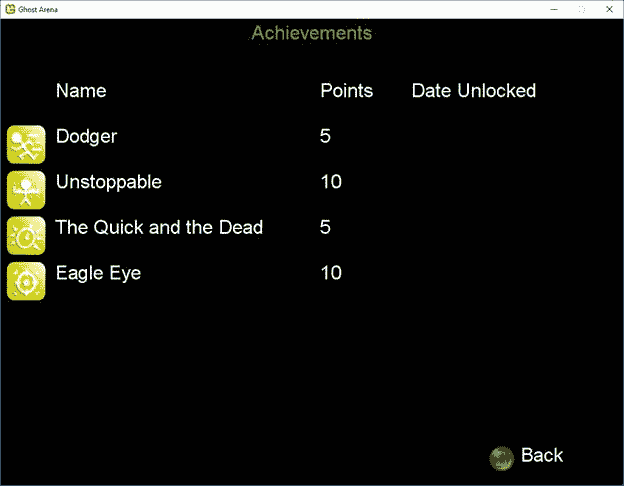

我们取消了让角色发射子弹的功能，现在我们将把它具体化。我们将从标准的经理课程开始:

```cs
  public class Bullet
  {
      private Direction _direction;
      private Vector2 _location;
      private bool _alive;

      public Vector2 Location
      {
          get { return _location; }
      }

      public Direction BulletDirection
      {
          get { return _direction; }
      }

      public bool IsAlive
      {
          get { return _alive; }
      }

      public Bullet(Direction dir,Vector2 location)
      {
          _direction =
  dir;
          _location =
  location;
          _alive = true;
      }

      public void Update()
      {
          if (_alive)
          {
              switch (_direction)
              {
                  case Direction.East:

  _location.X += 4.0f;

                      break;

                  case Direction.North:

  _location.Y -= 4.0f;

                      break;

                  case Direction.NorthEast:

  _location.Y -= 3.0f;

  _location.X += 3.0f;

                      break;

                  case Direction.NorthWest:

  _location.Y -= 3.0f;

  _location.X -= 3.0f;

                      break;

                  case Direction.South:

  _location.Y += 4.0f;
                      break;

                  case Direction.SouthEast:

  _location.Y += 3.0f;

  _location.X += 3.0f;
                      break;

                  case Direction.SouthWest:

  _location.Y += 3.0f;
                      _location.X
  -= 3.0f;
                      break;

                  case Direction.West:

  _location.X -= 4.0f;
                      break;
              }
          }

          if (_location.X < 20 || _location.X >
  Game1.ScreenWidth - 20 || _location.Y < 88 || _location.Y >
  Game1.ScreenHeight - 20)
              _alive = false;

      }

      public void Kill()
      {
          _alive = false;
          _location = Vector2.Zero;
      }

      public void Spawn(Direction dir, Vector2 loc)
      {
          _direction =
  dir;
          _location = loc;
          _alive = true;
      }
  }

  public class BulletManager : List<Bullet>
  {
      private static Vector2[] _bulletOffset;

      private Texture2D _bulletTexture;

      private Rectangle _bulletRect;

      private float _lastBulletSpawnTime;

      private int _shotsFired;
      private int _shotsHit;

      public int ShotsFired
      {
          get { return _shotsFired; }
      }

      public int ShotsHit
      {
          get { return _shotsHit; }
      }

      public BulletManager(Game
  game)
          : base(5)
      {
          _bulletOffset = new Vector2[8];
          _bulletOffset[0]
  = new Vector2(0,-33);
          _bulletOffset[1]
  = new Vector2(24,-25);
          _bulletOffset[2]
  = new Vector2(33,0);
          _bulletOffset[3]
  = new Vector2(24,25);
          _bulletOffset[4]
  = new Vector2(0,33);
          _bulletOffset[5]
  = new Vector2(-24,25);
          _bulletOffset[6]
  = new Vector2(-33,0);
          _bulletOffset[7]
  = new Vector2(-24,-25);

          ContentManager content = new ContentManager(game.Services);

          _bulletTexture =
  content.Load<Texture2D>("Content/bullet");

          _bulletRect = new Rectangle(0, 0, 2, 6);

          _lastBulletSpawnTime
  = 1.0f;

          _shotsFired = 0;
          _shotsHit = 0;

      }

      public bool Spawn(Direction dir, Vector2 location)
      {
          bool bRet = false;

          if (this.Count < 5)
          {
              this.Add(new Bullet(dir, location + _bulletOffset[(int)dir]));
              bRet = true;
          }
          else
          {
              //check to see if any bullet is no
  longer alive
              foreach (Bullet bullet in this)
                  if (bullet.IsAlive == false)
                  {

  bullet.Spawn(dir, location + _bulletOffset[(int)dir]);
                      bRet
  = true;
                      break;
                  }
          }

          if (bRet)

  _shotsFired++;

          return bRet;
      }

      public void Update()
      {
          foreach (Bullet bullet in this)

  bullet.Update();
      }

      public void Draw(SpriteBatch sb)
      {
          Vector2 origin = new Vector2(_bulletTexture.Width / 2,
  _bulletTexture.Height / 2);
          float rot;

          foreach (Bullet bullet in this)
          {
              if (bullet.IsAlive)
              {
                  rot = (int)bullet.BulletDirection * MathHelper.ToRadians(45.0f);

  sb.Draw(_bulletTexture, new Rectangle((int)bullet.Location.X, (int)bullet.Location.Y, 2, 6), _bulletRect, Color.White, rot, origin, SpriteEffects.None, 0.0f);
              }
          }
      }

      public bool CheckCollision(Entity entity)
      {
          bool ret = false;

          BoundingBox entityBox = new BoundingBox(new
  Vector3(entity.Location.X,
  entity.Location.Y, 0),
              new Vector3(entity.Location.X +
  entity.FrameWidth, entity.Location.Y + entity.FrameWidth, 0));

          foreach (Bullet bullet in this)
          {
              BoundingBox bulletBox = new BoundingBox(new
  Vector3(bullet.Location.X,
  bullet.Location.Y, 0),
                  new Vector3(bullet.Location.X + 2,
  bullet.Location.Y + 6, 0));

              if (entityBox.Intersects(bulletBox))
              {

  bullet.Kill();

  _shotsHit++;

                  ret = true;
                  break;
              }
          }

          return ret;
      }
  }

```

代码清单 63–bullet manager 类

`Bullet`类处理基于它被激发的方向更新它的位置。这是一个硬编码的值，这并不理想，但对于一个小游戏来说，它可以完成任务。理想情况下，您应该确保对角线上的值随着时间的推移与水平和垂直方向上的值相同。这与这里的价值观很接近，但并不完美。玩家可能甚至没有注意到，但是如果你想稍微清理一下，请随意。

`BulletManager`保存偏移的集合，因此子弹根据射击时角色面对的方向正确出现。它将自己管理的子弹集合初始化为`5`，这是玩家一次可以在屏幕上拥有的所有子弹，以避免制服鬼魂。如果玩家可以一秒钟发射一颗子弹，他可能会原地旋转，永远不会被碰。这样，他必须有一点技巧，并真正瞄准。

`CheckCollision`方法在接触到鬼魂时调用`Bullet`类的`Kill`方法，将`_alive`成员设置为`false`。如果子弹离开屏幕，该成员也被设置为`false`。这是在`Bullet`类的`Update`方法中完成的。

当玩家开火时，调用`Spawn`方法，我们检查集合中的子弹是否少于五发。如果是这样，我们添加一个新的。如果没有，我们检查每个项目符号的`_alive`成员，看看我们是否可以重用那个对象。

`BulletManager`用于`Entity`类:

```cs
  private BulletManager _bulletManager;

  public int
  ShotsFired
  {
      get { return _bulletManager.ShotsFired; }
  }

  public int
  ShotsHit
  {
      get { return _bulletManager.ShotsHit; }
  }

  public Entity(EntityType type, Vector2 location, Direction orientation, int numFrames, int
  textureWidth, Game game)
  {
  . . .            
      _bulletManager = new BulletManager(game);
  }

  public void
  Update(GameTime gameTime, Vector2 playerLocation)
  {
  . . .          

  _bulletManager.Update();
  }

  public bool
  SpawnBullet()
  {
      return _bulletManager.Spawn(this.ShootDirection,
  this.Location);
  }

  public void
  DrawBullets(SpriteBatch sb)
  {

  _bulletManager.Draw(sb);
  }

  public bool
  CheckBulletCollision(Entity entity)
  {
      if (_bulletManager.CheckCollision(entity))
          return true;

      return false;
  }

  public void
  Dispose()
  {

  _bulletManager.Clear();
  }

```

代码清单 64–实体类项目符号代码

我们添加了一些辅助方法，将在我们的成就系统中使用。我们添加了其他方法来处理初始化、更新和清理对象，以及添加、绘制和检查与幽灵的碰撞。在这一点上很基本。

正如我们已经看到的，我们的游戏将有三个难度设置。难度影响五个不同的东西:鬼的生命值，鬼的速度，被鬼接触时角色消耗的生命值，鬼的产卵时间，消灭鬼的分数。这些数据保存在一个 XML 文件中。将名为**艰难设置. xml** 的文件添加到项目的根目录，并添加以下内容:

```cs
  <?xml version="1.0" encoding="utf-8" ?>
  <ArrayOfDifficultySetting xmlns:xsi="http://www.w3.org/2001/XMLSchema-instance" xmlns:xsd="http://www.w3.org/2001/XMLSchema">>
    <DifficultySetting>
      <Name>Easy</Name>
                    <GhostHealth>1</GhostHealth>
                    <GhostSpeed>3.0</GhostSpeed>
                    <HealthDrain>2</HealthDrain>
                    <GhostSpawnTime>3</GhostSpawnTime>
                    <GhostScore>1</GhostScore>
              </DifficultySetting>
    <DifficultySetting>
      <Name>Normal</Name>
                    <GhostHealth>2</GhostHealth>
                    <GhostSpeed>3.5</GhostSpeed>
                    <HealthDrain>4</HealthDrain>
                    <GhostSpawnTime>2</GhostSpawnTime>
                    <GhostScore>2</GhostScore>
              </DifficultySetting>
    <DifficultySetting>
        <Name>Hard</Name>
                    <GhostHealth>3</GhostHealth>
                    <GhostSpeed>4.0</GhostSpeed>
                    <HealthDrain>8</HealthDrain>
                    <GhostSpawnTime>1</GhostSpawnTime>
                    <GhostScore>3</GhostScore>
              </DifficultySetting>
  </ArrayOfDifficultySetting>

```

代码清单 65–困难系统 XML 文件

这些数据将存储在一个简单的类中。创建一个`DifficultySystem`类，并在其前面添加以下类:

```cs
  public class DifficultySetting
  {
      public string Name;
      public short HealthDrain;
      public float GhostSpeed;
      public short GhostHealth;
      public float GhostSpawnTime;
      public short GhostScore;
  }

```

代码清单 66–困难设置类

本课程将在我们的`DifficultySystem`课程中使用:

```cs
  public class DifficultySystem
  {
      private int _difficulty;
      private float _levelSpeed;

      private List<DifficultySetting> _settings;

      public DifficultySystem()
      {

  GetDifficultySettings();
          _levelSpeed =
  0.0f;
      }

      private void GetDifficultySettings()
      {
          try
          {
              FileStream stream = File.Open("DifficultySettings.xml",FileMode.Open);
              XmlSerializer serializer = new XmlSerializer(typeof(List<DifficultySetting>));

              _settings =
  (List<DifficultySetting>)serializer.Deserialize(stream);

          }
          catch (Exception e)
          {
              Console.WriteLine(e.Message);
          }
      }

      public int HealthDrain
      {
          get { return _settings[_difficulty].HealthDrain;
  }
      }

      public float GhostSpeed
      {
          get { return _settings[_difficulty].GhostSpeed +
  _levelSpeed; }
      }

      public int GhostHealth
      {
          get { return _settings[_difficulty].GhostHealth;
  }
      }

      public float GhostSpawnTime
      {
          get { return
  _settings[_difficulty].GhostSpawnTime; }
      }

      public short GhostScore
      {
          get { return _settings[_difficulty].GhostScore;
  }
      }

      public void SetDifficulty(int difficulty)
      {
          _difficulty =
  difficulty;
      }

      public string[] GetDifficultyNames()
      {
          List<string>names
  = new List<string>();

          foreach (DifficultySetting setting in _settings)

  names.Add(setting.Name);

          return names.ToArray();
      }

      public void IncreaseGhostSpeed()
      {
          _levelSpeed +=
  .2f;
      }
  }

```

代码清单 67–困难系统类

有了`DifficultySystem`之后，我们可以将它的一个实例添加到我们的`Game`类中并初始化它，以及将该方法添加到所有要设置的难度级别中:

```cs
  public DifficultySystem Difficulty;

  protected override void Initialize()
  {
  . . .

      Difficulty = new DifficultySystem();

      base.Initialize();
  }

  public void
  SetDifficulty(int difficulty)
  {

  Difficulty.SetDifficulty(difficulty);
  }

```

代码清单 68–游戏类难度代码

添加后，`DifficultyScreen` `Initialize`方法中的行可以取消注释。我们现在可以在开始游戏时选择一个难度等级，并将其设置在`GameplayScreen`中，为班级添加必要的成员:

```cs
  int _remainingTime;
  float _timeCounter;

  int _difficulty;
  int _curLevel;

  public GameplayScreen(int difficulty)
  {
      TransitionOnTime = TimeSpan.FromSeconds(1.5);
      TransitionOffTime = TimeSpan.FromSeconds(0.5);

      _timeCounter = 0.0f;

      _remainingTime =
  180;

      _difficulty =
  difficulty;

      _curLevel = 1;
  }

  public override void Initialize()
  {
  . . . 
      ((Game1)ScreenManager.Game).SetDifficulty(_difficulty);
  }

```

代码清单 69–游戏类难度代码

有一点代码我们没有添加，用于处理随着时间的推移提高游戏水平，以及处理玩家死亡时发生的事情。代码不多，但是没有它游戏就会崩溃，所以让我们来解决这个问题。

一切都归入`GameplayScreen`类:

```cs
  string _displayMinutes;

  public override void Update(GameTime gameTime, bool otherScreenHasFocus,

  bool coveredByOtherScreen)
  {
      base.Update(gameTime, otherScreenHasFocus,
  coveredByOtherScreen);
      if (IsActive)
      {

  _entityManager.Update(gameTime);

          if (_entityManager.IsPlayerDead())

  DoGameOver();

          _timeCounter +=
  gameTime.ElapsedGameTime.Milliseconds;

          if (_timeCounter >= 1000.0f)
          {

  _remainingTime--;
              _timeCounter
  -= 1000.0f;

              if (_remainingTime == 0)

  DoNextLevel();
          }
      }
  }

  void DoGameOver()
  {
      MessageBoxScreen
  messageBox = new MessageBoxScreen("Game Over. Final score:
  " +
  _entityManager.Score.ToString());

      messageBox.Accepted
  += GameOverMessageBoxAccepted;

  ScreenManager.AddScreen(messageBox);
  }

  void DoNextLevel()
  {
      _curLevel++;
      _remainingTime =
  180;

  ((Game1)ScreenManager.Game).Difficulty.IncreaseGhostSpeed();
  }

  void GameOverMessageBoxAccepted(object sender, EventArgs
  e)
  {

  LoadingScreen.Load(ScreenManager, LoadMainMenuScreen, false);
  }

  void LoadMainMenuScreen(object sender, EventArgs
  e)
  {

  ScreenManager.AddScreen(new MainMenuScreen());
  }

```

代码清单 70–游戏屏幕类游戏逻辑代码

我们更新时间来决定游戏的等级是否应该提高。如果是这样的话，我们可以加快鬼魂的速度。当玩家死亡时，我们会显示一个消息框来显示最终得分，并允许玩家返回主菜单。你可以更新这个，让玩家以同样的难度再玩一次。在这种情况下，你必须清除所有与游戏性相关的东西。

游戏结束后，还剩下一点代码来给高分榜增加一个新的分数。这适用于`GameplayScreen`类中的`DoGameOver`方法:

```cs
  void DoGameOver()
  {
  . . .            
      HighScoreList scores = new HighScoreList();
      scores.AddScore(new HighScore(DateTime.Now.ToString("mm/dd/yyyy"), _curLevel, _entityManager.Score));
      scores.Save();
  }

```

代码清单 71–游戏屏幕类高分逻辑代码

我们还需要完成充实 HighScoreList 类，以便实际加载和保存分数:

```cs

  public HighScoreList()
  {
      GetHighScores();
  }

  private async void GetHighScores()
  {
      try
      {
          //StorageFile file = await
  storageFolder.GetFileAsync("scores.xml");
          //Stream s = await
  file.OpenStreamForReadAsync();

          //XmlSerializer serializer = new
  XmlSerializer(typeof(List<HighScore>));

          //_scores =
  (List<HighScore>)serializer.Deserialize(s);
      }
      catch (Exception ex)
      {
          throw new Exception("Error
  getting achievements file");
      }

  }
  public async void Save()
  {
      //StorageFile file = await
  storageFolder.GetFileAsync("scores.xml");
      //Stream s = await
  file.OpenStreamForWriteAsync();

      //XmlSerializer serializer = new XmlSerializer(typeof(List<HighScore>));

      //serializer.Serialize(s, _scores);
  }

  public void
  Save(FileStream stream)
  {
      XmlSerializer serializer = new XmlSerializer(typeof(List<HighScore>));

  serializer.Serialize(stream, _scores);
  }

  public void
  Load(FileStream stream)
  {
      XmlSerializer serializer = new XmlSerializer(typeof(List<HighScore>));
      _scores = (List<HighScore>)serializer.Deserialize(stream);
  }

  public void
  AddScore(HighScore score)
  {
      if (_scores == null)
          _scores = new List<HighScore>();

      bool scoreAdded = false;

      for (int i = 0; i < _scores.Count; i++)
      {
          if (_scores[i].Score < score.Score)
          {

  _scores.Insert(i, score);
              scoreAdded =
  true;

              if (_scores.Count > 10)

  _scores.RemoveAt(10);

              break;
          }
      }

      if (!scoreAdded && _scores.Count < 10)

  _scores.Add(score);
  }

```

代码清单 72–高核心列表类更新代码

我留下了加载数据的旧 XNA 代码，以便您可以将其与标准文件输入/输出类型加载进行比较。默认情况下，该列表只保留 10 个最高分。如果你实现了全球高分，请随意扩展。

有一件事会让玩家回到你的游戏中来，那就是实现一个目标。玩家喜欢挑战，在你的游戏中获得不劳而获的成就是让玩家继续玩你的游戏的可靠方法。

我们将在游戏中添加四项成就:



图 17 -成就屏幕

与难度级别一样，成绩数据保存在一个 XML 文件中，在这里您可以看到需要做什么才能获得成绩的描述。将名为**成就. xml** 的文件添加到项目的根目录中，并添加以下内容:

```cs
  <?xml version="1.0"?>
  <ArrayOfAchievement xmlns:xsi="http://www.w3.org/2001/XMLSchema-instance" xmlns:xsd="http://www.w3.org/2001/XMLSchema">
    <Achievement>
      <ID>1</ID>
      <Name>Dodger</Name>
      <Points>5</Points>
      <Description>Do not get touched by a ghost once during a level</Description>
    </Achievement>
    <Achievement>
      <ID>2</ID>
      <Name>Unstoppable</Name>
      <Points>10</Points>
      <Description>Do not die once in a level</Description>
    </Achievement>
    <Achievement>
      <ID>3</ID>
      <Name>The
  Quick and the Dead</Name>
      <Points>5</Points>
      <Description>Defeat a level under par time</Description>
    </Achievement>
    <Achievement>
      <ID>4</ID>
      <Name>Eagle
  Eye</Name>
      <Points>10</Points>
      <Description>Get 95% or greater hit/miss ratio in a level</Description>
    </Achievement>
  </ArrayOfAchievement>

```

代码清单 73–成就数据

同样，与困难一样，我们将把数据保存在一个类中，并有一个数据管理器。使用以下内容将文件添加到项目中:

```cs
  //this enum must be synced
  with the order in the XML file
  public enum
  Achievements
  {
      Dodger,
      Unstoppable,
      QuickDead,
      EagleEye
  }

  public class Achievement
  {
      public int ID;
      public string Name;
      public int Points;
      public string Description;
  }

  public class PlayerAchievement
  {
      public int ID;
      public DateTime DateUnlocked;
  }

  //used in
  AchievementScreen
  public class AchievementDisplay
  {
      public Texture2D Icon; 
      public string Name;
      public string Points;
      public string DateUnlocked;
  }

  public class AchievementManager
  {
      private List<PlayerAchievement> _playerAchievements;
      private List<Achievement> _achievements;

      private Game _game;

      public AchievementManager(Game game)
      {
          _achievements = new List<Achievement>();

  LoadAchievements();

  LoadPlayerAchievements();

          _game = game;
      }

      private void LoadAchievements()
      {
          try
          {
              FileStream stream = File.Open("achievements.xml", FileMode.Open);
              XmlSerializer serializer = new XmlSerializer(typeof(List<Achievement>));

  _achievements = (List<Achievement>)serializer.Deserialize(stream);
          }
          catch (Exception ex)
          {
              throw new Exception("Error
  getting achievements file");                
          }
      }

      private void LoadPlayerAchievements()
      {
          try
          {
              FileStream stream = File.Open("achievements.xml", FileMode.Open);

              if (stream != null)
              {
                  XmlSerializer serializer = new XmlSerializer(typeof(List<PlayerAchievement>));

  _playerAchievements = (List<PlayerAchievement>)serializer.Deserialize(stream);
              }
          }
          catch (Exception ex)
          {

  _playerAchievements = new List<PlayerAchievement>();
          }
      }

      public void Save()
      {
          try
          {
              FileStream stream = File.Open("achievements.xml", FileMode.OpenOrCreate);
              XmlSerializer serializer = new XmlSerializer(typeof(List<PlayerAchievement>));

  serializer.Serialize(stream, _playerAchievements);
          }
          catch (Exception ex)
          {
              throw new Exception("Error
  getting player achievements file");
          }
      }

      public bool PlayerHasAchievements()
      {
          if (_playerAchievements != null)
              return (_playerAchievements.Count > 0);
          else
              return false;
      }

      public int PlayerAchievementCount()
      {
          if (_playerAchievements != null)
              return _playerAchievements.Count;
          else
              return 0;
      }

      public List<AchievementDisplay> Achievements()
      {
          List<AchievementDisplay> achievements = new List<AchievementDisplay>();

          AchievementDisplay display;

          foreach (Achievement achievement in _achievements)
          {
              display = new AchievementDisplay();

              display.Icon
  = Game1.Instance.Content.Load<Texture2D>("achievement" + achievement.ID.ToString());
              display.Name
  = achievement.Name;

  display.Points = achievement.Points.ToString();

  display.DateUnlocked = GetDateUnlocked(achievement.ID);

  achievements.Add(display);
          }

          return achievements;
      }

      private string GetDateUnlocked(int id)
      {
          if (_playerAchievements != null)
          {
              foreach (PlayerAchievement achievement in _playerAchievements)
                  if (achievement.ID == id)
                      return achievement.DateUnlocked.ToString();
          }

          return "";
      }

      public void AddAchievement(Achievements type)
      {
          PlayerAchievement achievement = new PlayerAchievement();

  achievement.DateUnlocked = DateTime.Now;
          achievement.ID =
  _achievements[(int)type].ID;

          if (_playerAchievements == null)

  _playerAchievements = new List<PlayerAchievement>();

  _playerAchievements.Add(achievement);
      }

      public bool IsAchievementEarned(Achievements type)
      {
          if (_playerAchievements != null)
          {
              for (int i = 0; i <
  _playerAchievements.Count; i++)
                  if (_playerAchievements[i].ID == _achievements[(int)type].ID)
                      return true;
          }

          return false;

      }
  }

```

代码列表 74–成就代码

请注意，成就名称的枚举不是按字母顺序排列的。如果您希望如此，您需要对 XML 文件中的项目重新排序。如果你真的组织好了，这意味着你需要更新每个项目的`ID`属性来反映新的顺序，这也需要改变成就图标的文件名。

`AchievementsScreen`类用于显示成绩。将该类的文件添加到**屏幕**文件夹，并用以下内容更新:

```cs
  class AchievementsScreen : GameScreen
  {
      private List<AchievementDisplay> _achievements;
      private SpriteFont _titleFont;
      private Texture2D _buttonB;

      private SpriteFont _textFont;

      private Vector2 _iconLoc;
      private Vector2 _nameLoc;
      private Vector2 _pointsLoc;
      private Vector2 _dateLoc;

      private int _topIndex;

      private const int
  MaxAchievementsDisplayed = 6;

      public AchievementsScreen()
      {
          TransitionOnTime
  = TimeSpan.FromSeconds(1.5);

  TransitionOffTime = TimeSpan.FromSeconds(0.5);

          _iconLoc = new Vector2(10, 100);
          _nameLoc = new Vector2(90, 100);
          _pointsLoc = new Vector2(525, 100);
          _dateLoc = new Vector2(675, 100);

          _topIndex = 0;
      }

      public override void
  LoadContent()
      {
          _titleFont = Game1.Instance.Content.Load<SpriteFont>("menufont");
          _textFont = Game1.Instance.Content.Load<SpriteFont>("menufont"); 
          _buttonB = Game1.Instance.Content.Load<Texture2D>("BButton");

          base.LoadContent();
      }

      public override void
  Initialize()
      {
          _achievements = new AchievementManager(ScreenManager.Game).Achievements();

          base.Initialize();
      }

      public override void
  HandleInput(InputState input, GameTime gameTime)
      {
          if ((input.CurrentGamePadState.Buttons.B ==
  Microsoft.Xna.Framework.Input.ButtonState.Pressed && input.LastGamePadState.Buttons.B ==
  Microsoft.Xna.Framework.Input.ButtonState.Released) ||

  (input.CurrentKeyboardState.IsKeyDown(Microsoft.Xna.Framework.Input.Keys.Escape) &&
  input.LastKeyboardState.IsKeyUp(Microsoft.Xna.Framework.Input.Keys.Escape)))
              this.ExitScreen();

          base.HandleInput(input, gameTime);
      }

      public override void
  Draw(GameTime gameTime)
      {
          Vector2 textPosition;

  ScreenManager.GraphicsDevice.Clear(ClearOptions.Target, Color.Black, 0, 0);

  Microsoft.Xna.Framework.Color color = new Microsoft.Xna.Framework.Color((byte)0, (byte)255,
  (byte)0, TransitionAlpha);

  ScreenManager.SpriteBatch.Begin();
          Vector2 titleSize =
  _titleFont.MeasureString("Achievements");
          textPosition = new Vector2(ScreenManager.GraphicsDevice.Viewport.Width
  / 2 - titleSize.X / 2, 5);

  ScreenManager.SpriteBatch.DrawString(_titleFont, "Achievements", textPosition, color);

          color = new Microsoft.Xna.Framework.Color((byte)255, (byte)255, (byte)255,
  TransitionAlpha);

          int numDisplayed = (int)MathHelper.Clamp(_achievements.Count, 0,
  MaxAchievementsDisplayed);

          //draw headers

  ScreenManager.SpriteBatch.DrawString(_textFont, "Name", _nameLoc, Color.White);

  ScreenManager.SpriteBatch.DrawString(_textFont, "Points", _pointsLoc, Color.White);

  ScreenManager.SpriteBatch.DrawString(_textFont, "Date Unlocked", _dateLoc, Color.White);

          //loop through list and draw each
  item
          for (int i = _topIndex; i < numDisplayed;
  i++)
          {

  ScreenManager.SpriteBatch.Draw(_achievements[i].Icon, _iconLoc + new Vector2(0, (i + 1) * 75), Color.White);

  ScreenManager.SpriteBatch.DrawString(_textFont, _achievements[i].Name,
  _nameLoc + new Vector2(0, (i + 1) * 75), Color.White);

  ScreenManager.SpriteBatch.DrawString(_textFont, _achievements[i].Points,
  _pointsLoc + new Vector2(0, (i + 1) * 75), Color.White);
              ScreenManager.SpriteBatch.DrawString(_textFont,
  _achievements[i].DateUnlocked, _dateLoc + new
  Vector2(0, (i + 1) * 75), Color.White);
          }

  ScreenManager.SpriteBatch.Draw(_buttonB, new
  Rectangle(800, 700, 48, 48), Color.White);

  ScreenManager.SpriteBatch.DrawString(ScreenManager.Font, "Back", new
  Vector2(855, 700), Color.White);

  ScreenManager.SpriteBatch.End();

          if (TransitionPosition > 0)

  ScreenManager.FadeBackBufferToBlack(255 - TransitionAlpha);
      }
  }

```

代码清单 75–成就屏幕类别

需要对`GameplayScreen`进行一些更新，以跟踪获得成就的时间:

```cs
  private AchievementManager _achievementManager;

  void DoGameOver()
  {
      CheckAchievements();

  . . . 
      if (_achievementManager != null)

  _achievementManager.Save();
  }

  void CheckAchievements()
  {
      //check for level-based achievements
      if (_achievementManager == null)

  _achievementManager = new AchievementManager(ScreenManager.Game);

      //touched
      if (!_entityManager.PlayerTouched)
      {
          if (!_achievementManager.IsAchievementEarned(Achievements.Dodger))

  _achievementManager.AddAchievement(Achievements.Dodger);
      }

      //died
      if (!_entityManager.PlayerDied)
      {
          if (!_achievementManager.IsAchievementEarned(Achievements.Unstoppable))

  _achievementManager.AddAchievement(Achievements.Unstoppable);
      }

      //par time - right now just 2 1/2
  minutes, could be changed to less time for higher levels
      if (_remainingTime >= 150)
      {
          if (!_achievementManager.IsAchievementEarned(Achievements.QuickDead))

  _achievementManager.AddAchievement(Achievements.QuickDead);
      }

      //hit/miss ratio
      float ratio = _entityManager.GetPlayerHitMissRatio();

      //just 95% right now, could be
  changed for higher levels
      if (ratio >= 0.95f)
      {
          if (!_achievementManager.IsAchievementEarned(Achievements.EagleEye))

  _achievementManager.AddAchievement(Achievements.EagleEye);
      }
  }

  void DoNextLevel()
  {
      CheckAchievements();

  . . . 

  }

```

代码清单 76–游戏屏幕成就代码

你会注意到`EntityManager`类中有一些新的成员和方法被查询。现在是时候更新那个类了。在`Update`方法中，用以下内容替换现有的`if` `(CheckEntityCollision(_entities[i]))`块。：

```cs
  private bool
  _touched;
  private bool
  _died;

  public bool
  PlayerTouched
  {
      get { return _touched; }
  }

  public bool
  PlayerDied
  {
      get { return _died; }
  }

  public EntityManager()
  {

  . . . 

      _touched = false;
      _died = false;
  }

  public void
  Update(GameTime gameTime)
  {
  . . . 
      if (CheckEntityCollision(_entities[i]))
      {
          _touched = true;

  _entities[0].DrainLife(Game1.Instance.Difficulty.HealthDrain);

  _entities.Remove(_entities[i]);

          if (_entities[0].Health <= 0)
          {
              Game1.Instance.GameSounds[Sounds.PlayerDie].Play();
              _died = true;
          }

          if (_entities.Count == 1)
              break;
      }
  . . .
  }

  public bool
  IsPlayerDead()
  {
      if (_entities.Count > 0)
      {
          return _entities[0].State == EntityState.Dead;
      }
      else
          return true;
  }

  public float GetPlayerHitMissRatio()
  {
      if (_entities[0].ShotsFired > 0)
          return _entities[0].ShotsHit / _entities[0].ShotsFired;
      else
          return 0.0f;
  }

```

代码清单 77–实体经理成就代码

`EntityManager`在`Entity`类中使用了一些新代码:

```cs
  public enum
  EntityState
  {
      Alive,
      Dying,
      Dead
  }

  public class Entity
  {
      private EntityState _state;

      public EntityState State
      {
          get { return _state; }
      }

      public void DrainLife(int amount)
      {
  . . .
          if (_health <= 0)
              _state = EntityState.Dead;
      }
  }

```

代码列表 78–实体经理成就代码

这里真的没有以前没有做过的新鲜事。您可能添加的任何新成就只需要对添加到 XML 文件中的这三大块代码和数据进行更新，并在成就屏幕中显示一个图标。请注意，如果您再添加几个，屏幕将无法同时显示它们。您必须添加代码来启用成绩的滚动或分页。

这就包含了制作一款可玩游戏所需的一切。当然，可玩性并不总是意味着你能创造出最好的游戏。任何游戏都有改进的空间。以下是一些你可以添加的东西，让游戏更有吸引力和乐趣——不仅仅是这个游戏，还有你创造的任何游戏。

当获得成就时，玩家目前无法知道。添加一个在屏幕上显示几秒钟的通知将是一个很好的增强，使您的游戏对玩家更加友好。

如果你这样做，我会建议制作一个继承自`DrawableGameComponent`的类，成为`GameplayScreen`类的成员。一个名为`ShowNotification`的方法可以用来初始化组件，设置一个在`GameplayScreen`的`Draw`方法中选中的开关来决定是否绘制通知。你可以用这种方法传递成绩信息。

游戏中的高分目前在玩游戏的机器上是本地的。为了让游戏对玩家更有吸引力，你可能想让其他玩家看到分数。这意味着你要么使用一个允许玩家查看其他玩家分数的服务，要么自己实现这个功能。后者将是一项艰巨的任务。

您可以使用许多服务来实现这一点。这里有几个:

*   [游戏公园](http://www.gamesparks.com/)
*   [微软 Azure](https://azure.microsoft.com/en-us/)
*   [解析](https://www.parse.com/)
*   [记分牌](http://scoreoid.net/)
*   [App42](http://api.shephertz.com/)
*   [伙伴](http://buddy.com/)