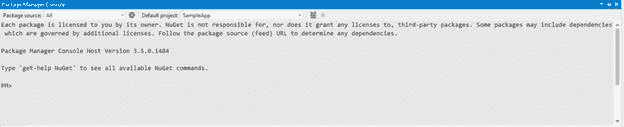
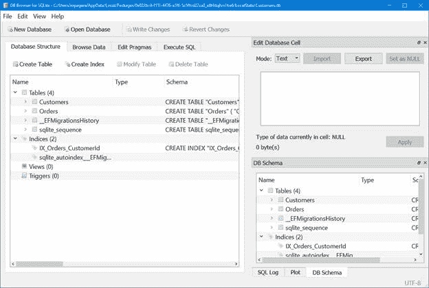

与传统的视窗应用程序方法相比，在通用视窗平台应用程序中管理存储是另一个很大的区别:如果桌面应用程序能够理想地读写任何计算机文件夹中的文件(当然，始终尊重用户的安全策略)，通用视窗平台应用程序将在沙箱中运行。存储工作起来像一个标准的硬盘，但它是隔离的:应用程序不能在这个沙箱之外读写数据(除非用户明确允许)。这种方法最重要的优点是安全性:应用程序不能访问核心操作系统的文件，因此它们不能破坏窗口的完整性，无论是有意的还是由于 bug 而导致的错误。保存在本地存储中的数据是持久的:即使应用程序被终止或挂起，数据也不会丢失，但每次再次启动时它总是可用的。

通用视窗平台提供不同类型的存储，这得益于`Windows.Storage`命名空间中的`ApplicationData.Current`类。在深入研究可用于执行常见操作(如读取或写入文件、列出文件夹内容等)的 API 之前，让我们详细了解各种类型的存储。

本地存储由`LocalFolder`类标识，使用最广泛:这是一个传统的文件系统，您可以在其中创建文件和文件夹，就像在计算机硬盘上一样。但是，由于存储的隔离性质，存储的数据只能由您的应用程序访问。其他应用程序只能使用特殊合同来访问您的数据，这将在本系列的另一本书中详细介绍。

本地存储遵循应用程序的相同生命周期:一旦卸载，存储也会被删除。除了设备上的可用空间，应用程序可以使用的存储配额没有限制。本地存储还提供了一种简单的方法来管理应用程序开发中非常常见的场景，即存储和读取设置，这要归功于一个名为`LocalSettings`的类。我们将在本章后面看到如何使用它。

关于本地存储，需要提到的一件重要事情是，它与 Windows 10 中可用的备份功能严格相连。事实上，该操作系统包括一个内置的备份功能，除了设备的设置，如开始屏幕配置、电子邮件帐户或锁屏图像，还可以保存通用视窗平台应用程序的本地存储内容。这样，如果用户重置其设备或购买新设备并恢复备份，他会发现它完全处于以前的状态，包括应用程序的数据。

需要强调的是，该备份保存到 OneDrive(即使对用户透明，他也无法看到自己帐户上的数据)，并且会计入他的配额。

###  `cache`

应用于本地存储的自动备份功能很有帮助，因为作为开发人员，我们不必寻找替代方法来为我们的应用程序提供备份机制。然而，有些应用程序并不真正需要这个功能:如果应用程序从互联网下载了大量数据，并且不允许用户生成任何内容，我们可能会在用户的 OneDrive 上白白浪费大量空间，因为无论如何，当应用程序恢复时，这些数据都必须再次下载。

例如，想想连接到音乐流媒体服务(如 Spotify 或 Groove Music)的应用程序:本地存储可能会变得相当大，因为这些服务的付费计划允许用户离线下载音乐，这样即使没有互联网连接，他们也可以收听音乐。在这种情况下，我们谈论的不是用户生成的内容，而是简单地从互联网下载并存储在本地的内容。因此，将它存储在 OneDrive 上是没有意义的，因为在恢复的情况下，我们无论如何都必须下载它，而且它不是我们创建的内容，但我们只是在消费它。

在所有这些场景中，保存整个应用程序的内容会浪费用户 OneDrive 帐户的空间，通用 Windows 平台提供了一个名为`LocalCacheFolder`的特殊存储，这也是`ApplicationData.Current`类的一部分。它的工作原理与`LocalFolder`完全一样，唯一的区别是在备份过程中，创建到该存储中的数据不会自动保存。

漫游存储由`ApplicationData.Current`对象提供的`RoamingStorage`类标识，它具有与本地存储相同的基本特征，这意味着数据是隔离的，它可以存储设置(使用`RoamingSettings`类)、文件和文件夹。

漫游存储最重要的特点是，数据会自动与用户在同一微软帐户注册的所有 Windows 10 设备同步，无论它们是手机、平板电脑、传统台式机等。这意味着，如果用户在多个设备上安装了相同的应用程序，我们可以同步数据，例如，他可以在平板电脑上开始一项任务，然后在手机上完成；或者他可以在手机上找到他在电脑上配置的相同设置。

漫游的存储不遵循应用程序的相同生命周期:即使它被卸载，漫游数据也会保留 30 天，以防用户改变主意并决定再次重新安装应用程序。漫游存储基于 OneDrive，即使它不计入用户配额:但是，在存储大小方面有一个重要的限制。事实上，当前的限制是 100 KB:因此，漫游存储非常适合保存小数据，如应用程序的设置或未完成的任务，但不适合保存真正的内容，如数据库。如果您需要在多个设备上同步应用程序的内容(也是以跨平台的方式)，最好依赖第三方解决方案，比如使用微软云解决方案 Azure 提供的 Mobile Apps。

然而，100 KB 的限制并不是固定的:在未来，微软可能会决定增加它。因此，当您需要在漫游存储中保存一些数据，并希望确保适合最大空间时，您不必检查 100 KB 的配额，而是检查名为`RoamingStorageQuota`的特殊属性。在这种情况下，如果微软决定在未来的 Windows 10 更新中增加它，您将不必更改代码来支持新的配额。下面的示例显示了如何检索这些信息，以便我们可以用弹出消息向用户显示这些信息。

```cs
  private async void OnShowQuotaClicked(object sender, RoutedEventArgs e)
  {
      string quota = string.Format("Roaming quota: {0} KB", ApplicationData.Current.RoamingStorageQuota);
      MessageDialog dialog = new MessageDialog(quota);
      await dialog.ShowAsync();
  }
```

如果超过漫游配额会发生什么？在删除一些内容并恢复到小于 100 KB 的大小之前，数据不会再简单地同步。需要提到的另一个重要限制是，同步不是立即执行的，而是取决于许多情况，如网络可用性、设备是否在电池节省模式下运行等。因此，对于需要在所有设备上尽快同步数据的关键场景，您不应该依赖漫游存储。

由于同步是在开发人员无法控制的情况下执行的，我们可以订阅一个名为`DataChanged`的事件，该事件由`ApplicationData.Current`类提供，当同步已经执行并且数据已经更新时触发。这样，例如，如果更改了设置，我们就可以执行所需的操作来正确更新应用程序的行为。以下示例显示了如何订阅此事件:

```cs
  public sealed partial class MainPage : Page
  {
      public MainPage()
      {
          this.InitializeComponent();
          ApplicationData.Current.DataChanged +=
  Current_DataChanged;
      }

      private void Current_DataChanged(ApplicationData sender, object args)
      {
          //update the application
      }
  }
```

另一种存储类型称为临时存储，由`ApplicationData.Current`对象提供的`TemporaryFolder`类标识。它主要用于缓存场景，这意味着数据可以用来加速应用程序和减少加载时间(就像从互联网下载的一组图像)，但这并不重要。事实上，用户(在他决定清理临时文件的情况下)或系统(在维护任务的情况下)可以在不事先通知的情况下随时擦除该存储。

与其他两种存储类型不同，临时存储不支持设置管理(因为设置是一种数据，您希望在应用程序的不同使用中保持不变，并且不应该随机重置)。

正如我们在前面几章中所描述的，每个应用程序的存储是隔离的，一个应用程序不能读写属于其他应用程序的数据。有一个例外:由同一开发人员发布的应用程序(因此在 Store 上使用相同的发布者名称和开发人员帐户)可以有一个共享的缓存文件夹，他们可以在其中交换文件和文件夹。它基本上是存储的一个特殊区域，同一开发人员发布的每个应用程序都可以在这里读写文件，就像常规存储一样:不同的是，在这种情况下，它不是按应用程序隔离的，而是按发布者隔离的。

支持此功能的第一步是在清单文件中声明扩展名。不幸的是，可视化编辑器不支持该功能，因此您需要右键单击 **Package.appxmanifest** 文件并选择选项**查看代码**。这样，您将看到组成清单的 XML，而不是可视化编辑器。

在`Application`和`Capabilities` 节点之间，需要放置一个名为`Extensions` 的区域，其定义如下:

```cs
  <Extensions>
    <Extension Category="windows.publisherCacheFolders">
      <PublisherCacheFolders>
        <Folder Name="Downloads"
  />
      </PublisherCacheFolders>
    </Extension>
  </Extensions>
```

作为`PublisherCacheFolders`元素的子元素，您可以放置任意数量的`Folder`项目，每个项目都由唯一的名称标识。这些项目代表将在发布服务器缓存中可用的文件夹列表。

**重要！**此定义必须添加到您将要发布的每个应用程序的清单文件中，并且您希望利用此功能。

一旦添加了这个定义，您就可以通过调用`ApplicationData.Current.GetPublisherCacheFolder()`方法并作为参数传递您想要访问的文件夹的名称(它需要是清单中的`Folder`条目之一)来访问发布者缓存存储。

这个方法将返回一个常规的`StorageFolder`对象，正如我们将在本章后面看到的，它是基类，表示存储中的一个文件夹，我们可以使用它来创建或读取其中的文件。

下面的示例显示了一个应用程序(我们称之为应用程序 A)，它获取对共享存储的引用，并编写一个包含一些内容的文本文件:

```cs
  private async void OnSaveData(object sender, RoutedEventArgs e)
  {
      StorageFolder folder = ApplicationData.Current.GetPublisherCacheFolder("Downloads");
      StorageFile sampleFile = await folder.CreateFileAsync("sample.txt");
      await FileIO.WriteTextAsync(sampleFile, "Shared text");
  }
```

相反，在另一个我们称之为 App B 的应用程序中，它仍然属于我们，因此，在清单中声明了 App A 的相同发布者，我们可以通过访问具有相同 API 的共享存储来读取文本文件的内容:

```cs
  private async void OnReadData(object sender, RoutedEventArgs e)
  {
      StorageFolder folder = ApplicationData.Current.GetPublisherCacheFolder("Downloads");
      StorageFile file = await folder.GetFileAsync("sample.txt");
      string content = await FileIO.ReadTextAsync(file);
      MessageDialog dialog = new MessageDialog(content);
      await dialog.ShowAsync();
  }
```

我们将在本章后面看到更多关于我们用来创建文件、写入数据和读取数据的类的细节(`StorageFolder`、`StorageFile`和`FileIO`)。

在某些 Windows 10 设备(如桌面)上，您可以在同一台机器上配置多个用户。为了节省空间，当您从商店安装通用视窗应用程序时，它会安装在计算机的一个特殊文件夹中(`C:\Program Files\WindowsApps`)，每个用户都可以共享该文件夹。这样，如果你安装一个 30 GB 大小的三 A 游戏，你就不必为每个想玩游戏的用户增加占用的空间。唯一重复的存储类型是我们到目前为止看到的类型:每个用户都有自己的本地、漫游或临时存储，这样他就可以将自己的数据和设置与设备的其他用户分开。

但是，在某些情况下，让同一台机器上同一应用程序的每个用户共享存储可能会有所帮助。例如，前面提到的游戏可以提供额外的内容来下载(像一组新的关卡)，这可以被计算机的每个用户所利用:在这种情况下，强迫每个用户从头开始下载是没有多大意义的。

要访问这个共享文件夹，您可以使用`ApplicationData.Current.SharedLocalFolder`类，它的工作原理与任何其他类型的存储完全一样:当您的应用程序向其中写入一些数据时，在同一台机器上运行的同一应用程序，但对于不同的用户，将能够读取它。

但是，有一个警告:只有在机器管理员通过适当的组策略允许的情况下，这个特殊的共享文件夹才可用。如果该政策尚未设定，`ApplicationData.Current.SharedLocalFolder`将为`null`。

[``](https://winblogs.azureedge.net/win/2016/05/3_localapp.png)

图 29:必须启用的策略，以便跨用户启用共享文件夹

尤其是当我们将在接下来的部分中看到如何永久存储应用程序的数据时，分析本地存储的内容可能会很有用，以便在出现问题时，我们可以快速了解是否出现了问题，例如文件丢失或某个文件夹的内容不是我们所期望的内容。

调试这些场景最简单的平台是桌面平台:每个应用程序的本地存储都存储在文件夹`C:\Users\<username>\AppData\Local\Packages`中，其中`<username>`是本地 Windows 用户的名字。在这个文件夹中，您会发现一个子文件夹列表，每个通用视窗平台应用程序一个。文件夹的名称基于应用程序的**软件包家族名称**，您可以在清单文件中找到(在**软件包**部分)，它是根据发行者名称和应用程序名称的组合自动生成的。例如，如果你还在开发和调试阶段(所以你还没有为你的应用程序保留名字)，应用程序的文件夹可能是类似`0e022bc4-f11f-4476-a1f6-5c5ffcd22ca0_e8f4dqfvn1be6`的东西。在应用程序的文件夹中，您会发现许多其他文件夹，包括:

*   本地存储器，存储在 **LocalState** 文件夹中。
*   漫游存储器，存储在**漫游状态**文件夹中。
*   临时存储器，存储在**临时状态**文件夹中。
*   本地缓存存储(没有在 OneDrive 上备份的存储)存储在 **LocalCache** 文件夹中。

开发人员的一个常见场景是使用文件夹来组织存储结构，以逻辑方式将文件分开。通用视窗平台中的每个文件夹都由`StorageFolder`类标识，该类提供了许多方法来执行最常见的操作，如创建新文件、获取可用文件列表、重命名文件等。

因此，每个存储类型的主根(例如，`LocalFolder`和`RoamingFolder`对象)都用`StorageFolder`类来标识。以下是可以执行的最常见操作的简要列表:

*   `CreateFolderAsync()`创建新文件夹。
*   `GetFolderAsync()`获取对现有子文件夹的引用。
*   `DeleteAsync()`删除文件夹。
*   `RenameAsync()`重命名文件夹。

以下示例代码显示了如何在本地存储中创建文件夹:

```cs
  private async void OnCreateFolderClicked(object sender, RoutedEventArgs e)
  {
      await ApplicationData.Current.LocalFolder.CreateFolderAsync("myFolder");
      await ApplicationData.Current.LocalFolder.CreateFolderAsync("myFolder2\\mySubFolder");
  }
```

如您所见，通过使用反斜杠(`\`)作为一个文件夹和另一个文件夹之间的分隔符，您不仅可以操作文件夹，还可以操作子文件夹。如果其中一个子文件夹不存在，通用视窗平台将负责创建它(例如，第二行代码将创建`myFolder2`和`mySubFolder`文件夹)。在本例中，我们使用了一个双反斜杠来正确转义这个特殊字符。

通用视窗平台还提供了一种方法，通过使用`TryGetItemAsync()`方法，在执行任何操作之前检查文件夹是否已经存在。如果文件夹存在，你会得到一个对它的引用，否则你会得到一个`null`对象。以下代码在创建名为`myFolder`的新文件夹之前，检查它是否已经存在于本地存储中。

```cs
  private async void OnCreateFolderClicked(object sender, RoutedEventArgs e)
  {
      IStorageItem storageItem = await ApplicationData.Current.LocalFolder.
  TryGetItemAsync("myFolder");
      if (storageItem == null)
      {
          await ApplicationData.Current.LocalFolder.CreateFolderAsync("myFolder");
      }
  }
```

文件由`StorageFile`类标识，该类提供了一组执行最常见操作的方法，例如:

*   `DeleteAsync()`删除文件。
*   `RenameAsync()`重命名文件。
*   `CopyAsync()`将文件从一个位置复制到另一个位置。
*   `MoveAsync()`将文件从一个位置移动到另一个位置。

处理文件的起点是`StorageFolder`类，因为每个文件都属于一个文件夹(因为，正如我们之前提到的，存储的根也被视为一个文件夹)。我们有两种不同的选择:通过使用`CreateFileAsync()`方法创建一个新文件，或者通过使用`GetFileAsync()`方法获取对现有文件的引用。

让我们看看如何在本地存储中读写文件:通用视窗平台提供了两种不同的方法，一种基于流，另一种基于批量操作。

#### 以流的形式创建和读取文件

要创建一个文件，我们需要使用`StorageFolder`类提供的`CreateFileAsync()`方法，该方法接受文件名作为参数。以下示例显示了如何在本地存储中创建文本文件:

```cs
  private async void OnCreateFileClicked(object sender, RoutedEventArgs e)
  {
      StorageFile file = await ApplicationData.Current.LocalFolder.CreateFileAsync("file.txt");
  }
```

作为回报，您将获得对刚刚创建的文件的引用。此外，当您处理文件时，您可以使用我们之前在文件夹中看到的`TryGetItemAsync()`方法，在执行任何操作之前检查文件是否已经存在，如下例所示:

```cs
  private async void OnCreateFileClicked(object sender, RoutedEventArgs e)
  {
      IStorageItem storageItem = await ApplicationData.Current.LocalFolder.TryGetItemAsync("file.txt");
      if (storageItem == null)
      {
          StorageFile file = await ApplicationData.Current.LocalFolder.CreateFileAsync("file.txt");
      }
  }
```

一旦有了对文件的引用，就可以调用`OpenAsync()`方法获取读写流:流的类型由`FileAccessMode`属性定义，该属性作为参数传递。要执行写操作，我们需要使用`ReadWrite`值，如下例所示:

```cs
  private async void OnCreateFileClicked(object sender, RoutedEventArgs e)
  {
      IStorageItem storageItem = await ApplicationData.Current.LocalFolder.TryGetItemAsync("file.txt");
      if (storageItem == null)
      {
          StorageFile file = await ApplicationData.Current.LocalFolder.CreateFileAsync("file.txt");
          IRandomAccessStream randomAccessStream = await file.OpenAsync(FileAccessMode.ReadWrite);
          using (DataWriter writer = new DataWriter(randomAccessStream.GetOutputStreamAt(0)))
          {

  writer.WriteString("Sample
  text");
              await writer.StoreAsync();
          }
      }
  }
```

当您使用`OpenAsync()`方法打开文件时，您会获得对内容流的引用，该引用由`IRandomAccessStream`类标识。由于有了这个流，您将能够使用`DataWriter`类来执行写操作:重要的是要强调`IRandomAccessStream`类提供了对写流和读流的访问。在这种情况下，由于我们想要向文件中写入一些内容，我们需要使用输出流，该输出流是使用`GetOutputStreamAt()`方法获得的:参数标识了我们想要开始写入操作的流位置；在我们的案例中，我们使用`0`从头开始。

`DataWriter`类是一个特殊的 Universal Windows Platform 类，它使得将最常见的数据类型写入文件变得更加容易:在示例中，您可以看到`WriteString()`方法写入文本，但也可以使用例如`WriteBytes()`(写入二进制内容)、`WriteDouble()`写入数字、`WriteDateTime()`写入日期等等。将内容写入文件后，可以通过调用`StoreAsync()`方法来完成操作。

相反，读取文件内容的方法非常相似:同样在这种情况下，在使用`GetFileAsync()`方法获得对文件的引用后，我们需要使用`OpenAsync()`方法打开它。因为，在这种情况下，我们只需要读取我们可以将`FileAccessMode`枚举器的`Read`值作为参数传递的内容。以下是完整的示例:

```cs
  private async void OnReadFileClicked(object sender, RoutedEventArgs e)
  {
      IStorageItem storageItem = await ApplicationData.Current.LocalFolder.TryGetItemAsync("file.txt");
      if (storageItem != null)
      {
          StorageFile file = await
          ApplicationData.Current.LocalFolder.GetFileAsync("file.txt");
          IRandomAccessStream randomAccessStream = await
          file.OpenAsync(FileAccessMode.Read);
          using (DataReader reader = new
          DataReader(randomAccessStream.GetInputStreamAt(0)))
          {
              uint bytesLoaded = await
  reader.LoadAsync((uint)randomAccessStream.Size);
              string readString = reader.ReadString(bytesLoaded);
              MessageDialog dialog = new MessageDialog(readString);
              await dialog.ShowAsync();
          }
      }
  }
```

如您所见，代码非常接近编写过程。主要区别是:

*   因为在这种情况下我们想要执行一个读取操作，我们需要通过使用`IRandomAccessStream`类提供的`GetInputStreamAt()`方法来检索输入流。同样在这种情况下，我们需要指定流的位置开始读取操作:通过使用`0`我们将从头开始读取内容。
*   我们用`DataReader`类代替了`DataWriter`类，它的工作原理是一样的:它提供了一组读取最常见数据类型的方法。在这种情况下，因为我们正在读取文本文件，所以我们称之为`ReadString()`方法，但是我们可以使用`ReadDouble()`来读取数字或者使用`ReadDateTime()`来读取日期。

#### 使用批量操作创建和读取文件

在前一节中，我们已经看到，由于有了`DataWriter`和`DataReader`类，我们能够以流的形式处理文件:我们可以从任何位置开始写或读过程，而不仅仅是从头开始。然而，这种精度并不总是必需的:对于这些场景，通用视窗平台提供了一个名为`FileIO`的类(它是`Windows.Storage`命名空间的一部分)，更容易用来执行基本的读写操作。

像往常一样，起点是`StorageFile`类，所以我们仍然需要使用我们之前看到的 API 来创建一个文件(在写入过程的情况下)或者获取对现有文件的引用(在读取过程的情况下)。`FileIO`类公开的方法提供了一种简单的方法来编写最常见的数据类型，如`WriteTextAsync()`(编写字符串)或`WriteBufferAsync()`(编写二进制内容，如图像)。以下示例显示了如何在本地存储中创建文本文件:

```cs
  private async void OnCreateFileClicked(object sender, RoutedEventArgs e)
  {
      StorageFile file = await ApplicationData.Current.LocalFolder.CreateFileAsync("file.txt");
      await FileIO.WriteTextAsync(file, "Sample text");
  }
```

您也可以使用`AppendTextAsync()`方法将文本添加到现有文件中:

```cs
  private async void OnReadFileClicked(object sender, RoutedEventArgs e)
  {
      StorageFile file = await ApplicationData.Current.LocalFolder.GetFileAsync("file.txt");
      await FileIO.AppendTextAsync(file, "Sample text to append");
  }
```

读取操作以相同的方式执行，使用`FileIO`类提供的读取方法，如`ReadTextAsync()`读取字符串或`ReadBufferAsync()`读取二进制文件。以下示例显示了如何检索以前保存的文本:

```cs
  private async void OnReadFileClicked(object sender, RoutedEventArgs e)
  {
      StorageFile file = await ApplicationData.Current.LocalFolder.GetFileAsync("file.txt");
      string text = await FileIO.ReadTextAsync(file);
  }
```

### 网址访问文件

在某些情况下，使用网址访问应用程序的文件可能会很有用，例如，当您使用`Image`控件并且想要显示存储在本地存储中的图像时。在通用 Windows 平台应用程序中，您可以使用一些特殊协议来访问您的应用程序的文件:

*   `ms-appx:///`协议用于提供对作为 Visual Studio 项目一部分的文件的访问。但是，要访问这些文件，您需要确保**构建操作**属性(可以通过在 Visual Studio 中右键单击文件并选择**属性**来设置)设置为**内容**。例如，假设您有一个名为**logo.png**的图像放置在项目的“资产”文件夹中:下面的示例显示了如何使用 XAML 中的`Image`控件来显示它。

```cs
<Image Source="ms-appx:///Assets/logo.png" />
```

*   `ms-appdata:///`协议用于提供对存储在可用存储类型之一中的文件的访问。协议完成后，您需要指定要使用哪个存储:`local`、`localcache`、`roaming`或`temporary`。以下示例显示了如何使用`Image`控件显示存储在本地存储器中的图像。

```cs
<Image Source="ms-appdata:///local/Assets/logo.png" />
```

开发应用程序时，一个非常常见的场景是设置管理:应用程序可以提供一个设置页面，用户可以根据自己的需求定制应用程序。此外，这些 API 还经常用于在应用程序挂起时保存和加载页面状态，正如我们在上一章中看到的那样。本地存储和漫游存储都提供了一种简单的方法来管理这种情况，方法是提供一个类(`LocalSettings`用于本地存储，`RoamingSettings`用于漫游存储)，这是一个集合，我们可以在其中保存设置并使用唯一的密钥来标识它们，以便以后检索它们。

在引擎盖下，设置由`Dictionary<string, object>`集合标识，在这里我们可以保存由`string`键标识的数据(可以是通用的`object`)。当需要时，这些数据会自动序列化和反序列化，这样即使应用程序关闭，数据也会被持久化和维护。

字典存储在`LocalSettings`和`RoamingSettings`类提供的`Value`属性中。以下示例显示了如何将一些数据保存到漫游设置中:

```cs
  private void
  OnSaveSettingsClicked(object sender, RoutedEventArgs e)
  {
      if (ApplicationData.Current.RoamingSettings.Values.ContainsKey("IsEnabled"))
      {
          ApplicationData.Current.RoamingSettings.Values.Remove("IsEnabled");
      }
      ApplicationData.Current.RoamingSettings.Values.Add("IsEnabled", true);
  }
```

首先，我们使用`ContainsKey()`方法检查与特定键相关联的值(在示例中，它被称为`IsEnabled`)是否已经存在。如果是，在使用`Add()`方法保存之前，我们使用`Remove()`方法将其从集合中删除。

相反，以下示例显示了如何从漫游设置中检索刚刚保存的值:

```cs
  private async void OnReadSettingsClicked(object sender, RoutedEventArgs e)
  {
      if (ApplicationData.Current.LocalSettings.Values.ContainsKey("IsEnabled"))
      {
          bool isEnabled = (bool)ApplicationData.Current.LocalSettings.Values["IsEnabled"];
          MessageDialog dialog = new MessageDialog(isEnabled.ToString());
          await dialog.ShowAsync();
      }
  }
```

语法应该很熟悉，因为这是您使用`Dictionary`集合时使用的标准语法:在检查`IsEnabled`键标识的值是否存在后，我们通过在方括号内指定键的名称来检索它。由于字典可以存储一个类属对象，我们需要对我们期望的对象类型执行强制转换:在我们的例子中，我们将其强制转换为`bool`，因为之前我们保存了一个`bool`值。

非常重要的是要强调，这些设置不能存储任何类型的数据，只能存储本机 Windows Runtime 类型，这些类型在 MSDN 官方文档的下一页中列出:[http://s.qmatteoq.com/WinRT-Types](http://s.qmatteoq.com/WinRT-Types)。

说到管理设置，最好使用的存储类型是漫游存储:这样，如果您正在使用可以安装在多台设备上的通用视窗平台应用程序，您将能够在所有设备上共享设置。

#### 组织设置

我们之前看到的设置类也提供了一种在不同容器中组织设置的简单方法，例如，可以与应用程序的不同部分相关联。这样，您可以将所有设置拆分到多个字典中，每个字典都有自己唯一的标识符，而不是将所有设置都存储在一个集合中。

要使用容器，您首先必须调用其中一个设置类提供的`CreateContainer()`方法:所需的参数是容器的名称和`ApplicationDataCreateDisposition`枚举器的值，如果容器不存在，它会告诉通用视窗平台是否应该创建容器。一旦你创建了容器，它的工作方式与标准设置相同:你可以访问名为`Values`的属性，这是一个`Dictionary<string, object>`集合。以下示例显示了如何创建名为`MainSettings`的集合，其中保存了一个整数值:

```cs
  private void
  OnSaveSettingsClicked(object sender, RoutedEventArgs e)
  {
      ApplicationDataContainer container = ApplicationData.Current.LocalSettings.
      CreateContainer("MainSettings", ApplicationDataCreateDisposition.Always);

  container.Values.Add("NumberOfItems", 10);
  }
```

要访问现有容器，您可以使用由`LocalSettings`和`RoamingSettings`类提供的`Containers`属性，这是所有可用容器的集合。检索到对所需容器的引用后，您可以再次使用`Values`集合来获取您正在寻找的设置，与我们之前所做的相同:

```cs
  private async void OnReadSettingsClicked(object sender, RoutedEventArgs e)
  {
      if (ApplicationData.Current.LocalSettings.Containers.ContainsKey("MainSettings"))
      {
          ApplicationDataContainer container = ApplicationData.Current.LocalSettings.Containers["MainSettings"];
          int numberOfItems = (int)container.Values["NumberOfItems"];
          MessageDialog dialog = new MessageDialog(numberOfItems.ToString());
          await dialog.ShowAsync();
      }
  }
```

当您从商店下载应用程序时，操作系统会负责将 Visual Studio 创建的包解压缩到一个特殊的系统文件夹中，开发人员和用户无法访问该文件夹。通常，此文件夹的内容与 Visual Studio 中的项目结构相匹配。因此，您可能需要在应用程序运行时从代码中访问其中一个文件，如数据库或图像。您可以通过使用一个名为`Package.Current.InstalledLocation`的特殊类来实现这个目标，该类标识了您项目的根。它的行为就像一个常规存储:每个文件夹(包括`InstalledLocation`对象本身)都用`StorageFolder`类来标识，而文件则用`StorageFile`类来映射。

与本地存储唯一重要的区别是，您不能在应用程序文件夹中写入数据，但可以直接读取它们。每一个执行写操作的方法(比如`CreateFileAsync()`)都会抛出一个异常。以下示例显示如何获取对存储在项目中的文件的引用，并将其复制到本地存储中:

```cs
  private async void OnCopyFileClicked(object sender, RoutedEventArgs e)
  {
      StorageFile file = await Package.Current.InstalledLocation.GetFileAsync("file.xml");
      await file.CopyAsync(ApplicationData.Current.LocalFolder);
  }

```

在本章中，我们了解到本地存储是隔离的:我们不能直接访问由其他应用程序创建或存储在手机中的数据(如文档、图像或音乐曲目)。由于这种方法可能会成为许多应用程序的严重限制，通用视窗平台提供了一个名为`FileOpenPicker`的类，可用于将外部文件导入我们的应用程序:`FileOpenPicker`类打开一个由操作系统管理的特殊对话框，可用于浏览设备的各种文件夹，以在应用程序中查找一个或多个要导入的文件。

`FileOpenPicker`类在 Windows 10 中导入文件的基本用法非常简单，如下例所示:

```cs
  private async void OnPickFileClicked(object sender, RoutedEventArgs e)
  {
      FileOpenPicker picker = new FileOpenPicker();

  picker.FileTypeFilter.Add(".jpg");

  picker.FileTypeFilter.Add(".png");
      StorageFile file = await picker.PickSingleFileAsync();
      if (file != null)
      {
          await file.CopyAsync(ApplicationData.Current.LocalFolder);
      }
  }

```

第一个要求是设置我们想要导入的文件类型:这样，选取器将自动只显示与我们选择的扩展名匹配的文件。我们需要给`FileTypeFilter`集合至少添加一个扩展，否则会得到一个异常；如果我们想支持任何类型的文件，我们可以添加星号(*)作为文件的类型。

一旦定义了支持的扩展名，只需调用`PickSingleFileAsync()`方法:拾取器的 UI 将被打开，用户可以选择设备上的任何文件。一旦他做出选择，选择器将关闭，控件将返回到您的应用程序中:`PickSingleFileAsync()`方法将返回一个`StorageFile`对象，其中包含用户选择的文件。前面的示例展示了如何将该文件复制到本地存储中:在执行任何操作之前，务必检查该文件不是`null`，因为用户有机会取消导入操作。

您也可以使用`FileOpenPicker`类，通过调用`PickMultipleFileAsync()`来用一次操作导入多个文件:它的工作方式与前一个相同，唯一的区别是，它不返回单个`StorageFile`对象，而是返回它们的集合。以下示例显示了如何将所有选定的文件复制到应用程序的本地存储中:

```cs
  private async void OnPickFilesClicked(object sender, RoutedEventArgs e)
  {
      FileOpenPicker picker = new FileOpenPicker();

  picker.FileTypeFilter.Add(".png");
      IReadOnlyList<StorageFile> files = await
  picker.PickMultipleFilesAsync();
      if (files.Count > 0)
      {
          foreach (StorageFile file in
  files)
          {
              await file.CopyAsync(ApplicationData.Current.LocalFolder);
          }
      }
  }

```

文件不是唯一可以导入的东西:您还可以导入整个文件夹，这意味着您可以访问包含的所有文件。操作以非常相似的方式实现，除了在这种情况下我们使用`FolderPicker`类，如下例所示:

```cs
  private async void OnPickFolderClicked(object sender, RoutedEventArgs e)
  {
      FolderPicker picker = new FolderPicker();

  picker.FileTypeFilter.Add("*");
      StorageFolder folder = await picker.PickSingleFolderAsync();
      if (folder != null)
      {
          var files = await
  folder.GetFilesAsync();
          foreach (StorageFile file in
  files)
          {
              MessageDialog dialog = new MessageDialog(file.DisplayName);
              await dialog.ShowAsync();
          }
      }
  }

```

同样在这种情况下，我们需要向`FileTypeFilter`集合中添加至少一个元素，但是，由于文件夹没有类型，所以传递一个星号(*)就足够了，这样用户就可以导入设备上的任何文件夹。然后你可以调用`PickSingleFolderAsync()`方法，该方法将打开通常的选择器用户界面:一旦用户选择了一个文件夹，该方法将返回一个引用它的`StorageFolder`对象。这样，您将能够对文件夹执行其他操作，如创建、打开或删除文件、创建子文件夹等。上一个示例获取文件夹中包含的所有文件的列表，并通过对话框显示它们的名称。

许多设备提供了一种扩展内部存储内存的方法，即使用 SD 卡或外部 USB 内存。访问存储在外部存储器中的文件和文件夹的方法依赖于本章前面解释的相同概念，比如使用`StorageFolder`和`StorageFile`类。但是，有一个重要的区别需要记住:您不能自由访问存储在内存中的任何文件，但是您只能读写清单文件中声明的文件类型。

因此，第一步是注册我们想要管理的扩展:我们可以在清单文件的**声明**部分完成。我们需要添加一个新的**文件类型关联**元素，该元素在**可用声明**下拉菜单中可用。此扩展要正常工作，需要以下设置:

*   标识分机注册的唯一名称，需要在**名称**字段设置。
*   我们想要支持的文件扩展名:对于其中的每一个，我们需要指定**文件类型**字段(就是扩展名，比如。txt)以及可选的**内容类型**字段(例如，如果是纯文本，则为文本/纯文本)。

现在我们可以访问清单文件中指定了扩展名的所有文件。我们能做到这一点要感谢`KnownFolders`类，它是一个静态类，提供了对所有设备库的快速访问。我们将在本系列的另一本书中再次讨论它，届时我们将学习如何访问多媒体库。其中一个库叫做`RemovableDevices`，它是一个`StorageFolder`对象，提供对可移动设备的访问。

一定要记住，一个 Windows 设备可以有多个可移动设备(例如，一个带有 USB 内存和 SD 卡插槽的平板电脑)或者根本没有可移动设备(就像一个没有 SD 卡插槽的智能手机)。每个设备都被视为一个文件夹:为了发现所有可用的可移动内存，我们需要调用`RemovableDevices`类上的`GetFoldersAsync()`方法。下面的示例代码显示了一个 Windows Mobile 应用程序的典型场景:我们获得了所有可用设备的列表，只有当结果数大于零时，才意味着手机支持外部内存。只有在这种情况下，我们才会获得存储在第一个内存中的所有可用文件的列表(因为智能手机不能有多个 SD 卡插槽)，并使用`ListView`控件将其显示给用户。

```cs
  private async void OnGetFilesClicked(object sender, RoutedEventArgs e)
  {
      StorageFolder card = KnownFolders.RemovableDevices;
      IReadOnlyList<StorageFolder> folders = await
  card.GetFoldersAsync();
      if (folders.Count > 0)
      {
          IReadOnlyList<StorageFile> files = await
  folders[0].GetFilesAsync();
          FilesList.ItemsSource =
  files;
      }
  }

```

重要的是要记住，在这个示例中，`GetFilesAsync()`方法不会返回存储在外部内存中的所有文件，而只会返回扩展名与我们在清单文件中声明的扩展名匹配的所有文件。在这个示例中，它将只返回扩展名为. txt 的文本文件。

到目前为止，我们已经学习了如何管理通用视窗平台为开发人员提供的不同存储，以及如何轻松创建和读取文件和文件夹。但是，在管理本地数据时，最重要的要求是以更结构化的方式保存它们，以便更容易执行最常见的操作，如添加、删除或编辑项目。假设我们想开发一个需要管理客户列表的应用程序:我们不能简单地将这些信息写入文本文件，因为很难在数据和用户界面之间创建逻辑连接，也很难执行简单的查询，比如检索所有客户的列表或添加新的客户。让我们看看管理这个场景的最佳技术是什么。

序列化是将应用程序数据存储在本地存储中最简单的方法:这个过程可以将复杂的数据(如对象)存储到纯文本文件中，这些文件可以很容易地保存到存储中。这种情况下最常用的标准语言是 XML 和 JSON。简单地说，反序列化是相反的方法:简单的数据被转换回复杂的对象，应用程序可以很容易地操作这些对象。

通用视窗平台使序列化变得更加容易，因为它提供了一组内置的类，可以自动执行这些操作:我们不必手动编写与我们的数据匹配的 XML 或 JSON 文件，但是平台会为我们处理它。通常，每次修改数据(例如，添加、编辑或删除一个项目)时都会执行序列化，以便在应用程序出现意外问题时，我们可以将数据丢失风险降至最低。反序列化是在应用程序从挂起状态打开或恢复时执行的。

让我们看一个序列化示例，通过使用一个简单的类来描述一个人:我们将在应用程序中存储一个人员列表。

```cs
  public class Person
  {
      public string Name { get; set; }
      public string Surname { get; set; }
  }

```

在一个典型的应用程序中，我们将处理一组数据，这些数据可以从例如 web 服务或数据库中检索到。在下面的示例中，我们将创建一组示例数据:

```cs
  public sealed partial class MainPage : Page
  {
      private
  List<Person> people;

      public MainPage()
      {
          this.InitializeComponent();
      }

      protected override void OnNavigatedTo(NavigationEventArgs e)
      {
          people = new List<Person>
          {
              new Person
              {
                  Name = "Matteo",
                  Surname
  = "Pagani"
              },
              new Person
              {

  Name = "Ugo",

  Surname = "Lattanzi"
              }
          };
      }
  }

```

#### 使用 XML 序列化和反序列化数据

由于序列化是使用文本文件执行的，我们将使用前面描述的 API 在本地存储中创建一个 XML 文件。下面的示例使用我们之前看到的`CreateFileAsync()`和`OpenAsync()`方法，在本地存储中创建了一个名为 **people.xml** 的文件。

```cs
  private async void OnSerializeDataClicked(object sender, RoutedEventArgs e)
  {
      DataContractSerializer serializer = new DataContractSerializer(typeof(List<Person>));
      StorageFile file = await ApplicationData.Current.LocalFolder.
      CreateFileAsync("people.xml", CreationCollisionOption.ReplaceExisting);
      IRandomAccessStream randomAccessStream = await file.OpenAsync(FileAccessMode.
      ReadWrite);
      using (Stream stream =
  randomAccessStream.AsStreamForWrite())
      {

  serializer.WriteObject(stream, people);
          await stream.FlushAsync();
      }
  }

```

使用`DataContractSerializer`类执行 XML 序列化和反序列化过程，该类是`System.Runtime.Serialization`命名空间的一部分。当我们创建这个类的新实例时，我们需要指定我们要保存的数据类型:在我们的示例中，它是`List<Person>`。

然后，正如我们之前在本章中看到的，我们创建了一个名为 **people.xml** 的新文件，并通过在`IRandomAccessStream`对象上使用`AsStreamForWrite()`方法打开书写流。序列化过程由`DataContractSerializer`类的`WriteObject()`方法执行，该方法需要目标流(我们刚刚创建的文件)和我们想要序列化的数据(T4 对象的集合)。最后，我们调用`FlushAsync()`方法，强制将所有还在缓冲区中的数据写入流中。

如果您继续检查本地存储的内容，您会发现一个名为 **people.xml** 的文件，它包含以下内容，是我们数据的简单表示:

```cs
  <?xml version="1.0" encoding="utf-8" ?>
  <ArrayOfPerson 
  xmlns:i="http://www.w3.org/2001/XMLSchema-instance">
    <Person>
      <Name>Matteo</Name>
      <Surname>Pagani</Surname>
    </Person>
    <Person>
      <Name>Ugo</Name>
      <Surname>Lattanzi</Surname>
    </Person>
  </ArrayOfPerson>

```

相反的过程，即反序列化，非常相似，因为它总是使用`DataContractSerializer`类来执行:不同的是，这次我们只需要一个读取流，它作为`DataContractSerializer`类提供的`ReadObject()`方法的参数来传递。让我们看看下面的例子:

```cs

  private async void OnDeserializeClicked(object sender, RoutedEventArgs e)
  {
      StorageFile file = await ApplicationData.Current.LocalFolder.GetFileAsync("people.xml");
      DataContractSerializer serializer = new DataContractSerializer(typeof(List<Person>));
      IRandomAccessStream randomAccessStream = await file.OpenAsync(FileAccessMode.Read);
      List<Person>
  people = new List<Person>();
      using (Stream stream =
  randomAccessStream.AsStreamForRead())
      {
          people =
  serializer.ReadObject(stream) as List<Person>;
      }
  }

```

在获得对 **people.xml** 文件的引用(使用`GetFileAsync()`方法)并打开读取流(使用`AsStreamForRead()`方法)之后，我们调用返回泛型对象的`ReadObject()`方法。执行强制转换是我们的职责，这样我们就可以得到我们期望的数据类型(在我们的例子中，它是`List<People>`集合)。

#### 使用 JSON 进行序列化和反序列化

通用视窗平台还提供了一种使用 JSON 格式序列化数据的方法，JSON 格式的语法更短，因此需要更少的存储空间。正如我们将在下一章中看到的，这也是 JSON 在网络上交换数据时成为最广泛使用的格式的原因之一:较小的大小意味着要传输的数据较少。为了使用 JSON 格式，我们可以使用与之前通过使用 XML 看到的完全相同的代码:唯一的区别是，我们将使用`DataContractJsonSerializer`类而不是`DataContractSerializer`类。请看下面的示例:

```cs
  private async void OnSerializeDataClicked(object sender, RoutedEventArgs e)
  {
      DataContractJsonSerializer serializer = new DataContractJsonSerializer(typeof(List<Person>));
      StorageFile file = await ApplicationData.Current.LocalFolder.
      CreateFileAsync("people.json", CreationCollisionOption.ReplaceExisting);
      IRandomAccessStream randomAccessStream = await file.OpenAsync(FileAccessMode.
      ReadWrite);
      using (Stream stream =
  randomAccessStream.AsStreamForWrite())
      {

  serializer.WriteObject(stream, people);
          await stream.FlushAsync();
      }
  }

```

如您所见，除了我们正在使用的序列化类之外，没有任何区别。`WriteObject()`方法将产生以下 JSON 文件:

```cs
  [
    {

  "Name":"Matteo",

  "Surname":"Pagani"
    },
    {

  "Name":"Ugo",
      "Surname":"Lattanzi"
    }
  ]

```

相反，我们可以这样执行反序列化:

```cs

  private async void OnDeserializeClicked(object sender, RoutedEventArgs e)
  {
      StorageFile file = await ApplicationData.Current.LocalFolder.GetFileAsync("people.json");
      DataContractJsonSerializer serializer = new DataContractJsonSerializer(typeof(List<Person>));
      IRandomAccessStream randomAccessStream = await file.OpenAsync(FileAccessMode.Read);
      List<Person>
  people = new List<Person>();
      using (Stream stream = randomAccessStream.AsStreamForRead())
      {
          people =
  serializer.ReadObject(stream) as List<Person>;
      }
  }

```

#### 控制序列化

作为默认行为，当我们使用`DataContractSerializer`或`DataContractJsonSerializer`类时，属于一个类的所有属性都会自动序列化。然而，在某些情况下，我们希望避免序列化一个或多个属性，例如，因为它们包含二进制数据(如图像)，所以它们不能被正确序列化。

为了实现这个目标，通用视窗平台提供了一组属性，我们可以用它们来修饰我们的类，如下例所示:

```cs
  [DataContract]
  public class Person
  {
      [DataMember]
      public string Name { get; set; }

      [DataMember]
      public string Surname { get; set; }

      public BitmapImage Photo { get; set; }
  }

```

首先，我们给整个类增加了一个`DataContract`属性；然后，我们为每个要序列化的属性添加了一个`DataMember`属性:所有其他属性都将被忽略。在前面的示例中，只有`Name`和`Surname`属性会被序列化:`Photo`属性(类型为`BitmapImage`且不能被序列化)将被忽略。

这些年来，一个名为 Json.NET 的库开始越来越多，当涉及到在 C# 应用程序中处理 JSON 数据时，它已经成为一个标准。它已经被如此广泛地使用，以至于许多微软官方库和 SDK(像那些用来与 Azure 服务交互的库和 SDK)都在利用它。Json.NET 最大的好处是它支持微软的每一项技术:它可以用于 ASP.NET 网站、WPF 应用程序、Xamarin 跨平台应用程序，当然，也可以用于通用视窗平台应用程序。作为他成功的证明，如果你打开 NuGet Package Manager 窗口(默认情况下，该窗口按下载次数排序可用的包)，你会发现 Json.NET 稳定在列表的顶部，下载量接近 4000 万。

与我们之前看到的内置`DataContractJsonSerializer`类相比，Json.NET 有很多优势:

*   速度更快，消耗的内存更少。
*   序列化和反序列化过程更容易，因为它直接处理字符串和对象，而不是流。
*   它提供了一种与 LINQ 兼容的语言，以简单的方式对 JSON 数据执行复杂的查询。

Json.NET 以 NuGet 包([http://www.nuget.org/packages/Newtonsoft.Json/](http://www.nuget.org/packages/Newtonsoft.Json/))的形式提供，而官网([http://www.newtonsoft.com/json](http://www.newtonsoft.com/json))是寻找样品和文档的最佳地点。

让我们看看，多亏了 Json.NET，我们如何简化之前看到的将一些 JSON 数据序列化和反序列化到存储中的代码示例。让我们从序列化示例开始:

```cs
  private async void OnSerializeData(object sender, RoutedEventArgs e)
  {
      StorageFile file = await ApplicationData.Current.LocalFolder.CreateFileAsync("people.json", CreationCollisionOption.ReplaceExisting);
      string serializedData = JsonConvert.SerializeObject(people);
      await FileIO.WriteTextAsync(file,
  serializedData);
  }
```

如您所见，与带有`DataContractJsonSerializer`类的前一个示例相比，代码更简单:我们使用`JsonConvert`类(属于`Newtonsoft.Json`命名空间)并调用`SerializeObject()`方法，将我们想要序列化的对象(在我们的例子中是`Person`对象的集合)作为参数传递。结果，我们得到了一个包含序列化数据的字符串，我们可以使用之前看到的标准 API 将它保存在存储中的一个文件中。

反序列化过程总是使用`JsonConvert`类来执行，该类提供了`DeserializeObject<T>()`方法，其中`T`是我们期望返回的数据类型:作为输入，它只需要我们从存储中加载的 JSON 字符串。

下面的例子展示了如何从本地存储中的 JSON 文件开始恢复`Person`对象的原始集合:

```cs
  private async void OnDeserializeClicked(object sender, RoutedEventArgs e)
  {
      StorageFile file = await ApplicationData.Current.LocalFolder.GetFileAsync("people.json");
      string serializedData = await FileIO.ReadTextAsync(file);
      List<Person>
  people = JsonConvert.DeserializeObject<List<Person>>(serializedData);
  }
```

同样在这种情况下，您可以看到代码是如何变得更干净的，因为我们不使用流:我们只是获得对 JSON 文件的引用，我们使用`FileIO`类的`ReadTextAsync()`方法读取内容，我们将 JSON 字符串传递给`DeserializeObject<List<Person>>()`方法。正如你所注意到的，不需要演员:基于`T`的价值，`JsonConvert`类负责给我们返回合适的类型。

#### 控制序列化

Json.NET 提供了一些有用的属性来控制序列化和反序列化过程，这样我们就可以手动定义对象属性和 JSON 属性之间的映射。默认情况下，JSON 属性使用对象属性的相同名称进行序列化(因此，例如，`Person`类的`Name`属性被转换为 JSON 文件中的`Name`属性)。然而，由于属性，我们可以改变这种行为。让我们看一个真实的例子:

```cs
  public class Person
  {
      [JsonProperty("id")]
      public int Id { get;
  set; }

      [JsonProperty("name")]
      public string Name { get; set; }

      [JsonProperty("surname")]
      public string Surname { get; set; }
  }
```

得益于应用于每个属性的`JsonProperty`属性，我们可以手动定义在将属性翻译成 JSON 文件时使用哪个名称。前面的示例在实际应用程序中非常常见，因为 C# 使用了与 JSON 不同的符号:在 C# 中，属性通常以大写字母开头，而在 JSON 中，它们以小写字母开头。

另一种控制序列化的方法是使用一个名为`JsonSerializerSettings`的类，它提供了许多设置，比如应该如何管理日期、错误或数字。以下示例显示了另一个常见场景，即`null`价值观管理:

```cs
  private async void OnSerializeData(object sender, RoutedEventArgs e)
  {
      StorageFile file = await ApplicationData.Current.LocalFolder.CreateFileAsync("people.json", CreationCollisionOption.ReplaceExisting);
      JsonSerializerSettings settings = new JsonSerializerSettings();

  settings.NullValueHandling = NullValueHandling.Ignore;
      string serializedData = JsonConvert.SerializeObject(people, settings);
      await FileIO.WriteTextAsync(file,
  serializedData);
  }
```

作为默认行为，当 Json.NET 试图序列化一个带有`null`值的属性时，它会将其包含在 JSON 文件中，并将其设置为`null`。然而，特别是当您使用 web 服务时，这种方法可能会导致一些问题:如果他们在 JSON 中找到一些`null`属性，一些服务会引发错误。感谢`JsonSerializerSettings`类，我们能够告诉 Json.NET 不要在 JSON 中包含空属性:我们通过将`NullValueHandling`属性设置为`NullValueHandling.Ignore`来实现。可以看到，`JsonConvert`类的`SerializeObject()`方法可以接受第二个参数，也就是我们之前定义的`JsonSerializerSettings`对象。

当您从本地存储或 web 服务中加载 JSON 数据，并希望将其转换为可以在代码中操作的对象时，反序列化过程非常有帮助，因为它会自动执行转换。然而，有时这不是我们的场景:例如，我们需要加载一个非常复杂的 JSON，但是我们必须提取它的一些属性。在这些情况下，Json.NET 提供了一种强大的称为 LINQ 到 JSON 的语言，我们可以使用它对 JSON 文件执行 LINQ 查询，这样我们就可以只检索我们需要的数据。

为了执行这样的操作，我们需要使用`JObject`类，它提供了`Parse()`方法，该方法能够将简单的 JSON 字符串转换成我们可以探索的复杂结构，如下例所示:

```cs
  private async void OnParseJson(object sender, RoutedEventArgs e)
  {
      StorageFile file = await ApplicationData.Current.LocalFolder.GetFileAsync("people.json");
      string serializedData = await FileIO.ReadTextAsync(file);
      JObject json = JObject.Parse(serializedData);
  }
```

现在让我们看看最常见的操作是什么，我们可以通过使用`JObject`类来执行。

#### 简单 JSON

让我们假设您有一个简单的 JSON 字符串，如下所示:

```cs
  {
    "Id":1,

  "Name":"Matteo",

  "Surname":"Pagani"
  }
```

在这种情况下，`JObject`类的行为就像一个`Dictionary<string, object>`集合，所以我们可以简单地通过用名称引用它们来检索属性，如下例所示:

```cs
  private async void OnParseJson(object sender, RoutedEventArgs e)
  {
      StorageFile file = await ApplicationData.Current.LocalFolder.GetFileAsync("people.json");
      string result = await FileIO.ReadTextAsync(file);    
      JObject json = JObject.Parse(result);
      string value = json["Name"].Value<string>();
  }
```

要提取属性的值，我们使用`Value<T>()`方法，其中`T`是属性的类型:这样，值会自动转换为正确的类型(在示例中，转换为字符串)。

#### 复杂的 JSON

像在 C# 中一样，JSON 字符串也可以包含复杂的对象，其中一个属性由另一个对象表示，如下例所示:

```cs
  {
    "Id":1,

  "Name":"Matteo",

  "Surname":"Pagani",
    "Address":{

  "Street":"Fake address",

  "City":"Milan"
    }
  }
```

`Address`是一个复杂的属性，因为它包含其他子属性，如`Street`和`City`。要访问这些属性，我们需要使用`SelectToken()`方法，该方法需要完整的 JSON 路径作为参数。以下示例显示了如何提取`City`属性的值:

```cs
  private async void OnParseJson(object sender, RoutedEventArgs e)
  {
       StorageFile file = await ApplicationData.Current.LocalFolder.GetFileAsync("people.json");
      string result = await FileIO.ReadTextAsync(file);    
      JObject json = JObject.Parse(result);
      string city = json.SelectToken("Address.City").Value<string>();
  }
```

#### 收集

正如我们在本章前面的示例中已经看到的，JSON 也可以用来存储项目集合。在这种情况下，我们可以使用`JObject`类的`Children()`方法返回所有属于集合的项目。以下示例显示了如何创建一个子集合，该集合只包含每个项目的`Name`属性的值:

```cs
  private async void OnGetDataClicked(object sender, RoutedEventArgs e)
  {
       StorageFile file = await ApplicationData.Current.LocalFolder.GetFileAsync("people.json");
      string result = await FileIO.ReadTextAsync(file);    
      JObject json = JObject.Parse(result);
      List<string>
  list = json.Children().Select(x => x["Name"].Value<string>()).ToList();
  }
```

序列化非常容易使用，但是它有一些局限性:最重要的一点是所有的数据都需要存储在内存中，因为我们不能直接操作数据，但是我们需要首先在内存中反序列化整个集合，然后才能执行任何操作。此外，当您有大量数据以及它们之间的关系时，序列化并不能很好地发挥作用(例如，您不必只管理一组人，还可以管理这些人发出的订单的集合)。

数据库是这些场景的最佳技术:由于查询，我们可以将所有数据保存在存储器中，并且只检索我们需要的子集。此外，我们还能够创建数据之间的关系，这样我们就可以轻松地检索到，例如，由特定人员发出的所有订单。

通用视窗平台依赖第三方技术来支持数据库，即 SQLite，它具有以下优点:

*   这是一个广泛使用的开源项目，得到了许多重要公司的支持，比如 Mozilla 和脸书。
*   它能够作为一个断开连接的数据库引擎工作:与传统的数据库解决方案不同，像 SQL Server，它需要一个称为 DBMS 的特殊服务来充当数据和应用程序之间的中间人，SQLite 数据库是普通的二进制文件，可以直接从客户端应用程序访问。
*   它是跨平台的:你会发现很多平台的 SQLite 实现，既有移动的(Windows、iOS、安卓等)。)和传统(桌面应用、网络应用等。)
*   它是用 C/C++编写的，有助于提供出色的性能。

从 11 月更新开始，SQLite 引擎已在通用 Windows 平台中本机添加，因此您可以开箱即用。但是，如果您希望始终保持最新版本的引擎，您可以通过从[https://visualstudiogallery . msdn . Microsoft . com/4913 E7 D5-96 C9-4dde-a1 a 1-69820d 615936](https://visualstudiogallery.msdn.microsoft.com/4913e7d5-96c9-4dde-a1a1-69820d615936)安装特定的 Visual Studio 扩展来将其添加到您的项目中

一旦你安装了扩展，你会在**添加引用**菜单中找到它，当你在解决方案资源管理器中右键单击一个项目时，在类别**通用窗口–扩展**中显示该菜单。

然而，引擎本身是无用的，除非你对 C 和 C++有很好的了解:作为基于这种语言的 SQLite，它不提供任何高级 API 来与之交互。因此，在此期间，许多开发人员创建了第三方库，这些库可以在 SQLite 的基础上工作，并可以帮助开发人员使用更熟悉和广泛使用的语言(如 C#、Java 或 Swift)与数据库进行交互。

通用视窗平台没有任何例外，它提供了多个库来利用 C# 作为编程语言来执行您可以在数据库上执行的典型操作，如创建表以及添加、更新或删除新项目。

在本系列的第一本书中，我们提到了微软如何经历一系列重要的变革，目标是以更好的方式支持信息技术世界在过去几年面临的数字转型:。NET Core 和通用 Windows 平台就是这些变化的两个例子。这次转型的另一个难题是实体框架，微软在 2008 年创建的 ORM。ORM 代表**对象-关系映射**，它是一项旨在弥合数据库世界和开发世界之间差距的技术。造成这种差距的原因是，数据库和应用程序通常使用不同的概念:数据库由一个或多个表组成，每个表都有一组列和行。相反，应用程序使用分组到集合中的类和对象。因此，当开发人员处理需要在数据库中存储数据的应用程序时，他们需要手动将一个概念转换成另一个概念，反之亦然:当我们需要在数据库中存储一个对象时，我们需要将它转换成一行一组列；另一方面，当我们需要从数据库中检索一些数据时，我们需要获取一组行和列，并重新创建一个对象集合。

orm 是为我们执行这种转换的库:在应用程序中，我们将继续处理对象和集合，但是在幕后，ORM 将负责生成底层的 SQL 查询，并将它们转换成行，存储到表中。

市场上有很多 ORM 库:一个非常受欢迎的例子，尤其是在早期，是 Nhibernate。然而，2008 年微软引入了实体框架，目标是为微软开发者提供自己的 ORM 实现。Entity Framework 现在是一项成熟的技术，广泛应用于许多桌面和 web 应用程序中，在编写本电子书时已经达到 6.0 版本

然而，由于同样的原因。NET 框架团队从头开始。NET Core，实体框架团队也开始创建一个名为实体框架 Core 的 ORM 新版本，该版本最近在其第一个版本(1.0)中发布。英孚核心的目标是一样的。NET Core(事实上，这两种技术的第一个稳定版本已经同时发布):提供了一个更加灵活、轻量级和高性能的平台，它不仅能够在 Windows 上运行并支持像 SQL Server 这样的传统关系数据库，还能够在像 OS X 和 Linux 这样的竞争平台上运行并支持新的数据库技术，如 NoSQL 数据存储。还有，Entity Framework Core 是一项开源技术，发布在 [GitHub](https://github.com/aspnet/EntityFramework) 上，驱动它的不仅仅是微软，还有社区反馈。

实体框架核心在我们的书中也扮演着重要的角色:基于。NET Core，它也完全支持通用的 Windows 平台，在不同的支持的数据库提供者中，我们也找到了 SQLite。因此，我们可以使用这种技术以更结构化的方式存储应用程序的数据。让我们看看如何创建一个示例应用程序来存储客户列表。

|  | 注意:英孚核心 1.0 要在通用视窗应用程序中正常工作，至少需要 5.2.2 版本的。NET 核心基础架构。因此，要做的第一步是右键单击您的项目，选择管理 NuGet 包，并确保包的版本是微软的。UniversalWindowsPlatform 至少是 5.2.2 |

#### 在通用视窗平台应用程序中配置英孚核心 1.0

第一步是向我们的通用 Windows 平台项目添加对以下 NuGet 包的引用:

*   [微软.图元框架核心](https://www.nuget.org/packages/Microsoft.EntityFrameworkCore/)
*   [微软。entity ramworkcore . SQLite](https://www.nuget.org/packages/Microsoft.EntityFrameworkCore.Sqlite/)
*   [微软。实体框架工作中心工具](https://www.nuget.org/packages/Microsoft.EntityFrameworkCore.Tools/)

|  | 注意:在撰写本文时，软件包 Microsoft。EntityFrameworkCoreTools 作为预发行包提供。因此，要使用“获取包管理器”找到它，您必须确保启用了“包含预发布”选项。 |

然后，我们需要创建应用程序的模型，这意味着我们将要处理的数据，在幕后，将被转换为表和行。在我们的场景中，我们需要一个类来存储一些关于客户的信息，如下例所示:

```cs
  public class Customer
  {
      public int CustomerId { get; set; }

      public string Name { get; set; }

      public string Surname { get; set; }
  }
```

Entity Framework 利用一些命名约定来简化类和表之间的连接:如您所见，该类包含一个名为`CustomerId`的属性，该属性与带有`Id`后缀的类同名。当 Entity Framework 找到具有此命名约定的属性时，它会自动将此属性视为表的主键，并自动生成一个值(这意味着，每次我们要在表中添加一个`Customer`时，`CustomerId`属性会自动填充一个唯一标识符，该标识符通常是一个自动递增的数字)。

第二步是创建一个充当上下文的类:它定义了我们的数据库将包含的表，并允许我们使用它执行所有操作。以下是上下文类的外观:

```cs
  public class CustomersContext : DbContext
  {
      public DbSet<Customer> Customers { get; set; }

      protected override void OnConfiguring(DbContextOptionsBuilder optionsBuilder)
      {

  optionsBuilder.UseSqlite("Filename=Customers.db");
      }
  }
```

该类必须从`DbContext`继承(包含在`Microsoft.EntityFrameworkCore`命名空间中)，它有两个目的:

*   它为我们希望存储在数据库中的每种类型的数据定义了一个集合，并且它们中的每一个都将与数据库中的一个表进行映射。这些集合由一个称为`DbSet<T>`的特殊类来标识，其中`T`是我们想要存储的数据类型。在这个示例中，我们创建了一个类型为`DbSet<Customer>`的集合，这意味着数据库将包含一个存储`Customer`对象的表。需要强调的一个很好的特性是，默认情况下，Entity Framework Core 能够处理多个名称:由于我们已经创建了一个名为`Customer`的类，它将在数据库中自动生成一个名为`Customers`的表(最后一个为`s`)。
*   它定义了我们希望使用哪种数据库来存储数据。我们通过覆盖`OnConfiguring()`方法，通过使用`DbContextOptionsBuilder`对象提供的方法之一来实现这个目标。在这种情况下，由于我们正在使用一个通用的视窗平台应用程序，我们没有太多的选择:我们使用`UseSqlite()`方法，传递一个带有我们想要创建的数据库名称的字符串作为参数。实体框架将自动负责在应用程序的本地存储中生成一个同名文件(在我们的示例中，它是`Customers.db`)。

现在，在使用`CustomersContext`类之前，我们需要添加迁移:这是一种让 Entity Framework 自动生成所需代码来为我们创建数据库和表的方法，从我们的模型定义开始。

让我们看一个真实的例子，以更好地理解它们是如何工作的。迁移不会自动创建，但是您需要在 NuGet 控制台中执行一些命令。因此，在 Visual Studio 中选择**工具- >获取包管理器- >包管理器控制台**。

在应用程序的底部，您可以访问一个控制台，该控制台可用于使用 Powershell 脚本而不是用户界面与 NuGet 进行交互。例如，您可以使用它来安装新的包或删除现有的包，而不是利用当您右键单击一个项目并选择**管理 NuGet 包时获得的 NuGet 包管理器用户界面。**



图 30:获取包管理器控制台

要添加迁移，您需要在控制台中执行以下命令:

```cs
PM> Add-Migration FirstMigration
```

|  | 注意:在编写本文时，当您尝试创建迁移并且使用高于 1.0.0 的实体框架版本时，会出现一个问题:迁移将失败，包管理器控制台中会出现异常。在问题解决之前，解决方法是在项目中添加一个名为 app.config 的文本文件，并包含以下 XML: |

```cs
  <?xml version="1.0" encoding="utf-8" ?>
  <configuration>
    <runtime>
      <assemblyBinding >
        <dependentAssembly>
          <assemblyIdentity name="System.IO.FileSystem.Primitives" publicKeyToken="b03f5f7f11d50a3a" culture="neutral" />
          <bindingRedirect oldVersion="4.0.0.0" newVersion="4.0.1.0"/>
        </dependentAssembly>
        <dependentAssembly>
          <assemblyIdentity name="System.Threading.Overlapped" publicKeyToken="b03f5f7f11d50a3a" culture="neutral" />
          <bindingRedirect oldVersion="4.0.0.0" newVersion="4.0.1.0"/>
        </dependentAssembly>
        <dependentAssembly>
          <assemblyIdentity name="System.ComponentModel.Annotations" publicKeyToken="b03f5f7f11d50a3a" culture="neutral" />
          <bindingRedirect oldVersion="4.1.0.0" newVersion="4.0.0.0"/>
        </dependentAssembly>
        <dependentAssembly>
          <assemblyIdentity name="Microsoft.EntityFrameworkCore" publicKeyToken="adb9793829ddae60" culture="neutral" />
          <bindingRedirect oldVersion="1.0.0.0" newVersion="1.0.1.0"/>
        </dependentAssembly>
        <dependentAssembly>
          <assemblyIdentity name="Microsoft.EntityFrameworkCore.Relational" publicKeyToken="adb9793829ddae60" culture="neutral" />
          <bindingRedirect oldVersion="1.0.0.0" newVersion="1.0.1.0"/>
        </dependentAssembly>
      </assemblyBinding>
    </runtime>
  </configuration>
```

***此配置会将原始版本(1.0.0.0)的适当绑定应用到最新版本。在前面的示例中，XML 代码引用了一个使用实体框架核心 1.0.1.0 的项目。如果在本书发布后会发布新的次要版本(如 1.0.2.0)，您需要记住更改名称为*** `Microsoft.EntityFrameworkCore` ***和*** `Microsoft.EntityFrameworkCore.Relational` ***的程序集的*** `newVersion` ***属性的值。***

一旦操作完成，您将在项目中找到一个名为**迁移**的新文件夹，它将包含几个类，从我们已经实现的模型开始，这些类将负责生成适当的表、行和列。例如，以下是`FirstMigration`类的外观:

```cs
  public partial class FirstMigration : Migration
  {
      protected override void Up(MigrationBuilder migrationBuilder)
      {

  migrationBuilder.CreateTable(
              name: "Customers",
              columns:
  table => new
              {

  CustomerId = table.Column<int>(nullable:
  false)

  .Annotation("Autoincrement", true),
                  Name =
  table.Column<string>(nullable: true),
                  Surname
  = table.Column<string>(nullable: true)
              },
              constraints:
  table =>
              {

  table.PrimaryKey("PK_Customers", x => x.CustomerId);
              });
      }

      protected override void Down(MigrationBuilder migrationBuilder)
      {

  migrationBuilder.DropTable(

  name: "Customers");
      }
  }
```

如您所见，它包含一个名为`Up()`的方法，通过将我们在`Customer`类中定义的每个属性添加为列来创建表。您还可以注意到，迁移过程已经能够基于我们之前提到的命名约定自动检测我们模型的特征:事实上，`CustomerId`属性被转换为具有自动生成值的列，并被标记为主键。

既然迁移工具已经生成了处理数据库所需的所有代码，我们就可以开始执行第一批操作了。第一步是在应用程序启动时创建数据库。例如，我们可以在应用程序主页面的`OnNavigatedTo()`方法中执行此操作:

```cs
  protected override void OnNavigatedTo(NavigationEventArgs e)
  {
      using (var db = new
  CustomersContext())
      {

  db.Database.Migrate();
      }
  }
```

我们不用担心每次用户导航到主页面都会调用`OnNavigatedTo()`方法:Entity Framework Core 生成的代码足够聪明，如果表已经存在，可以避免重新创建表。

要创建数据库，只需调用`Database`属性的`Migrate()`方法就足够了，该方法由我们之前创建的上下文(在我们的例子中是`CustomersContext`对象)公开。

|  | 注意:注意:通过将数据库的所有操作包含在 using 语句中，我们可以确保在完成作业后，与数据库的连接被正确关闭。 |

现在已经创建了数据库，我们可以执行最常见的操作，如插入、更新或删除客户。

#### 在表格中插入新项目

如果我们想向表中添加一个新的对象，我们只需要调用由`CustomersContext`对象公开的`Add()`方法，传递一个新的`Customer`对象作为参数。Entity Framework Core 将能够自动检测哪一个表是放置这种数据的正确位置:在这种情况下，由于我们向方法传递了一个`Customer`对象，Entity Framework 知道它需要将其添加到`DbSet<Customer>`集合中。但是，这段代码将简单地准备要执行的查询，但它不会有效地执行它:为了完成操作并将数据存储在数据库中，我们需要在`CustomersContext`对象上调用`SaveChanges()`方法。这里有一个完整的例子:

```cs
  private void
  OnAddCustomer(object sender, RoutedEventArgs e)
  {
      using (var db = new
  CustomersContext())
      {
          Customer customer = new Customer
          {
              Name = "Matteo",
              Surname = "Pagani"
          };

          db.Add(customer);
          db.SaveChanges();
      }
  }
```

我们不是被迫立即调用`SaveChanges()`方法。我们还可以执行多种不同类型的操作(插入、更新、删除等)。)而且，一旦我们完成了，我们就可以一次执行所有的命令。

我们还可以通过使用`AddRange()` 方法在一次操作中添加多个对象，该方法接受一组项目作为参数(在这种情况下，它将期望一组`Customer`对象)。

#### 检索表中的项目

用于映射表的`DbSet<T>`类型只是一个项目集合，所以我们可以使用标准的 LINQ 算子来检索这些项目。例如，如果我们只想获得所有现有客户，我们可以简单地将`ToList()`扩展方法应用于`Customers`集合，如下例所示:

```cs
  private void
  OnRefreshData(object sender, RoutedEventArgs e)
  {
      using (var db = new
  CustomersContext())
      {
          var customers = db.Customers.ToList();
          Customers.ItemsSource =
  customers;
      }
  }
```

结果只是一组数据，我们可以用自己喜欢的方式来处理:在前面的示例中，我们将其设置为名为`Customers`的`ListView`控件的`ItemsSource`，该控件已被放置在 XAML 页面中。

当然，我们也可以应用任何 LINQ 算子来过滤结果。例如，我们可以使用`Where()`子句，如果我们想要获得所有具有特定姓氏的客户:

```cs
  private void
  OnRefreshData(object sender, RoutedEventArgs e)
  {
      using (var db = new
  CustomersContext())
      {
          var customers = db.Customers.Where(x => x.Surname == "Pagani").ToList();

  Customers.ItemsSource = customers;
      }
  }
```

#### 更新表中的项目

要更新存储在表中的项目，我们首先需要获取对它的引用，通过利用我们之前看到的相同方法从现有的`DbSet<T>`集合中获取一个或多个项目。一旦有了引用，我们就可以更改我们想要的属性，然后调用上下文类公开的`Update()`方法来执行更改。请记住，同样在这种情况下，该方法将只准备查询:我们需要调用`SaveChanges()`方法来实际执行它。

```cs
  private void
  OnUpdateData(object sender, RoutedEventArgs e)
  {
      using (var db = new
  CustomersContext())
      {
          Customer customer =
  db.Customers.FirstOrDefault(x => x.Surname == "Pagani");
          if (customer != null)
          {

  customer.Name = "Stefano";
              db.Update(customer);

  db.SaveChanges();
          }
      }
  }
```

前面的示例代码首先在由**帕加尼**标识的表中寻找一个客户作为`Surname`属性的值。然后，如果找到一个，它会更改他的名字，然后通过将其引用传递给`Update()`方法来更新表中的客户。

同样在这种情况下，您有机会使用`UpdateRange()`方法同时更新多个项目。

#### 删除表格中的项目

删除操作与更新操作非常相似:我们检索对要删除的项(或多个项)的引用，然后在上下文类上调用`Remove()` 方法。在下面的示例中，我们查找由`Surname` **帕格尼**标识的单个客户，并将其删除，首先调用`Remove()`方法，然后调用`SaveChanges()`方法。

```cs
  private void
  OnDeleteData(object sender, RoutedEventArgs e)
  {
      using (var db = new
  CustomersContext())
      {
          Customer customer =
  db.Customers.FirstOrDefault(x => x.Surname == "Pagani");
          if (customer != null)
          {

  db.Remove(customer);
              db.SaveChanges();
          }
      }
  }
```

同样在这种情况下，我们有机会通过调用`RemoveRange()`方法一次移除多个项目。

#### 调试数据库

使用数据库时，一个常见的要求是了解哪些数据真正保存在数据库中，以防出现意外行为。在本章的开头，我们已经看到了如何本地化应用程序的存储:默认情况下，实体框架核心将数据库创建到 **LocalState** 文件夹中。在互联网中，有许多工具(免费和付费)可以用来打开一个 SQLite 数据库并探索其内容和结构。SQLite 官方网站提供了这些工具的列表，可以在[https://www.sqlite.org/cvstrac/wiki?p=ManagementTools](https://www.sqlite.org/cvstrac/wiki?p=ManagementTools)找到

我更喜欢的一个工具是 SQLite 的数据库浏览器，因为它是开源的，可以在包括 Windows 在内的多个平台上使用。你可以从官方网站下载:[http://sqlitebrowser.org/](http://sqlitebrowser.org/)

安装完成后，只需按下**打开数据库**按钮，在本地存储中查找由 Entity Framework Core 创建的扩展名为. db 的数据库文件，并开始分析两者的结构(表、列等)。)和数据。



图 31:SQLite 的数据库浏览器工具

现在我们将要讨论关系，这个工具将非常有助于更好地理解实体框架核心在幕后做什么。

#### 管理关系

到目前为止，我们看到的例子非常简单:我们的数据库只包含一个表，所以应用程序只操作一种实体，`Customer`实体。然而，使用数据库最强大的功能之一是支持表关系:我们可以有多个表，并且可以在它们之间建立连接，这样我们就可以将各种实体分开，但同时在它们之间创建关系。

让我们通过增强我们的应用程序来看一个非常常见的例子:到目前为止，我们刚刚存储了一个客户列表，但现在我们还希望跟踪一个订单列表，并将它们与做出订单的客户联系起来。

为了实现这个目标，我们需要对现有的代码进行一些修改。首先，我们需要创建一个新的类，它将标识一个订单:

```cs
  public class Order
  {
      public int OrderId { get; set; }

      public string Title { get; set; }

      public double Price { get; set; }

      public int CustomerId { get; set; }

      public Customer Customer { get; set; }
  }
```

如您所见，我们遵循了我们在`Customer`类中看到的相同约定:我们创建了一个名为`Order`的类，它有一个名为`OrderId`的属性，该属性将作为表的主键，另外还有几个我们需要跟踪订单信息(标题和价格)的其他属性。我们可以开始注意到一些新的东西:因为在这种情况下，我们需要处理一个关系(这意味着我们需要知道是哪个客户下的订单)，我们需要添加几个附加属性:一个称为**外键**的属性，它是包含对另一个表的列的引用的列，我们可以使用它来建立连接。在这种情况下，我们将使用`CustomerId`属性:我们将存储下订单的客户的 id。这个特殊属性将成为存储所有订单的表中的一个真正的列。

相反，另一个属性将仅由 Entity Framework Core 使用，它不会被转换为真正的列:对我们来说，这只是一种简单的方法，可以访问与下订单的客户相关的`Customer`对象的引用。这样，如果我们想知道，例如，下订单的人的名字和姓氏，我们就可以访问这个`Customer`属性。

我们需要做的第二个改变是在最初的`Customer`类中:以同样的方式，我们刚刚添加了一个属性，允许我们直接从订单中获得关于制造它的客户的所有信息，实体框架核心允许您也支持相反的场景。我们将向`Customer`类添加一个属性，该属性包含一个客户发出的所有订单的列表:

```cs
  public class Customer
  {
      public int CustomerId { get; set; }

      public string Name { get; set; }

      public string Surname { get; set; }

      public List<Order> Orders { get; set; }
  }
```

同样，在这种情况下，实体框架核心将使用名为`Orders`的属性来简化我们的生活，但它不会被转换为表的真实列。

我们需要在代码中做的最后一个更改是在`CustomersContext`类中添加一个新的`DbSet<T>` 集合:在这种情况下，它的类型将是`DbSet<Order>`，这样实体框架核心将能够在数据库中生成第二个表来存储订单。

```cs
  public class CustomersContext : DbContext
  {
      public DbSet<Customer> Customers { get; set; }

      public DbSet<Order> Orders { get; set; }

      protected override void OnConfiguring(DbContextOptionsBuilder optionsBuilder)
      {

  optionsBuilder.UseSqlite("Filename=Customers.db");
      }
  }
```

现在我们可以再次使用一些实体框架代码魔法来为我们生成一些代码:让我们再次打开 NuGet 包管理器控制台，并键入以下命令:

```cs
PM> Add-Migration SecondMigration
```

过一会儿，我们会在项目的`Migrations`文件夹中找到一个名为`SecondMigration`的新类。如果我们查看它，您会注意到它将包含生成`Orders`表和创建与`Customers`表的关系所需的所有代码:

```cs
  public partial class SecondMigration : Migration
  {
      protected override void Up(MigrationBuilder migrationBuilder)
      {

  migrationBuilder.CreateTable(
              name: "Orders",
              columns:
  table => new
              {
                  OrderId
  = table.Column<int>(nullable: false)

  .Annotation("Autoincrement", true),

  CustomerId = table.Column<int>(nullable:
  false),
                  Price =
  table.Column<double>(nullable: false),
                  Title =
  table.Column<string>(nullable: true)
              },
              constraints:
  table =>
              {

  table.PrimaryKey("PK_Orders", x => x.OrderId);

  table.ForeignKey(
                      name:
  "FK_Orders_Customers_CustomerId",

  column: x => x.CustomerId,

  principalTable: "Customers",

  principalColumn: "CustomerId",

  onDelete: ReferentialAction.Cascade);
              });

  migrationBuilder.CreateIndex(
              name: "IX_Orders_CustomerId",
              table: "Orders",
              column: "CustomerId");
      }

      protected override void Down(MigrationBuilder migrationBuilder)
      {
          migrationBuilder.DropTable(

  name: "Orders");
      }
  }
```

得益于我们在`Orders`类中包含的定义，名为`CustomerId`的属性将充当外键:得益于该属性，我们将能够知道哪个客户下了特定的订单。

Entity Framework Core 的迁移方法非常聪明:你还记得吗，在主页面的`OnNavigatedTo()` 方法中，我们已经调用了`Migrate()`方法？

```cs
  protected override void OnNavigatedTo(NavigationEventArgs e)
  {
      using (var db = new
  CustomersContext())
      {

  db.Database.Migrate();
      }
  }
```

这段代码并不仅仅负责第一次创建数据库，但是，如果它发现一个更新的迁移类(像我们刚刚创建的`SecondMigration`类)，实体框架核心将理解它，并将通过添加新表和用新列更新现有表，将更改应用到现有数据库。

在我们的新场景中，使用实体框架核心的好处之一是，我们刚刚添加的外键对我们来说将是完全透明的，因为我们将能够像以前一样继续使用类和对象。比方说，我们想创建一个新客户，并为他分配一个订单。从下面的代码中可以看出，由于`Order`类中的`Customer`属性，我们不必手动处理外键:

```cs
  private void
  OnAddCustomer(object sender, RoutedEventArgs e)
  {
      using (var db = new
  CustomersContext())
      {
          Customer customer = new Customer
          {
              Name = "Matteo",
              Surname = "Pagani"
          };

          Order order = new Order
          {
              Title = "First order",
              Price = 200,
              Customer =
  customer
          };

  db.Add(customer);
          db.Add(order);
          db.SaveChanges();
      }
  }
```

首先，我们创建一个`Customer`对象，它被分配给一个新的`Order`对象的`Customer`属性。最后，我们使用`CustomersContext`类的`Add()`方法将它们都添加到数据库中，最后，我们通过调用`SaveChanges()`方法保存更改。

如果我们现在尝试使用我们之前描述的用于 SQLite 的工具 DB Browser 打开数据库，您会意识到大部分复杂的工作已经被 Entity Framework 完全隐藏了:例如，如果您打开`Orders`表，您会看到`CustomerId`列包含我们刚刚创建的客户的正确标识符。然而，在代码中，我们不必考虑外键，而是只需通过一个常规的 C# 属性连接客户和订单。

#### 惰性加载

默认情况下，实体框架核心应用了一个称为延迟加载的概念，以避免执行无用的查询，并在不需要时对应用程序的性能产生很大影响。例如，假设您想检索您的一个客户下的所有订单的列表:

```cs
  private async void OnRefreshData(object sender, RoutedEventArgs e)
  {
      using (var db = new
  CustomersContext())
      {
          Customer customer =
  db.Customers.FirstOrDefault(x => x.Surname == "Pagani");
          int numOrders = customer.Orders.Count;
          string message = $"The customer Pagani has made {numOrders} orders";
          MessageDialog dialog = new MessageDialog(message);
          await dialog.ShowAsync();
      }
  }

```

前面的代码通过使用`FirstOrDefault()` LINQ 子句，检索表中与我们的标准匹配的第一个客户(等于`Pagani`的`Surname`属性)，并计算他下的订单数量，目的是向用户显示该信息。开箱即用，您会期望这段代码运行良好:在`Customer`类中有一个名为`Orders`的集合的目的是在检索客户订单信息时让我们的生活变得更容易。

相反，如果你尝试运行这个代码，你会得到一个坏的惊喜:a `NullReferenceException` 将被提升`,` ，因为客户的`Orders`属性将是`null`。原因是，默认情况下，实体框架核心应用了一种惰性加载方法:除非明确请求，否则不会加载两个实体之间的关系。这种方法有助于提高写入和读取时间，因为当您需要处理一个关系时，您需要利用`JOIN` SQL 操作符，与标准的普通查询相比，这有一个性能成本。因为在这种情况下，我们没有请求它，实体框架核心只负责检索符合我们标准的第一个客户，但是它没有用来自`Orders`表的数据填充`Orders`属性。

为了解决这个问题，我们需要使用`DbSet<T>`集合提供的`Include()`方法，它允许我们指定在执行查询时要处理的关系。更新后的代码如下所示:

```cs
  private async void OnRefreshData(object sender, RoutedEventArgs e)
  {
      using (var db = new
  CustomersContext())
      {
          Customer customer = db.Customers.Include(x
  => x.Orders).FirstOrDefault(x => x.Surname == "Pagani");
          int numOrders = customer.Orders.Count;
          string message = $"The customer Pagani has made {numOrders} orders";
          MessageDialog dialog = new MessageDialog(message);
          await dialog.ShowAsync();
      }
  }
```

正如您所注意到的，在应用`FirstOrDefault()` LINQ 子句之前，我们使用`Include()`方法并指定，总是使用 lambda 表达式，这是定义我们想要处理的关系的属性。在我们的案例中，我们希望在检索客户时填写`Customer`类的`Orders`集合。结果将是，现在，`Orders`系列不再是`null`了，而是包含了我们选择的客户下的所有订单。

当然，同样的概念也适用于相反的情况:如果我们试图在不使用`Include()`方法的情况下检索一个订单，`Customer`对象将是`null`，我们将没有机会获得订单客户的所有信息。下面是实现这一结果的正确代码:

```cs
  private async void OnRefreshData(object sender, RoutedEventArgs e)
  {
      using (var db = new
  CustomersContext())
      {
          Order order = db.Orders.Include(x =>
  x.Customer).FirstOrDefault();
          string message = $"The order has been made by {order.Customer.Name} {order.Customer.Surname}";
          MessageDialog dialog = new MessageDialog(message);
          await dialog.ShowAsync();
      }
  }
```

在前面的示例中，由于我们已经指定在从`Orders`表中检索项目时要填充`Customer`对象，因此我们有机会向用户显示一条消息，其中包含制作该消息的客户的姓名。如果不使用`Include()`方法，订单的`Customer`对象将是`null`，因此，我们将在创建要显示的消息时收到一条`NullReferenceException`。

#### 使用户界面在处理数据库时更具响应性

为了简单起见，到目前为止我们看到的所有示例都使用了同步 API，这意味着如果您开始对数据库施加太大压力(比如同时插入大量数据或执行复杂的查询)，您可能会有减慢 UI 线程的风险，从而使整体用户体验变差。

然而，到目前为止我们看到的所有类也提供了一个替代的异步版本，您可以使用`await`前缀。例如，以下是插入操作的异步版本:

```cs
  private async void OnAddCustomer(object sender, RoutedEventArgs e)
  {
      using (var db = new
  CustomersContext())
      {
          Customer customer = new Customer
          {
              Name = "Matteo",
              Surname = "Pagani"
          };

  db.Add(customer);
          await db.SaveChangesAsync();
      }
  }
```

基本操作(添加、更新、删除等。)只是同步的，因为在兜帽下，它们不会对数据库执行任何更改，它们只是准备所需的 SQL 查询。然而，当我们准备在数据库上提交它们时，我们可以依赖异步方法`SaveChangesAsync()`。

另一个例子是当我们想要检索表中现有项目的列表时:在这种情况下，我们可以使用异步版本`ToListAsync()`，而不是使用经典的`ToList()`方法，如下例所示。

```cs
  private async void OnRefreshData(object sender, RoutedEventArgs e)
  {
      using (var db = new
  CustomersContext())
      {
          List<Customer>
  customers = await db.Customers.ToListAsync();
          Customers.ItemsSource =
  customers;
      }
  }
```

在大多数情况下，实体框架核心可以为您提供继续使用类和对象所需的所有基础设施，而不必处理 SQL 查询、行和列。但是，在某些时候，您可能需要对针对数据库执行的 SQL 查询有更好的控制(例如，因为这是一个复杂的查询，并且您想要手动优化它)。

为了处理这种情况，`DbSet<T>`集合公开了一个名为`FromSql()`的方法，允许您从一条 SQL 语句开始执行查询。无论如何，实体框架核心将使您的生活变得更容易，它不要求手动解析返回的行，而是直接返回类型的集合`IQueryable<T>.`让我们看下面的例子:

```cs
  private void
  OnRefreshData(object sender, RoutedEventArgs e)
  {
      using (var db = new
  CustomersContext())
      {
          IQueryable<Customer> customers = db.Customers.FromSql("SELECT * FROM
  Customers");
          List<Customer>
  list = customers.ToList();
          Customers.ItemsSource =
  list;
      }
  }
```

如您所见，我们正在使用`Customers`表上的`FromSql()`方法，并且我们正在手动执行一个 SQL 查询来检索所有现有客户(`SELECT * FROM Customers`)。由于我们直接在`Customers`表上使用了这个方法，实体框架核心没有要求我们手动解析结果，但是它已经知道它需要返回一个`Customer`对象的集合。在这种情况下，集合由`IQueryable<Customer>`类型表示。这种类型的优势在于，我们仍然处于查询尚未真正执行的阶段。这意味着我们可以应用进一步的细化(通过再次使用`FromSql()`方法或者通过使用集合提供的许多扩展方法之一)，并且只有当我们调用`ToList()`方法时，才能有效地执行查询并返回结果。

`FromSql()`方法还以安全的方式接受参数，以避免 SQL 注入攻击，如下例所示:

```cs
  private void
  OnRefreshData(object sender, RoutedEventArgs e)
  {
      using (var db = new
  CustomersContext())
      {
          string surname = "Pagani";
          IQueryable<Customer> customers = db.Customers.FromSql("SELECT * FROM Customers
  WHERE Surname= @p0",
  surname);
          List<Customer>
  list = customers.ToList();
          Customers.ItemsSource =
  list;
      }
  }
```

我们可以指定多个参数，每个参数都由语法`@px`标识，其中`x`是参数号。然后，作为`FromSql()`方法的参数，除了 SQL 查询，我们可以传递一个或多个值，这些值将被替换而不是参数。在前面的示例中，参数`p0`将被`surname`属性的值替换。

#### 执行高级操作

我们通过强调`DbSet<T>`集合公开了许多扩展方法来结束对实体框架核心的概述，这些方法可以用来以 C# 方式执行大多数标准的 SQL 操作，例如:

*   `Max()`获取一个序列的最大值
*   `Min()`获取一个序列的最小值
*   `Sum()`返回一个数字序列的和
*   `OrderBy()`和`OrderByDescending()`以特定顺序返回序列

以下示例显示了如何使用`Max()`子句和 lambda 表达式来获取存储在`Orders`表中的订单的最高价格:

```cs
  private async void OnRefreshData(object sender, RoutedEventArgs e)
  {
      using (var db = new
  CustomersContext())
      {
          double max = db.Orders.Max(x => x.Price);
          string message = $"The maximum price of an order is {max}";
          MessageDialog dialog = new MessageDialog(message);
          await dialog.ShowAsync();
      }
  }
```

通用 Windows 平台提供了一组专门用于存储敏感数据的类，如服务凭据。这些类是`Windows.Security.Credentials`命名空间的一部分，能够:

*   保持数据隔离，以便其他应用程序无法访问。
*   加密数据。
*   将数据与使用同一微软帐户注册并标记为受信任的所有其他设备同步。

存储敏感数据的关键类称为`PasswordVault`，它可以存储一个或多个`PasswordCredential`对象，如下例所示:

```cs
  private void
  OnSavePasswordClicked(object sender, RoutedEventArgs e)
  {
      PasswordVault vault = new PasswordVault();
      PasswordCredential credential = new PasswordCredential("YourServiceCredentials", "username", "password");
      vault.Add(credential);
  }

```

每个凭据都由一个唯一的名称标识，这是传递给类构造函数的第一个参数(在示例中，它是`“YourServiceCredentials”`):然后您可以指定要存储的用户名和密码。要向保险库添加一个`PasswordCredential`对象，只需调用`Add()`方法即可。

相反，要检索存储的凭据，您可以使用`PasswordVault`类提供的`FindAllByResource()`方法:它将返回与给定资源名匹配的`PasswordCredential`对象列表。通常，您只会得到一个结果，因为您不能用相同的名称存储两个凭据。以下示例检索以前存储的凭据并向用户显示它们:

```cs
  private async void OnGetPasswordClicked(object sender, RoutedEventArgs e)
  {
      PasswordVault vault = new PasswordVault();
      IReadOnlyList<PasswordCredential> credentials = vault.FindAllByResource("YourServiceCredentials");
      if (credentials.Count > 0)
      {
          PasswordCredential credential =
  credentials.FirstOrDefault();

  credential.RetrievePassword();
          string message = string.Format("Username: {0} - Password: {1}", credential.UserName,
  credential.Password);
          MessageDialog dialog = new MessageDialog(message);
          await dialog.ShowAsync();
      }
  }

```

唯一需要强调的是，在访问`PasswordCredential`类的`Password`属性之前，我们需要调用`RetrievePassword()`方法作为安全措施:否则，我们将无法读取其值。