在最后一章中，我们将学习如何在 Windows Store 上发布应用程序，如何处理其生命周期(发布更新、处理购买和加载项等)。)以及我们如何通过支持多种语言和文化，让我们的应用程序面向更广泛的受众。

让我们的应用程序更受欢迎的一个非常有效的策略是适当地支持各种语言:视窗设备在世界各地被使用，并且被说和读多种语言的用户使用，所以我们不能想当然地认为他们都会懂英语。通用视窗平台提供了内置的本地化支持:我们将把显示在 XAML 用户界面或代码中的字符串保存在单独的文件中，每种支持的语言一个文件，而不是硬编码。每个文件(实际上是一个 XML 文件)都包含一个资源列表，其中有一个键(唯一标识符)和值(以特定语言本地化的真实文本)。每次我们要向用户显示文本时，我们都要添加一个与我们要显示的文本相匹配的键的引用。

管理本地化的第一步是为我们想要支持的每种语言添加一个文件:这个场景是使用基于文件夹名称的命名约定来实现的。所有的资源文件都需要包含在项目中的一个文件夹中，通常称为 **Strings** 。在此文件夹中，您必须创建一个子文件夹，其中包含要支持的每种语言的区域性代码。您可以在 MSDN 文档中找到支持的代码列表:[https://docs . Microsoft . com/en-us/windows/uwp/publish/supported-languages](https://docs.microsoft.com/en-us/windows/uwp/publish/supported-languages)。需要强调的是，您并不一定非要使用完整的文化代码(如 **en-US** 或**IT**):您也可以使用短版本(如 **en** 或 **it** ，以防您希望用一个唯一的资源文件支持同一文化的所有变体。

在每个文件夹中，您需要创建一个资源文件:您将在 Visual Studio 中找到一个特定的模板，称为**资源文件(。resw)。**分配给文件的默认名称是 **Resources.resw** 。

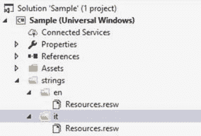

图 32:一个支持两种语言的项目:英语和意大利语

双击 **Resources.resw** 文件，Visual Studio 将打开可视化编辑器，该编辑器将显示一个行和三列的列表:

*   **名称**，是资源标识。
*   **值，**为本地化文本。
*   **注释，**这是一个可选注释，可以更容易地理解资源的用途。

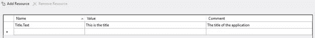

图 33:可视化界面

资源与显示价值的 XAML 控制严格相关:因此，**名称**必须遵循特定的惯例。关键的第一部分是唯一的资源标识符:由您来选择最适合您的场景的东西。比如可以是`Title`这样的标签。键的第二部分由第一部分用一个点隔开，这是我们要用这个资源处理的控件属性的名称。例如，如果我们想在`TextBlock`控件的`Text`属性中显示资源的值，我们应该将其定义为`Title.Text`。

我们可以通过使用名为`x:Uid`的特殊 XAML 属性将资源连接到控件，这是每个 XAML 控件都支持的:我们需要用资源的唯一标识符来设置它，这是键的第一部分(在点之前)。因此，例如，如果我们想要连接资源`Title.Text`以在`TextBlock`控件中显示其值，我们需要以以下方式定义`x:Uid`属性:

```cs
<TextBlock x:Uid="Title" />
```

另一个常见的需求是在代码中使用资源:例如，如果我们需要使用`MessageDialog`类显示弹出消息，我们需要以另一种方式访问资源，因为在 XAML 不能定义对话框。为了实现这个目标，我们必须使用`ResourceLoader`类，它提供了一个名为`GetString()`的方法:作为参数，我们需要传递标识资源的全名。应用程序将根据当前语言自动检索资源。

```cs
 private async void OnShowMessageClicked(object sender, RoutedEventArgs e)
 {
     ResourceLoader loader = new ResourceLoader();
     string resource = loader.GetString("Title/Text");
     MessageDialog dialog = new MessageDialog(resource);
     await dialog.ShowAsync();
  }
```

如您所见，有一个重要的区别需要强调:当您从代码中调用资源时，您需要使用正斜杠(/)而不是点作为键的第一部分和第二部分之间的分隔符。在示例中，为了检索名为`Title.Text`的资源的值，我们将值`Title/Text`作为参数传递。

另一个常见的需求是支持基于用户语言的不同图像，以防它们包含一些嵌入的文本。在这种情况下，我们可以使用一种命名约定，就像我们在管理 Windows 10 支持的不同视觉缩放因子时看到的那样。事实上，我们可以加上一个**。图像名称的 lang-** 后缀，后跟文化代码，使其仅在设备与指定语言一起使用时可见。例如，如果我们有一个名为**logo.png**的图像，并且我们想要有两个版本，一个用于英语，一个用于意大利语，我们可以向项目添加两个文件，一个名为**logo.lang-en.png**，一个名为**logo.lang-it.png**。

这种命名约定对开发人员来说是完全透明的，就像用于处理各种比例因子的约定一样:在 XAML 或代码中，我们只需要使用基本名称(**logo.png**)引用图像，操作系统就会根据语言自动选择合适的名称，如下例所示:

```cs
<Image Source="/Assets/logo.png" />
```

默认应用程序语言在清单文件中设置，由**应用程序**部分中名为**默认语言**的字段设置:当我们没有为当前语言提供特定的资源文件时，将使用默认语言。默认情况下，它是 **en-US** ，保持这种设置是一个很好的方法:因为英语是世界上最广泛使用的语言之一，所以我们的用户很可能会知道它，即使我们不支持他们的母语。

但是，在某些情况下，使用另一种默认语言是有意义的:例如，仅在特定国家分发的本地应用程序(如连接到本地杂志的新闻阅读器应用程序)。在这种情况下，用另一个区域性代码更改**默认语言**值就足够了。

我们还可以翻译应用程序的名称，以防我们希望我们的应用程序有一个基于用户语言的本地化名称。为了实现这个目标，在每个资源文件中添加一个新的字符串就足够了:这一次，我们可以给资源赋予我们喜欢的**名称**，而无需遵循任何约定。

然后打开清单文件，在**应用程序**部分，通过使用`ms-resource` 前缀`:`设置资源名称来更改**显示名称**字段就足够了。例如，如果我们已经创建了一个带有关键字`ApplicationName`的资源，我们应该使用作为字段`ms-resource:ApplicationName`的值。

微软发布了一个名为**多语言应用工具包**的 Visual Studio 扩展，它可以更容易地解决我们在本地化过程中可能面临的一些挑战。以下是它提供的一些功能:

*   当您在主语言的 **Resources.resw** 文件中添加一个新项目时，它能够在其他语言的所有文件中自动创建相同的项目(即使带有空值)。事实上，默认情况下，Visual Studio 不会为您执行此操作，但是您需要注意每次手动添加您创建的所有新条目。
*   它包括一个内置的翻译器功能，利用必应翻译器提供的服务，可以自动将各种资源从一种语言翻译成另一种语言。当然，这并不意味着完全取代人工翻译，但这是一个很好的起点，可以用另一种语言编写工作草案，并了解应用程序的外观和感觉是否在所有语言中都保持一致。例如，用另一种语言翻译的单词可能会变得太短或太长，因此可能会干扰视觉布局。
*   它包括一个字段，用于跟踪每个资源的状态(未翻译、翻译、审阅等)。)，这样你就更容易理解整体翻译是哪个状态了。

您可以从官方网站了解更多信息并下载多语言 App 工具包:[https://developer . Microsoft . com/en-us/windows/developer/多语言-app-toolkit](https://developer.microsoft.com/en-us/windows/develop/multilingual-app-toolkit)

使用像商店这样的集中式分发系统的最大优势之一是，除了帮助您提供更多的可见性和营销机会之外，它还有助于将其货币化，通过提供内置选项来销售应用程序，而不是仅仅免费发布它。我们将在稍后详细讨论提交过程时看到，您有机会在不更改代码的情况下将您的应用货币化:您只需设定价格，用户在从商店下载之前，必须使用与其微软帐户相关联的支付系统之一(贝宝、信用卡、移动运营商账单等)购买它。).

但是，商店提供了许多选项来提高用户购买您的应用程序的机会，例如:

*   **支持试用模式:**如果用户在购买之前有机会试用该 app，他会更倾向于完成购买。
*   **对附加功能的支持**:你可以免费或者低价发布你的应用，最少一套内容，然后在应用内加入可以单独购买的高级功能。

在这两种情况下，利用提交过程中提供的选项已经不够了。事实上，您需要在代码中包含一些更改:例如，如果应用程序以试用方式运行，则隐藏某个功能，或者触发购买附加组件。

在这一点上有一个重要的概念需要强调:Windows 10 周年更新引入了一套全新的 API 来集成应用程序中的货币化功能，这些功能是名为`Windows.Services.Store`的新命名空间的一部分。由于这本书是在周年更新发布后发布的，我们将只讨论这些新的 API。但是，您必须记住，为了利用它们，您的应用程序需要在项目的属性中具有作为目标版本和最小版本的周年更新 SDK 14393。这意味着您的应用程序只能在带有 Windows 10 周年更新及更高版本的设备上运行。

如果因为您的应用程序也需要在以前版本的 Windows 10 上运行(如 11 月的更新)而不能遵守这一要求，您将不得不利用旧的商店应用程序接口，这些接口包含在`Windows.ApplicationModel.Store`命名空间中。但是，我们不会在本章讨论它们:您可以参考官方文档(可在[https://msdn . Microsoft . com/en-us/Windows/uwp/货币化/应用内购买和试用-使用-Windows-application model-store-namespace](https://msdn.microsoft.com/en-us/windows/uwp/monetize/in-app-purchases-and-trials-using-the-windows-applicationmodel-store-namespace))或参考我以前由 Syncfusion 出版的一本书，名为《更简洁的 Windows 8.1》，您可以从[https://www . Syncfusion . com/resources/tech portal/details/ebooks/免费下载](https://www.syncfusion.com/resources/techportal/details/ebooks/morewindows8.1)

`Windows.ApplicationModel.Store`命名空间中包含的 API 实际上与 Windows 8.1 中已经提供的 API 完全相同，因此之前链接的书的第 1 章的内容(关于在 Store 上发布应用)仍然适用于 Universal Windows 平台。

新商店 API 的起点是`StoreContext`类，属于`Windows.Services.Store`命名空间。要获得对对象的引用，需要调用`GetDefault()`方法。从那里，您将能够执行商店支持的所有操作。

下面的代码是如何初始化类的基本示例:

```cs
 private void
  OnCheckTrial(object sender, RoutedEventArgs e)
 {
     StoreContext context = StoreContext.GetDefault();
     //perform operations with the Store
  APIs
  }
```

`StoreContext`类将是我们从现在开始要看到的与商店提供的服务进行交互的所有操作的基础。

如前所述，提供试用版是允许用户在决定购买之前试用我们的应用程序的一种方式。试用模式最有趣的特点是，它允许您避免发布两个不同的应用程序(一个是免费的，功能有限，一个是付费的，所有功能都有)，就像在其他商店经常发生的那样:该功能将直接在单个项目中实现，您将能够在代码中检测应用程序是否作为试用运行。如果用户购买了你的 app，就不用从头再下载；Windows Store 将只下载一个可以解锁所有功能的证书。

管理试用有两种方法:

*   **手动:**商店应用编程接口提供了一种返回`Boolean`的方法，该方法简单地告诉我们应用程序是否在试用模式下运行。有了这些信息，我们就可以用我们喜欢的方式来实现测试:我们可以屏蔽一些功能，在每次应用程序启动时显示弹出消息，显示一些广告，等等。
*   **时间试用:**当你在商店提交申请后，你就可以设置一个试用的截止日期:一旦试用期结束，应用就会自动被屏蔽。这个功能是由 Windows 直接处理的:如果用户试图在应用程序过期后打开它，它将不会启动。相反，将出现一个弹出窗口，通知用户试用已过期，并允许他直接去商店购买该应用程序。然而，我们仍然可以在代码中控制这个特性:例如，我们可以决定在试用期间禁用某个特性，即使它是基于时间的。或者，我们可以处理试用状态在应用程序运行时发生变化的事实(因为过期或用户已购买)。

处理试用相当简单:一旦有了`StoreContext`对象，只需要调用`GetAppLicenseAsync()`方法即可。结果你会得到一个类型为`StoreAppLicense`的对象，它包括一个名为`IsTrial`的属性:这是一个简单的`bool`，你可以用它来了解这个应用程序是否在试运行。

以下示例模拟了一个应用程序，其中保存功能(与放置在 XAML 页面中的`Button`控件相关联)仅在已购买该应用程序时才启用:

```cs
 private async void OnCheckTrial(object sender, RoutedEventArgs e)
 {
     StoreContext context = StoreContext.GetDefault();
     StoreAppLicense license = await context.GetAppLicenseAsync();
     if (license.IsTrial)
     {

  SaveButton.Visibility = Visibility.Collapsed;
     }
     else
     {

  SaveButton.Visibility = Visibility.Visible;
     }
  }
```

如果试用是基于时间的，您还可以选择检查到期日期，例如，您希望在应用程序中显示一条消息，告诉用户在应用程序到期之前他还有多少时间可以试用:

```cs
 private async void OnCheckTrial(object sender, RoutedEventArgs e)
 {
     StoreContext context = StoreContext.GetDefault();
     StoreAppLicense license = await context.GetAppLicenseAsync();
     if (license.IsTrial)
     {

  ExpirationDate.Text = $"The
  app is running as trial and it will expire on {license.ExpirationDate}";
     }
  }
```

如果试用状态在应用程序运行时发生变化(或者是因为过期，或者是因为用户已经购买)，会发生什么？

你有两个选择:

*   什么都不做，让用户继续使用应用程序，直到他关闭它。然后，当他将重新打开它时，Windows 会以适当的方式处理它(如果试用结束，则显示过期的弹出窗口，或者如果他已经购买，则正常启动它)。
*   做一些事情，比如显示一条消息并关闭应用程序，或者立即启用所有功能。在这种情况下，您可以利用名为`OffliceLicenseChanged`的`StoreContext`对象提供的事件，如下例所示:

```cs
 private async void Context_OfflineLicensesChanged(StoreContext sender, object args)
 {
     StoreAppLicense license = await context.GetAppLicenseAsync();
     if (license.IsActive && !license.IsTrial)
     {
         //the user has purchased the app
     }
     else
     {
         //the trial has expired
     }
  }
```

感谢`StoreAppLicense`对象的`IsActive`属性，我们可以发现许可证是否仍然有效。

购买应用程序最简单的方法是直接从商店购买。当他们访问专用页面时，他们可以选择下载试用版(如果有)或购买试用版。但是，您也可以从应用程序中触发购买过程。这样，用户将永远不必离开您的应用程序来购买它。下面的代码显示了如何实现这个任务:

```cs
 private async void OnStartPurchaseProcess(object sender, RoutedEventArgs e)
 {
     StoreContext context = StoreContext.GetDefault();
     StoreProductResult  result = await context.GetStoreProductForCurrentAppAsync();
     if (result.ExtendedError == null)
     {
         StorePurchaseResult purchase = await result.Product.RequestPurchaseAsync();
         if (purchase.ExtendedError == null)
         {
             switch (purchase.Status)
             {
                 case StorePurchaseStatus.Succeeded:
                     //handle the OfflineLicenseChanged
  event
                     break;
                 case StorePurchaseStatus.AlreadyPurchased:
                     break;
                 case StorePurchaseStatus.NotPurchased:
                     break;
                 case StorePurchaseStatus.NetworkError:
                     break;
                 case StorePurchaseStatus.ServerError:
                     break;
                 default:
                     break;
             }
         }
      }
}
```

像往常一样，起点是`StoreContext`对象，它提供了一个名为`GetStoreProductForCurrentAppAsync()`的方法来检索与应用程序本身相关联的产品(我们将在后面看到，事实上，附加组件也被认为是产品)。如果没有错误(我们利用`ExtendedError`房产来了解是否出了问题)，我们可以访问`Product`房产，该房产提供了一种启动购买过程的方法，称为`RequestPurchaseAsync()`。

从现在开始，商店将自动处理一切:它会用一个带有总价的弹出窗口提示用户，允许他选择他喜欢的支付方式，一旦操作完成，我们会得到一个带有结果的`StorePurchaseResult`对象，该对象将存储在`Status`属性中。

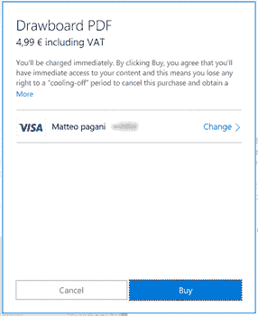

图 34:由窗口商店处理的购买过程

基于它的值(它是类型`StorePurchaseStatus`的枚举，涵盖了不同的场景)，我们可以以最适合我们应用程序的方式行事。

我唯一想强调的状态是`Succeded`。这意味着购买已经成功完成，因此应用程序不再作为试用版运行。因此，我们现在可以决定我们要应用哪种逻辑，如前一段所述:

*   我们可以让事情保持原样，简单地说就是用户，当他关闭并再次打开应用程序时，他将开始使用完整版本，他会发现所有以前锁定的功能现在都可用。
*   我们可以利用`StoreContext`类的`OfflineLicenseChanged`事件实时检测到许可证的状态发生了变化，这样我们就可以立即解锁所有功能，而不需要用户关闭并重新启动应用。

附加组件，也称为应用内产品(简称 IAPs)，是可以在应用内直接购买的数字产品。这是另一种将你的应用程序货币化的有效方法:你可以决定发布一个包含一组基本功能的免费应用程序，而不是提供基于时间或基于功能的试用，这些功能可以在以后通过从应用程序本身购买额外内容来扩展。有许多利用这种场景的应用程序示例:。例如，游戏可以提供一组基本级别，然后在用户完成所有级别后，提供购买额外级别的机会；或者，照片编辑应用程序可以包含一组内置的照片滤镜，然后提供购买新滤镜的机会。

视窗商店提供三种类型的附加组件:

1.  **耐用品:**这些附加组件一旦购买，就会被持久化，通常只能购买一次。但是，耐用的附件可以配置为在特定的日期和时间过期:在这种情况下，可以再次购买，但只能在过期后购买。
2.  **开发商管理的耗材:**耗材是可以多次购买的产品。一旦用户购买了它，他将能够继续使用该产品，直到他完全消费完它。之后，他将能够再次购买它。这种方法被游戏广泛使用，例如购买数字货币来购买应用程序内部的附加内容。这种消耗品必须由开发人员手动管理:这意味着，在商店中，您只需定义它是一种消耗品，然后由开发人员决定它的使用何时在代码中实现。例如，如果可消费产品允许用户购买 1000 个数字硬币，则每次用户消费其中一些硬币时，将由开发者来保持计数，并且一旦他剩下 0 个硬币，则报告该产品满足，以便用户能够再次购买。
3.  **商店管理的消耗品**:这些消耗品的工作方式与以前的相同，只是商店会自动保留剩余物品数量的计数。如果我们像以前一样重复使用同一个样本，我们可以定义一个包含 1000 个数字硬币的产品，并直接在开发中心指定数量:然后商店会自动记录数量，并在没有硬币时向开发人员报告。

加载项不是在代码中定义的，而是在开发中心中，以类似的方式定义应用程序的提交:设置名称、价格、描述、可见性等。然后，由于有了`StoreContext`类，您将能够获得所有可用附件的列表，以识别哪些附件已经被购买，将某个消耗品报告为已完成，等等。在接下来的段落中，我们将看到最常见的场景。

#### 正在检索可用加载项的列表

由于`SyncContext`类提供的`GetAssociatedStoreProductsAsync()`方法，获得您在商店中定义的附件列表是一个简单的操作。该应用程序需要一组字符串作为参数，这些字符串带有一组特殊的字符串值，作为过滤器:您可以选择检索所有可用的产品，或者只检索属于我们在上一段中看到的类别之一的产品。

三个特殊值是:

*   `Durable`
*   `Consumable`
*   `UnmanagedConsumable`

以下示例代码检索所有产品，无论它们是耐用品还是消耗品(由开发人员或商店管理):

```cs
 private async void GetProducts(object sender, RoutedEventArgs e)
 {
     StoreContext context = StoreContext.GetDefault();
     string[] productKinds = { "Durable", "Consumable", "UnmanagedConsumable" };
     StoreProductQueryResult result = await context.GetAssociatedStoreProductsAsync(productKinds);
     ObservableCollection<AddOn> addOns = new ObservableCollection<AddOn>();
     if (result.ExtendedError == null)
     {
         foreach (var item in
  result.Products)
         {
             AddOn addOn = new AddOn
             {
                 StoreId
  = item.Value.StoreId,
                 Title =
  item.Value.Title,
                 Price =
  item.Value.Price.FormattedPrice
             };

  addOns.Add(addOn);
         }

  Products.ItemsSource = addOns;
     }
  }
```

当你调用`SyncContext`类的`GetAssociatedStoreProductAsync()`方法，将过滤器作为参数传递时，你会得到一个`StoreProductQueryResult`对象，它包含一个名为`Products`的属性。这是一种特殊的集合(T4)，包含您在商店中定义的所有附加组件，通过其唯一的密钥(也称为`StoreId`)进行识别。

在前面的示例中，由于我们不需要向用户显示关于某个插件的所有信息，而只需要显示它的 id、名称和价格，因此我创建了一个更简单的类`AddOn`，该类使用从`Products`集合中检索到的信息进行填充:

```cs
 public class AddOn
 {
     public string StoreId { get; set; }
     public string Title { get; set; }
     public string Price { get; set; }
  }
```

最终`AddOn`项的集合被定义为一个`ListView`控件的`ItemsSource`:用户会在主页面看到每个价格的可用产品列表。

#### 购买附件

有两种方法可以开始购买附件的过程。如果我们扩展前面的场景，我们可以通过调用`StoreContext`类的`RequestPurchaseAsync`()方法来实现，将产品的标识符作为参数传递。因为在前面的场景中，我们已经将该信息存储在`AddOn`类的`StoreId`属性中，所以我们可以在`ListView`控件的`ItemClick`事件中利用该信息，当用户点击或点击列表中的一个产品时触发该事件:

```cs
 private async void Products_ItemClick(object sender, ItemClickEventArgs e)
 {
     AddOn addOn = e.ClickedItem as AddOn;
     StoreContext context = StoreContext.GetDefault();
     StorePurchaseResult result = await context.RequestPurchaseAsync(addOn.StoreId);
     string message = string.Empty;
     if (result.Status == StorePurchaseStatus.Succeeded)
     {
         message = "Thanks for your
  purchase!";
     }
     else
     {
         message = "The purchase process has
  been canceled";
     }

     MessageDialog dialog = new MessageDialog(message);
     await dialog.ShowAsync();
  }
```

该代码类似于我们看到的触发应用程序本身购买的代码:当它被调用时，商店弹出窗口将直接显示在应用程序中，以处理购买过程。

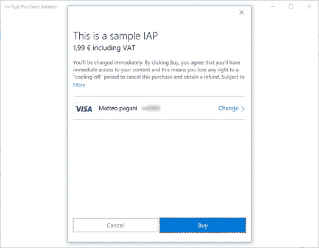

图 35:应用程序中的附加购买过程

当操作完成后，我们得到一个`StorePurchaseResult`对象，这个`Status`属性将帮助我们了解购买是否已经成功完成，并根据我们的场景采取相应的行动(例如，解锁一个新功能)。

如果我们不知道`StoreId`但是我们可以直接访问`StoreProduct`对象，我们可以通过调用对象本身暴露的`RequestPurchaseAsync`()方法来达到同样的目的。以下示例显示了我们如何强制应用程序触发购买第一个可用的附加组件:

```cs
 private async void GetProducts(object sender, RoutedEventArgs e)
 {
     StoreContext context = StoreContext.GetDefault();
     string[] productKinds = { "Durable", "Consumable", "UnmanagedConsumable" };
     StoreProductQueryResult result = await context.GetAssociatedStoreProductsAsync(productKinds);
     if (result.ExtendedError == null)
     {
         StorePurchaseResult purchaseResult  = await
  result.Products.FirstOrDefault().Value.RequestPurchaseAsync();
         string message = string.Empty;
         if (purchaseResult.Status == StorePurchaseStatus.Succeeded)
         {
             message = "Thanks for your
  purchase!";
         }
         else
         {
             message = "The purchase process has
  been canceled";
         }

         MessageDialog dialog = new MessageDialog(message);
         await dialog.ShowAsync();
     }
  }
```

#### 处理消费品

如果一旦我们购买了产品，我们会尝试使用相同的代码重复前面的过程，这次返回的`Status`将不是`Succeeded`而是`AlreadyPurchased`。原因是，到目前为止，我们正在模拟一个持久的附加组件:一旦它被购买，它将一直属于用户，直到它过期。

然而，我们已经提到，可消费产品以不同的方式工作:在某些时候，需要告诉商店它已经被消费，因此，用户可以再次购买它。

要执行此任务，我们可以使用`StoreContext`类的`ReportConsumableFulfillmentAsync()`方法，该方法需要三个参数:

*   加载项的唯一标识符。
*   已经购买了多少附加组件。
*   一个 GUID，作为事务的唯一标识符。该 id 的目的是与`StoreId`配对，这样，如果应用程序能够处理响应或无法处理响应(例如，由于网络错误)，商店可以独立了解购买操作的状态。这样的话，如果你想用同样的`StoreId`和同样的 GUID 再次调用`ReportConsumableFullfilmentAsync()`方法，你会得到一个`Status`等于`Successful`的结果(就像如果是第一次购买一样)，这样你的应用就可以正确的解锁购买的功能。但是，由于操作的 GUID 是相同的，用户将不会再次被收取产品的价格，因为商店将能够理解产品已经被成功购买。只是应用程序没有机会以适当的方式处理结果。

一旦我们报告该附件已完成，用户将能够再次购买:如果我们调用`RequestPurchaseAsync()`方法，我们将不再获得`AlreadyPurchased`状态，但商店将启动新的购买过程。

下面是一个示例代码，它模拟了一旦用户在列表中选择了一个插件，它就被报告为已实现。

```cs
 private async void Products_ItemClick(object sender, ItemClickEventArgs e)
 {
     AddOn addOn = e.ClickedItem as AddOn;
     StoreContext context = StoreContext.GetDefault();
     string storeId = addOn.StoreId;
     uint quantity = 1;
     Guid trackingId = Guid.NewGuid();
     StoreConsumableResult result = await context.ReportConsumableFulfillmentAsync(storeId,
  quantity, trackingId);
     string message = string.Empty;
     if (result.ExtendedError == null)
     {
         if (result.Status == StoreConsumableStatus.Succeeded)
         {
             message = "The product has been
  successfully used. You can buy it again if you want";
         }
         else if (result.Status == StoreConsumableStatus.InsufficentQuantity)
         {
             message = "Sorry, but you don't have
  enough quantity, buy the product again first";
         }
     }
  }
```

代码相当直白:我只强调有一个特殊状态可以通过`ReportConsumableFulfillmentAsync()`方法返回，就是`InsufficientQuantity`:表示用户正在尝试消费一个已经完全消费完的产品，需要先重新购买。

开发者处理的消费品和商店处理的消费品有什么不同？

代码总是相同的，但是:

1.  在第一种情况下，我们总是需要将值 1 作为数量(第二个`ReportConsumableFullfilmentAsync()`方法的参数)传递。相反，在第二种情况下，我们可以传递已经消费的项目的真实数量。
2.  在第二种情况下，我们可以使用名为`GetConsumableBalanceRemainingAsync()`的方法，将产品的唯一标识符作为参数传递，以获取在用户不得不再次购买产品之前还剩多少物品。下面的示例代码显示了如何通过`BalanceRemaining`属性来检索这些信息，该属性包含在方法的结果中。

```cs
 private async void Products_ItemClick(object sender, ItemClickEventArgs e)
 {
     AddOn addOn = e.ClickedItem as AddOn;
     StoreContext context = StoreContext.GetDefault();
     string storeId = addOn.StoreId;
     StoreConsumableResult result = await context.GetConsumableBalanceRemainingAsync(storeId);
     if (result.ExtendedError == null)
     {
         string message = $"The remaining balance of the product is {result.BalanceRemaining}";
         MessageDialog dialog = new MessageDialog(message);
         await dialog.ShowAsync();
     }
  }
```

#### 检查产品状态

当应用程序启动时，检查所有可用插件的状态非常重要，这样我们就可以了解是否需要启用附加功能。为了获得这些信息，我们需要使用与本节开始时相同的方法来获得应用程序的许可:由`StoreContext`对象提供的`GetAppLicenceAsync()`方法。

如果应用程序支持加载项，并且用户已经购买了一个或多个，我们将在`AddOnLicenses`集合中找到它们。对于它们中的每一个，我们可以利用`IsActive`属性来了解附加组件是否仍然活跃。

下面的代码只是负责使用这个集合来检索所有购买的附加组件，并通过一个对话框向用户显示每个附加组件的状态:

```cs
 private async void Products_ItemClick(object sender, ItemClickEventArgs e)
 {
     AddOn addOn = e.ClickedItem as AddOn;
     StoreContext context = StoreContext.GetDefault();
     string storeId = addOn.StoreId;
     StoreConsumableResult result = await context.GetConsumableBalanceRemainingAsync(storeId);
     if (result.ExtendedError == null)
     {
         string message = $"The remaining balance of the product is {result.BalanceRemaining}";
         MessageDialog dialog = new MessageDialog(message);
         await dialog.ShowAsync();
     }
  }
```

#### 测试货币化特性

与之前版本的货币化 API 不同，新的 API 不包括本地模拟器来测试实现而不发布你的应用。但是，有一个简单的方法可以测试代码中的更改，而不必每次都发布更新。以下是要遵循的步骤:

1.  创建应用程序的第一个版本，甚至是基本版本，并将其与您在商店中保留的名称相关联。要执行此操作，右键单击项目，选择**商店- >将应用程序与商店关联**并保留一个新名称，或者选择一个您过去已经在开发中心保留的名称。这个过程将确保所有关于应用程序身份的信息(如名称、应用程序身份、发布者等。)将被开发中心分配的真实值覆盖，而不是 Visual Studio 生成的测试值。
2.  按照我们将在本章后面看到的步骤，在商店上发布应用程序。该应用不一定要公开；如果你还在测试阶段，它也可以被隐藏。
3.  一旦应用程序获得批准和认证，请确保至少从商店下载一次:这样，Windows 将下载并关联一个有效的许可证。
4.  现在，由于商店上的版本将与您在本地拥有的版本具有相同的标识，并且您拥有该版本的有效许可证，因此您将能够直接从 Visual Studio 测试商店应用编程接口:`StoreContext`类的`GetDefault()`方法将返回一个真实的对象，这将允许您枚举真实的附加组件、启动购买过程、实现可消费的附加组件等。与您在存储上发布的版本相比，您还能够将更改应用于您的代码，并且应用编程接口将继续工作并报告真实值，而无需每次您想要测试代码更改时都发布更新。

在本节中，我们将看到在商店提交申请的过程概述。但是，我们不会看到每个步骤的每个细节，因为开发中心独立于 Windows 10 SDK:因此，提交过程中的新功能和更改由 Windows 10 生命周期独立发布。此外，你会在这一部分找到的图像纯粹是指示性的，它们指的是这本书已经写好的时期；当这本书出版时，它们不一定是一样的。

要发布应用程序，您需要将自己注册为应用程序开发人员，这是一个单一帐户，允许您为整个微软生态系统提交应用程序和加载项，因此不仅是 Windows Store 应用程序，还包括 Office Store 或 Azure Marketplace 上的 Office 加载项。个人开发者账户的价格是 19 美元，公司是 99 美元:这是一个终身订阅，你只需要支付一次。但是，有一个例外:如果您拥有 MSDN 套餐，除了可用的优惠之外，您还可以找到免费注册的代币。

你可以在[https://developer.microsoft.com/en-us/store/register](https://developer.microsoft.com/en-us/store/register)启动创建开发者账户的程序:系统会根据你想开的账户类型，询问你或你公司的所有信息。程序是一样的，你可以使用贝宝账户或信用卡支付，唯一的区别是:

*   如果是个人账户，付款成功后会立即激活。
*   如果是公司账户，激活账户需要一点时间:事实上，微软的合作伙伴会联系你，要求你提供一系列信息，以证明公司确实存在，并且法律允许你代表公司运营。

帐户准备就绪后，如果您想发布付费应用程序，有两个重要部分需要完成，即支出和税收:

*   第一部分需要设置您希望微软如何支付您的费用，以防您决定将您的应用程序货币化(通过直接销售它或通过附加组件，或通过包含广告)。我们可以设立一个银行账户或贝宝账户。
*   第二部分是正确管理税收支出所必需的，这一点很重要，尤其是如果你住在美国以外的地方。通过填写正确的表格，事实上，你将能够避免你的收入被美国和你自己的国家征税。如果有疑问，我建议您联系业务顾问来完成这一部分，因为微软不允许提供法律建议。

登录到开发中心后，您就可以访问主控制面板，这是快速查看应用程序状态的一种方式，如下图所示:

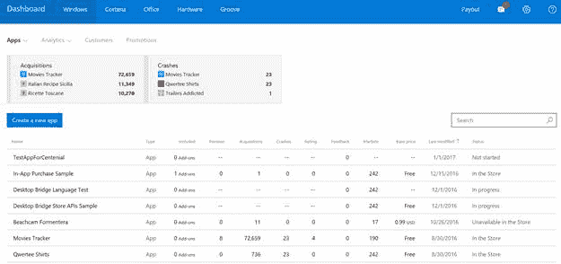

图 36:开发中心仪表板

你可以很快看到哪些是你下载量最大的应用，哪些遇到了一些问题，哪些是它们的状态(商店直播、待认证、提交中等)。).

您也可以选择通过按下**创建新应用程序**按钮来开始新的提交。然而，只有当你从头开始时，这一步才是必需的:如果你已经为你的应用程序保留了一个名称，并在 Visual Studio 中将其关联(使用**商店- >将应用程序与商店关联**选项，我们在讨论测试货币化功能时已经看到)，你会在列表中找到它，状态为**未启动**，因此如果你想开始提交，你只需点击它。

无论你决定为你的应用保留一个名字是哪一个过程(这个名字在商店中必须是唯一的，两个同名的应用不能存在)；当您在列表中单击它时，您可以访问它的详细信息页面，该页面可用于启动真正的提交过程，并执行与应用程序相关的所有操作(如创建加载项、查看下载、购买和崩溃的统计数据、检索访问推送通知所需的身份或凭据信息等)。).

下图显示了在商店中尚未发布任何版本时您将看到的示例:

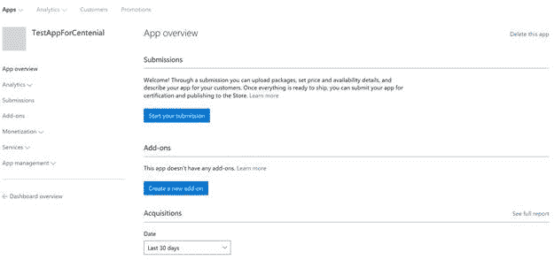

图 37:开发中心应用程序的详细页面

如您所见，在提交部分，您会发现一个名为**的按钮开始您的提交**，这是您启动发布过程所需的按钮。

提交过程由六个步骤组成，在接下来的部分中，我们将看到所有步骤的概述。

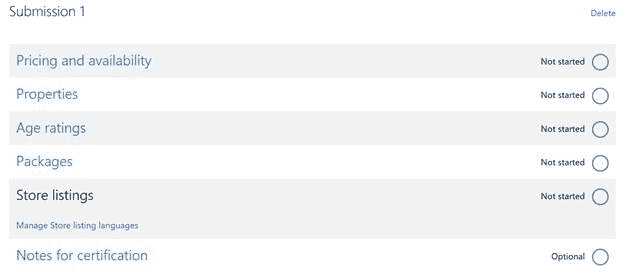

图 38:在商店提交申请需要遵循的步骤

#### 定价和可用性

在本节中，您可以定义如何营销您的应用程序:如果您想免费发布它或以一定价格出售它，如果您想启用试用，如果您想在 Windows Store 支持的每个国家或仅在其中的一部分国家出售它(例如，阅读西班牙报纸的应用程序可能仅在西班牙语国家出售)。

您可以配置的最重要选项有:

*   **基价**
*   **试用模式:**就像我们在本章前面看到的一样，您可以决定使用**试用永不过期**选项(在这种情况下，将由您来利用商店 API 禁用某些功能，直到用户购买完整版本)或定时选项之一(从 1 天到 30 天)。在第二种情况下，Windows 将能够自动处理试用体验，并防止用户在应用程序过期后再次启动应用程序。
*   **销售**:得益于此选项，您可以决定为客户提供促销活动，并在有限的时间内以折扣价销售该应用。商店会自动为您更改价格，您只需选择新的价格、销售的开始日期和结束日期。例如，您可以决定在第一周以折扣价推出该应用程序，或者在特殊场合(如圣诞节)进行特价销售。
*   **分发和可见性**:商店提供多个选项来分发应用程序。由于本书主要关注 Windows 10，我们将只详细介绍通用 Windows 平台应用程序支持的应用程序，我不会描述仅由以前版本的 Windows 支持的应用程序。默认选项是**在商店**上提供该应用程序，这意味着该应用程序将是公共的，每个用户都可以搜索、下载和购买(当然，始终尊重您选择出售它的市场)。但是，对于测试/有限分发场景，您还有另外两个有用的选项:

*   **在商店**隐藏该应用:同样在这种情况下，该应用将可供用户下载和购买，但前提是他们知道直接链接(您可以在开发中心的**应用管理- >应用标识**部分找到)。这是一个直接链接的例子:[https://www.microsoft.com/store/apps/9wzdncrfhvqm](https://www.microsoft.com/store/apps/9wzdncrfhvqm)。用户将无法搜索该应用程序，无论是通过它的名称还是它的一个关键词。
*   **隐藏这个应用，防止被收购:**这是最好的方法，以防你想做一些内部测试，或者在应用上线前，将应用的早期版本分发给博主和评论者。选择此选项后，普通用户将无法找到此应用程序，即使他知道直接链接。他下载它的唯一选择是接收一个促销代码，该代码只能由开发人员生成和共享。

*   **发布日期**:如果 app 通过认证流程，你有三个选择:

*   自动发布应用。
*   手动发布应用程序:在您手动按下发布按钮之前，它将保持“待机”状态(不可见，不可搜索，也不可由用户下载)。
*   一旦确定了具体的日期和时间。当然，该选项需要考虑认证时间(在某些情况下，可能需要 2-3 天)。

后两个选项通常在您计划一些与应用程序发布相关的营销活动时使用(如社交营销活动、网站上线等)。)并且您希望将它们与应用程序在商店中可见的日期同步。

#### 性能

这个部分可以用来描述你的应用程序的特性:它属于哪一类；如果我们希望应用程序的内容自动包含在 OneDrive 备份中；如果应用程序有一些特殊的硬件要求(比如它只与触摸屏一起工作，或者它需要近场通信或蓝牙传感器，或者它可能是一个游戏，因此它需要最少的内存、CPU 功率和视频内存)。

#### 年龄等级

这个部分会围绕你的申请内容问你很多问题，比如是否包含暴力、赌博、粗话或图片等。这些问题是由国际年龄评级联盟(IARC)提出的，该联盟是一个法律实体，它发布一份电子文档来证明您的应用程序的年龄评级。

这一评级是法律要求的，通常会影响游戏，因为它是更有可能包含不适合儿童的内容的应用类别。分配给您的应用程序的年龄等级会影响哪些用户能够下载它:例如，如果客户的微软帐户连接到 14 岁的用户，他将无法下载年龄等级为 18+的应用程序/游戏。

#### 包装

在本节中，您必须上传应用程序的包。要创建它，您需要回到 Visual Studio，右键单击您的项目并选择**存储- >创建应用程序包**。在第一个问题中，选择选项**是**，这意味着您想要为商店创建一个包(如果您回答**否**，您将获得一个仅对侧面加载有效的包，这意味着在另一个设备上手动安装应用程序)。

第二步是选择你想和你的应用关联的名字:如果你之前已经做过了，你可以继续，保留你已经保留的同一个名字。

然后是最重要的应用:包生成。

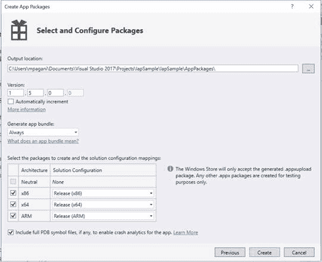

图 39:商店的包创建过程

除了输出位置和版本号(您可以选择手动定义或在每次构建时自动增加)，唯一的要求是您要创建的包的版本必须高于商店中当前可用的版本，以防您发布更新)，最重要的部分是应用程序包生成。

默认情况下，选项**生成应用包**设置为**始终**。什么是捆绑包？它是包的一个特殊版本，比传统的包有更大的尺寸，但它被分成多个不同的部分:一个核心包，每个设备都有基本的可执行文件和 dll，还有多个包，它们只包含特定的资源(比如特定比例因子的图像或特定语言的本地化文件)。

您可以很容易地看到应用程序作为捆绑分发的情况，因为如果您更改了运行应用程序的设备的配置(如 Windows 语言或设备的缩放因子)，商店将触发丢失的附加资源的下载。

捆绑方法在 Windows 10 中变得更加有用，主要有两个原因:

*   同一个应用程序可以在各种设备上运行。将软件包作为一个捆绑包发布将避免用户在低分辨率手机上下载应用程序时也将获得我们提供的支持 Xbox One 或大屏幕的 4K 图像。
*   由于。NET Native 编译我们在本系列的第一本书中已经谈到，一个 Universal Windows Platform app 不能再针对多种架构进行交叉编译，使用旧的 **Any CPU** 配置，但是对于 Windows 10 支持的每种架构，你都必须有一个特定的包。由于有了这个捆绑包，您将获得一个包含所有三个版本(x86、x64 和 ARM)的软件包，但是用户将只自动下载特定于他安装应用程序的设备的软件包。

在大多数情况下，使用捆绑包是最好的选择，因为它有很多优点，并且它减少了用户下载的包的大小。然而，在一些特殊的情况下可能会有一些陷阱。例如，如果您想在您的应用程序中提供一个选项，让用户选择他喜欢的语言(甚至是与设备上当前配置的语言不同的语言)，捆绑方法不会很好地工作，因为不同于设备语言的资源文件将会丢失。

当您做出这种选择时，重要的是要记住，一旦捆绑包在商店上发布，就没有办法回头:您不能稍后改变主意，恢复到标准的包发布。

无论你选择什么，一定要为每个架构选择发布模式:这个编译模式也会触发。NET Native，这是在存储中接受包的一个要求。一旦点击**创建**按钮，Visual Studio 将开始生成包(或三个不同的包)。这次的编译操作需要一段时间，根据应用程序的复杂性，与标准的调试编译相比，since.NET 本地编译需要更多的时间来完成。

操作完成后，您将在向导期间选择的文件夹中找到一个文件，该文件带有。appxupload 扩展。默认文件夹叫做 **AppPackages** ，它存储在项目的文件夹中。生成的文件名将具有以下命名:

*app _ 版本号 _ architecture _ bundle . appxupload 的名称*

以下是作为包生成的包的生成文件示例，它支持所有现有的体系结构:

*IAP sample _ 1 . 2 . 0 . 0 _ x86 _ x64 _ arm _ bundle . appxupload*

认证过程的输出窗口还将包含一个标记为**的按钮启动 Windows 应用程序认证工具包:**该操作将通过一个名为 WACK 的工具处理应用程序，该工具将执行与开发中心相同的初步技术测试。这个工具非常有助于大致了解认证过程的结果:如果您失败了，这也意味着开发中心将无法通过初步认证，因此您的应用程序将被拒绝。该工具将为您提供一个报告文件，并在出现错误的情况下，提供解决问题所需的所有细节。

一旦您有了包，您可以简单地将其拖放到页面中:开发中心将开始上传过程，然后对包进行分析，以了解一切是否正确(清单中没有受限的功能，所有现有的资产都是有效的，等等)。).

默认情况下，每个 Windows 10 设备都可以使用该软件包。如果您想要限制分发(例如，因为您的应用程序仅针对桌面或移动进行了优化)，您可以使用页面的第二部分手动选择您想要支持的平台。

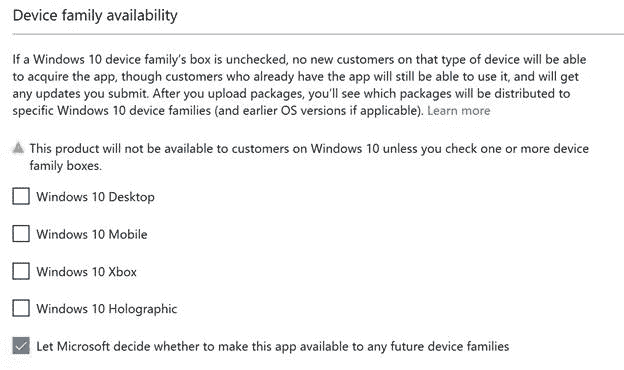

图 40:将 Windows 10 应用程序的可用性限制在一组特定设备的选项

#### 商店列表

从营销角度来看，商店列表页面是最重要的页面。事实上，我们可以使用它来定义将在商店中显示的所有信息，这些信息应该会吸引用户下载我们的应用程序。这些信息包括:

*   描述。
*   发行说明，以防更新。
*   每个支持的设备系列最多 9 张截图。
*   一些促销艺术品，商店团队将使用这些艺术品，以防他们决定在首页突出显示您的申请。
*   一组关键词，增加用户找到你的应用程序的机会，即使他们不知道它的确切标题。
*   支持联系邮件、隐私政策(如果需要)等。

为了获得最佳结果，强烈建议为应用程序支持的每种语言提供不同的信息集。开发中心将自动理解(基于您项目的结构)支持哪些语言，并建议您填写每个语言的前面字段。

#### 认证注意事项

这是唯一的可选部分，如果申请被选中进行手动认证，这是必需的。在某些情况下，应用程序不能开箱即用地进行测试，但是它需要一组预要求。例如，如果您的应用程序连接到后端服务，该服务在使用前需要注册，您应该为测试人员提供一组凭据，以便他可以立即尝试该应用程序。

#### 提交申请

一旦您成功完成所有步骤，**提交到商店**按钮将被启用，您将有机会有效地提交应用进行认证。现在你必须等待认证的结果。有两种认证过程:

*   **自动认证**:这个过程是通过一套自动测试来实现的，检查你的 app 是否满足所有的技术要求(启动时不崩溃，不尝试使用不允许的 API，在指定的时间内暂停和恢复等。).通常需要几个小时才能完成。
*   **手动认证**:这个过程是由手动测试人员完成的，检查 app 的用户界面是否清晰一致，是否存在未处理的异常，是否不包含店铺禁止的内容(如过分亵渎或暴力、种族主义等)。).可能需要 5 个工作日才能完成。

大多数应用程序都是通过自动认证来处理的，这意味着通常一个应用程序会在几个小时内完成认证过程。然后，商店服务器需要 24 到 48 小时进行同步，并且您的应用程序在商店上完全可见。但是，在任何时候，商店团队都有机会选择您的应用程序进行更深入的测试，如果他们发现任何问题，他们会回复您，要求您修复它们，否则他们将取消发布该应用程序。

相反，一些应用程序可以随机挑选进行手动认证:在这种情况下，认证过程将需要更长的时间才能完成。被选中进行手动认证的机会也与开发人员的“声誉”有关:如果在过去，开发人员经常发布有问题的应用程序或更新，那么他发布的新应用程序或更新更有可能被手动处理。

提交申请后，您将能够在仪表板中跟踪该应用的状态以及该应用处于认证的哪个不同阶段。但是，一旦认证完成，您将收到一封邮件，无论是成功还是失败。

#### 更新应用程序

一旦您提交了至少一个版本的应用程序，开始提交按钮将消失，仪表板中的**提交部分将显示上次提交的状态。**

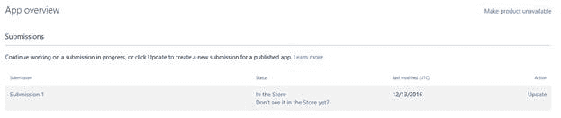

图 41:一旦提交在商店中运行，应用程序的页面就会出现在开发中心

如果你想发布更新，只需按下右侧的**更新**按钮:你必须按照前面描述的相同步骤进行，不同的是，这一次，每个部分都已经填充了你在上次提交时指定的信息。

重要的是要理解，更新过程并不意味着只有当你想要发布新版本的应用程序时:事实上，你并没有被迫在 **Packages** 部分上传新的包。更新过程也可用于更改应用程序的价格、开始新的销售、创建新的附件或简单地编辑商店中的描述。在这些情况下，认证过程几乎是即时的，因为没有新的测试包，无论是自动的还是手动的。

### 插件

在本章前面，我们已经看到了如何使用商店应用编程接口来处理附加组件。然而，正如段落中提到的，加载项是在开发中心定义的:您可以从**加载项**部分创建它们，这要归功于一个名为**的按钮创建新的加载项**。

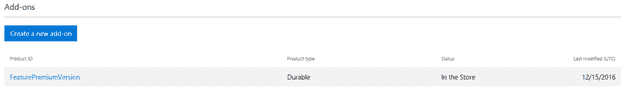

图 42:开发中心中创建新插件的部分

创建新加载项的过程类似于发布新应用程序的过程:一旦您为加载项及其类型(耐用、用户处理的消耗品或商店处理的消耗品)分配了唯一的 id，您将需要定义其定价和可用性以及商店的信息(如描述、关键字等)。).

重要的是，不要将产品标识(这是您分配的唯一值，以便于您在开发中心识别附加组件)与`StoreId`(这是商店应用编程接口利用的自动生成的标识符)混淆。您可以在下图中看到一个示例:

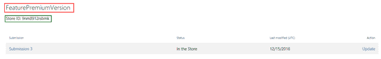

图 43:附加产品的细节

红色框中突出显示的值是开发人员分配的标识符，而绿色突出显示的值是商店分配的标识符，我们在本章中学习使用的商店应用编程接口将使用该标识符。

一旦你在商店上公开提交，你可以决定创建一个或多个飞行环，向部分用户发布你的应用程序的早期版本，在公开发布之前获得反馈并发现潜在的问题。

您可以创建多个环，每个环将包含一个用户列表，由他们的微软帐户标识，该列表需要与他们用来注册 Windows 10 设备的列表相匹配。当您发布应用程序的新版本时，您可以决定只对特定的环可用。

当用户下载一个启用了一个或多个飞行铃声的应用程序时会发生什么？

*   如果他不是任何戒指的一部分，他只会得到公开版本。
*   如果他是一个戒指的一部分，他会得到你在戒指里发布的测试版本。

拥有多个环的目的是为了处理不同的测试场景:例如，您可以拥有一个 alpha 环(在那里您发布具有更多新特性但可能有更多问题的夜间构建)和一个 beta 环(在那里您发布具有较少新特性但更稳定的版本)。在任何时间点，你都有机会将一个版本从一个环移动到另一个环:例如，一旦你决定测试版足够稳定，而不是开始一个新的发布过程，你可以简单地将包从测试环移动到公共环，这样每个用户都会得到它。

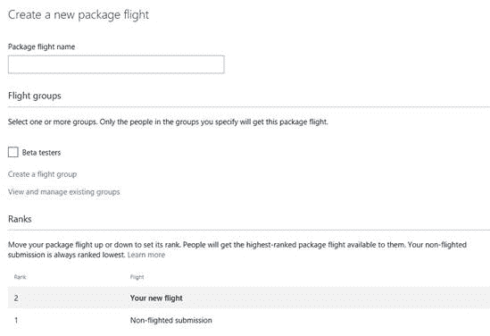

图 44:创建新包裹航班的选项

从上图可以看出，航班有**等级的概念。**排名号决定了用户将获得哪个版本:人们将下载，事实上，排名最高的包可供他们使用。例如，如果你的一个用户包含在两个环中(等级为 2 的 beta 用户和等级为 3 的 alpha 用户)，他将获得包含在 alpha 环中的包，因为它是等级最高的那个。

Store 提供的另一个特性是逐步推广:您可以决定逐步推广应用程序，这样，如果出现任何意外问题，您可以取消它，避免其他用户受到该问题的影响，而不是让每个用户都能立即使用该应用程序的版本。定义逐步展开时，需要指定一个介于 1 和 100 之间的百分比值:值越小，每天接收新版本的用户数量就越少。

一旦您确信部署进展顺利，您就可以按下**最终确定包部署**按钮来完成对所有现有用户的分发。

重要的是要记住，在完全完成或停止推广之前，您不能提交新的更新。

当您是独立开发人员时，将微软帐户作为访问所有商店服务的单一入口点会很好地工作，但是当您与团队合作或外包应用程序开发时(例如，您正在开发将由第三方客户发布的应用程序，并且不使用您的帐户)，这可能会变得难以管理。

为了处理这种情况，开发中心引入了角色的概念:开发人员帐户的所有者可以将其他用户添加到同一个帐户中，并可以选择为每个用户分配不同的角色，这将定义他能够访问哪些功能。

例如，具有**开发者**角色的用户将能够为商店创建新的包，提交新的更新和加载项，但是他将无法看到任何关于应用在下载和购买方面表现如何的统计数据。或者**业务协调员**可以访问财务信息，更改应用程序的价格，但他不能提交新的更新。或者，同样，一个**营销人员**可以处理所有的营销活动(如回复用户评论或查看关于下载和使用的报告)，但他不能访问财务报告，也不能上传新版本的应用程序。

该功能由**帐户设置**下的**管理用户**选项控制，并要求帐户所有者设置一个 Azure 活动目录租户，因为开发中心利用该技术提供多角色功能。但是，这一要求并不意味着该功能需要额外付费:即使您的公司没有现有的 Azure Active Directory 基础架构，Azure 也为这项服务提供了一个免费层，这非常适合 Dev Center 多角色场景(因为您可以免费创建的用户和对象的数量远远高于您通常需要为这种场景处理的数量)。

如果你想了解更多不同的机会，以及如何创建一个免费的 Azure Active Directory 帐户，你可以参考 Windows 团队发布的官方博客帖子:[https://blogs . Windows . com/building apps/2015/12/22/使用-多用户和角色-in-dev-center](https://blogs.windows.com/buildingapps/2015/12/22/using-multi-user-and-roles-in-dev-center)

到目前为止，我们只谈了消费场景:Windows Store，实际上是一个主要致力于消费客户的环境，他们是每天购买和使用像 PC、Xbox One 等 Windows 10 设备的用户。

然而，作为开发人员，我们可能经常需要不仅在消费者应用程序上工作，而且在企业应用程序上工作。此外，有些应用程序没有固定的目标:它们可以独立于消费者或企业用户使用。

为了简化企业环境中的应用程序分发，而不必使用 Intune 或 Airwatch 等工具来设置移动设备管理基础架构，微软提供了面向企业的窗口商店:它基于与窗口商店相同的基础架构，但专门面向公司。

实际上，入口点与您在 Windows 10 设备上找到的 Store 应用程序相同:不同之处在于，从 11 月更新开始，用户不仅可以使用他们的私人 Microsoft 帐户登录 Store，还可以使用他们的公司帐户(必须连接到 Azure Active Directory 订阅)。

如果您的公司已正确启用和配置了除传统消费者部分(如应用程序、游戏、音乐和电影电视)之外的视窗商店，您将在商店的特定部分看到并下载您的公司决定提供给您作为员工的所有应用程序。这些应用可以是:

*   公共商店中也有消费者应用程序，但您的员工认为它们对您的日常工作有用。
*   内部应用程序，不能在公共商店中使用，因为它们对于不为您的公司工作的人来说毫无用处。

Windows Store for Business 最大的优势之一是它支持批量购买公共应用程序:您的员工可以购买 100 个公共付费应用程序的许可证，并将其分配给公司的每个用户。此外，许可证可以很容易地从一个用户转移到另一个用户，例如，如果一个人离开公司，他被一个新的取代。

您将在提交流程的**定价和可用性**部分找到对 Windows Store for Business 的参考:当您在商店上发布新应用程序时，您实际上可以决定是选择加入还是选择退出批量许可证购买。

你可以通过网址[https://www.microsoft.com/business-store](https://www.microsoft.com/business-store)了解更多如何在你的公司设置一个商业窗口商店

本章最后，我们将简要介绍微软最近发布的名为**商店服务软件开发工具包**的软件开发工具包，该工具包允许您在应用程序中执行与商店相关的进一步操作。您可以按照官方说明在 Visual Studio 中学习如何下载和安装 SDK:[https://msdn . Microsoft . com/en-us/windows/uwp/货币化/Microsoft-store-services-SDK # install-the-SDK](https://msdn.microsoft.com/en-us/windows/uwp/monetize/microsoft-store-services-sdk#install-the-sdk)

以下是支持的功能。

A/B 测试是一种实践，有助于实验应用程序中的新功能是否有用。当您利用这个特性时，您有机会在开发中心远程定义项目中的一组变量和值，这些变量和值由应用程序实时检索。尽管不同的用户下载了相同的应用程序，但这些变量对不同的用户会采用不同的值。例如，在一个游戏中，你可能决定出售一个允许用户购买额外寿命的附加产品:附加产品的价格将是相同的，但是一些用户将获得 5 个额外寿命，而另一些用户将获得 10 个。当实验结束时，您将能够看到关于结果的统计数据，并利用它来决定如何在您的应用程序中实现该功能。例如，对于收到 10 条超生而不是 5 条的用户来说，如果附加件的转化率(这意味着购买它的人数)高 5 倍，则意味着 B 选项更有效。相反，如果你得到了相似数量的购买，而不考虑额外寿命的数量，可能我们将不得不考虑一个更有趣和更有吸引力的附加产品。

您可以在文档中了解更多实施细节:[https://msdn . Microsoft . com/en-us/windows/uwp/货币化/run-app-experiments-with-a-b-testing](https://msdn.microsoft.com/en-us/windows/uwp/monetize/run-app-experiments-with-a-b-testing)

从周年更新开始，Windows 10 有了一个新的内置应用程序，名为**反馈中心:**其目的是收集用户对 Windows 10 日常体验的反馈、错误报告和建议。该工具收集的数据由 Windows 团队每天进行分析，并用于定义修复 bug 或在 Windows 未来版本中添加新功能时的优先级。

但是，反馈中心也可以用来收集关于您的应用程序的反馈:您可以在应用程序中启动应用程序，然后直接在开发中心，您将能够阅读反馈、回复反馈或使用特殊标签(如“修订中”、“已实施”、“不支持”等)进行标记。)，这样您的客户就可以随时了解他们建议的最新状态。

一旦安装了 Store SDK，使用这个特性就非常简单了:只需要用`GetDefault()`方法检索对`StoreServicesFeedbackLauncher`对象的引用，并调用`LaunchAsync()`操作，如下例所示:

```cs
 private async void OnSendFeedback(object sender, RoutedEventArgs e)
 {
     var launcher =
  Microsoft.Services.Store.Engagement.StoreServicesFeedbackLauncher.GetDefault();
     await launcher.LaunchAsync();
  }
```

`StoreServicesFeedbackLauncher`类还提供了一个名为`IsSupported()`的方法，如果您决定在一个应用程序中实现该功能，该方法可能会很有用，但是在周年更新之前的 Windows 10 版本也将支持该功能，该版本没有反馈中心应用程序。这样，例如，如果运行应用程序的设备不支持该功能，您可以选择隐藏发送反馈的按钮。

开发中心推送通知类似于常规推送通知，但它们不需要设置传统的带有后端的窗口发布服务基础架构，因为它们只是由开发中心直接发送给您的所有客户。例如，您可以向所有客户发送通知，邀请他们尝试新功能或为您的应用评分。

您还可以根据开发中心支持的一组标准发送有针对性的通知:例如，您可以决定仅向您最活跃的用户通知促销(基于他们打开应用程序的次数)，或者仅向您不太活跃的用户通知附加产品的折扣(以鼓励他们再次开始使用应用程序)。

您可以在官方文档中了解如何实现它们的更多信息:[https://msdn . Microsoft . com/en-us/windows/uwp/货币化/配置您的应用程序以接收开发中心通知](https://msdn.microsoft.com/en-us/windows/uwp/monetize/configure-your-app-to-receive-dev-center-notifications)

许多分析工具经常提供记录自定义事件的选项，如 HockeyApp 或谷歌分析。多亏了一个非常简单的应用编程接口，每次用户在您的应用程序中完成特定操作(如打开设置页面或使用应用程序的功能)时，您都有机会在开发中心进行跟踪。这样，根据您将获得的报告，您将更容易了解有多少人在使用此功能并采取相应的行动。比如使用次数多了，可以决定投入更多的时间去扩展；反之亦然，如果数字很低，您可能会决定重新思考您实现该功能的方式，因为当前版本可能不是很有用。

跟踪事件的代码非常简单，您可以从下面的代码中看到:

```cs
 private async void OnSendFeedback(object sender, RoutedEventArgs e)
 {

  Microsoft.Services.Store.Engagement.StoreServicesCustomEventLogger logger =
  Microsoft.Services.Store.Engagement.StoreServicesCustomEventLogger.GetDefault();
     logger.Log("SettingsPageOpened");
  }
```

SDK 还包括两个控件来在您的应用程序中显示广告，这是另一个货币化选项:您可以决定免费发布您的应用程序，并从应用程序中显示的广告中赚钱，而不是出售您的应用程序或附加组件。

但是，你需要小心:如果广告过于侵入，会导致不好的用户体验。一种常用的做法是发布带有广告的试用版应用，然后出售不带广告的付费版，或者提供附加软件来移除广告。

商店软件开发工具包包含两个显示广告的控件:

*   `AdControl`，在你的应用中显示不同大小和格式的标准横幅。
*   `InterstitialAd`，这是一个可以在应用程序使用过程中的某个时间显示视频的控件(例如，在启动新级别的游戏之前)。

您可以在官方文档中找到如何配置控件并将其添加到您的应用程序中的所有信息:[https://msdn . Microsoft . com/en-us/windows/uwp/货币化/display-ads-in-your-app](https://msdn.microsoft.com/en-us/windows/uwp/monetize/display-ads-in-your-app)