# 第三章发布我们的机器人

## 简介

在前一章中，我们创建了一个简单但有用的从网站截图的机器人。简而言之，我们做了一些好事，解决了一个问题，自动化了一个重复的任务。

在本章中，我们将探索在 Bot 开发者门户网站上注册我们的应用程序所需的每个步骤，然后我们将在 Skype 上发布它。

根本不会涉及任何编码，只是与 bot 注册和发布过程相关的步骤，这些步骤实际上非常简单易懂。听起来很棒，所以我们不要再等了。摇滚机器人！

## 注册基础知识

每次我们编译我们的机器人代码并运行它时，都会出现一个浏览器窗口，提醒我们注册我们的机器人——参见[图 2.2](2.html#RegisterBotFigure) 。

通常，我不建议注册你的机器人，直到你对它进行了彻底的测试，并且确信它可以在你的本地机器上工作。

在我们准备好之前不发布的想法是 bot 仿真器的灵感来源，它能够连接到 Bot 的 localhost 端点，并模拟它实际上是实时发布的。这对调试和测试非常有用。

如果模拟器不存在，每次我们想测试什么东西的时候，我们就必须发布我们的机器人，这肯定不理想。不是所有的机器人框架都有模拟器，所以微软机器人框架是一个巨大的时间节省器。

随着我们编码和调试会议的结束，我们现在准备注册我们的机器人。但是，我强烈建议您从官方 Bot Framework 文档中阅读这篇优秀的[文章](https://docs.botframework.com/en-us/support/troubleshooting-bot-framework-authentication/#navtitle)，如果您在测试您的 Bot 时遇到任何身份验证问题，这将很有帮助。

如果你把你的浏览器指向机器人框架的主[页面](https://dev.botframework.com/)，有一个选项清楚地标记为**注册一个机器人**，所以让我们进一步探索这个。

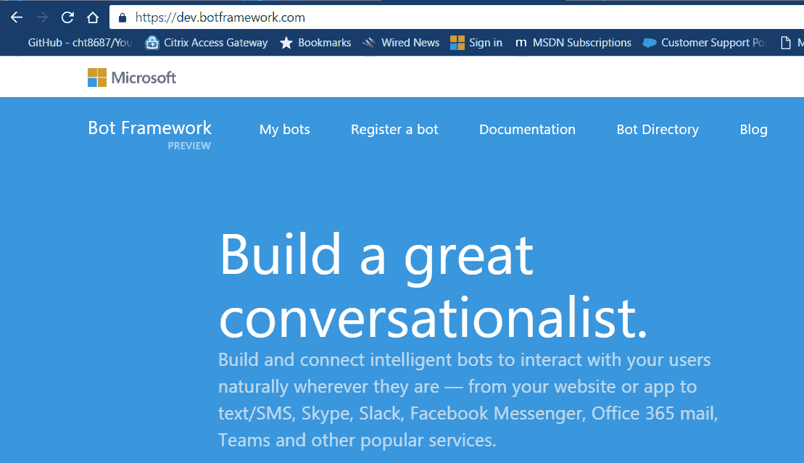

图 3.0:微软机器人框架主页

让我们点击 [**注册一个机器人**](https://dev.botframework.com/bots/new) 选项。当您单击它时，系统会提示您使用微软(Hotmail、Live 或 Outlook.com)帐户登录。

如果您以前没有登录过 Bot 框架，您可能会被要求订阅定期简讯。您可能还会被要求选择一个国家或地区。选择退出是一种选择。

如果您选择加入，您将收到一封定期的电子邮件简讯，其中包含关于该框架的更新—如果您想了解微软团队在这个了不起的项目背后的任何最新发展和新闻，这绝对是推荐的。

当您登录后，这就是注册页面的样子——非常简单。

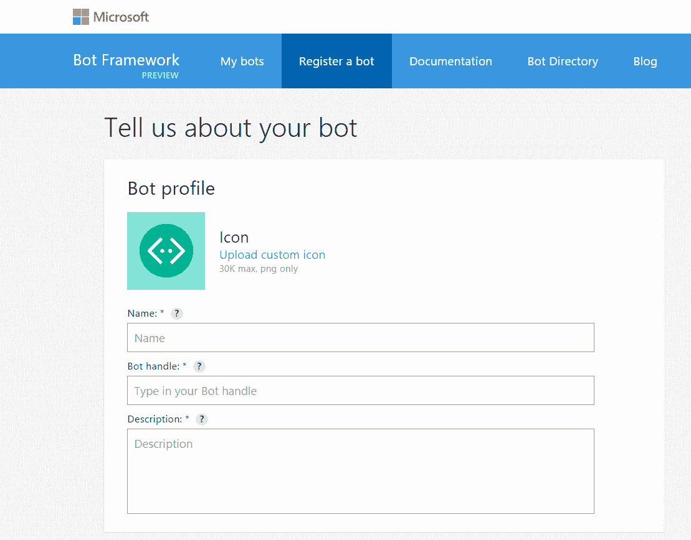

图 3.1:机器人注册页面

如您所见，有三个基本字段是必需的。第一个字段代表机器人的名称，它将用于识别机器人目录中的机器人(如果我们稍后决定将其公开)。不能超过 35 个字符。

第二个字段是机器人的句柄，它将被用作机器人公共网址的一部分。它只允许字母数字和下划线字符，注册后不能更改。

第三个字段是机器人的描述。前 46 个字符显示在机器人目录中的机器人卡片上。描述的其余部分显示在机器人的详细信息下。

让我们给我们的机器人添加一些细节。

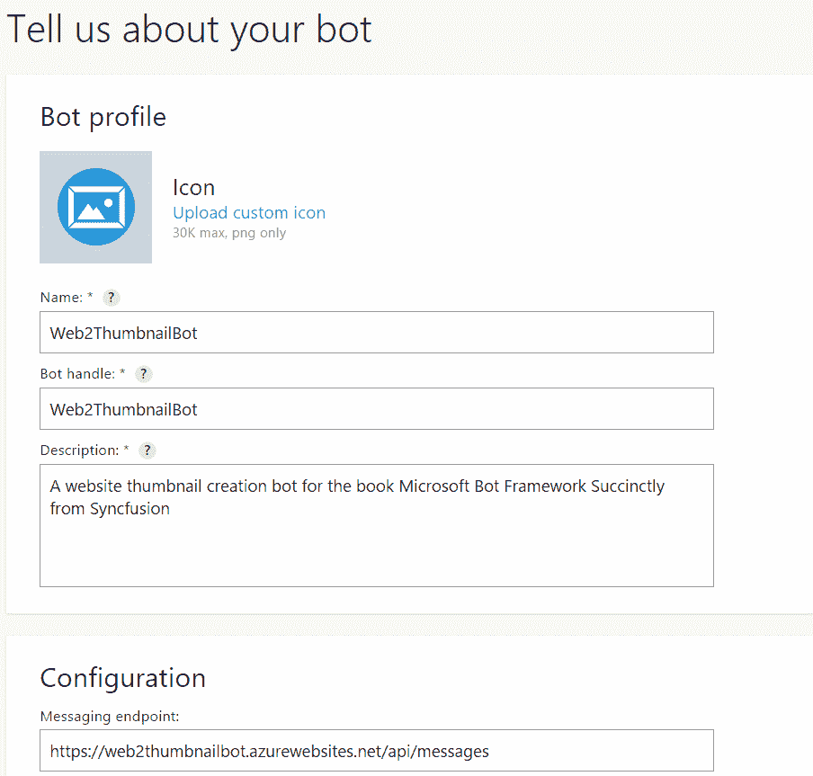

图 3.2:带有机器人信息的注册页面

酷！所以我们现在已经进入了基本细节，但我们还没有完成注册我们的机器人。

如果我们向下滚动页面，我们会看到我们也被要求输入一个消息端点和一个应用程序标识，我们还没有，因为我们还没有实际发布机器人。

让我们在浏览器中打开这个页面，切换到 Visual Studio 来发布我们的机器人，并继续注册过程。

## 发布我们的机器人

如果您没有运行 Visual Studio，请打开它并加载您的 bot 项目。加载项目后，右键单击项目名称，并从上下文菜单中选择**发布**选项。

您将看到如图 3.3 所示的屏幕。在这里，我们被要求选择一个发布目标，在我们的例子中是微软 Azure 应用服务。让我们选择那一个。

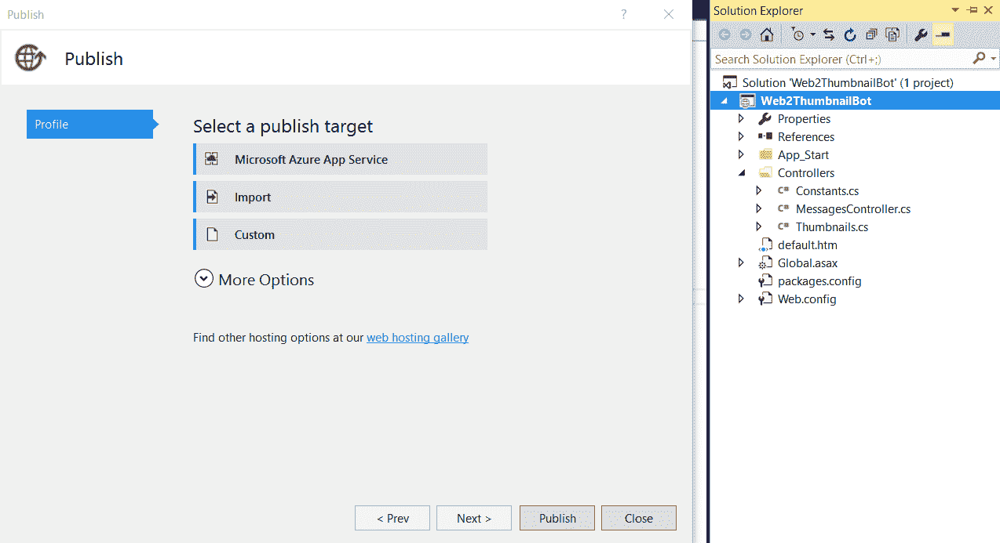

图 3.3:Visual Studio 中的初始机器人发布屏幕

当您选择该选项时，发布向导将要求我们使用现有的 Azure 应用程序服务来托管我们的机器人或创建一个新的机器人。您将看到如图 3.4 所示的屏幕。

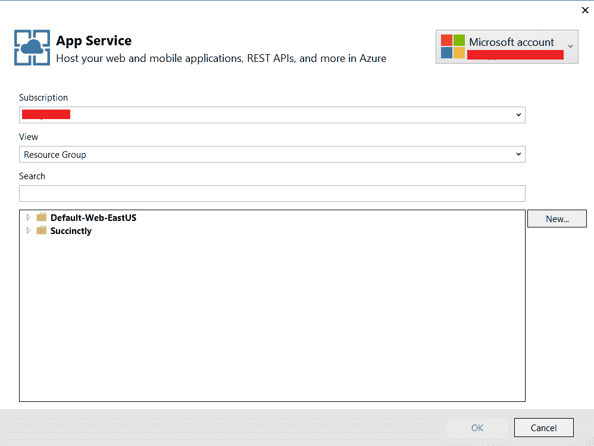

图 3.4:Visual Studio 中的应用服务初始屏幕

我已经在 Azure 中创建了几个应用服务，我不希望用于机器人。我希望这个机器人有自己的 App Service，不要和我创建的其他应用共享，所以我会选择通过点击**新建**来创建一个新的 App Service，这将导致图 3.5 中的屏幕。

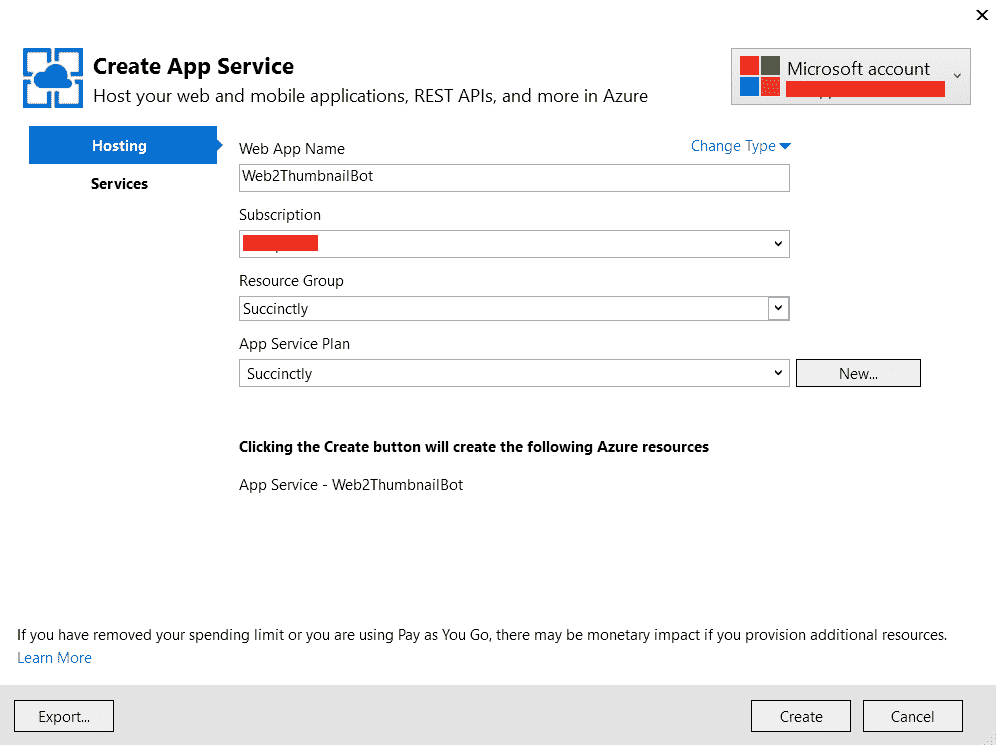

图 3.5:Visual Studio 中的应用服务创建屏幕

为了保持命名约定的简单和一致，我给我的应用服务起了和机器人一样的名字(也和 VS 项目一样的名字)。你可以选择不同的方式；但是，我强烈建议简化并使用相同的名称。

尽管我想创建一个新的应用程序服务，但我已经决定重用一些现有的 Azure 资源，这些资源是我以前构建的应用程序所使用的，例如资源组和服务计划。

最后，为了创建将托管机器人的 Azure 应用服务，让我们单击**创建**。

太棒了。应用服务已创建，发布过程可以继续。接下来，我们将看到一个最终窗口，其中包含关于我们的机器人以及它将如何部署到 Azure 的信息。

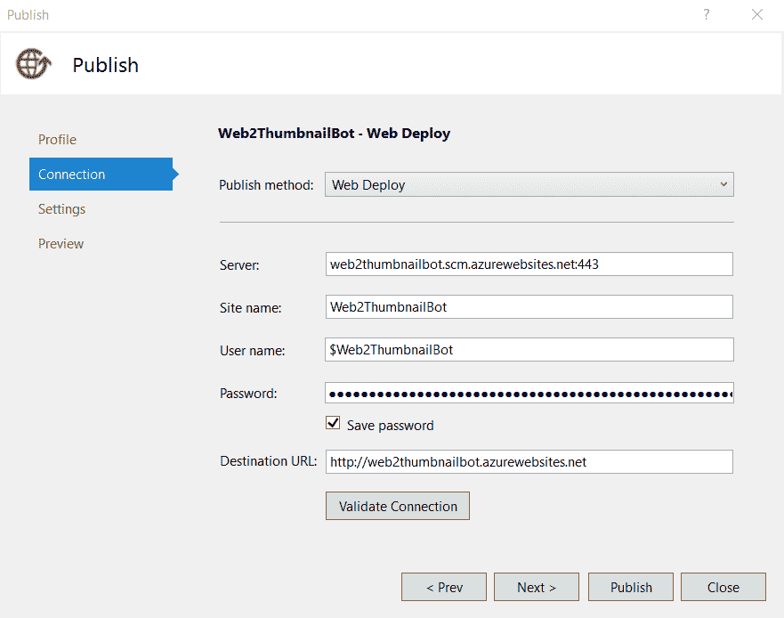

图 3.6:Visual Studio 中的 Web 部署发布屏幕

这些值由 Visual Studio 用 Azure 应用服务提供的详细信息自动填写，这意味着您可以在单击**发布**之前，通过单击**验证连接**来快速测试与 Azure 的连接。

点击**发布**后，Visual Studio 将开启它的魔法。它将构建解决方案，并将其部署到 Azure 上相应的应用服务中。这可能需要几分钟。完成后，您将看到图 3.7 所示的**输出**窗格。

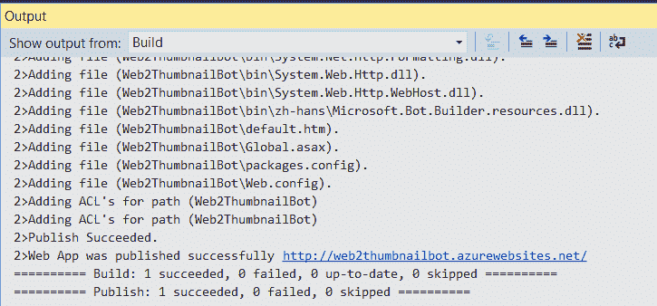

图 3.7:Visual Studio 中的输出窗格—机器人已发布

在这个阶段，机器人已经成功发布，Visual Studio 将打开一个类似于图 3.8 的浏览器窗口。

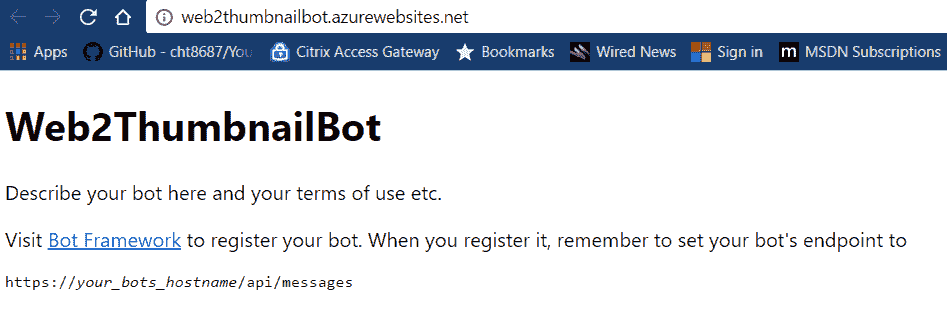

图 3.8:运行在 Azure 上的机器人

请注意，与我们在调试模式下运行代码不同，我们现在打开的浏览器窗口指向我们的机器人驻留在 Azure 上的网址。

随着我们的机器人在 Azure 上发布和运行，我们可以继续注册过程。

## 完成注册流程

随着我们的机器人发布，我们可以在开发者门户中继续注册过程。

我们现在有了要求我们提供的端点，但我们仍然没有应用程序标识。那么，让我们先进入端点。

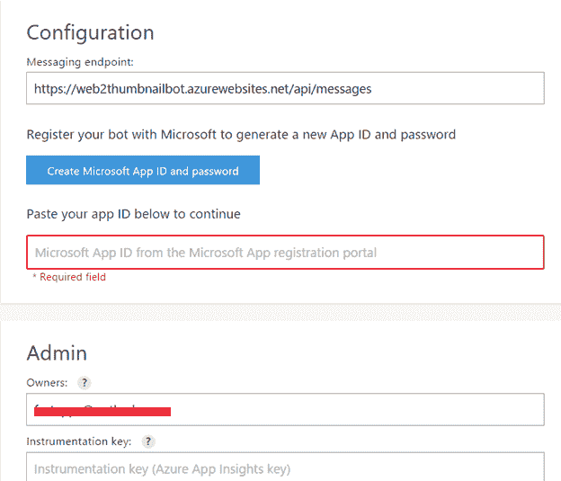

图 3.9:附加注册详细信息

接下来，点击**创建微软 App ID 和密码**。这将把我们带到下一个屏幕。

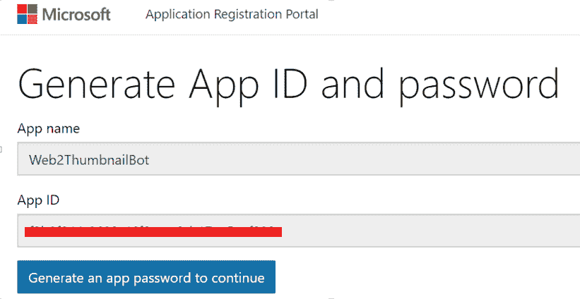

图 3.10:生成应用程序标识屏幕

该标识会自动生成。接下来我们需要点击**生成一个 app 密码继续**。这将创建我们需要复制并粘贴到 Visual Studio 的 Web.config 文件中的应用程序密码，以及应用程序标识。在那之后，我们将再次发布我们的机器人，但我们稍后会这样做。

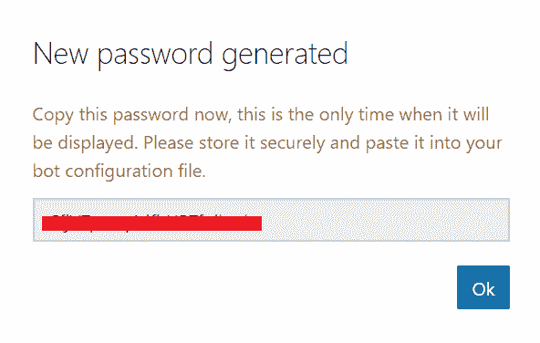

图 3.11:生成的密码屏幕

出现此弹出窗口时，复制并保存生成的密码值，然后点击**确定**。这将使我们回到最初的屏幕。

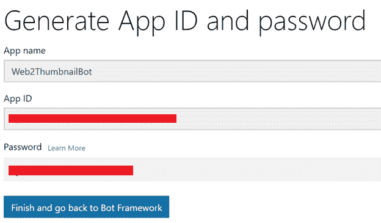

图 3.12:生成的应用程序标识和密码屏幕

要完成此过程，请单击**完成并返回 Bot 框架**。这将带您回到主注册屏幕。

在这里，在**所有者**文本框中输入您的电子邮件，接受条款和条件，然后点击**注册**完成该过程。

如果您有 Azure 应用洞察密钥，也可以输入该值，但不是必需的。

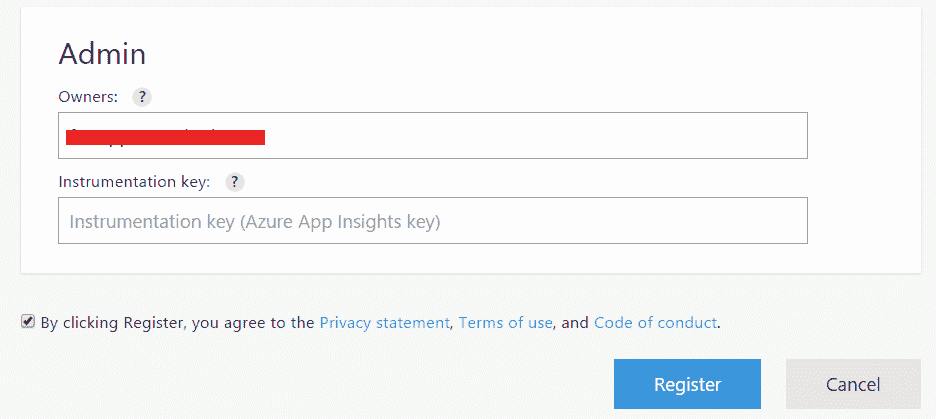

图 3.13:最终注册步骤

这将在机器人开发者门户上注册机器人。但是，它不会在 Bot 目录上发布，也不会启用 Skype 等渠道。这将导致图 3.14 中的屏幕。

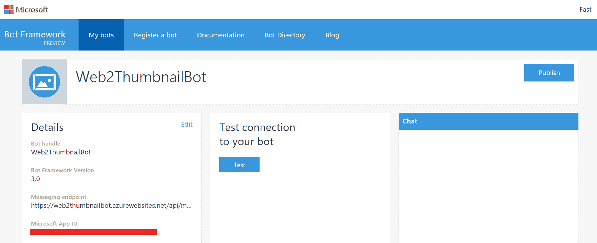

图 3.14:开发者门户上的机器人页面

令人兴奋——我们的机器人现在已经注册了！

## 重新发布我们的机器人

我们现在有了机器人开发者门户的应用程序标识和密码。我们需要在 Web.config 文件中将它添加到我们的 Visual Studio 项目中，然后重新发布。

如果我们不重新发布，我们的机器人将无法与机器人服务通信或使用我们可能添加到其中的任何渠道。因此，让我们转到 Visual Studio，在我们的解决方案中查找 Web.config 文件，并将其打开。

代码清单 3.0:网络配置文件的应用程序设置部分

```cs
  <appSettings>
      <!-- update these with your BotId, Microsoft App ID, and your
  Microsoft App   
      Password-->
      <add key="BotId" value="" />
      <add key="MicrosoftAppId" value="" />
      <add key="MicrosoftAppPassword" value="" />
  </appSettings>

```

让我们输入`BotId`、`MicrosoftAppId`和`MicrosoftAppPassword`的值。

`BotId`是*机器人手柄*，`MicrosoftAppId`是 *App ID* ， `MicrosoftAppPassword`是我们之前复制的自动生成的*密码*。

如果您在开发人员门户上使用了与 Visual Studio 项目和 Azure App 服务相同的机器人名称，则`BotId`将是 Visual Studio 项目的名称。

输入值后，在 Visual Studio 中保存更改并再次发布机器人。

这一次发布屏幕看起来略有不同，这是一个一键操作的过程，因为只需要将最小的更改同步到我们的直播机器人所在的 Azure 应用服务。

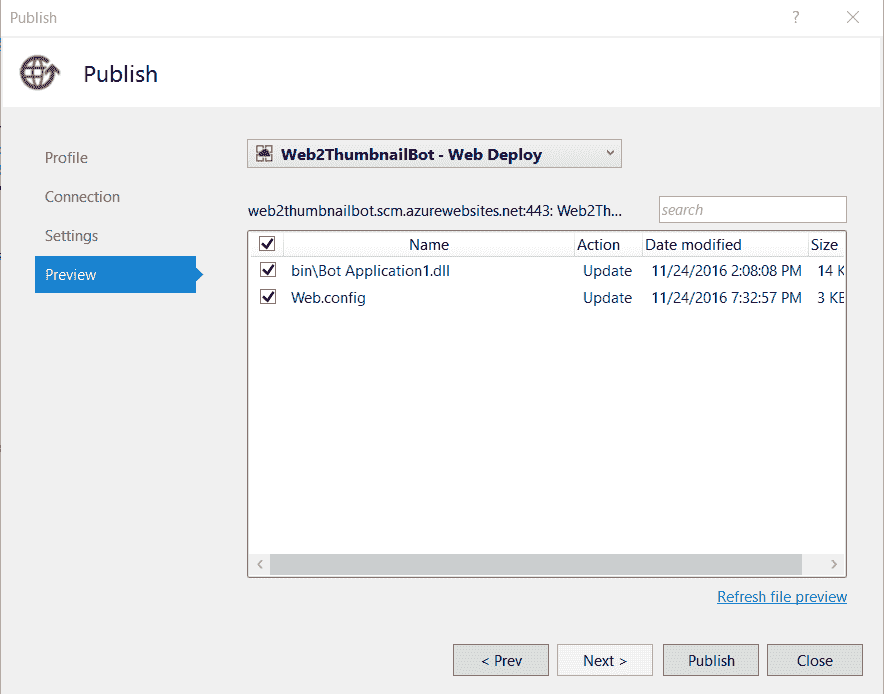

图 3.15:重新发布过程

发布向导知道我们的 Visual Studio 解决方案发生了哪些更改，因此它知道需要向 Azure 应用程序服务主机提交哪些更改。

在这种情况下，我们只更改了 Web.config 文件，因此它将只提交结果 DLL，也就是实际的 bot 本身(一旦编译)和 Web.config 文件。

我们的机器人现在是实时的——托管在 Azure 上，能够与机器人服务和任何可用的渠道进行通信(一旦我们的机器人启用了这些渠道)。

让我们回到我们的机器人的开发者门户页面，运行一个小测试，然后添加 Skype 作为渠道。

## 添加 Skype 为频道

现在我们的机器人已经上线，您将在开发人员门户上看到一个用于测试机器人连接的按钮。它旁边还有一个聊天窗口，你可以在那里与机器人互动。这种互动是与 Azure 应用服务上托管的实时机器人进行的。让我们试试看。

首先，点击**测试**，检查授权是否成功。接下来，在右边的**聊天**窗口给机器人发送一条消息，看看是否有效。

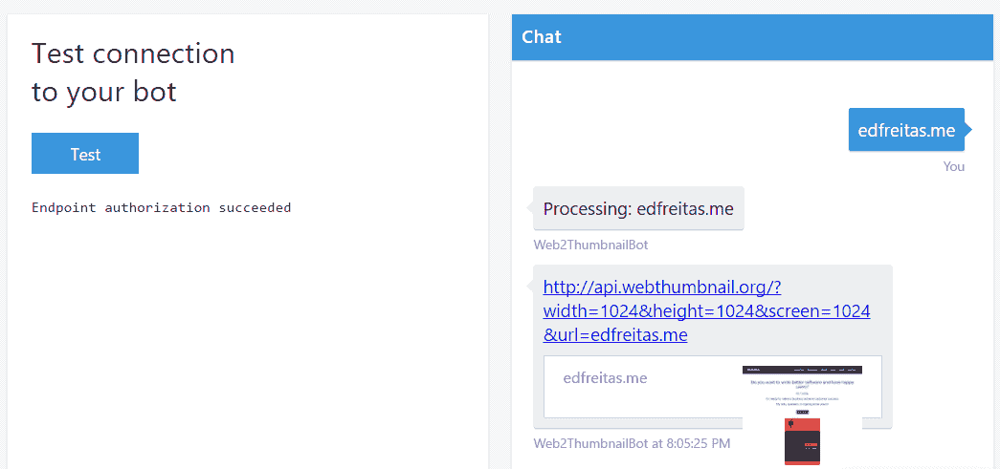

图 3.16:开发人员门户机器人测试选项

太棒了。一切都在按预期进行。授权成功，机器人能够返回请求的网站截图和缩略图。

您可能会遇到的两个问题是身份验证和授权。如果由于某种原因认证过程不起作用，请参考本[文档](https://docs.botframework.com/en-us/core-concepts/authentication/#navtitle)。

我们现在可以将我们的机器人添加到 Skype 中，这是一个默认频道。为此，向下滚动同一个页面，您会发现 Skype 频道。

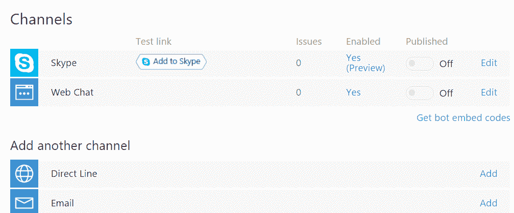

图 3.17:默认使能通道

将机器人添加到 Skype 的一个快速方法是点击**添加到 Skype** 。通过这样做，您将能够将机器人添加到您的联系人列表中。另一种方法是将其设为“已发布”(默认设置为**关闭**，这意味着它将在 Skype 目录中对所有用户公开。

目前，我们只想通过我们的联系人列表与它进行交互，并发送一些请求。让我们快速添加它，通过点击**添加到 Skype** 。当我们这样做时，我们得到如图 3.18 所示的屏幕。

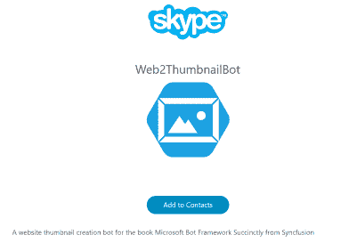

图 3.18:向我们的 Skype 联系人添加机器人

在那里，只需点击**添加到联系人**。浏览器会询问您是否要启动 Skype 应用程序。如果您接受，机器人将被添加到您的联系人列表中。

我们已经走了很长的路。现在，我们的 Skype 联系人列表中已经有了这个机器人，所以现在让我们来真正尝试一下。

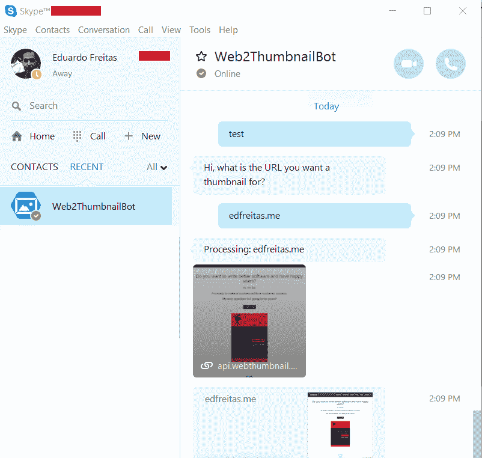

图 3.19:在 Skype 上与我们的机器人互动

值得注意的是，任何机器人都会在 Skype 上显示为活动状态(绿色)。

太棒了。我们能够与我们的机器人互动，它像一种魅力一样工作。因为机器人是机器人，所以它不会“走开”或进入“不打扰”模式。那是一种解脱！

## 总结

我们已经完成了编写、注册和发布一个简单机器人的目标。在这一章中，我们已经从在机器人模拟器中与我们的机器人进行交互，到在机器人开发者门户网站上注册它，然后在 Azure 上发布它并将其添加到 Skype 中。

我们已经详细探讨了实现这一点所需的步骤，尽管确实需要各种步骤，但这个过程是符合逻辑的，也是相对简单的。

当注册和发布另一个机器人时，这些步骤将是必要的，但是我们不会再讨论它们了——我们将假设我们已经完成了这个解释，因此我们可以更多地关注机器人本身和其他补充的 API，这些 API 将使我们的下一个机器人更有意识和更聪明。

我们将利用 FormFlow 和一个有趣的外部应用编程接口。下面的例子应该是有趣的，有挑战性的，有趣的。