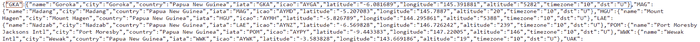
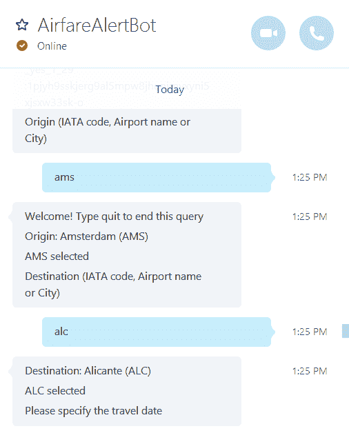
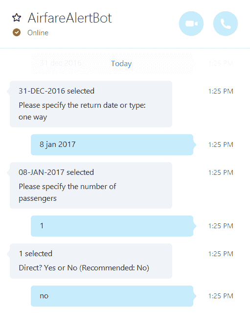
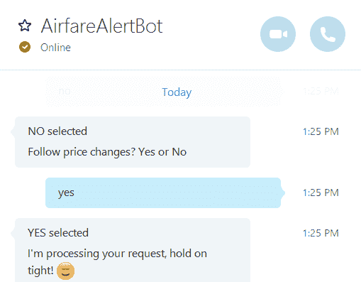
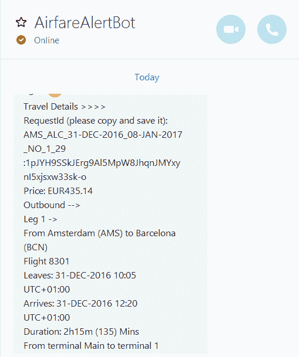
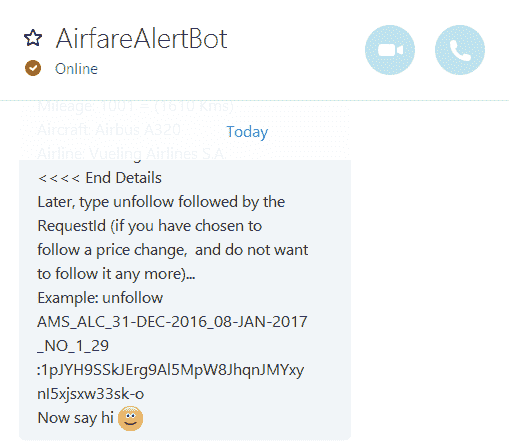
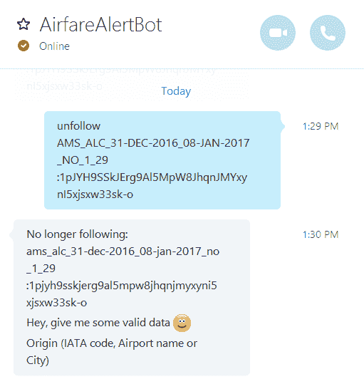
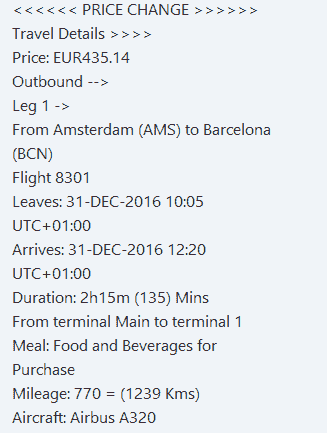

# 第 5 章机票预警机器人

## 简介

事情将变得非常有趣、具有挑战性，并且在某种程度上变得复杂。

我们将进入 bot 构建的全部内容，例如处理会话状态和流、异步请求、与外部服务的交互以及执行验证。

这个机器人的代码库太大，不适合本章，所以我强烈建议您下载完整的 Visual Studio 解决方案以及所有代码，并按照这里将要解释的内容进行操作。

在这一章中，我们将涵盖与机器人核心能力直接相关的代码的最重要部分，例如转换状态、流程、验证，甚至机器人的大脑 MessagesController.cs。

这个机器人也有相当多的代码处理 QPX Express API，以及它如何与 Azure Storage(表和 blobs)交互来存储航班请求，这些请求可以在价格变化时遵循。

本章不会涉及到机器人的一些代码文件，包括 Consts.cs、QpxExpressApiHelper.cs、QpxExpressCore.cs、TableStorage.cs 和 TableStorageCore.cs。但是，如果您下载项目并检查代码，您将看到有助于您导航和理解它们的功能的注释。我强烈建议你这样做——这也会给你带来一点挑战，因为它会迫使你看到拼图的所有部分是如何拼在一起的。

代码结构良好，可读性强，易于理解，完整的 VS 解决方案可以在[这里](https://bitbucket.org/syncfusiontech/microsoft-bot-framework-succinctly/src/a298cae035177e122816672d306bb4f7bccfd1da/AirfareAlertBot/?at=master)找到。

## 网络配置

到目前为止，您已经下载了包含所有机器人代码的 VS 解决方案。打开**解决方案资源管理器**，查找 **Web.config** 文件。有一些重要的设置需要编辑。

代码清单 5.0:要编辑的 Web.config 设置

```
  <appSettings>

  <!-- update these
  with yours -->

  <add key="BotId" value="AirfareAlertBot" />

  <add key="MicrosoftAppId" value="" />

  <add key="MicrosoftAppPassword" value="" />

  <add key="QpxApiKey" value="" />

  <add key="FollowUpInterval" value="60000" />

  <add key="StorageConnectionString" value="" />
  </appSettings>

```

让我们快速浏览一下这些设置。

`BotId`是机器人的唯一标识符。这就是当我们在开发者门户上注册机器人并在 Azure 应用服务上发布它时，机器人连接器将如何知道机器人。我建议您保持一致，在所有服务中使用相同的名称。

`MicrosoftAppId`和`MicrosoftAppPassword`键由机器人开发者门户提供，详情请参考[第三章](3.html#_Re-publishing_our_bot)。

`QpxApiKey`代表 QPX Express API 密钥。`FollowUpInterval`表示机器人在尝试检查航班价格是否发生变化之前等待的毫秒数。

为了测试，您可以使用 60，000 毫秒(一分钟)的值作为`FollowUpInterval`，这意味着机器人每分钟都会查询 QPX Express API，这可能是过于频繁的(因为您每天只获得 50 次免费的 API 调用)。

我建议您在测试阶段之后使用更高的值，例如 3，600，000 毫秒(一小时)。这可能会更好，因为它会降低您的 QPX Express API 消耗率，并使您的免费层持续更长时间。

`StorageConnectionString`代表到 Azure 存储的连接字符串。关于如何设置和使用 Azure Storage 的更多详细信息，可以在我的另一本电子书《C#开发人员的客户成功》中找到，简洁地说就是《T4 的 T3》——请随意查看。

要在您的机器上本地运行项目，您不需要指定`MicrosoftAppId`或`MicrosoftAppPassword`键，这些键仅在开发人员门户上注册时需要。

在本地运行机器人需要其他值。

## web picconfig . cs

当我们使用 Bot Application 模板创建我们的 VS 项目时，会在幕后为我们创建一些代码。该自动生成的代码的一部分包含在 WebApiConfig.cs 文件中，该文件位于 VS 项目的 **App_Start** 文件夹下。

本质上，一个 Bot 应用程序模板只不过是一个稍微增强的 WebApi 项目。

## 将机场映射到国际航空运输协会代码

全世界所有的机场都有相应的 IATA 代码，这是航空公司和旅行公司在提到商业航班时使用的代码。这些代码印在手提箱标签和登机牌上。在预订或预订航班时也会用到它们，因此我们需要明确的是，所有商业航班信息因此都与始发地和目的地的 IATA 代码相关联。

通过在互联网上简单搜索 JSON IATA 代码，我能够找到这个 [airports.json](https://raw.githubusercontent.com/ram-nadella/airport-codes/master/airports.json) 文件，其中包含大量关于机场、机场代码以及其他有趣细节的信息，如时区、经度、纬度、海拔、城市和国家。

通过解析这个文件，我们的机器人应该能够快速识别任何出发地或目的地，并轻松检索调用 QPX Express API 时所需的相应 IATA 代码。

让我们创建一个实现`IDisposable`的类，该类有一个负责解析这个 JSON 数据文件并填充一个`Dictionary`对象的方法，该对象将作为包含机场列表的公共属性来访问。

在编写这段代码之前，让我们从 NuGet 安装检索 JSON 数据所需的 [RestSharp](http://restsharp.org/) 库(参见[图 2.7](2.html#RestSharpNuGet) )。

将需要[Json.NET](http://www.newtonsoft.com/json)库来解析和反序列化 JSON 响应。当我们创建项目时，这个库已经作为依赖项安装了，这意味着没有必要从 NuGet 安装它。

一旦安装了 RestSharp，让我们在**控制器**文件夹下为我们的 VS 项目添加一个名为 **FlightData.cs** 的新 C#类文件。这是密码。

代码清单 5.1

```
  using System.Collections.Generic;
  using RestSharp;
  using RestSharp.Deserializers;
  using System;
  using System.Threading.Tasks;
  using Google.Apis.QPXExpress.v1.Data;

  namespace AirfareAlertBot.Controllers
  {

  // Used in order to
  store worldwide airport data.

  public class Airport

  {

  public string Name { get; set;
  }

  public string City { get; set;
  }

  public string Country { get; set;
  }

  public string Iata { get; set;
  }

  public string Icao { get; set;
  }

  public float Latitude { get; set;
  }

  public float Longitude { get; set; }

  public float Altitude { get; set;
  }

  public string Timezone { get; set;
  }

  public string Dst { get; set;
  }

  }

  // Used in order to
  store a flight request.

  public class FlightDetails

  {

  public string OriginIata { get; set; }

  public string DestinationIata { get; set; }

  public string OutboundDate { get; set; }

  public string InboundDate { get; set; }

  public string NumPassengers { get; set; }

  public string NumResults { get; set; }

  public string Follow { get; set;
  }

  public string Direct { get; set;
  }

  public string UserId { get; set;
  }

  public int
  Posi { get; set;
  }

  }

  // Responsible for
  processing a flight request.

  public class ProcessFlight : IDisposable

  {

  protected bool
  disposed;

  public Dictionary<string, Airport> Airports { get; set; }

  public FlightDetails FlightDetails { get; set; }

  public ProcessFlight()

  {

  FlightDetails = new FlightDetails()

  {

  OriginIata = string.Empty,

  DestinationIata = string.Empty,

  OutboundDate = string.Empty,

  InboundDate = string.Empty,

    NumPassengers = string.Empty,

  NumResults = string.Empty

  };

  Airports = GetAirports();

  }

  // Gets a list of all
  airports worldwide.

  protected Dictionary<string, Airport> GetAirports()

  {

  string res = string.Empty;

  RestClient client = new 

  RestClient(StrConsts.cStrIataCodesBase);

  RestRequest request = new 

  RestRequest(StrConsts.cStrIataCodePath, Method.GET);

  request.RequestFormat
  = DataFormat.Json;
              IRestResponse response = client.Execute(request);
              JsonDeserializer deserial = new JsonDeserializer();

              return deserial.

  Deserialize<Dictionary<string, Airport>>(response);

  }

  // Checks if a string
  is an IATA code.

  public bool
  IsIataCode(string input, ref List<string> tmpList)

  {

  bool res = false;

  foreach (KeyValuePair<string, Airport> p in Airports)

  {

  if (p.Key.ToLower() ==
  input.ToLower())

  {

  tmpList.Add(p.Key);

  res = true;

  break;

  }

  }

  return res;

  }

  // City that
  corresponds to an IATA code.

  public string GetAirportCity(string
  code)

  {

  string res = string.Empty;

  foreach (KeyValuePair<string, Airport> p in Airports)

  {

  if (p.Key.ToLower() == code.ToLower())

  {

  res = p.Value.City;

  break;

  }

  }

  return res;

  }

  // List of IATA codes.

  public List<string> GetCodesList()

  {

  List<string> codes = new List<string>();

  foreach (KeyValuePair<string, Airport> p in Airports)

  {

  codes.Add(p.Key);

  }

  return codes;

  }

  protected bool
  HasAirportParamValue(string v, string p)

  {

  return (p != string.Empty && 

  v.ToLower() == p.ToLower()) ? true : false;

  }

  // Searches for IATA
  codes based on the city or airport name.

  public string[] GetIataCodes(string
  name, string city, 

  string country)

  {

  List<string> codes = new List<string>();

  foreach (KeyValuePair<string, Airport> p in Airports)

  {

  if (city != string.Empty)

  {

  if
  ((HasAirportParamValue(p.Value.Name, name) ||

  HasAirportParamValue(p.Value.City, city)) ||

  HasAirportParamValue(p.Value.Country, country))

  {

                     codes.Add(p.Key + "|" + p.Value.Name);

  }

  }

  else if
  (name != string.Empty)

  {

  if
  ((HasAirportParamValue(p.Value.City, city) ||

  HasAirportParamValue(p.Value.Name, name)) ||

  HasAirportParamValue(p.Value.Country, country))

  {

  codes.Add(p.Key + "|" + p.Value.Name);

  }

  }

  }

  return codes.ToArray();

  }

  // Footer of a flight
  request.

  protected static string SetOutputFooter(string guid)

  {

  return Environment.NewLine +

  Environment.NewLine +

  ((guid != string.Empty) ?

  GatherQuestions.cStrGatherRequestProcessed +

  GatherQuestions.cStrGatherRequestProcessedPost +

  guid : string.Empty) +

  Environment.NewLine +

  Environment.NewLine + GatherQuestions.cStrNowSayHi;

  }

  // Creates a flight
  request output.

  public static string OutputResult(string[] lines, string
  guid)

  {

  string r = string.Empty;

  foreach (string l in lines)

  r += l + Environment.NewLine;

  if (lines.Length > 1)

  r += SetOutputFooter(guid);

  return r;

  }

  // Main method for
  processing a flight request.

  public async Task<string> ProcessRequest()

  {

  return await Task.Run(() =>

  {

  string guid = string.Empty;

  TripsSearchResponse result = null;

  string[] res = QpxExpressApiHelper.

  GetFlightPrices(true, Airports, 

      FlightDetails, out guid, out result).ToArray();

  return OutputResult(res, guid);

  });

  }

  // Destructor

  ~ProcessFlight()

  {

  Dispose(false);

  }

  public virtual void Dispose(bool disposing)

  {

  if (!disposed)

  {

  if (disposing)

  {

  FlightDetails = null;

  }

  }

  disposed = true;

  }

  public void
  Dispose()

  {

  Dispose(true);

  GC.SuppressFinalize(this);

  }

  }
  }

```

为了理解这段代码，让我们先检查一下 JSON 数据文件。图 5.0 显示了数据片段的样子。



图 5.0:JSON 数据文件的片段

请注意，数据包含一个键(用`red`圈出)和一个值(用`blue`圈出)。键是一个`string`，值是一个具有多个属性的对象(由前面代码清单中的`Airport`类表示)。

`Airport`类是包含在 GitHub 上托管的 JSON 文件中的数据的 C#表示，该文件包含了世界机场的所有细节。

这将用于检索航班始发地和目的地的国际航空运输协会代码，这是查询 QPX 快递应用编程接口时所必需的。

我们使用`FlightDetails`类作为占位符来存储用户为特定航班请求提交的数据。它也用于检索已经存储的航班详细信息，并跟踪价格变化。换句话说，它用于管理飞行请求的状态，而不是机器人的状态。

`ProcessFlight`类实现`IDisposable`接口，负责处理一个飞行请求。

这个类包含几个助手方法，用于检索机场列表，获取国际航空运输协会代码，以及检索对应于特定国际航空运输协会代码的城市。

`GetAirports`方法通过使用`RestClient`实例发出一个 HTTP 请求。它将检索到的 JSON 数据反序列化，然后返回一个填充`Airports`属性的`Dictionary<string, Airport>`对象。

这个类的两个有趣的方法是`IsIataCode`和`GetIataCodes`方法。`IsIataCode`方法循环通过`Airports` `Dictionary`，并检查用户的输入是否对应于国际航空运输协会代码。

另一方面，仅当用户没有输入国际航空运输协会代码，而是输入城市或机场名称时，才会调用`GetIataCodes`方法。然后，该方法循环通过`Airports` `Dictionary`，检查输入的值是否与城市或机场名称匹配，然后返回相应的国际航空运输协会代码。

`GetIataCodes`方法还包含几个`static`方法，当结果显示给用户时使用。可能的结果是`OutputResult`和`SetOutputFooter`。两者都是字符串串联方法。

这些方法由`ProcessRequest` `async`方法调用，该方法仅在用户提交了所有航班请求详细信息时使用。

`ProcessRequest`方法从`QpxExpressApiHelper`类调用`GetFlightPrices` `static`方法，负责调用 QPX Express API 并返回航班请求查询的结果。

我们稍后将探讨`QpxExpressApiHelper`课。请注意，我们还使用了在 Consts.cs 文件中定义的名为`GatherQuestions`的类中定义的常量。

我们的国际航空运输协会代码映射到此结束。完成后，我们现在可以专注于我们的机器人的主要对话流程，所有请求都来自该流程，所有验证过程都被触发，所有响应都被返回进行最终处理。

## 处理会话流

创建机器人最困难的方面之一是能够处理与用户的对话流。如果我们必须自己处理这个逻辑，创建机器人的复杂性将会飙升。

幸运的是，在微软 Bot Framework 团队工作的好人给了我们很大的帮助。他们提出了一个应用编程接口，允许我们相当无缝地创建一系列事件，并为转换流提供结构。这个 API 部分被称为 [FormFlow](https://docs.botframework.com/en-us/csharp/builder/sdkreference/forms.html) 。

FormFlow 的工作原理是创建一个包含几个变量的类和一个`static`方法。每个变量代表对话流程中的一个问题或步骤。

方法表示流程，并执行一系列子事件(验证)，从而为后续对话创建结构和逻辑。

FormFlow 处理每个步骤的验证和对话状态，这意味着它知道对话在哪里——即在哪个阶段。每一步的验证都可以通过`async`方法来实现。

对于我们的机器人，使用 FormFlow 的会话流逻辑将保存在一个名为 **TravelDetails.cs** 的文件中。

让我们在 **Controllers** 文件夹下的 VS 项目中添加一个新的 C#类文件，让我们输入代码清单 5.2 中的代码。

代码清单 5.2: TravelDetails.cs

```
  using AirfareAlertBot.Controllers;
  using Microsoft.Bot.Builder.Dialogs;
  using Microsoft.Bot.Builder.FormFlow;
  using System;
  using System.Threading.Tasks;

  namespace AirfareAlertBot
  {

  // This is the FormFlow
  class that handles

  // the conversation
  with the user, in order to get

  // the flight details
  the user is interested in.

  [Serializable]

  public class TravelDetails

  {

  // Ask the user for the
  point of origin for the trip.

  [Prompt(GatherQuestions.cStrGatherQOrigin)]

  public string OriginIata;

  // Ask the user for the
  point of destination for the trip.

  [Prompt(GatherQuestions.cStrGatherQDestination)]

  public string DestinationIata;

  // Ask the user for the
  outbound trip date.

  [Prompt(GatherQuestions.cStrGatherQOutboundDate)]

  public string OutboundDate;

  // Ask the user for the
  inbound (return) trip date

  // (if applicable - if
  it is not 'one way').

  [Prompt(GatherQuestions.cStrGatherQInboundDate)]

  [Optional]

  public string InboundDate;

  // Ask the user for the
  number of passengers.

  [Prompt(GatherQuestions.cStrGatherQNumPassengers)]

  public string NumPassengers;

  // Ask the user if the
  flight is direct.

  [Prompt(GatherQuestions.cStrGatherProcessDirect)]

  public string Direct;

  // Ask the user if the
  flight is to be followed

  // (check for price
  changes).

  [Prompt(GatherQuestions.cStrGatherProcessFollow)]

  public string Follow;

  // FormFlow main
  method, which is responsible for creating

  // the conversation
  dialog with the user and validating each

  // response.

  public static IForm<TravelDetails> BuildForm()

  {

  // Once all the user
  responses have been gathered 

  // send a response back
  that the request is being 

  // processed.

  OnCompletionAsyncDelegate<TravelDetails> 

  processOrder = async (context, state) =>

  {

  await context.PostAsync(

  GatherQuestions.cStrGatherProcessingReq);

  };

  // FormFlow object that
  gathers and handles user responses.

  var f = new
  FormBuilder<TravelDetails>()

  .Message(GatherQuestions.cStrGatherValidData)

  .Field(nameof(OriginIata),

  // Validates the point
  of origin submitted.

  validate: async (state, value) =>

  {

  return await Task.Run(() =>

  {

  Data.currentText = value.ToString();

  return FlightFlow.CheckValidateResult(

  FlightFlow.ValidateAirport(state, 

  Data.currentText, false));

  });

  })

  .Message("{OriginIata}
  selected")

  .Field(nameof(DestinationIata),

  // Validates the point
  of destination submitted.

  validate: async (state, value) =>

  {

  return await Task.Run(() =>

  {

  Data.currentText = value.ToString();

  return FlightFlow.CheckValidateResult(

  FlightFlow.ValidateAirport(state, 

  Data.currentText, true));

  });

  })

         .Message("{DestinationIata}
  selected")

  .Field(nameof(OutboundDate),

  // Validates the
  outbound travel date submitted.

  validate: async (state, value) =>

  {

           return await Task.Run(() =>

  {

  Data.currentText = value.ToString();

  return FlightFlow.CheckValidateResult(

  FlightFlow.ValidateDate(state, 

  Data.currentText, false));

  });

  })

  .Message("{OutboundDate}
  selected")

  .Field(nameof(InboundDate),

  // Validates the
  inbound travel date submitted

  // (or if it is a one-way
  trip).

  validate: async (state, value) =>

  {

  return await Task.Run(() =>

                  {

  Data.currentText = value.ToString();

  return FlightFlow.CheckValidateResult(

  FlightFlow.ValidateDate(state, 

  Data.currentText, true));

  });

  })

  .Message("{InboundDate}
  selected")

  .Field(nameof(NumPassengers),

  // Validates the number
  of passengers 

    // submitted for the trip.

  validate: async (state, value) =>

  {

  return await Task.Run(() =>

  {

  Data.currentText = value.ToString();

                       return FlightFlow.CheckValidateResult(

  FlightFlow.ValidateNumPassengers(state, 

  Data.currentText));

  });

  })

  .Message("{NumPassengers}
  selected")

  .Field(nameof(Direct),

  // Validates whether the
  trip is direct or not.

  validate: async (state, value) =>

  {

  return await Task.Run(() =>

  {

  Data.currentText = value.ToString();

  return FlightFlow.CheckValidateResult(

  FlightFlow.ValidateDirect(state, 

  Data.currentText));

  });

  })

  .Message("{Direct}
  selected")

  .Field(nameof(Follow),

  // Validates if the
  user has submitted 

  // the flight to be

  // followed for price
  changes.

  validate: async (state, value) =>

  {

  return await Task.Run(() =>

  {

  Data.currentText = value.ToString();

  ValidateResult res = 

  FlightFlow.CheckValidateResult(

  FlightFlow.ValidateFollow(state, 

  Data.currentText));

  FlightFlow.

  AssignStateToFlightData(res, state);

  return res;

  });

             })

  .Message("{Follow}
  selected")

  // When all the data
  has been 

  // gathered from the user...

  .OnCompletion(processOrder)

  .Build();

  return f;

  }

  }
  }

```

如果我们退一步来看这段代码，我们可以看到它实际上并不多，它是基于方法链的，其中每个步骤都遵循前一个步骤。

因为 FormFlow 处理的是会话状态，所以它知道从哪里拿起会话，执行哪个`validate`方法。这不仅很棒，而且方便易用。所以，让我们深入细节。

首先，注意`TravelDetails`类用`Serializable`属性修饰。

`TravelDetails`类包含一系列变量，每个变量代表机器人将从用户那里收集的响应。每个变量都标有`Prompt`属性，该属性将指示要求用户回答的问题。

所有对话中唯一可选的变量是对应于`InboundDate`的变量，用`Optional`属性标记。这是对没有回程(即单程)的航班详细信息请求的响应。

其他变量不是可选的，因此在对话过程中是必需的。魔法发生在`BuildForm`法里面。此方法控制会话流和会话状态，并在每个步骤中为每个所需的输入执行验证。`BuildForm`方法包含两个主要部分。

第一部分是一个名为`OnCompletionAsyncDelegate<TravelDetails>`的委托，当来自用户(由类中的变量表示)的所有细节都被收集后，该委托被执行。

第二部分是一个`FormBuilder<TravelDetails>`实例，它被创建并包含一系列方法，这些方法被链接在一起，并按照我们希望对话遵循的顺序一个接一个地执行。

最重要的是，对于在`TravelDetails`类中定义的每个变量，FormFlow 运行一个`validate`方法，该方法可以执行我们想要调用的任何自定义代码，从而验证该变量的值——返回一个`ValidateResult`对象，该对象确定 FormFlow 是否可以继续对话，或者要求用户重新输入当前变量的值。这就是对话式状态管理的实现方式。

对话状态，包括在`TravelDetails`类中定义的每个变量的值，可通过`state`参数用于每个步骤中的每个验证方法。

在我看来，FormFlow 处理对话中的流并使其变得极其容易的方式是 Bot 框架最重要和最引人注目的特征之一。

请务必注意，FormFlow 并不要求验证方法是异步的，但是为了让 bot 尽可能地响应，我决定将每一个标记为`async`，并将每个自定义验证逻辑写入一个`Task`对象的`Run`方法中。

验证逻辑本身已经被很好地抽象和包装在一个单独的名为`FlightFlow`的`static`类中，我们接下来将探讨这个类。

## 自定义流程验证

使用 FormFlow 的最大好处是能够为代表对话阶段的每个变量编写自定义验证。

您可以在`BuildForm`的每个`Validate`方法中编写每个验证，但是这看起来不是特别好，并且随着代码库的增长，管理起来也不容易。所以，我的建议是将这个逻辑写在一个单独的类中，然后根据需要调用它。

为了做到这一点，让我们在 VS 项目的**控制器**文件夹中创建一个新的 C#类文件，并将其称为 **FlightFlow.cs** 。

代码清单 5.3

```
  using Microsoft.Bot.Builder.FormFlow;
  using System;
  using System.Collections.Generic;

  namespace AirfareAlertBot.Controllers
  {

  // Handles the
  conversation flow with the users.

  public partial class FlightFlow

  {

  // Interprets an
  unfollow request command from the user.

  public static bool ProcessUnfollow(string value, ref 

  ValidateResult result)

  {

  bool res = false;

  if (value.ToLower().Contains(

  GatherQuestions.cStrUnFollow.ToLower()))

  {

  // Use Azure Table storage.

  using (TableStorage ts = new TableStorage())

  {

  string guid = value.ToLower().Replace(

  GatherQuestions.cStrUnFollow.ToLower(), 

  string.Empty);

  // Remove the flight
  details for the 

  // guide being followed.

  if (ts.RemoveEntity(guid))

  {

  string msg =   

  GatherQuestions.cStrNoLongerFollowing + 

  guid;

  result = new ValidateResult { IsValid = false, 

  Value = msg };

  result.Feedback = msg;

  res = true;

  }

  else

  result = new ValidateResult { IsValid = false, 

  Value = GatherErrors.cStrNothingToUnfollow };

  }

  }

  return res;

   }

  // Validates that the response
  to the user is never empty.

  public static ValidateResult CheckValidateResult(

  ValidateResult result)

  {

  result.Feedback = ((result.Feedback == null ||

  result.Feedback == string.Empty) && 

  result.Value.ToString() == string.Empty)
  ?

  GatherQuestions.cStrGatherValidData :
  result.Feedback;

  return result;

  }

  // Validates the user's
  response for a direct flight (or not).

  public static ValidateResult ValidateDirect(TravelDetails state, 

  string value)

  {

  ValidateResult result = new ValidateResult 

  { IsValid = false, Value = string.Empty };

  string direct = (value != null) ? value.Trim() : 

  string.Empty;

  if (ProcessUnfollow(direct, ref result))

  return result;

  if (direct != string.Empty)

  {

  // If direct flight
  response is correct.

  if (direct.ToLower() == GatherQuestions.cStrYes ||

  direct.ToLower() == GatherQuestions.cStrNo)

  return new
  ValidateResult 

  { IsValid = true, Value = direct.ToUpper() };

  else

  {

  if (result.Feedback != null)

  result.Feedback = 

  GatherQuestions.cStrGatherProcessTryAgain;

  }

  }

  else

  {

  if (result.Feedback != null)

  result.Feedback = 

  GatherQuestions.cStrGatherProcessTryAgain;

  }

   return result;

  }

  // Validates the user's
  response to follow a flight request 

  // (for price changes).

  public static ValidateResult ValidateFollow(

  TravelDetails state, string value)

  {

  ValidateResult result = new ValidateResult 

  { IsValid = false, Value = string.Empty };

  string follow = (value != null) ? value.Trim() : 

  string.Empty;

  if (ProcessUnfollow(follow, ref result))

  return result;

  if (follow != string.Empty)

  {

  // If the response to
  follow a flight is correct.

  if (follow.ToLower() == GatherQuestions.cStrYes ||

  follow.ToLower() == GatherQuestions.cStrNo)

  return new
  ValidateResult 

  { IsValid = true, Value = follow.ToUpper() };

  else

  {

  if (result.Feedback != null)

  result.Feedback = 

  GatherQuestions.cStrGatherProcessTryAgain;

  }

  }

  else

  result.Feedback = 

  GatherQuestions.cStrGatherRequestProcessedNoGuid;

  return result;

  }  

  // Validates the user's
  number of passengers response.

  public static ValidateResult ValidateNumPassengers(

  TravelDetails state, string value)

  {

  ValidateResult result = new ValidateResult 

  { IsValid = false, Value = string.Empty };

  string numPassengers = (value != null) ? value.Trim() : 

  string.Empty;

  if (ProcessUnfollow(numPassengers, ref result))

  return result;

  if (numPassengers != string.Empty)

  {

  // Verifies the number
  of passengers and if correct.

  result = ValidateNumPassengerHelper.

  ValidateNumPassengers(numPassengers);

  if (!result.IsValid &&
  (result.Feedback == null || 

  result.Feedback == string.Empty))

  result.Feedback = 

  GatherQuestions.cStrGatherProcessTryAgain;

  }

  else

  {

  if (result.Feedback != null)

  result.Feedback = 

  GatherQuestions.cStrGatherProcessTryAgain;

  }

  return result;

  }

  // Validates the user's
  travel date 

  // (outbound or inbound) response.

  public static ValidateResult ValidateDate(TravelDetails state, 

  string value, bool checkOutInDatesSame)

  {

  ValidateResult result = new ValidateResult 

  { IsValid = false, Value = string.Empty };

  string date = (value != null) ? value.Trim() : string.Empty;

  if (ProcessUnfollow(date, ref result))

  return result;

  if (checkOutInDatesSame && value.ToLower().Contains(

  GatherQuestions.cStrGatherProcessOneWay))

  return new
  ValidateResult { IsValid = true, Value = 

  GatherQuestions.cStrGatherProcessOneWay };

  if (date != string.Empty)

  {

  DateTime res;

  // If it is a proper
  date.

  if (DateTime.TryParse(value, out res))

  {

  if (checkOutInDatesSame)

  {

  // Performs the actual
  date validation.

  result = ValidateDateHelper.

  ValidateGoAndReturnDates(ValidateDateHelper.

  ToDateTime(state.OutboundDate),

          ValidateDateHelper.ToDateTime(value),

          ValidateDateHelper.

  FormatDate(value));

  }

  else

  // If it is a date in
  the future.

  result = ValidateDateHelper.IsFutureDate(

  ValidateDateHelper.ToDateTime(value), 

  ValidateDateHelper.FormatDate(value));

  }

  else

           {

  if (result.Feedback != null)

  result.Feedback = 

  GatherQuestions.cStrGatherProcessTryAgain;

  }

  }

  // If it is not a
  proper date.

  else

  {

  if (result.Feedback != null)

  result.Feedback = 

  GatherQuestions.cStrGatherProcessTryAgain;

  }

  return result;

  }

  // Validates the user's
  response for origin and destination.

  public static ValidateResult ValidateAirport(TravelDetails state, 

  string value, bool checkOrigDestSame)

  {

  bool isValid = false;

  List<string> values = new List<string>();

  ValidateResult result = new ValidateResult 

  { IsValid = false, Value = string.Empty };

  string city = (value != null) ? value.Trim() : string.Empty;

  if (ProcessUnfollow(city, ref result))

  return result;

  if (city != string.Empty)

  {

  // Get the IATA code
  (if any) corresponding 

  // to the user input.

  isValid = Data.fd.IsIataCode(value.ToString(), 

              ref values);

  if (isValid)

  {

  // Processes the IATA
  code response.

  result = ValidateAirportHelpers.

  ProcessAirportIataResponse(state,  

  checkOrigDestSame, values.ToArray());

  }

  // When multiple
  airports are found for a given city.

  else

  {

  // Get all the IATA
  codes for all the 

                  // airports in a city.

  string[] codes =  

  InternalGetIataCodes(value.ToString().Trim());

  if (codes.Length == 1)

  {

  // When the specific
  match is found.

  result = ValidateAirportHelpers.

  ProcessAirportResponse(state, 

  checkOrigDestSame, codes);

  }

  else if
  (codes.Length > 1)

  {

  // When multiple
  options are found.

  result = new ValidateResult 

  { IsValid = isValid, Value = string.Empty
  };

  result = ValidateAirportHelpers.

  GetOriginOptions(codes, result);

  }

  else

  {

  if (result.Feedback != null)

  {

  result = new ValidateResult 

  { IsValid = isValid, 

  Value = string.Empty };

  result.Feedback = GatherQuestions.

  cStrGatherProcessTryAgain;

  }

  }

  }

  }

  return result;

  }

  }
  }

```

让我们分析这段代码，以了解发生了什么。首先，请注意这是一个`partial`类，这意味着该类的另一部分包含在另一个*中。* cs 文件，我们将很快审查。

这种类的分离使代码更容易阅读和遵循，并且使代码更易于管理。然而，这不是必须的。

这个`partial`类没有利用 Bot 框架的任何特性，所以它只是充当`BuildForm`方法在验证对话流中的每个步骤时调用的验证逻辑的容器。这是一种将我们的主要验证逻辑全部保存在一个地方的方法。

这个类中的第一个方法叫做`ProcessUnfollow`，它删除了一个已经保存在 Azure Storage 上的航班请求(为了接收价格提醒变化)，所以不再被关注。

该方法在所有验证中执行，因为用户可以在对话的每个步骤中发出 unfollow 命令。

接下来，下一个方法叫做`CheckValidateResult`。其目的是确保任何验证步骤返回的任何`ValidateResult`对象都不会返回空的`Feedback`属性。当`ValidateResult`的`IsValid`属性为`false` `,`时，机器人无法发送空的`string`响应。

`ValidateFollow`方法检查用户是否为后续问题键入了有效的回答(如果要遵循航班请求)——是或否

`ValidateDirect`方法对直通车问题也是如此(一个航班是直通车还是允许多次转机)。

`ValidateNumPassengers`方法验证乘客数量是否为 1 到 100 之间的数字。

`ValidateDate`方法稍微复杂一些，因为它不仅验证`OutboundDate`和`InboundDate`(如果适用)是正确的，而且它还检查日期不是过去的，并且与`OutboundDate`相比`InboundDate`是未来的日期。

最后，这个`partial`类中最有趣、最复杂的验证方法是`ValidateAirport`方法。这负责验证始发地和目的地机场都是正确的——它们存在(是有效的国际航空运输协会代码)，并且如果用户已经为该城市指示了多个机场，则返回现有选项，以便用户可以选择任何选项。

注意所有这些验证方法如何返回一个`ValidateResult`对象。尽管它们的逻辑看起来很简单，但是仍然需要一些代码来执行正确的验证。

从这个意义上说，为了保持代码尽可能干净，您可能已经注意到一些验证方法会在内部调用它们自己的验证助手方法(包含在单独的类中)。这些负责为对话流程中的每个步骤处理非常具体的验证逻辑。我们稍后会看到这段代码。

这些验证助手类中的一些是`ValidateNumPassengerHelper`、`ValidateDateHelper`和`ValidateAirportHelpers`。

随着 FlightFlow.cs 的退出，让我们来探索一下`FlightFlow` `partial`类的剩余部分。我把它放在一个名为**的 C#类文件中。**

代码清单 5.4

```
  using Microsoft.Bot.Builder.FormFlow;
  using Microsoft.Bot.Connector;

  namespace AirfareAlertBot.Controllers
  {

  // Keeps the state of
  the conversation.

  public class Data

  {

  public static ProcessFlight fd = null;

  public static StateClient stateClient = null;

  public static string channelId = string.Empty;

  public static string userId = string.Empty;

  public static Activity initialActivity = null;

  public static ConnectorClient initialConnector = null;

  public static string currentText = string.Empty;

  }

  public partial class FlightFlow

  {

  // Gets relevant IATA
  codes for a user's response.

  private static string[] InternalGetIataCodes(object value)

  {

  string find = value.ToString().Trim();

  string[] codes = null;

  codes = Data.fd.GetIataCodes(string.Empty, 

  find, string.Empty);

  if (codes.Length == 0)

  codes = Data.fd.GetIataCodes(find, 

  string.Empty, string.Empty);

  return codes;

  }

  // Set the bot's state
  as the internal state.

  public static void AssignStateToFlightData(

  ValidateResult result, TravelDetails state)

   {

  if (result.IsValid)

  {

  string userId = Data.fd.FlightDetails.UserId;

  Data.fd.FlightDetails = new FlightDetails()

  {
                      OriginIata = state.OriginIata,
                      DestinationIata = state.DestinationIata,
                      OutboundDate = state.OutboundDate,

  InboundDate = state.InboundDate,

  NumPassengers = state.NumPassengers,

  NumResults = "1",

  Direct = state.Direct,

  UserId = userId,

  Follow = result.Value.ToString()

  };

  }

  }

  }
  }

```

`FlightFlow`类的剩余部分只包含几个方法。

`InternalGetIataCodes`方法负责根据用户的响应检索相应的 IATA 代码。由`ValidateAirport`方法调用。

`AssignStateToFlightData`只需将机器人状态的值分配给分配给`Data.fd.FlightDetails`属性的`FlightDetails`实例，该属性将主要由`CheckForPriceUpdates`方法使用。

这就结束了主要的自定义验证逻辑。想象一下，所有这些代码都放在了`TravelDetails`类中`BuildForm`的验证方法中。那将是相当混乱的。代码将难以理解和维护。然而，使用这种方法，我们可以清楚地将关注点和代码可读性分开。

## 内部验证助手

在完全结束验证之前，让我们看一下到目前为止描述的每个验证助手类，从**validateairporthelpers . cs**的代码开始。

代码清单 5.5: ValidateAirportHelpers.cs

```
  using Microsoft.Bot.Builder.FormFlow;
  using System;

  namespace AirfareAlertBot.Controllers
  {

  // A set of helper
  methods used to validate 

  // origin and destination airports.

  public class ValidateAirportHelpers

  {

  // Checks that the
  origin and destination are not the same.

  private static ValidateResult CheckOrigDestState(

  TravelDetails state, string field)

  {

  ValidateResult result = new ValidateResult 

  { IsValid = false, Value = string.Empty };

  result.Feedback = GatherErrors.cStrGatherSameCities;

  if (state?.OriginIata.ToLower() !=
  field.ToLower())

  result = new ValidateResult 

  { IsValid = true, Value = field };

  return result;

  }

  // Checks that the IATA
  code submitted by the 

  // user for origin or destination is a valid code.

  public static ValidateResult ProcessAirportIataResponse(

  TravelDetails state, bool checkOrigDestSame, string[] items)

  {

  string field = string.Empty;

  string[] airport = 

  new string[] { items[0] + "|" + 

  Data.fd.GetAirportCity(items[0]) };

  ValidateResult result = ProcessPrefix(state, 

  checkOrigDestSame, airport, out field);

  result.Feedback = (result.IsValid) ? field : 

  GatherErrors.cStrGatherSameCities;

  return result;

  }

  // Part of the
  validation of the origin and destination checks.

  private static ValidateResult ProcessPrefix(TravelDetails state, 

  bool checkOrigDestSame, string[] codes, out string field)
          {

  string[] code = codes[0].Split('|');

  string prefix = !checkOrigDestSame ? "Origin" : 

  "Destination";

  field = $"{prefix}: {code[1]} ({code[0]})";

  ValidateResult result = (checkOrigDestSame) ? 

  CheckOrigDestState(state, code[0]) :

  new ValidateResult { IsValid = true, Value
  = code[0] };

  return result;

  }

  // Part of the
  validation of the origin and destination checks.

  public static ValidateResult ProcessAirportResponse(

  TravelDetails state, bool checkOrigDestSame, string[] codes)

  {

  string field = string.Empty;

  ValidateResult result = ProcessPrefix(state, 

  checkOrigDestSame, codes, out field);

  result.Feedback = (result.IsValid) ? field : 

  GatherErrors.cStrGatherSameCities;

  return result;

  }

  // Show the user the
  various airport options available.

  public static ValidateResult GetOriginOptions(string[] values, 

  ValidateResult result)

  {

  result.Feedback = GatherErrors.cStrGatherMOrigin + 

  Environment.NewLine + Environment.NewLine;

  foreach (string o in values)

  {

  string[] parts = o.Split('|');

  string newLine = $"{parts[0]} = {parts[1]}";

  result.Feedback += newLine + Environment.NewLine +

  Environment.NewLine;

  }

  return result;

  }

  }
  }

```

我们使用这些方法来验证与始发地和目的地机场相关的数据。让我们简单地看一下每一个。

`CheckOrigDestState`方法检查用户输入的始发地机场和目的地机场不相同。

`ProcessAirportIataResponse`方法检查始发地和目的地的国际航空运输协会代码是否实际有效。这是结合`ProcessPrefix`方法完成的，也就是`private`。

`ProcessAirportResponse`方法与`ProcessAirportIataResponse`类似，不同的是在特定城市发现多个机场后调用`ProcessAirportResponse`。

最后用`GetOriginOptions`方法向用户展示找到了哪些机场选项，允许用户选择一个。

`ValidateAirportHelpers`课到此结束。现在让我们来探索一下**验证日期助手. cs** 。

代码清单 5.6: ValidateDateHelper.cs

```
  using Microsoft.Bot.Builder.FormFlow;
  using System;
  using System.Collections.Generic;

  namespace AirfareAlertBot.Controllers
  {

  // This helper class is
  used to validate trip dates.

  public class ValidateDateHelper

  {

  // Parses and converts
  a string date to a DateTime date.

  public static DateTime ToDateTime(string date)

  {

  return DateTime.Parse(date);

  }

  // Determines the
  number of days between two dates.

  private static int DaysBetween(DateTime d1, DateTime d2)

   {

  TimeSpan span = d2.Subtract(d1);

  return (int)span.TotalDays;

  }

  // Formats the date to
  a more human readable way ;)

  public static string FormatDate(string dt)

  {

  string res = dt;

  List<string> nParts = new List<string>();

  string tmp = dt.Replace("/", "-").

  Replace(" ", "-").Replace(".", "-");

  string[] parts = tmp.Split('-');

  if (parts?.Length > 0)

  {

  int j = 1;

  foreach (string str in parts)

  {

  if (str != "-")

  {

  string t = string.Empty;

  if (j == 2)

         t = str.Substring(0, 3);

  else

  t = str;

  nParts.Add(t);

  }

  j++;

  }

  if (nParts.Count > 0)

     {

  int i = 1;

  List<string> pParts = new List<string>();

  foreach (string p in nParts)

  {

  if (p.Length < 2 && (i ==
  1))

  pParts.Add(p.PadLeft(2, '0'));

  else if
  (p.Length == 2 && (i == 3))

  {

  DateTime n = ToDateTime(dt);

  pParts.Add(n.Year.ToString());

  }

  else

  pParts.Add(p);

  i++;

  }

  res = string.Join("-", pParts.ToArray()).ToUpper();

  }

    }

  return res;

  }

  // Checks if a date is
  in the future.

  public static ValidateResult IsFutureDate(DateTime dt, string 

  value)

  {

  ValidateResult result = new ValidateResult 

  { IsValid = false, Value = string.Empty };

  if (DaysBetween(DateTime.Now, dt) >= 0)

  result = new ValidateResult 

  { IsValid = true, Value = value };

  else

  result.Feedback = GatherErrors.cStrGatherStatePastDate;

  return result;

  }

  // Main method
  responsible for validating trip dates.

  public static ValidateResult ValidateGoAndReturnDates(DateTime 

  go, DateTime comeback, string value)

  {

  ValidateResult result = new ValidateResult 

  { IsValid = false, Value = string.Empty };

  result = new ValidateResult 

  { IsValid = false, Value = string.Empty };

  if (DaysBetween(go, comeback) >= 0)

  result = new ValidateResult 

  { IsValid = true, Value = value };

  else

  result.Feedback = GatherErrors.cStrGatherStateFutureDate;

  return result;

  }

  }
  }

```

这个助手类的主要目的是确保日期验证是正确的，并将日期格式化为一个易于阅读的响应。让我们简单回顾一下这门课的方法。

前两种方法`ToDateTime`和`DaysBetween`分别将一个`string`日期转换为`DateTime`对象，并计算两个日期之间的天数。

`FormatDate`方法，顾名思义，将日期字符串格式化，这使得人类更容易阅读。

方法`IsFutureDate`检查日期是否在未来。这是找航班时相当重要的要求。

最后，`ValidateGoAndReturnDates`是验证出入库行程日期的主要方法。它执行的主要检查是验证入站日期和出站日期之间的差异至少是在同一天还是在未来。

`ValidateDateHelper`课到此结束。现在让我们检查一下的有效性。

代码清单 5.7:validatenumpassengerhelper . cs

```
  using Microsoft.Bot.Builder.FormFlow;
  using System;

  namespace AirfareAlertBot.Controllers
  {

  public class ValidateNumPassengerHelper

  {

  // Validates the number
  of passenger responses.

  public static ValidateResult ValidateNumPassengers(string value)

  {

  ValidateResult result = new ValidateResult 

  { IsValid = false, Value = string.Empty };

  try

  {

  int res = Convert.ToInt32(value);

      if (res >= 1 && res <=
  100)

  result = new ValidateResult 

  { IsValid = true, Value = value };

  else

  result.Feedback = 

  GatherErrors.cStrGatherStateInvalidNumPassengers;

  }

  catch { }

  return result;

  }

  }
  }

```

该类包含一个名为`ValidateNumPassengers`的方法，用于检查乘客数量是否为 1 到 100 之间的有效整数。

解释了这些验证之后，现在让我们将注意力转移到 MessagesController.cs 上，机器人在这里接收来自用户的消息并回复它们。

## 机器人的中心枢纽

MessagesController.cs 文件是我们的机器人接收和发送消息的主要入口点。

当我们选择 Bot Application 模板来创建我们的 VS 解决方案时，一些非常基本的代码被默认添加到 MessagesController.cs 文件中(我们在[第 2 章](2.html#_Chapter_2_)中探讨过)。

然而，考虑到我们的机器人现在相当复杂，让我们去掉那些样板代码，使用这个。

代码清单 5.8:消息控制器

```
  using System;
  using System.Net;
  using System.Net.Http;
  using System.Threading.Tasks;
  using System.Web.Http;
  using Microsoft.Bot.Connector;
  using AirfareAlertBot.Controllers;

  using Microsoft.Bot.Builder.Dialogs;
  using Microsoft.Bot.Builder.FormFlow;
  using System.Timers;
  using Microsoft.Azure;
  using System.Web.Http.Controllers;

  namespace AirfareAlertBot
  {

  // Main class
  responsible for main user-to-bot interactions.

  [BotAuthentication]

  public class MessagesController : ApiController

  {

  protected bool
  disposed;

  // Timer used to check
  for flight price changes.

  private static Timer followUpTimer = null;

  // Set to true when
  flight price changes are checked.

  private static bool timerBusy = false;

  // Set to true when
  user-to-bot interaction is ongoing.

  private static bool msgBusy = false;

  // Initializes the
  flight price changes check Timer.

  private static void SetFollowUpTimer()

  {

  if (followUpTimer == null)

  {

  followUpTimer = new Timer();

  followUpTimer.Elapsed += new 

  ElapsedEventHandler(OnTimedEvent);

  double interval = 10000;

  try

  {

  string fupInterval =       

  CloudConfigurationManager.GetSetting(

  StrConsts.cStrFollowUpInterval);

  interval = Convert.ToDouble(fupInterval);

  }

  catch { }

              followUpTimer.Interval = interval;

  followUpTimer.Enabled = true;

  timerBusy = false;

  }

  }

  // Main method for
  running the flight price changes check.

  private static Task ProcessTimer()

  {

  return Task.Run(async () =>

  {

  return await Task.Run(async () =>

  {

  bool changed = false;

  // The bot checks in
  Azure Table storage...

  using (TableStorage ts = new TableStorage())

  {

  // ...If a stored
  flight request has had any 

  // price changes

  // and if so, send the
  user this information...

  changed = await 

  ts.CheckForPriceUpdates(

  Data.fd.Airports, 

  Data.fd.FlightDetails,

      Data.initialActivity, 

  Data.initialConnector, 

  Data.currentText);

  timerBusy = false;

  }

  return changed;

  });

  });

  }

  // Triggers the flight
  price changes check.

  private static void OnTimedEvent(object source, 

  ElapsedEventArgs e)

  {

  if (!timerBusy && !msgBusy)

  {

  timerBusy = true;

  ProcessTimer();

  }

  }

  // FormFlow end method:
  Executed once the request 

  // details have been gathered from the user.

  internal static IDialog<TravelDetails> MakeRootDialog()

  {

  return Chain.From(() => FormDialog.FromForm(

  TravelDetails.BuildForm, FormOptions.None))

  .Do(async (context, order) =>

  {

  try

  {

                  var completed = await order;

  // Request processed.

  string res = await Data.fd.ProcessRequest();

  // Request result sent
  to the user.

  await context.PostAsync(res);

  Data.fd.FlightDetails = null;

  }

  // This also gets
  executed when a 'quit' command 

  // is issued.

  catch (FormCanceledException<TravelDetails> e)

  {

  Data.fd.FlightDetails = null;

  string reply = string.Empty;

  if (e.InnerException == null)

  reply = GatherQuestions.cStrQuitMsg;

  else

  reply = GatherErrors.cStrShortCircuit;

  await context.PostAsync(reply);

  }

  });

  }

  // Inits the bot's
  conversational internal state.

  private void
  InitState(Activity activity)

  {

  if (Data.stateClient == null)

  Data.stateClient =
  activity.GetStateClient();

  if (Data.fd.FlightDetails == null)

  Data.fd.FlightDetails = new FlightDetails();

  Data.fd.FlightDetails.UserId =
  activity.From.Id;

  }

  // Inits and invokes
  the ProcessFlight constructor.

  private void
  InitFlightData()

  {

  if (Data.fd == null)

  Data.fd = new
  ProcessFlight();

  }

  // Gets the user and
  channel IDs of the conversation.

  private void
  GetUserAndChannelId(Activity activity, 

  ConnectorClient connector)

  {

  Data.channelId = activity.ChannelId;

  Data.userId = activity.From.Id;

  Data.initialActivity = activity;

  Data.initialConnector = connector;

  }

  ~MessagesController()

  {

  Data.fd.Dispose();

  }

  // Send the bot's
  default welcome message to the user.

  private async void SendWelcomeMsg(ConnectorClient connector,   

  Activity activity)

  {

  if (Data.fd == null)

  {

  Activity reply = activity.CreateReply(

  GatherQuestions.cStrWelcomeMsg);

  await connector.Conversations.

  ReplyToActivityAsync(reply);

  }

  }

  // Initializes the bot.

  protected override void Initialize(HttpControllerContext 

  controllerContext)

  {

  base.Initialize(controllerContext);

  SetFollowUpTimer();

  }

  // Process an unfollow command outside a conversation.

  private async void ProcessUnfollow(ConnectorClient connector, 

  Activity activity)

  {

  if (activity.Text.ToLower().Contains(

  GatherQuestions.cStrUnFollow)) {

  ValidateResult r = new
  ValidateResult { IsValid = false, 

  Value = GatherErrors.cStrNothingToUnfollow };

  if (FlightFlow.ProcessUnfollow(activity.Text, ref
  r))

  {

  Activity reply =
  activity.CreateReply(r.Feedback);

  await connector.Conversations.

  ReplyToActivityAsync(reply);

  }

  }

  }

  // This is the bot's
  main entry point for all user responses.

  public async Task<HttpResponseMessage> Post([FromBody]Activity     

  activity)

  {

  try

  {

  // Inits the flight
  price change check timer.

  SetFollowUpTimer();

  // Set the user-to-bot
  conversational status as ongoing. 

  msgBusy = true;

  // Inits the Bot
  Framework Connector service.

  ConnectorClient connector = new 

  ConnectorClient(new
  Uri(activity.ServiceUrl));

  // Gets the user and
  channel IDs.

  GetUserAndChannelId(activity, connector);

  // When the user has
  typed a message

  if (activity.Type == ActivityTypes.Message)

  {

  // Let's greet the user.

                SendWelcomeMsg(connector, activity);

  // Init the state and
  flight request.

  InitFlightData();

  InitState(activity);

  ProcessUnfollow(connector, activity);

  // Send the FormBuilder
  conversational dialog.

  await Conversation.SendAsync(activity, 

  MakeRootDialog);

  }

  else

  await HandleSystemMessage(connector,
  activity);

  }

  catch { }

  var response = Request.CreateResponse(HttpStatusCode.OK);

  // A response has been
  sent back to the user.

  msgBusy = false;

  return response;

  }

  private Task<Activity> HandleSystemMessage(ConnectorClient 

  connector, Activity message)

  {

  // Not used for now...

  // Here put any logic
  that gets on any of these. 

  // Activity Types

  if (message.Type == ActivityTypes.DeleteUserData)

  {

  }

  else if
  (message.Type == ActivityTypes.ConversationUpdate)

  {

  }

  else if
  (message.Type == ActivityTypes.ContactRelationUpdate)

  {

  }

  else if
  (message.Type == ActivityTypes.Typing)

  {

  }

  else if
  (message.Type == ActivityTypes.Ping)

  {

  }

  return null;

  }

  }
  }

```

现在，让我们了解这里发生了什么。

首先也是最重要的是，`MessagesController`类实现了`ApiController`接口。正如我们所看到的，这个应用程序只不过是一个稍微修改过的 WebApi 项目。

已经声明了三个`private static`变量— `followUpTimer`、`timerBusy`和`msgBusy`。

变量`followUpTimer`属于`System.Timers.Timer`类型，这是一个计时器，每隔`FollowUpInterval`(在网络配置文件中找到)毫秒执行一次。

`followUpTimer`对象的唯一目的是执行代码，检查正在关注的航班是否发生了价格变化，并通知正在关注的用户。

`timerBusy`变量用作信号量，这样当`followUpTimer`关闭时正在执行的代码不会被第二次触发。

`msgBusy`变量也充当信号量——它指示用户和机器人之间正在进行通信。它还用于防止在此期间执行任何其他代码。

方法`SetFollowUpTimer`用于初始化`followUpTimer`。该方法设置了`followUpTimer`要求的所有必要参数。

`ProcessTimer`方法负责运行所有代码，检查用户正在乘坐的航班是否有任何价格变化，并在这种情况下通知用户。

`OnTimedEvent`方法，顾名思义，每`FollowUpInterval`毫秒触发一次。它调用`ProcessTimer`方法。

在这个阶段，我们主要完成了检查航班价格变化的代码。有趣的一点来了——接下来是`MakeRootDialog`方法。这是一个独特而有趣的方法，因为当我们使用 FormFlow 时，它是必需的。它基于`TravelDetails.BuildForm`返回的`IForm<TravelDetails>`对象创建一个`FormDialog`实例。换句话说，它实际上创建了 FormFlow 对话框。

当从用户那里收集到所有航班请求的详细信息时，包含在`MakeRootDialog`中的内置`Do`方法被执行。这个`Do`方法有两个部分。

第一部分包含在`try`部分中，当从用户那里收集到航班请求的所有细节时执行。这导致实际请求本身的执行，这是通过调用`Data.fd.ProcessRequest`来完成的。当`context.PostAsync`被调用时，`ProcessRequest`的结果返回给用户。

第二部分包含在`catch`部分，当`try`部分出现异常或者当用户通过输入单词**退出**取消请求时执行。如果`e.InnerException`为`null`，则用户已取消请求。在任何情况下，通过呼叫`context.PostAsync`将回复发送给用户。

`InitState`方法初始化机器人的内部对话状态。这是必要的，以使机器人开始与用户重新开始。

`InitFlightData`方法负责创建`ProcessFlight`类的实例，该实例将在机器人的整个生命周期中用于处理飞行请求。

`GetUserAndChannelId`方式设置`channelId`、`userId`、`initialActivity`、`initialConnector`属性，需要检查航班价格变化。

`SendWelcomeMsg`方法非常简单——它创建一个名为`reply`的`Activity`实例，当对话开始时，该实例作为响应发送给用户。

请记住，用户总是通过向机器人发送消息来开始对话。

`Initialize`方法调用从`ApiController`继承的`Initialize`方法，并调用`SetFollowUpTimer`方法。

`ProcessUnfollow`方法在前一个对话结束时(并且在新的对话开始之前)，在对话之外执行 unfollow 命令。该方法在`Post`方法中调用。

`Post`方法是机器人的另一个关键功能。这是所有用户输入的主要入口点。

在`Post`方法中，调用了几个初始化方法。我们之前已经检查过这些，所以我们知道用户何时发送了消息，因为`activity.Type`的类型等于`ActivityTypes.Message`。还有其他几个`ActivityTypes`可以在`HandleSystemMessage`方法中单独处理，但是我们的机器人不使用这些。

`Post`方法真正有趣的部分来自于它在内部调用`Conversation.SendAsync`方法。我的意思是有趣，因为一个`activity`实例作为一个参数(对应于用户的输入)和一个对`MakeRootDialog`方法的回调一起传递。

`MakeRootDialog`创建 FormFlow 实例，处理与用户的所有会话流，并跟踪会话的状态。本质上，每次调用`Conversation.SendAsync`方法时，`Post`方法都会将用户的输入(由`activity`实例表示)传递给处理整个对话的 FormFlow 实例(及其相应的验证)。

在我看来，这种关注点的分离是 Bot 框架团队卓越设计的缩影。它使代码可读且易于管理，并且允许代码库在组织良好的同时增长，这使得创建任何机器人成为可能。

## 运行我们的机器人

那些是机器人的主要代码部分！那里发生了很多事情。创建一个机器人并不是一个简单的任务，这个过程有一些复杂性，比如处理它的异步特性和管理状态。Bot 框架通过允许您的代码扩展，使得处理这两个方面变得更加容易。

我们的机器人准备好了，现在是时候试一试，看看它的好结果。在写这本书的时候，我对这个机器人进行了广泛的测试，部分原因是我也想做一个我可以自己使用的工具。在这里，我运行了几个请求来向您展示我们得到了什么输出。

我将把它发布为一个 Skype 机器人(私人的，没有在机器人目录上列出)，以便运行几个飞行请求的例子。然而，我鼓励你先用机器人频道模拟器来尝试一下。

我们已经介绍了在开发人员门户网站上注册机器人并在 Azure 应用服务上发布它所需的步骤，因此我们将跳过这一部分。

我已经在开发者门户上注册了这个机器人，添加了`MicrosoftAppId`和`MicrosoftAppPassword`，将这个机器人发布到 Azure App Services，并将其添加为 Skype 联系人。

让我们看一些互动的例子。



图 5.1:运行我们的机器人—收集数据(截图 1)

我做的第一件事是通过说“嗨”来问候机器人(实际上，在这一点上，任何单词都可以)。

机器人回复问候，并要求一些有效的数据，如起点。我回复了我出发城市的名字——这里是阿姆斯特丹(国际航空运输协会代码:AMS)。

当机器人确认了起点后，它会请求终点。在这种情况下，我输入目的地机场的国际航空运输协会代码——阿利坎特(国际航空运输协会代码:ALC)。



图 5.2:运行我们的机器人—收集数据(截图 2)

确认出发地和目的地后，机器人将询问旅行日期和返回日期(如果适用)。在我的情况下，我分别指定 2016 年 12 月 31 日(作为出境日期)和 2017 年 1 月 8 日(作为入境日期)。

请注意，我用稍微不同的格式输入了两个旅行日期，机器人将它们格式化为 DD-MMM-yyy。

日期确定后，机器人会询问乘客数量。就我而言，我输入 1。

接下来，机器人询问航班是否是直达的。我指定我的回答为“否”。



图 5.3:运行我们的机器人—收集数据(截图 3)

接下来，机器人问我是否愿意关注这次价格变化之旅。对此我回答“是”。收集了所有细节后，机器人让我知道请求正在处理中。

处理完飞行请求后，我收到了图 5.4 中的反馈。



图 5.4:运行我们的机器人—结果(截图 1)

因为我请求跟踪航班的价格变化，机器人返回了一个请求标识，我可以稍后使用它取消跟踪(当我不再对它感兴趣时)。

所有航班的详细信息都在 RequestId 的下方。我们可以在图 5.5 中看到入境航班的更多细节。



图 5.5:运行我们的机器人—结果(截图 2)

太棒了。机器人给了我想要的旅行细节。请注意，在请求的最后，如果我们选择跟随飞行，机器人还会添加一些额外的行，解释如何稍后取消跟随请求。


图 5.6:运行我们的机器人—结果(截图 3)

请求已经被处理，机器人希望一个问候(如“嗨”或任何其他词)以一个新的请求(一个新的对话)开始。在这一点上，你也可以取消旅行跟踪(或者你可以稍后在新的对话开始时这样做)。

我决定取消跟踪此行，因为我对它不再感兴趣，我键入取消跟踪命令，然后输入我收到的请求标识。

该命令应该遵循这个约定，在单词“unfollow”和 RequestId 之间有一个空格:

**取消跟踪请求号**

请求标识是一个长字符串，即:

**AMS _ ALC _ 31-dec-2016 _ 08-Jan-2017 _ yes _ 1 _ 29:1 pjyh9 sk jerg 9 al 5 mpw 8 jhnjmyxyni 5 xjsxw 33 sk-o**



图 5.7:取消跟踪飞行请求

机器人回答说，航班已经取消了。最初的后续请求将从 Azure 存储中删除。

因为 RequestId 太长，所以不太方便用户使用。您可以添加的一个增强是创建一个简短的 RequestId 别名，如“ABCDEF”

为了向您展示价格更改通知的样子，我在存储此信息的 Azure Storage 上手动编辑了条目，并更改了价格。图 5.8 显示了机器人返回了什么。



图 5.8:价格更改更新消息

## 收尾

QPX 快递应用编程接口的结果是按价格排序的，因此您总是可以获得任何给定路线的最佳价格。那很酷。

然而，一定要记住，像谷歌航班这样的网站使用成熟的 QPX API(而不是 QPX Express)，这意味着您可能会从谷歌航班获得稍微好一点的价格。然而，在我的测试中，我被 QPX Express 应用编程接口的结果惊呆了——它们几乎总是与谷歌航班的结果相匹配。所以，它是一个非常准确的 API。

关于机票警报的源代码，您可以使用它来跟踪您自己的航班，欢迎您做出任何改进。如果你这样做，我很想听听你的意见。但是，您不能在商业上使用此代码，也不允许您修改此代码并创建修改后的 bot 应用程序以获取利润。仅允许出于个人和教育目的使用本代码。

我们在这本电子书中涉及了很多领域，这也是我有幸探索过的最有趣的主题之一。

僵尸工具才刚刚起步，这是一个全新的软件开发领域，最近受到了很多媒体的关注。一些公司已经开始公开接受它，要么创建他们自己的机器人，要么为开发人员提供创建机器人的框架。

在我有机会接触的各种 bot 库和框架中，微软 Bot 框架是我最喜欢的。现成提供的一套 API，以及它允许您编写的干净代码，都是这个框架提供的绝对出色的优势。

但这还不是全部。微软堆栈中的其他组件主要来自微软研究，如[认知服务](https://www.microsoft.com/cognitive-services/)、 [QnA Maker](https://qnamaker.ai/) 和 [LUIS](https://www.luis.ai/) ，它们可以将机器人创建提升到一个新的水平，增加更多的功能，如自然语言处理。

如果机器人让你兴奋，我绝对建议你探索这些其他服务，为什么不扩展这里提出的概念并对它们进行改进呢？

对我来说，学习更多关于机器人的知识是一次愉快的经历，尽管在某些方面对我来说是难以置信的挑战。

我希望你和我一样喜欢阅读这本书。希望这些信息能激发你对机器人的兴趣，非常感谢你的关注。也许我们可以在未来跟进更多的机器人乐趣。

干杯，快乐的机器人黑客！一切顺利，艾德。