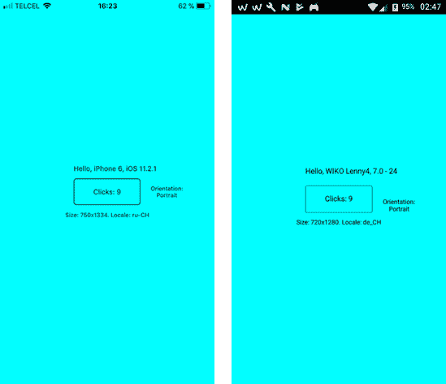

在本书中，我们将看到如何用可定制的脚本语言开发本地移动应用程序。在我之前的电子书《简洁地实现定制语言》中，我展示了如何创建这种可定制的语言。为了简洁起见，我将这种语言称为 CSCS(c#中的可定制脚本)。我以前的电子书不是这本书的先决条件，尽管它是一本“很好拥有的书”，因为它有一些关于 CSCS 语言的细节，我们不会在这本书里讨论。

以下是我们将介绍的内容:

*   如何用脚本语言为 iOS 和安卓编写原生移动应用？
*   如何以编程方式在屏幕上放置小部件(不需要故事板、XML 或 XAML——这都是用简单的脚本语言)。
*   如何向 CSCS 添加自定义小部件。
*   如何在 CSCS 实现基本功能:文本到语音和语音识别、应用内购买、安排活动等。
*   如何添加可以在 CSCS 使用的其他 Xamarin 框架和 NuGet 包。
*   如何在 CSCS 做单元测试？
*   如何从 CSCS 调用本机 C#代码并返回结果。
*   纯 CSCS 编写的完整应用程序示例。

基础开发平台将是微软 Visual Studio(无论是在 Windows 上还是在 macOS 上)和 Xamarin。我个人在 macOS 上使用免费的一个，Visual Studio Community 2017。

CSCS 语言并不一定只能用于开发移动应用。它还可以作为一个补充，方便创建通用小部件，它们的位置，以及任何其他功能-CSCS 是 100%可定制的。

你也可以在 CSCS 编写整个应用程序——我是用多语言应用程序完成的。相同的 CSCS 代码用于 [iOS](https://itunes.apple.com/app/ilanguage/id968947584) 和[安卓](https://play.google.com/store/apps/details?id=ch.ilanguage.android)。iLanguage 应用的代码在[源代码下载](https://github.com/vassilych/mobile)中——入口点是 **iLanguage.cscs** 文件，它导入了一些其他的 cscs 文件。

我还写了一个应用，在 [iOS](https://itunes.apple.com/app/cscs-native-scripting/id1358886733) 和[安卓](https://play.google.com/store/apps/details?id=ch.cscs.vk)上测试 CSCS 脚本。你可以测试你在这本书里看到的所有脚本，也可以试验你自己的。应用程序本身显然也是用 CSCS 写的。源代码在 **cscs.cscs** 文件中。

## 移动的优势

为什么要用脚本语言写应用？

*   编码要少得多。正如您将在本书中看到的，只需几行代码就可以在屏幕上放置一个小部件，并用一些数据和图像填充它。
*   iOS 和安卓都使用相同的代码。您还会看到，其他平台，如视窗手机，也可以很容易地添加到 CSCS。
*   即使 Xamarin。在 iOS 和 Android 之间，表单可以共享多达 75%的公共代码，如果只使用公共控件的话，甚至更多，CSCS 走得更远，因为它更容易添加多个平台共享的功能。一旦在本机代码上有了 C#包装器，就可以在所有平台的幕后使用相同的 CSCS 代码来调用它们。
*   更快的调试:调试应用程序时不需要重新编译代码，因为更改是在脚本部分完成的，而不是在 C#中。
*   CSCS 解析器不仅是开源的，而且包含在每个项目中，因此很容易修改现有的功能或动态添加新的功能——将它与 C#或 Python 进行比较。

代码清单 1 包含 CSCS 代码，用于创建一些标签、一个按钮和一个当用户点击按钮时触发的事件。

 1:“你好，世界！”在 CSCS

```cs
  AutoScale();
  SetBackgroundColor("cyan");

  locClickme = GetLocation("ROOT", "CENTER", "ROOT", "CENTER");
  AddButton(locClickme, "buttonClickme", "Click me", 200, 80);
  AddAction(buttonClickme, "clickme_click");
  SetFontSize(buttonClickme, 12);

  locVersionLabel = GetLocation(buttonClickme, "ALIGN_LEFT",

     buttonClickme, "TOP");
  AddLabel(locVersionLabel, "versionLabel", "", 360, 60);
  SetFontSize(versionLabel, 12);

  locSizeLabel = GetLocation(buttonClickme, "CENTER",

   buttonClickme, "BOTTOM");
  AddLabel(locSizeLabel, "sizeLabel", "", 360, 60);
  SetFontSize(sizeLabel, 10);

  locOrientationLabel = GetLocation(buttonClickme, "RIGHT",

   buttonClickme, "CENTER");
  AddLabel(locOrientationLabel, "orientationLabel", "", 160, 80);
  SetFontSize(orientationLabel, 10);

  clicks = 0;
  function clickme_click(sender, arg)
  {
    clicks++;
    if (clicks == 1) {
      SetText(versionLabel, "Hello, " + _DEVICE_INFO_ + ", " +
                            _VERSION_INFO_, "left");
    } elif (clicks == 2) {
      SetText(sizeLabel, "Size: " + DisplayWidth + "x" + DisplayHeight +
                         ". Locale: " + GetDeviceLocale(), "center");
    } elif (clicks == 3) {
      SetText(orientationLabel, "Orientation: " + Orientation, "center");
    } else {
      SetText(buttonClickme, "Clicks: " + clicks, "center");
    }
  }

```

查看运行“你好，世界”的结果图 1 中实际设备上的脚本。左边的图片显示它在 iPhone 6 上运行，右边的图片显示它在 Wiko Lenny4 安卓手机上运行。



 1:运行“你好，世界！”iPhone(左)和安卓(右)的脚本

让我们分析代码清单 1。`AutoScale()`根据屏幕分辨率缩放小部件。

|  | 提示:使用`AutoScale()`功能，宽度为 960 像素的设备上的 widget 宽度将是宽度为 480 像素的设备上的两倍。 |

您还可以使用每个小部件的自动缩放功能。我们将在下一章看到关于这个函数的更多细节。

`SetBackgroundColor("cyan")`会改变运行设备上的背景颜色。还有`SetBackground(imageName)`功能，设置一个图像作为背景。

接下来的两行创建一个位置和一个按钮，将放置在该位置:
 `locClickme = GetLocation(``"ROOT"``"CENTER"``"ROOT"``"CENTER"`)；
添加按钮(locClickme、`"buttonClickme"`、`"Click me"`、`200`、`80`)；

在屏幕上创建位置的一般签名如下:

GetLocation(水平参照，PlacementX，

垂直参考，位置；

水平或垂直参考只是屏幕上的一些其他小部件，或者一个`ROOT`，意思是主屏幕。

要将操作与单击按钮的事件联系起来，可以使用以下功能:

 `AddAction(buttonClickme,` `"clickme_click"`)；

回调函数，在我们的例子`clickme_click`中，总是有两个参数，一个发送者和一个参数。正如你所看到的，这个 CSCS 的概念是从 C#借来的，其他几个也是。

`clickme_click()`函数对其他函数有一些调用，即:`_DEVICE_INFO_`、`_VERSION_INFO_`、`DisplayWidth`、`DisplayHeight`、`GetDeviceLocale`和`Orientation`。

所有这些功能都是用 C#实现的。它们都不需要参数——在这种情况下，函数名后面的左括号和右括号是可选的。稍后我们将讨论其中一些功能的实现。

就语法而言，CSCS 是 Python 和 C#的混合体。但是 CSCS 不是面向对象的，尽管它有一些面向对象语言的特征。其中之一是多态性:有许多 CSCS 函数接受不同的小部件作为参数，如`SetFontColor()`、`SetValue()`、`SetText()`和许多其他函数。稍后我们将讨论这些功能。

CSCS 语言是用 C#实现的，它基于*分裂合并*算法。让我们简单回顾一下分裂合并算法，它构成了 CSCS 的基础。你可以在这里查看完整的描述[。](https://www.syncfusion.com/resources/techportal/details/ebooks/implementing-a-custom-language)

该算法由两个步骤组成。在第一步中，包含表达式的字符串被拆分成所谓的“变量”列表每个变量都由一个数字或一个字符串以及一个必须应用于它的操作组成。数字在内部表示为双精度数，因此本质上，它们可以是整数或布尔数。

数字和字符串的操作是不同的。对于数字，动作可以是我们可以用数字做的所有可能的操作，例如， **+** 、**–**、 ***** 、 **/** 或 **%** ，布尔运算符(**！**、 **& &** 、**|**)和按位运算( **&** 、 **|** 、 **^** )。对于字符串，操作可以是 **+** (字符串连接)或布尔比较。为了方便起见，我们将列表中最后一个变量的动作表示为 **)** 。

只要我们在表达式字符串中获得任何函数或左括号，我们就递归地将整个拆分合并算法应用于括号中的表达式或函数，然后用计算结果替换它们。

在第一步结束时，我们将有一个变量列表，每个变量由一个数字或一个字符串以及一个将要应用的操作组成。

在第二步中，我们合并第一步中创建的变量列表。该列表从列表中的第一个变量开始，一个接一个地合并。合并意味着将左变量的动作应用于左变量和右变量的值。结果变量将具有与右侧变量相同的操作。

只有当左变量的动作优先级大于或等于右变量的动作优先级时(例如乘法优先级大于加法优先级)，才能合并变量。如果两个变量不能合并，我们暂时移到右下一个变量，以便尝试将其与旁边的变量合并，以此类推，递归进行。一旦右边的变量与右边的变量合并，我们就返回到原来的左边变量，并尝试将其与新创建的右边变量重新合并。

最终，我们将能够将整个列表合并成一个变量，因为迟早我们会到达列表中优先级最低的最后一个变量，因此，可以与其左侧的任何变量合并。剩余变量的值将是最终结果。

##  功能的示例

让我们看一个您在代码清单 1 中看到的`_DEVICE_INFO_`函数实现的例子。该功能的预期结果是正在使用的设备的名称(例如，iPhone 6 或 Wiko Lenny4)。

向 CSCS 添加新功能只需两步:

1.  实现从`ParserFunction`类派生的类的`Evaluate()`方法。
2.  向解析器注册上一步实现的类。

iOS 和安卓的实现是不同的。代码清单 2 有一个安卓实现。不幸的是，令人惊讶的是，iOS 的实现要复杂得多，至少从 iOS 11.2 开始是这样，并且将被跳过(好奇的读者可以在附带的源代码中查看，可以下载)。

 2:安卓 GetDeviceInfoFunction 类的实现

```cs
  class GetDeviceInfoFunction: ParserFunction
  {
    protected override Variable Evaluate(ParsingScript script)
    {
      string deviceName = Android.OS.Build.Brand;
      string model     
  = Android.OS.Build.Model;
      if (!model.Contains("Android")) {
        // Simulators have "Android" in both, Brand and Model.
        deviceName += " " + model;
      }

      return new Variable(deviceName);
    }
  }

```

一旦实现了从`ParserFunction`类派生的类，我们可以按如下方式向解析器注册它:

`"_DEVICE_INFO_"`注册功能(`"_DEVICE_INFO_"`，

`new``GetDeviceInfoFunction`())；

一般签名是:

`ParserFunction`。RegisterFunction(functionName，aParserFunction)；

这样，您可以向解析器注册任何函数。我们将在这本书的后面看到更多这样的例子。

## 摘要

在本章中，我们看到了分割合并算法，以及如何使用它来实现典型的 CSCS 函数。这个算法在所有 CSCS 函数的幕后使用，但是你不需要知道它就可以直接使用它——它都是由 CSCS 解析器在幕后完成的。

在下一章中，我们将看到可用于 CSCS 定制脚本的 Xamarin 项目的整体结构。