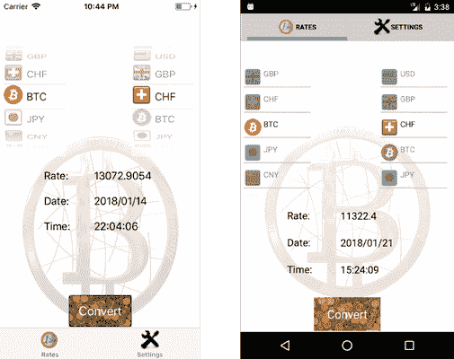
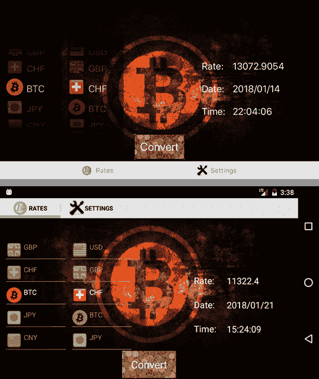

不同的框架使用不同的布局方法在屏幕上放置小部件——大多数允许您以编程方式在屏幕上放置小部件。许多还允许您在屏幕上的任何地方直观地拖放小部件。

为了用 XCode 开发 iOS 应用，苹果创造了[自动布局](https://developer.apple.com/library/content/documentation/UserExperience/Conceptual/AutolayoutPG/index.html)概念和故事板。小部件根据它们之间的约束被放置在屏幕上。当您在设备或模拟器上运行应用程序时，布局可能看起来与您在故事板上看到的不同，在故事板上，您放下了小部件。这是因为不同设备的故事板大小不同。

对于安卓开发，布局通常是通过定义 [XML 布局文件](https://developer.android.com/guide/topics/ui/declaring-layout.html#write)中的放置规则来创建的。Xamarin。表单使用 [XAML 文件](https://developer.xamarin.com/guides/xamarin-forms/xaml/xaml-basics/getting_started_with_xaml/)。

对于 CSCS 开发，我们不会有熟悉的拖放功能。所有小部件的放置都是通过编程完成的。安卓和 iOS 的代码是一样的。

作为交换，我们将有更多的控制权来放置小部件。学习曲线更快——没有 XML 模式，没有 XAML 文件，也没有自动布局(我个人认为任何在一周内理解自动布局的可行概念的人都是我们这个时代的天才)。

对于布局定义，我混合使用了 iOS 和安卓的方法。从自动布局中，我应用了以下内容——对于唯一的小部件位置，我需要有三个概念:

*   小部件水平放置(相对于其他小部件或主窗口)。
*   小部件垂直放置(相对于其他小部件或主窗口)。
*   小部件大小。

小部件的大小可以是绝对的，也可以是相对的。在后一种情况下，它将根据设备大小自动扩展或收缩。

就这样！我不知道为什么在 iOS 和安卓系统中，水平和垂直放置被允许多次定义，并且不一致，导致冲突；这些冲突可能会在运行时得到解决，并产生意外的结果。在 CSCS，布局设计(工作原理)不可能有冲突。

对于实现，我采用了类似于安卓中[相对布局](https://developer.android.com/guide/topics/ui/layout/relative.html)概念的方法。与`RelativeLayout`不同的是，小部件放置参数不可能有多个定义——在安卓系统中，你可以使用`ApplyRule()`方法无限次设置小部件放置规则，安卓系统不会抱怨任何矛盾的规则。

现在让我们从实现开始。以下部分内容已在[代码杂志](http://www.codemag.com/Article/1711081/Developing-Cross-Platform-Native-Apps-with-a-Functional-Scripting-Language)和 [MSDN 杂志](https://msdn.microsoft.com/en-us/magazine/mt829272.aspx)上发表。

CSCS 的小部件定义有一个或两个语句。第一条语句是位置的定义，即放置小部件的位置，第二条语句是实际的小部件定义，包括其大小。

|  | 提示:相同的位置可以用于不同的小部件。 |

一个场景是向用户显示位于同一位置的多个小部件，一次一个——一个例子显示在 **sfscript.cscs** 中。

我们已经在代码清单 1 中看到了一个放置小部件的例子:

locsizeelabel = get location(button clickme，`"CENTER"`，

buttonClickme，`"BOTTOM"`)； `AddLabel(locSizeLabel,` `"sizeLabel"``""``360``60`)；

位置命令的一般语法如下:

`GetLocation(`水平参考，胎盘，

垂直参照，放置〔t0〕

`AdjustmentX = 0, AdjustmentY = 0,`

`UseScale = true, ScaleValue = 0.0,`

`Parent = null);`

以下是参数的含义:

*   `HorizontalReference`:水平放置的另一个小部件的名称。它可以是字符串`ROOT`，意思是父小部件或主屏幕。
*   `PlacementX`:相对于`HorizontalReference`中微件的水平放置。我们将在下面讨论可能的值。
*   `VerticalReference`:垂直放置的另一个小部件的名称。它可以是字符串`ROOT`，意思是父小部件或主屏幕。
*   `PlacementY`:相对于`VerticalReference`中微件的垂直位置。
*   `AdjustmentX`:小部件必须水平移动的像素数(这个数字可以是相对的，取决于我们下面将要讨论的`AutoScale`选项)。也可以是负的:正的方向从左到右。
*   `AdjustmentY`:小部件必须垂直移动的像素数。也可以是负面的:正面的方向是从上到下的。另见下文`AutoScale`。
*   `UseScale`:是否对小部件应用缩放选项。如果`true`，将使用接下来讨论的`ScaleValue`中规定的调整。
*   `ScaleValue`:用于调整该小部件大小的度量。它会覆盖为`AutoScale()`函数提供的参数值。
*   `Parent`:这个小部件的父级。如果为空，小部件将被添加到安卓的主布局或 iOS 的根视图控制器视图中。

`PlacementX`和`PlacementY`参数的可能值与`Android` `RelativeLayout.LayoutParams`类的常数非常相似。

它们可以是以下任意一种:`CENTER`、`LEFT`、`RIGHT`、`TOP`、`BOTTOM, ALIGN_LEFT`、`ALIGN_RIGHT`、`ALIGN_TOP`、`ALIGN_BOTTOM`、`ALIGN_PARENT_LEFT`、`ALIGN_PARENT_RIGHT`、`ALIGN_PARENT_TOP`或`ALIGN_PARENT_BOTTOM`。

`GetLocation()`功能既适用于 iOS，也适用于安卓。查看代码清单 11 中 iOS 的实现。安卓的实现也类似。

 11:在 iOS 上实现 GetLocationFunction 类

```cs
  public class GetLocationFunction : ParserFunction
  {
    protected override Variable Evaluate(ParsingScript script)
    {
      List<Variable> args = script.GetFunctionArgs(); 
      Utils.CheckArgs(args.Count, 4, m_name);

      string viewNameX = args[0].AsString();
      string ruleStrX  = args[1].AsString();
      string viewNameY = args[2].AsString();
      string ruleStrY  = args[3].AsString();

      int leftMargin  
  = Utils.GetSafeInt(args, 4);
      int topMargin 
    = Utils.GetSafeInt(args, 5);

      bool autoResize 
  = Utils.GetSafeInt(args, 6, 1) == 1;
      if (autoResize) {
        double multiplier = Utils.GetSafeDouble(args, 7);
        AutoScaleFunction.TransformSizes(ref leftMargin, ref topMargin,
                     (int)UtilsiOS.GetRealScreenWidth(), multiplier);
      }

      Variable parentView = Utils.GetSafeVariable(args, 8, null);

      UIView referenceViewX = iOSVariable.GetView(viewNameX, script);
      UIView referenceViewY = iOSVariable.GetView(viewNameY, script);
      iOSVariable location = new iOSVariable(UIVariable.UIType.LOCATION,

  viewNameX + viewNameY, referenceViewX, referenceViewY);

      location.SetRules(ruleStrX, ruleStrY);
      location.ParentView = parentView as UIVariable;

      double screenRatio = UtilsiOS.GetScreenRatio();
      location.TranslationX = (int)(leftMargin / screenRatio);
      location.TranslationY = (int)(topMargin / screenRatio);

      return location;
    }
  }

```

要向解析器注册`GetLocation()`函数，必须在初始化阶段添加以下命令(参见代码清单 4):

`ParserFunction`。寄存器功能(`"GetLocation"`、`new``GetLocationFunction`)；

## 小部件

一旦我们有了位置，我们就可以创建一个小部件。该功能的一般结构是:

AddWidget(widgetType、location、widgetName、initString、width、height)；

每个小部件类型都有此命令的快捷方式，例如:

AddLabel(位置、widgetName、initString、宽度、高度)； `AddButton(location, widgetName, initString, width, height);`
AddImageView(位置、widgetName、initString、宽度、高度)；

等等。调用上述函数相当于调用以下函数:

AddWidget( `"Label"`、位置、widgetName、initString、宽度、高度)； `AddWidget(` `"Button"`、位置、widgetName、initString、宽度、高度)；
添加 Widget( `"ImageView"`、位置、widgetName、initString、宽度、高度)；

以下是参数的含义:

*   `location`:上一节中定义的小部件的位置。
*   `widgetName`:小部件的名称。它将始终是一个全局变量，即使在函数内部使用。
*   `initString`:小部件的初始化参数。例如，它将是标签上的文本或按钮上的标题。
*   `width`:小部件的宽度。
*   `height`:小部件的高度。

查看代码清单 12 中`AddWidget()`函数实现的一个片段。实现是针对 iOS 的。安卓的实现非常相似。

12:AddWidgetFunction 类的一个片段

```cs
  public class AddWidgetFunction : ParserFunction
  {
    public AddWidgetFunction(string widgetType = "", string extras = "")
    {
      m_widgetType = widgetType;
      m_extras = extras;
    }
    protected override Variable Evaluate(ParsingScript script)
    {
      string widgetType = m_widgetType;
      int start = string.IsNullOrEmpty(widgetType) ? 1 : 0;
      List<Variable> args = script.GetFunctionArgs(); 
      Utils.CheckArgs(args.Count, 2 + start, m_name);

      if (start == 1) {
        widgetType = args[0].AsString();
        Utils.CheckNotEmpty(script, widgetType, m_name);
      }

      iOSVariable location = args[start] as iOSVariable;
      Utils.CheckNotNull(location, m_name);

      double screenRatio = UtilsiOS.GetScreenRatio();

      string varName = args[start + 1].AsString();
      string config = Utils.GetSafeString(args, start + 2);
      int width = (int)(Utils.GetSafeInt(args, start + 3) / screenRatio);
      int height = (int)(Utils.GetSafeInt(args, start + 4) / screenRatio);

      bool autoResize = Utils.GetSafeInt(args, start + 5, 1) == 1;
      if (autoResize) {
        double multiplier = Utils.GetSafeDouble(args, start + 6);
        AutoScaleFunction.TransformSizes(ref width, ref height,
        (int)UtilsiOS.GetRealScreenWidth(), multiplier);
      }

      CGSize parentSize = location.GetParentSize();

      location.X = UtilsiOS.String2Position(location.RuleX,
                      location.ViewX, location, parentSize, true);
      location.Y = UtilsiOS.String2Position(location.RuleY,
                      location.ViewY, location, parentSize, false);

      location.X += location.TranslationX;
      location.Y += location.TranslationY;

      CGRect rect = new CGRect(location.X, location.Y, width, height);

      iOSVariable widgetFunc = GetWidget(widgetType, varName,config,
  rect);
      var currView = location.GetParentView();
      currView.Add(widgetFunc.ViewX);

      iOSApp.AddView(widgetFunc);

      ParserFunction.AddGlobal(varName, new GetVarFunction(widgetFunc));
      return widgetFunc;
    }

    public static iOSVariable GetWidget(string widgetType,
                   string widgetName, string initArg, CGRect rect)
    {
      for (int i = 0; i < UIVariable.WidgetTypes.Count; i++) {
        iOSVariable var = UIVariable.WidgetTypes[i] as iOSVariable;
        var widget = var.GetWidget(widgetType, widgetName, initArg, rect);
        if (widget != null) {
          return widget;
        }
      }
      return null;
    }
  }

```

负责小部件实际创建的代码在`iOSVariable`类中。它的片段如代码清单 13 所示。

完整的实现，包括返回屏幕上一个实际点的函数`UtilsiOS.String2Position()`的实现，请参考附带的源代码。

13:IOs variable 的一个片段。GetWidget 方法

```cs
  public virtual iOSVariable GetWidget(string widgetType, string widgetName,                                      
  string initArg, CGRect rect)
  {
    UIVariable.UIType type = UIVariable.UIType.NONE;
    UIView widget = null;
    iOSVariable widgetFunc = null; 
    switch (widgetType) {
      case "Button":
        type = UIVariable.UIType.BUTTON;
        widget = new UIButton(rect);      
        ((UIButton)widget).SetTitle(initArg, UIControlState.Normal);
        AddBorderFunction.AddBorder(widget);
        break;
      case "Label":
        type = UIVariable.UIType.LABEL;
        widget = new UILabel(rect);
        ((UILabel)widget).Text = initArg;
        break;
      case "TextEdit":
      //All other widgets go here ...
    }
    if (widgetFunc == null) {

      widgetFunc = new iOSVariable(type, widgetName, widget);
    }
    return widgetFunc;
  }

```

要向解析器注册添加新小部件的功能，必须在初始化阶段添加以下命令(参见代码清单 4):

`ParserFunction`。寄存器功能(`"AddWidget"`、`new``AddWidgetFunction`)； ``ParserFunction`。寄存器功能(` `"AddButton"`，

`new``AddWidgetFunction`(`"Button"`)； ``ParserFunction`。注册功能(`)T4、

`new``AddWidgetFunction`(`"Label"`)；

等等，对于每个小部件。

## 变化

编写一个在不同设备方向上有不同布局的应用程序并不那么简单。即使是重量级公司，如领英、脸书、亚马逊、优步、天气频道和许多其他公司，也只在肖像模式下实现了他们的应用程序(至少在撰写本文时，iOS 是这样的)；当您更改设备方向时，这些应用程序不会发生任何变化。

在本节中，我们的目标是在设备方向改变时简化布局的更改。

在这里，我们将看到安卓实现(您可以在附带的源代码中找到 iOS 实现)。

首先，我们必须在`MainActivity`类定义中增加以下内容:

ConfigurationChanges = `ConfigChanges`。屏显|`ConfigChanges`。方位|

键盘隐藏

基本上，这意味着应用程序将自行处理方向变化。如果没有这种变化，`MainActivity.OnCreate()`方法会在每次方向发生变化时被调用(也有一些其他情况下会被调用，尤其是当应用程序从后台回到前台时)。

接下来，`MainActivity.OnConfigurationChange()`方法被覆盖:

`public``override``void`【oncconfiguration changed】`Configuration`【new config】 `{`
【honorientation change】？`.Invoke(newConfig.Orientation ==`

`Orientation.Portrait ? "Portrait" : "Landscape")`；`base`。onconfigurationchanged(新建配置)：

}

它使用`OnOrientationChange`事件处理程序，定义如下:

`public``delegate``void``OrientationChange`(`string`new orientation)；

`public` `static` `OrientationChange`荣誉改变；

现在，我们已经准备好注册方向改变时触发的 CSCS 函数:

`"RegisterOrientationChange"`注册功能(`"RegisterOrientationChange"`，

`new``RegisterOrientationChangeFunction`())；

代码清单 14 显示了`RegisterOrientationChangeFunction`类的实现。

14:registororientstatchangeffect 类的实现

```cs
  public class RegisterOrientationChangeFunction : ParserFunction
  {
    static string m_actionPortrait;
    static string m_actionLandscape;
    static string m_currentOrientation;

    protected override Variable Evaluate(ParsingScript script)
    {
      List<Variable> args = script.GetFunctionArgs(); 
      Utils.CheckArgs(args.Count, 2, m_name);

      m_actionPortrait  = Utils.GetSafeString(args, 0);
      m_actionLandscape = Utils.GetSafeString(args, 1);
      bool startNow    
  = Utils.GetSafeInt(args, 2, 1) != 0;

      if (startNow) {
        PerformAction(MainActivity.Orientation, true);
      }

      MainActivity.OnOrientationChange += (newOrientation) => {
        DeviceRotated();
      };
      return Variable.EmptyInstance;
    }
    static void DeviceRotated()
    {
      string currentOrientation = MainActivity.Orientation;
      if (m_currentOrientation == currentOrientation) {
        return;
      }

      PerformAction(currentOrientation);
    }
    static void PerformAction(string orientation, bool isInit = false)
    {
      m_currentOrientation = orientation;
      int currentTab = MainActivity.CurrentTabId;

      if (!isInit) {
        MainActivity.RemoveAll();
      }

      string action = orientation.Contains("Portrait") ? 
                                  m_actionPortrait: m_actionLandscape;

      UIVariable.GetAction(action, "\"ROOT\"",
              "\"" + (isInit ? "init" : m_currentOrientation) + "\"");

      if (!isInit && currentTab >= 0) {
        MainActivity.TheView.ChangeTab(currentTab);
      }
    }
  }

```

`UIVariable.GetAction()`功能执行传递的动作。该动作通常是 CSCS 函数的名称。下一节显示了一个在方向改变时改变器件布局的例子。

## 示例:货币转换器

在这一部分，我们将从头开始在 CSCS 创建货币转换器应用程序。作为汇率的来源，我们将使用[currencylayer.com](https://currencylayer.com/)服务。他们的网站提供易于使用的网络服务，每月前 1000 个请求是免费提供的。它还提供了比特币的汇率，这将是这个应用程序的主题。要获取数据，您需要一个唯一的密钥，每个请求都必须提供这个密钥。你可以在[注册他们的网站](https://currencylayer.com/signup?plan=1)时获得这个密钥。

让我们首先看看图 3 中的应用在纵向模式下的外观，以及图 4 中的应用在横向模式下的外观，对于 iPhone 和安卓手机都是如此。



3:iOS(左)和安卓(右)人像模式下的货币转换器



4:iOS(上图)和安卓(下图)风景模式下的货币转换器

代码清单 15 包含完整的应用程序实现。函数`on_about`和`on_refresh`是通过`AddAction`函数向解析器注册的回调。

当用户点击**设置**标签中的按钮【T2 供电】时，将执行`on_about`功能(该标签未显示在截图上)。当用户点击**转换**按钮时，会调用`on_refresh`功能，此时会进行实际的费率计算。

 15:货币应用在 CSCS 的实现

```cs
  function on_about(sender, arg)
  {
    OpenUrl("http://www.currencylayer.com");
  }

  function on_refresh(sender, arg)
  {
    currency1 = GetText(cbCurrency);
    currency2 = GetText(cbCurrency2);
    currency_request(currency1, currency2);
  }

  function currency_request(currency1, currency2)
  {
    if (currency1 == currency2) {
      // A shortcut for the same currency:
      time = Now("HH:mm:ss");
      date = Now("yyyy/MM/dd");
      rate = 1;
    } else {
      url = apiUrl + currency1 + "," + currency2;
      try {
        data = WebRequest(url);
      } catch (exception) {
        WriteConsole(exception.Stack);
        ShowToast("Couldn't get rates. " + exception);
        SetText(labelRateValue, "Error");
        return;
      }

      // To parse: {"success":true,"timestamp":1515937446,"source":"USD","quotes":{"USDEUR":0.819304,"USDCHF":0.967604}}
      WriteConsole(data);

      rate = -1;
      try {
        timestamp = StrBetween(data, "\"timestamp\":", ",");
        time = Timestamp(timestamp, "HH:mm:ss");
        date = Timestamp(timestamp, "yyyy/MM/dd");
        rate1 = double(StrBetweenAny(data, "USD" + currency1 + "\":", ",}"));
        rate2 = double(StrBetweenAny(data, "USD" + currency2 + "\":", ",}"));
        WriteConsole("Extracted " + rate1 + "," + rate2);
        if (rate1 > 0) {
          rate = Substring(decimal(rate2 / rate1), 0, 10);
        }
      } catch (exception) {
        WriteConsole(exception.Stack);
        ShowToast("Couldn't get rates. " + exception);
        SetText(labelRateValue, "Error");
        return;
      }
    }

    SetText(labelRateValue, rate);
    SetText(labelDateValue, date);
    SetText(labelTimeValue, time);
  }

  function init()
  {
    currencies = { "EUR",   "USD",   "GBP",   "CHF",   "BTC", 
  "JPY",
                   "CNY",   "MXN",   "RUB",   "BRL",   "SAR"};
    flags      = { "eu_EU", "en_US", "en_GB", "de_CH", "BTC", 
  "ja_JP",
                   "zh_CN", "es_MX", "ru_RU", "pt_BR", "ar_SA"};

    AddWidgetData(cbCurrency, currencies);
    AddWidgetImages(cbCurrency, flags);
    SetSize(cbCurrency, 80, 40);
    SetText(cbCurrency, "BTC");

    AddWidgetData(cbCurrency2, currencies);
    AddWidgetImages(cbCurrency2, flags);
    SetSize(cbCurrency2, 80, 40);
    SetText(cbCurrency2, "CHF");

    SetImage(buttonRefresh, "coins");
    AddAction(buttonRefresh, "on_refresh");
    SetFontColor(buttonRefresh, "white");
    SetFontSize(buttonRefresh, 20);

    AddAction(aboutButton, "on_about");
    SetText(aboutButton, "Powered by currencylayer.com");

    labelsFontSize = 17;
    SetFontSize(aboutButton,    labelsFontSize);
    SetFontSize(labelRate,      labelsFontSize);
    SetFontSize(labelDate,      labelsFontSize);
    SetFontSize(labelTime,      labelsFontSize);
    SetFontSize(labelRateValue, labelsFontSize);
    SetFontSize(labelDateValue, labelsFontSize);
    SetFontSize(labelTimeValue, labelsFontSize);
  }

  function on_portrait(sender, arg)
  {
    AddOrSelectTab("Rates", "rates_active.png", "rates_inactive.png");
    SetBackground("bitcoin_portrait.png");

    locCurrency = GetLocation("ROOT", "LEFT", "ROOT", "TOP", 10, 80);
    AddSfPicker(locCurrency, "cbCurrency", "75", 200, 380);
    SetBackgroundColor(cbCurrency, "white", 0);
    SetFontColor(cbCurrency, "black");

    locCurrency2 = GetLocation("ROOT", "RIGHT", cbCurrency, "CENTER", -20);
    AddSfPicker(locCurrency2, "cbCurrency2", "75", 200, 380);
    SetBackgroundColor(cbCurrency2, "white", 0);
    SetFontColor(cbCurrency2, "black");

    locRateLabel = GetLocation("ROOT", "CENTER", cbCurrency, "BOTTOM",
                               -80, 20);
    AddLabel(locRateLabel, "labelRate", "Rate:", 200, 80);
    SetFontColor(labelRate, "black");

    locRateValue = GetLocation("ROOT", "CENTER", labelRate, "CENTER", 100);
    AddLabel(locRateValue, "labelRateValue", "", 240, 80);
    SetFontColor(labelRateValue, "black");

    locDateLabel = GetLocation("ROOT", "CENTER", labelRate, "BOTTOM", -80);
    AddLabel(locDateLabel, "labelDate", "Date:", 200, 80);
    SetFontColor(labelDate, "black");

    locDateValue = GetLocation("ROOT", "CENTER", labelDate, "CENTER", 100);
    AddLabel(locDateValue, "labelDateValue", "", 240, 80);
    SetFontColor(labelDateValue, "black");

    locTimeLabel = GetLocation("ROOT", "CENTER", labelDate, "BOTTOM", -80);
    AddLabel(locTimeLabel, "labelTime", "Time:", 200, 80);
    SetFontColor(labelTime, "black");

    locTimeValue = GetLocation("ROOT", "CENTER", labelTime, "CENTER", 100);
    AddLabel(locTimeValue, "labelTimeValue", "", 240, 80);
    SetFontColor(labelTimeValue, "black");

    locRefresh = GetLocation("ROOT", "CENTER", "ROOT", "BOTTOM", 0, -4);
    AddButton(locRefresh, "buttonRefresh", "Convert", 200, 100);

    AddOrSelectTab("Settings", "settings_active.png", "settings_inactive.png");
    locAbout = GetLocation("ROOT", "CENTER", "ROOT", "BOTTOM", 0, -4);
    AddButton(locAbout, "aboutButton", "", 360, 100);
    AddBorder(aboutButton, 1, 5, "black");
    SetFontColor(aboutButton, "black");
  }

  function on_landscape(sender, arg)
  {
    AddOrSelectTab("Rates", "rates_active.png", "rates_inactive.png");
    SetBackground("bitcoin_landscape.png");

    locCurrency = GetLocation("ROOT", "LEFT", "ROOT", "CENTER", 20);
    AddSfPicker(locCurrency, "cbCurrency", "75", 200, 380);
    SetBackgroundColor(cbCurrency, "black", 0);
    SetFontColor(cbCurrency, "white");

    locCurren2 = GetLocation(cbCurrency, "RIGHT", cbCurrency, "CENTER", 20);
    AddSfPicker(locCurren2, "cbCurrency2", "75", 200, 380);
    SetBackgroundColor(cbCurrency2, "black", 0);
    SetFontColor(cbCurrency2, "white");

    locDateLabel = GetLocation("ROOT", "CENTER", "ROOT", "CENTER", 200);
    AddLabel(locDateLabel, "labelDate", "Date:", 100, 80);
    SetFontColor(labelDate, "white");

    locDateValue = GetLocation(labelDate, "RIGHT", labelDate, "CENTER", 10);
    AddLabel(locDateValue, "labelDateValue", "", 220, 80);
    SetFontColor(labelDateValue, "white");

    locRateLabel = GetLocation("ROOT", "CENTER", labelDate, "TOP", 200);
    AddLabel(locRateLabel, "labelRate", "Rate:", 100, 80);
    SetFontColor(labelRate, "white");

    locRateValue = GetLocation(labelRate, "RIGHT", labelRate, "CENTER", 10);
    AddLabel(locRateValue, "labelRateValue", "", 220, 80);
    SetFontColor(labelRateValue, "white");

    locTimeLabel = GetLocation("ROOT", "CENTER", labelDate, "BOTTOM", 200);
    AddLabel(locTimeLabel, "labelTime", "Time:", 100, 80);
    SetFontColor(labelTime, "white");

    locTimeValue = GetLocation(labelTime, "RIGHT", labelTime, "CENTER", 10);
    AddLabel(locTimeValue, "labelTimeValue", "", 220, 80);
    SetFontColor(labelTimeValue, "white");

    locRefresh = GetLocation("ROOT", "CENTER", "ROOT", "BOTTOM", 0, -4);
    AddButton(locRefresh, "buttonRefresh", "Convert", 180, 90);

    AddOrSelectTab("Settings", "settings_active.png",
                               "settings_inactive.png");
    locAbout = GetLocation("ROOT", "CENTER", "ROOT", "BOTTOM", 0, -8);
    AddButton(locAbout, "aboutButton", "", 360, 100);
    AddBorder(aboutButton, 1, 5, "white");
    SetFontColor(aboutButton, "white");
  }

  AutoScale();

  key = "<Place
  Your CurrencyLayer.com Key Here>";
  apiUrl = "http://apilayer.net/api/live?access_key=" + key + "&currencies=";

  RegisterOrientationChange("on_portrait", "on_landscape");
  init();

  if (Orientation == "Portrait") {
    on_portrait("", "");
  } else {
    on_landscape("", "");
  }

  SelectTab(0);

```

这里是 CSCS 功能，当设备处于纵向模式时注册`on_portrait`功能，在横向模式时注册`on_landscape`功能:

寄存器定向变化(“T0”、“t1”)；

请注意，使用 CSCS，您可以在选项卡处于活动或非活动状态时，轻松地为选项卡配置不同的图像。添加新选项卡的功能是:

添加选项卡(选项卡名称，图片活动，图片非活动)；

使用以下功能:

添加选择选项卡(选项卡名称，图片活动，图片非活动)；

当选项卡已经存在时，它不会被添加，而只是被选中来放置小部件。图 5 显示了 iOS 设备的活动和非活动标签。

``

5:iOS 上的活动和非活动标签

你可能注意到了我们在`AddSfPicker`功能中使用的有趣的货币拾取器，尤其是在安卓系统上。

这些不是标准的选择器，而是 Syncfusion 提供的选择器。稍后我将解释如何添加 Syncfusion 小部件，但是现在，请注意，它们在 CSCS 代码中被视为任何其他小部件。

## 摘要

在本章中，我们看到了如何以独立于平台的方式在屏幕上放置小部件。关键的概念是一个位置，在这里我们放置一个小部件。同一个位置可以重复用于放置不同的小部件。我们还看到了这种小部件放置方法如何用于设备方向的改变。

到目前为止，我们已经看到了大多数标准的 iOS 和安卓小部件。在下一章中，我们将看到如何在 CSCS 实现和使用定制小部件。