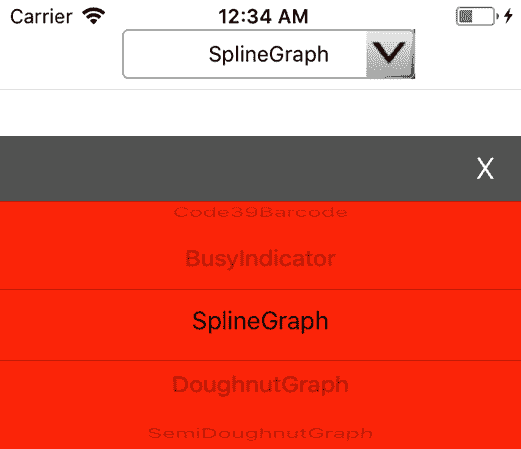
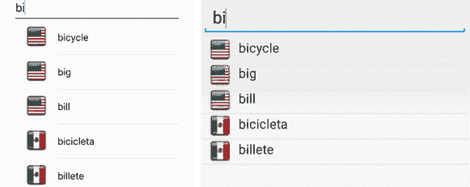

## 组合框

不幸的是，并不是所有的移动操作系统都有所有通用的小部件。其中，iOS 缺少一个组合框(也称为下拉菜单)，安卓缺少一个步进器。在这一节中，我们将看到如何向 iOS 添加一个组合框，您可以在附带的源代码中看到它是如何在 Android 上完成的。

添加自定义小部件有两种方法。第一种是从`UIVariable`类中派生出来，然后单独注册到解析器中。我们将在下一章中看到如何使用 Syncfusion 控件来实现这一点。如果您需要从构建中快速分离小部件类，这种方法是很好的。

创建自定义小部件的另一种方法是使其成为一等公民，在核心`iOSVariable.GetWidget()`方法中注册，如代码清单 13 所示。有关详细信息，请参见代码清单 16。

16:IOs variable 的一个片段。GetWidget()添加自定义 Widget

```cs
  public virtual iOSVariable GetWidget(string widgetType, string widgetName,                                      
  string initArg, CGRect rect)
  {
    //...
    switch (widgetType) {
      //...
      case "Combobox":
        type = UIVariable.UIType.COMBOBOX;
        widgetFunc = new iOSVariable(type, widgetName, widget);
        widgetFunc.CreateCombobox(rect, initArg);
        break;
      // Other widgets ...
    }
  }

```

在`iOSVariable.GetWidget()`方法中注册自定义小部件的好处是，考虑到标准的安卓组合框已经添加到`DroidVariable.GetWidget()`方法中，安卓和 iOS 都有统一的 CSCS 代码。

iOS 自定义组合框架构如下:它将实现为一个`UIButton`，包含一些文本和右侧的一个图像，显示一个箭头。这是在用户选择项目之前。用户一点击按钮选择一个项目，组合框就会转换成屏幕下方的`UIPicker`。这个`UIPicker`顶部会有一个小一点的按钮，点击后会选择`UIPicker`选项。这与在 iPhone 上使用 Safari 浏览器在网页上看到下拉菜单的情况非常相似。参见代码清单 17 中的实现细节。

17:IOs variable 的实现。CreateCombobox()方法

```cs
  public void CreateCombobox(CGRect rect, string argument)
  {
    UIView parent = GetParentView();

    UIView mainView  = AppDelegate.GetCurrentView();
    int mainHeight   = (int)mainView.Frame.Size. 
    int mainWidth    = (int)mainView.Frame.Size.Width;

    int pickerHeight = Math.Min(mainHeight / 3, MIN_HEIGHT);
    int pickerWidth  = Math.Min(mainWidth, MIN_WIDTH);
    int pickerY      = mainHeight - pickerHeight + 20;

    m_picker         = new UIPickerView();
    m_button         = new UIButton();
    m_button2        = new UIButton();

    m_button.Frame   = rect;

    m_picker.Frame   = new CGRect(0, pickerY, pickerWidth, pickerHeight);
    m_button2.Frame  = new CGRect(0, pickerY - 20, pickerWidth, 40);

    string alignment = "", color1 = "", color2 = "", closeLabel = "";
    Utils.Extract(argument, ref alignment, ref color1, ref color2,
                           ref closeLabel);
    m_alignment      = alignment;
    Tuple<UIControlContentHorizontalAlignment, UITextAlignment> al =
                          AlignTitleFunction.GetAlignment(alignment);

    m_viewY = new UIView();
    m_viewY.Frame = new CGRect(0, 0, mainWidth, mainHeight);

    TypePickerViewModel model = new TypePickerViewModel(
                                    AppDelegate.GetCurrentController());
    m_picker.ShowSelectionIndicator = true;
    m_picker.Hidden = true;
    m_picker.Model = model;

    if (!string.IsNullOrEmpty(color1)) {
      m_viewY.BackgroundColor = UtilsiOS.String2Color(color1);
      if (string.IsNullOrEmpty(color2)) {
        color2 = color1;
      }
      m_picker.BackgroundColor = UtilsiOS.String2Color(color2);
    }

    m_button.BackgroundColor = UIColor.Clear;
    m_button.SetTitleColor(UIColor.Black, UIControlState.Normal);
    m_button.Hidden = false;
    m_button.Layer.BorderWidth = 1;
    m_button.Layer.CornerRadius = 4;
    m_button.Layer.BorderColor = UIColor.LightGray.CGColor;
    UIImage img = UtilsiOS.CreateComboboxImage(rect);
    m_button.SetBackgroundImage(img, UIControlState.Normal);
    m_button.ImageView.ClipsToBounds = true;
    m_button.ContentMode = UIViewContentMode.Right;
    m_button.HorizontalAlignment = al.Item1;
    m_button.TouchUpInside += (sender, e) => {
      ResetCombos();
      m_button2.Hidden = false;
      m_picker.Hidden  = false;
      model = m_picker.Model as TypePickerViewModel;

      string text = GetText();
      int row = model.StringToRow(text);
      model.Selected(m_picker, (int)row, 0);
      mainView.BecomeFirstResponder();
      mainView.AddSubview(m_viewY);
    };

    if (string.IsNullOrEmpty(closeLabel)) {
      closeLabel = "X";
    }
    m_button2.SetTitle(closeLabel + "\t", UIControlState.Normal);
    m_button2.HorizontalAlignment =
        UIControlContentHorizontalAlignment.Right;
    m_button2.BackgroundColor = UIColor.FromRGB(100, 100, 100);
    m_button2.SetTitleColor(UIColor.White, UIControlState.Normal);
    m_button2.Hidden = true;
    m_button2.TouchUpInside += (sender, e) => {
      m_button2.Hidden = true;
      m_picker.Hidden = true;
      string text = model.SelectedText;
      SetText(text, alignment, true /* triggered */);
      ActionDelegate?.Invoke(WidgetName, text);

      m_viewY.RemoveFromSuperview();
      mainView.BecomeFirstResponder();
    };

    mainView.AddSubview(m_button);
    m_viewY.AddSubview(m_picker);
    m_viewY.AddSubview(m_button2);

    m_viewX = m_button;
    m_viewX.Tag = ++m_currentTag;
  }

```

代码清单 18 显示了在 CSCS 代码中使用组合框的一个例子。它将在屏幕顶部创建一个组合框小部件。`"center:red:clear"`初始化参数表示组合框中的文字居中，组合框(`UIPicker`)背景颜色为红色，屏幕上方的`UIButton`背景清晰(透明)。

 18:在 CSCS 代码中添加组合框

```cs
  locComboWidgets = GetLocation("ROOT", "CENTER", "ROOT", "TOP", 10, 0);
  AddCombobox(locComboWidgets, "comboWidgets", "center:red:clear", 360, 60);

  sfWidgets = {"CircularGauge", "DigitalGauge", "QRBarcode", "Code39Barcode",   
      "BusyIndicator","SplineGraph", "DoughnutGraph", "SemiDoughnutGraph",
      "DataGrid", "Picker", "Excel", "Pdf", "Word"};
  AddWidgetData(comboWidgets, sfWidgets, "", "center");

```

代码清单 18 中代码的结果如图 6 所示。

注意，我们不必使用`"center:red:clear"`初始化；这样做只是为了简洁。像这样调用通用的`SetValue()`和`SetBackgroundColor()`函数可以达到同样的效果:

setbackground color(combowidges，`"clear"`)；

SetValue（comboWidgets， `"alignment"` ， `"center"` ）;

SetValue（comboWidgets， `"backgroundcolorpicker"` ， `"red"` ）;

您也可以更改出现在`UIPicker`上方按钮上的 **X** 以及所有颜色。例如，如果您想让 **Done** 而不是 **X** 出现在绿色背景的黄色中，请使用以下 CSCS 代码:

SetValue（comboWidgets， `"backgroundcolorbutton2"` ， `"green"` ）; `SetValue(comboWidgets,` `"fontcolor2"` ， `"yellow"`）;
SetValue（组合 Widgets， `"text2"` ， `"Done"`）;



6:iOS 自定义组合框

为了向解析器注册我们的组合框小部件，使用了通常的语句(安卓系统上的标准组合框和 iOS 系统上的自定义组合框都使用了相同的语句):

`"AddCombobox"`注册功能(`"AddCombobox"`，

`new``AddWidgetFunction`(`"Combobox"`)；

自动完成是一项功能，在用户键入时提示整个单词或短语。自动完成的算法之一涉及 [trie](https://en.wikipedia.org/wiki/Trie) 数据结构(名称来自“re**trie**val”)；有时它也被称为*前缀树*。Trie 在搜索以给定前缀开头的字符串时非常有效。搜索或将字符串插入 trie 的时间复杂度最多是字符串的长度，因为对于字符串中的每个字母，都会插入一个新的树级(除非它已经存在于 trie 中)。

trie 本身不是用户界面元素；因此，我们可以通过扩展`Variable`类将其添加到 CSCS。有关详细信息，请参见代码清单 19。

19:Trie 实现的片段

```cs
  public class WordHint
  {
    string m_text;

    public int Id { get; }
    public string OriginalText { get; }
    public string Text { get { return m_text; } }

    public WordHint(string word, int id)
    {
      OriginalText = word;
      Id = id;
      m_text = UIUtils.RemovePrefix(OriginalText);
    }
  }

  public class TrieCell
  {
    string m_name;
    WordHint m_wordHint;

    Dictionary<string, TrieCell> m_children =
        new Dictionary<string, TrieCell>();

    public int Level { get; set; }
    public WordHint WordHint { get { return m_wordHint; } }
    public Dictionary<string, TrieCell> Children {get { return m_children; }}

    public TrieCell(string name = "", WordHint wordHint = null,
                    int level = 0)
    {
      if (wordHint != null && wordHint.Text == name) {
        m_wordHint = wordHint;
      }

      m_name = name;
      Level = level;
    }

    public bool AddChild(WordHint wordHint)
    {
      if (!string.IsNullOrEmpty(m_name) &&
  !wordHint.Text.StartsWith(
                        m_name, StringComparison.OrdinalIgnoreCase)) {
        return false;
      }

      int newLevel = Level + 1;

      bool lastChild = newLevel >= wordHint.Text.Length;

      string newName = lastChild ? wordHint.Text :
                                   wordHint.Text.Substring(0, newLevel);
      TrieCell oldChild = null;
      if (m_children.TryGetValue(newName, out oldChild)) {
        return oldChild.AddChild(wordHint);
      }

      TrieCell newChild = new TrieCell(newName, wordHint, newLevel);
      m_children[newName] = newChild;

      if (newLevel < wordHint.Text.Length) {
        // if there are still chars left, add a grandchild recursively.
        newChild.AddChild(wordHint);
      }

      return true;
    }
  }

  public class Trie : Variable
  {
    TrieCell m_root;

    public Trie(List<string> words)
    {
      m_root = new TrieCell();

      int index = 0;
      foreach (string word in words) {
        AddWord(word, index++);
      }
    }

    void AddWord(string word, int index)
    {
      WordHint hint = new WordHint(word, index);
      m_root.AddChild(hint);

      string text = hint.Text;
      int space = text.IndexOf(' ');
      while (space > 0) {
        string candidate = text.Substring(space + 1);
        if (!string.IsNullOrWhiteSpace(candidate)) {
          hint = new WordHint(candidate, index);
          m_root.AddChild(hint);
        }
        if (text.Length < space + 1) {
          break;
        }
        space = text.IndexOf(' ', space + 1);
      }
    }

    public void Search(string text, int max, List<WordHint> results)
    {
      text = UIUtils.RemovePrefix(text);
      TrieCell current = m_root;

      for (int level = 1; level <= text.Length && current != null; level++) {
        string substr = text.Substring(0, level);
        if (!current.Children.TryGetValue(substr, out current)) {
          current = null;
        }
      }

      if (current == null) {
        return; // passed text doesn't exist
      }
      AddAll(current, max, results);
    }

    void AddAll(TrieCell cell, int max, List<WordHint> results)
    {
      if (cell.WordHint != null && !cell.WordHint.Exists(results)) {
        results.Add(cell.WordHint);
      }
      if (results.Count >= max) {
        return;
      }

      foreach (var entry in cell.Children) {
        TrieCell child = entry.Value;
        AddAll(child, max, results);

        if (results.Count >= max) {
          return;
        }
      }
    }
  }

```

为了向解析器注册 trie，我们使用以下语句:

`ParserFunction`。RegisterFunction( `"GetTrie"`、`new`、`CreateTrieFunction`)； ``ParserFunction`。RegisterFunction(` `"SearchTrie"`、`new``SearchTrieFunction`)；

`CreateTrieFunction()`函数微不足道，因为它只是初始化 trie。查看代码清单 20 中 SearchTrieFunction 类的实现。

 20:搜索函数类的实现

```cs
  public class SearchTrieFunction : ParserFunction
  {
    protected override Variable Evaluate(ParsingScript script)
    {
      List<Variable> args = script.GetFunctionArgs(); 
      Utils.CheckArgs(args.Count, 2, m_name);

      Trie trie = Utils.GetSafeVariable(args, 0, null) as Trie;
      Utils.CheckNotNull(trie, m_name);

      string text = args[1].AsString();
      int max = Utils.GetSafeInt(args, 2, 10);

      List<WordHint> words = new List<WordHint>();
      trie.Search(text, max, words);

      List<Variable> results = new List<Variable>(words.Count);
      foreach (WordHint word in words) {
        results.Add(new Variable(word.Id));
      }

      return new Variable(results);
    }
  }

```

基本上，`SearchTrieFunction`创建并返回匹配单词的列表。该列表由单词标识组成，这些单词标识必须与单词相关联。代码清单 21 展示了如何实现。

 21:自动完成在 CSCS 的实现

```cs
  AutoScale(1.0);
  findMaxWords = 10;
  language1 = "en-US";
  language2 = "es-MX";
  words[language1] = {"bat", "bicycle", "big", "bill", "bone" };
  words[language2] = {"barba", "barco", "bicicleta", "billete", "bonito"};
  wordsFound   = {};
  countryPics  = {};

  locTextEdit = GetLocation("ROOT", "CENTER", "ROOT", "TOP", 0, 10);
  AddTextEdit(locTextEdit, "textEdit", "Type word dog", 480, 60);
  AddAction(textEdit,        "find_text");

  locListView = GetLocation("ROOT", "CENTER", textEdit, "BOTTOM", 0, 4);
  AddListView(locListView, "listView", "", 480, 720);
  SetVisible(listView, false);

  function find_text(sender, arg)
  {
    SetVisible(listView, false);
    text = GetText(textEdit);
    if (size(text) == 0) {
      return;
    }

    wordsFound  = {};
    countryPics = {};
    total = search_voice(0, text, language1);
    if (total < findMaxWords) {
      total = search_voice(total, text, language2);
    }
    if (total == 0) {
      return;
    }

    SetVisible(listView, true);
    AddWidgetData(listView, wordsFound);
    AddWidgetImages(listView, countryPics);
    if (firstSearch && total > 0) {
      AddAction(listView, "list_chosen");
      firstSearch = 0;
    }
  }

  function search_voice(total, text, language)
  {
    searchTrie = GetTrie(language, words[language]);
    results = SearchTrie(searchTrie, text, findMaxWords - total);
    for (id : results) {
      wordsFound[total]  = words[language][id];
      countryPics[total] = language;
      total++;
    }
    return total;
  }

```

请注意，与 Python 不同，大括号表示 CSCS 的地图或列表。用户输入 **bi** 后运行代码清单 21 的结果如图 7 所示。



 7:在 iOS(左)和 Android(右)上运行自动完成

字典里只有 10 个单词。它们被添加到这些语句中:

单词[language1] = { `"bat"`、`"bicycle"`、`"big"`、`"bill"`、`"bone"`}； `words[language2] = {` `"barba"`、`"barco"`、`"bicicleta"`、`"billete"`、`"bonito"`}；

如何添加更多从文件中读取的单词？例如，我在附带的源代码中为示例项目添加了一个 **dictionary.txt** 文件作为资产。它包含 10 种语言的 1500 多个单词。

单词用制表符分隔。美国英语在第二栏，墨西哥西班牙语在第七栏。

代码清单 22 显示了如何从文件中读取数据，并将其分配给 CSCS 数据结构。注意 **dictionary.txt** 文件的前四行包含一些特定于语言的信息——这就是我们跳过它们的原因。

 22:从 CSCS 的文件中读取和处理数据

```cs
  WriteConsole(Now(), " Starting reading file.");

  lines = ReadFile("dictionary.txt");
  words[language1] = {};
  words[language2] = {};
  lineNr = 0;
  for (line : lines) {
    if (++lineNr < 5) {
      continue;
    }
    tokens = tokenize(line, "\t");
    if (size(tokens) < 7) {
      continue;
    }
    add(words[language1], tokens[1]);
    add(words[language2], tokens[6]);
  }
  WriteConsole(Now(), " Added ", size(words[language1]), " words");

```

## 摘要

在本章

在下一章中，我们将研究添加由其他人开发并导入到项目中的定制小部件。