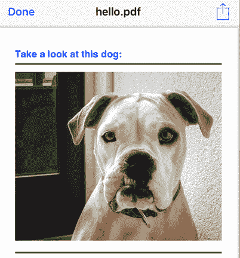
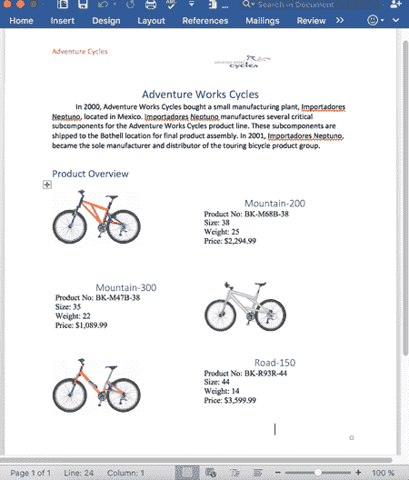
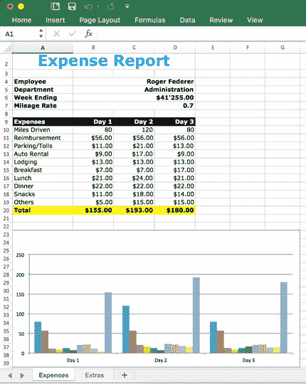

在本章中，我们将看到如何使用 Syncfusion 框架创建不同类型的文档。也就是说，我们将看到如何创建 PDF、微软 Word 和 Excel 文件。

与我们在上一章中开发的控件的区别之一是，iOS 和安卓的 Syncfusion 实现几乎相同(包括类和方法名)。由于平台特定的代码很少，这允许我们对两个平台使用相同的代码，将 Syncfusion 包装器放在共享项目中。

为了添加一个用于 PDF(可移植文档格式)文件创建的 Syncfusion 小部件，我们在 iOS 上扩展了`iOSVariable`类，在 Android 上扩展了`DroidVariable`类。查看代码清单 34 中的细节。

34:SfPdf 类的一个片段

```cs
  #if __ANDROID__
  using scripting.Droid;
  using BASE_VARIABLE = scripting.Droid.DroidVariable;
  using UTILS = scripting.Droid.UtilsDroid;
  #elif __IOS__
  using scripting.iOS;
  using BASE_VARIABLE = scripting.iOS.iOSVariable;
  using UTILS = scripting.iOS.UtilsiOS;
  #endif

  namespace scripting
  {
    public class SfPdf : BASE_VARIABLE
    {
      PdfDocument m_document;
      PdfLoadedDocument m_loadedDoc;
      PdfPage m_page;
      PdfGraphics m_grapics;
      PdfStandardFont m_font = new PdfStandardFont(
               PdfFontFamily.Helvetica, 12);

      public void Init()
      {
        if (m_document != null) {
          return;
        }
        m_document = new PdfDocument();
        m_page = m_document.Pages.Add();
        m_grapics = m_page.Graphics;
      }

      public void AddText(string text, int x, int y, PdfBrush color)
      {
        m_grapics.DrawString(text, m_font, color, x, y);
      }

      public void AddImage(string imagePath, int x, int y, int w, int h)
      {
        Stream pngImageStream = UTILS.ImageToStream(imagePath);
        PdfImage pngImage = new PdfBitmap(pngImageStream);
        m_grapics.DrawImage(pngImage, x, y, w, h);
      }

      public void AddLine(int x1, int y1, int x2, int y2,
                          PdfBrush color, float width)
      {
        PdfPen pen = new PdfPen(color, width);
        m_grapics.DrawLine(pen, x1, y1, x2, y2);
      }

      public void AddRectangle(int x, int y, int w, int h, PdfBrush color)
      {
        m_grapics.DrawRectangle(color, x, y, w, h);
      }

      public void AddPie(int x, int y, int w, int h, float startAngle,
                         float sweepAngle, PdfBrush color, float width)
      {
        PdfPen pen = new PdfPen(color, width);
        m_grapics.DrawPie(pen, x, y, w, h, startAngle, sweepAngle);
      }

      public void Save(string filename)
      {
        MemoryStream stream = new MemoryStream();
        if (m_loadedDoc != null) {
          m_loadedDoc.Save(stream);
        } else {
          Init();
          m_document.Save(stream);
          m_document.Close(true);
        }
        stream.Position = 0;
  #if __ANDROID__
        SaveAndroid.Save(filename, "application/pdf", stream);
  #elif __IOS__
        PreviewController.Save(filename, "application/pdf", stream);
  #endif
        m_document = null;
        Utils.SaveFile(filename, stream);
      }
    }
  }

```

要向解析器注册所有与 Syncfusion PDF 相关的函数，我们使用以下语句:

`ParserFunction`。寄存器功能(`"SfPdfNew"`、`new``CreatePdf`)； ``ParserFunction`。寄存器功能(` `"SfPdfOpen"`、`new``OpenPdf`)；
`ParserFunction`。寄存器功能(`"SfSetPdfText"`、`new``SetPdfText`)；
`ParserFunction`。寄存器功能(`"SfSetPdfImage"`、`new``SetPdfImage`)；
`ParserFunction`，寄存器功能(`"SfSetPdfLine"`、`new``SetPdfLine`)；
`ParserFunction`。寄存器功能(`"SfSetPdfRectangle"`、`new``SetPdfRectangle`)；
`ParserFunction`。寄存器功能(`"SfSetPdfPie"`、`new``SetPdfPie`)；
`ParserFunction`。寄存器功能(`"SfSetPdfFont"`、`new``SetPdfFont`)；
`ParserFunction`，寄存器功能(`"SfSavePdf"`、`new``SavePdf`)；

|  | 提示:所有从`ParserFunction`类派生的类都是 CSCS 解析器和我们的 C#包装器之间的粘合剂。 |

请参见代码清单 35 中的部分片段。

 35:创建的 Pdf 和设置的文本类的片段

```cs
  public class CreatePdf : ParserFunction
  {
    protected override Variable Evaluate(ParsingScript script)
    {
      List<Variable> args = script.GetFunctionArgs(); 
      Utils.CheckArgs(args.Count, 0, m_name);

      SfPdf pdf = new SfPdf(true);
      return pdf;
    }
  }

  public class SetPdfText : ParserFunction
  {
    protected override Variable Evaluate(ParsingScript script)
    {
      List<Variable> args = script.GetFunctionArgs(); 
      Utils.CheckArgs(args.Count, 3, m_name);

      SfPdf pdf = args[0] as SfPdf;
      Utils.CheckNotNull(pdf, m_name);

      string text = Utils.GetSafeString(args, 1);
      int x = Utils.GetSafeInt(args, 2);
      int y = Utils.GetSafeInt(args, 3);

      string colorStr = Utils.GetSafeString(args, 4, "black");
      PdfBrush color = SfUtils.String2PdfColor(colorStr);

      pdf.Init();
      pdf.AddText(text, x, y, color);

      ParserFunction.UpdateFunction(pdf);
      return pdf;
    }
  }

```

现在，您可以用几行 CSCS 代码创建 PDF 文件:查看代码清单 36。

 36:创建 PDF 文件的 CSCS 代码

```cs
  pdf = SfPdfNew();

  SfSetPdfFont(pdf, "Helvetica", 24, true);
  SfSetPdfText(pdf, "Take a look at this dog:", 0, 10, "blue");

  SfSetPdfLine(pdf, 0, 50, 640, 50, "green", 4);
  SfSetPdfImage(pdf, "funnyDog", 0, 70, 640, 420);
  SfSetPdfLine(pdf, 0, 520, 640, 520, "green", 4);

  SfSavePdf(pdf, "hello.pdf");

```

运行代码清单 36 的结果如图 21 所示。



 21:使用同步融合创建的示例 PDF 文件

为微软 Word 添加 Syncfusion 小部件与 PDF 小部件非常相似。参见代码清单 37 中`SfWord`类的一个片段。这个类是 Syncfusion Word 小部件的包装器。

37:SfWord 类的一个片段

```cs
  public class SfWord : BASE_VARIABLE
  {
    WordDocument m_document;
    WSection m_section;
    IWParagraph m_paragraph;

    IWTable m_table;
    WTableRow m_row;
    float m_margins;

    void Init()
    {
      if (m_document != null) {
        return;
      }
      m_document = new WordDocument();
      m_section = m_document.AddSection() as WSection;
      m_section.PageSetup.Margins.All = m_margins;
      AddStyles();
    }
    void CheckParagraph()
    {
      if (m_paragraph == null) {
        m_paragraph = m_section.AddParagraph();
      }
    }
    public void AddTable(int rows, int cols, string styleStr)
    {
      m_table = m_section.AddTable();
      m_table.ResetCells(rows, cols);
      m_table.TableFormat.Borders.BorderType =
              SfUtils.String2BorderStyle(styleStr);
      m_table.TableFormat.IsAutoResized = true;
    }
    public void AddText(string text)
    {
      CheckParagraph();
      m_paragraph.AppendText(text);
    }
  }

```

为了向解析器注册特定于单词的函数，我们使用代码清单 38 中的语句。

 38:向解析器注册同步融合单词类

```cs
  ParserFunction.RegisterFunction("SfWordNew", new CreateWord());
  ParserFunction.RegisterFunction("SfWordOpen", new OpenWord());
  ParserFunction.RegisterFunction("SfAddWordText", new AddWordText());
  ParserFunction.RegisterFunction("SfAddWordTextRange",
                                  new AddWordTextRange());
  ParserFunction.RegisterFunction("SfAddWordImage", new AddWordImage());
  ParserFunction.RegisterFunction("SfAddWordTable", new AddWordTable());
  ParserFunction.RegisterFunction("SfAddWordParagraph",
                                  new AddWordParagraph());
  ParserFunction.RegisterFunction("SfApplyWordStyle", new ApplyWordStyle());
  ParserFunction.RegisterFunction("SfSaveWord", new SaveWord());

```

我们不会展示`CreateWord()`、`OpenWord()`和其他方法的实现，因为它们与 PDF 文档的代码清单 35 非常相似。使用代码清单 38 中定义的函数，只需几行 CSCS 代码就可以轻松创建非平凡的 Word 文档。代码清单 39 包含一些 CSCS 代码来创建一个 Word 文档，该文档包含使用不同颜色、字体和样式的图像和表格。

 39:创建微软 Word 文档的 CSCS 代码

```cs
  word = SfWordNew();

  SfAddWordParagraph(word, "header");
  SfApplyWordStyle(word, "Normal2", "left");
  SfAddWordTextRange(word, "Adventure Cycles", "Calibri", 12, "red");

  SfAddWordImage(word, "AdventureCycle", 243.5, -24, "InFrontOfText",

   "Column", "Milesargin", 20, 15);
  SfAddWordParagraph(word);
  SfAddWordParagraph(word);
  SfApplyWordStyle(word, "Heading 1", "center");
  SfAddWordTextRange(word, "Adventure Works Cycles", "Calibri", 18);

  SfAddWordParagraph(word, "normal", 36);
  SfAddWordTextRange(word, "In 2000, Adventure Works Cycles bought a small manufacturing plant, Importadores Neptuno...", "Calibri", 12);

  SfAddWordParagraph(word);
  SfAddWordParagraph(word);
  SfApplyWordStyle(word, "Heading 1", "left");
  SfAddWordTextRange(word, "Product Overview", "Calibri", 16);
  SfAddWordParagraph(word);

  SfAddWordTable(word, 3, 2, "None");
  SfAddWordParagraph(word, "table", 0, 0, 0);
  SfAddWordImage(word, "Mountain200", -5, 0, "TopAndBottom",

   "Column", "Paragraph", 75, 75);
  SfAddWordParagraph(word);
  SfAddWordParagraph(word, "table", 0, 0, 1);
  SfApplyWordStyle(word, "Heading 1");
  SfAddWordText(word, "Mountain-200");
  SfAddWordParagraph(word, "table", 0, 0, 1);
  SfAddWordTextRange(word, "Product No: BK-M68B-38\n",     
                           "Times New Roman", 12);
  SfAddWordTextRange(word, "Size: 38\n", "Times New Roman", 12);
  SfAddWordTextRange(word, "Weight: 25\n", "Times New Roman", 12);
  SfAddWordTextRange(word, "Price: $2,294.99\n", "Times New Roman", 12);
  SfAddWordParagraph(word, "table", 0, 0, 1);

  SfAddWordParagraph(word, "table", 0, 1, 0);
  SfAddWordParagraph(word, "table", 0, 1, 0);
  SfApplyWordStyle(word, "Heading 1");
  SfAddWordText(word, "Mountain-300");

  SfAddWordParagraph(word, "table", 0, 1, 0);
  SfAddWordTextRange(word, "Product No: BK-M47B-38\n", 
                           "Times New Roman", 12);
  SfAddWordTextRange(word, "Size: 35\n", "Times New Roman", 12);
  SfAddWordTextRange(word, "Weight: 22\n", "Times New Roman", 12);
  SfAddWordTextRange(word, "Price: $1,089.99\n", "Times New Roman", 12);
  SfAddWordParagraph(word, "table", 0, 1, 0);

  SfAddWordParagraph(word, "table", 0, 1, 1);
  SfAddWordParagraph(word, "table", 0, 1, 1);
  SfAddWordImage(word, "Mountain300", -15, 8, "TopAndBottom",

  "Column", "Paragraph", 75, 75);
  SfAddWordParagraph(word, "table", 0, 2, 0);
  SfAddWordParagraph(word, "table", 0, 2, 0);
  SfApplyWordStyle(word, "Heading 1");
  SfAddWordImage(word, "Road550W", -5, 0, "TopAndBottom",

   "Column", "Paragraph", 75, 75);
  SfAddWordParagraph(word, "table", 0, 2, 1);
  SfApplyWordStyle(word, "Heading 1");
  SfAddWordText(word, "Road-150");
  SfAddWordParagraph(word, "table", 0, 2, 1);
  SfAddWordTextRange(word, "Product No: BK-R93R-44\n",
                           "Times New Roman", 12);
  SfAddWordTextRange(word, "Size: 44\n", "Times New Roman", 12);
  SfAddWordTextRange(word, "Weight: 14\n", "Times New Roman", 12);
  SfAddWordTextRange(word, "Price: $3,599.99\n", "Times New Roman", 12);

  SfAddWordParagraph(word, "table", 0, 2, 1);
  SfApplyWordStyle(word, "Heading 1");

  SfSaveWord(word, "hello.docx");

```

运行代码清单 39 的结果如图 22 所示。



22:CSCS 使用 Syncfusion 创建的 Word 文档

为创建微软 Excel 文件添加 Syncfusion 小部件与创建 PDF 和 Word 文件非常相似。参见代码清单 40 中`SfExcel`类的一个片段。这个类是 Syncfusion Excel 小部件的包装器。

40:SfExcel 类的一个片段

```cs
  public class SfExcel : BASE_VARIABLE
  {
    ExcelEngine m_excelEngine;
    IApplication m_application;
    IWorkbook m_workbook;
    IWorksheet m_sheet;
    int m_numberSheets;

    public void Init()
    {
      if (m_excelEngine != null) {
        return;
      }
      m_excelEngine = new ExcelEngine();
      m_application = m_excelEngine.Excel;
      m_application.DefaultVersion = ExcelVersion.Excel2013;

      m_workbook = m_application.Workbooks.Create(m_numberSheets);
      m_workbook.Version = ExcelVersion.Excel2013;

      m_sheet = m_workbook.Worksheets[0];
      m_sheet.EnableSheetCalculations();
    }
    public void AddChart(string range, string title, int top, int bottom,
                         int left, int right)
    {
      IChartShape chart = m_sheet.Charts.Add();
      chart.DataRange = m_sheet[range];
      chart.ChartTitle = title;
      chart.HasLegend = false;
      chart.TopRow = top;
      chart.LeftColumn = left;
      chart.RightColumn = right;
      chart.BottomRow = bottom;
    }
    public void AddWorksheet(string title)
    {
      m_sheet = m_workbook.Worksheets.Create(title);
    }
    public void SetWorksheetName(string title)
    {
      m_sheet.Name = title;
    }
    public void ActivateWorksheet(string title)
    {
      m_sheet = m_workbook.Worksheets[title];
    }
  }

```

代码清单 41 显示了向解析器注册特定于 Excel 的函数的语句。

 41:同步融合 Excel 类在解析器中的注册

```cs
  ParserFunction.RegisterFunction("SfExcelNew", new CreateExcel());
  ParserFunction.RegisterFunction("SfExcelOpen", new OpenExcel());
  ParserFunction.RegisterFunction("SfExcelSet", new SetExcelOption());
  ParserFunction.RegisterFunction("SfAddExcelWorksheet",
                                  new AddExcelWorksheet());
  ParserFunction.RegisterFunction("SfRenameExcelWorksheet",
                                  new RenameExcelWorksheet());
  ParserFunction.RegisterFunction("SfActivateExcelWorksheet",
                                  new ActivateExcelWorksheet());
  ParserFunction.RegisterFunction("SfAddExcelChart", new AddExcelChart());
  ParserFunction.RegisterFunction("SfSaveExcel", new SaveExcel());

```

我们不会展示`CreateExcel()`、`OpenExcel()`和其他方法的实现，因为它们与 PDF 的代码清单 35 非常相似。

使用代码清单 41 中定义的函数，只需几行 CSCS 代码就可以轻松创建非平凡的 Excel 文档。

代码清单 42 包含一些 CSCS 代码，用于使用不同的颜色、字体和样式创建带有图表和公式的 Excel 文档。

 42:创建微软 Word 文档的 CSCS 代码

```cs
  excel = SfExcelNew();

  SfRenameExcelWorksheet(excel, "Expenses");
  SfAddExcelWorksheet(excel, "Extras");

  SfExcelSet(excel, "A2", "col_width", 18);
  SfExcelSet(excel, "B2", "col_width", 12);
  SfExcelSet(excel, "C2", "col_width", 12);
  SfExcelSet(excel, "D2", "col_width", 12);

  SfExcelSet(excel, "A2:D2", "merge",  true);
  SfExcelSet(excel, "A2", "text",       "Expense Report");
  SfExcelSet(excel, "A2", "font_name",  "Verdana");
  SfExcelSet(excel, "A2", "font_color", "sky_blue");
  SfExcelSet(excel, "A2", "font_size",  28);
  SfExcelSet(excel, "A2", "bold", true);
  SfExcelSet(excel, "A2", "horizontal_alignment", "center");
  SfExcelSet(excel, "A2", "row_height",     34);

  SfExcelSet(excel, "A4", "text",           "Employee");
  SfExcelSet(excel, "B4", "text",           "Roger Federer");
  SfExcelSet(excel, "A4:B7", "font_name",   "Verdana");
  SfExcelSet(excel, "A4:B7", "font_size",   11);
  SfExcelSet(excel, "A4:B7", "bold",        true);
  SfExcelSet(excel, "A4:A7", "horizontal_alignment", "left");
  SfExcelSet(excel, "B4:B7", "horizontal_alignment", "right");

  SfExcelSet(excel, "B4:D4", "merge",       true);

  SfExcelSet(excel, "A9:D20", "font_name",  "Verdana");
  SfExcelSet(excel, "A9:D20", "font_size",  11);

  SfExcelSet(excel, "A5", "text",           "Department");
  SfExcelSet(excel, "B5", "text",           "Administration");
  SfExcelSet(excel, "B5:D5", "merge",       true);

  SfExcelSet(excel, "A6", "text",           "Week Ending");
  SfExcelSet(excel, "B6", "number_format",  "m/d/yyyy");
  SfExcelSet(excel, "B6", "date_time",      "12/12/2012");
  SfExcelSet(excel, "B6:D6", "merge",       true);

  SfExcelSet(excel, "A7", "text",           "Mileage Rate");
  SfExcelSet(excel, "B6", "number_format",  "$#,##0.00");
  SfExcelSet(excel, "B7", "number",         0.7);
  SfExcelSet(excel, "B7:D7", "merge",       true);

  SfExcelSet(excel, "A10", "text",           "Miles Driven");
  SfExcelSet(excel, "A11", "text",           "Reimbursement");
  SfExcelSet(excel, "A12", "text",           "Parking/Tolls");
  SfExcelSet(excel, "A13", "text",           "Auto Rental");
  SfExcelSet(excel, "A14", "text",           "Lodging");
  SfExcelSet(excel, "A15", "text",           "Breakfast");
  SfExcelSet(excel, "A16", "text",           "Lunch");
  SfExcelSet(excel, "A17", "text",           "Dinner");
  SfExcelSet(excel, "A18", "text",           "Snacks");
  SfExcelSet(excel, "A19", "text",           "Others");
  SfExcelSet(excel, "A20", "text",           "Total");
  SfExcelSet(excel, "A20:D20", "color",      "yellow");
  SfExcelSet(excel, "A20:D20", "font_color", "black");
  SfExcelSet(excel, "A20:D20", "bold",       true);

  SfExcelSet(excel, "B9:D9", "horizontal_alignment",     "right");
  SfExcelSet(excel, "B9:D9", "vertical_alignment",       "center");
  SfExcelSet(excel, "B9:D9", "color",                    "light_green");
  SfExcelSet(excel, "B9:D9", "bold",                     true);
  SfExcelSet(excel, "B9:D9", "font_color",               "white");

  SfExcelSet(excel, "A9", "text",           "Expenses");
  SfExcelSet(excel, "A9", "color",          "pink");
  SfExcelSet(excel, "A9", "font_color",     "white");
  SfExcelSet(excel, "A9", "bold",           true);

  SfExcelSet(excel, "B9", "text",           "Day 1");
  SfExcelSet(excel, "B10", "number",         80);
  SfExcelSet(excel, "B11", "number_format", "$#,##0.00");
  SfExcelSet(excel, "B11", "formula",       "=(B7*B10)");
  SfExcelSet(excel, "B12", "number_format",  "$#,##0.00");
  SfExcelSet(excel, "B12", "number",         "11");
  SfExcelSet(excel, "B13", "number_format",  "$#,##0.00");
  SfExcelSet(excel, "B13", "number",         "9");
  SfExcelSet(excel, "B14", "number_format",  "$#,##0.00");
  SfExcelSet(excel, "B14", "number",         "13");
  SfExcelSet(excel, "B15", "number_format",  "$#,##0.00");
  SfExcelSet(excel, "B15", "number",         "7");
  SfExcelSet(excel, "B16", "number_format",  "$#,##0.00");
  SfExcelSet(excel, "B16", "number",         "21");
  SfExcelSet(excel, "B17", "number_format",  "$#,##0.00");
  SfExcelSet(excel, "B17", "number",         "22");
  SfExcelSet(excel, "B18", "number_format",  "$#,##0.00");
  SfExcelSet(excel, "B18", "number",         "11");
  SfExcelSet(excel, "B19", "number_format",  "$#,##0.00");
  SfExcelSet(excel, "B19", "number",         "5");
  SfExcelSet(excel, "B20", "number_format",  "$#,##0.00");
  SfExcelSet(excel, "B20", "formula",        "=SUM(B11:B19)");

  SfExcelSet(excel, "C9", "text",           "Day 2");
  SfExcelSet(excel, "C10", "number",         120);
  SfExcelSet(excel, "C11", "number_format", "$#,##0.00");
  SfExcelSet(excel, "C11", "formula",       "=(B7*B10)");
  SfExcelSet(excel, "C12", "number_format",  "$#,##0.00");
  SfExcelSet(excel, "C12", "number",         "21");
  SfExcelSet(excel, "C13", "number_format",  "$#,##0.00");
  SfExcelSet(excel, "C13", "number",         "17");
  SfExcelSet(excel, "C14", "number_format",  "$#,##0.00");
  SfExcelSet(excel, "C14", "number",         "13");
  SfExcelSet(excel, "C15", "number_format",  "$#,##0.00");
  SfExcelSet(excel, "C15", "number",         "7");
  SfExcelSet(excel, "C16", "number_format",  "$#,##0.00");
  SfExcelSet(excel, "C16", "number",         "24");
  SfExcelSet(excel, "C17", "number_format",  "$#,##0.00");
  SfExcelSet(excel, "C17", "number",         "22");
  SfExcelSet(excel, "C18", "number_format",  "$#,##0.00");
  SfExcelSet(excel, "C18", "number",         "18");
  SfExcelSet(excel, "C19", "number_format",  "$#,##0.00");
  SfExcelSet(excel, "C19", "number",         "15");
  SfExcelSet(excel, "C20", "number_format",  "$#,##0.00");
  SfExcelSet(excel, "C20", "formula",        "=SUM(C11:C19)");

  SfExcelSet(excel, "D9", "text",            "Day 3");
  SfExcelSet(excel, "D10", "number",         80);
  SfExcelSet(excel, "D11", "number_format", "$#,##0.00");
  SfExcelSet(excel, "D11", "formula",       "=(B7*B10)");
  SfExcelSet(excel, "D12", "number_format",  "$#,##0.00");
  SfExcelSet(excel, "D12", "number",         "13");
  SfExcelSet(excel, "D13", "number_format",  "$#,##0.00");
  SfExcelSet(excel, "D13", "number",         "9");
  SfExcelSet(excel, "D14", "number_format",  "$#,##0.00");
  SfExcelSet(excel, "D14", "number",         "13");
  SfExcelSet(excel, "D15", "number_format",  "$#,##0.00");
  SfExcelSet(excel, "D15", "number",         "17");
  SfExcelSet(excel, "D16", "number_format",  "$#,##0.00");
  SfExcelSet(excel, "D16", "number",         "21");
  SfExcelSet(excel, "D17", "number_format",  "$#,##0.00");
  SfExcelSet(excel, "D17", "number",         "22");
  SfExcelSet(excel, "D18", "number_format",  "$#,##0.00");
  SfExcelSet(excel, "D18", "number",         "14");
  SfExcelSet(excel, "D19", "number_format",  "$#,##0.00");
  SfExcelSet(excel, "D19", "number",         "15");
  SfExcelSet(excel, "D20", "number_format",  "$#,##0.00");
  SfExcelSet(excel, "D20", "formula",        "=SUM(D11:D19)");

  SfExcelSet(excel, "A10:D10", "font_color", "dark_blue");

  SfAddExcelChart(excel, "A9:D20", "", 23, 40, 1, 8);
  SfActivateExcelWorksheet(excel, "Expenses");

  SfSaveExcel(excel, "hello.xlsx");

```

运行代码清单 42 的结果如图 23 所示。



23:CSCS 使用 Syncfusion 创建的 Excel 文档

在本章中，我们看到了如何使用 Syncfusion 框架创建 PDF、Microsoft Word 和 Excel 文档。您也可以用它创建微软的 PowerPoint 演示文稿。如果你想把幻灯片添加到 CSCS，就模仿我们在本章中所做的。

在下一章中，我们将看到如何向 CSCS 添加非图形用户界面相关的功能，特别是文本到语音和语音识别。