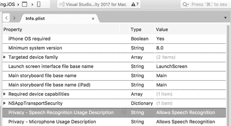
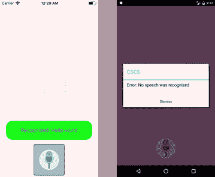

# 七、CSCS中的文本到语音和语音识别

在本章中，我们将研究一些与图形用户界面无关的功能，即 iOS 和安卓的文本到语音转换和语音识别。我们将看到，将这些功能添加到 CSCS 也非常容易。

代码清单 43 包含安卓文本到语音实现的一个片段。一些不重要的细节没有显示。

 43:安卓 TTS 实现的一个片段

```cs
  public class TTS : Java.Lang.Object, TextToSpeech.IOnInitListener,
                                       IDisposable
  {
    public static  bool   Sound { set; get; }           = true;
    public static  float  SpeechRate { set; get; }      = 1.0f;
    public static  float  Volume { set; get; }          = 0.7f;
    public static  float  PitchMultiplier { set; get; } = 1.0f;
    public static  string Voice { set; get; }           = "en-US";

    static Context   m_context;
    TextToSpeech     m_textToSpeech;
    Java.Util.Locale m_language;

    TTS(string voice)
    {
      m_language = UtilsDroid.LocaleFromString(voice, false);
      m_textToSpeech = new TextToSpeech(Application.Context,
                           this, "com.google.android.tts");
      m_textToSpeech.SetLanguage(m_language);
    }

    public void Speak(string text, bool force = false)
    {
      if (!Sound && !force) {
        return;
      }
      m_textToSpeech.Stop();

      m_textToSpeech.SetLanguage(m_language);
      m_textToSpeech.SetSpeechRate(SpeechRate);
      m_textToSpeech.SetPitch(PitchMultiplier);

      if (Build.VERSION.SdkInt >= BuildVersionCodes.Lollipop) { // API 21
        string utteranceId = text.GetHashCode() + "";
        m_textToSpeech.Speak(text, QueueMode.Flush, null, utteranceId);
      } else {
        m_textToSpeech.Speak(text, QueueMode.Flush, null);
      }
    }

    void TextToSpeech.IOnInitListener.OnInit(OperationResult status)
    {
      if (!Sound) {
        return;
      }
      if (status == OperationResult.Error) {
        m_textToSpeech.SetLanguage(Java.Util.Locale.Default);
        return;
      }
      m_textToSpeech.SetLanguage(m_language);
    }

    public static void OnTTSResult(int req, Result res, Intent data)
    {
      if (req == TTS_CHECK_DATA || req == TTS_INSTALLED_DATA) {
        IList<string> availableLanguages = data.GetStringArrayListExtra(
                      TextToSpeech.Engine.ExtraAvailableVoices);
        IList<string> unavailableLanguages = data.GetStringArrayListExtra(
                      TextToSpeech.Engine.ExtraUnavailableVoices);
        if (availableLanguages.Count <= 1 && m_context != null) {
          var installTTS = new Intent();
          installTTS.SetAction(TextToSpeech.Engine.ActionInstallTtsData);
          m_context.StartActivity(installTTS);
        }
      }
    }
  }

```

为了向解析器注册文本到语音功能，我们使用以下调用:

`ParserFunction`。寄存器功能(`"InitTTS"`、`new``InitTTSFunction`)；

`ParserFunction`。RegisterFunction( `"Speak"`、`new`、`SpeakFunction`)；

粘合类`SpeakFunction`的实现如代码清单 44 所示。

 44:朗读函数类的实现

```cs
  public class SpeakFunction : ParserFunction
  {
    protected override Variable Evaluate(ParsingScript script)
    {
      List<Variable> args = script.GetFunctionArgs(); 
      Utils.CheckArgs(args.Count, 1, m_name);

      string phrase = args[0].AsString();
      TTS.Voice     = Utils.GetSafeString(args, 1, TTS.Voice);
      bool force    = Utils.GetSafeInt(args, 2) != 0;

      TTS tts = new
  TTS(TTS.Voice);
      tts.Speak(phrase, force);

      return Variable.EmptyInstance;
    }
  } 

```

对于语音识别功能，该应用程序需要一些权限。在 iOS 上，您必须将[nsspeechecognition description](https://developer.apple.com/library/content/documentation/General/Reference/InfoPlistKeyReference/Articles/CocoaKeys.html#//apple_ref/doc/uid/TP40009251-SW52)和[NSMicrophoneUsageDescription](https://developer.apple.com/library/content/documentation/General/Reference/InfoPlistKeyReference/Articles/CocoaKeys.html#//apple_ref/doc/uid/TP40009251-SW25)键添加到您的 **Info.plist** 文件中。图 24 显示了它在 Visual Studio 中的外观。



24:iOS 平台 Info.plist 中的语音识别

在安卓系统上，我使用[语音识别器](https://developer.android.com/reference/android/speech/SpeechRecognizer.html)类进行语音识别。以下属性必须添加到您的 **AndroidManifest.xml** 文件中:

`<` `uses-permission` `android` : `name` = `"android.permission.RECORD_AUDIO"` `/>`

iOS 上语音识别的基本细节如代码清单 45 所示。

45:iOS 语音识别实现的片段

```cs
  public class STT
  {
    public Action<string> OnSpeechOK;
    public Action<string> OnSpeechError;

    static public string Voice { set; get; } = "en-US";

    static UIViewController                      m_controller;
    static AVAudioEngine                         AudioEngine;
    static SFSpeechRecognizer                    SpeechRecognizer;
    static SFSpeechAudioBufferRecognitionRequest LiveSpeechRequest;
    static SFSpeechRecognitionTask               RecognitionTask;
    static System.Timers.Timer                   m_speechTimer;

    static int m_timeout;
    static DateTime m_lastSpeech;
    static DateTime m_startSpeech;

    public static bool IsCancelled   { get; set; }
    public static bool IsRecording   { get; set; }
    public static bool SpeechEnabled { get; set; }
    public string      LastResult    { get; set; }

    public static void RequestAuthorization()
    {
      SFSpeechRecognizer.RequestAuthorization(
         (SFSpeechRecognizerAuthorizationStatus status) => {
        switch (status) {
          case SFSpeechRecognizerAuthorizationStatus.Authorized:
            SpeechEnabled = true;
            break;
          case SFSpeechRecognizerAuthorizationStatus.Denied:
            SpeechEnabled = false;
            break;
          case SFSpeechRecognizerAuthorizationStatus.NotDetermined:
            SpeechEnabled = false;
            break;
          case SFSpeechRecognizerAuthorizationStatus.Restricted:
            SpeechEnabled = true;
            break;
        }
      });
    }
    public void StartRecording(string voice, bool longTimeout = false)
    {
      if (!SpeechEnabled) {
        return;
      }
      AudioEngine = new AVAudioEngine();
      NSLocale voiceLocale = NSLocale.FromLocaleIdentifier(voice);
      SpeechRecognizer = new SFSpeechRecognizer(voiceLocale);
      LiveSpeechRequest = new SFSpeechAudioBufferRecognitionRequest();

      NSError error;
      var audioSession = AVAudioSession.SharedInstance();
      audioSession.SetCategory(AVAudioSessionCategory.Record);
      audioSession.SetMode(AVAudioSession.ModeMeasurement, out error);
      if (error != null) {
        OnSpeechError?.Invoke("Audio session error: " + error.ToString());
        return;
      }
      audioSession.SetActive(true,
          AVAudioSessionSetActiveOptions.NotifyOthersOnDeactivation);
      LiveSpeechRequest.ShouldReportPartialResults = true;

      var node = AudioEngine.InputNode;
      if (node == null) {
        OnSpeechError?.Invoke("Couldn't initialize Speech Input");
        return;
      }

      RecognitionTask = SpeechRecognizer.GetRecognitionTask(
                        LiveSpeechRequest,
                       (SFSpeechRecognitionResult result, NSError err) => {
        if (IsCancelled) {
          node.RemoveTapOnBus(0);
          return;
        }
        if (err != null) {
          OnSpeechError?.Invoke(err.ToString());
        } else if (result != null) {
          LastResult = result.BestTranscription.FormattedString;
          m_lastSpeech = DateTime.Now;
          if (result.Final) {
            OnSpeechOK?.Invoke(LastResult);
          }
        }
        if ((result != null && result.Final) || err != null) {
          IsRecording = false;
          AudioEngine.Stop();
          m_speechTimer.Close();
        }
      });

      var recordingFormat = node.GetBusOutputFormat(0);
      node.InstallTapOnBus(0, 1024, recordingFormat,
        (AVAudioPcmBuffer buffer, AVAudioTime when) => {
        LiveSpeechRequest.Append(buffer);
      });

      // Start recording
      AudioEngine.Prepare();
      AudioEngine.StartAndReturnError(out error);

      if (error != null) {
        OnSpeechError?.Invoke("Speech init error: " + error.ToString());
        IsRecording = false;
        return;
      }
      IsRecording = true;
      IsCancelled = false;
      LastResult = "";
      m_lastSpeech = DateTime.MaxValue;
      m_startSpeech = DateTime.Now;
      m_timeout = longTimeout ? m_phraseTimeout : m_wordTimeout;

      m_speechTimer = new System.Timers.Timer(250);
      m_speechTimer.AutoReset = true;
      m_speechTimer.Elapsed += (sender, e) => {
        CheckRecording();
      };
      m_speechTimer.Start();
    }
  }

```

用户被明确要求语音识别授权；这在`RequestAuthorization()`方法中处理。

我们使用下面的语句将一切与解析器联系起来:

`ParserFunction`。RegisterFunction( `"VoiceRecognition"`、`new`、`VoiceFunction`)；

`VoiceFunction`类的实现在代码清单 46 中。请注意，语音识别功能从 iOS 10.0 开始可用，因此我们在那里进行了相应的检查。这张支票也可以添加到 CSCS 代码中。

 46:语音功能类的实现

```cs
  public class VoiceFunction : ParserFunction
  {
    protected override Variable Evaluate(ParsingScript script)
    {
      List<Variable> args = script.GetFunctionArgs(); 
      Utils.CheckArgs(args.Count, 1, m_name);

      string strAction = args[0].AsString();
      STT.Voice = Utils.GetSafeString(args, 1, STT.Voice).Replace('_', '-');

      bool speechEnabled = UIDevice.CurrentDevice.CheckSystemVersion(10, 0);
      if (!speechEnabled) {
        UIVariable.GetAction(strAction, "\"" +
         string.Format(
  "Speech recognition requires iOS 10.0 or higher. You have iOS {0}",
                       UIDevice.CurrentDevice.SystemVersion) + "\"", "");
        return Variable.EmptyInstance;
      }
      UIViewController controller = AppDelegate.GetCurrentController();
      m_speech = new STT(controller);
      m_speech.OnSpeechError += (errorStr) => {
        controller.InvokeOnMainThread(() => {
          UIVariable.GetAction(strAction, "\"" + errorStr + "\"", "");
        });
      };
      m_speech.OnSpeechOK += (recognized) => {
        controller.InvokeOnMainThread(() => {
          UIVariable.GetAction(strAction, "", "\"" + recognized + "\"");
        });
      };

      m_speech.StartRecording(STT.Voice);
      return Variable.EmptyInstance;
    }
  }

```

代码清单 47 包含一个文本到语音转换和语音识别的 CSCS 例子。

47:CSCS 的文本到语音和语音识别

```cs
  AutoScale();
  SetBackground("scream");
  voice = "en-US";

  locButtonTalk = GetLocation("ROOT", "CENTER", "ROOT", "BOTTOM", 0, -10);
  AddButton(locButtonTalk, "buttonTalk", "", 200, 200);
  AddAction(buttonTalk, "talk_click");
  SetImage(buttonTalk, "microphone");

  function talk_click(sender, arg)
  {
    ShowToast("Start talking...", 5, "white", "black");
    VoiceRecognition("voice_recog", voice);
  }
  function voice_recog(errorStatus, recognized)
  {
    if (errorStatus != "") {
      AlertDialog("CSCS", "Error: " + errorStatus);
    } else {
      ShowToast("Recognized: " + recognized, 5, "blue", "green");
      Speak("You said: " + recognized, voice);
    }
  } 

```

`ShowToast()` CSCS 功能在安卓上显示了一个原生的吐司，在 iOS 上显示了一个定制的吐司(与安卓吐司非常相似)。`AlertDialog()` CSCS 函数调用 iOS 和安卓上相应的本机对话框。

运行代码清单 47 的 CSCS 代码的结果如图 25 所示。在 iOS 上，我们成功地识别出了“你好，世界！”短语，以便显示吐司，并通过文本到语音功能说出识别的短语。

在安卓系统上，语音识别失败——在安卓模拟器上设置麦克风并不那么简单。在真正的设备上，一切正常。



 25:在 iOS 和安卓上运行语音示例

在本章中，我们看到了如何向 CSCS 添加非图形用户界面相关的功能。原理不变:实现一个从`ParserFunction`类派生的类，并覆盖它的`Evaluate()`方法。

这个方法充当您想要添加到 CSCS 的所有功能的包装方法。不要忘记向 CSCS 解析器注册新创建的类。

在下一章中，我们将学习如何为您的应用添加另一个有用的功能:iOS 上的应用内购买和安卓上的应用内计费。