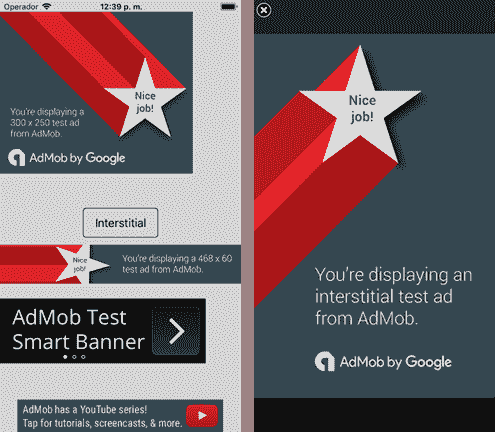
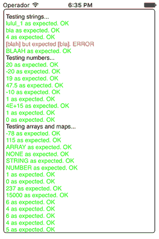

在你的应用程序中添加广告是一个很好的额外收入来源——不仅来自广告本身，还来自应用内购买项目，如果广告让用户过于恼火，这些项目会被设置为删除广告。我们在上一章看到了如何做到这一点。

有一些移动设备的广告内容提供商。我选择[谷歌 AdMob](https://www.google.com/admob/) 是因为它是最受欢迎的一个，而且它还有很好的[文档](https://firebase.google.com/docs/admob/)和一个[支持基地](https://support.google.com/admob)。

为了将 AdMob 框架插入到项目中，我在 iOS 上使用了 [Xamarin。Firebase.iOS.AdMob NuGet](https://www.nuget.org/packages/Xamarin.Firebase.iOS.AdMob/) ，在安卓系统上，我使用了 [Xamarin。谷歌游戏服务。您可以在附带的源代码中查看实现细节。](https://www.nuget.org/packages/Xamarin.GooglePlayServices.Ads.Lite/)

代码清单 50 包含显示一些 AdMob 横幅的 CSCS 代码。它还创建了一个按钮，当点击时，会显示一个间隙广告。间隙广告是垄断整个设备屏幕的全屏广告(也是迄今为止最令人恼火的广告)。

 50:在 CSCS 添加广告横幅

```
  AutoScale();
  SetBackgroundColor("gainsboro");

  if (_IOS_) {
    appId           = "ca-app-pub-5365456490909700~2128563695";
    interstitialId  = "ca-app-pub-5365456490909700/7192496494";
    bannerId        = "ca-app-pub-5365456490909700/3326095292";
  } elif (_ANDROID_) {
    appId           = "ca-app-pub-5365456490909700~8197798895";
    interstitialId  = "ca-app-pub-5365456490909700/2151265291";
    bannerId        = "ca-app-pub-5365456490909700/8058198097";
  }

  InitAds(appId, interstitialId, bannerId);

  locClickme = GetLocation("ROOT", "CENTER", "ROOT", "CENTER", 0, 20);
  AddButton(locClickme, "buttonClickme", "Interstitial", 200, 80);
  AddAction(buttonClickme,  "clickme_click");

  function clickme_click(sender, arg)
  {
    ShowInterstitial();
  }

  locAd1 = GetLocation("ROOT", "LEFT", "ROOT", "TOP", 0, 0);
  AddAdMobBanner(locAd1, "adMob1", "MediumRectangle", DisplayWidth, 500);

  locAd2 = GetLocation("ROOT", "LEFT", buttonClickme, "BOTTOM", 0, 20);
  AddAdMobBanner(locAd2, "adMob2", "FullBanner", 1024, 160);

  locAd3 = GetLocation("ROOT", "LEFT", adMob2, "BOTTOM", 0, 10);
  AddAdMobBanner(locAd3, "adMob3", "LargeBanner", DisplayWidth, 200);

  locAd4 = GetLocation("ROOT", "CENTER", "ROOT", "BOTTOM", 0, 0);
  AddAdMobBanner(locAd4, "adMob4", "Banner", DisplayWidth, 100);

```

代码清单 50 包含生产横幅和间隙标识。当你用谷歌 AdMob 注册你的应用程序时，你会得到这些身份证。对于测试，您可以使用以下标识；iOS 和安卓系统也是如此:

bannerId =`"ca-app-pub-3940256099942544/6300978111"`； `interstitialId =` `"ca-app-pub-3940256099942544/1033173712"`；

用测试标识运行代码清单 50 的结果如图 29 所示。



 29:不同横幅的谷歌广告(左)和一个间隙广告(右)

## 测试

要测试和调试 CSCS 代码，可以使用 Visual Studio 调试器来调试所有用 C#实现的 CSCS 函数。

对于在 CSCS 实现的函数，最简单的方法是使用`WriteConsole()` CSCS 方法查看问题发生的位置，并打印出变量的当前值。

我也实现了单元测试。代码在 **unitTest.cscs** 文件中。一旦我向 CSCS 添加了新特性，或者改变了现有特性，我就在 **unitTest.cscs** 中添加或修改单元测试。要运行单元测试，我只需在 **start.cscs** 中启用以下行:

汇入档案(〈t0〉)：

单元测试的输出显示在一个可滚动的文本视图中。我如下创建它:

locView = GetLocation( `"ROOT"`、`"CENTER"`、`"ROOT"`、`"TOP"`)； `AddTextView(locView,` `"textView"`、`""`、显示宽度- `30`、显示高度-`60`)；

单元测试的主要 CSCS 函数是`test()`。它的实现如代码清单 51 所示。

51:CSCS 测试功能的实现

```
  function test(x, expected)
  {
    if (x == expected) {
      AddText(textView, string(x) + " as expected. OK", "green");
      return;
    }
    if (type(expected) != "NUMBER") {
      AddText(textView, "[" + x + "] but expected [" + expected +
                        "]. ERROR", "red");
      return;
    }

    epsilon = 0.000001;
    if ((expected == 0 && abs(x) <= epsilon) ||
         abs((x - expected) / expected) <= epsilon) {
      AddText(textView, "[" + x + "] within epsilon to [" + expected +
                        "]. almost OK", "gray");
    } else {
      diff = expected - x;
      AddText(textView, "[" + x + "] but expected [" + expected +
                        "]. diff=" + diff + ". ERROR", "red");
    }
  }

```

注意`AddText()`函数的第三个参数是文本颜色。使用`test()`功能，很容易编写各种 CSCS 单元测试。

代码清单 52 显示了一些单元测试，图 30 显示了在 iPhone 模拟器上运行它们的结果。

52:CSCS 单元测试的一个片段

```
  AddText(textView, "Testing strings...");
  txt = "lu";
  txt += txt + Substring(txt, 0, 1) + "_" + 1;
  test(txt, "lulul_1");
  bb = "abc_blah;";
  c = Substring(bb, 4, 3);
  test(c, "bla");
  ind = StrIndexOf(bb, "bla");
  test(ind, 4);
  between = StrBetween(bb, "_", ";");
  test(between, "bla");
  between = StrUpper(StrReplace(between, "a", "aa"));
  test(between, "BLAAH");

  AddText(textView, "Testing numbers...");
  a=(-3+2*9)-(10-15);
  test(a, 20);
  test((a++)-(--a)-a--, -20);
  test(a, 19);
  test(((16-3)-3)+15/2*5, 47.5);
  test(1-2-3-(4-(5-(6-7)))-pow(2,3*exp(14-7*2)), -10);
  test(sin(pi/2), 1);

  x = 2.0E+15 + 3e+15 - 1.0e15;
  test(x, 4e+15);
  a=1; c=0; b=5;
  test(a||c, 1);
  test(c&&b, 0);

  AddText(textView, "Testing arrays and maps...");
  a[1][2]=22;
  a[5][3]=15;
  a[1][2]-=100;
  a[5][3]+=100;
  test(a[1][2], -78);
  test(a[5][3], 115);

  arr[2] = 10; arr[1] = "str";
  test(type(arr),    "ARRAY");
  test(type(arr[0]), "NONE");
  test(type(arr[1]), "STRING");
  test(type(arr[2]), "NUMBER");

  x["bla"]["blu"]=113;
  test(contains (x["bla"], "blu"), 1);
  test(contains (x["bla"], "bla"), 0);
  x["blabla"]["blablu"]=125;
  test(--x["bla"]["blu"] + x["blabla"]["blablu"]--, 237);

  b[5][3][5][3]=15;
  b[5][3][5][3]*=1000;
  test(b[5][3][5][3], 15000);
  test(size(b), 6);
  test(size(b[5]), 4);
  test(size(b[5][3]), 6);
  test(size(b[5][3][5]), 4);
  test(size(b[5][3][5][3]), 5);

```



30:iOS 模拟器中的单元测试文本视图

我们已经在代码清单 49 中看到了 CSCS `Localize()`函数的例子。它返回一个本地化为设备区域设置的字符串。该函数的一般签名是:

查找(文本、语言代码= AppLocale)：

您也可以在第二个`Localize()`参数中指定任何其他语言。

其他特定于本地化的 CSCS 功能包括:

GetDeviceLocale()；

setapplocale(语言代码)；

`GetDeviceLocale()`返回设备语言，`SetAppLocale()`设置语言。它不改变全局设备语言，只改变应用程序使用的语言。

要使其工作，必须手动将翻译添加到资源文件中。

在 iOS 上，翻译被添加到**languageCode.lproj/Localizable.strings**文件中(文件夹名称为， **de.lproj** ， **fr.lproj** 等)。)，而在安卓系统上，翻译被添加到**值-languageCode/Strings.xml** 文件中。

两个项目都不需要写文件:有几个[工具](https://gunhansancar.com/tools/converter/)可以从一种本地化格式转换成另一种本地化格式。另一方面，Xamarin。表单使用多个平台的 [RESX 资源文件](https://developer.xamarin.com/guides/xamarin-forms/advanced/localization/)。

## 默认值

访问和修改用户偏好的界面是 iOS 上的`NSUserDefaults`，安卓上的`ISharedPreferences`。您可以使用它来缓存用户偏好数据、保持最佳用户分数等等，以便它们在不同的程序运行之间是持久的。

CSCS 函数屏蔽了 iOS 和安卓的差异:

设置(aKey，aVariable，type = `"string"`)； `GetSetting(aKey, type =` `"string",` 默认值= `""` 或`0`)；

类型可以是以下任意一种:`string`、`int`、`long`、`bool`、`float`或`double`。如果未指定类型，则假定为字符串。在安卓系统上，`double`被视为`float`，在 iOS 系统上，`long`被视为`int`。

这里有一个在 CSCS 使用设置的例子:

SetSetting( `"myKey"`、a、`"int"`)； `a = GetSetting(``"myKey"``"int"`)；

我们之前看到`AddAction(widget, callback)` CSCS 函数将一个小部件连接到当用户点击一个小部件时调用的函数。

还有其他类型的用户事件，你可以联系到 CSCS 的一些行动。

您可以将用户滑动的事件与以下操作联系起来:

AddSwipe(小部件、类型、回调)；

类型参数可以是以下任何一个:`Left`、`Right`、`Up`或`Down`。例如:

add wipe(widget，`"Left"`、`"swipe"`)； `AddSwipe(widget,` `"Right"`、`"swipe"`；

`swipe`功能具有以下特征:

功能滑动(发送者、事件名称)

`eventName`变量是一个字符串，等于触发事件的类型参数。可以是`Left`、`Right`、`Up`或`Down`，这样你就知道发生了什么类型的刷卡。

您还可以将其他事件连接到动作。例如，当单击并按住小部件或拖放小部件时，会使用以下事件:

AddLongClick 构件，回调： `AddDragAndDrop(widget, callback);`

`AddDragAndDrop`函数的回调具有以下特征:

函数回调(sender，receiving _ widget)；

`receiving_widget`参数指定一个小部件(或以逗号分隔的小部件列表)，原始小部件被放置在该小部件上。如果没有这样的小部件，它将是空的。

它是如何实现的？每次添加(或移动)一个小部件，我们都会存储它的位置。我们还拥有从每个选项卡和父视图到放置在那里的小部件列表的映射。然后，我们只需查找原始小部件所在位置的小部件。

## 事件

一个便利的特性是能够安排将来要执行的事件。用于安排和取消活动的 CSCS 函数如下:

时间表(超时、回拨、发送方= `""`、定时器= `""`、自动恢复=`false`)；

CancelSchedule(timerId)；

如果`autoreset`参数设置为`false`，则`callback`功能只调用一次；否则将定期调用，除非调用`CancelSchedule()`函数。

该事件将在主图形用户界面线程上执行。这是通过在 iOS 上调用`UIViewController().InvokeOnMainThread()`，在安卓上调用`MainActivity.RunOnUiThread()`来实现的。

例如，我在实现一个[同步融合数字仪表](05.html#_Digital_Gauge)的例子时使用了调度:

日程(`1000`、`"timer_timeout"`、`""`、`"timerId"`、`true`)； `function timer_timeout(sender, arg)`
{
设定值(DigitalGauge，`"value"`，Now(`"HH:mm:ss"`)；
}

`timer_timeout`功能每秒调用一次(每 1000 毫秒)。它更新由`DigitalGauge`显示的时间。

在上一章中，我们看到了 CSCS 异步编程的一些例子，当时我们异步请求购买和恢复应用内购买项目。那里的 C#实现使用了`async`和`await`关键字。

在 CSCS，异步编程是通过提供回调函数来完成的。请注意，回调函数将被安排在主图形用户界面线程上(参见上一节中的含义)。所以回调不会在某件事情的“中间”被触发，而是在主 GUI 线程上的当前操作完成之后才会被触发。

我说的“原生”是指 C#。您可能有许多不想在 CSCS 重写的现有 C#代码。没有必要——从 CSCS 调用 C#代码并返回结果是可能的。

代码清单 53 包含用于编译和缓存本机调用以便后续访问的代码。由于反射、编译和缓存，只有第一次调用需要时间。后续调用所花费的时间将与直接调用 C#代码时大致相同。

 53:实现从 CSCS 调用 C#代码

```
  static Dictionary<string, Func<string, string>> m_compiledCode =
     new Dictionary<string, Func<string, string>>();

  public static Variable InvokeCall(Type type, string methodName,
                string paramName, string paramValue, object master = null)
  {
    string key = type + "_" + methodName + "_" + paramName;
    Func<string, string> func = null;

    // Cache compiled function:
    if (!m_compiledCode.TryGetValue(key, out func)) {
      MethodInfo methodInfo = type.GetMethod(methodName,
                                   new Type[] { typeof(string) });
      ParameterExpression param = Expression.Parameter(typeof(string),
                                                       paramName);
      MethodCallExpression methodCall = master == null ?
            Expression.Call(methodInfo, param) :
            Expression.Call(Expression.Constant(master), methodInfo, param);
      Expression<Func<string, string>> lambda =
          Expression.Lambda<Func<string, string>>(methodCall,
                     new ParameterExpression[] { param });
      func = lambda.Compile();
      m_compiledCode[key] = func;
    }

    string result = func(paramValue);
    return new Variable(result);
  }

```

要注册一个 CSCS 函数来调用本机代码，我们使用以下语句:

`ParserFunction`。寄存器功能(`"CallNative"`、`new``InvokeNativeFunction`)；

这里，`InvokeNativeFunction`是代码清单 53 的一个薄薄的包装。这是它发出的主要呼吁:

`var`结果= `Utils`。InvokeCall( `typeof` ( `Statics`)， `methodName, paramName, paramValue);`

CSCS 函数签名如下:

CallNative（methodName， argumentName， argumentValue）;

下面是一个从 CSCS 调用本机函数并返回结果的示例:

点击++；

title = CallNative( `"ProcessClick"`、`"arg"`、点击)；

所有的本地函数都在`Statics`类中实现，这里是`ProcessClick`方法的实现，它返回给 CSCS 一个用 C#代码创建的字符串:

`public``static``string`process click(`string`arg) `{`
`var`now =`DateTime`. now . ToString(`"T"`)；
`return``"Clicks: "`+arg+`"``\n``"`+now；
}

使用此功能，您可以继续使用任何现有的 C#代码，例如，用于数据库访问。

CSCS 是一种不断发展的语言。我不断给它添加新功能，所以定期检查源代码所在的 [GitHub 存储库](https://github.com/vassilych/mobile)。

正如我们所看到的，您可以向 CSCS 添加任何可以在 Xamarin.iOS 和 Xamarin.Android 中实现的功能。由于它们都可以实现任何 iOS 或 Android 功能，因此您也可以向 CSCS 添加任何本机平台功能。

我期待着你的反馈，看看你是如何修改 CSCS 的，你添加了什么，你创建了什么应用程序。